# API接口文档

<cite>
**本文档引用的文件**
- [openapi.yaml](file://omcgo/api/openapi/openapi.yaml)
- [auth.go](file://omcgo/internal/core/middleware/auth.go)
- [metrics.go](file://omcgo/internal/core/middleware/metrics.go)
- [logging.go](file://omcgo/internal/core/middleware/logging.go)
- [errors.go](file://omcgo/internal/core/errors/errors.go)
- [device.proto](file://omcgo/docs/go-zero-design/05-device-management.md)
- [config.proto](file://omcgo/docs/go-zero-design/04-data-model-service.md)
- [events.go](file://omcgo/pkg/tr069/events.go)
- [faults.go](file://omcgo/pkg/tr069/faults.go)
- [06-tr069-protocol-library.md](file://omcgo/docs/detailed-design/06-tr069-protocol-library.md)
- [07-acs-engine.md](file://omcgo/docs/detailed-design/07-acs-engine.md)
- [index.ts](file://omcmb/webcode/src/mock/websocket/index.ts)
- [09-real-time-updates.md](file://omcmb/design/05-interactions/09-real-time-updates.md)
- [api_sprint4_test.go](file://omcgo/test/integration/api_sprint4_test.go)
- [api_sprint5_test.go](file://omcgo/test/integration/api_sprint5_test.go)
</cite>

## 目录
1. [简介](#简介)
2. [项目结构](#项目结构)
3. [核心组件](#核心组件)
4. [架构概览](#架构概览)
5. [详细组件分析](#详细组件分析)
6. [依赖关系分析](#依赖关系分析)
7. [性能考虑](#性能考虑)
8. [故障排除指南](#故障排除指南)
9. [结论](#结论)
10. [附录](#附录)

## 简介

Baicells OMC（操作维护中心）是一个基于Go语言构建的现代化移动网络设备管理系统。该项目采用微服务架构，提供了完整的设备生命周期管理、配置同步、性能监控、告警处理等功能。

本项目的核心目标是为移动网络运营商提供一个统一的平台，用于管理各种类型的基站设备，包括4G LTE和5G NR设备。系统支持TR-069协议（CWMP），实现了与CPE设备的标准化通信。

## 项目结构

项目采用分层架构设计，主要分为以下几个层次：

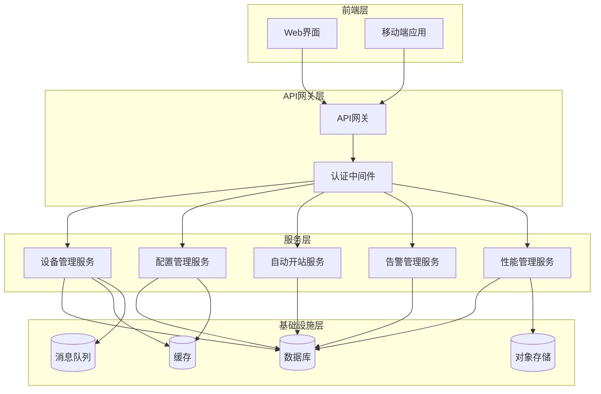

**图表来源**
- [09-project-structure.md:342-362](file://omcgo/docs/go-zero-design/09-project-structure.md#L342-L362)

**章节来源**
- [09-project-structure.md:342-362](file://omcgo/docs/go-zero-design/09-project-structure.md#L342-L362)

## 核心组件

### REST API接口

系统提供完整的REST API接口，基于OpenAPI 3.0标准定义。所有API接口都遵循统一的命名规范和响应格式。

#### 认证机制

系统采用JWT（JSON Web Token）进行身份认证，支持访问令牌和刷新令牌机制：

- **访问令牌（Access Token）**：用于API接口访问，有效期较短
- **刷新令牌（Refresh Token）**：用于获取新的访问令牌，有效期较长

#### 错误处理

系统实现了统一的错误处理机制，所有错误响应都遵循相同的格式：

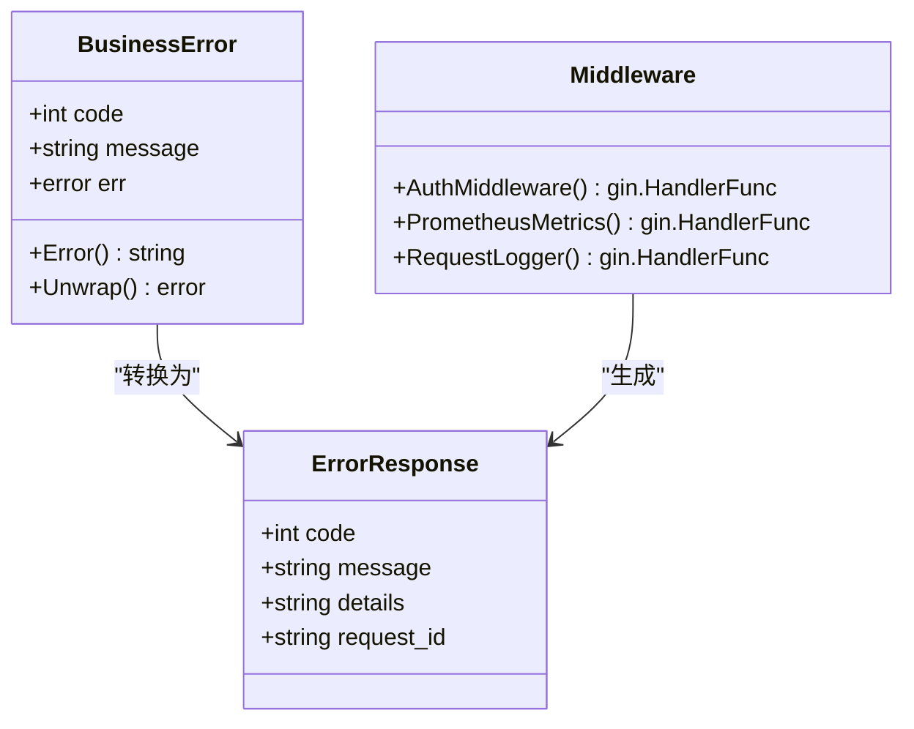

**图表来源**
- [errors.go:58-88](file://omcgo/internal/core/errors/errors.go#L58-L88)
- [auth.go:10-47](file://omcgo/internal/core/middleware/auth.go#L10-L47)

### gRPC接口

系统使用Protocol Buffers定义gRPC接口，实现了服务间的高效通信：

#### 设备管理服务（DeviceService）

```protobuf
service DeviceService {
    // ========== 设备 CRUD ==========
    rpc RegisterDevice(RegisterDeviceReq) returns (DeviceResp);
    rpc GetDevice(GetDeviceReq) returns (DeviceResp);
    rpc ListDevices(ListDevicesReq) returns (ListDevicesResp);
    rpc UpdateDevice(UpdateDeviceReq) returns (DeviceResp);
    rpc DeleteDevice(DeleteDeviceReq) returns (DeleteDeviceResp);

    // ========== 设备状态 ==========
    rpc TransitionStatus(TransitionStatusReq) returns (TransitionStatusResp);
    rpc UpdateHeartbeat(UpdateHeartbeatReq) returns (UpdateHeartbeatResp);
    rpc CheckOfflineDevices(CheckOfflineReq) returns (CheckOfflineResp);

    // ========== 设备参数 ==========
    rpc GetDeviceParameters(GetDeviceParamsReq) returns (DeviceParamsResp);
    rpc SaveDeviceParameters(SaveDeviceParamsReq) returns (SaveDeviceParamsResp);

    // ========== 拓扑管理 ==========
    rpc GetTopologyTree(GetTopologyTreeReq) returns (TopologyTreeResp);
    rpc ListGroups(ListGroupsReq) returns (ListGroupsResp);
    rpc CreateGroup(CreateGroupReq) returns (GroupResp);
    rpc UpdateGroup(UpdateGroupReq) returns (GroupResp);
    rpc DeleteGroup(DeleteGroupReq) returns (DeleteGroupResp);
    rpc AssignDeviceToGroup(AssignDeviceReq) returns (AssignDeviceResp);
    rpc RemoveDeviceFromGroup(RemoveDeviceReq) returns (RemoveDeviceResp);

    // ========== 自动开站 ==========
    rpc StartProvisioning(StartProvisioningReq) returns (ProvisioningTaskResp);
    rpc GetProvisioningTask(GetProvisioningTaskReq) returns (ProvisioningTaskResp);
    rpc ListProvisioningTasks(ListProvisioningTasksReq) returns (ListProvisioningTasksResp);
    rpc RetryProvisioning(RetryProvisioningReq) returns (ProvisioningTaskResp);
}
```

**图表来源**
- [device.proto:22-306](file://omcgo/docs/go-zero-design/05-device-management.md#L22-L306)

#### 配置管理服务（ConfigService）

```protobuf
service ConfigService {
    // ========== 数据模型解析 ==========
    rpc ResolveDataModel(ResolveDataModelReq) returns (ResolveDataModelResp);

    // ========== 数据模型 CRUD ==========
    rpc GetDataModel(GetDataModelReq) returns (DataModelResp);
    rpc ListDataModels(ListDataModelsReq) returns (ListDataModelsResp);
    rpc ImportDataModel(ImportDataModelReq) returns (ImportDataModelResp);
    rpc ActivateDataModel(ActivateDataModelReq) returns (ActivateDataModelResp);
    rpc DeprecateDataModel(DeprecateDataModelReq) returns (DeprecateDataModelResp);

    // ========== 配置模板 ==========
    rpc GetConfigTemplate(GetConfigTemplateReq) returns (ConfigTemplateResp);
    rpc MatchTemplate(MatchTemplateReq) returns (ConfigTemplateResp);
    rpc ListTemplates(ListTemplatesReq) returns (ListTemplatesResp);
    rpc CreateTemplate(CreateTemplateReq) returns (ConfigTemplateResp);
    rpc UpdateTemplate(UpdateTemplateReq) returns (ConfigTemplateResp);
    rpc DeleteTemplate(DeleteTemplateReq) returns (DeleteTemplateResp);

    // ========== OUI 注册表 ==========
    rpc ListOUI(ListOUIReq) returns (ListOUIResp);
    rpc GetOUIByCode(GetOUIByCodeReq) returns (OUIResp);
}
```

**图表来源**
- [config.proto:25-227](file://omcgo/docs/go-zero-design/04-data-model-service.md#L25-L227)

### TR-069协议接口

系统实现了完整的TR-069（CWMP）协议支持，包括以下核心RPC方法：

#### CWMP RPC方法

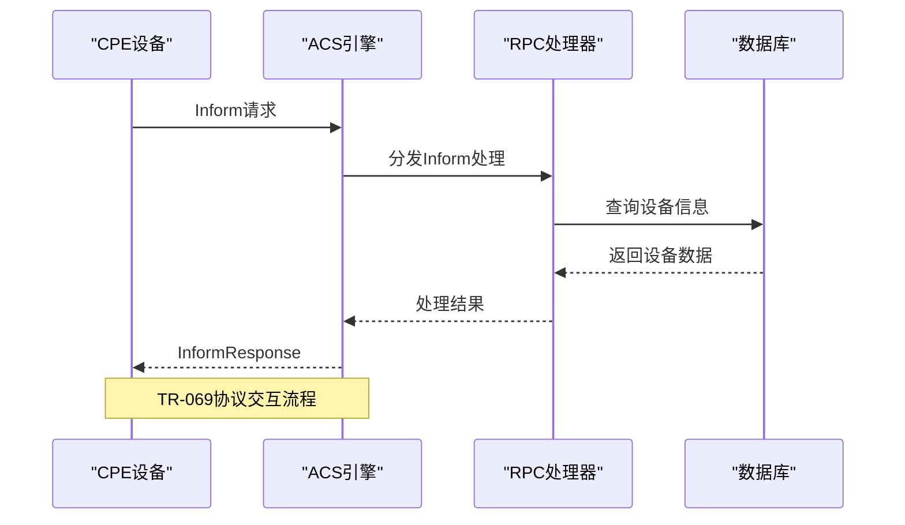

**图表来源**
- [07-acs-engine.md:364-426](file://omcgo/docs/detailed-design/07-acs-engine.md#L364-L426)

#### 事件类型定义

系统支持多种TR-069 Inform事件：

| 事件代码 | 事件名称 | 描述 |
|---------|----------|------|
| 0 BOOTSTRAP | 引导启动 | 设备首次启动或恢复连接 |
| 1 BOOT | 正常启动 | 设备正常开机 |
| 2 PERIODIC | 定期上报 | 按周期定时上报 |
| 3 SCHEDULED | 计划上报 | 按计划时间上报 |
| 4 VALUE CHANGE | 值变更 | 参数值发生变化 |
| 5 KICKED | 被踢 | 收到ACS的Kick命令 |
| 6 CONNECTION REQUEST | 连接请求 | 请求建立连接 |
| 7 TRANSFER COMPLETE | 传输完成 | 文件传输完成 |

#### 错误码定义

系统实现了TR-069标准的错误码映射：

| 错误码 | 错误名称 | 描述 |
|--------|----------|------|
| 9000 | Method not supported | 不支持的方法 |
| 9001 | Request denied | 请求被拒绝 |
| 9002 | Internal error | 内部错误 |
| 9003 | Invalid arguments | 无效参数 |
| 9004 | Resources exceeded | 资源耗尽 |
| 9005 | Invalid parameter name | 无效参数名 |
| 9006 | Invalid parameter type | 无效参数类型 |
| 9007 | Invalid parameter value | 无效参数值 |
| 9008 | Not writable | 参数不可写 |
| 9009 | Notification rejected | 通知被拒绝 |
| 9010 | Download failure | 下载失败 |
| 9011 | Upload failure | 上传失败 |
| 9012 | File transfer auth | 文件传输认证失败 |
| 9013 | File transfer protocol | 文件传输协议不支持 |

### WebSocket实时接口

系统提供了WebSocket实时通信能力，支持设备状态推送和告警通知：

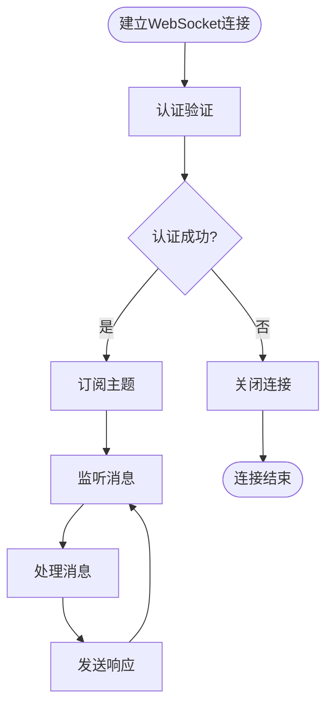

**图表来源**
- [index.ts:1-51](file://omcmb/webcode/src/mock/websocket/index.ts#L1-L51)

**章节来源**
- [index.ts:1-51](file://omcmb/webcode/src/mock/websocket/index.ts#L1-L51)
- [09-real-time-updates.md:302-341](file://omcmb/design/05-interactions/09-real-time-updates.md#L302-L341)

## 架构概览

系统采用微服务架构，通过API网关统一对外提供服务：

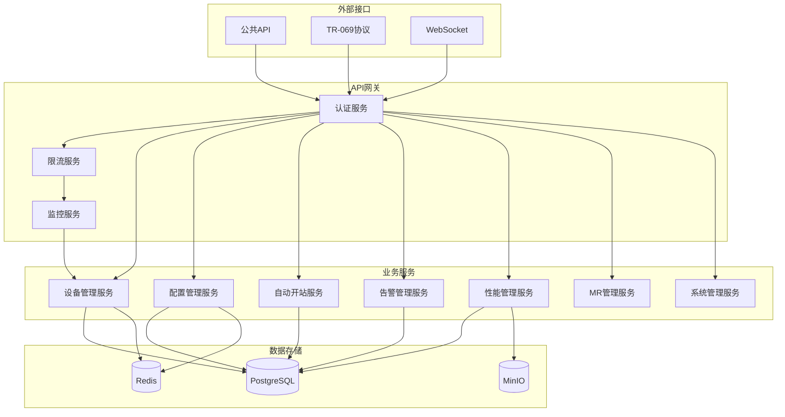

**图表来源**
- [07-acs-engine.md:364-426](file://omcgo/docs/detailed-design/07-acs-engine.md#L364-L426)

## 详细组件分析

### 设备管理API

#### 设备CRUD操作

系统提供了完整的设备生命周期管理接口：

| 接口 | 方法 | 路径 | 功能描述 |
|------|------|------|----------|
| 列出设备 | GET | `/api/v1/devices` | 获取设备列表 |
| 创建设备 | POST | `/api/v1/devices` | 创建新设备 |
| 获取设备详情 | GET | `/api/v1/devices/{id}` | 获取单个设备信息 |
| 更新设备 | PUT | `/api/v1/devices/{id}` | 更新设备信息 |
| 删除设备 | DELETE | `/api/v1/devices/{id}` | 删除设备 |
| 获取设备参数 | GET | `/api/v1/devices/{id}/parameters` | 获取设备参数列表 |
| 重启设备 | POST | `/api/v1/devices/{id}/reboot` | 重启设备 |

#### 设备状态管理

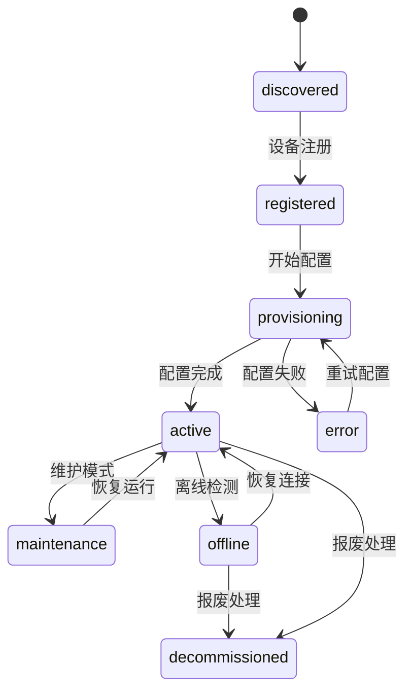

**图表来源**
- [device.proto:84-94](file://omcgo/docs/go-zero-design/05-device-management.md#L84-L94)

### 配置管理API

#### 数据模型管理

系统支持多运营商、多技术的数据模型管理：

| 接口 | 方法 | 路径 | 功能描述 |
|------|------|------|----------|
| 列出数据模型 | GET | `/api/v1/datamodels` | 获取数据模型列表 |
| 创建数据模型 | POST | `/api/v1/datamodels` | 创建新数据模型 |
| 解析数据模型 | GET | `/api/v1/datamodels/resolve` | 根据设备信息解析数据模型 |
| 获取数据模型 | GET | `/api/v1/datamodels/{id}` | 获取单个数据模型详情 |
| 更新数据模型 | PUT | `/api/v1/datamodels/{id}` | 更新数据模型 |
| 删除数据模型 | DELETE | `/api/v1/datamodels/{id}` | 删除数据模型 |
| 激活数据模型 | POST | `/api/v1/datamodels/{id}/activate` | 激活数据模型 |
| 废弃数据模型 | POST | `/api/v1/datamodels/{id}/deprecate` | 废弃数据模型 |

#### 配置模板管理

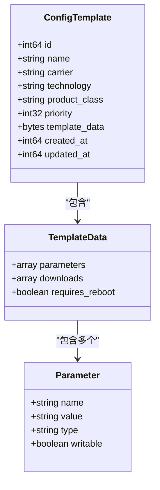

**图表来源**
- [config.proto:157-167](file://omcgo/docs/go-zero-design/04-data-model-service.md#L157-L167)

### 性能管理API

#### PM计数器管理

系统提供完整的性能管理功能：

| 接口 | 方法 | 路径 | 功能描述 |
|------|------|------|----------|
| 列出PM计数器 | GET | `/api/v1/pm/counters` | 获取PM计数器列表 |
| 获取聚合PM计数器 | GET | `/api/v1/pm/counters/aggregated` | 获取聚合PM计数器 |
| 列出KPI值 | GET | `/api/v1/pm/kpi` | 获取KPI值列表 |
| 列出KPI定义 | GET | `/api/v1/pm/kpi/definitions` | 获取KPI定义列表 |
| 触发KPI计算 | POST | `/api/v1/pm/kpi/calculate` | 触发KPI计算 |

#### KPI阈值管理

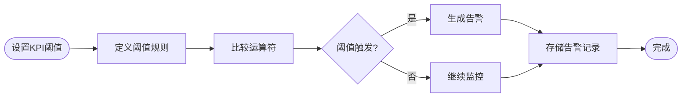

**图表来源**
- [openapi.yaml:1188-1238](file://omcgo/api/openapi/openapi.yaml#L1188-L1238)

### 告警管理API

#### 告警生命周期

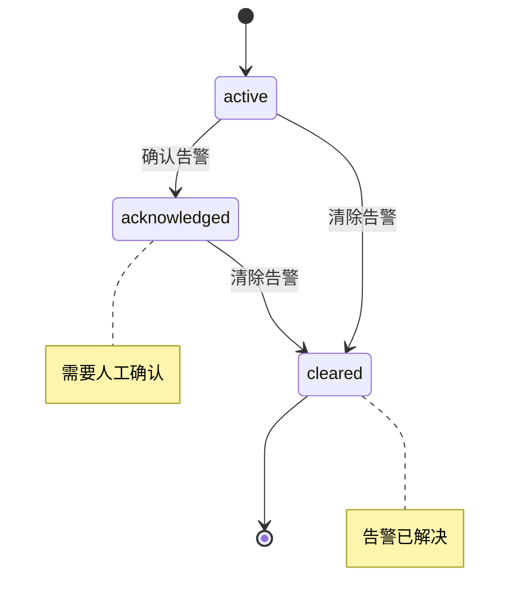

**图表来源**
- [openapi.yaml:1461-1533](file://omcgo/api/openapi/openapi.yaml#L1461-L1533)

#### 告警规则管理

系统支持基于条件的告警规则配置：

| 接口 | 方法 | 路径 | 功能描述 |
|------|------|------|----------|
| 列出告警规则 | GET | `/api/v1/alarms/rules` | 获取告警规则列表 |
| 创建告警规则 | POST | `/api/v1/alarms/rules` | 创建新告警规则 |
| 获取告警规则 | GET | `/api/v1/alarms/rules/{id}` | 获取单个告警规则详情 |
| 更新告警规则 | PUT | `/api/v1/alarms/rules/{id}` | 更新告警规则 |
| 删除告警规则 | DELETE | `/api/v1/alarms/rules/{id}` | 删除告警规则 |

### 系统管理API

#### 用户权限管理

系统实现了基于角色的访问控制（RBAC）：

| 接口 | 方法 | 路径 | 功能描述 |
|------|------|------|----------|
| 列出用户 | GET | `/api/v1/admin/users` | 获取用户列表 |
| 创建用户 | POST | `/api/v1/admin/users` | 创建新用户 |
| 获取用户 | GET | `/api/v1/admin/users/{id}` | 获取用户详情 |
| 更新用户 | PUT | `/api/v1/admin/users/{id}` | 更新用户信息 |
| 删除用户 | DELETE | `/api/v1/admin/users/{id}` | 删除用户 |
| 分配角色 | POST | `/api/v1/admin/users/{id}/roles` | 分配用户角色 |
| 移除角色 | DELETE | `/api/v1/admin/users/{id}/roles/{roleId}` | 移除用户角色 |
| 重置密码 | POST | `/api/v1/admin/users/{id}/reset-password` | 重置用户密码 |
| 锁定账户 | POST | `/api/v1/admin/users/{id}/lock` | 锁定用户账户 |
| 解锁账户 | POST | `/api/v1/admin/users/{id}/unlock` | 解锁用户账户 |

#### 审计日志

系统提供完整的审计日志功能：

| 接口 | 方法 | 路径 | 功能描述 |
|------|------|------|----------|
| 列出审计日志 | GET | `/api/v1/admin/audit-logs` | 获取审计日志列表 |
| 列出权限 | GET | `/api/v1/admin/permissions` | 获取权限列表 |
| 列出角色 | GET | `/api/v1/admin/roles` | 获取角色列表 |
| 创建角色 | POST | `/api/v1/admin/roles` | 创建新角色 |
| 获取角色 | GET | `/api/v1/admin/roles/{id}` | 获取角色详情 |
| 更新角色 | PUT | `/api/v1/admin/roles/{id}` | 更新角色信息 |
| 删除角色 | DELETE | `/api/v1/admin/roles/{id}` | 删除角色 |

**章节来源**
- [openapi.yaml:2424-2854](file://omcgo/api/openapi/openapi.yaml#L2424-L2854)

## 依赖关系分析

### 外部依赖

系统依赖以下主要外部组件：

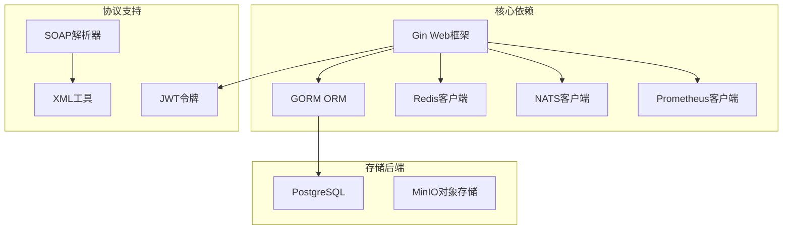

**图表来源**
- [07-acs-engine.md:394-418](file://omcgo/docs/detailed-design/07-acs-engine.md#L394-L418)

### 内部模块依赖

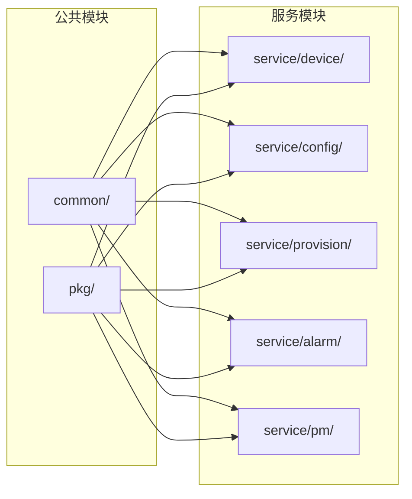

**图表来源**
- [09-project-structure.md:342-362](file://omcgo/docs/go-zero-design/09-project-structure.md#L342-L362)

**章节来源**
- [09-project-structure.md:342-362](file://omcgo/docs/go-zero-design/09-project-structure.md#L342-L362)

## 性能考虑

### 限流策略

系统实现了多层次的限流机制：

#### 设备级限流

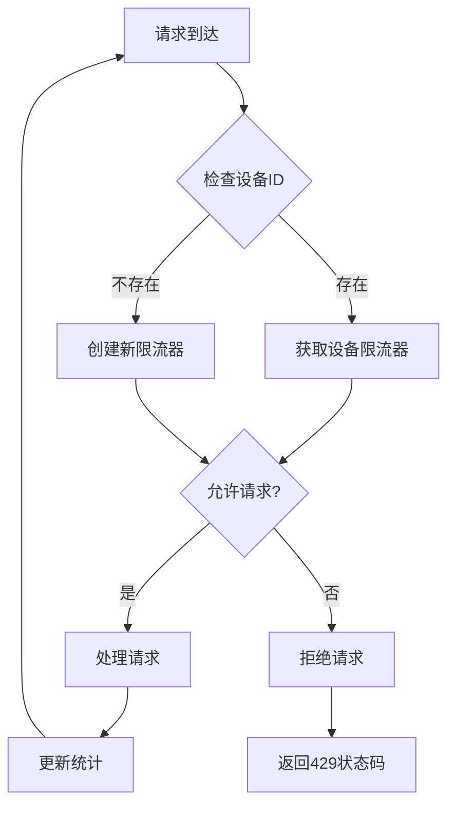

**图表来源**
- [ratelimit_test.go:50-223](file://omcgo/internal/acs/ratelimit_test.go#L50-L223)

#### 全局限流

系统支持基于IP地址的全局限流，防止恶意请求攻击。

### 监控指标

系统集成了Prometheus监控，提供以下关键指标：

| 指标名称 | 类型 | 描述 |
|----------|------|------|
| http_requests_total | Counter | HTTP请求总数 |
| http_request_duration_seconds | Histogram | HTTP请求持续时间 |
| device_count | Gauge | 在线设备数量 |
| alarm_count | Gauge | 活跃告警数量 |
| config_sync_status | Gauge | 配置同步状态 |

**章节来源**
- [metrics.go:11-50](file://omcgo/internal/core/middleware/metrics.go#L11-L50)

## 故障排除指南

### 常见错误处理

系统实现了统一的错误处理机制：

#### 错误响应格式

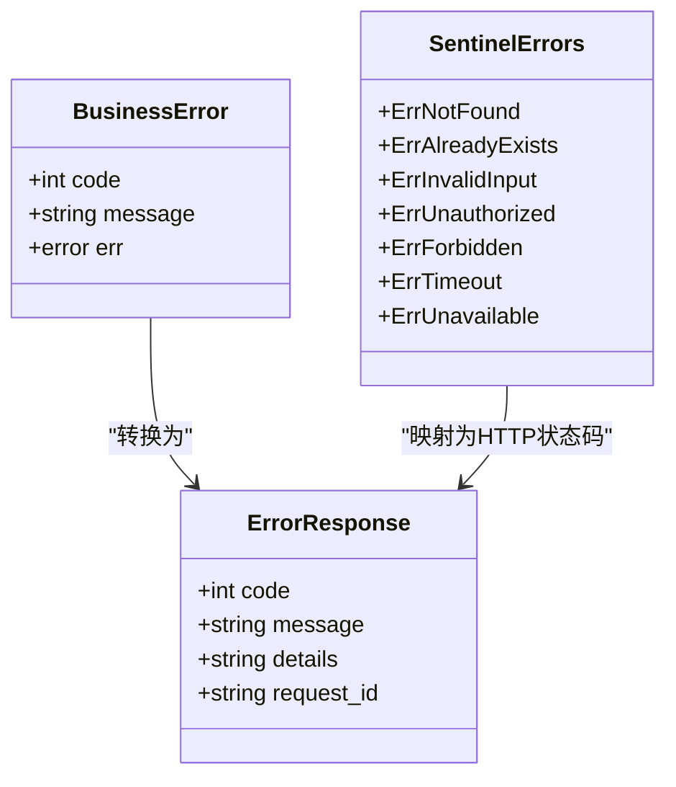

**图表来源**
- [errors.go:58-110](file://omcgo/internal/core/errors/errors.go#L58-L110)

#### 错误码映射

| 业务错误 | HTTP状态码 | 描述 |
|----------|------------|------|
| ErrNotFound | 404 | 资源未找到 |
| ErrAlreadyExists | 409 | 资源已存在 |
| ErrInvalidInput | 400 | 输入参数无效 |
| ErrUnauthorized | 401 | 未授权访问 |
| ErrForbidden | 403 | 禁止访问 |
| ErrTimeout | 504 | 请求超时 |
| ErrUnavailable | 503 | 服务不可用 |

### 调试建议

#### 启用详细日志

```go
// 设置日志级别
logger, _ := zap.NewDevelopment()

// 添加请求ID
router.Use(middleware.RequestLogger(logger))
```

#### 性能监控

```go
// 注册Prometheus指标
router.Use(middleware.PrometheusMetrics())

// 查看指标
// curl http://localhost:8080/metrics
```

**章节来源**
- [logging.go:11-35](file://omcgo/internal/core/middleware/logging.go#L11-L35)
- [api_sprint4_test.go:135-190](file://omcgo/test/integration/api_sprint4_test.go#L135-L190)
- [api_sprint5_test.go:137-182](file://omcgo/test/integration/api_sprint5_test.go#L137-L182)

## 结论

Baicells OMC项目提供了一个功能完整、架构清晰的移动网络设备管理系统。系统采用了现代化的技术栈和设计模式，具有以下特点：

### 技术优势

1. **微服务架构**：采用分层设计，服务间职责明确，便于维护和扩展
2. **协议兼容性**：完整支持TR-069/CWMP协议，确保与各类CPE设备的兼容性
3. **统一接口**：提供REST API和gRPC两种接口形式，满足不同场景需求
4. **安全可靠**：实现JWT认证、RBAC权限控制和完善的审计日志
5. **可观测性**：集成Prometheus监控，提供完整的性能指标

### 扩展性考虑

系统设计充分考虑了未来的扩展需求：
- 支持多运营商、多技术标准
- 模块化设计便于功能扩展
- 事件驱动架构支持异步处理
- 缓存机制提升系统性能

### 最佳实践

开发者在使用本系统时应遵循以下最佳实践：
1. 始终使用JWT令牌进行API认证
2. 合理设置限流参数，避免系统过载
3. 利用监控指标及时发现性能问题
4. 通过审计日志追踪用户操作
5. 遵循RESTful设计原则，保持接口一致性

该系统为移动网络运营商提供了一个强大而灵活的管理平台，能够有效提升网络运维效率和管理水平。

## 附录

### API使用示例

#### 基本认证流程

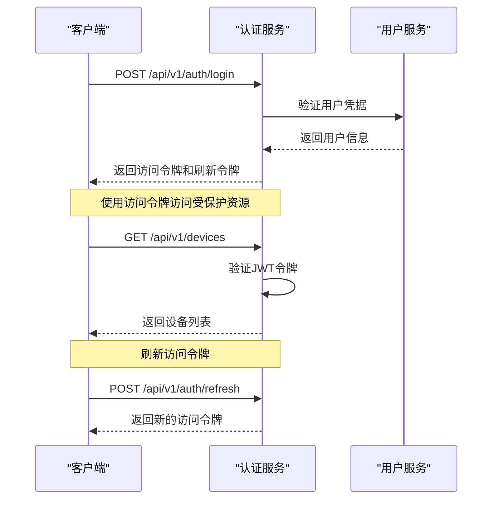

**图表来源**
- [openapi.yaml:84-139](file://omcgo/api/openapi/openapi.yaml#L84-L139)

### SDK集成指南

#### Go语言SDK

```go
// 初始化客户端
client := NewOMCClient("http://localhost:8080", "your-access-token")

// 获取设备列表
devices, err := client.ListDevices(context.Background(), &ListDevicesReq{
    Page: 1,
    PageSize: 20,
})

// 创建设备
device, err := client.CreateDevice(context.Background(), &CreateDeviceReq{
    SerialNumber: "ABC123",
    OUI: "00259E",
    Carrier: "cmcc",
    Technology: "lte",
})
```

#### JavaScript SDK

```javascript
// 安装依赖
npm install axios

// 基本使用
const client = new OMCAPI('http://localhost:8080')

// 登录获取令牌
await client.login('username', 'password')

// 获取设备信息
const devices = await client.getDevices({
    page: 1,
    pageSize: 20
})
```

### 部署建议

#### 生产环境配置

1. **负载均衡**：使用Nginx或HAProxy进行流量分发
2. **数据库优化**：配置适当的连接池和索引
3. **缓存策略**：合理设置Redis缓存过期时间
4. **监控告警**：配置Prometheus和Grafana监控面板
5. **日志管理**：使用ELK Stack进行日志收集和分析

#### 安全配置

1. **HTTPS**：启用TLS加密传输
2. **CORS**：配置跨域访问策略
3. **速率限制**：设置合理的API限流参数
4. **输入验证**：对所有用户输入进行严格验证
5. **权限控制**：实施最小权限原则