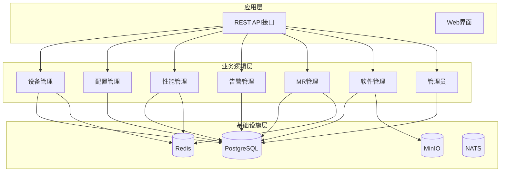
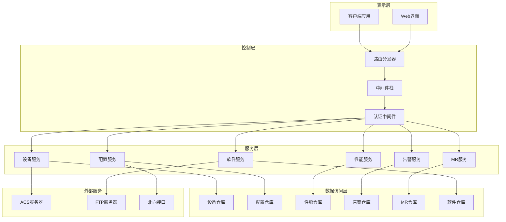
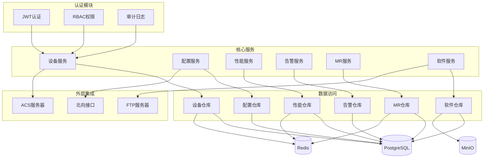

# REST API接口

<cite>
**本文档引用的文件**
- [omcgo/api/openapi/openapi.yaml](file://omcgo/api/openapi/openapi.yaml)
- [omcgo/cmd/app/router/router.go](file://omcgo/cmd/app/router/router.go)
- [omcgo/internal/northbound/router.go](file://omcgo/internal/northbound/router.go)
- [omcgo/internal/device/handler.go](file://omcgo/internal/device/handler.go)
- [omcgo/internal/pm/handler.go](file://omcgo/internal/pm/handler.go)
- [omcgo/internal/alarm/handler.go](file://omcgo/internal/alarm/handler.go)
- [omcgo/internal/mr/handler.go](file://omcgo/internal/mr/handler.go)
- [omcgo/internal/software/handler.go](file://omcgo/internal/software/handler.go)
- [omcgo/internal/config/template/handler.go](file://omcgo/internal/config/template/handler.go)
</cite>

## 目录
1. [简介](#简介)
2. [项目结构](#项目结构)
3. [核心组件](#核心组件)
4. [架构概览](#架构概览)
5. [详细组件分析](#详细组件分析)
6. [依赖分析](#依赖分析)
7. [性能考虑](#性能考虑)
8. [故障排除指南](#故障排除指南)
9. [结论](#结论)

## 简介

Baicells OMC（操作维护中心）项目是一个基于Go语言开发的基站设备管理系统。本项目提供了完整的REST API接口，用于设备管理、配置管理、性能管理、告警管理、软件管理、MR管理等多个核心功能模块。

该系统采用现代化的微服务架构，使用Gin作为Web框架，PostgreSQL作为主数据库，Redis作为缓存层，MinIO作为对象存储，支持JWT认证和RBAC权限控制。系统通过OpenAPI 3.0规范定义了完整的API接口文档，确保了接口的一致性和可维护性。

## 项目结构

项目采用模块化设计，按照功能领域进行组织：



**图表来源**
- [omcgo/cmd/app/router/router.go:45-348](file://omcgo/cmd/app/router/router.go#L45-L348)

**章节来源**
- [omcgo/cmd/app/router/router.go:45-348](file://omcgo/cmd/app/router/router.go#L45-L348)

## 核心组件

### 认证与授权

系统采用JWT（JSON Web Token）进行用户认证，支持访问令牌和刷新令牌机制：

- **认证方式**: Bearer Token（JWT）
- **令牌类型**: Access Token（短期）+ Refresh Token（长期）
- **权限控制**: RBAC（基于角色的访问控制）
- **审计日志**: 完整的操作审计跟踪

### 中间件体系

系统集成了多种中间件来增强功能：

- **CORS中间件**: 处理跨域请求
- **请求日志中间件**: 记录所有HTTP请求
- **Prometheus指标中间件**: 收集系统性能指标
- **统一错误处理**: 标准化的错误响应格式

### 数据存储架构

- **主数据库**: PostgreSQL（结构化数据存储）
- **缓存层**: Redis（会话、配置、临时数据）
- **对象存储**: MinIO（文件、日志、备份数据）
- **消息队列**: NATS（事件驱动架构）

**章节来源**
- [omcgo/api/openapi/openapi.yaml:2862-2866](file://omcgo/api/openapi/openapi.yaml#L2862-L2866)
- [omcgo/cmd/app/router/router.go:149-178](file://omcgo/cmd/app/router/router.go#L149-L178)

## 架构概览

系统采用分层架构设计，确保各层职责清晰：



**图表来源**
- [omcgo/cmd/app/router/router.go:45-348](file://omcgo/cmd/app/router/router.go#L45-L348)

## 详细组件分析

### 设备管理模块

设备管理模块提供完整的设备生命周期管理功能：

#### 核心接口

| 接口 | 方法 | 路径 | 描述 |
|------|------|------|------|
| 列出设备 | GET | `/api/v1/devices` | 获取设备列表，支持分页和过滤 |
| 创建设备 | POST | `/api/v1/devices` | 创建新设备 |
| 获取设备详情 | GET | `/api/v1/devices/{id}` | 获取指定设备的详细信息 |
| 更新设备 | PUT | `/api/v1/devices/{id}` | 更新设备信息 |
| 删除设备 | DELETE | `/api/v1/devices/{id}` | 删除设备 |
| 获取设备参数 | GET | `/api/v1/devices/{id}/parameters` | 获取设备参数列表 |
| 重启设备 | POST | `/api/v1/devices/{id}/reboot` | 向设备发送重启命令 |

#### 请求参数示例

**创建设备请求体**:
```json
{
  "serial_number": "ABC123456",
  "oui": "00259E",
  "product_class": "EUTRANCELL",
  "manufacturer": "Baicells",
  "model_name": "NB8800",
  "carrier": "CMCC",
  "technology": "LTE",
  "site_name": "站点A",
  "site_id": "SITE001",
  "latitude": 39.9042,
  "longitude": 116.4074
}
```

**更新设备请求体**:
```json
{
  "site_name": "新站点名称",
  "site_id": "SITE002",
  "model_name": "NB8800-E",
  "latitude": 39.9043,
  "longitude": 116.4075,
  "status": "online"
}
```

#### 响应格式

**设备对象结构**:
```json
{
  "id": "550e8400-e29b-41d4-a716-446655440000",
  "serial_number": "ABC123456",
  "oui": "00259E",
  "product_class": "EUTRANCELL",
  "manufacturer": "Baicells",
  "model": "NB8800",
  "hardware_version": "V2.0",
  "software_version": "V3.2.1",
  "carrier": "CMCC",
  "technology": "LTE",
  "status": "online",
  "ip_address": "192.168.1.100",
  "last_contact": "2026-01-15T10:30:00Z",
  "created_at": "2026-01-01T00:00:00Z",
  "updated_at": "2026-01-15T10:30:00Z"
}
```

**章节来源**
- [omcgo/internal/device/handler.go:22-35](file://omcgo/internal/device/handler.go#L22-L35)
- [omcgo/internal/device/handler.go:62-108](file://omcgo/internal/device/handler.go#L62-L108)
- [omcgo/api/openapi/openapi.yaml:158-294](file://omcgo/api/openapi/openapi.yaml#L158-L294)

### 性能管理模块

性能管理模块负责收集、存储和查询网络性能指标数据：

#### 核心接口

| 接口 | 方法 | 路径 | 描述 |
|------|------|------|------|
| 列出计数器 | GET | `/api/v1/pm/counters` | 获取性能计数器数据 |
| 聚合计数器 | GET | `/api/v1/pm/counters/aggregated` | 获取聚合后的计数器数据 |
| 列出KPI值 | GET | `/api/v1/pm/kpi` | 获取KPI指标值 |
| 列出KPI定义 | GET | `/api/v1/pm/kpi/definitions` | 获取KPI定义列表 |
| 计算KPI | POST | `/api/v1/pm/kpi/calculate` | 触发KPI计算任务 |
| 列出性能任务 | GET | `/api/v1/pm/tasks` | 获取性能任务列表 |
| 创建性能任务 | POST | `/api/v1/pm/tasks` | 创建新的性能任务 |
| 列出PM文件 | GET | `/api/v1/pm/files` | 获取PM文件列表 |
| 下载PM文件 | GET | `/api/v1/pm/files/{id}/download` | 下载PM文件 |

#### 请求参数示例

**KPI计算请求体**:
```json
{
  "device_id": "550e8400-e29b-41d4-a716-446655440000",
  "cell_id": "CELL001",
  "start_time": "2026-01-15T00:00:00Z",
  "end_time": "2026-01-15T01:00:00Z",
  "carrier": "CMCC",
  "technology": "LTE"
}
```

**章节来源**
- [omcgo/internal/pm/handler.go:35-49](file://omcgo/internal/pm/handler.go#L35-L49)
- [omcgo/internal/pm/handler.go:61-102](file://omcgo/internal/pm/handler.go#L61-L102)
- [omcgo/api/openapi/openapi.yaml:1059-1238](file://omcgo/api/openapi/openapi.yaml#L1059-L1238)

### 告警管理模块

告警管理模块提供完整的告警生命周期管理：

#### 核心接口

| 接口 | 方法 | 路径 | 描述 |
|------|------|------|------|
| 列出活动告警 | GET | `/api/v1/alarms/active` | 获取当前活动告警列表 |
| 列出历史告警 | GET | `/api/v1/alarms/history` | 获取告警历史记录 |
| 获取告警统计 | GET | `/api/v1/alarms/statistics` | 获取告警统计信息 |
| 获取告警详情 | GET | `/api/v1/alarms/{id}` | 获取指定告警的详细信息 |
| 确认告警 | POST | `/api/v1/alarms/{id}/acknowledge` | 确认告警 |
| 清除告警 | POST | `/api/v1/alarms/{id}/clear` | 清除告警 |

#### 告警对象结构

```json
{
  "id": "550e8400-e29b-41d4-a716-446655440000",
  "alarm_code": "ALM001",
  "alarm_name": "信号丢失",
  "device_id": "550e8400-e29b-41d4-a716-446655440001",
  "device_sn": "ABC123456",
  "carrier": "CMCC",
  "severity": "major",
  "status": "active",
  "description": "检测到小区信号丢失告警",
  "source": "性能监控",
  "raised_at": "2026-01-15T10:30:00Z",
  "acknowledged_at": null,
  "acknowledged_by": null,
  "cleared_at": null,
  "cleared_by": null
}
```

**章节来源**
- [omcgo/internal/alarm/handler.go:26-37](file://omcgo/internal/alarm/handler.go#L26-L37)
- [omcgo/internal/alarm/handler.go:50-90](file://omcgo/internal/alarm/handler.go#L50-L90)
- [omcgo/api/openapi/openapi.yaml:1358-1533](file://omcgo/api/openapi/openapi.yaml#L1358-L1533)

### MR管理模块

MR（Measurement Report）管理模块专门处理测量报告数据：

#### 核心接口

| 接口 | 方法 | 路径 | 描述 |
|------|------|------|------|
| 列出MR文件 | GET | `/api/v1/mr/files` | 获取MR文件列表 |
| 下载MR文件 | GET | `/api/v1/mr/files/{id}/download` | 下载MR文件 |
| 查询MR数据 | GET | `/api/v1/mr/data` | 查询MR记录数据 |
| 列出指标 | GET | `/api/v1/mr/indicators` | 获取MR指标列表 |
| 列出所有指标 | GET | `/api/v1/mr/indicators/all` | 获取所有MR指标 |
| 获取指标统计 | GET | `/api/v1/mr/indicators/{code}/stats` | 获取指标统计信息 |
| 列出映射关系 | GET | `/api/v1/mr/mappings` | 获取设备映射关系列表 |
| 更新映射关系 | PUT | `/api/v1/mr/mappings/{id}` | 更新设备映射关系 |
| 切换映射状态 | PUT | `/api/v1/mr/mappings/{id}/toggle` | 切换映射关系启用状态 |
| 导出MR数据 | POST | `/api/v1/mr/export` | 导出MR数据 |

#### MR文件对象结构

```json
{
  "id": "550e8400-e29b-41d4-a716-446655440000",
  "device_id": "550e8400-e29b-41d4-a716-446655440001",
  "device_sn": "ABC123456",
  "file_name": "MR_20260115.xml",
  "file_type": "MR",
  "file_size": 1048576,
  "parsed": true,
  "record_count": 1500,
  "uploaded_at": "2026-01-15T10:30:00Z"
}
```

**章节来源**
- [omcgo/internal/mr/handler.go:32-48](file://omcgo/internal/mr/handler.go#L32-L48)
- [omcgo/internal/mr/handler.go:58-95](file://omcgo/internal/mr/handler.go#L58-L95)
- [omcgo/api/openapi/openapi.yaml:1775-1894](file://omcgo/api/openapi/openapi.yaml#L1775-L1894)

### 软件管理模块

软件管理模块负责固件版本管理和升级任务：

#### 核心接口

| 接口 | 方法 | 路径 | 描述 |
|------|------|------|------|
| 列出固件 | GET | `/api/v1/firmware` | 获取固件版本列表 |
| 上传固件 | POST | `/api/v1/firmware` | 上传新的固件版本 |
| 获取固件 | GET | `/api/v1/firmware/{id}` | 获取固件详细信息 |
| 删除固件 | DELETE | `/api/v1/firmware/{id}` | 删除固件版本 |
| 列出升级任务 | GET | `/api/v1/upgrades` | 获取升级任务列表 |
| 获取升级任务 | GET | `/api/v1/upgrades/{id}` | 获取升级任务详情 |
| 触发升级 | POST | `/api/v1/upgrades` | 触发单个设备升级 |
| 批量升级 | POST | `/api/v1/upgrades/batch` | 触发批量升级任务 |
| 取消升级 | POST | `/api/v1/upgrades/{id}/cancel` | 取消升级任务 |

#### 固件版本对象结构

```json
{
  "id": "550e8400-e29b-41d4-a716-446655440000",
  "version": "V3.2.1",
  "carrier": "CMCC",
  "product_class": "EUTRANCELL",
  "file_name": "firmware_nb8800_v3.2.1.bin",
  "file_size": 52428800,
  "checksum": "a1b2c3d4e5f6...",
  "description": "LTE NB8800固件更新包",
  "created_at": "2026-01-01T00:00:00Z"
}
```

**章节来源**
- [omcgo/internal/software/handler.go:32-45](file://omcgo/internal/software/handler.go#L32-L45)
- [omcgo/internal/software/handler.go:47-60](file://omcgo/internal/software/handler.go#L47-L60)
- [omcgo/api/openapi/openapi.yaml:1898-2093](file://omcgo/api/openapi/openapi.yaml#L1898-L2093)

### 配置模板管理模块

配置模板管理模块提供标准化的设备配置模板管理：

#### 核心接口

| 接口 | 方法 | 路径 | 描述 |
|------|------|------|------|
| 列出模板 | GET | `/api/v1/config/templates` | 获取配置模板列表 |
| 创建模板 | POST | `/api/v1/config/templates` | 创建新的配置模板 |
| 获取模板 | GET | `/api/v1/config/templates/{id}` | 获取模板详细信息 |
| 更新模板 | PUT | `/api/v1/config/templates/{id}` | 更新配置模板 |
| 删除模板 | DELETE | `/api/v1/config/templates/{id}` | 删除配置模板 |

#### 配置模板对象结构

```json
{
  "id": "550e8400-e29b-41d4-a716-446655440000",
  "name": "LTE基础配置模板",
  "description": "适用于LTE宏站的基础配置模板",
  "carrier": "CMCC",
  "technology": "LTE",
  "content": {
    "network": {
      "plmn": "46001",
      "band": "3",
      "earfcn": 1234
    },
    "radio": {
      "pdsch_config": {
        "mcs": 28,
        "rb_alloc": "dynamic"
      }
    }
  },
  "version": "1.0",
  "created_at": "2026-01-01T00:00:00Z",
  "updated_at": "2026-01-15T10:30:00Z"
}
```

**章节来源**
- [omcgo/internal/config/template/handler.go:22-32](file://omcgo/internal/config/template/handler.go#L22-L32)
- [omcgo/internal/config/template/handler.go:34-69](file://omcgo/internal/config/template/handler.go#L34-L69)
- [omcgo/api/openapi/openapi.yaml:636-738](file://omcgo/api/openapi/openapi.yaml#L636-L738)

### 北向接口模块

北向接口模块提供与外部系统的数据交换能力：

#### 核心接口

| 接口 | 方法 | 路径 | 描述 |
|------|------|------|------|
| 列出推送目标 | GET | `/api/v1/northbound/push/targets` | 获取推送目标列表 |
| 创建推送目标 | POST | `/api/v1/northbound/push/targets` | 创建新的推送目标 |
| 删除推送目标 | DELETE | `/api/v1/northbound/push/targets/{id}` | 删除推送目标 |
| 获取全量同步数据 | GET | `/api/v1/northbound/sync/full` | 获取全量同步数据 |
| 获取增量同步数据 | GET | `/api/v1/northbound/sync/incremental` | 获取增量同步数据 |
| 导出性能数据 | POST | `/api/v1/northbound/export/pm` | 导出性能数据 |
| 导出告警数据 | POST | `/api/v1/northbound/export/alarms` | 导出告警数据 |
| 导出设备配置 | GET | `/api/v1/northbound/export/config/{deviceId}` | 导出设备配置 |

#### 推送目标对象结构

```json
{
  "id": "550e8400-e29b-41d4-a716-446655440000",
  "name": "OSS系统",
  "type": "http",
  "url": "https://oss.example.com/api/data",
  "auth_type": "bearer",
  "enabled": true,
  "data_types": ["alarm", "pm", "config"],
  "created_at": "2026-01-01T00:00:00Z",
  "updated_at": "2026-01-15T10:30:00Z"
}
```

**章节来源**
- [omcgo/api/openapi/openapi.yaml:2239-2394](file://omcgo/api/openapi/openapi.yaml#L2239-L2394)
- [omcgo/internal/northbound/router.go:38-56](file://omcgo/internal/northbound/router.go#L38-L56)

## 依赖分析

系统采用模块化依赖设计，各模块之间通过清晰的接口进行通信：



**图表来源**
- [omcgo/cmd/app/router/router.go:59-130](file://omcgo/cmd/app/router/router.go#L59-L130)

**章节来源**
- [omcgo/cmd/app/router/router.go:59-130](file://omcgo/cmd/app/router/router.go#L59-L130)

## 性能考虑

### 缓存策略

系统采用多层缓存策略来提升性能：

- **Redis缓存**: 会话信息、配置数据、频繁查询结果
- **数据库连接池**: 最大化数据库连接复用
- **静态资源缓存**: CDN加速静态文件访问

### 异步处理

对于耗时操作采用异步处理模式：

- **升级任务**: 异步执行固件升级
- **数据导出**: 异步生成和传输大数据文件
- **性能计算**: 异步计算复杂的KPI指标

### 监控指标

系统内置完善的监控指标：

- **请求延迟**: 各接口的响应时间统计
- **错误率**: API调用失败率监控
- **资源使用**: CPU、内存、磁盘使用情况
- **数据库性能**: 查询执行时间和连接数

## 故障排除指南

### 常见错误码

| 错误码 | 描述 | 原因 | 解决方案 |
|--------|------|------|----------|
| 400 | 请求参数错误 | 参数格式不正确或缺失 | 检查请求参数格式和必填字段 |
| 401 | 未授权 | JWT令牌无效或过期 | 重新登录获取有效令牌 |
| 403 | 权限不足 | 用户权限不够 | 联系管理员分配相应权限 |
| 404 | 资源不存在 | 请求的资源ID不存在 | 确认资源ID是否正确 |
| 429 | 请求过于频繁 | 达到速率限制 | 等待后重试或调整请求频率 |
| 500 | 服务器内部错误 | 系统异常 | 查看服务器日志并重试 |

### 调试技巧

1. **启用详细日志**: 在开发环境中开启详细的请求日志
2. **使用Postman**: 测试各种边界条件和错误场景
3. **监控指标**: 关注关键性能指标的变化
4. **数据库查询**: 使用EXPLAIN分析慢查询

### 常见问题解决

**JWT令牌过期**:
- 使用刷新令牌获取新的访问令牌
- 检查服务器时间设置
- 确保客户端时间同步

**数据库连接超时**:
- 检查数据库连接池配置
- 优化慢查询语句
- 增加数据库连接数

**文件上传失败**:
- 检查文件大小限制
- 验证存储空间
- 确认MIME类型支持

**章节来源**
- [omcgo/api/openapi/openapi.yaml:2917-2945](file://omcgo/api/openapi/openapi.yaml#L2917-L2945)

## 结论

Baicells OMC项目提供了完整的企业级REST API接口解决方案，涵盖了现代网络管理系统的核心需求。系统采用模块化设计，具有良好的扩展性和维护性。

主要特点包括：

1. **完整的功能覆盖**: 涵盖设备管理、配置管理、性能监控、告警处理、软件升级、MR分析等核心功能
2. **现代化的技术栈**: 基于Go语言和微服务架构，具备良好的性能和可扩展性
3. **完善的认证授权**: 支持JWT认证和RBAC权限控制
4. **标准化的API设计**: 采用OpenAPI 3.0规范，确保接口的一致性和可维护性
5. **丰富的监控指标**: 内置完善的监控和日志系统

该系统为企业级网络管理提供了坚实的技术基础，可以满足大规模基站设备的管理需求。