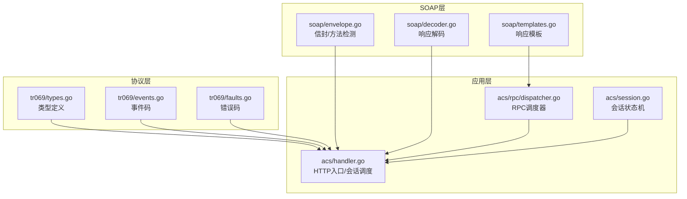
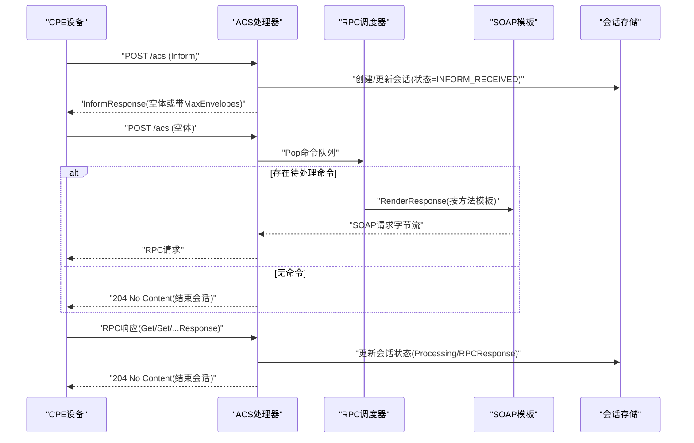
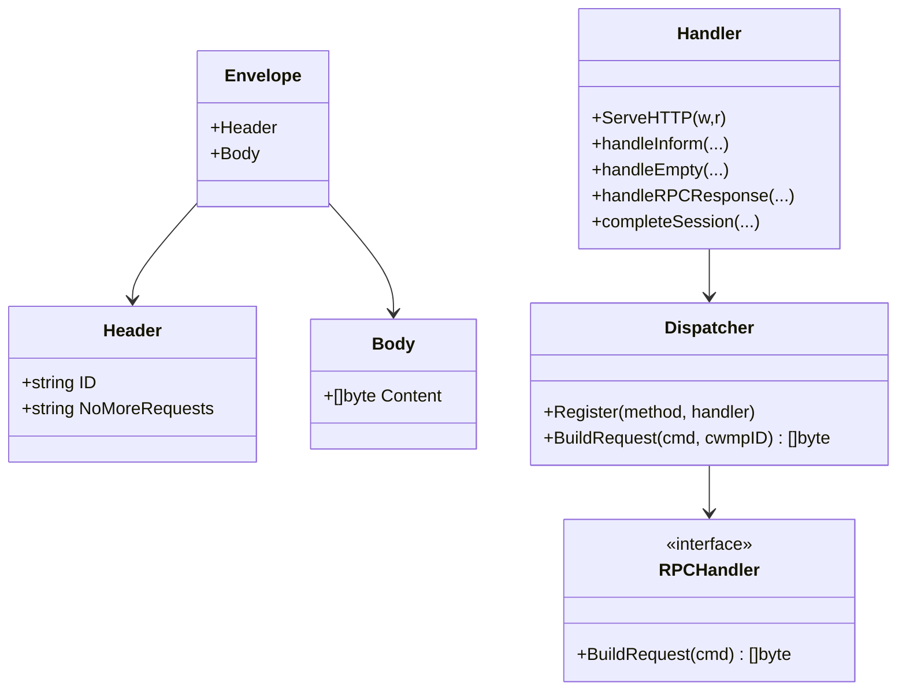
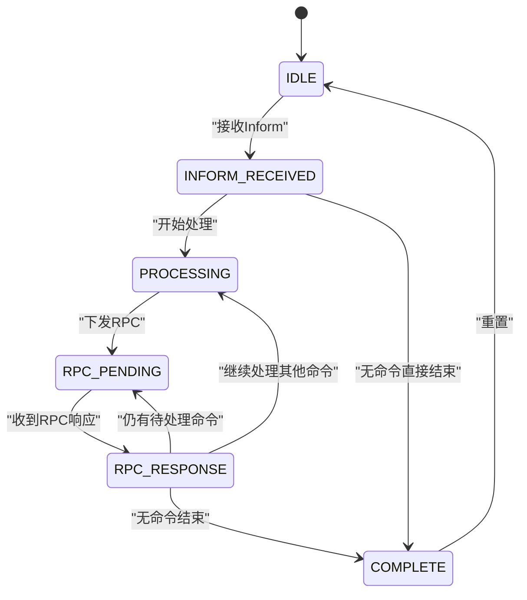

# TR069协议RPC接口

<cite>
**本文档引用的文件**
- [types.go](file://omcgo/pkg/tr069/types.go)
- [events.go](file://omcgo/pkg/tr069/events.go)
- [faults.go](file://omcgo/pkg/tr069/faults.go)
- [envelope.go](file://omcgo/pkg/soap/envelope.go)
- [templates.go](file://omcgo/pkg/soap/templates.go)
- [dispatcher.go](file://omcgo/internal/acs/rpc/dispatcher.go)
- [handler.go](file://omcgo/internal/acs/handler.go)
- [session.go](file://omcgo/internal/acs/session.go)
- [decoder.go](file://omcgo/pkg/soap/decoder.go)
- [config.dev.yaml](file://omcgo/cmd/acs/etc/config.dev.yaml)
- [inform_bootstrap.xml](file://omcgo/test/fixtures/soap/inform_bootstrap.xml)
- [06-tr069-protocol-library.md](file://omcgo/docs/detailed-design/06-tr069-protocol-library.md)
</cite>

## 目录
1. [简介](#简介)
2. [项目结构](#项目结构)
3. [核心组件](#核心组件)
4. [架构概览](#架构概览)
5. [详细组件分析](#详细组件分析)
6. [依赖关系分析](#依赖关系分析)
7. [性能考虑](#性能考虑)
8. [故障排查指南](#故障排查指南)
9. [结论](#结论)
10. [附录](#附录)

## 简介
本文件为 Baicells OMC 项目的 TR069 协议 RPC 接口文档，面向设备厂商与开发者，系统性说明 CWMP（TR069）协议中的标准 RPC 方法（如 Inform、GetParameterValues、SetParameterValues、GetParameterNames、AddObject、DeleteObject 等），并结合项目现有实现，给出参数格式、返回值结构、错误码定义、会话管理、SOAP 消息封装、参数类型转换、实际调用示例与设备交互流程、与标准规范的兼容性与扩展点、以及故障处理、重试机制与超时控制等实现细节。

## 项目结构
围绕 TR069 协议实现的关键模块分布如下：
- 协议类型与事件：pkg/tr069（类型定义、事件码、错误码）
- SOAP 封装与模板：pkg/soap（信封、模板、解码器）
- RPC 调度器：internal/acs/rpc（各 RPC 方法处理器）
- HTTP 处理器与会话管理：internal/acs（请求分发、会话状态机、空 POST 调度）
- 配置与测试夹具：cmd/acs/etc（超时、速率限制、并发控制）、test/fixtures/soap（示例报文）

**图表来源**
- [types.go:1-211](file://omcgo/pkg/tr069/types.go#L1-L211)
- [events.go:1-95](file://omcgo/pkg/tr069/events.go#L1-L95)
- [faults.go:1-39](file://omcgo/pkg/tr069/faults.go#L1-L39)
- [envelope.go:1-143](file://omcgo/pkg/soap/envelope.go#L1-L143)
- [templates.go:1-303](file://omcgo/pkg/soap/templates.go#L1-L303)
- [decoder.go:65-611](file://omcgo/pkg/soap/decoder.go#L65-L611)
- [handler.go:1-200](file://omcgo/internal/acs/handler.go#L1-L200)
- [dispatcher.go:1-230](file://omcgo/internal/acs/rpc/dispatcher.go#L1-L230)
- [session.go:1-72](file://omcgo/internal/acs/session.go#L1-L72)

**章节来源**
- [06-tr069-protocol-library.md:1-25](file://omcgo/docs/detailed-design/06-tr069-protocol-library.md#L1-L25)
- [config.dev.yaml:1-70](file://omcgo/cmd/acs/etc/config.dev.yaml#L1-L70)

## 核心组件
- TR069 类型与事件
  - 定义设备标识、参数键值对、事件结构、Inform/响应消息体及所有标准 RPC 请求/响应结构体
  - 提供事件码常量与判断函数（如是否 Bootstrap、Periodic、Boot、ValueChange、Alarm、ConnectionRequest、RebootComplete、DownloadComplete 等）
- SOAP 信封与模板
  - 定义 SOAP Envelope/Header/Body 结构，提供 RPC 方法枚举与方法检测
  - 预编译所有 ACS → CPE 的响应模板，支持参数数组、命名空间与 xsi:type
- RPC 调度器
  - 注册标准 RPC 方法处理器（GetParameterValues、SetParameterValues、GetParameterNames、AddObject、DeleteObject、Download、Upload、Reboot、FactoryReset、Get/SetParameterAttributes）
  - 根据命令队列构建对应 SOAP 请求
- HTTP 处理器与会话管理
  - 识别请求方法（Inform、RPC 响应、TransferComplete、空 POST 调度）
  - 维护会话状态机，处理速率限制与准入控制，支持后台会话清理
- 错误码与解码器
  - 定义 CWMP 标准错误码映射
  - 提供针对各 RPC 响应的流式解码器（如 GetParameterValuesResponse、SetParameterValuesResponse、TransferComplete 等）

**章节来源**
- [types.go:1-211](file://omcgo/pkg/tr069/types.go#L1-L211)
- [events.go:1-95](file://omcgo/pkg/tr069/events.go#L1-L95)
- [faults.go:1-39](file://omcgo/pkg/tr069/faults.go#L1-L39)
- [envelope.go:1-143](file://omcgo/pkg/soap/envelope.go#L1-L143)
- [templates.go:1-303](file://omcgo/pkg/soap/templates.go#L1-L303)
- [dispatcher.go:1-230](file://omcgo/internal/acs/rpc/dispatcher.go#L1-L230)
- [handler.go:1-200](file://omcgo/internal/acs/handler.go#L1-L200)
- [decoder.go:65-611](file://omcgo/pkg/soap/decoder.go#L65-L611)

## 架构概览
下图展示 TR069 会话生命周期与关键交互步骤：设备发起 Inform，ACS 返回 InformResponse；随后设备发送空 POST，ACS 从命令队列取出待处理命令，构建对应 RPC 请求并下发；设备执行完成后返回相应响应，ACS 更新会话状态并结束会话。

**图表来源**
- [handler.go:70-117](file://omcgo/internal/acs/handler.go#L70-L117)
- [dispatcher.go:47-54](file://omcgo/internal/acs/rpc/dispatcher.go#L47-L54)
- [templates.go:48-55](file://omcgo/pkg/soap/templates.go#L48-L55)
- [session.go:21-59](file://omcgo/internal/acs/session.go#L21-L59)

## 详细组件分析

### TR069 类型与事件
- 设备标识 DeviceId：包含制造商、OUI、产品类别、序列号
- 参数结构 ParameterValueStruct：名称、值、类型（用于 SetParameterValues）
- 事件结构 EventStruct：事件码、命令键
- InformMessage/InformResponse：设备上报与 ACS 应答
- 所有标准 RPC 请求/响应结构体：GetParameterValues、SetParameterValues、GetParameterNames、AddObject、DeleteObject、Download、Upload、Reboot、FactoryReset、ScheduleInform、Get/SetParameterAttributes、TransferComplete、AutonomousTransferComplete 等
- 事件码：0 BOOTSTRAP、1 BOOT、2 PERIODIC、3 SCHEDULED、4 VALUE CHANGE、5 KICKED、6 CONNECTION REQUEST、7 TRANSFER COMPLETE、8 DIAGNOSTICS COMPLETE，以及厂商扩展与 CMCC 扩展事件
- 错误码：CWMP 标准 9000-9013，含方法不支持、请求拒绝、内部错误、无效参数、资源耗尽、参数名/类型/值无效、不可写、通知拒绝、下载/上传失败、文件传输认证/协议错误等

**章节来源**
- [types.go:5-211](file://omcgo/pkg/tr069/types.go#L5-L211)
- [events.go:5-95](file://omcgo/pkg/tr069/events.go#L5-L95)
- [faults.go:5-39](file://omcgo/pkg/tr069/faults.go#L5-L39)

### SOAP 信封与模板
- Envelope/Header/Body 结构，CWMP 命名空间常量
- RPCMethod 枚举覆盖所有标准方法与 Fault、TransferComplete、AutonomousTransferComplete
- DetectRPCMethod 基于字符串包含检测 RPC 方法
- 预编译模板：InformResponse、GetParameterValues、SetParameterValues、GetParameterNames、AddObject、DeleteObject、Download、Upload、Reboot、FactoryReset、ScheduleInform、Fault、TransferCompleteResponse、AutonomousTransferCompleteResponse、Get/SetParameterAttributes
- 模板数据结构：包含 ID、参数数组、键值等，支持数组类型声明与 xsi:type 输出

**章节来源**
- [envelope.go:10-143](file://omcgo/pkg/soap/envelope.go#L10-L143)
- [templates.go:9-156](file://omcgo/pkg/soap/templates.go#L9-L156)

### RPC 调度器与处理器
- Dispatcher 注册标准 RPC 方法处理器，并根据命令 Method 查找对应处理器
- 各处理器从命令 Params 解析 JSON，构造模板所需数据结构，调用 RenderResponse 生成 SOAP 字节流
- 支持的方法：GetParameterValues、SetParameterValues、GetParameterNames、AddObject、DeleteObject、Download、Upload、Reboot、FactoryReset、GetParameterAttributes、SetParameterAttributes

**章节来源**
- [dispatcher.go:21-230](file://omcgo/internal/acs/rpc/dispatcher.go#L21-L230)

### HTTP 处理器与会话管理
- ServeHTTP：仅接受 POST；空体触发空 POST 调度；非空体根据 DetectRPCMethod 分发到对应处理函数
- handleInform：解析 Inform，记录事件码，速率限制与准入控制，创建会话
- handleEmpty：从命令队列弹出命令，构建并下发 RPC 请求；无命令则返回 204
- handleRPCResponse：解析响应，更新会话状态，必要时继续下发下一个命令
- completeSession：释放资源、记录指标、标记会话完成
- 会话状态机：IDLE → INFORM_RECEIVED → PROCESSING → RPC_PENDING → RPC_RESPONSE → COMPLETE；支持状态合法性校验

**章节来源**
- [handler.go:70-117](file://omcgo/internal/acs/handler.go#L70-L117)
- [handler.go:244-367](file://omcgo/internal/acs/handler.go#L244-L367)
- [session.go:21-59](file://omcgo/internal/acs/session.go#L21-L59)

### SOAP 响应解码器
- 提供针对各 RPC 响应的流式解码函数：DecodeGetParameterValuesResponse、DecodeSetParameterValuesResponse、DecodeTransferComplete、DecodeGetParameterAttributesResponse 等
- 解析流程：遍历 XML Token，提取 cwmp:ID、进入 Body、匹配具体响应标签，解码为对应结构体，返回参数列表/状态/时间戳等

**章节来源**
- [decoder.go:107-151](file://omcgo/pkg/soap/decoder.go#L107-L151)
- [decoder.go:153-186](file://omcgo/pkg/soap/decoder.go#L153-L186)
- [decoder.go:361-400](file://omcgo/pkg/soap/decoder.go#L361-L400)
- [decoder.go:578-611](file://omcgo/pkg/soap/decoder.go#L578-L611)

## 依赖关系分析

**图表来源**
- [envelope.go:16-32](file://omcgo/pkg/soap/envelope.go#L16-L32)
- [dispatcher.go:11-14](file://omcgo/internal/acs/rpc/dispatcher.go#L11-L14)
- [handler.go:27-41](file://omcgo/internal/acs/handler.go#L27-L41)

**章节来源**
- [envelope.go:16-32](file://omcgo/pkg/soap/envelope.go#L16-L32)
- [dispatcher.go:11-14](file://omcgo/internal/acs/rpc/dispatcher.go#L11-L14)
- [handler.go:27-41](file://omcgo/internal/acs/handler.go#L27-L41)

## 性能考虑
- 超时配置：服务器读/写/空闲超时默认 30s，会话超时默认 5 分钟，可根据部署环境调整
- 并发与准入：最大并发会话数 10000，启动后台会话清理器，超期连接自动回收
- 速率限制：每设备每分钟最多 10 次 Inform，突发 5，支持不活跃设备清理
- 日志轮转：支持多输出路径、大小限制、保留天数、压缩与本地时间

**章节来源**
- [config.dev.yaml:9-22](file://omcgo/cmd/acs/etc/config.dev.yaml#L9-L22)
- [config.dev.yaml:41-69](file://omcgo/cmd/acs/etc/config.dev.yaml#L41-L69)
- [handler.go:43-68](file://omcgo/internal/acs/handler.go#L43-L68)

## 故障排查指南
- 常见错误码
  - 方法不支持：9000
  - 请求拒绝：9001
  - 内部错误：9002
  - 无效参数：9003
  - 资源耗尽：9004
  - 无效参数名/类型/值：9005/9006/9007
  - 不可写：9008
  - 通知拒绝：9009
  - 下载/上传失败：9010/9011
  - 文件传输认证/协议错误：9012/9013
- 响应解码异常
  - 若无法解析 SOAP 或未找到 Body/特定响应元素，将返回“解码失败”错误
- 会话状态异常
  - 若状态转移不在允许集合内，将返回“无效会话转移”错误
- 建议排查步骤
  - 检查设备上报的 Inform 是否包含有效 DeviceId 与事件码
  - 确认命令队列中是否存在待处理命令且参数格式正确
  - 核对 CWMP ID 是否一致，避免跨会话混淆
  - 查看 ACS 日志与指标，确认速率限制与准入控制是否触发

**章节来源**
- [faults.go:5-39](file://omcgo/pkg/tr069/faults.go#L5-L39)
- [decoder.go:65-105](file://omcgo/pkg/soap/decoder.go#L65-L105)
- [session.go:43-59](file://omcgo/internal/acs/session.go#L43-L59)

## 结论
本项目基于 TR069/CWMP 标准实现了完整的 RPC 接口族，涵盖参数读取/设置、对象增删、文件下载/上传、重启/恢复出厂设置、参数属性管理、以及文件传输完成通知等核心能力。通过清晰的类型定义、SOAP 模板化生成、严格的会话状态机与完善的错误码体系，为设备厂商与集成商提供了稳定可靠的对接基础。建议在生产环境中结合速率限制、并发控制与日志轮转策略，确保高可用与可观测性。

## 附录

### RPC 方法定义与参数/返回结构

- Inform
  - 请求：DeviceId、Event 列表、MaxEnvelopes、CurrentTime、RetryCount、ParameterList
  - 响应：MaxEnvelopes
  - 事件码：0 BOOTSTRAP、1 BOOT、2 PERIODIC、3 SCHEDULED、4 VALUE CHANGE、5 KICKED、6 CONNECTION REQUEST、7 TRANSFER COMPLETE、8 DIAGNOSTICS COMPLETE
  - 示例参考：[inform_bootstrap.xml:1-51](file://omcgo/test/fixtures/soap/inform_bootstrap.xml#L1-L51)

- GetParameterValues
  - 请求参数：ParameterNames（字符串数组）
  - 响应参数：ParameterList（ParameterName → Value）
  - 示例模板：[GetParameterValues 模板:179-186](file://omcgo/pkg/soap/templates.go#L179-L186)

- SetParameterValues
  - 请求参数：ParameterList（Name、Value、Type），ParameterKey
  - 响应参数：Status（0=立即生效，1=需重启）
  - 示例模板：[SetParameterValues 模板:188-199](file://omcgo/pkg/soap/templates.go#L188-L199)

- GetParameterNames
  - 请求参数：ParameterPath、NextLevel
  - 响应参数：ParameterList（Name、Writable）
  - 示例模板：[GetParameterNames 模板:201-205](file://omcgo/pkg/soap/templates.go#L201-L205)

- AddObject
  - 请求参数：ObjectName、ParameterKey
  - 响应参数：InstanceNumber、Status
  - 示例模板：[AddObject 模板:207-211](file://omcgo/pkg/soap/templates.go#L207-L211)

- DeleteObject
  - 请求参数：ObjectName、ParameterKey
  - 响应参数：Status
  - 示例模板：[DeleteObject 模板:213-217](file://omcgo/pkg/soap/templates.go#L213-L217)

- Download
  - 请求参数：CommandKey、FileType、URL、Username、Password、FileSize、TargetFileName、DelaySeconds、SuccessURL、FailureURL
  - 响应参数：Status、StartTime、CompleteTime
  - 示例模板：[Download 模板:219-231](file://omcgo/pkg/soap/templates.go#L219-L231)

- Upload
  - 请求参数：CommandKey、FileType、URL、Username、Password、DelaySeconds
  - 响应参数：Status、StartTime、CompleteTime
  - 示例模板：[Upload 模板:233-241](file://omcgo/pkg/soap/templates.go#L233-L241)

- Reboot
  - 请求参数：CommandKey
  - 响应参数：无
  - 示例模板：[Reboot 模板:243-246](file://omcgo/pkg/soap/templates.go#L243-L246)

- FactoryReset
  - 请求参数：无
  - 响应参数：无
  - 示例模板：[FactoryReset 模板:248-249](file://omcgo/pkg/soap/templates.go#L248-L249)

- ScheduleInform
  - 请求参数：DelaySeconds、CommandKey
  - 响应参数：无
  - 示例模板：[ScheduleInform 模板:251-255](file://omcgo/pkg/soap/templates.go#L251-L255)

- GetParameterAttributes
  - 请求参数：ParameterNames
  - 响应参数：ParameterList（Name、Notification、AccessList）
  - 示例模板：[GetParameterAttributes 模板:275-282](file://omcgo/pkg/soap/templates.go#L275-L282)

- SetParameterAttributes
  - 请求参数：ParameterList（Name、NotificationChange、Notification、AccessListChange、AccessList）
  - 响应参数：无
  - 示例模板：[SetParameterAttributes 模板:284-301](file://omcgo/pkg/soap/templates.go#L284-L301)

- TransferComplete
  - 请求参数：CommandKey、FaultStruct（可选）、StartTime、CompleteTime
  - 响应参数：TransferCompleteResponse
  - 示例模板：[TransferCompleteResponse 模板:269-270](file://omcgo/pkg/soap/templates.go#L269-L270)

- AutonomousTransferComplete
  - 请求参数：AnnounceURL、TransferURL、IsDownload、FileType、FileSize、TargetFileName、FaultStruct（可选）、StartTime、CompleteTime
  - 响应参数：AutonomousTransferCompleteResponse
  - 示例模板：[AutonomousTransferCompleteResponse 模板:272-273](file://omcgo/pkg/soap/templates.go#L272-L273)

**章节来源**
- [types.go:26-211](file://omcgo/pkg/tr069/types.go#L26-L211)
- [templates.go:158-303](file://omcgo/pkg/soap/templates.go#L158-L303)
- [inform_bootstrap.xml:1-51](file://omcgo/test/fixtures/soap/inform_bootstrap.xml#L1-L51)

### 会话管理与状态机

**图表来源**
- [session.go:12-59](file://omcgo/internal/acs/session.go#L12-L59)

### 错误码对照表
- 9000：方法不支持
- 9001：请求拒绝
- 9002：内部错误
- 9003：无效参数
- 9004：资源耗尽
- 9005：无效参数名
- 9006：无效参数类型
- 9007：无效参数值
- 9008：不可写
- 9009：通知拒绝
- 9010：下载失败
- 9011：上传失败
- 9012：文件传输服务器认证失败
- 9013：文件传输协议不受支持

**章节来源**
- [faults.go:5-39](file://omcgo/pkg/tr069/faults.go#L5-L39)

### 实际RPC调用示例与设备交互流程
- Inform → InformResponse：设备首次接入，上报设备信息与事件码，ACS 返回 InformResponse
- 空 POST → 下发命令：设备发送空体表示准备接收命令，ACS 从队列取出命令并下发对应 RPC 请求
- RPC 响应 → 更新会话：设备执行完成后返回对应响应，ACS 更新会话状态，若无后续命令则结束会话

**章节来源**
- [handler.go:119-184](file://omcgo/internal/acs/handler.go#L119-L184)
- [handler.go:244-367](file://omcgo/internal/acs/handler.go#L244-L367)
- [inform_bootstrap.xml:1-51](file://omcgo/test/fixtures/soap/inform_bootstrap.xml#L1-L51)

### 与标准TR069规范的兼容性与扩展
- 兼容性：严格遵循 CWMP/TR069 规范的 RPC 方法、命名空间、数组类型声明与 xsi:type 使用
- 扩展点：事件码支持厂商扩展（如 M Reboot/Download/Upload）与 CMCC 扩展（ADD OBJECT/DELETE OBJECT），可按需扩展新事件或方法
- 模板化：通过预编译模板保证生成的 SOAP XML 符合规范要求，便于与不同厂商设备互通

**章节来源**
- [events.go:18-30](file://omcgo/pkg/tr069/events.go#L18-L30)
- [envelope.go:10-14](file://omcgo/pkg/soap/envelope.go#L10-L14)
- [templates.go:158-177](file://omcgo/pkg/soap/templates.go#L158-L177)

### 故障处理、重试机制、超时控制
- 超时控制：服务器读/写/空闲超时默认 30s；会话超时默认 5 分钟；可通过配置文件调整
- 速率限制：每设备每分钟最多 10 次 Inform，突发 5，超过将返回 503
- 准入控制：最大并发会话 10000，超出返回 503；后台会话清理器定期回收超期连接
- 重试机制：设备端依据 RetryCount 与周期 Inform 间隔进行重试；ACS 侧通过会话状态机保证命令有序执行

**章节来源**
- [config.dev.yaml:9-22](file://omcgo/cmd/acs/etc/config.dev.yaml#L9-L22)
- [handler.go:153-167](file://omcgo/internal/acs/handler.go#L153-L167)
- [handler.go:43-68](file://omcgo/internal/acs/handler.go#L43-L68)