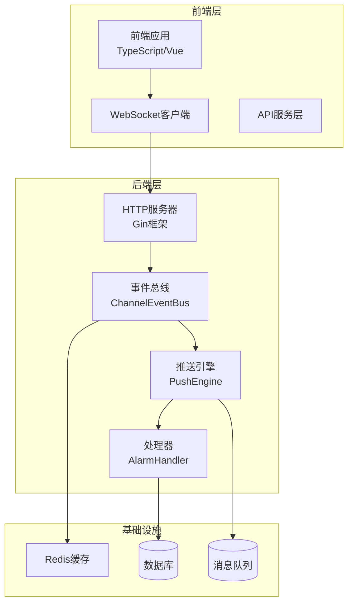
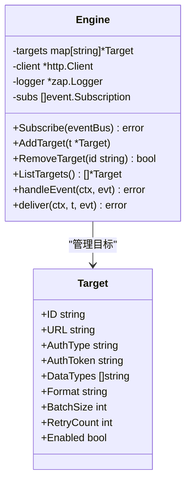
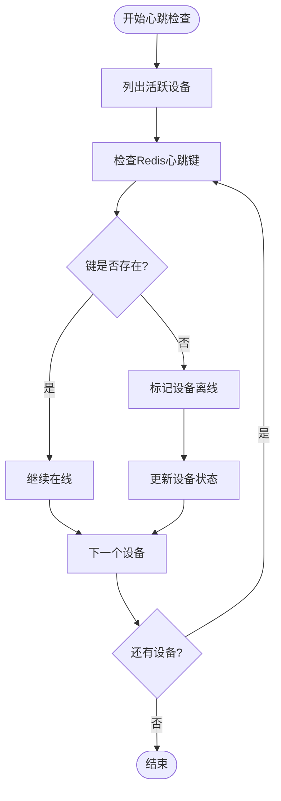
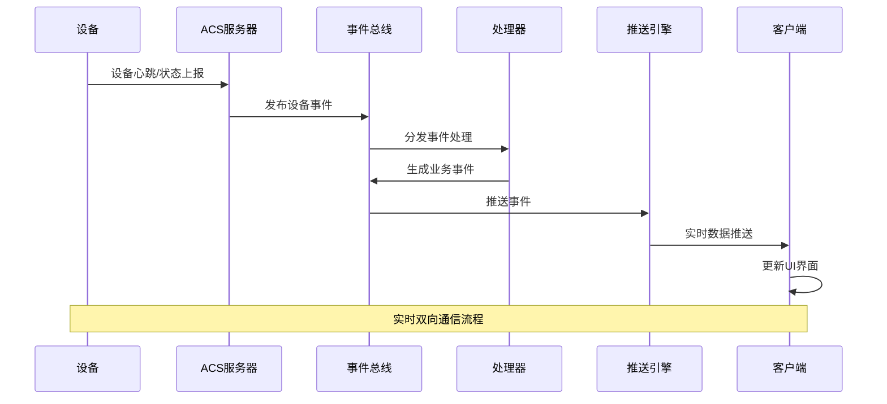
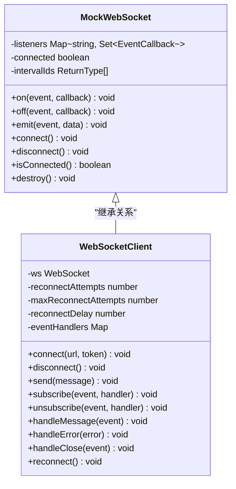
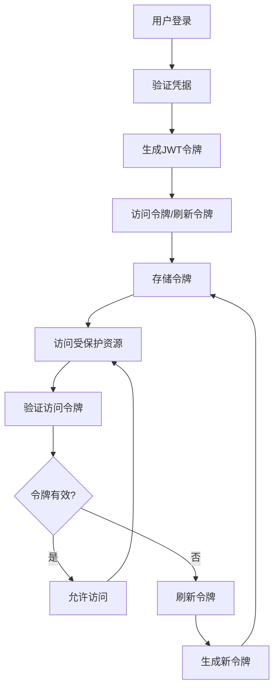
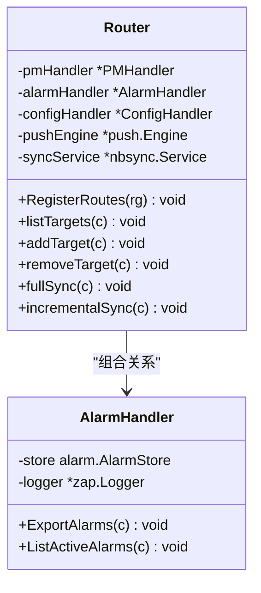
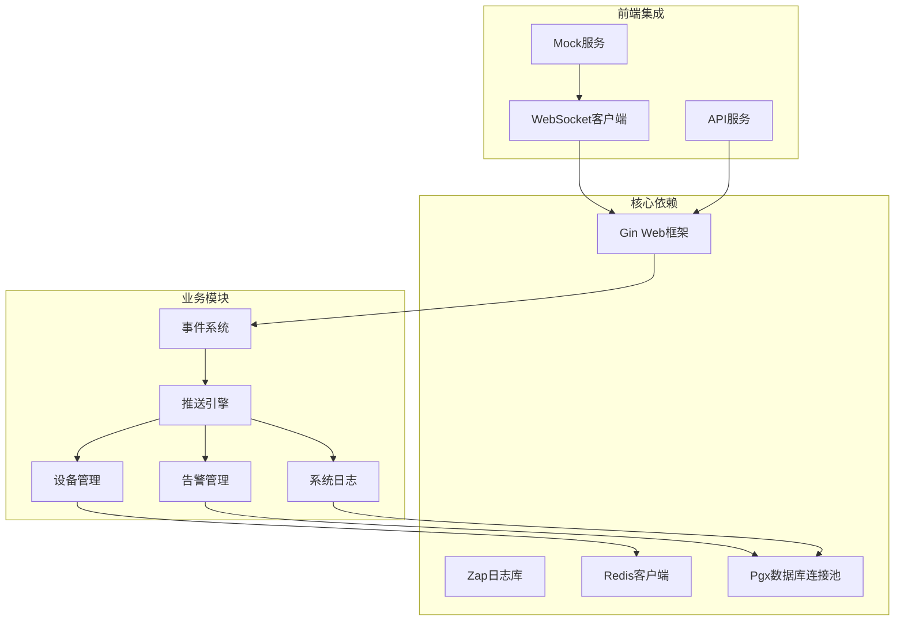
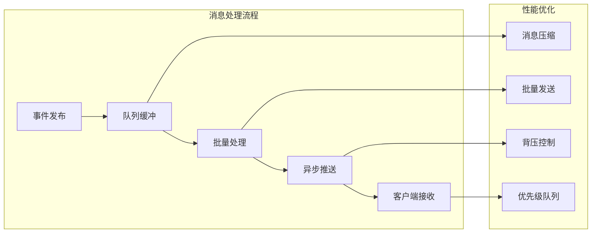

# WebSocket实时接口

<cite>
**本文档引用的文件**
- [router.go](file://omcgo/internal/northbound/router.go)
- [engine.go](file://omcgo/internal/northbound/push/engine.go)
- [alarm_handler.go](file://omcgo/internal/northbound/alarm_handler.go)
- [heartbeat.go](file://omcgo/internal/device/heartbeat.go)
- [inform_handler.go](file://omcgo/internal/device/inform_handler.go)
- [channel_bus.go](file://omcgo/internal/core/event/channel_bus.go)
- [auth.go](file://omcgo/internal/core/middleware/auth.go)
- [jwt.go](file://omcgo/internal/admin/jwt.go)
- [index.ts](file://omcmb/webcode/src/mock/websocket/index.ts)
- [useNorthbound.ts](file://omcmb/webcode/src/hooks/api/useNorthbound.ts)
- [northboundApi.ts](file://omcmb/webcode/src/services/api/northboundApi.ts)
</cite>

## 目录
1. [简介](#简介)
2. [项目结构](#项目结构)
3. [核心组件](#核心组件)
4. [架构概览](#架构概览)
5. [详细组件分析](#详细组件分析)
6. [依赖关系分析](#依赖关系分析)
7. [性能考虑](#性能考虑)
8. [故障排除指南](#故障排除指南)
9. [结论](#结论)
10. [附录](#附录)

## 简介

Baicells OMC项目的WebSocket实时接口是一个基于事件驱动架构的实时数据推送系统。该系统实现了设备心跳监控、告警推送、性能数据传输、系统日志等实时消息的双向通信能力。

本项目采用Go语言开发后端服务，使用WebSocket协议实现客户端与服务器的实时通信，通过事件总线模式实现消息的发布-订阅机制。前端使用TypeScript构建，提供了完整的WebSocket客户端实现和Mock服务。

## 项目结构

项目采用分层架构设计，主要分为以下层次：



**图表来源**
- [router.go:1-126](file://omcgo/internal/northbound/router.go#L1-L126)
- [engine.go:1-262](file://omcgo/internal/northbound/push/engine.go#L1-L262)

**章节来源**
- [router.go:1-126](file://omcgo/internal/northbound/router.go#L1-L126)
- [engine.go:1-262](file://omcgo/internal/northbound/push/engine.go#L1-L262)

## 核心组件

### 事件总线系统

事件总线是整个实时通信系统的核心，负责消息的发布和订阅管理。

```mermaid
classDiagram
class ChannelEventBus {
-subscribers map[string][]*channelSubscription
-bufferSize int
-closed atomic.Bool
+Publish(ctx, subject, evt) error
+Subscribe(subject, handler) Subscription
+QueueSubscribe(subject, queue, handler) Subscription
}
class channelSubscription {
+ch chan Event
+handler EventHandler
+queue string
+cancel CancelFunc
+done chan struct{}
+Unsubscribe() error
}
class Event {
+ID string
+Subject string
+Payload json.RawMessage
+Timestamp time.Time
}
ChannelEventBus --> channelSubscription : "管理订阅"
channelSubscription --> Event : "接收事件"
```

**图表来源**
- [channel_bus.go:1-126](file://omcgo/internal/core/event/channel_bus.go#L1-L126)

### 推送引擎

推送引擎负责将事件数据推送到外部系统或客户端。



**图表来源**
- [engine.go:1-262](file://omcgo/internal/northbound/push/engine.go#L1-L262)

### 设备心跳监控

设备心跳监控系统通过Redis TTL键值对来跟踪设备在线状态。



**图表来源**
- [heartbeat.go:1-120](file://omcgo/internal/device/heartbeat.go#L1-L120)

**章节来源**
- [channel_bus.go:1-126](file://omcgo/internal/core/event/channel_bus.go#L1-L126)
- [engine.go:1-262](file://omcgo/internal/northbound/push/engine.go#L1-L262)
- [heartbeat.go:1-120](file://omcgo/internal/device/heartbeat.go#L1-L120)

## 架构概览

系统采用事件驱动架构，实现了从设备数据采集到实时推送的完整流程：



**图表来源**
- [inform_handler.go:1-175](file://omcgo/internal/device/inform_handler.go#L1-L175)
- [engine.go:1-262](file://omcgo/internal/northbound/push/engine.go#L1-L262)

## 详细组件分析

### WebSocket客户端实现

前端提供了完整的WebSocket客户端实现，支持Mock模式和真实连接模式。



**图表来源**
- [index.ts:1-76](file://omcmb/webcode/src/mock/websocket/index.ts#L1-L76)

### 认证机制

系统采用JWT令牌进行用户认证，支持访问令牌和刷新令牌机制。



**图表来源**
- [jwt.go:1-136](file://omcgo/internal/admin/jwt.go#L1-L136)
- [auth.go:1-47](file://omcgo/internal/core/middleware/auth.go#L1-L47)

### 北向接口设计

北向接口提供了与外部系统的数据交换能力，支持告警、性能、配置等数据的推送。



**图表来源**
- [router.go:1-126](file://omcgo/internal/northbound/router.go#L1-L126)
- [alarm_handler.go:1-105](file://omcgo/internal/northbound/alarm_handler.go#L1-L105)

**章节来源**
- [index.ts:1-76](file://omcmb/webcode/src/mock/websocket/index.ts#L1-L76)
- [jwt.go:1-136](file://omcgo/internal/admin/jwt.go#L1-L136)
- [auth.go:1-47](file://omcgo/internal/core/middleware/auth.go#L1-L47)
- [router.go:1-126](file://omcgo/internal/northbound/router.go#L1-L126)
- [alarm_handler.go:1-105](file://omcgo/internal/northbound/alarm_handler.go#L1-L105)

## 依赖关系分析

系统各组件之间的依赖关系如下：



**图表来源**
- [engine.go:1-262](file://omcgo/internal/northbound/push/engine.go#L1-L262)
- [channel_bus.go:1-126](file://omcgo/internal/core/event/channel_bus.go#L1-L126)

**章节来源**
- [engine.go:1-262](file://omcgo/internal/northbound/push/engine.go#L1-L262)
- [channel_bus.go:1-126](file://omcgo/internal/core/event/channel_bus.go#L1-L126)

## 性能考虑

### 连接池管理

系统实现了高效的连接池管理机制，支持多个客户端同时连接：

- **最大连接数限制**：防止资源耗尽
- **连接超时控制**：避免长时间占用连接
- **自动清理机制**：定期清理无效连接
- **负载均衡**：支持多实例部署

### 消息队列优化



### 断线重连策略

系统实现了智能的断线重连机制：

- **指数退避算法**：避免雪崩效应
- **最大重连次数**：防止无限重试
- **心跳检测**：及时发现连接异常
- **状态同步**：重连后恢复数据状态

## 故障排除指南

### 常见问题诊断

1. **连接失败**
   - 检查网络连接状态
   - 验证认证令牌有效性
   - 确认服务器地址配置正确

2. **消息丢失**
   - 检查队列缓冲区状态
   - 验证消息序列化格式
   - 确认客户端订阅状态

3. **性能问题**
   - 监控CPU和内存使用率
   - 检查数据库连接池状态
   - 分析事件处理延迟

### 调试工具

前端提供了完整的Mock服务用于开发调试：

```typescript
// Mock WebSocket客户端示例
const mockWS = new MockWebSocket();
mockWS.on('connect', (data) => console.log('连接成功:', data));
mockWS.on('disconnect', (data) => console.log('连接断开:', data));
mockWS.connect();

// 模拟设备心跳
mockWS.startInterval(() => {
  mockWS.emit('device.heartbeat', {
    device_id: 'DEV001',
    timestamp: new Date().toISOString(),
    status: 'online'
  });
}, 5000, 10000);
```

**章节来源**
- [index.ts:1-76](file://omcmb/webcode/src/mock/websocket/index.ts#L1-L76)

## 结论

Baicells OMC项目的WebSocket实时接口设计了一个完整、可靠的实时通信系统。通过事件驱动架构和推送引擎，系统能够高效地处理设备心跳、告警推送、性能数据传输等多种实时消息类型。

系统的主要优势包括：
- **高可靠性**：完善的错误处理和重连机制
- **高性能**：优化的消息队列和连接池管理
- **可扩展性**：模块化的架构设计支持功能扩展
- **易维护性**：清晰的代码结构和完整的文档

该系统为前端开发者提供了完整的实时数据展示和交互功能实现基础，能够满足现代移动通信网管系统的需求。

## 附录

### API使用示例

#### 前端连接示例

```typescript
// 使用React Query Hook
const { data: pushTargets, isLoading } = usePushTargets();
const addPushTarget = useAddPushTarget();
const removePushTarget = useRemovePushTarget();

// 添加推送目标
addPushTarget.mutate({
  id: 'target-1',
  url: 'https://oss.example.com/data',
  authType: 'bearer',
  authToken: 'your-token',
  dataTypes: ['alarm', 'pm'],
  format: 'json',
  batchSize: 100,
  retryCount: 3,
  enabled: true
});
```

#### 后端配置

```yaml
# 推送目标配置示例
push_targets:
  - id: "oss-system"
    url: "https://oss.example.com/api/data"
    auth_type: "bearer"
    auth_token: "${PUSH_OSS_TOKEN}"
    data_types: ["alarm", "pm", "config"]
    format: "json"
    batch_size: 100
    retry_count: 3
    enabled: true
```