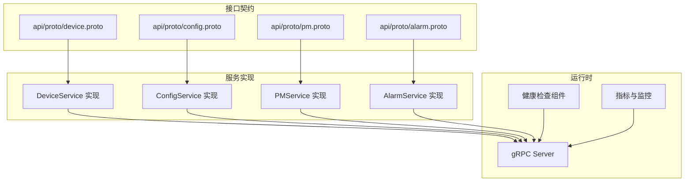
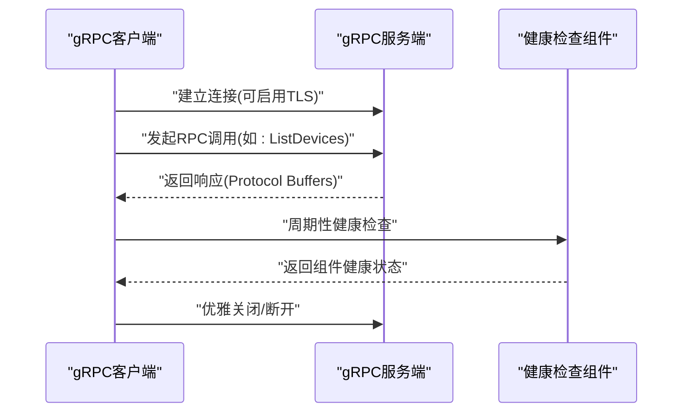
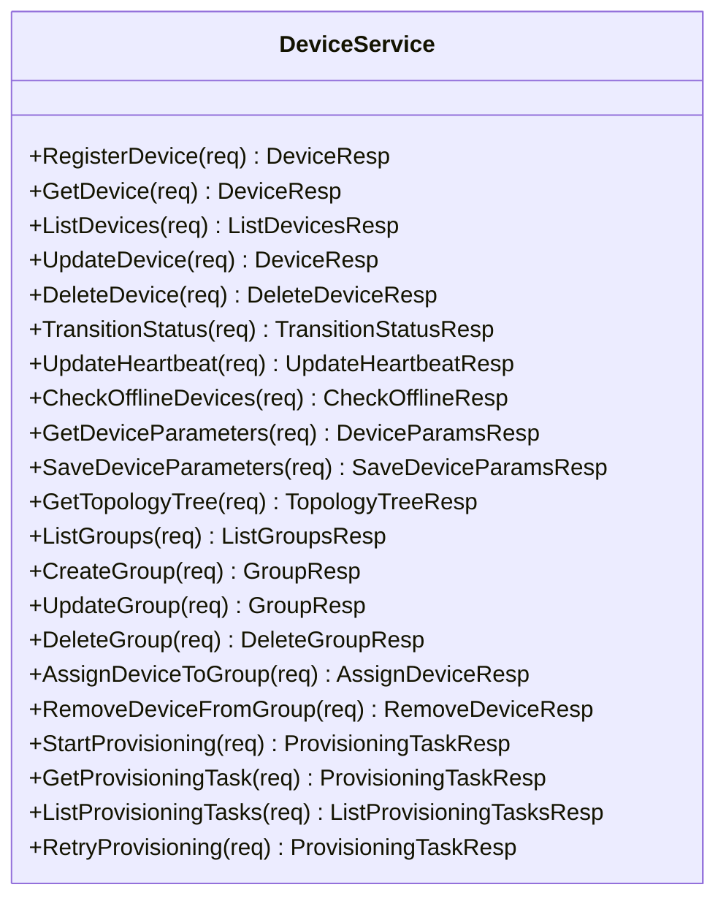
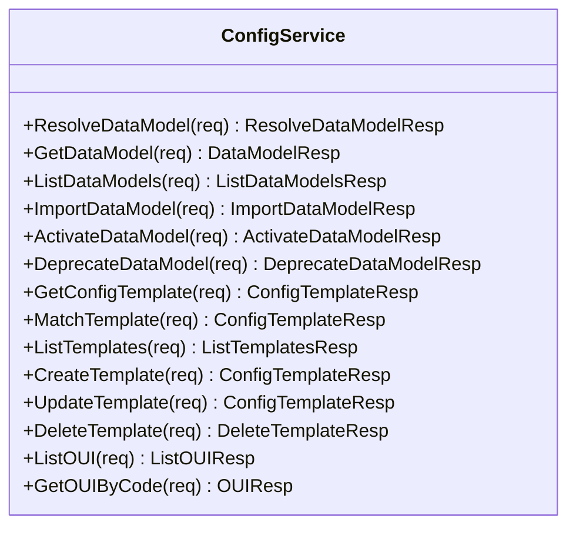
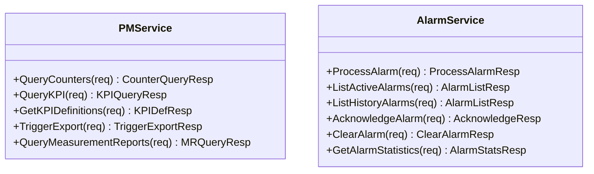
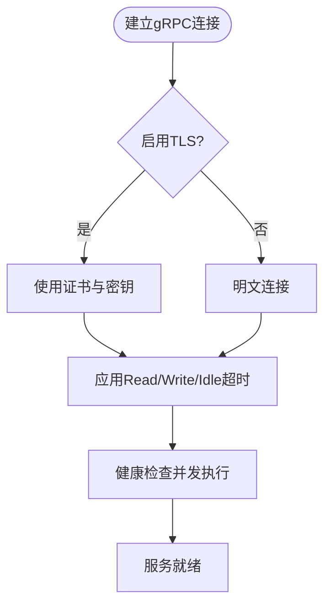
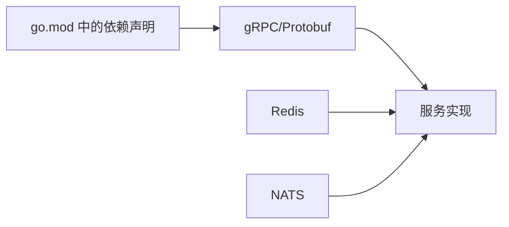

# gRPC接口

<cite>
**本文引用的文件**
- [omcgo/docs/go-zero-design/05-device-management.md](file://omcgo/docs/go-zero-design/05-device-management.md)
- [omcgo/docs/go-zero-design/04-data-model-service.md](file://omcgo/docs/go-zero-design/04-data-model-service.md)
- [omcgo/docs/go-zero-design/06-data-pipeline.md](file://omcgo/docs/go-zero-design/06-data-pipeline.md)
- [omcgo/docs/go-zero-design/09-project-structure.md](file://omcgo/docs/go-zero-design/09-project-structure.md)
- [omcgo/api/openapi/openapi.yaml](file://omcgo/api/openapi/openapi.yaml)
- [omcgo/internal/acs/server.go](file://omcgo/internal/acs/server.go)
- [omcgo/internal/acs/connreq/client.go](file://omcgo/internal/acs/connreq/client.go)
- [omcgo/internal/core/appconfig/config.go](file://omcgo/internal/core/appconfig/config.go)
- [omcgo/internal/core/components/health.go](file://omcgo/internal/core/components/health.go)
- [omcgo/internal/core/bootstrap/bootstrap.go](file://omcgo/internal/core/bootstrap/bootstrap.go)
- [omcgo/cmd/app/main.go](file://omcgo/cmd/app/main.go)
- [omcgo/cmd/acs/main.go](file://omcgo/cmd/acs/main.go)
- [omcgo/go.mod](file://omcgo/go.mod)
</cite>

## 目录
1. [简介](#简介)
2. [项目结构](#项目结构)
3. [核心组件](#核心组件)
4. [架构总览](#架构总览)
5. [详细组件分析](#详细组件分析)
6. [依赖关系分析](#依赖关系分析)
7. [性能考量](#性能考量)
8. [故障排查指南](#故障排查指南)
9. [结论](#结论)
10. [附录](#附录)

## 简介
本文件面向Baicells OMC项目的开发者与集成方，系统化梳理项目中的gRPC接口定义与使用实践，覆盖服务与消息模型、通信协议与连接管理、负载均衡与健康检查、超时与重试策略、以及多语言客户端调用示例与最佳实践。同时对比gRPC与REST API的差异与适用场景，帮助读者在不同业务域（设备管理、数据模型、性能与告警、配置同步等）中正确选择与集成。

## 项目结构
- 接口契约集中于 api/proto，作为所有RPC接口定义的唯一来源。
- 服务实现位于 service/* 子目录，遵循“common/ + pkg/ + service/”分层，服务间通过gRPC通信。
- REST API定义集中在 OpenAPI 文档中，用于Web与外部系统对接；gRPC用于内部服务间高性能通信。

**图表来源**
- [omcgo/docs/go-zero-design/09-project-structure.md](file://omcgo/docs/go-zero-design/09-project-structure.md)
- [omcgo/docs/go-zero-design/05-device-management.md](file://omcgo/docs/go-zero-design/05-device-management.md)
- [omcgo/docs/go-zero-design/04-data-model-service.md](file://omcgo/docs/go-zero-design/04-data-model-service.md)
- [omcgo/docs/go-zero-design/06-data-pipeline.md](file://omcgo/docs/go-zero-design/06-data-pipeline.md)

**章节来源**
- [omcgo/docs/go-zero-design/09-project-structure.md](file://omcgo/docs/go-zero-design/09-project-structure.md)

## 核心组件
- gRPC服务与消息模型
  - 设备管理服务：设备注册、查询、状态迁移、心跳、参数读写、拓扑与分组管理、自动开站任务。
  - 数据模型服务：数据模型解析、CRUD、模板匹配与管理、OUI注册表。
  - 性能与告警服务：计数器查询、KPI查询与定义、导出触发、测量报告查询；告警处理、查询、确认与清除、统计。
- 运行时与基础设施
  - 应用配置包含gRPC端口与TLS配置。
  - 健康检查组件统一聚合各组件健康状态。
  - 启动流程负责启动指标服务器与优雅关闭。

**章节来源**
- [omcgo/docs/go-zero-design/05-device-management.md](file://omcgo/docs/go-zero-design/05-device-management.md)
- [omcgo/docs/go-zero-design/04-data-model-service.md](file://omcgo/docs/go-zero-design/04-data-model-service.md)
- [omcgo/docs/go-zero-design/06-data-pipeline.md](file://omcgo/docs/go-zero-design/06-data-pipeline.md)
- [omcgo/internal/core/appconfig/config.go](file://omcgo/internal/core/appconfig/config.go)
- [omcgo/internal/core/components/health.go](file://omcgo/internal/core/components/health.go)
- [omcgo/internal/core/bootstrap/bootstrap.go](file://omcgo/internal/core/bootstrap/bootstrap.go)

## 架构总览
- 服务间通信采用gRPC，消息体为Protocol Buffers，具备强类型、高吞吐、跨语言等优势。
- REST API与gRPC并存：REST用于Web与外部系统，gRPC用于内部服务间高性能交互。
- 连接管理与超时：服务端配置Read/Write/Idle超时；客户端可结合指数退避与去重机制提升鲁棒性。
- 健康检查：统一健康检查组件并发执行各子系统检查，返回整体健康状态码。

**图表来源**
- [omcgo/internal/core/components/health.go](file://omcgo/internal/core/components/health.go)
- [omcgo/internal/core/appconfig/config.go](file://omcgo/internal/core/appconfig/config.go)

## 详细组件分析

### 设备管理服务（DeviceService）
- 服务职责
  - 设备CRUD、状态迁移、心跳更新、离线检测。
  - 设备参数读取与保存。
  - 拓扑树查询、分组管理、设备与分组分配。
  - 自动开站任务创建、查询与重试。
- 关键RPC与消息
  - 设备CRUD：RegisterDevice、GetDevice、ListDevices、UpdateDevice、DeleteDevice。
  - 状态与心跳：TransitionStatus、UpdateHeartbeat、CheckOfflineDevices。
  - 参数：GetDeviceParameters、SaveDeviceParameters。
  - 拓扑与分组：GetTopologyTree、ListGroups、CreateGroup、UpdateGroup、DeleteGroup、AssignDeviceToGroup、RemoveDeviceFromGroup。
  - 自动开站：StartProvisioning、GetProvisioningTask、ListProvisioningTasks、RetryProvisioning。
- 字段要点
  - 设备状态枚举：discovered/registered/provisioning/active/maintenance/offline/decommissioned。
  - 参数值包含名称、值、类型与是否可写。
  - 拓扑节点包含组ID、名称、类型、父ID、设备数量与子节点。
  - 开站任务包含任务ID、设备序列号、状态、模板ID、错误信息与重试次数。

**图表来源**
- [omcgo/docs/go-zero-design/05-device-management.md](file://omcgo/docs/go-zero-design/05-device-management.md)

**章节来源**
- [omcgo/docs/go-zero-design/05-device-management.md](file://omcgo/docs/go-zero-design/05-device-management.md)

### 数据模型服务（ConfigService）
- 服务职责
  - 数据模型解析：按运营商、制式、OUI、产品类匹配最优模型。
  - 数据模型CRUD：获取、列表、导入、激活、弃用。
  - 配置模板：获取、匹配、列表、创建、更新、删除。
  - OUI注册表：列出与按编码获取。
- 关键RPC与消息
  - 解析：ResolveDataModel。
  - CRUD：GetDataModel、ListDataModels、ImportDataModel、ActivateDataModel、DeprecateDataModel。
  - 模板：GetConfigTemplate、MatchTemplate、ListTemplates、CreateTemplate、UpdateTemplate、DeleteTemplate。
  - OUI：ListOUI、GetOUIByCode。

**图表来源**
- [omcgo/docs/go-zero-design/04-data-model-service.md](file://omcgo/docs/go-zero-design/04-data-model-service.md)

**章节来源**
- [omcgo/docs/go-zero-design/04-data-model-service.md](file://omcgo/docs/go-zero-design/04-data-model-service.md)

### 性能与告警服务（PMService、AlarmService）
- PMService
  - 计数器查询、KPI查询、KPI定义管理、触发导出、测量报告查询。
- AlarmService
  - 处理新告警、查询活跃/历史告警、确认与清除、统计。
- 关键RPC与消息
  - PM：QueryCounters、QueryKPI、GetKPIDefinitions、TriggerExport、QueryMeasurementReports。
  - 告警：ProcessAlarm、ListActiveAlarms、ListHistoryAlarms、AcknowledgeAlarm、ClearAlarm、GetAlarmStatistics。

**图表来源**
- [omcgo/docs/go-zero-design/06-data-pipeline.md](file://omcgo/docs/go-zero-design/06-data-pipeline.md)

**章节来源**
- [omcgo/docs/go-zero-design/06-data-pipeline.md](file://omcgo/docs/go-zero-design/06-data-pipeline.md)

### 通信协议与连接管理
- gRPC端口与TLS
  - 应用配置包含gRPC端口与TLS证书配置，便于启用安全传输。
- 连接与超时
  - 服务端配置Read/Write/Idle超时，保障长连接稳定性。
  - 客户端可结合指数退避与去重机制，提升可靠性（参考TR-069连接请求客户端模式）。
- 健康检查
  - 组件健康检查并发执行，返回整体健康状态码，便于服务网格或负载均衡前置探测。

**图表来源**
- [omcgo/internal/core/appconfig/config.go](file://omcgo/internal/core/appconfig/config.go)
- [omcgo/internal/core/components/health.go](file://omcgo/internal/core/components/health.go)

**章节来源**
- [omcgo/internal/core/appconfig/config.go](file://omcgo/internal/core/appconfig/config.go)
- [omcgo/internal/core/components/health.go](file://omcgo/internal/core/components/health.go)

### 负载均衡与服务发现
- 负载均衡策略
  - 建议采用gRPC内置的负载均衡策略（如轮询、最少连接），并结合健康检查结果进行流量调度。
- 服务发现
  - 在Kubernetes环境中可通过Service暴露gRPC端口，结合探针与健康检查实现自动发现与滚动更新。
- 超时与重试
  - 客户端应设置合理的单次调用超时与总超时上限，并在幂等场景下进行有限重试（指数退避）。

[本节为通用实践建议，无需特定文件引用]

### gRPC与REST API的区别与使用场景
- gRPC
  - 优点：强类型、双向流、低延迟、高吞吐、自动生成多语言客户端。
  - 场景：内部服务间高频交互、设备参数批量下发、性能与告警实时上报。
- REST
  - 优点：浏览器友好、广泛生态、易于调试。
  - 场景：Web门户、第三方系统对接、导出与报表下载。
- 本项目
  - REST API定义于OpenAPI文档，用于对外与Web；gRPC用于内部服务间通信。

**章节来源**
- [omcgo/api/openapi/openapi.yaml](file://omcgo/api/openapi/openapi.yaml)

### gRPC客户端调用示例（多语言指引）
- Go
  - 使用官方gRPC库，生成pb代码后直接调用服务方法，设置TLS与超时，处理错误码。
- Java/Python/.NET
  - 使用对应语言的gRPC客户端库，加载同一套.proto定义，保持消息格式一致。
- 注意事项
  - 连接建立：配置TLS证书与主机端口，设置Read/Write超时。
  - 方法调用：按服务与消息模型构造请求，处理响应与错误。
  - 错误处理：区分gRPC状态码与业务错误，必要时进行重试与降级。

[本节为通用实践建议，无需特定文件引用]

## 依赖关系分析
- 项目依赖
  - gRPC与Protobuf版本在go.mod中声明，确保客户端与服务端兼容。
- 服务间耦合
  - 服务间通过gRPC通信，消息体为Protobuf，降低耦合度，便于独立演进。
- 外部依赖
  - Redis用于会话与命令队列（TR-069场景），NATS用于事件总线（在其他模块中使用）。

**图表来源**
- [omcgo/go.mod](file://omcgo/go.mod)

**章节来源**
- [omcgo/go.mod](file://omcgo/go.mod)

## 性能考量
- 传输优化
  - 启用TLS以保障安全性；合理设置超时避免资源占用。
- 并发与限流
  - 服务端可结合速率限制与准入控制，防止过载。
- 监控与可观测性
  - 指标服务器与健康检查组件协同，持续监控服务健康与延迟。

[本节为通用指导，无需特定文件引用]

## 故障排查指南
- 健康检查
  - 使用健康检查组件并发执行各子系统检查，定位异常组件与错误信息。
- 优雅关闭
  - 启动流程负责启动指标服务器与优雅关闭，确保平滑终止。
- 连接问题
  - 检查TLS配置、端口可达性与防火墙策略；确认Read/Write/Idle超时设置合理。

**章节来源**
- [omcgo/internal/core/components/health.go](file://omcgo/internal/core/components/health.go)
- [omcgo/internal/core/bootstrap/bootstrap.go](file://omcgo/internal/core/bootstrap/bootstrap.go)

## 结论
本项目以Proto定义为核心，构建了覆盖设备管理、数据模型、性能与告警的gRPC接口体系。通过明确的服务边界、强类型的通信协议与完善的健康检查与监控机制，能够在复杂网络环境下稳定支撑小基站的全生命周期管理。建议在集成时严格遵循消息模型与超时策略，结合负载均衡与服务发现实现高可用部署。

## 附录
- 服务与消息模型速览
  - DeviceService：设备CRUD、状态与心跳、参数、拓扑与分组、自动开站。
  - ConfigService：数据模型解析与CRUD、模板管理、OUI注册表。
  - PMService：计数器/KPI查询、导出触发、测量报告。
  - AlarmService：告警处理、查询、确认、清除、统计。
- 运行时配置
  - gRPC端口与TLS配置，健康检查与指标服务器。

**章节来源**
- [omcgo/docs/go-zero-design/05-device-management.md](file://omcgo/docs/go-zero-design/05-device-management.md)
- [omcgo/docs/go-zero-design/04-data-model-service.md](file://omcgo/docs/go-zero-design/04-data-model-service.md)
- [omcgo/docs/go-zero-design/06-data-pipeline.md](file://omcgo/docs/go-zero-design/06-data-pipeline.md)
- [omcgo/internal/core/appconfig/config.go](file://omcgo/internal/core/appconfig/config.go)
- [omcgo/internal/core/components/health.go](file://omcgo/internal/core/components/health.go)
- [omcgo/internal/core/bootstrap/bootstrap.go](file://omcgo/internal/core/bootstrap/bootstrap.go)