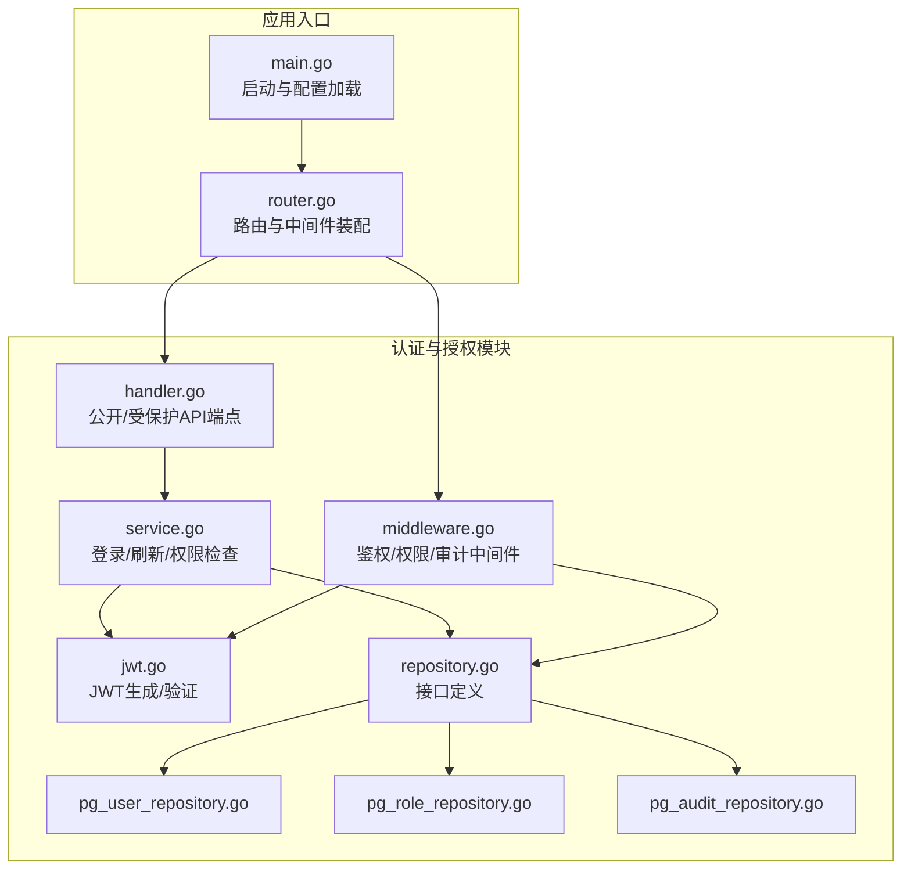
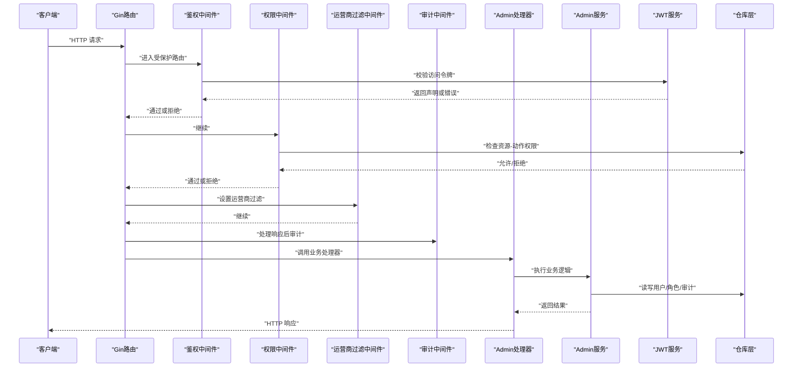
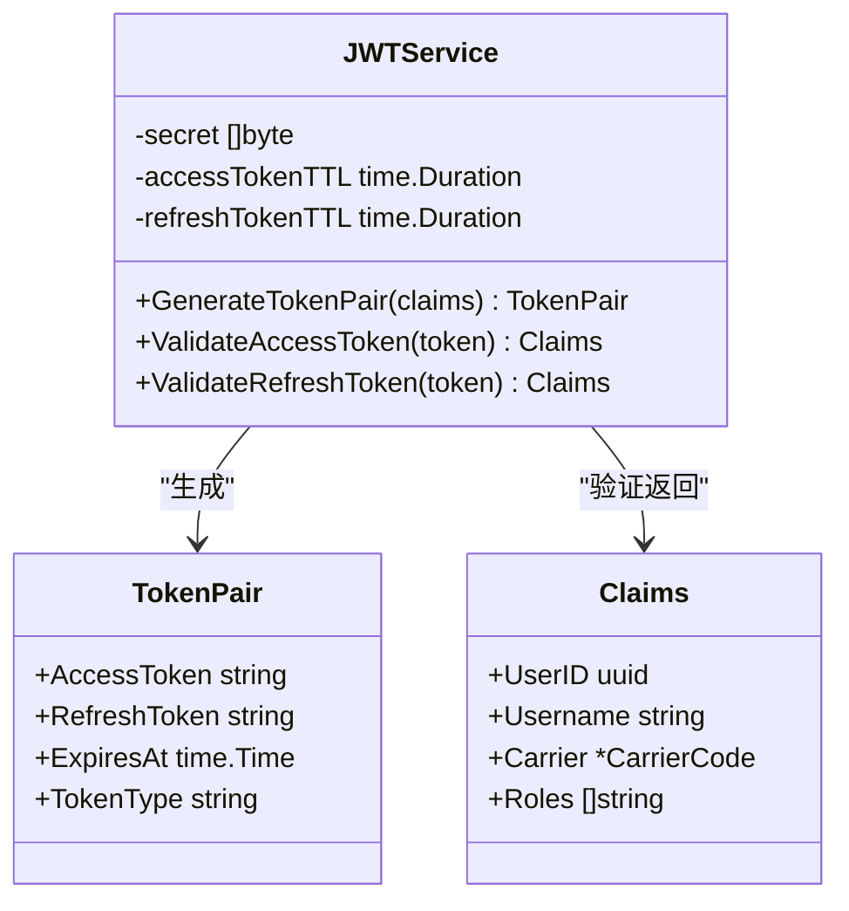
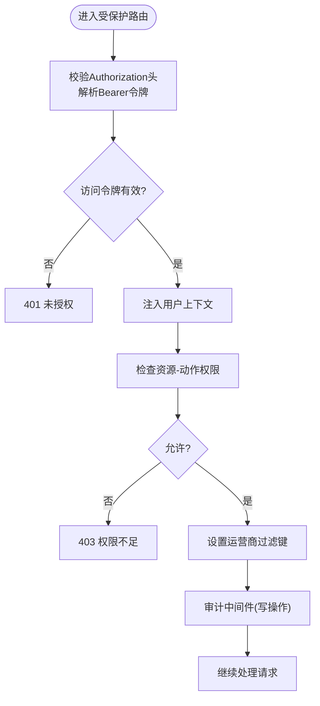
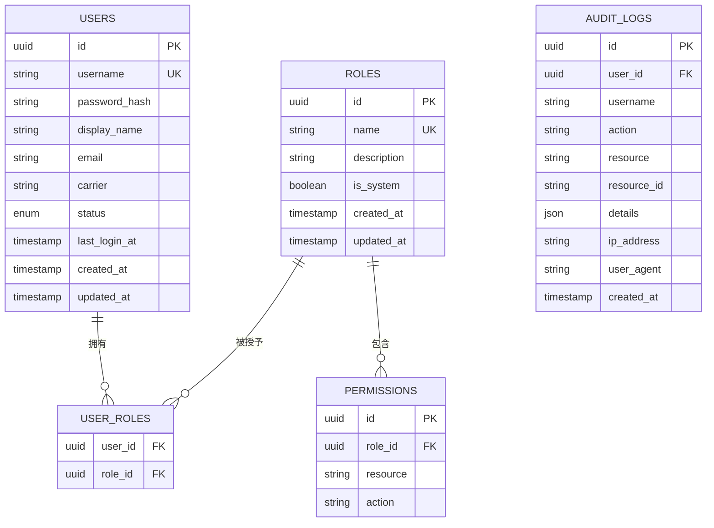
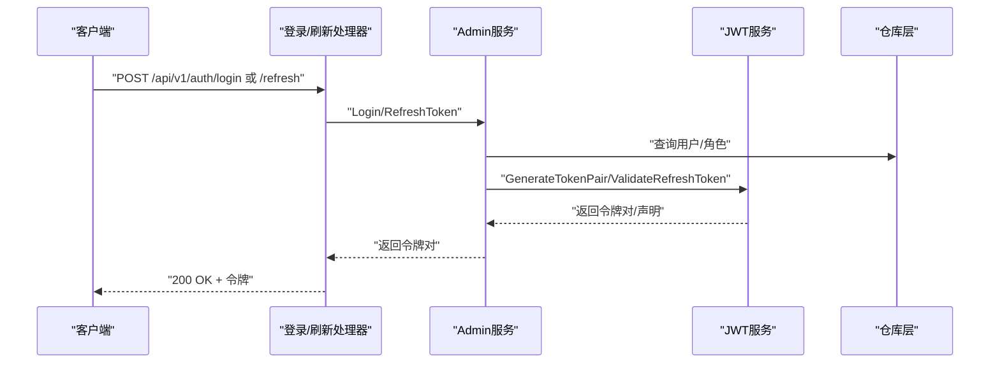
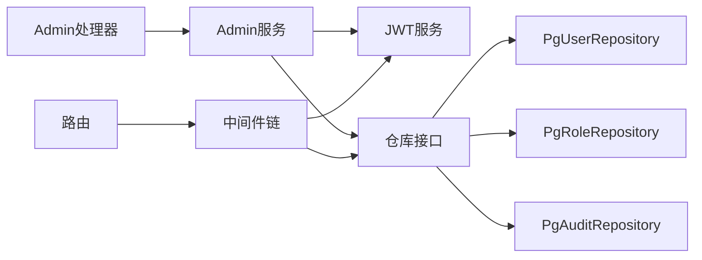

# 认证与授权

<cite>
**本文引用的文件**
- [omcgo/internal/admin/jwt.go](file://omcgo/internal/admin/jwt.go)
- [omcgo/internal/admin/middleware.go](file://omcgo/internal/admin/middleware.go)
- [omcgo/internal/admin/service.go](file://omcgo/internal/admin/service.go)
- [omcgo/internal/admin/model.go](file://omcgo/internal/admin/model.go)
- [omcgo/internal/admin/handler.go](file://omcgo/internal/admin/handler.go)
- [omcgo/internal/admin/repository.go](file://omcgo/internal/admin/repository.go)
- [omcgo/internal/admin/pg_user_repository.go](file://omcgo/internal/admin/pg_user_repository.go)
- [omcgo/internal/admin/pg_role_repository.go](file://omcgo/internal/admin/pg_role_repository.go)
- [omcgo/internal/admin/pg_audit_repository.go](file://omcgo/internal/admin/pg_audit_repository.go)
- [omcgo/cmd/app/router/router.go](file://omcgo/cmd/app/router/router.go)
- [omcgo/cmd/app/main.go](file://omcgo/cmd/app/main.go)
- [omcgo/internal/core/middleware/logging.go](file://omcgo/internal/core/middleware/logging.go)
- [omcgo/internal/acs/ratelimit.go](file://omcgo/internal/acs/ratelimit.go)
- [omcgo/internal/acs/ratelimit_test.go](file://omcgo/internal/acs/ratelimit_test.go)
- [omcgo/internal/acs/admission.go](file://omcgo/internal/acs/admission.go)
- [omcgo/internal/core/appconfig/config.go](file://omcgo/internal/core/appconfig/config.go)
- [omcgo/internal/admin/middleware_test.go](file://omcgo/internal/admin/middleware_test.go)
- [omcgo/internal/admin/handler_test.go](file://omcgo/internal/admin/handler_test.go)
</cite>

## 目录
1. [简介](#简介)
2. [项目结构](#项目结构)
3. [核心组件](#核心组件)
4. [架构总览](#架构总览)
5. [详细组件分析](#详细组件分析)
6. [依赖分析](#依赖分析)
7. [性能考虑](#性能考虑)
8. [故障排查指南](#故障排查指南)
9. [结论](#结论)
10. [附录](#附录)

## 简介
本文件面向Baicells OMC项目的认证与授权接口，覆盖以下主题：
- JWT令牌生成、验证与刷新机制（格式、有效期、签名算法）
- RBAC权限控制系统（角色、权限、资源访问控制）
- API访问控制策略（中间件、审计日志）
- 多租户（运营商）隔离机制
- 安全最佳实践与常见攻击防护
- 不同客户端的认证集成指南
- 权限检查流程与错误处理示例

## 项目结构
认证与授权相关代码主要集中在后端服务omcgo的admin模块，并在应用启动时通过路由注册中间件，统一保护API。

图示来源
- [omcgo/cmd/app/main.go:1-92](file://omcgo/cmd/app/main.go#L1-L92)
- [omcgo/cmd/app/router/router.go:1-349](file://omcgo/cmd/app/router/router.go#L1-L349)
- [omcgo/internal/admin/handler.go:1-418](file://omcgo/internal/admin/handler.go#L1-L418)
- [omcgo/internal/admin/service.go:1-353](file://omcgo/internal/admin/service.go#L1-L353)
- [omcgo/internal/admin/jwt.go:1-136](file://omcgo/internal/admin/jwt.go#L1-L136)
- [omcgo/internal/admin/middleware.go:1-167](file://omcgo/internal/admin/middleware.go#L1-L167)
- [omcgo/internal/admin/repository.go:1-45](file://omcgo/internal/admin/repository.go#L1-L45)
- [omcgo/internal/admin/pg_user_repository.go:1-328](file://omcgo/internal/admin/pg_user_repository.go#L1-L328)
- [omcgo/internal/admin/pg_role_repository.go:1-358](file://omcgo/internal/admin/pg_role_repository.go#L1-L358)
- [omcgo/internal/admin/pg_audit_repository.go:1-155](file://omcgo/internal/admin/pg_audit_repository.go#L1-L155)

章节来源
- [omcgo/cmd/app/main.go:1-92](file://omcgo/cmd/app/main.go#L1-L92)
- [omcgo/cmd/app/router/router.go:45-349](file://omcgo/cmd/app/router/router.go#L45-L349)

## 核心组件
- JWT服务：负责令牌签发、校验与类型区分（访问/刷新），并设置有效期。
- 中间件：鉴权中间件、权限中间件、运营商过滤中间件、审计日志中间件。
- 服务层：登录、刷新令牌、用户/角色/权限管理、审计日志查询。
- 数据访问层：用户、角色、权限、审计日志的PostgreSQL实现。
- 路由与入口：统一注册公开与受保护API，装配中间件链路。

章节来源
- [omcgo/internal/admin/jwt.go:12-136](file://omcgo/internal/admin/jwt.go#L12-L136)
- [omcgo/internal/admin/middleware.go:21-167](file://omcgo/internal/admin/middleware.go#L21-L167)
- [omcgo/internal/admin/service.go:15-353](file://omcgo/internal/admin/service.go#L15-L353)
- [omcgo/internal/admin/repository.go:10-45](file://omcgo/internal/admin/repository.go#L10-L45)
- [omcgo/internal/admin/pg_user_repository.go:25-328](file://omcgo/internal/admin/pg_user_repository.go#L25-L328)
- [omcgo/internal/admin/pg_role_repository.go:16-358](file://omcgo/internal/admin/pg_role_repository.go#L16-L358)
- [omcgo/internal/admin/pg_audit_repository.go:16-155](file://omcgo/internal/admin/pg_audit_repository.go#L16-L155)

## 架构总览
下图展示从客户端到服务端的认证与授权关键路径，以及中间件如何串联JWT校验、权限检查与审计日志。

图示来源
- [omcgo/cmd/app/router/router.go:170-349](file://omcgo/cmd/app/router/router.go#L170-L349)
- [omcgo/internal/admin/middleware.go:21-167](file://omcgo/internal/admin/middleware.go#L21-L167)
- [omcgo/internal/admin/service.go:41-116](file://omcgo/internal/admin/service.go#L41-L116)
- [omcgo/internal/admin/handler.go:27-97](file://omcgo/internal/admin/handler.go#L27-L97)

## 详细组件分析

### JWT令牌机制
- 令牌类型与用途
  - 访问令牌：短期有效，用于日常API访问。
  - 刷新令牌：长期有效但受限使用，用于换取新的访问令牌。
- 令牌内容
  - 包含用户标识、用户名、运营商绑定、角色列表等声明。
  - 使用标准注册声明字段（签发时间、过期时间、主题等）。
- 生成与验证
  - 使用对称签名算法进行签发与验证。
  - 校验时区分令牌主题（access/refresh），防止混淆使用。
- 有效期
  - 默认访问令牌有效期与刷新令牌有效期可配置。
- 示例路径
  - [omcgo/internal/admin/jwt.go:48-96](file://omcgo/internal/admin/jwt.go#L48-L96)
  - [omcgo/internal/admin/jwt.go:98-135](file://omcgo/internal/admin/jwt.go#L98-L135)

图示来源
- [omcgo/internal/admin/jwt.go:12-136](file://omcgo/internal/admin/jwt.go#L12-L136)
- [omcgo/internal/admin/model.go:52-80](file://omcgo/internal/admin/model.go#L52-L80)

章节来源
- [omcgo/internal/admin/jwt.go:12-136](file://omcgo/internal/admin/jwt.go#L12-L136)
- [omcgo/internal/admin/model.go:52-80](file://omcgo/internal/admin/model.go#L52-L80)

### 鉴权中间件与权限控制
- 鉴权中间件
  - 要求请求头携带Bearer令牌，校验访问令牌有效性。
  - 通过后将用户信息注入上下文。
- 权限中间件
  - 基于用户ID与资源-动作对检查权限。
  - 支持错误与拒绝场景的统一响应。
- 运营商过滤中间件
  - 若用户绑定运营商，则在上下文中设置过滤键，供后续模块使用。
- 审计中间件
  - 对成功写操作记录审计日志（异步，不影响响应）。
- 示例路径
  - [omcgo/internal/admin/middleware.go:21-167](file://omcgo/internal/admin/middleware.go#L21-L167)

图示来源
- [omcgo/internal/admin/middleware.go:21-167](file://omcgo/internal/admin/middleware.go#L21-L167)

章节来源
- [omcgo/internal/admin/middleware.go:21-167](file://omcgo/internal/admin/middleware.go#L21-L167)

### RBAC权限模型与数据存储
- 角色与权限
  - 角色拥有多个资源-动作权限。
  - 用户通过用户-角色关联间接获得权限集合。
- 存储结构
  - 用户、角色、权限、审计日志均持久化至PostgreSQL。
  - 提供角色-权限的增删改查与批量替换。
- 查询与检查
  - 权限检查通过联接用户-角色-权限表进行聚合判断。
- 示例路径
  - [omcgo/internal/admin/repository.go:10-45](file://omcgo/internal/admin/repository.go#L10-L45)
  - [omcgo/internal/admin/pg_role_repository.go:242-357](file://omcgo/internal/admin/pg_role_repository.go#L242-L357)
  - [omcgo/internal/admin/pg_user_repository.go:65-95](file://omcgo/internal/admin/pg_user_repository.go#L65-L95)

图示来源
- [omcgo/internal/admin/pg_user_repository.go:20-328](file://omcgo/internal/admin/pg_user_repository.go#L20-L328)
- [omcgo/internal/admin/pg_role_repository.go:36-358](file://omcgo/internal/admin/pg_role_repository.go#L36-L358)
- [omcgo/internal/admin/pg_audit_repository.go:33-155](file://omcgo/internal/admin/pg_audit_repository.go#L33-L155)

章节来源
- [omcgo/internal/admin/repository.go:10-45](file://omcgo/internal/admin/repository.go#L10-L45)
- [omcgo/internal/admin/pg_role_repository.go:242-357](file://omcgo/internal/admin/pg_role_repository.go#L242-L357)
- [omcgo/internal/admin/pg_user_repository.go:65-95](file://omcgo/internal/admin/pg_user_repository.go#L65-L95)

### 登录与刷新流程
- 登录
  - 校验凭据，检查账户状态，获取用户角色，签发访问/刷新令牌对。
- 刷新
  - 使用刷新令牌验证并签发新的令牌对；同时校验账户状态与角色。
- 示例路径
  - [omcgo/internal/admin/service.go:41-116](file://omcgo/internal/admin/service.go#L41-L116)
  - [omcgo/internal/admin/handler.go:65-97](file://omcgo/internal/admin/handler.go#L65-L97)

图示来源
- [omcgo/internal/admin/handler.go:65-97](file://omcgo/internal/admin/handler.go#L65-L97)
- [omcgo/internal/admin/service.go:41-116](file://omcgo/internal/admin/service.go#L41-L116)
- [omcgo/internal/admin/jwt.go:48-96](file://omcgo/internal/admin/jwt.go#L48-L96)

章节来源
- [omcgo/internal/admin/service.go:41-116](file://omcgo/internal/admin/service.go#L41-L116)
- [omcgo/internal/admin/handler.go:65-97](file://omcgo/internal/admin/handler.go#L65-L97)

### 多租户（运营商）隔离
- 用户绑定运营商
  - 用户声明中可包含运营商编码；中间件在上下文中设置运营商过滤键。
- 资源访问隔离
  - 业务模块可通过运营商过滤键对数据进行隔离查询。
- 示例路径
  - [omcgo/internal/admin/middleware.go:103-120](file://omcgo/internal/admin/middleware.go#L103-L120)
  - [omcgo/internal/admin/jwt.go:19-25](file://omcgo/internal/admin/jwt.go#L19-L25)

章节来源
- [omcgo/internal/admin/middleware.go:103-120](file://omcgo/internal/admin/middleware.go#L103-L120)
- [omcgo/internal/admin/jwt.go:19-25](file://omcgo/internal/admin/jwt.go#L19-L25)

### API访问控制策略
- 中间件链
  - CORS、请求日志、指标、健康检查、鉴权、运营商过滤、审计。
- 审计日志
  - 对GET/HEAD/OPTIONS之外的成功写操作记录，异步落库。
- 示例路径
  - [omcgo/cmd/app/router/router.go:149-179](file://omcgo/cmd/app/router/router.go#L149-L179)
  - [omcgo/internal/admin/middleware.go:122-167](file://omcgo/internal/admin/middleware.go#L122-L167)

章节来源
- [omcgo/cmd/app/router/router.go:149-179](file://omcgo/cmd/app/router/router.go#L149-L179)
- [omcgo/internal/admin/middleware.go:122-167](file://omcgo/internal/admin/middleware.go#L122-L167)

### 安全最佳实践与常见攻击防护
- 传输安全
  - 强制HTTPS传输，避免明文泄露。
- 令牌安全
  - 使用强随机密钥；短令牌有效期配合刷新令牌；禁止在日志中打印完整令牌。
- 输入校验与错误处理
  - 统一错误码与消息；避免泄露内部细节。
- 审计与监控
  - 所有写操作审计；异常与失败登录需记录。
- 速率限制与准入控制
  - 设备级限流与会话准入控制，防止滥用与DoS。
- 示例路径
  - [omcgo/internal/core/middleware/logging.go:11-35](file://omcgo/internal/core/middleware/logging.go#L11-L35)
  - [omcgo/internal/acs/ratelimit.go](file://omcgo/internal/acs/ratelimit.go)
  - [omcgo/internal/acs/admission.go:5-41](file://omcgo/internal/acs/admission.go#L5-L41)

章节来源
- [omcgo/internal/core/middleware/logging.go:11-35](file://omcgo/internal/core/middleware/logging.go#L11-L35)
- [omcgo/internal/acs/ratelimit.go](file://omcgo/internal/acs/ratelimit.go)
- [omcgo/internal/acs/admission.go:5-41](file://omcgo/internal/acs/admission.go#L5-L41)

### 不同客户端的认证集成指南
- Web前端
  - 登录后保存访问令牌于内存或安全Cookie；刷新令牌用于后台轮换。
  - 请求时统一附加Authorization: Bearer <token>。
- 移动/边缘客户端
  - 本地安全存储访问令牌；使用刷新令牌在过期前自动续期。
- 自动化脚本/第三方系统
  - 使用刷新令牌周期性获取新令牌；严格限制令牌分发范围。
- 示例路径
  - [omcgo/internal/admin/handler.go:65-97](file://omcgo/internal/admin/handler.go#L65-L97)
  - [omcgo/internal/admin/middleware.go:21-58](file://omcgo/internal/admin/middleware.go#L21-L58)

章节来源
- [omcgo/internal/admin/handler.go:65-97](file://omcgo/internal/admin/handler.go#L65-L97)
- [omcgo/internal/admin/middleware.go:21-58](file://omcgo/internal/admin/middleware.go#L21-L58)

## 依赖分析
- 组件耦合
  - Handler依赖Service；Service依赖JWT与仓库接口；中间件依赖JWT与仓库接口。
- 关系图

图示来源
- [omcgo/internal/admin/handler.go:13-25](file://omcgo/internal/admin/handler.go#L13-L25)
- [omcgo/internal/admin/service.go:15-39](file://omcgo/internal/admin/service.go#L15-L39)
- [omcgo/cmd/app/router/router.go:109-116](file://omcgo/cmd/app/router/router.go#L109-L116)

章节来源
- [omcgo/internal/admin/handler.go:13-25](file://omcgo/internal/admin/handler.go#L13-L25)
- [omcgo/internal/admin/service.go:15-39](file://omcgo/internal/admin/service.go#L15-L39)
- [omcgo/cmd/app/router/router.go:109-116](file://omcgo/cmd/app/router/router.go#L109-L116)

## 性能考虑
- 令牌签发/验证
  - HS256为对称算法，CPU开销低；建议使用足够长度密钥以保证安全性。
- 权限检查
  - 权限检查为单次数据库查询；建议在角色与权限表上建立合适索引。
- 审计日志
  - 异步写入，避免阻塞主请求路径。
- 速率限制与会话准入
  - 设备级限流与会话上限控制可防止资源耗尽；默认阈值可在配置中调整。
- 示例路径
  - [omcgo/internal/acs/ratelimit.go](file://omcgo/internal/acs/ratelimit.go)
  - [omcgo/internal/acs/admission.go:5-41](file://omcgo/internal/acs/admission.go#L5-L41)
  - [omcgo/internal/core/appconfig/config.go:125-132](file://omcgo/internal/core/appconfig/config.go#L125-L132)

章节来源
- [omcgo/internal/acs/ratelimit.go](file://omcgo/internal/acs/ratelimit.go)
- [omcgo/internal/acs/admission.go:5-41](file://omcgo/internal/acs/admission.go#L5-L41)
- [omcgo/internal/core/appconfig/config.go:125-132](file://omcgo/internal/core/appconfig/config.go#L125-L132)

## 故障排查指南
- 常见问题与定位
  - 缺少Authorization头或格式错误：鉴权中间件直接返回401。
  - 令牌无效或过期：鉴权中间件返回401。
  - 无权限访问：权限中间件返回403。
  - 写操作未记录审计：确认中间件链顺序与成功状态码。
- 单元测试参考
  - 鉴权中间件与权限中间件的测试覆盖了多种边界情况。
- 示例路径
  - [omcgo/internal/admin/middleware_test.go:94-185](file://omcgo/internal/admin/middleware_test.go#L94-L185)
  - [omcgo/internal/admin/middleware_test.go:230-284](file://omcgo/internal/admin/middleware_test.go#L230-L284)
  - [omcgo/internal/admin/handler_test.go:171-249](file://omcgo/internal/admin/handler_test.go#L171-L249)

章节来源
- [omcgo/internal/admin/middleware_test.go:94-185](file://omcgo/internal/admin/middleware_test.go#L94-L185)
- [omcgo/internal/admin/middleware_test.go:230-284](file://omcgo/internal/admin/middleware_test.go#L230-L284)
- [omcgo/internal/admin/handler_test.go:171-249](file://omcgo/internal/admin/handler_test.go#L171-L249)

## 结论
本项目实现了基于JWT的认证与RBAC权限控制，结合中间件链实现鉴权、权限检查与审计日志。通过运营商维度的上下文注入，满足多租户隔离需求。配合速率限制与会话准入控制，整体具备较好的安全性与可运维性。建议在生产环境中强化传输加密、密钥管理与审计策略，并持续优化权限模型与查询性能。

## 附录
- 配置项参考
  - JWT访问令牌与刷新令牌有效期、CORS、速率限制等配置位于应用配置模块。
- 示例路径
  - [omcgo/internal/core/appconfig/config.go:125-139](file://omcgo/internal/core/appconfig/config.go#L125-L139)

章节来源
- [omcgo/internal/core/appconfig/config.go:125-139](file://omcgo/internal/core/appconfig/config.go#L125-L139)