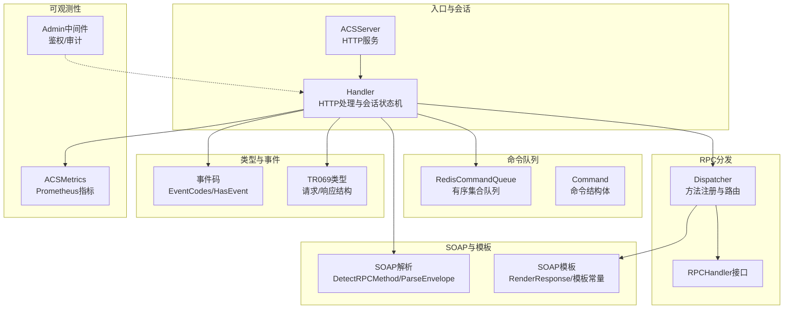
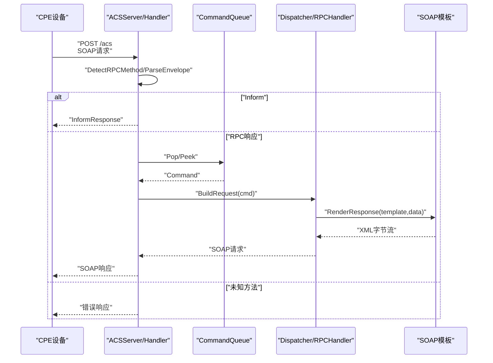
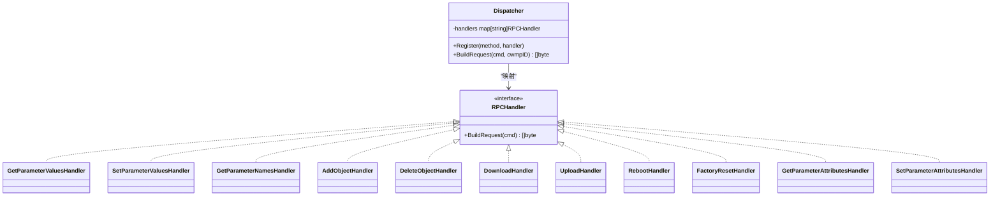
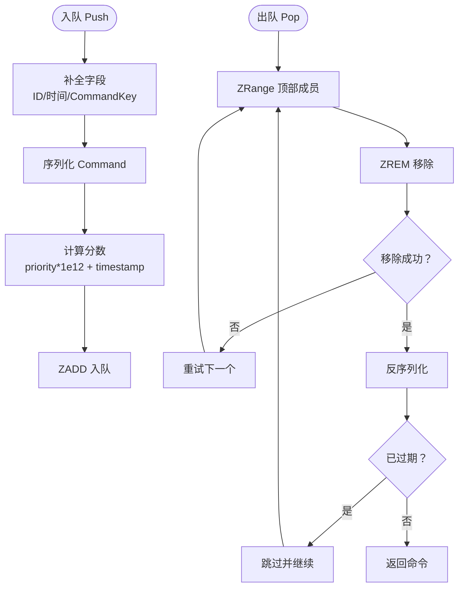
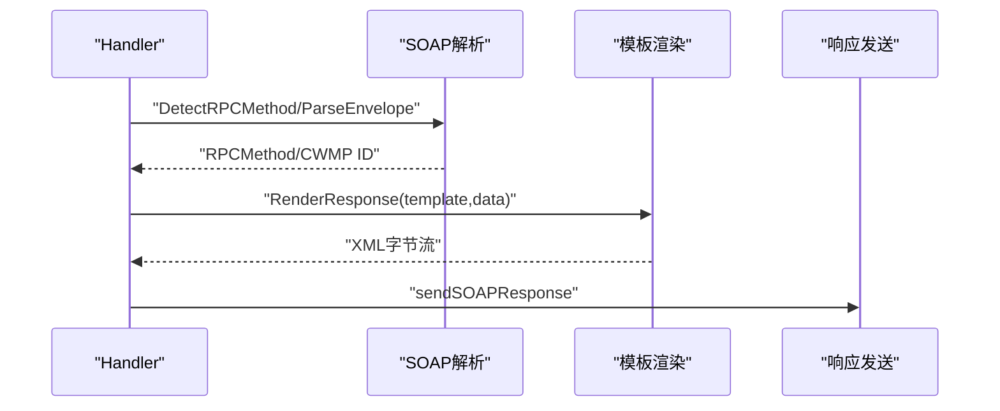
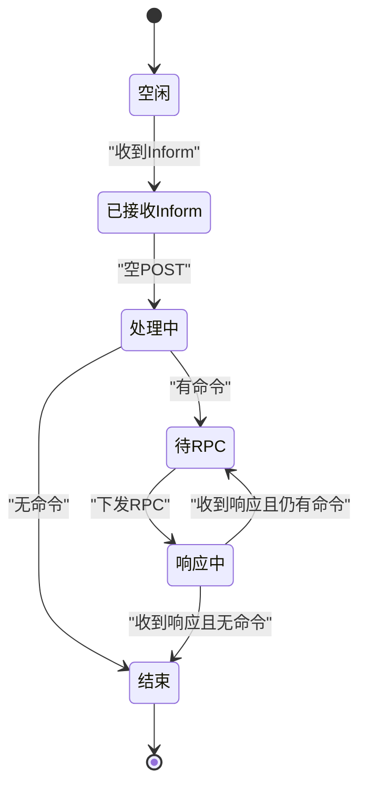
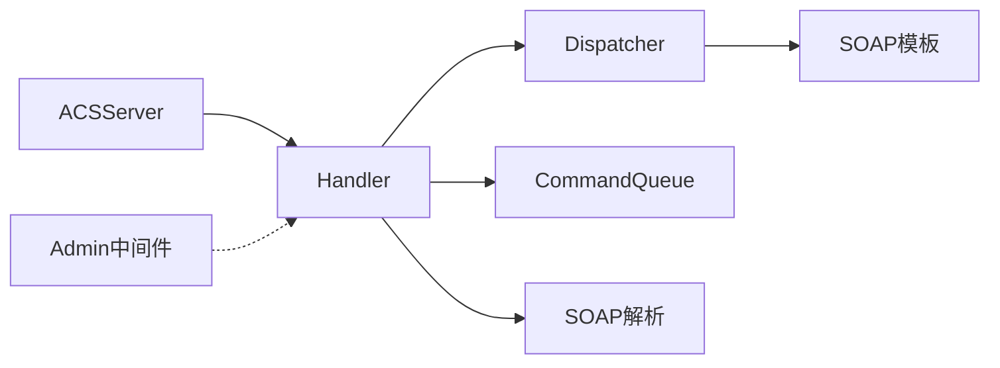

# RPC方法分发

<cite>
**本文引用的文件**
- [dispatcher.go](file://omcgo/internal/acs/rpc/dispatcher.go)
- [dispatcher_test.go](file://omcgo/internal/acs/rpc/dispatcher_test.go)
- [queue.go](file://omcgo/internal/acs/cmdqueue/queue.go)
- [envelope.go](file://omcgo/pkg/soap/envelope.go)
- [templates.go](file://omcgo/pkg/soap/templates.go)
- [handler.go](file://omcgo/internal/acs/handler.go)
- [server.go](file://omcgo/internal/acs/server.go)
- [types.go](file://omcgo/pkg/tr069/types.go)
- [events.go](file://omcgo/pkg/tr069/events.go)
- [metrics.go](file://omcgo/internal/acs/metrics.go)
- [middleware.go](file://omcgo/internal/admin/middleware.go)
</cite>

## 目录
1. [简介](#简介)
2. [项目结构](#项目结构)
3. [核心组件](#核心组件)
4. [架构总览](#架构总览)
5. [详细组件分析](#详细组件分析)
6. [依赖分析](#依赖分析)
7. [性能考虑](#性能考虑)
8. [故障排查指南](#故障排查指南)
9. [结论](#结论)
10. [附录：扩展指南](#附录扩展指南)

## 简介
本文件针对 TR069（CWMP）RPC 方法分发模块进行深入技术说明，覆盖以下主题：
- RPC 方法注册与发现机制：内置方法与可扩展方法的管理方式
- 方法调用流程：从 SOAP 请求解析到业务逻辑执行的完整链路
- 命令队列机制：异步命令与批量操作的处理策略
- 权限控制与参数验证：在接入层与业务层的约束与校验
- 扩展指南：新增方法与修改既有方法的最佳实践
- 性能监控与调试：指标体系、观测手段与排障建议

## 项目结构
RPC 方法分发涉及的关键模块与文件如下：
- RPC 分发器：负责方法注册、路由与请求模板渲染
- 命令队列：设备命令的持久化存储与优先级调度
- SOAP 解析与模板：SOAP/ CWMP 报文解析与响应模板渲染
- 处理器与服务器：HTTP 入口、会话状态机、空 POST 调度
- TR069 类型与事件：消息结构与事件码语义
- 指标与中间件：运行时指标与管理端鉴权

**图表来源**
- [server.go:39-88](file://omcgo/internal/acs/server.go#L39-L88)
- [handler.go:27-41](file://omcgo/internal/acs/handler.go#L27-L41)
- [dispatcher.go:16-54](file://omcgo/internal/acs/rpc/dispatcher.go#L16-L54)
- [queue.go:13-31](file://omcgo/internal/acs/cmdqueue/queue.go#L13-L31)
- [envelope.go:34-69](file://omcgo/pkg/soap/envelope.go#L34-L69)
- [templates.go:9-27](file://omcgo/pkg/soap/templates.go#L9-L27)
- [types.go:26-34](file://omcgo/pkg/tr069/types.go#L26-L34)
- [events.go:5-23](file://omcgo/pkg/tr069/events.go#L5-L23)
- [metrics.go:5-14](file://omcgo/internal/acs/metrics.go#L5-L14)
- [middleware.go:21-58](file://omcgo/internal/admin/middleware.go#L21-L58)

**章节来源**
- [server.go:39-88](file://omcgo/internal/acs/server.go#L39-L88)
- [handler.go:27-41](file://omcgo/internal/acs/handler.go#L27-L41)
- [dispatcher.go:16-54](file://omcgo/internal/acs/rpc/dispatcher.go#L16-L54)
- [queue.go:13-31](file://omcgo/internal/acs/cmdqueue/queue.go#L13-L31)
- [envelope.go:34-69](file://omcgo/pkg/soap/envelope.go#L34-L69)
- [templates.go:9-27](file://omcgo/pkg/soap/templates.go#L9-L27)
- [types.go:26-34](file://omcgo/pkg/tr069/types.go#L26-L34)
- [events.go:5-23](file://omcgo/pkg/tr069/events.go#L5-L23)
- [metrics.go:5-14](file://omcgo/internal/acs/metrics.go#L5-L14)
- [middleware.go:21-58](file://omcgo/internal/admin/middleware.go#L21-L58)

## 核心组件
- RPC 分发器（Dispatcher）
  - 维护方法名到处理器的映射，提供注册与构建请求能力
  - 内置标准 TR069 方法：参数读取、参数设置、参数名查询、对象增删、下载上传、重启、恢复出厂等
- 命令队列（CommandQueue）
  - 使用 Redis 有序集合实现带优先级与过期时间的队列
  - 支持入队、出队、窥视、长度查询与清空
- SOAP 解析与模板
  - 提供方法识别、SOAP 解包、模板渲染与响应生成
- 处理器（Handler）
  - HTTP 入口，解析 SOAP、驱动会话状态机、调度命令队列、调用分发器生成请求
- TR069 类型与事件
  - 定义消息结构与事件码语义，支撑业务处理与事件发布
- 指标与中间件
  - 提供会话、RPC、速率限制等指标；管理端鉴权与审计中间件

**章节来源**
- [dispatcher.go:16-54](file://omcgo/internal/acs/rpc/dispatcher.go#L16-L54)
- [queue.go:13-31](file://omcgo/internal/acs/cmdqueue/queue.go#L13-L31)
- [envelope.go:34-69](file://omcgo/pkg/soap/envelope.go#L34-L69)
- [templates.go:9-27](file://omcgo/pkg/soap/templates.go#L9-L27)
- [handler.go:27-41](file://omcgo/internal/acs/handler.go#L27-L41)
- [types.go:26-34](file://omcgo/pkg/tr069/types.go#L26-L34)
- [events.go:5-23](file://omcgo/pkg/tr069/events.go#L5-L23)
- [metrics.go:5-14](file://omcgo/internal/acs/metrics.go#L5-L14)
- [middleware.go:21-58](file://omcgo/internal/admin/middleware.go#L21-L58)

## 架构总览
下图展示 TR069 RPC 方法分发的整体交互：HTTP 入口接收 SOAP 请求，解析方法后进入会话状态机；空 POST 时从队列弹出命令并交由分发器生成对应 SOAP 请求返回给设备。

**图表来源**
- [handler.go:70-117](file://omcgo/internal/acs/handler.go#L70-L117)
- [handler.go:218-278](file://omcgo/internal/acs/handler.go#L218-L278)
- [handler.go:280-342](file://omcgo/internal/acs/handler.go#L280-L342)
- [dispatcher.go:47-54](file://omcgo/internal/acs/rpc/dispatcher.go#L47-L54)
- [templates.go:48-55](file://omcgo/pkg/soap/templates.go#L48-L55)
- [envelope.go:109-142](file://omcgo/pkg/soap/envelope.go#L109-L142)

**章节来源**
- [handler.go:70-117](file://omcgo/internal/acs/handler.go#L70-L117)
- [handler.go:218-278](file://omcgo/internal/acs/handler.go#L218-L278)
- [handler.go:280-342](file://omcgo/internal/acs/handler.go#L280-L342)
- [dispatcher.go:47-54](file://omcgo/internal/acs/rpc/dispatcher.go#L47-L54)
- [templates.go:48-55](file://omcgo/pkg/soap/templates.go#L48-L55)
- [envelope.go:109-142](file://omcgo/pkg/soap/envelope.go#L109-L142)

## 详细组件分析

### 组件一：RPC 分发器与方法注册
- 注册机制
  - 在构造函数中集中注册所有内置方法，确保启动即可用
  - 提供 Register 接口以支持外部扩展（例如通过配置或插件机制）
- 路由与构建
  - BuildRequest 根据命令 Method 查找处理器，不存在则返回错误
  - 各处理器负责解析 JSON 参数并填充模板数据结构，最终渲染为 SOAP XML
- 内置方法清单
  - 参数读取、参数设置、参数名查询、对象增删、下载上传、重启、恢复出厂、参数属性读取与设置

**图表来源**
- [dispatcher.go:16-54](file://omcgo/internal/acs/rpc/dispatcher.go#L16-L54)
- [dispatcher.go:58-229](file://omcgo/internal/acs/rpc/dispatcher.go#L58-L229)

**章节来源**
- [dispatcher.go:16-54](file://omcgo/internal/acs/rpc/dispatcher.go#L16-L54)
- [dispatcher.go:58-229](file://omcgo/internal/acs/rpc/dispatcher.go#L58-L229)
- [dispatcher_test.go:12-34](file://omcgo/internal/acs/rpc/dispatcher_test.go#L12-L34)

### 组件二：命令队列与异步/批量操作
- 数据结构与键空间
  - 使用 Redis 有序集合，键前缀标识设备序列号
  - 成员为序列化的 Command，分数用于优先级与时间混合排序
- 关键能力
  - Push：自动补全 ID、创建时间与 CommandKey，计算分数并入队
  - Pop：循环尝试移除并解包，跳过过期命令，支持并发安全
  - Peek/Len/Clear：窥视、长度查询与清空
- 异步与批量
  - 设备侧通过 Inform 建立会话，空 POST 时按队列顺序逐条下发
  - 多步骤 RPC（如下载后重启）可在响应到达后继续下发下一个命令

**图表来源**
- [queue.go:49-72](file://omcgo/internal/acs/cmdqueue/queue.go#L49-L72)
- [queue.go:74-110](file://omcgo/internal/acs/cmdqueue/queue.go#L74-L110)

**章节来源**
- [queue.go:13-31](file://omcgo/internal/acs/cmdqueue/queue.go#L13-L31)
- [queue.go:33-37](file://omcgo/internal/acs/cmdqueue/queue.go#L33-L37)
- [queue.go:49-72](file://omcgo/internal/acs/cmdqueue/queue.go#L49-L72)
- [queue.go:74-110](file://omcgo/internal/acs/cmdqueue/queue.go#L74-L110)
- [queue.go:112-134](file://omcgo/internal/acs/cmdqueue/queue.go#L112-L134)

### 组件三：SOAP 解析与模板渲染
- 方法识别
  - 从原始 Body 字符串中匹配已知方法名，支持长名称优先匹配
- 解包与封装
  - 解析 Envelope/Header/Body，提取 CWMP ID 与方法类型
- 模板渲染
  - 预编译模板，按数据结构渲染为标准 CWMP XML
  - 包含参数数组、类型声明、命令键等字段

**图表来源**
- [envelope.go:109-142](file://omcgo/pkg/soap/envelope.go#L109-L142)
- [templates.go:29-46](file://omcgo/pkg/soap/templates.go#L29-L46)
- [templates.go:48-55](file://omcgo/pkg/soap/templates.go#L48-L55)
- [handler.go:544-558](file://omcgo/internal/acs/handler.go#L544-L558)

**章节来源**
- [envelope.go:34-69](file://omcgo/pkg/soap/envelope.go#L34-L69)
- [envelope.go:109-142](file://omcgo/pkg/soap/envelope.go#L109-L142)
- [templates.go:29-46](file://omcgo/pkg/soap/templates.go#L29-L46)
- [templates.go:48-55](file://omcgo/pkg/soap/templates.go#L48-L55)
- [handler.go:544-558](file://omcgo/internal/acs/handler.go#L544-L558)

### 组件四：HTTP 处理器与会话状态机
- HTTP 入口
  - 仅允许 POST，读取请求体并检测方法
- Inform 流程
  - 解析 Inform，记录事件码与参数，创建/更新会话，发送 InformResponse
- 空 POST（Empty POST）
  - 从连接绑定获取设备 SN，切换会话状态，弹出队列命令，调用分发器生成请求
  - 若无命令则结束会话，返回空响应
- RPC 响应处理
  - 记录 RPC 持续时间，发布事件，检查队列是否有后续命令，循环下发

**图表来源**
- [handler.go:70-117](file://omcgo/internal/acs/handler.go#L70-L117)
- [handler.go:218-278](file://omcgo/internal/acs/handler.go#L218-L278)
- [handler.go:280-342](file://omcgo/internal/acs/handler.go#L280-L342)

**章节来源**
- [handler.go:70-117](file://omcgo/internal/acs/handler.go#L70-L117)
- [handler.go:218-278](file://omcgo/internal/acs/handler.go#L218-L278)
- [handler.go:280-342](file://omcgo/internal/acs/handler.go#L280-L342)

### 组件五：权限控制与参数验证
- 管理端权限
  - 通过 JWT 中间件校验访问令牌，并基于资源-动作权限检查
- 参数验证
  - 分发器各处理器对 JSON 参数进行结构化解析与默认值处理（如类型默认值）
  - SOAP 模板严格按 TR069 规范渲染字段，减少运行期错误
- 会话与准入控制
  - 速率限制与并发会话上限，避免过载

**章节来源**
- [middleware.go:21-58](file://omcgo/internal/admin/middleware.go#L21-L58)
- [middleware.go:60-101](file://omcgo/internal/admin/middleware.go#L60-L101)
- [dispatcher.go:58-229](file://omcgo/internal/acs/rpc/dispatcher.go#L58-L229)
- [handler.go:153-167](file://omcgo/internal/acs/handler.go#L153-L167)

## 依赖分析
- 组件耦合
  - Handler 依赖 Dispatcher、CommandQueue、SOAP 模块与事件总线
  - Dispatcher 依赖 SOAP 模板与命令结构体
  - Server 负责装配依赖并启动 HTTP 服务
- 外部依赖
  - Redis：命令队列持久化与并发安全
  - Prometheus：指标采集
  - Gin/JWT：管理端鉴权中间件

**图表来源**
- [server.go:39-88](file://omcgo/internal/acs/server.go#L39-L88)
- [handler.go:27-41](file://omcgo/internal/acs/handler.go#L27-L41)
- [dispatcher.go:16-54](file://omcgo/internal/acs/rpc/dispatcher.go#L16-L54)
- [queue.go:13-31](file://omcgo/internal/acs/cmdqueue/queue.go#L13-L31)
- [envelope.go:34-69](file://omcgo/pkg/soap/envelope.go#L34-L69)
- [templates.go:9-27](file://omcgo/pkg/soap/templates.go#L9-L27)
- [middleware.go:21-58](file://omcgo/internal/admin/middleware.go#L21-L58)

**章节来源**
- [server.go:39-88](file://omcgo/internal/acs/server.go#L39-L88)
- [handler.go:27-41](file://omcgo/internal/acs/handler.go#L27-L41)
- [dispatcher.go:16-54](file://omcgo/internal/acs/rpc/dispatcher.go#L16-L54)
- [queue.go:13-31](file://omcgo/internal/acs/cmdqueue/queue.go#L13-L31)
- [envelope.go:34-69](file://omcgo/pkg/soap/envelope.go#L34-L69)
- [templates.go:9-27](file://omcgo/pkg/soap/templates.go#L9-L27)
- [middleware.go:21-58](file://omcgo/internal/admin/middleware.go#L21-L58)

## 性能考虑
- 指标体系
  - 活跃会话数、Inform 事件计数、RPC 持续时间直方图、RPC 错误计数、会话时长直方图、速率限制拒绝次数与设备数
- 优化建议
  - 合理设置队列优先级与过期时间，避免堆积
  - 控制模板渲染复杂度，保持参数结构简洁
  - 适度调整速率限制与并发会话上限，结合业务峰值规划
  - 对热点设备使用本地缓存或预热队列

**章节来源**
- [metrics.go:5-14](file://omcgo/internal/acs/metrics.go#L5-L14)
- [metrics.go:16-62](file://omcgo/internal/acs/metrics.go#L16-L62)

## 故障排查指南
- 常见问题定位
  - 未知方法：检查分发器是否注册该方法，确认请求体方法名拼写与大小写
  - 队列无命令：确认命令是否正确入队、是否过期、是否被并发消费
  - 参数解析失败：检查 JSON 结构与字段类型，必要时补充默认值
  - 会话未结束：确认空 POST 是否触发、队列是否为空、是否发生错误中断
- 调试技巧
  - 启用 Handler 的调试日志，关注请求体预览、CWMP ID、事件码与会话状态变化
  - 使用指标观察 RPC 持续时间与错误分布，定位慢调用与异常方法
  - 对关键路径增加单元测试，覆盖参数边界与错误分支

**章节来源**
- [dispatcher_test.go:36-48](file://omcgo/internal/acs/rpc/dispatcher_test.go#L36-L48)
- [handler.go:120-216](file://omcgo/internal/acs/handler.go#L120-L216)
- [handler.go:218-278](file://omcgo/internal/acs/handler.go#L218-L278)
- [handler.go:280-342](file://omcgo/internal/acs/handler.go#L280-L342)

## 结论
本模块以“分发器 + 队列 + SOAP 模板”的清晰分层实现了 TR069 RPC 方法的注册、路由与执行。通过会话状态机与空 POST 机制，天然支持异步与多步骤操作；结合指标与中间件，具备良好的可观测性与安全性。扩展新方法时遵循“注册 + 处理器 + 模板”的模式即可快速集成。

## 附录：扩展指南
- 新增 RPC 方法
  - 在分发器中注册方法名与处理器
  - 编写处理器：解析 JSON 参数，填充模板数据结构
  - 添加/更新模板：在模板文件中定义数据结构与 XML 片段
  - 补充测试：覆盖参数解析、默认值与输出片段
- 修改既有方法
  - 保持方法名不变，仅调整参数结构与模板渲染
  - 注意向后兼容性，避免破坏现有设备行为
- 权限与验证
  - 管理端接口使用鉴权中间件保护
  - 业务参数尽量在处理器内完成基础校验，必要时引入更严格的校验器

**章节来源**
- [dispatcher.go:42-45](file://omcgo/internal/acs/rpc/dispatcher.go#L42-L45)
- [dispatcher.go:58-229](file://omcgo/internal/acs/rpc/dispatcher.go#L58-L229)
- [templates.go:29-46](file://omcgo/pkg/soap/templates.go#L29-L46)
- [dispatcher_test.go:50-179](file://omcgo/internal/acs/rpc/dispatcher_test.go#L50-L179)
- [middleware.go:21-58](file://omcgo/internal/admin/middleware.go#L21-L58)