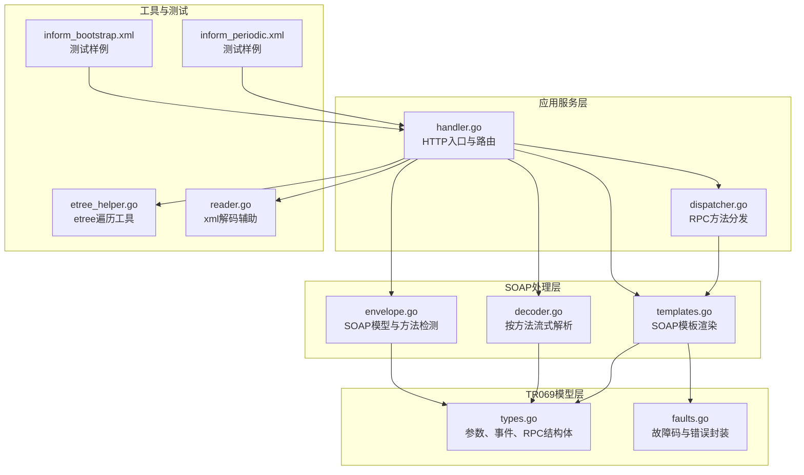
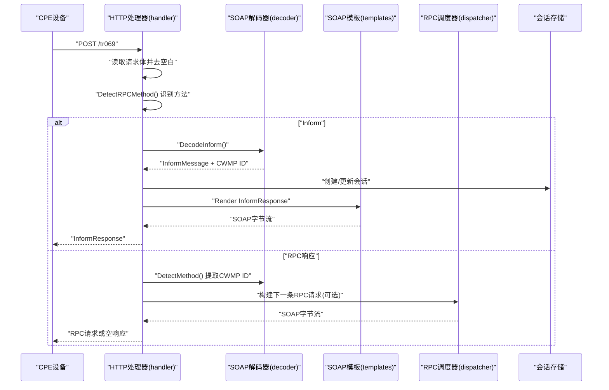
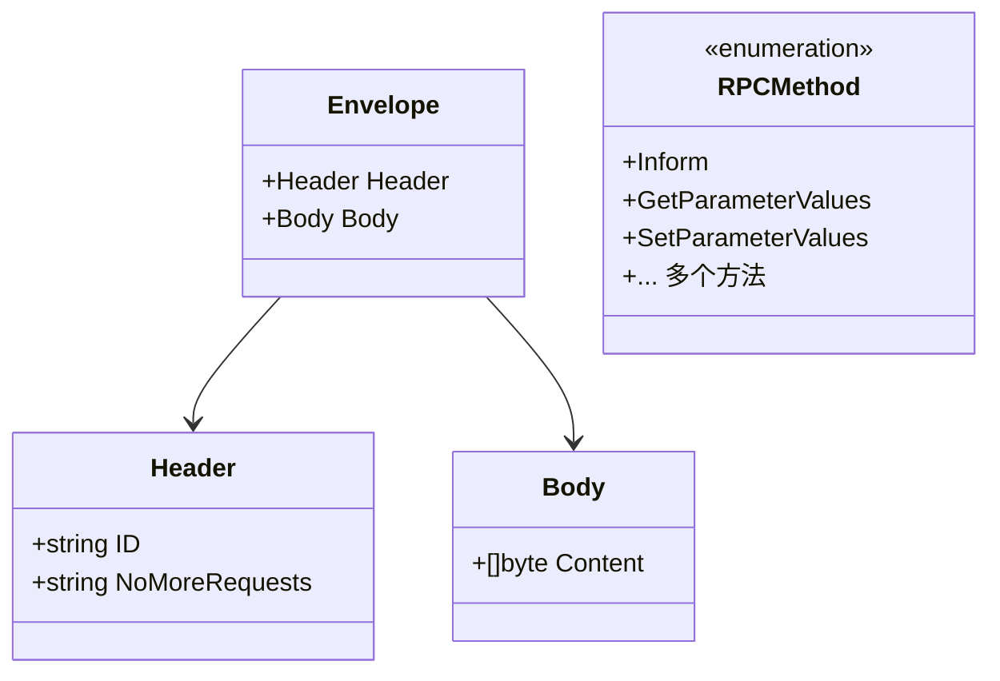
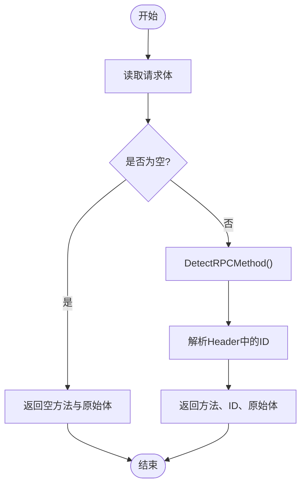
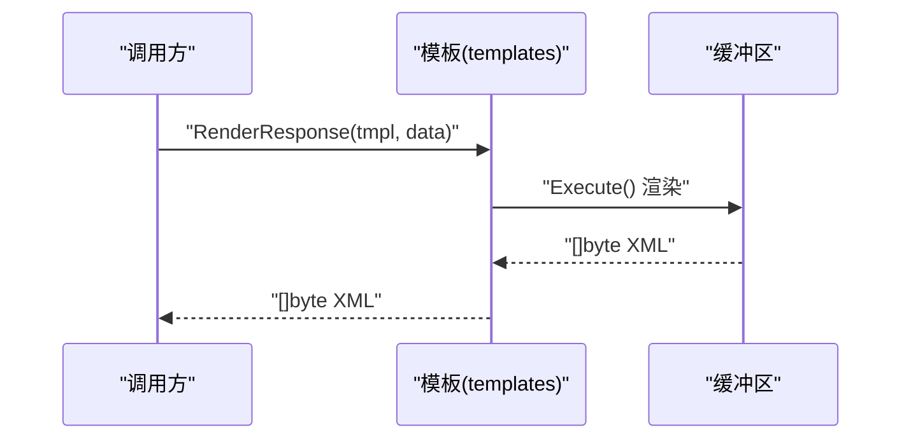
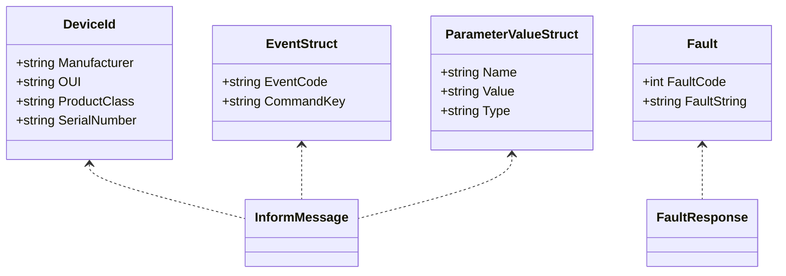
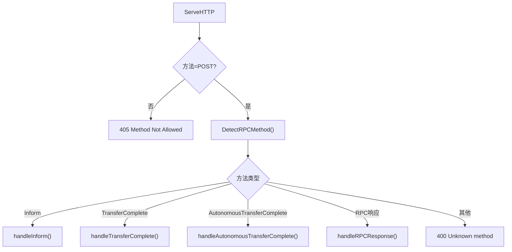
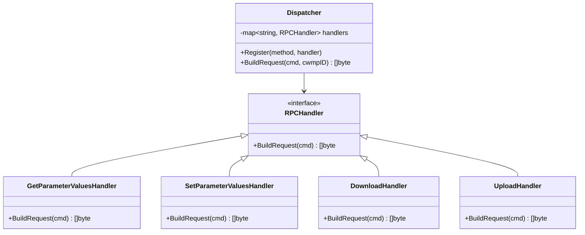
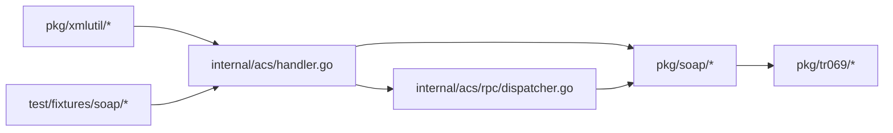

# SOAP消息处理

<cite>
**本文引用的文件**
- [envelope.go](file://omcgo/pkg/soap/envelope.go)
- [decoder.go](file://omcgo/pkg/soap/decoder.go)
- [templates.go](file://omcgo/pkg/soap/templates.go)
- [types.go](file://omcgo/pkg/tr069/types.go)
- [faults.go](file://omcgo/pkg/tr069/faults.go)
- [dispatcher.go](file://omcgo/internal/acs/rpc/dispatcher.go)
- [handler.go](file://omcgo/internal/acs/handler.go)
- [inform_bootstrap.xml](file://omcgo/test/fixtures/soap/inform_bootstrap.xml)
- [inform_periodic.xml](file://omcgo/test/fixtures/soap/inform_periodic.xml)
- [etree_helper.go](file://omcgo/pkg/xmlutil/etree_helper.go)
- [reader.go](file://omcgo/pkg/xmlutil/reader.go)
</cite>

## 目录
1. [简介](#简介)
2. [项目结构](#项目结构)
3. [核心组件](#核心组件)
4. [架构概览](#架构概览)
5. [详细组件分析](#详细组件分析)
6. [依赖关系分析](#依赖关系分析)
7. [性能考虑](#性能考虑)
8. [故障排查指南](#故障排查指南)
9. [结论](#结论)
10. [附录](#附录)

## 简介
本文件面向TR069（CWMP）协议的SOAP消息处理模块，系统性阐述SOAP Envelope结构、Header与Body的组织方式；从原始字节流到结构化数据的XML解析流程；SOAP消息的编码与解码机制（命名空间、字符编码与格式校验）；消息路由与分发逻辑（将SOAP请求映射到相应RPC方法）；以及错误处理策略与异常恢复机制。同时提供实际消息示例与调试技巧，帮助开发者快速定位问题并优化性能。

## 项目结构
SOAP消息处理相关代码主要分布在以下位置：
- SOAP模型与解析：pkg/soap
- TR069数据模型：pkg/tr069
- 请求路由与会话控制：internal/acs
- XML工具库：pkg/xmlutil
- 测试夹具：test/fixtures/soap

**图表来源**
- [envelope.go:1-143](file://omcgo/pkg/soap/envelope.go#L1-L143)
- [decoder.go:1-705](file://omcgo/pkg/soap/decoder.go#L1-L705)
- [templates.go:1-303](file://omcgo/pkg/soap/templates.go#L1-L303)
- [types.go:1-211](file://omcgo/pkg/tr069/types.go#L1-L211)
- [faults.go:1-58](file://omcgo/pkg/tr069/faults.go#L1-L58)
- [dispatcher.go:1-230](file://omcgo/internal/acs/rpc/dispatcher.go#L1-L230)
- [handler.go:1-567](file://omcgo/internal/acs/handler.go#L1-L567)
- [etree_helper.go:1-55](file://omcgo/pkg/xmlutil/etree_helper.go#L1-L55)
- [reader.go:1-48](file://omcgo/pkg/xmlutil/reader.go#L1-L48)
- [inform_bootstrap.xml:1-51](file://omcgo/test/fixtures/soap/inform_bootstrap.xml#L1-L51)
- [inform_periodic.xml:1-43](file://omcgo/test/fixtures/soap/inform_periodic.xml#L1-L43)

**章节来源**
- [envelope.go:1-143](file://omcgo/pkg/soap/envelope.go#L1-L143)
- [decoder.go:1-705](file://omcgo/pkg/soap/decoder.go#L1-L705)
- [templates.go:1-303](file://omcgo/pkg/soap/templates.go#L1-L303)
- [types.go:1-211](file://omcgo/pkg/tr069/types.go#L1-L211)
- [faults.go:1-58](file://omcgo/pkg/tr069/faults.go#L1-L58)
- [dispatcher.go:1-230](file://omcgo/internal/acs/rpc/dispatcher.go#L1-L230)
- [handler.go:1-567](file://omcgo/internal/acs/handler.go#L1-L567)
- [etree_helper.go:1-55](file://omcgo/pkg/xmlutil/etree_helper.go#L1-L55)
- [reader.go:1-48](file://omcgo/pkg/xmlutil/reader.go#L1-L48)
- [inform_bootstrap.xml:1-51](file://omcgo/test/fixtures/soap/inform_bootstrap.xml#L1-L51)
- [inform_periodic.xml:1-43](file://omcgo/test/fixtures/soap/inform_periodic.xml#L1-L43)

## 核心组件
- SOAP模型与方法检测：定义SOAP Envelope/Header/Body结构，提供RPC方法识别能力。
- 流式解码器：针对不同RPC方法进行流式解析，提取CWMP ID与业务载荷。
- 模板引擎：预编译SOAP响应模板，按数据结构渲染标准XML。
- TR069数据模型：设备标识、事件、参数结构及RPC请求/响应类型。
- 故障码体系：标准化CWMP故障码与错误信息。
- HTTP处理器：接收POST请求，路由到对应方法处理函数。
- RPC调度器：根据命令类型构建SOAP请求模板数据并渲染输出。

**章节来源**
- [envelope.go:16-142](file://omcgo/pkg/soap/envelope.go#L16-L142)
- [decoder.go:12-704](file://omcgo/pkg/soap/decoder.go#L12-L704)
- [templates.go:9-303](file://omcgo/pkg/soap/templates.go#L9-L303)
- [types.go:5-211](file://omcgo/pkg/tr069/types.go#L5-L211)
- [faults.go:5-58](file://omcgo/pkg/tr069/faults.go#L5-L58)
- [handler.go:70-117](file://omcgo/internal/acs/handler.go#L70-L117)
- [dispatcher.go:16-54](file://omcgo/internal/acs/rpc/dispatcher.go#L16-L54)

## 架构概览
SOAP消息处理遵循“HTTP入口 → 方法检测 → 解析/渲染 → 会话与队列驱动”的流水线模式。HTTP处理器负责接收请求、识别RPC方法、调用相应解码器或模板渲染器，并通过会话存储与命令队列实现状态机流转。

**图表来源**
- [handler.go:70-117](file://omcgo/internal/acs/handler.go#L70-L117)
- [decoder.go:12-704](file://omcgo/pkg/soap/decoder.go#L12-L704)
- [templates.go:48-55](file://omcgo/pkg/soap/templates.go#L48-L55)
- [dispatcher.go:47-54](file://omcgo/internal/acs/rpc/dispatcher.go#L47-L54)

**章节来源**
- [handler.go:70-117](file://omcgo/internal/acs/handler.go#L70-L117)
- [decoder.go:12-704](file://omcgo/pkg/soap/decoder.go#L12-L704)
- [templates.go:48-55](file://omcgo/pkg/soap/templates.go#L48-L55)
- [dispatcher.go:47-54](file://omcgo/internal/acs/rpc/dispatcher.go#L47-L54)

## 详细组件分析

### SOAP模型与方法检测
- Envelope/Header/Body结构体定义了SOAP/CWMP命名空间常量与字段标签，确保序列化/反序列化符合TR069规范。
- RPCMethod枚举覆盖常见CWMP方法，便于统一识别与路由。
- DetectRPCMethod通过子串匹配从原始Body字节中提取方法名，优先匹配更长/更具体的方法名，避免误判。

**图表来源**
- [envelope.go:16-32](file://omcgo/pkg/soap/envelope.go#L16-L32)
- [envelope.go:34-69](file://omcgo/pkg/soap/envelope.go#L34-L69)

**章节来源**
- [envelope.go:10-142](file://omcgo/pkg/soap/envelope.go#L10-L142)

### 流式解码器（按方法解析）
- DecodeInform/DecodeTransferComplete等函数采用xml.Decoder逐令牌扫描，仅在目标元素出现时才DecodeElement，减少内存占用与解析开销。
- 从Header中提取CWMP ID，从Body中提取目标RPC对象，返回结构化数据与CWMP ID。
- DetectMethod一次性读取请求体，执行方法检测与CWMP ID提取，用于RPC响应路径。

**图表来源**
- [decoder.go:667-704](file://omcgo/pkg/soap/decoder.go#L667-L704)

**章节来源**
- [decoder.go:12-704](file://omcgo/pkg/soap/decoder.go#L12-L704)

### 模板渲染与命名空间处理
- 预编译模板（如InformResponse、GetParameterValues等），使用text/template按数据结构生成标准SOAP XML。
- 模板内显式声明SOAP/CWMP命名空间与XSD/XSI类型，确保客户端兼容性。
- RenderResponse统一错误处理，返回XML字节流供HTTP响应发送。

**图表来源**
- [templates.go:48-55](file://omcgo/pkg/soap/templates.go#L48-L55)
- [templates.go:158-303](file://omcgo/pkg/soap/templates.go#L158-L303)

**章节来源**
- [templates.go:9-303](file://omcgo/pkg/soap/templates.go#L9-L303)

### TR069数据模型与故障码
- types.go定义设备标识、事件、参数值、RPC请求/响应等结构体，字段标签与JSON标签一致，便于跨协议传输。
- faults.go定义标准故障码与消息映射，支持自定义消息，便于统一错误语义。

**图表来源**
- [types.go:5-211](file://omcgo/pkg/tr069/types.go#L5-L211)
- [faults.go:41-58](file://omcgo/pkg/tr069/faults.go#L41-L58)

**章节来源**
- [types.go:5-211](file://omcgo/pkg/tr069/types.go#L5-L211)
- [faults.go:5-58](file://omcgo/pkg/tr069/faults.go#L5-L58)

### HTTP入口与消息路由
- ServeHTTP限制为POST方法，读取请求体后进行空白裁剪与方法检测，分派到对应处理函数。
- handleInform：解析Inform，创建/更新会话，发布事件，返回InformResponse。
- handleEmpty：空POST场景，检查命令队列，构建RPC请求或结束会话。
- handleRPCResponse：处理各类RPC响应，记录指标，继续下发后续命令或结束会话。
- handleTransferComplete/handleAutonomousTransferComplete：处理文件传输完成事件，返回对应响应模板。

**图表来源**
- [handler.go:70-117](file://omcgo/internal/acs/handler.go#L70-L117)
- [handler.go:119-216](file://omcgo/internal/acs/handler.go#L119-L216)
- [handler.go:218-278](file://omcgo/internal/acs/handler.go#L218-L278)
- [handler.go:280-342](file://omcgo/internal/acs/handler.go#L280-L342)
- [handler.go:361-442](file://omcgo/internal/acs/handler.go#L361-L442)

**章节来源**
- [handler.go:70-117](file://omcgo/internal/acs/handler.go#L70-L117)
- [handler.go:119-216](file://omcgo/internal/acs/handler.go#L119-L216)
- [handler.go:218-278](file://omcgo/internal/acs/handler.go#L218-L278)
- [handler.go:280-342](file://omcgo/internal/acs/handler.go#L280-L342)
- [handler.go:361-442](file://omcgo/internal/acs/handler.go#L361-L442)

### RPC调度与请求构建
- Dispatcher注册标准RPC方法处理器，按命令类型构建请求数据并渲染SOAP模板。
- 各处理器从JSON参数中提取必要字段，填充模板数据结构，最终输出SOAP字节流。

**图表来源**
- [dispatcher.go:11-54](file://omcgo/internal/acs/rpc/dispatcher.go#L11-L54)
- [dispatcher.go:56-230](file://omcgo/internal/acs/rpc/dispatcher.go#L56-L230)

**章节来源**
- [dispatcher.go:16-54](file://omcgo/internal/acs/rpc/dispatcher.go#L16-L54)
- [dispatcher.go:56-230](file://omcgo/internal/acs/rpc/dispatcher.go#L56-L230)

### 实际消息示例与调试技巧
- 测试夹具提供典型的Inform消息样例，展示SOAP Envelope、Header（含CWMP ID）、Body（含DeviceId、Event、ParameterList）的完整结构。
- 调试建议：
  - 在HTTP处理器中打印原始请求体预览与解析后的结构，便于定位格式问题。
  - 使用etree工具遍历参数树，验证路径与值的一致性。
  - 对于复杂RPC响应，先用DetectMethod提取CWMP ID，再按方法分支解析。

**章节来源**
- [inform_bootstrap.xml:1-51](file://omcgo/test/fixtures/soap/inform_bootstrap.xml#L1-L51)
- [inform_periodic.xml:1-43](file://omcgo/test/fixtures/soap/inform_periodic.xml#L1-L43)
- [handler.go:122-139](file://omcgo/internal/acs/handler.go#L122-L139)
- [etree_helper.go:9-55](file://omcgo/pkg/xmlutil/etree_helper.go#L9-L55)

## 依赖关系分析
- SOAP层依赖TR069类型定义，用于结构化数据的序列化/反序列化。
- HTTP处理器依赖SOAP解码器与模板渲染器，同时与RPC调度器协作。
- RPC调度器依赖SOAP模板数据结构，将命令参数映射到模板数据。
- XML工具库提供etree与xml解码辅助，支撑参数树遍历与元素查找。

**图表来源**
- [handler.go:1-567](file://omcgo/internal/acs/handler.go#L1-L567)
- [dispatcher.go:1-230](file://omcgo/internal/acs/rpc/dispatcher.go#L1-L230)
- [envelope.go:1-143](file://omcgo/pkg/soap/envelope.go#L1-L143)
- [types.go:1-211](file://omcgo/pkg/tr069/types.go#L1-L211)
- [etree_helper.go:1-55](file://omcgo/pkg/xmlutil/etree_helper.go#L1-L55)
- [reader.go:1-48](file://omcgo/pkg/xmlutil/reader.go#L1-L48)
- [inform_bootstrap.xml:1-51](file://omcgo/test/fixtures/soap/inform_bootstrap.xml#L1-L51)

**章节来源**
- [handler.go:1-567](file://omcgo/internal/acs/handler.go#L1-L567)
- [dispatcher.go:1-230](file://omcgo/internal/acs/rpc/dispatcher.go#L1-L230)
- [envelope.go:1-143](file://omcgo/pkg/soap/envelope.go#L1-L143)
- [types.go:1-211](file://omcgo/pkg/tr069/types.go#L1-L211)
- [etree_helper.go:1-55](file://omcgo/pkg/xmlutil/etree_helper.go#L1-L55)
- [reader.go:1-48](file://omcgo/pkg/xmlutil/reader.go#L1-L48)
- [inform_bootstrap.xml:1-51](file://omcgo/test/fixtures/soap/inform_bootstrap.xml#L1-L51)

## 性能考虑
- 流式解析：仅在目标元素出现时DecodeElement，避免全量解析，降低内存峰值与CPU消耗。
- 模板预编译：所有响应模板在init阶段编译，运行时直接Execute，减少模板解析开销。
- 方法检测：DetectRPCMethod使用有序列表与字符串包含判断，注意方法名长度顺序，避免误匹配导致额外解析。
- 会话与队列：通过会话存储与命令队列实现状态机流转，避免阻塞等待，提升并发吞吐。

[本节为通用性能讨论，不直接分析具体文件]

## 故障排查指南
- 解析失败
  - 检查请求体是否为空或仅空白字符，空POST应返回空响应。
  - 确认SOAP命名空间与元素名称正确，参考模板与测试夹具。
  - 使用etree工具遍历参数树，确认路径与标签一致。
- 方法识别错误
  - 确保DetectRPCMethod的匹配顺序合理，优先匹配更具体的方法名。
  - 对于响应消息，先用DetectMethod提取CWMP ID，再按方法分支解析。
- 错误响应
  - 使用faults模块构造标准故障码与消息，确保客户端可正确识别。
  - 在HTTP处理器中记录详细错误上下文，便于定位问题。
- 并发与会话
  - 关注连接级会话绑定与清理，避免僵尸会话占用资源。
  - 监控速率限制与准入控制触发情况，及时扩容或调整阈值。

**章节来源**
- [decoder.go:667-704](file://omcgo/pkg/soap/decoder.go#L667-L704)
- [handler.go:70-117](file://omcgo/internal/acs/handler.go#L70-L117)
- [faults.go:41-58](file://omcgo/pkg/tr069/faults.go#L41-L58)
- [etree_helper.go:9-55](file://omcgo/pkg/xmlutil/etree_helper.go#L9-L55)

## 结论
该SOAP消息处理模块以清晰的分层设计实现了TR069/CWMP协议的完整处理链路：从HTTP入口到方法识别、从流式解析到模板渲染、从会话管理到RPC调度。通过预编译模板、流式解析与严格的命名空间处理，系统在保证兼容性的同时兼顾性能与可维护性。配合完善的错误处理与调试工具，能够有效支撑大规模设备接入与管理场景。

[本节为总结性内容，不直接分析具体文件]

## 附录

### SOAP Envelope结构要点
- 命名空间：SOAP Envelope与CWMP命名空间需严格匹配。
- Header：包含CWMP ID与mustUnderstand标记。
- Body：承载RPC方法的原始XML，Body.Content以字节形式保留原始结构，便于后续按方法解析。

**章节来源**
- [envelope.go:10-32](file://omcgo/pkg/soap/envelope.go#L10-L32)
- [templates.go:160-172](file://omcgo/pkg/soap/templates.go#L160-L172)

### XML解析流程（从字节流到结构化数据）
- 读取请求体并去空白。
- 使用xml.Decoder逐令牌扫描，遇到StartElement时判断本地名。
- 对于Header中的ID与Body中的目标RPC元素，使用DecodeElement解析为结构体。
- 对于RPC响应，先用DetectMethod提取CWMP ID，再按方法分支解析。

**章节来源**
- [decoder.go:12-704](file://omcgo/pkg/soap/decoder.go#L12-L704)

### 编码与解码机制
- 编码：通过预编译模板与RenderResponse生成标准SOAP XML，设置Content-Type为text/xml; charset=utf-8。
- 解码：按方法流式解析，保持与TR069规范一致的命名空间与类型标注。
- 字符编码：模板与测试夹具均使用UTF-8，确保跨平台兼容。

**章节来源**
- [templates.go:48-55](file://omcgo/pkg/soap/templates.go#L48-L55)
- [inform_bootstrap.xml:1-51](file://omcgo/test/fixtures/soap/inform_bootstrap.xml#L1-L51)
- [inform_periodic.xml:1-43](file://omcgo/test/fixtures/soap/inform_periodic.xml#L1-L43)

### 消息路由与分发逻辑
- HTTP处理器根据DetectRPCMethod结果分派到对应处理函数。
- 对于Inform，先返回InformResponse，随后在空POST中下发RPC命令。
- 对于RPC响应，更新会话状态，记录指标，继续下发队列中的命令或结束会话。
- RPC请求由调度器根据命令类型构建模板数据并渲染输出。

**章节来源**
- [handler.go:70-117](file://omcgo/internal/acs/handler.go#L70-L117)
- [handler.go:218-278](file://omcgo/internal/acs/handler.go#L218-L278)
- [dispatcher.go:47-54](file://omcgo/internal/acs/rpc/dispatcher.go#L47-L54)

### 错误处理策略与异常恢复
- 统一错误包装：解析与渲染错误均使用fmt.Errorf包裹上下文。
- 标准故障码：使用faults模块定义的故障码与消息映射。
- 异常恢复：HTTP处理器对未知方法返回400，解析失败返回400，模板渲染失败返回500；会话绑定与清理由连接级会话表与后台清理器保障。

**章节来源**
- [decoder.go:12-704](file://omcgo/pkg/soap/decoder.go#L12-L704)
- [handler.go:70-117](file://omcgo/internal/acs/handler.go#L70-L117)
- [faults.go:41-58](file://omcgo/pkg/tr069/faults.go#L41-L58)