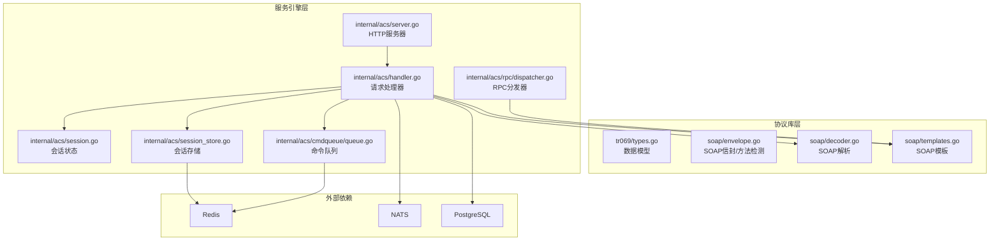
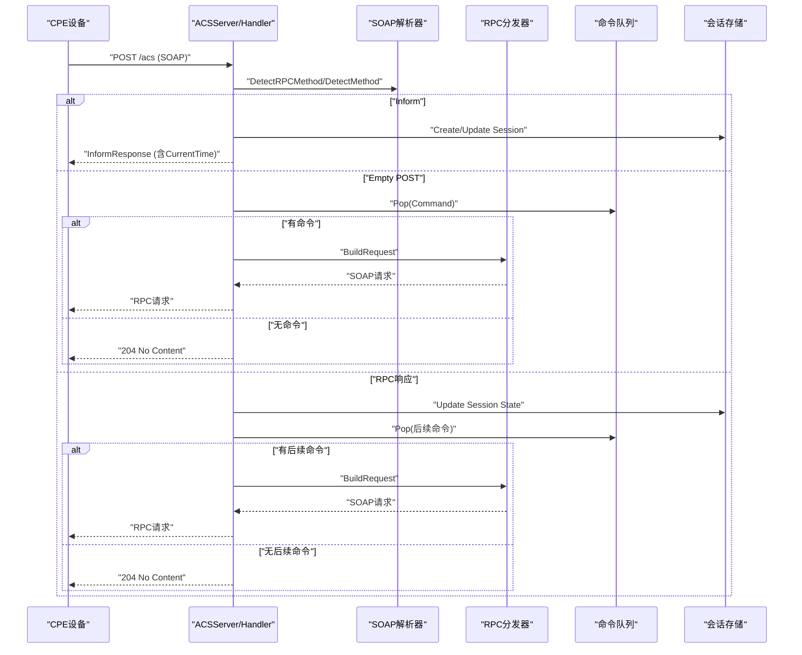
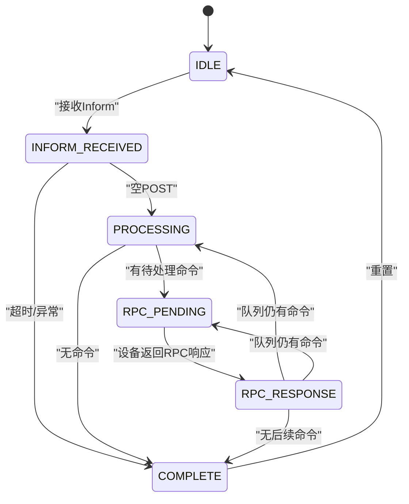
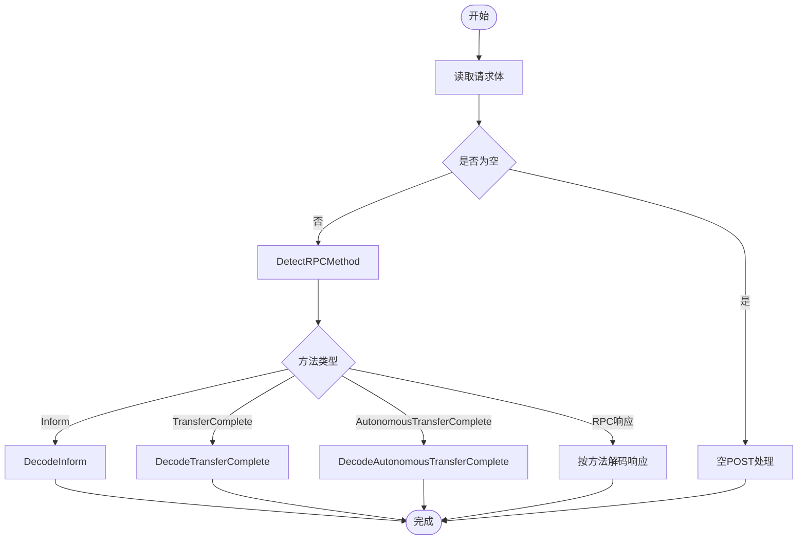
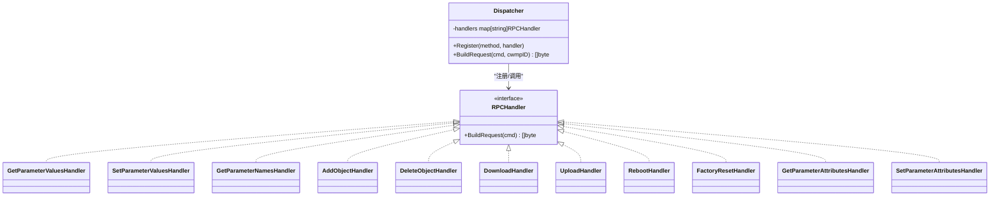
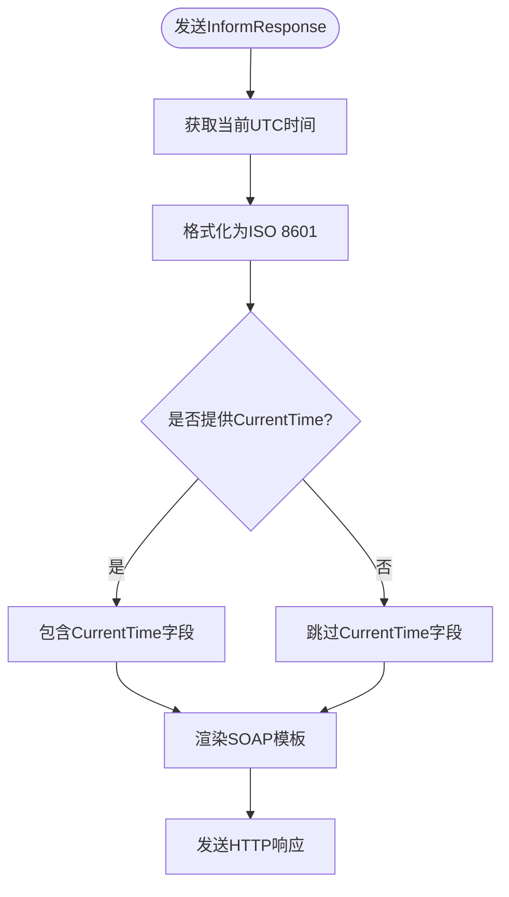
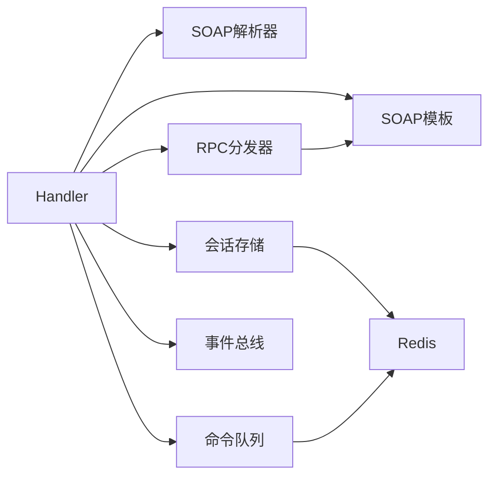

# TR069协议处理

<cite>
**本文档引用的文件**
- [server.go](file://omcgo/internal/acs/server.go)
- [handler.go](file://omcgo/internal/acs/handler.go)
- [session.go](file://omcgo/internal/acs/session.go)
- [dispatcher.go](file://omcgo/internal/acs/rpc/dispatcher.go)
- [decoder.go](file://omcgo/pkg/soap/decoder.go)
- [envelope.go](file://omcgo/pkg/soap/envelope.go)
- [types.go](file://omcgo/pkg/tr069/types.go)
- [templates.go](file://omcgo/pkg/soap/templates.go)
- [session_store.go](file://omcgo/internal/acs/session_store.go)
- [queue.go](file://omcgo/internal/acs/cmdqueue/queue.go)
- [config.dev.yaml](file://omcgo/cmd/acs/etc/config.dev.yaml)
- [inform_bootstrap.xml](file://omcgo/test/fixtures/soap/inform_bootstrap.xml)
- [dispatcher_test.go](file://omcgo/internal/acs/rpc/dispatcher_test.go)
- [decoder_test.go](file://omcgo/pkg/soap/decoder_test.go)
- [acs-tr069-compliance-analysis.md](file://omcgo/docs/acs-tr069-compliance-analysis.md)
</cite>

## 目录
1. [简介](#简介)
2. [项目结构](#项目结构)
3. [核心组件](#核心组件)
4. [架构概览](#架构概览)
5. [详细组件分析](#详细组件分析)
6. [依赖关系分析](#依赖关系分析)
7. [性能考虑](#性能考虑)
8. [故障排查指南](#故障排查指南)
9. [结论](#结论)
10. [附录](#附录)

## 简介
本文件面向TR069/CWMP协议处理模块，系统性阐述协议实现原理、服务架构、消息解析与RPC分发机制、会话状态管理，并提供扩展指南与调试技巧。该模块以Go语言构建，采用HTTP作为传输层，基于SOAP/CWMP规范实现设备接入与远程配置能力。**更新**：当前版本已增强InformResponse消息支持CurrentTime字段，帮助CPE设备同步时间。

## 项目结构
TR069处理模块主要由以下层次构成：
- 协议库层：定义TR069/CWMP数据模型、SOAP信封与模板、XML解析工具
- 服务引擎层：HTTP服务器、请求处理器、会话管理、命令队列、RPC分发器
- 存储与集成层：Redis会话存储、NATS事件总线、限流与准入控制

**图表来源**
- [server.go:1-136](file://omcgo/internal/acs/server.go#L1-L136)
- [handler.go:1-607](file://omcgo/internal/acs/handler.go#L1-L607)
- [session.go:1-72](file://omcgo/internal/acs/session.go#L1-L72)
- [dispatcher.go:1-230](file://omcgo/internal/acs/rpc/dispatcher.go#L1-L230)
- [decoder.go:1-705](file://omcgo/pkg/soap/decoder.go#L1-L705)
- [envelope.go:1-143](file://omcgo/pkg/soap/envelope.go#L1-L143)
- [templates.go:1-305](file://omcgo/pkg/soap/templates.go#L1-L305)
- [session_store.go:1-82](file://omcgo/internal/acs/session_store.go#L1-L82)
- [queue.go:1-135](file://omcgo/internal/acs/cmdqueue/queue.go#L1-L135)

**章节来源**
- [server.go:1-136](file://omcgo/internal/acs/server.go#L1-L136)
- [handler.go:1-607](file://omcgo/internal/acs/handler.go#L1-L607)

## 核心组件
- ACSServer：HTTP服务器，注册路由、启动后台清理任务、暴露健康检查端点
- Handler：请求入口，负责HTTP方法识别、SOAP消息解析、会话状态机推进、RPC分发与响应
- RPC分发器：将命令映射到具体RPC处理器，生成标准CWMP SOAP请求
- SOAP解析器：流式解析SOAP，抽取CWMP ID与RPC方法，解码各类RPC响应
- 会话管理：状态机驱动的会话生命周期管理，配合Redis持久化
- 命令队列：基于Redis有序集合的优先级队列，支持过期与并发弹出
- 事件总线：发布设备事件到NATS，供上层业务消费

**章节来源**
- [server.go:18-136](file://omcgo/internal/acs/server.go#L18-L136)
- [handler.go:27-607](file://omcgo/internal/acs/handler.go#L27-L607)
- [dispatcher.go:16-230](file://omcgo/internal/acs/rpc/dispatcher.go#L16-L230)
- [decoder.go:12-705](file://omcgo/pkg/soap/decoder.go#L12-L705)
- [session.go:9-72](file://omcgo/internal/acs/session.go#L9-L72)
- [queue.go:13-135](file://omcgo/internal/acs/cmdqueue/queue.go#L13-L135)
- [session_store.go:12-82](file://omcgo/internal/acs/session_store.go#L12-L82)

## 架构概览
下图展示TR069处理的整体交互流程：设备发起HTTP POST，Handler根据SOAP内容识别方法并执行相应处理；对于RPC请求，从命令队列取出命令，经RPC分发器生成CWMP请求返回给设备；会话状态在各阶段更新并持久化。

**图表来源**
- [handler.go:70-342](file://omcgo/internal/acs/handler.go#L70-L342)
- [decoder.go:667-705](file://omcgo/pkg/soap/decoder.go#L667-L705)
- [dispatcher.go:47-54](file://omcgo/internal/acs/rpc/dispatcher.go#L47-L54)
- [queue.go:74-110](file://omcgo/internal/acs/cmdqueue/queue.go#L74-L110)
- [session_store.go:41-73](file://omcgo/internal/acs/session_store.go#L41-L73)

## 详细组件分析

### ACSServer与HTTP监听
- 路由注册：/acs用于TR069请求，/healthz用于健康检查
- 超时配置：ReadTimeout、WriteTimeout、IdleTimeout
- 后台任务：会话清理器定期回收陈旧连接绑定；速率限制器按配置清理不活跃设备
- 优雅关闭：停止速率限制器并关闭HTTP服务器

**章节来源**
- [server.go:53-105](file://omcgo/internal/acs/server.go#L53-L105)
- [config.dev.yaml:1-70](file://omcgo/cmd/acs/etc/config.dev.yaml#L1-L70)

### Handler：请求处理与状态机
- 方法识别：根据SOAP内容检测RPC方法，区分Inform、空POST、RPC响应与自主文件传输完成
- Inform处理：解析设备信息、事件码、参数列表；记录指标；创建/更新会话；发布事件；发送InformResponse
- 空POST处理：从连接绑定获取设备SN，推进会话状态，从队列弹出命令并构建RPC请求；无命令则结束会话
- RPC响应处理：记录RPC耗时与状态，检查队列是否有后续命令，逐条下发；完成后结束会话
- 会话清理：后台定时器清理陈旧连接绑定，释放准入槽位并记录会话时长

**图表来源**
- [session.go:12-60](file://omcgo/internal/acs/session.go#L12-L60)
- [handler.go:119-342](file://omcgo/internal/acs/handler.go#L119-L342)

**章节来源**
- [handler.go:70-342](file://omcgo/internal/acs/handler.go#L70-L342)
- [session.go:9-72](file://omcgo/internal/acs/session.go#L9-L72)

### SOAP消息解析流程
- 流式解析：逐个XML token解析，提取CWMP ID与Body中的RPC元素
- 方法检测：通过字符串匹配快速识别RPC方法，支持Inform、TransferComplete、AutonomousTransferComplete及各类RPC响应
- 响应解码：针对不同RPC响应（如Get/Set参数值、Download/Upload、Reboot/FactoryReset等）分别解析状态、实例号、时间戳等字段

**图表来源**
- [decoder.go:12-705](file://omcgo/pkg/soap/decoder.go#L12-L705)
- [envelope.go:109-142](file://omcgo/pkg/soap/envelope.go#L109-L142)

**章节来源**
- [decoder.go:12-705](file://omcgo/pkg/soap/decoder.go#L12-L705)
- [envelope.go:109-142](file://omcgo/pkg/soap/envelope.go#L109-L142)

### RPC方法分发机制
- 注册表：内置11种标准RPC方法处理器（Get/Set参数值、Get参数名、Add/Delete对象、Download/Upload、Reboot、FactoryReset、Get/Set参数属性）
- 分发策略：根据命令Method查找处理器，调用其BuildRequest生成对应SOAP模板数据
- 扩展方式：通过Register新增自定义RPC处理器，保持与标准一致的输入/输出约定

**图表来源**
- [dispatcher.go:11-230](file://omcgo/internal/acs/rpc/dispatcher.go#L11-L230)

**章节来源**
- [dispatcher.go:16-230](file://omcgo/internal/acs/rpc/dispatcher.go#L16-L230)
- [dispatcher_test.go:12-180](file://omcgo/internal/acs/rpc/dispatcher_test.go#L12-L180)

### 会话状态管理
- 状态定义：IDLE、INFORM_RECEIVED、PROCESSING、RPC_PENDING、RPC_RESPONSE、COMPLETE
- 状态迁移：严格定义允许的转移路径，防止非法状态变更
- 持久化：使用Redis存储会话JSON，设置TTL，支持创建、读取、更新、删除
- 连接绑定：通过HTTP RemoteAddr与设备SN绑定，配合后台清理器回收陈旧绑定

**章节来源**
- [session.go:9-72](file://omcgo/internal/acs/session.go#L9-L72)
- [session_store.go:12-82](file://omcgo/internal/acs/session_store.go#L12-L82)
- [handler.go:43-68](file://omcgo/internal/acs/handler.go#L43-L68)

### 命令队列与事件总线
- 命令队列：基于Redis有序集合，score综合优先级与时序，支持并发弹出与过期跳过
- 事件总线：发布设备事件（如开机、心跳、参数变更、传输完成等）到NATS，供订阅者处理

**章节来源**
- [queue.go:13-135](file://omcgo/internal/acs/cmdqueue/queue.go#L13-L135)

### InformResponse消息增强（CurrentTime字段）
**更新**：InformResponse消息现已增强支持CurrentTime字段，帮助CPE设备同步时间。

- **模板实现**：InformResponse模板使用条件渲染，仅在提供CurrentTime时才包含该字段
- **时间格式**：采用ISO 8601标准格式（2006-01-02T15:04:05Z）
- **Handler集成**：sendInformResponse函数自动获取当前UTC时间并格式化
- **合规性**：符合TR069规范的可选字段要求

**图表来源**
- [handler.go:568-582](file://omcgo/internal/acs/handler.go#L568-L582)
- [templates.go:175-179](file://omcgo/pkg/soap/templates.go#L175-L179)

**章节来源**
- [handler.go:568-582](file://omcgo/internal/acs/handler.go#L568-L582)
- [templates.go:175-179](file://omcgo/pkg/soap/templates.go#L175-L179)
- [types.go:26-34](file://omcgo/pkg/tr069/types.go#L26-L34)

## 依赖关系分析
- Handler依赖：SOAP解析器、RPC分发器、会话存储、命令队列、事件总线、速率限制器、准入控制器
- 分发器依赖：SOAP模板库，用于渲染标准CWMP请求
- 存储依赖：Redis客户端，提供高并发KV操作与TTL管理
- 配置依赖：YAML配置文件，定义服务器、会话、限流、认证、Redis、NATS、数据库与日志参数

**图表来源**
- [handler.go:1-50](file://omcgo/internal/acs/handler.go#L1-L50)
- [dispatcher.go:1-20](file://omcgo/internal/acs/rpc/dispatcher.go#L1-L20)
- [session_store.go:1-20](file://omcgo/internal/acs/session_store.go#L1-L20)
- [queue.go:1-20](file://omcgo/internal/acs/cmdqueue/queue.go#L1-L20)

**章节来源**
- [handler.go:1-50](file://omcgo/internal/acs/handler.go#L1-L50)
- [config.dev.yaml:1-70](file://omcgo/cmd/acs/etc/config.dev.yaml#L1-L70)

## 性能考虑
- 流式解析：SOAP解析采用流式XML解码，避免一次性加载整个Body，降低内存峰值
- 模板预编译：SOAP模板在init阶段预编译，减少运行时模板解析开销
- Redis优化：会话与命令队列均使用Redis，具备高吞吐与低延迟特性；队列按优先级+时间戳排序，保证公平调度
- 背压控制：速率限制器与准入控制器协同，限制瞬时并发与设备数量，避免雪崩
- 超时与清理：合理设置HTTP超时与会话清理周期，及时回收资源

## 故障排查指南
- 常见错误与定位
  - SOAP解析失败：检查请求体是否符合CWMP规范，确认命名空间与元素名称
  - 未知RPC方法：确认命令Method是否在分发器注册表中
  - 会话未创建或状态异常：检查Redis键是否存在、TTL是否正确、状态迁移是否合法
  - 命令队列无命令：确认Push是否成功、过期时间是否已到、并发弹出竞争
  - CurrentTime字段问题：检查Handler中的时间格式化是否正确，模板条件渲染是否正常
- 调试建议
  - 启用详细日志：记录原始SOAP体、CWMP ID、设备SN、会话状态与指标
  - 使用测试夹具：参考inform_bootstrap.xml等fixture验证解析链路
  - 单元测试覆盖：利用dispatcher_test与decoder_test验证关键路径
- 关键指标
  - 会话总数、活跃会话、会话时长分布
  - RPC方法耗时与错误计数
  - 速率限制拒绝次数
  - 命令队列长度与弹出成功率

**章节来源**
- [decoder_test.go:11-55](file://omcgo/pkg/soap/decoder_test.go#L11-L55)
- [dispatcher_test.go:36-180](file://omcgo/internal/acs/rpc/dispatcher_test.go#L36-L180)
- [inform_bootstrap.xml:1-51](file://omcgo/test/fixtures/soap/inform_bootstrap.xml#L1-L51)

## 结论
该TR069/CWMP处理模块以清晰的分层架构实现了从HTTP接入到RPC分发的完整闭环，具备良好的扩展性与可观测性。通过流式解析、模板化生成与Redis高并发存储，满足大规模设备接入场景下的性能与可靠性要求。**更新**：当前版本增强了InformResponse消息的CurrentTime字段支持，进一步提升了设备时间同步能力，符合TR069规范要求。建议在生产环境中结合速率限制、准入控制与完善的监控告警体系，确保系统稳定运行。

## 附录

### 协议交互示例（基于测试夹具）
- Bootstrap Inform解析：验证设备标识、事件码与参数列表解析
- Periodic Inform解析：验证周期心跳场景
- InformResponse渲染：验证CWMP ID注入与响应结构，**包含CurrentTime字段**

**章节来源**
- [decoder_test.go:11-55](file://omcgo/pkg/soap/decoder_test.go#L11-L55)
- [inform_bootstrap.xml:1-51](file://omcgo/test/fixtures/soap/inform_bootstrap.xml#L1-L51)

### 协议扩展与自定义RPC方法实现指南
- 新增RPC处理器
  - 实现RPCHandler接口的BuildRequest方法，将命令参数映射到SOAP模板数据
  - 在Dispatcher中注册新方法名与处理器实例
- 自定义模板
  - 在templates.go中添加模板变量与RenderResponse调用
  - 编写测试用例验证模板渲染结果
- 集成到Handler
  - 在命令队列中推送自定义方法命令
  - 在RPC响应处理分支中补充相应事件发布逻辑

**章节来源**
- [dispatcher.go:42-54](file://omcgo/internal/acs/rpc/dispatcher.go#L42-L54)
- [templates.go:29-55](file://omcgo/pkg/soap/templates.go#L29-L55)

### CurrentTime字段实现细节
**更新**：CurrentTime字段的实现细节如下：

- **数据模型**：TR069.InformMessage结构体包含CurrentTime字段，类型为time.Time
- **模板渲染**：InformResponse模板使用条件渲染语法{{if .CurrentTime}}确保字段存在时才包含
- **时间格式**：Handler中使用time.Now().UTC().Format("2006-01-02T15:04:05Z")格式化为ISO 8601
- **合规性**：符合TR069规范的可选字段要求，有助于CPE设备时间同步

**章节来源**
- [types.go:26-34](file://omcgo/pkg/tr069/types.go#L26-L34)
- [templates.go:175-179](file://omcgo/pkg/soap/templates.go#L175-L179)
- [handler.go:568-582](file://omcgo/internal/acs/handler.go#L568-L582)