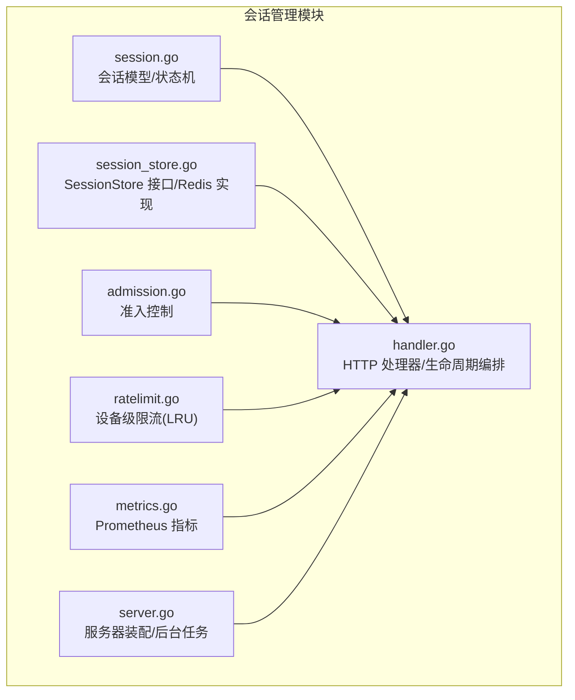
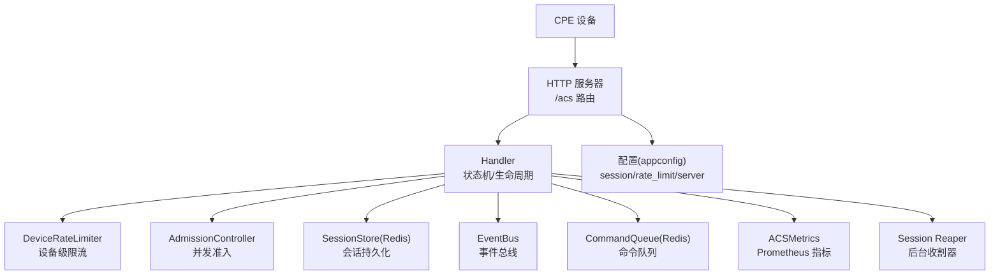
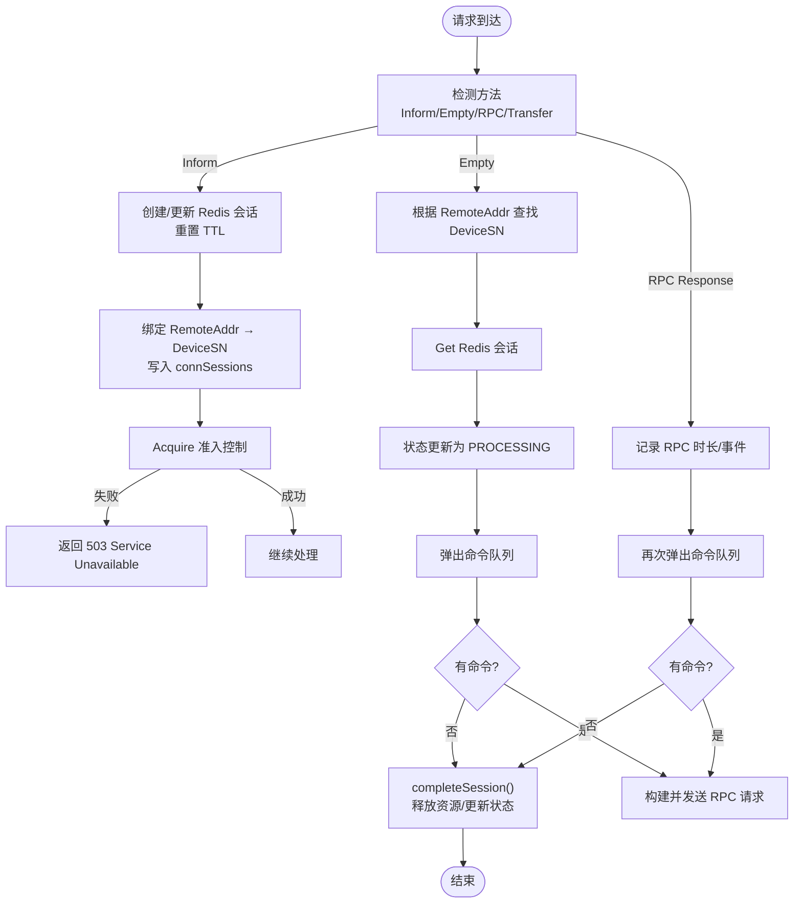
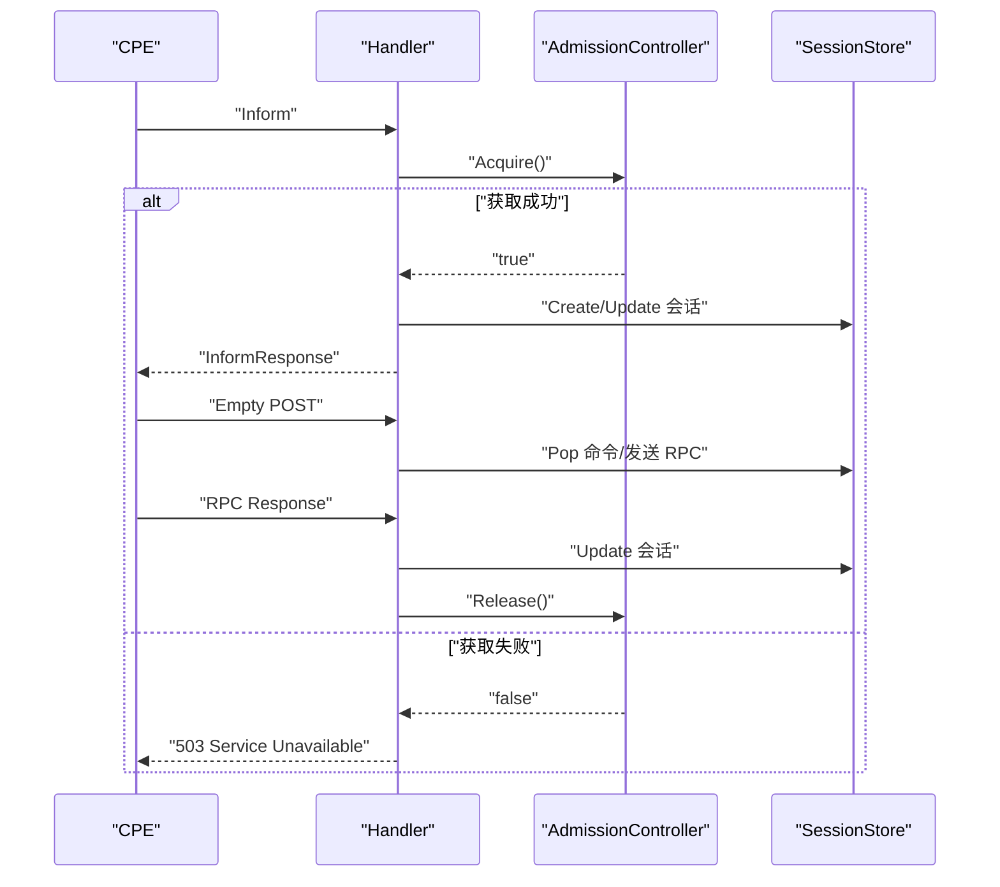
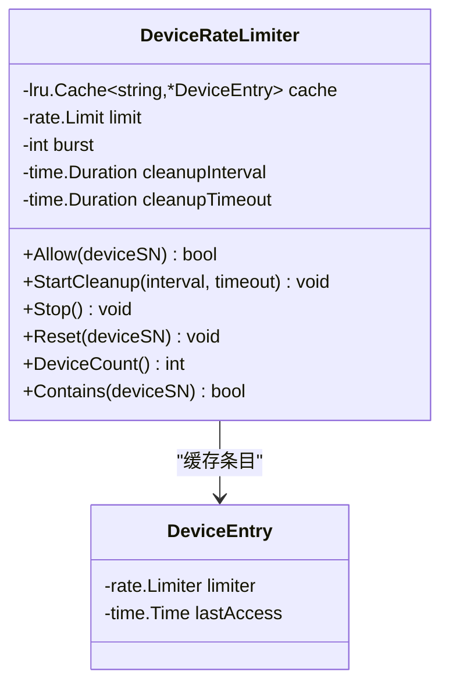
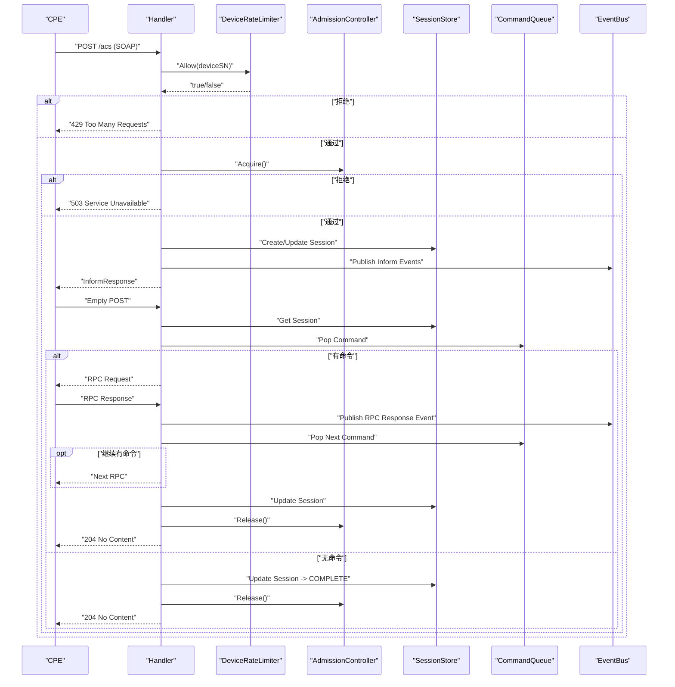
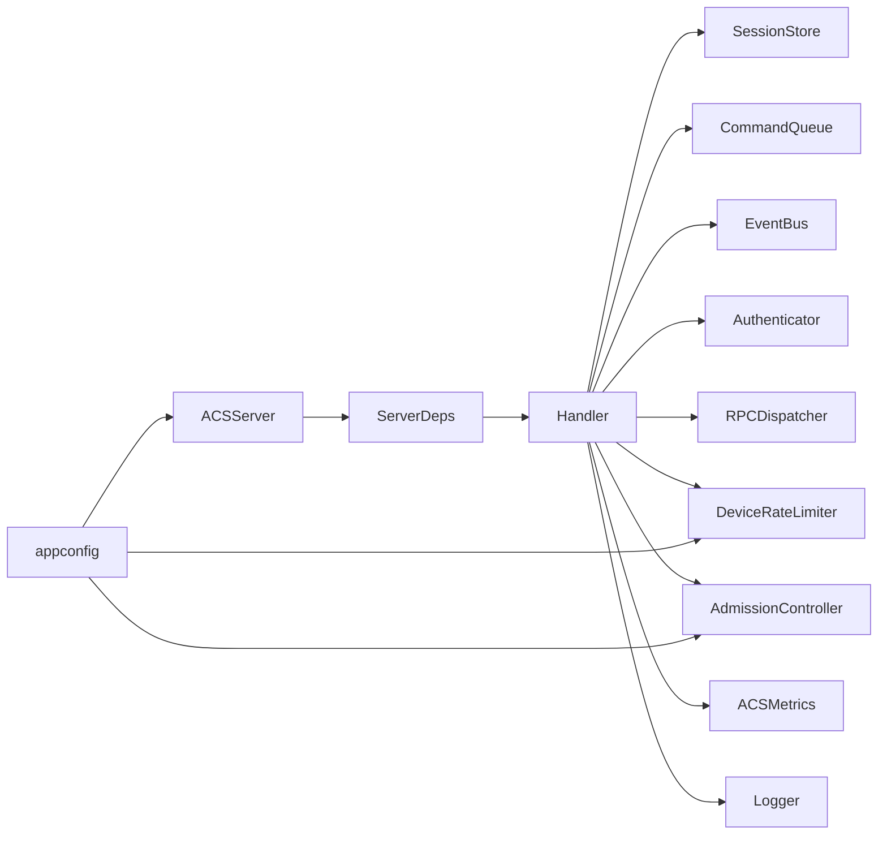
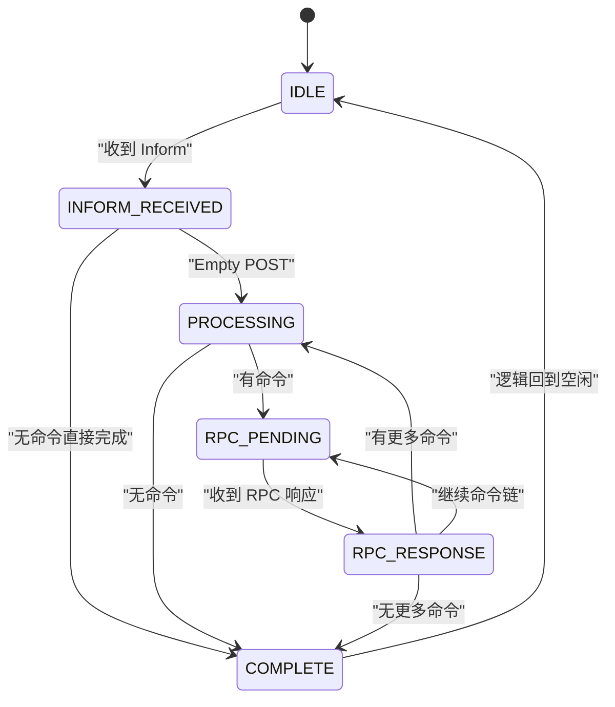

# 会话管理

<cite>
**本文引用的文件**
- [session.go](file://omcgo/internal/acs/session.go)
- [session_store.go](file://omcgo/internal/acs/session_store.go)
- [handler.go](file://omcgo/internal/acs/handler.go)
- [server.go](file://omcgo/internal/acs/server.go)
- [admission.go](file://omcgo/internal/acs/admission.go)
- [ratelimit.go](file://omcgo/internal/acs/ratelimit.go)
- [metrics.go](file://omcgo/internal/acs/metrics.go)
- [session-design.md](file://omcgo/docs/design/session-design.md)
- [config.dev.yaml](file://omcgo/cmd/acs/etc/config.dev.yaml)
- [config.go](file://omcgo/internal/core/appconfig/config.go)
- [session_test.go](file://omcgo/internal/acs/session_test.go)
- [admission_test.go](file://omcgo/internal/acs/admission_test.go)
- [ratelimit_test.go](file://omcgo/internal/acs/ratelimit_test.go)
</cite>

## 目录
1. [简介](#简介)
2. [项目结构](#项目结构)
3. [核心组件](#核心组件)
4. [架构总览](#架构总览)
5. [详细组件分析](#详细组件分析)
6. [依赖关系分析](#依赖关系分析)
7. [性能考量](#性能考量)
8. [故障排查指南](#故障排查指南)
9. [结论](#结论)
10. [附录](#附录)

## 简介
本文件面向 TR069 会话管理模块，系统化阐述会话生命周期管理（连接建立、状态维护、超时处理、优雅关闭）、会话存储机制（Redis 与内存映射）、准入控制与速率限制、监控与可观测性、以及最佳实践与性能优化建议。文档以代码为依据，结合设计文档与测试用例，帮助开发者与运维人员正确理解与使用该模块。

## 项目结构
围绕 TR069 会话管理的核心代码位于 omcgo/internal/acs 目录，主要文件如下：
- 会话模型与状态机：session.go
- 会话存储接口与 Redis 实现：session_store.go
- HTTP 处理器与生命周期编排：handler.go
- 服务器装配与后台任务：server.go
- 准入控制（并发会话数限制）：admission.go
- 速率限制（设备级令牌桶 + LRU 清理）：ratelimit.go
- 指标定义与注册：metrics.go
- 设计文档与配置：session-design.md、config.dev.yaml、appconfig/config.go
- 单元测试：session_test.go、admission_test.go、ratelimit_test.go



**图表来源**
- [session.go:1-72](file://omcgo/internal/acs/session.go#L1-L72)
- [session_store.go:1-82](file://omcgo/internal/acs/session_store.go#L1-L82)
- [handler.go:1-567](file://omcgo/internal/acs/handler.go#L1-L567)
- [server.go:1-136](file://omcgo/internal/acs/server.go#L1-L136)
- [admission.go:1-41](file://omcgo/internal/acs/admission.go#L1-L41)
- [ratelimit.go:1-144](file://omcgo/internal/acs/ratelimit.go#L1-L144)
- [metrics.go:1-63](file://omcgo/internal/acs/metrics.go#L1-L63)

**章节来源**
- [session.go:1-72](file://omcgo/internal/acs/session.go#L1-L72)
- [session_store.go:1-82](file://omcgo/internal/acs/session_store.go#L1-L82)
- [handler.go:1-567](file://omcgo/internal/acs/handler.go#L1-L567)
- [server.go:1-136](file://omcgo/internal/acs/server.go#L1-L136)
- [admission.go:1-41](file://omcgo/internal/acs/admission.go#L1-L41)
- [ratelimit.go:1-144](file://omcgo/internal/acs/ratelimit.go#L1-L144)
- [metrics.go:1-63](file://omcgo/internal/acs/metrics.go#L1-L63)

## 核心组件
- 会话模型与状态机：定义 Session 结构体与 SessionState 枚举，提供 TransitionTo 状态转换校验，保证状态机一致性。
- 会话存储：SessionStore 接口抽象 + Redis 实现，提供 Create/Get/Update/Delete/SetTTL，支持 TTL 自动过期。
- 两层会话追踪：Redis 域级会话 + 内存连接映射（connSessions），解决 TR069 协议中后续请求不携带设备标识的问题。
- 准入控制：AdmissionController 基于原子计数与 CAS，限制最大并发会话数。
- 速率限制：DeviceRateLimiter 基于 golang-lru 的设备级令牌桶，支持突发、容量上限与后台清理。
- HTTP 处理器：统一入口 /acs，按 SOAP 方法分派处理 Inform/Empty/RPC/TransferComplete 等，贯穿会话生命周期。
- 服务器装配：组装依赖、注册路由、启动后台清理任务（会话收割器、限流器清理）。
- 指标监控：Prometheus 指标覆盖活跃会话、Inform/RPC 统计、会话时长、限流拒绝数等。

**章节来源**
- [session.go:9-72](file://omcgo/internal/acs/session.go#L9-L72)
- [session_store.go:12-82](file://omcgo/internal/acs/session_store.go#L12-L82)
- [handler.go:21-41](file://omcgo/internal/acs/handler.go#L21-L41)
- [admission.go:5-41](file://omcgo/internal/acs/admission.go#L5-L41)
- [ratelimit.go:11-144](file://omcgo/internal/acs/ratelimit.go#L11-L144)
- [server.go:18-136](file://omcgo/internal/acs/server.go#L18-L136)
- [metrics.go:5-63](file://omcgo/internal/acs/metrics.go#L5-L63)

## 架构总览
下图展示了 TR069 会话管理的整体架构：HTTP 入口、处理器编排、存储与队列、限流与准入、事件总线、指标与后台任务。



**图表来源**
- [handler.go:70-117](file://omcgo/internal/acs/handler.go#L70-L117)
- [server.go:39-88](file://omcgo/internal/acs/server.go#L39-L88)
- [session_store.go:12-19](file://omcgo/internal/acs/session_store.go#L12-L19)
- [ratelimit.go:17-25](file://omcgo/internal/acs/ratelimit.go#L17-L25)
- [admission.go:5-9](file://omcgo/internal/acs/admission.go#L5-L9)
- [metrics.go:5-14](file://omcgo/internal/acs/metrics.go#L5-L14)
- [config.go:119-132](file://omcgo/internal/core/appconfig/config.go#L119-L132)

## 详细组件分析

### 会话模型与状态机
- Session 结构体包含设备标识、状态、CWMP ID、实例标识、时间戳、事件列表等字段，便于跨请求持久化。
- SessionState 定义了完整的状态集合，validTransitions 映射给出合法转换路径，TransitionTo 提供显式校验，防止非法状态迁移。
- JSON 序列化/反序列化方法确保 Session 可以安全地存储到 Redis。

```mermaid
classDiagram
class Session {
+string DeviceSN
+SessionState State
+string LastRPC
+string InstanceID
+time.Time StartedAt
+time.Time UpdatedAt
+[]string InformEvents
+string CWMPId
+TransitionTo(newState) error
+MarshalJSON() []byte
+UnmarshalJSON(data) error
}
class SessionState {
<<enumeration>>
"IDLE"
"INFORM_RECEIVED"
"PROCESSING"
"RPC_PENDING"
"RPC_RESPONSE"
"COMPLETE"
}
Session --> SessionState : "使用"
```

**图表来源**
- [session.go:21-72](file://omcgo/internal/acs/session.go#L21-L72)

**章节来源**
- [session.go:9-72](file://omcgo/internal/acs/session.go#L9-L72)
- [session_test.go:9-42](file://omcgo/internal/acs/session_test.go#L9-L42)

### 会话存储机制（Redis 与内存映射）
- SessionStore 接口抽象，RedisSessionStore 实现 Create/Get/Update/Delete/SetTTL，键格式为前缀 + 设备 SN，TTL 默认 5 分钟，Create/Update 时重置 TTL。
- 两层追踪：
  - Redis 域级会话：跨 HTTP 请求持久化，TTL 作为兜底。
  - 内存连接映射：sync.Map 保存 RemoteAddr → connSessionEntry，用于将后续 Empty/RPC 请求映射回设备会话。
- 后台会话收割器周期扫描 connSessions，清理过期条目（默认 30s 扫描、5min 过期），释放 Admission 槽位并记录会话时长指标。



**图表来源**
- [handler.go:119-342](file://omcgo/internal/acs/handler.go#L119-L342)
- [session_store.go:41-81](file://omcgo/internal/acs/session_store.go#L41-L81)
- [server.go:60-74](file://omcgo/internal/acs/server.go#L60-L74)

**章节来源**
- [session_store.go:12-82](file://omcgo/internal/acs/session_store.go#L12-L82)
- [handler.go:21-68](file://omcgo/internal/acs/handler.go#L21-L68)
- [server.go:60-74](file://omcgo/internal/acs/server.go#L60-L74)

### 准入控制（并发会话限制）
- AdmissionController 使用原子计数与 CompareAndSwap 无锁获取/释放会话槽位，阈值可通过配置设置。
- 生命周期：Acquire → 会话处理 → completeSession → Release；异常断连由收割器回收。



**图表来源**
- [admission.go:19-40](file://omcgo/internal/acs/admission.go#L19-L40)
- [handler.go:153-170](file://omcgo/internal/acs/handler.go#L153-L170)

**章节来源**
- [admission.go:5-41](file://omcgo/internal/acs/admission.go#L5-L41)
- [admission_test.go:9-27](file://omcgo/internal/acs/admission_test.go#L9-L27)

### 速率限制（设备级令牌桶 + LRU 清理）
- DeviceRateLimiter 基于令牌桶算法，每设备独立 limiter，支持 burst 突发与 perMinute 速率。
- LRU 缓存管理设备条目，容量满时 O(1) 淘汰最久未访问设备；支持后台定时清理超时未访问设备。
- 提供 Allow/Reset/DeviceCount/Contains 等便捷方法，并暴露 StartCleanup/Stop 控制后台清理协程。



**图表来源**
- [ratelimit.go:17-144](file://omcgo/internal/acs/ratelimit.go#L17-L144)

**章节来源**
- [ratelimit.go:17-144](file://omcgo/internal/acs/ratelimit.go#L17-L144)
- [ratelimit_test.go:14-224](file://omcgo/internal/acs/ratelimit_test.go#L14-L224)

### HTTP 处理器与生命周期编排
- 统一入口 /acs，按 SOAP 方法分派：
  - Inform：解码 Inform、速率限制、准入控制、创建/更新会话、绑定连接、发布事件、返回 InformResponse。
  - Empty POST：查找绑定、获取会话、状态更新、检查命令队列、下发 RPC 或完成会话。
  - RPC Response：记录 RPC 时长/事件、状态更新、继续下发命令或完成会话。
  - TransferComplete/AutonomousTransferComplete：解码并发布事件，返回对应响应。
- completeSession 释放资源、更新状态、记录会话时长指标。



**图表来源**
- [handler.go:70-342](file://omcgo/internal/acs/handler.go#L70-L342)
- [session_store.go:41-77](file://omcgo/internal/acs/session_store.go#L41-L77)

**章节来源**
- [handler.go:70-342](file://omcgo/internal/acs/handler.go#L70-L342)

### 服务器装配与后台任务
- NewACSServer 组装 Handler，注册 /acs 与 /healthz，启动会话收割器与限流器清理协程。
- NewDefaultDeps 注入 SessionStore、CommandQueue、EventBus、Authenticator、RPCDispatcher、RateLimiter、Admission、Metrics、Logger。
- Shutdown 优雅关闭，停止限流器后台清理。

**章节来源**
- [server.go:39-136](file://omcgo/internal/acs/server.go#L39-L136)

### 指标与可观测性
- 指标包括：活跃会话数、Inform 事件计数、RPC 时长分布、RPC 错误计数、会话时长分布、限流拒绝数、限流设备数。
- 通过 Prometheus 注册器注册，支持外部采集与告警。

**章节来源**
- [metrics.go:5-63](file://omcgo/internal/acs/metrics.go#L5-L63)

## 依赖关系分析
- Handler 依赖 SessionStore、CommandQueue、EventBus、Authenticator、RPCDispatcher、DeviceRateLimiter、AdmissionController、ACSMetrics、Logger。
- ServerDeps 将各依赖注入 Handler，Server 统一管理生命周期与后台任务。
- 配置通过 appconfig 读取，包含 server、session、rate_limit、auth、redis、nats、db、metrics、tracer、log 等。



**图表来源**
- [server.go:26-51](file://omcgo/internal/acs/server.go#L26-L51)
- [config.go:119-132](file://omcgo/internal/core/appconfig/config.go#L119-L132)

**章节来源**
- [server.go:26-51](file://omcgo/internal/acs/server.go#L26-L51)
- [config.go:119-132](file://omcgo/internal/core/appconfig/config.go#L119-L132)

## 性能考量
- 并发模型：AdmissionController 使用原子操作，避免锁竞争；DeviceRateLimiter 使用 LRU，容量固定，淘汰成本低。
- 存储选择：Redis 适合跨进程/跨实例共享状态；内存映射仅用于连接到设备的映射，避免重复序列化。
- 超时与兜底：Redis TTL 与会话收割器双保险，防止资源泄漏。
- 指标监控：通过 Prometheus 指标观察活跃会话、RPC 时长、错误率与限流触发频率，指导容量规划与阈值调整。
- 配置建议：
  - session.timeout：根据设备上报周期设置，建议与 Inform 间隔匹配或略大。
  - session.max_concurrent：根据 CPU/内存与下游依赖（Redis/NATS/DB）能力评估。
  - rate_limit.per_device：结合设备端上报频率与业务场景设定，burst 与 max_devices 需平衡延迟与内存占用。
  - server.read/write/idle_timeout：根据网络环境与设备能力设置，避免长时间占用连接。

**章节来源**
- [config.dev.yaml:13-22](file://omcgo/cmd/acs/etc/config.dev.yaml#L13-L22)
- [config.go:119-132](file://omcgo/internal/core/appconfig/config.go#L119-L132)

## 故障排查指南
- 会话未找到或状态异常
  - 检查 Redis 会话是否存在与 TTL 是否过短。
  - 确认 /acs 路由是否正确处理 Empty POST 与 RPC Response。
- 并发过高导致 503
  - 检查 admission 当前值与阈值，必要时扩容或调高阈值。
- 请求被限流
  - 观察限流拒绝指标，确认 per_device/burst/max_devices 设置是否合理。
- 连接异常断开导致资源泄漏
  - 确认会话收割器是否正常运行，检查日志中收割记录。
- 指标缺失或异常
  - 确认 Prometheus 注册器已注册指标，检查采集端配置。

**章节来源**
- [handler.go:43-68](file://omcgo/internal/acs/handler.go#L43-L68)
- [metrics.go:16-62](file://omcgo/internal/acs/metrics.go#L16-L62)

## 结论
该会话管理模块通过清晰的状态机、两层追踪架构、准入控制与速率限制、完善的指标与后台清理，实现了 TR069 协议下的高并发、可扩展、可观测的会话生命周期管理。结合合理的配置与监控，可在生产环境中稳定支撑大规模设备接入与命令下发。

## 附录

### 会话生命周期（状态转换图）


**图表来源**
- [session.go:33-41](file://omcgo/internal/acs/session.go#L33-L41)

**章节来源**
- [session-design.md:85-131](file://omcgo/docs/design/session-design.md#L85-L131)

### 配置项参考
- server.host/port/tls/read/write/idle_timeout：HTTP 服务参数。
- session.timeout/max_concurrent：会话 TTL 与并发上限。
- rate_limit.per_device/burst/max_devices/cleanup_interval/cleanup_timeout：设备级限流与清理策略。
- redis/nats/db/metrics/tracer/log：基础设施与可观测性配置。

**章节来源**
- [config.dev.yaml:1-70](file://omcgo/cmd/acs/etc/config.dev.yaml#L1-L70)
- [config.go:92-132](file://omcgo/internal/core/appconfig/config.go#L92-L132)