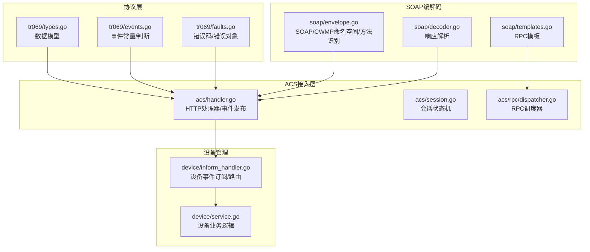
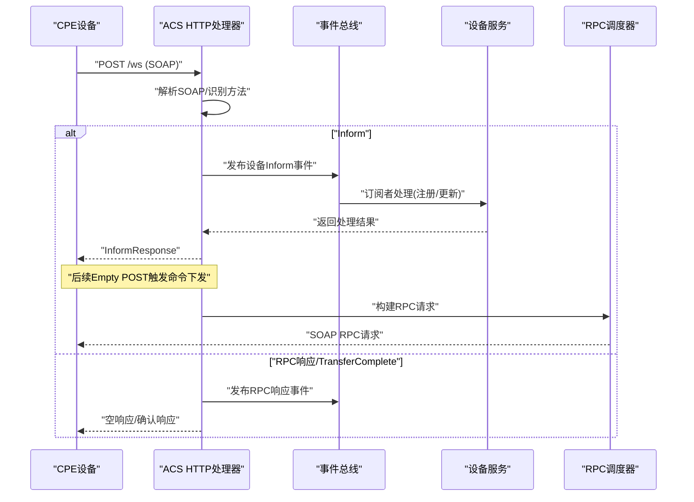
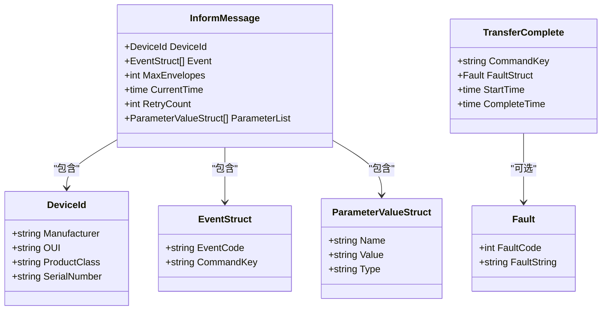
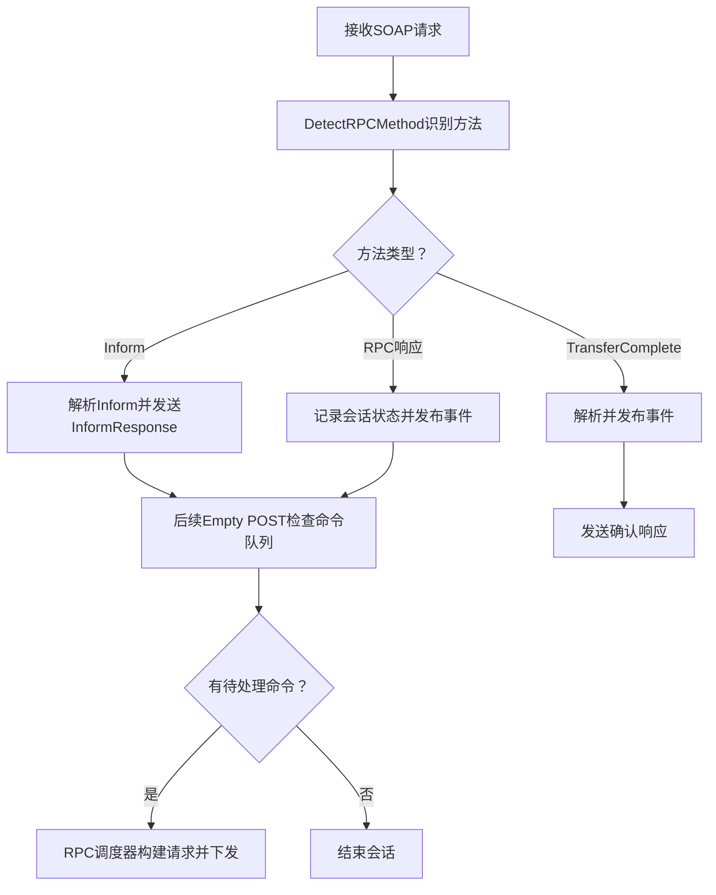
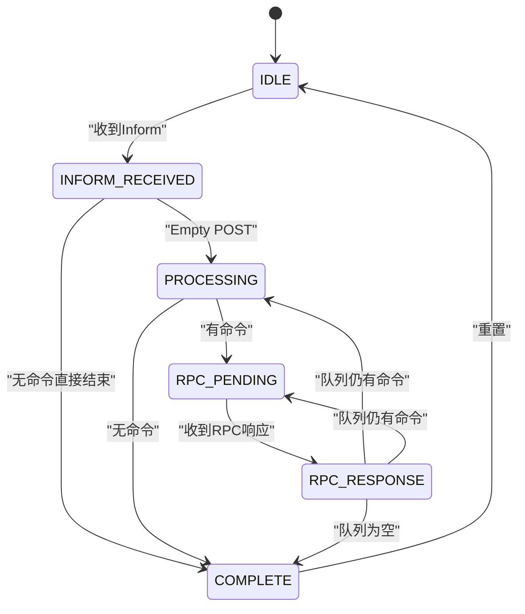
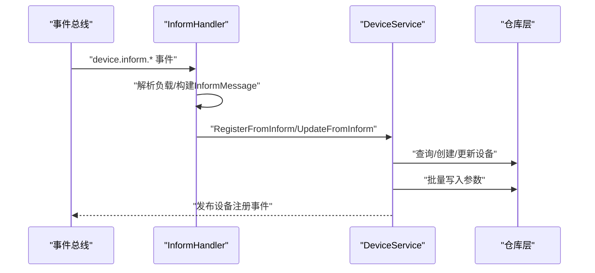
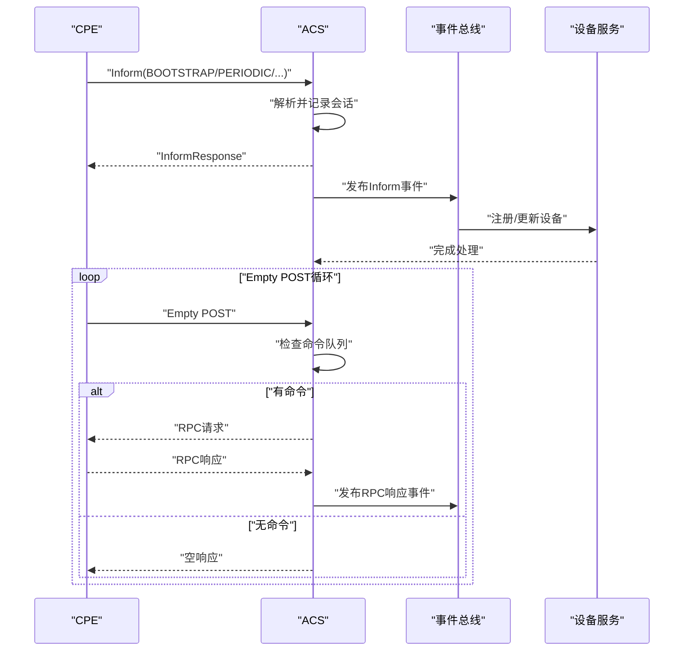
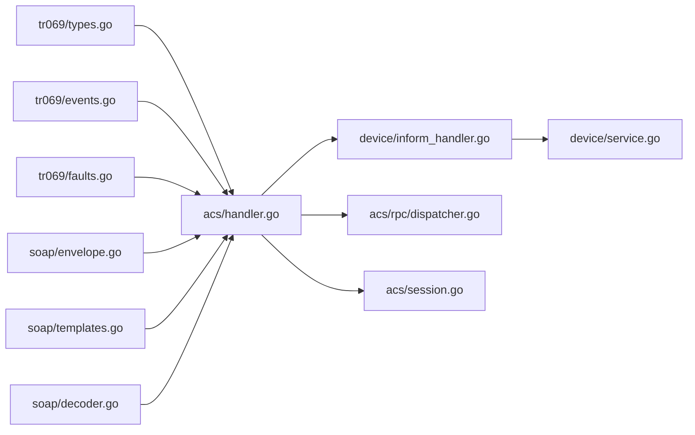

# 协议规范与实现

<cite>
**本文引用的文件**
- [types.go](file://omcgo/pkg/tr069/types.go)
- [events.go](file://omcgo/pkg/tr069/events.go)
- [faults.go](file://omcgo/pkg/tr069/faults.go)
- [envelope.go](file://omcgo/pkg/soap/envelope.go)
- [templates.go](file://omcgo/pkg/soap/templates.go)
- [decoder.go](file://omcgo/pkg/soap/decoder.go)
- [handler.go](file://omcgo/internal/acs/handler.go)
- [session.go](file://omcgo/internal/acs/session.go)
- [dispatcher.go](file://omcgo/internal/acs/rpc/dispatcher.go)
- [inform_handler.go](file://omcgo/internal/device/inform_handler.go)
- [service.go](file://omcgo/internal/device/service.go)
- [TR069报文全解析.md](file://files/Back-end/TR069报文全解析.md)
- [document-catalog.md](file://omcgo/docs/specs-inventory/document-catalog.md)
</cite>

## 目录
1. [简介](#简介)
2. [项目结构](#项目结构)
3. [核心组件](#核心组件)
4. [架构总览](#架构总览)
5. [详细组件分析](#详细组件分析)
6. [依赖关系分析](#依赖关系分析)
7. [性能考虑](#性能考虑)
8. [故障排查指南](#故障排查指南)
9. [结论](#结论)
10. [附录](#附录)

## 简介
本文件面向TR069/CWMP协议的实现与规范解读，结合代码库中的数据模型、消息编解码、会话状态机与RPC调度器，系统化阐述协议架构、消息类型、事件模型、错误处理机制、关键数据结构、消息交换模式（Bootstrap、Periodic、Inform等）、扩展性设计（自定义参数与RPC方法）、版本兼容性与最佳实践，并提供实现细节与代码示例路径。

## 项目结构
本项目采用分层与领域驱动的设计，TR069相关能力主要分布在以下模块：
- 协议数据模型与事件/错误定义：pkg/tr069
- SOAP/CWMP消息编解码与模板：pkg/soap
- ACS接入层（HTTP处理器、会话管理、RPC调度）：internal/acs
- 设备管理与业务逻辑：internal/device
- 规范与样例：files/Back-end、docs/specs-inventory

**图表来源**
- [types.go:1-211](file://omcgo/pkg/tr069/types.go#L1-L211)
- [events.go:1-95](file://omcgo/pkg/tr069/events.go#L1-L95)
- [faults.go:1-58](file://omcgo/pkg/tr069/faults.go#L1-L58)
- [envelope.go:1-143](file://omcgo/pkg/soap/envelope.go#L1-L143)
- [templates.go:219-301](file://omcgo/pkg/soap/templates.go#L219-L301)
- [decoder.go:65-105](file://omcgo/pkg/soap/decoder.go#L65-L105)
- [handler.go:1-567](file://omcgo/internal/acs/handler.go#L1-L567)
- [session.go:1-72](file://omcgo/internal/acs/session.go#L1-L72)
- [dispatcher.go:1-230](file://omcgo/internal/acs/rpc/dispatcher.go#L1-L230)
- [inform_handler.go:1-175](file://omcgo/internal/device/inform_handler.go#L1-L175)
- [service.go:1-417](file://omcgo/internal/device/service.go#L1-L417)

**章节来源**
- [handler.go:27-117](file://omcgo/internal/acs/handler.go#L27-L117)
- [envelope.go:10-70](file://omcgo/pkg/soap/envelope.go#L10-L70)

## 核心组件
- TR069数据模型：DeviceId、Parameter*Struct、EventStruct、InformMessage/Response、各类RPC请求/响应、参数属性结构、TransferComplete/AutonomousTransferComplete、Fault对象
- 事件模型：标准事件码（BOOTSTRAP、BOOT、PERIODIC、SCHEDULED、VALUE CHANGE、KICKED、CONNECTION REQUEST、TRANSFER COMPLETE、DIAGNOSTICS COMPLETE）与厂商扩展事件码（M Reboot/Download/Upload），以及CMCC扩展事件码（ADD OBJECT、DELETE OBJECT）
- 错误处理：CWMP标准错误码（9000-9013），错误消息映射，Fault对象封装
- SOAP/CWMP编解码：命名空间、RPC方法识别、模板渲染、响应流式解析
- ACS接入层：HTTP处理器、会话状态机、命令队列、RPC调度器、事件总线
- 设备管理：设备注册/更新、参数存储、心跳刷新、状态机转换

**章节来源**
- [types.go:5-211](file://omcgo/pkg/tr069/types.go#L5-L211)
- [events.go:5-95](file://omcgo/pkg/tr069/events.go#L5-L95)
- [faults.go:5-58](file://omcgo/pkg/tr069/faults.go#L5-L58)
- [envelope.go:109-142](file://omcgo/pkg/soap/envelope.go#L109-L142)
- [templates.go:219-301](file://omcgo/pkg/soap/templates.go#L219-L301)
- [decoder.go:107-105](file://omcgo/pkg/soap/decoder.go#L107-L105)
- [session.go:9-72](file://omcgo/internal/acs/session.go#L9-L72)
- [dispatcher.go:11-54](file://omcgo/internal/acs/rpc/dispatcher.go#L11-L54)
- [inform_handler.go:14-95](file://omcgo/internal/device/inform_handler.go#L14-L95)
- [service.go:16-40](file://omcgo/internal/device/service.go#L16-L40)

## 架构总览
TR069/CWMP在本项目中通过HTTP接入层接收设备上报的SOAP消息，解析并发布到事件总线，设备管理模块消费事件并执行业务逻辑；同时，ACS通过命令队列与RPC调度器向设备下发RPC请求，形成完整的请求-响应闭环。

**图表来源**
- [handler.go:94-117](file://omcgo/internal/acs/handler.go#L94-L117)
- [handler.go:119-216](file://omcgo/internal/acs/handler.go#L119-L216)
- [handler.go:218-278](file://omcgo/internal/acs/handler.go#L218-L278)
- [handler.go:280-342](file://omcgo/internal/acs/handler.go#L280-L342)
- [handler.go:361-442](file://omcgo/internal/acs/handler.go#L361-L442)
- [dispatcher.go:47-54](file://omcgo/internal/acs/rpc/dispatcher.go#L47-L54)
- [inform_handler.go:46-67](file://omcgo/internal/device/inform_handler.go#L46-L67)
- [service.go:42-130](file://omcgo/internal/device/service.go#L42-L130)

## 详细组件分析

### TR069数据模型与事件/错误
- DeviceId：唯一标识设备（制造商、OUI、产品类、序列号）
- ParameterValueStruct/ParameterInfoStruct：参数名值对与参数路径/可写性描述
- EventStruct：事件码与CommandKey
- InformMessage/InformResponse：设备上报与ACS应答
- RPC请求/响应：Get/Set/Names/Object/Download/Upload/Reboot/FactoryReset/Attributes等
- TransferComplete/AutonomousTransferComplete：文件传输完成上报
- 事件常量与判断函数：BOOTSTRAP、BOOT、PERIODIC、SCHEDULED、VALUE CHANGE、KICKED、CONNECTION REQUEST、TRANSFER COMPLETE、DIAGNOSTICS COMPLETE；厂商扩展与CMCC扩展事件
- 错误码与Fault对象：标准错误码映射与错误字符串封装

**图表来源**
- [types.go:5-39](file://omcgo/pkg/tr069/types.go#L5-L39)
- [types.go:13-18](file://omcgo/pkg/tr069/types.go#L13-L18)
- [types.go:20-34](file://omcgo/pkg/tr069/types.go#L20-L34)
- [types.go:41-211](file://omcgo/pkg/tr069/types.go#L41-L211)

**章节来源**
- [types.go:5-211](file://omcgo/pkg/tr069/types.go#L5-L211)
- [events.go:5-95](file://omcgo/pkg/tr069/events.go#L5-L95)
- [faults.go:5-58](file://omcgo/pkg/tr069/faults.go#L5-L58)

### SOAP/CWMP编解码与模板
- 命名空间与RPC方法枚举：SOAP Envelope/Header/Body结构，RPC方法常量
- 方法识别：从原始SOAP体内容中识别具体方法
- 模板渲染：各RPC请求模板（Download、Upload、Reboot、FactoryReset、ScheduleInform、Get/Set ParameterAttributes等）
- 响应解析：针对特定响应（TransferComplete、GetParameterValuesResponse、Add/DeleteObjectResponse等）进行流式解析

**图表来源**
- [envelope.go:109-142](file://omcgo/pkg/soap/envelope.go#L109-L142)
- [templates.go:219-301](file://omcgo/pkg/soap/templates.go#L219-L301)
- [decoder.go:65-105](file://omcgo/pkg/soap/decoder.go#L65-L105)
- [handler.go:92-117](file://omcgo/internal/acs/handler.go#L92-L117)
- [handler.go:218-278](file://omcgo/internal/acs/handler.go#L218-L278)

**章节来源**
- [envelope.go:10-143](file://omcgo/pkg/soap/envelope.go#L10-L143)
- [templates.go:219-301](file://omcgo/pkg/soap/templates.go#L219-L301)
- [decoder.go:107-105](file://omcgo/pkg/soap/decoder.go#L107-L105)

### ACS接入层与会话管理
- HTTP处理器：接收POST请求，识别方法，处理Inform、Empty POST、RPC响应、TransferComplete/AutonomousTransferComplete，发布事件，发送响应
- 会话状态机：IDLE → INFORM_RECEIVED → PROCESSING → RPC_PENDING → RPC_RESPONSE → COMPLETE，支持状态转换校验与度量
- 命令队列与RPC调度：根据命令类型选择对应RPCHandler，构建SOAP请求
- 连接级会话跟踪：通过RemoteAddr绑定设备SN，后台清理超时连接

**图表来源**
- [session.go:9-72](file://omcgo/internal/acs/session.go#L9-L72)
- [handler.go:43-68](file://omcgo/internal/acs/handler.go#L43-L68)
- [handler.go:218-278](file://omcgo/internal/acs/handler.go#L218-L278)
- [dispatcher.go:47-54](file://omcgo/internal/acs/rpc/dispatcher.go#L47-L54)

**章节来源**
- [handler.go:27-117](file://omcgo/internal/acs/handler.go#L27-L117)
- [session.go:9-72](file://omcgo/internal/acs/session.go#L9-L72)
- [dispatcher.go:11-54](file://omcgo/internal/acs/rpc/dispatcher.go#L11-L54)

### 设备管理与事件处理
- Inform事件订阅：订阅设备Bootstrap/Periodic/ValueChange等主题，路由到设备服务
- 设备注册/更新：基于Inform中的DeviceId与参数列表创建或更新设备记录，存储参数快照，刷新心跳
- 事件发布：设备注册成功后发布设备注册事件，供其他模块消费

**图表来源**
- [inform_handler.go:46-67](file://omcgo/internal/device/inform_handler.go#L46-L67)
- [inform_handler.go:69-114](file://omcgo/internal/device/inform_handler.go#L69-L114)
- [inform_handler.go:116-149](file://omcgo/internal/device/inform_handler.go#L116-L149)
- [service.go:42-130](file://omcgo/internal/device/service.go#L42-L130)
- [service.go:132-202](file://omcgo/internal/device/service.go#L132-L202)

**章节来源**
- [inform_handler.go:14-175](file://omcgo/internal/device/inform_handler.go#L14-L175)
- [service.go:42-202](file://omcgo/internal/device/service.go#L42-L202)

### 消息交换模式详解
- Bootstrap（首次接入）：设备上报0 BOOTSTRAP事件，ACS解析Inform并发送InformResponse，随后通过事件总线触发设备注册流程
- Periodic（周期上报）：设备上报2 PERIODIC事件，ACS解析Inform并更新设备状态与参数快照
- Inform（通用上报）：设备上报事件（含SCHEDULED、VALUE CHANGE、TRANSFER COMPLETE、DIAGNOSTICS COMPLETE等），ACS发布相应事件供订阅者处理
- Empty POST：在InformResponse之后，设备发起Empty POST，ACS检查命令队列并下发RPC请求，或直接结束会话
- 文件传输完成：设备上报TransferComplete或AutonomousTransferComplete，ACS解析并发布事件，发送确认响应

**图表来源**
- [handler.go:119-216](file://omcgo/internal/acs/handler.go#L119-L216)
- [handler.go:218-278](file://omcgo/internal/acs/handler.go#L218-L278)
- [handler.go:280-342](file://omcgo/internal/acs/handler.go#L280-L342)
- [inform_handler.go:69-114](file://omcgo/internal/device/inform_handler.go#L69-L114)
- [service.go:42-130](file://omcgo/internal/device/service.go#L42-L130)

**章节来源**
- [handler.go:119-216](file://omcgo/internal/acs/handler.go#L119-L216)
- [handler.go:218-278](file://omcgo/internal/acs/handler.go#L218-L278)
- [handler.go:280-342](file://omcgo/internal/acs/handler.go#L280-L342)
- [inform_handler.go:69-114](file://omcgo/internal/device/inform_handler.go#L69-L114)
- [service.go:42-130](file://omcgo/internal/device/service.go#L42-L130)

### 扩展性设计与自定义参数/方法
- 自定义参数：通过ParameterList携带厂商/定制参数，设备服务将其持久化为参数快照，供查询与展示
- 自定义RPC方法：RPC调度器通过注册表扩展新方法（如Get/Set ParameterAttributes），RPCHandler负责参数解析与模板渲染
- 事件扩展：支持厂商扩展事件码（如M Reboot/Download/Upload）与CMCC扩展事件码（ADD/DELETE OBJECT）

**章节来源**
- [types.go:13-18](file://omcgo/pkg/tr069/types.go#L13-L18)
- [dispatcher.go:21-40](file://omcgo/internal/acs/rpc/dispatcher.go#L21-L40)
- [events.go:18-29](file://omcgo/pkg/tr069/events.go#L18-L29)

### 版本兼容性与最佳实践
- 版本兼容性：遵循CWMP 1.0命名空间与方法集，确保SOAP Envelope/Header/Body结构一致
- 最佳实践：
  - 使用会话状态机严格控制状态流转，避免竞态
  - 对RPC方法进行白名单注册，防止未知方法注入
  - 对Empty POST进行命令队列轮询，支持多步骤RPC链路
  - 对事件进行主题化发布，降低耦合
  - 对错误进行标准化封装（Fault），便于上层处理

**章节来源**
- [envelope.go:10-14](file://omcgo/pkg/soap/envelope.go#L10-L14)
- [session.go:33-59](file://omcgo/internal/acs/session.go#L33-L59)
- [dispatcher.go:42-45](file://omcgo/internal/acs/rpc/dispatcher.go#L42-L45)
- [handler.go:218-278](file://omcgo/internal/acs/handler.go#L218-L278)

## 依赖关系分析
- TR069数据模型被ACS处理器与设备服务广泛使用
- SOAP编解码为ACS处理器提供方法识别与模板渲染能力
- RPC调度器依赖命令队列与SOAP模板
- 设备服务依赖事件总线与仓库层
- InformHandler订阅设备事件并路由到设备服务

**图表来源**
- [handler.go:1-567](file://omcgo/internal/acs/handler.go#L1-L567)
- [inform_handler.go:1-175](file://omcgo/internal/device/inform_handler.go#L1-L175)
- [service.go:1-417](file://omcgo/internal/device/service.go#L1-L417)
- [dispatcher.go:1-230](file://omcgo/internal/acs/rpc/dispatcher.go#L1-L230)
- [session.go:1-72](file://omcgo/internal/acs/session.go#L1-L72)
- [envelope.go:1-143](file://omcgo/pkg/soap/envelope.go#L1-L143)
- [templates.go:219-301](file://omcgo/pkg/soap/templates.go#L219-L301)
- [decoder.go:65-105](file://omcgo/pkg/soap/decoder.go#L65-L105)
- [types.go:1-211](file://omcgo/pkg/tr069/types.go#L1-L211)
- [events.go:1-95](file://omcgo/pkg/tr069/events.go#L1-L95)
- [faults.go:1-58](file://omcgo/pkg/tr069/faults.go#L1-L58)

**章节来源**
- [handler.go:1-567](file://omcgo/internal/acs/handler.go#L1-L567)
- [inform_handler.go:1-175](file://omcgo/internal/device/inform_handler.go#L1-L175)
- [service.go:1-417](file://omcgo/internal/device/service.go#L1-L417)
- [dispatcher.go:1-230](file://omcgo/internal/acs/rpc/dispatcher.go#L1-L230)
- [session.go:1-72](file://omcgo/internal/acs/session.go#L1-L72)
- [envelope.go:1-143](file://omcgo/pkg/soap/envelope.go#L1-L143)
- [templates.go:219-301](file://omcgo/pkg/soap/templates.go#L219-L301)
- [decoder.go:65-105](file://omcgo/pkg/soap/decoder.go#L65-L105)
- [types.go:1-211](file://omcgo/pkg/tr069/types.go#L1-L211)
- [events.go:1-95](file://omcgo/pkg/tr069/events.go#L1-L95)
- [faults.go:1-58](file://omcgo/pkg/tr069/faults.go#L1-L58)

## 性能考虑
- 连接级会话清理：后台定时器清理超时连接，释放准入与会话计数
- 速率限制与准入控制：在高并发场景下保护系统资源
- 事件驱动解耦：通过事件总线降低模块间耦合，提升吞吐
- 流式解析：对响应进行流式解析，减少内存占用
- 模板渲染：复用模板与数据结构，降低序列化成本

**章节来源**
- [handler.go:43-68](file://omcgo/internal/acs/handler.go#L43-L68)
- [handler.go:153-167](file://omcgo/internal/acs/handler.go#L153-L167)
- [decoder.go:107-105](file://omcgo/pkg/soap/decoder.go#L107-L105)

## 故障排查指南
- 常见错误码与含义：MethodNotSupported、RequestDenied、InternalError、InvalidArguments、ResourcesExceeded、InvalidParameterName/Type/Value、NotWritable、NotificationRejected、Download/UploadFailure、FileTransferAuth、FileTransferProtocol
- 错误对象封装：通过Fault结构体统一承载错误码与错误字符串
- 排查步骤：
  - 检查SOAP方法识别是否正确
  - 核对会话状态机流转是否符合预期
  - 查看事件发布与订阅是否正常
  - 验证命令队列与RPC调度器是否正确构建请求
  - 关注Empty POST循环与多步骤RPC链路

**章节来源**
- [faults.go:5-58](file://omcgo/pkg/tr069/faults.go#L5-L58)
- [envelope.go:109-142](file://omcgo/pkg/soap/envelope.go#L109-L142)
- [session.go:33-59](file://omcgo/internal/acs/session.go#L33-L59)
- [handler.go:280-342](file://omcgo/internal/acs/handler.go#L280-L342)
- [dispatcher.go:47-54](file://omcgo/internal/acs/rpc/dispatcher.go#L47-L54)

## 结论
本项目以清晰的分层架构实现了TR069/CWMP协议的关键能力：完备的数据模型与事件/错误定义、稳健的SOAP编解码与模板渲染、严格的会话状态机与命令队列、灵活的事件驱动与RPC调度。通过标准化的错误处理与扩展点，系统能够稳定支撑设备注册、参数管理、远程配置与文件传输等典型场景，并具备良好的可维护性与扩展性。

## 附录
- 实现细节与代码示例路径：
  - TR069数据模型定义：[types.go:5-211](file://omcgo/pkg/tr069/types.go#L5-L211)
  - 事件常量与判断函数：[events.go:5-95](file://omcgo/pkg/tr069/events.go#L5-L95)
  - 错误码与Fault对象：[faults.go:5-58](file://omcgo/pkg/tr069/faults.go#L5-L58)
  - SOAP方法识别与模板：[envelope.go:109-142](file://omcgo/pkg/soap/envelope.go#L109-L142)、[templates.go:219-301](file://omcgo/pkg/soap/templates.go#L219-L301)
  - 响应流式解析示例：[decoder.go:107-105](file://omcgo/pkg/soap/decoder.go#L107-L105)
  - ACS HTTP处理器与会话管理：[handler.go:119-216](file://omcgo/internal/acs/handler.go#L119-L216)、[session.go:9-72](file://omcgo/internal/acs/session.go#L9-L72)
  - RPC调度器与命令构建：[dispatcher.go:47-54](file://omcgo/internal/acs/rpc/dispatcher.go#L47-L54)
  - 设备事件订阅与业务逻辑：[inform_handler.go:46-67](file://omcgo/internal/device/inform_handler.go#L46-L67)、[service.go:42-130](file://omcgo/internal/device/service.go#L42-L130)
- 规范参考与样例：
  - TR069报文解析样例：[TR069报文全解析.md:1-301](file://files/Back-end/TR069报文全解析.md#L1-L301)
  - 运营商规范目录：[document-catalog.md:1-241](file://omcgo/docs/specs-inventory/document-catalog.md#L1-L241)