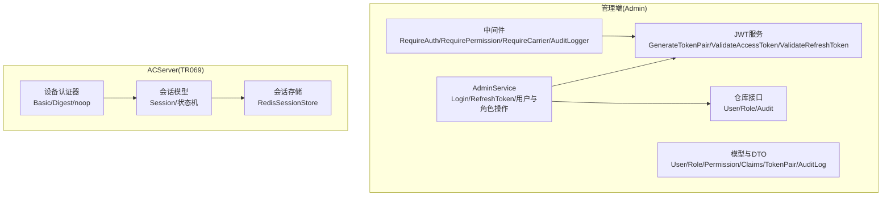
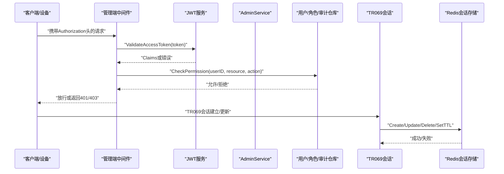
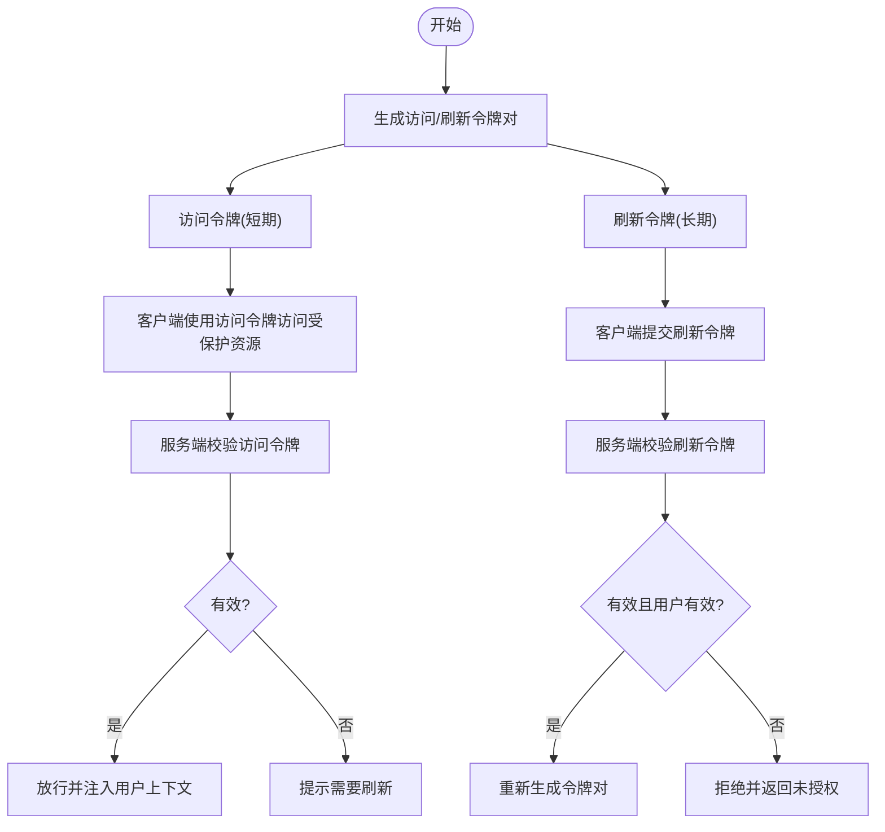
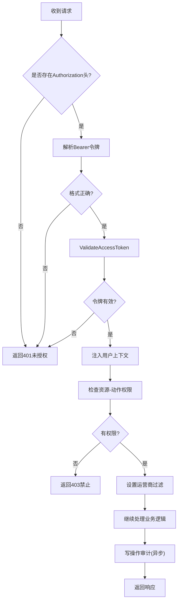
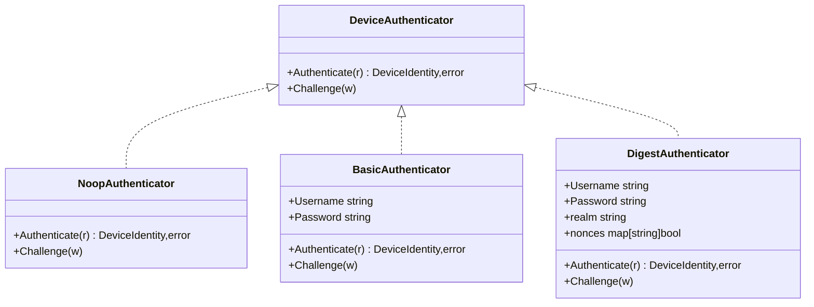
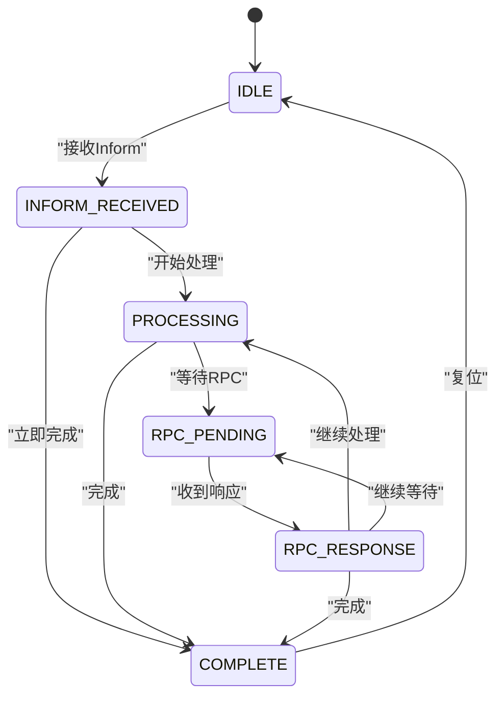
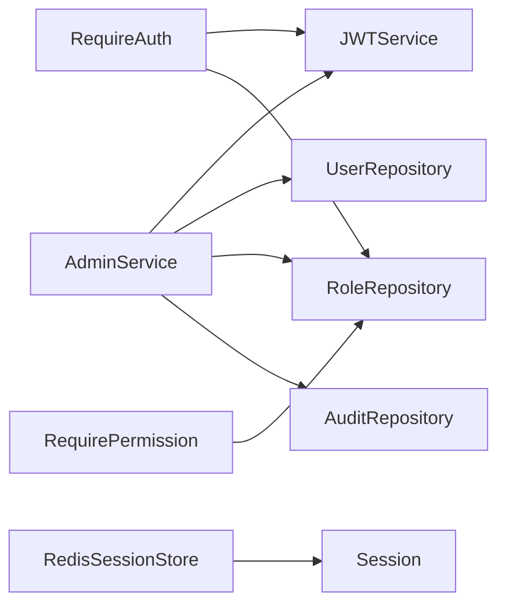

# 认证与安全

<cite>
**本文引用的文件**
- [omcgo/internal/admin/middleware.go](file://omcgo/internal/admin/middleware.go)
- [omcgo/internal/admin/jwt.go](file://omcgo/internal/admin/jwt.go)
- [omcgo/internal/admin/service.go](file://omcgo/internal/admin/service.go)
- [omcgo/internal/admin/repository.go](file://omcgo/internal/admin/repository.go)
- [omcgo/internal/admin/model.go](file://omcgo/internal/admin/model.go)
- [omcgo/internal/acs/auth/authenticator.go](file://omcgo/internal/acs/auth/authenticator.go)
- [omcgo/internal/acs/session.go](file://omcgo/internal/acs/session.go)
- [omcgo/internal/acs/session_store.go](file://omcgo/internal/acs/session_store.go)
- [omcgo/cmd/app/etc/config.dev.yaml](file://omcgo/cmd/app/etc/config.dev.yaml)
- [omcgo/cmd/acs/etc/config.dev.yaml](file://omcgo/cmd/acs/etc/config.dev.yaml)
</cite>

## 目录
1. [简介](#简介)
2. [项目结构](#项目结构)
3. [核心组件](#核心组件)
4. [架构总览](#架构总览)
5. [详细组件分析](#详细组件分析)
6. [依赖分析](#依赖分析)
7. [性能考虑](#性能考虑)
8. [故障排查指南](#故障排查指南)
9. [结论](#结论)
10. [附录：安全配置与最佳实践](#附录安全配置与最佳实践)

## 简介
本文件聚焦于TR069认证与安全模块，覆盖以下关键主题：
- 设备认证机制：用户名密码认证（Basic/Digest）与“无认证”模式，以及面向开发的“noop”模式。
- JWT令牌体系：生成、验证与刷新；访问令牌与刷新令牌的生命周期与用途。
- 中间件安全过滤：请求拦截、权限校验、访问控制与审计日志。
- 会话安全策略：TR069会话状态机、Redis持久化与超时控制。
- 安全配置指南与最佳实践：密钥管理、TLS、CORS、速率限制与日志轮转。
- 常见威胁防护与应急响应流程。

## 项目结构
围绕认证与安全的关键代码分布在如下位置：
- 管理端（Admin）子系统：JWT服务、鉴权中间件、RBAC与审计。
- ACServer（TR069 ACS）子系统：设备端HTTP认证（Basic/Digest/noop）、会话状态与存储。
- 配置：应用与ACS服务的运行参数、JWT密钥与超时、CORS等。

图示来源
- [omcgo/internal/admin/middleware.go:21-167](file://omcgo/internal/admin/middleware.go#L21-L167)
- [omcgo/internal/admin/jwt.go:12-136](file://omcgo/internal/admin/jwt.go#L12-L136)
- [omcgo/internal/admin/service.go:15-353](file://omcgo/internal/admin/service.go#L15-L353)
- [omcgo/internal/acs/auth/authenticator.go:19-140](file://omcgo/internal/acs/auth/authenticator.go#L19-L140)
- [omcgo/internal/acs/session.go:21-72](file://omcgo/internal/acs/session.go#L21-L72)
- [omcgo/internal/acs/session_store.go:12-82](file://omcgo/internal/acs/session_store.go#L12-L82)

章节来源
- [omcgo/internal/admin/middleware.go:1-167](file://omcgo/internal/admin/middleware.go#L1-L167)
- [omcgo/internal/admin/jwt.go:1-136](file://omcgo/internal/admin/jwt.go#L1-L136)
- [omcgo/internal/admin/service.go:1-353](file://omcgo/internal/admin/service.go#L1-L353)
- [omcgo/internal/acs/auth/authenticator.go:1-140](file://omcgo/internal/acs/auth/authenticator.go#L1-L140)
- [omcgo/internal/acs/session.go:1-72](file://omcgo/internal/acs/session.go#L1-L72)
- [omcgo/internal/acs/session_store.go:1-82](file://omcgo/internal/acs/session_store.go#L1-L82)

## 核心组件
- JWT服务：负责生成访问/刷新令牌对、校验访问令牌与刷新令牌，并维护默认与可配置的TTL。
- 鉴权中间件：统一从Authorization头解析Bearer令牌，校验有效性并注入用户上下文；提供资源-动作级权限校验与运营商维度的访问控制。
- 审计中间件：对写操作进行审计记录，异步落库，避免阻塞主响应链路。
- 设备认证器：支持Basic、Digest与noop三种模式，用于TR069设备接入时的身份鉴别。
- TR069会话：定义会话状态机与Redis持久化，保障设备交互过程中的状态一致性与超时控制。

章节来源
- [omcgo/internal/admin/jwt.go:12-136](file://omcgo/internal/admin/jwt.go#L12-L136)
- [omcgo/internal/admin/middleware.go:21-167](file://omcgo/internal/admin/middleware.go#L21-L167)
- [omcgo/internal/acs/auth/authenticator.go:19-140](file://omcgo/internal/acs/auth/authenticator.go#L19-L140)
- [omcgo/internal/acs/session.go:9-72](file://omcgo/internal/acs/session.go#L9-L72)
- [omcgo/internal/acs/session_store.go:12-82](file://omcgo/internal/acs/session_store.go#L12-L82)

## 架构总览
下图展示管理端与ACServer在认证与安全方面的交互关系：

图示来源
- [omcgo/internal/admin/middleware.go:21-167](file://omcgo/internal/admin/middleware.go#L21-L167)
- [omcgo/internal/admin/jwt.go:98-136](file://omcgo/internal/admin/jwt.go#L98-L136)
- [omcgo/internal/admin/service.go:41-116](file://omcgo/internal/admin/service.go#L41-L116)
- [omcgo/internal/acs/session.go:43-72](file://omcgo/internal/acs/session.go#L43-L72)
- [omcgo/internal/acs/session_store.go:41-82](file://omcgo/internal/acs/session_store.go#L41-L82)

## 详细组件分析

### JWT令牌生成、验证与刷新
- 生成令牌对：根据用户身份与角色生成访问令牌与刷新令牌，设置签发时间、过期时间与唯一ID。
- 访问令牌校验：仅接受“access”主题的令牌，校验签名与有效期。
- 刷新令牌校验：仅接受“refresh”主题的令牌，校验通过后重新生成新的令牌对。
- 生命周期：访问令牌默认短期有效，刷新令牌长期有效但需配合后端校验用户状态。

图示来源
- [omcgo/internal/admin/jwt.go:48-106](file://omcgo/internal/admin/jwt.go#L48-L106)
- [omcgo/internal/admin/service.go:83-116](file://omcgo/internal/admin/service.go#L83-L116)

章节来源
- [omcgo/internal/admin/jwt.go:12-136](file://omcgo/internal/admin/jwt.go#L12-L136)
- [omcgo/internal/admin/service.go:41-116](file://omcgo/internal/admin/service.go#L41-L116)

### 中间件安全过滤：请求拦截、权限检查与访问控制
- 请求拦截：要求Authorization头存在且格式为Bearer；否则直接返回未授权。
- 权限检查：基于用户ID与资源-动作对进行权限判定；失败返回禁止访问。
- 访问控制：根据用户绑定的运营商码设置过滤条件，实现多租户隔离。
- 审计日志：对成功的写操作异步记录，包含用户、资源、IP与UA等信息。

图示来源
- [omcgo/internal/admin/middleware.go:21-167](file://omcgo/internal/admin/middleware.go#L21-L167)

章节来源
- [omcgo/internal/admin/middleware.go:21-167](file://omcgo/internal/admin/middleware.go#L21-L167)

### 设备认证机制（TR069）
- Basic认证：从HTTP Basic中提取凭据，常量时间比较用户名与密码，通过后返回设备标识。
- Digest认证：生成一次性nonce，校验客户端计算的MD5摘要，防止重放与窃听。
- noop认证：开发环境专用，始终放行，便于联调测试。

图示来源
- [omcgo/internal/acs/auth/authenticator.go:19-140](file://omcgo/internal/acs/auth/authenticator.go#L19-L140)

章节来源
- [omcgo/internal/acs/auth/authenticator.go:19-140](file://omcgo/internal/acs/auth/authenticator.go#L19-L140)

### 会话安全策略（TR069）
- 会话状态机：定义IDLE、INFORM_RECEIVED、PROCESSING、RPC_PENDING、RPC_RESPONSE、COMPLETE等状态及合法转换。
- Redis持久化：以JSON序列化存储会话，设置键前缀与TTL，支持创建、读取、更新、删除与续期。
- 超时控制：默认会话超时时间可配置，避免僵尸会话占用资源。

图示来源
- [omcgo/internal/acs/session.go:12-59](file://omcgo/internal/acs/session.go#L12-L59)

章节来源
- [omcgo/internal/acs/session.go:9-72](file://omcgo/internal/acs/session.go#L9-L72)
- [omcgo/internal/acs/session_store.go:12-82](file://omcgo/internal/acs/session_store.go#L12-L82)

## 依赖分析
- 管理端依赖关系
  - AdminService依赖JWTService、用户/角色/审计仓库接口，实现登录、刷新、权限检查与用户/角色管理。
  - 中间件依赖JWTService与角色仓库接口，提供统一的鉴权与审计能力。
- ACServer依赖关系
  - 设备认证器独立于业务逻辑，仅负责身份鉴别。
  - 会话模型与Redis存储解耦，便于替换存储后端。

图示来源
- [omcgo/internal/admin/service.go:15-39](file://omcgo/internal/admin/service.go#L15-L39)
- [omcgo/internal/admin/middleware.go:21-101](file://omcgo/internal/admin/middleware.go#L21-L101)
- [omcgo/internal/acs/session_store.go:23-35](file://omcgo/internal/acs/session_store.go#L23-L35)

章节来源
- [omcgo/internal/admin/service.go:15-39](file://omcgo/internal/admin/service.go#L15-L39)
- [omcgo/internal/admin/middleware.go:21-101](file://omcgo/internal/admin/middleware.go#L21-L101)
- [omcgo/internal/acs/session_store.go:23-35](file://omcgo/internal/acs/session_store.go#L23-L35)

## 性能考虑
- JWT令牌对生成与校验：采用HS256签名，计算开销低；建议在高并发场景下：
  - 合理设置访问令牌TTL，降低频繁校验成本。
  - 刷新令牌TTL适当延长，减少用户频繁登录。
- 审计日志：采用异步写入，避免阻塞主请求路径。
- 会话存储：Redis连接池与合适的TTL，避免内存膨胀与网络拥塞。
- 限流与超时：ACServer侧配置每设备每分钟最大Inform次数与突发容量，结合空闲清理策略，抑制异常流量。

## 故障排查指南
- 未携带Authorization头或格式错误
  - 现象：返回未授权。
  - 排查：确认前端是否正确设置Bearer令牌。
- 令牌无效或已过期
  - 现象：返回未授权。
  - 排查：检查令牌类型（access/refresh）与签名密钥；必要时使用刷新令牌换取新令牌。
- 权限不足
  - 现象：返回禁止访问。
  - 排查：确认用户角色与资源-动作映射；检查运营商过滤是否生效。
- 设备认证失败
  - 现象：Basic/Digest认证返回错误。
  - 排查：核对用户名/密码；Digest模式下nonce是否重复使用或过期。
- 会话状态异常
  - 现象：状态转换报错或会话丢失。
  - 排查：检查Redis连通性与TTL设置；确认状态转换是否符合状态机定义。

章节来源
- [omcgo/internal/admin/middleware.go:25-50](file://omcgo/internal/admin/middleware.go#L25-L50)
- [omcgo/internal/admin/jwt.go:108-127](file://omcgo/internal/admin/jwt.go#L108-L127)
- [omcgo/internal/acs/auth/authenticator.go:40-101](file://omcgo/internal/acs/auth/authenticator.go#L40-L101)
- [omcgo/internal/acs/session.go:43-58](file://omcgo/internal/acs/session.go#L43-L58)

## 结论
本模块通过“管理端JWT+中间件权限控制”与“ACServer设备认证+会话状态机”的双轨设计，实现了从用户到设备的全链路安全控制。建议在生产环境中强化TLS、密钥轮换、CORS白名单与日志轮转策略，并持续完善威胁建模与应急响应流程。

## 附录：安全配置与最佳实践

### 配置要点
- JWT密钥与TTL
  - 密钥长度至少32字符，定期轮换。
  - 访问令牌TTL建议短周期（如30分钟），刷新令牌TTL较长（如7天）。
- TLS与端口
  - 生产环境开启TLS，配置证书与私钥文件。
  - 明确HTTP与HTTPS端口，避免混合内容。
- CORS
  - 严格限定允许来源，避免通配符。
- 限流与超时
  - ACServer配置每设备每分钟最大Inform次数与突发容量。
  - 设置合理的读/写/空闲超时，防止资源耗尽。
- 日志轮转
  - 启用日志轮转，限制单文件大小与保留天数，确保审计证据可追溯。

章节来源
- [omcgo/cmd/app/etc/config.dev.yaml:52-56](file://omcgo/cmd/app/etc/config.dev.yaml#L52-L56)
- [omcgo/cmd/acs/etc/config.dev.yaml:24-27](file://omcgo/cmd/acs/etc/config.dev.yaml#L24-L27)
- [omcgo/cmd/acs/etc/config.dev.yaml:9-11](file://omcgo/cmd/acs/etc/config.dev.yaml#L9-L11)
- [omcgo/cmd/acs/etc/config.dev.yaml:17-22](file://omcgo/cmd/acs/etc/config.dev.yaml#L17-L22)
- [omcgo/cmd/acs/etc/config.dev.yaml:57-69](file://omcgo/cmd/acs/etc/config.dev.yaml#L57-L69)

### 最佳实践
- 强制TLS：所有对外接口必须走HTTPS，禁用明文传输。
- 最小权限：RBAC按资源-动作最小授权，定期审计角色与权限映射。
- 令牌安全：访问令牌仅用于短期请求，刷新令牌应安全存储；建议支持吊销与黑名单。
- 会话治理：会话TTL与清理策略要与业务峰值匹配，避免会话堆积。
- 输入校验：对所有外部输入进行严格校验与限流，防止注入与滥用。
- 审计与监控：开启审计日志与关键指标监控，建立告警与溯源机制。

### 常见威胁与防护
- 令牌泄露
  - 防护：缩短访问令牌TTL、启用刷新令牌、定期轮换密钥。
- 权限提升
  - 防护：严格的资源-动作权限检查、运营商维度隔离。
- 会话劫持
  - 防护：短TTL、服务端会话存储、绑定客户端IP/UA（视场景）。
- 暴力破解
  - 防护：账户锁定策略、速率限制、验证码（登录失败时）。
- 中间人攻击
  - 防护：强制TLS、证书固定与校验、CORS白名单。

### 应急响应流程
- 发现异常：快速定位受影响接口与时间段，评估影响范围。
- 隔离与降级：临时关闭高风险接口、启用只读模式或降级策略。
- 复盘与修复：回滚可疑变更、修补漏洞、轮换密钥与证书。
- 通告与复盘：发布安全通告、完善监控与告警，形成闭环。