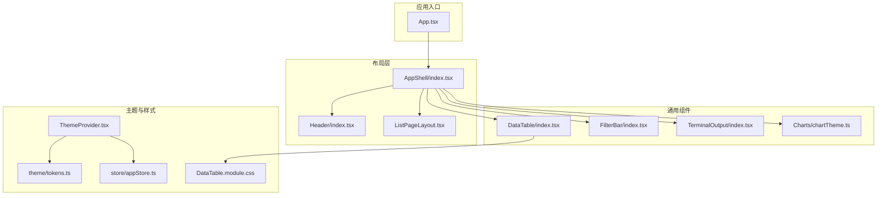
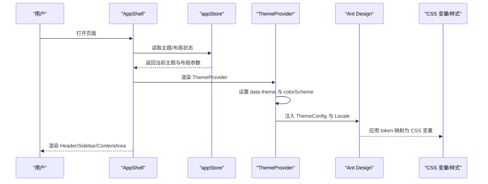
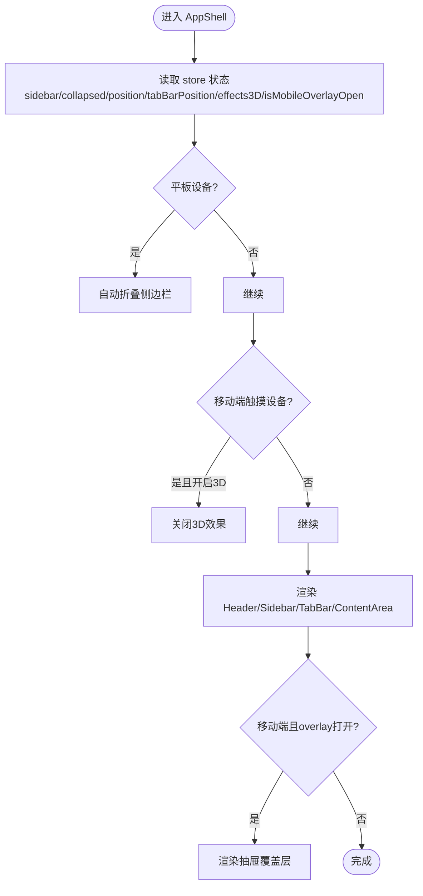
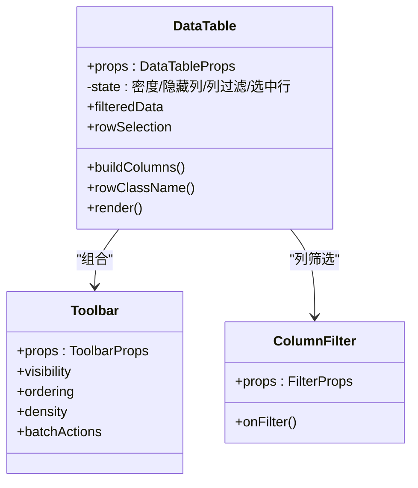
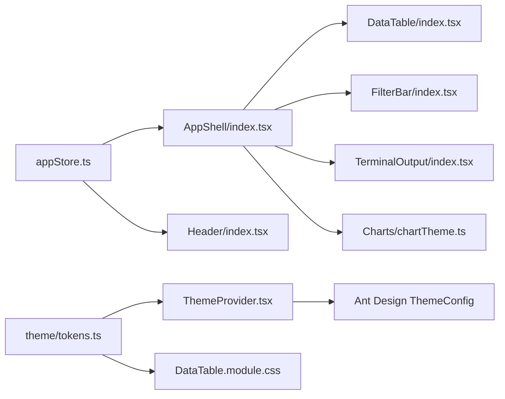

# UI组件系统

<cite>
**本文引用的文件**
- [AppShell/index.tsx](file://omcmb/webcode/src/components/Layout/index.tsx)
- [Header/index.tsx](file://omcmb/webcode/src/components/Layout/Header/index.tsx)
- [ListPageLayout.tsx](file://omcmb/webcode/src/components/Layout/ListPageLayout.tsx)
- [tokens.ts](file://omcmb/webcode/src/theme/tokens.ts)
- [ThemeProvider.tsx](file://omcmb/webcode/src/providers/ThemeProvider.tsx)
- [appStore.ts](file://omcmb/webcode/src/store/appStore.ts)
- [DataTable/index.tsx](file://omcmb/webcode/src/components/DataTable/index.tsx)
- [DataTable.module.css](file://omcmb/webcode/src/components/DataTable/DataTable.module.css)
- [FilterBar/index.tsx](file://omcmb/webcode/src/components/FilterBar/index.tsx)
- [TerminalOutput/index.tsx](file://omcmb/webcode/src/components/TerminalOutput/index.tsx)
- [chartTheme.ts](file://omcmb/webcode/src/components/Charts/chartTheme.ts)
- [techTheme.ts](file://omcmb/webcode/src/theme/techTheme.ts)
- [00-design-tokens.md](file://omcmb/design/01-design-system/00-design-tokens.md)
</cite>

## 目录
1. [简介](#简介)
2. [项目结构](#项目结构)
3. [核心组件](#核心组件)
4. [架构总览](#架构总览)
5. [组件详解](#组件详解)
6. [依赖关系分析](#依赖关系分析)
7. [性能考量](#性能考量)
8. [故障排查指南](#故障排查指南)
9. [结论](#结论)
10. [附录](#附录)

## 简介
本文件面向 Baicells OMC UI 组件系统，聚焦于基于 Ant Design 5.x 的组件库使用与定制化开发，系统性阐述设计令牌、颜色体系、字体排版、阴影与圆角等设计规范；详解核心布局组件（AppShell、Header、Sidebar、ContentArea 等）的设计原理与使用方法；介绍通用组件库（DataTable、Charts、FilterBar、TerminalOutput 等）的功能特性与配置项；说明主题系统（多主题切换、CSS 变量定制、暗色适配）与响应式设计；并提供组件开发最佳实践与使用示例。

## 项目结构
前端位于 omcmb/webcode/src，采用按功能域划分的组织方式：components（通用组件）、pages（页面布局与业务页）、providers（全局上下文）、store（状态管理）、theme（主题与设计令牌）、styles（全局样式）、hooks（自定义 Hook）等。核心入口在 App.tsx，通过路由挂载 AppShell，再由 AppShell 组织 Header、Sidebar、TabBar、ContentArea 与 TaskPanel。

图表来源
- [AppShell/index.tsx:15-113](file://omcmb/webcode/src/components/Layout/index.tsx#L15-L113)
- [Header/index.tsx:40-115](file://omcmb/webcode/src/components/Layout/Header/index.tsx#L40-L115)
- [ListPageLayout.tsx:21-59](file://omcmb/webcode/src/components/Layout/ListPageLayout.tsx#L21-L59)
- [DataTable/index.tsx:75-310](file://omcmb/webcode/src/components/DataTable/index.tsx#L75-L310)
- [FilterBar/index.tsx:44-214](file://omcmb/webcode/src/components/FilterBar/index.tsx#L44-L214)
- [TerminalOutput/index.tsx:32-164](file://omcmb/webcode/src/components/TerminalOutput/index.tsx#L32-L164)
- [chartTheme.ts:59-137](file://omcmb/webcode/src/components/Charts/chartTheme.ts#L59-L137)
- [ThemeProvider.tsx:44-67](file://omcmb/webcode/src/providers/ThemeProvider.tsx#L44-L67)
- [tokens.ts:1-157](file://omcmb/webcode/src/theme/tokens.ts#L1-L157)
- [appStore.ts:45-108](file://omcmb/webcode/src/store/appStore.ts#L45-L108)
- [DataTable.module.css:1-165](file://omcmb/webcode/src/components/DataTable/DataTable.module.css#L1-L165)

章节来源
- [AppShell/index.tsx:15-113](file://omcmb/webcode/src/components/Layout/index.tsx#L15-L113)
- [ThemeProvider.tsx:44-67](file://omcmb/webcode/src/providers/ThemeProvider.tsx#L44-L67)

## 核心组件
- AppShell：统一外壳容器，协调 Header、Sidebar、TabBar、ContentArea、TaskPanel，并处理移动端抽屉、3D 效果开关、侧边栏折叠与位置等状态。
- Header：顶部导航区域，包含汉堡菜单（移动端）、系统名称、设备类型指示、告警徽标、通知、时区选择、主题切换与用户下拉菜单。
- DataTable：增强型数据表格，内置列排序、筛选、可见性控制、密度切换、分页、批量操作、导出、复制单元格、告警行样式等。
- FilterBar：可折叠的表单式过滤条，支持多种输入类型与会话持久化。
- TerminalOutput：终端风格输出组件，支持自动滚动、时间戳、复制与清空。
- Charts：基于 ECharts 的主题化图表配置，提供多主题配色、暗色提示样式、3D 阴影与强调样式。
- 主题系统：通过 ThemeProvider 注入 Ant Design 主题与语言包，设置 data-theme 属性以联动 CSS 变量，支持多主题循环切换与暗色模式适配。

章节来源
- [AppShell/index.tsx:15-113](file://omcmb/webcode/src/components/Layout/index.tsx#L15-L113)
- [Header/index.tsx:40-115](file://omcmb/webcode/src/components/Layout/Header/index.tsx#L40-L115)
- [DataTable/index.tsx:75-310](file://omcmb/webcode/src/components/DataTable/index.tsx#L75-L310)
- [FilterBar/index.tsx:44-214](file://omcmb/webcode/src/components/FilterBar/index.tsx#L44-L214)
- [TerminalOutput/index.tsx:32-164](file://omcmb/webcode/src/components/TerminalOutput/index.tsx#L32-L164)
- [chartTheme.ts:59-137](file://omcmb/webcode/src/components/Charts/chartTheme.ts#L59-L137)
- [ThemeProvider.tsx:44-67](file://omcmb/webcode/src/providers/ThemeProvider.tsx#L44-L67)

## 架构总览
UI 架构围绕“设计令牌 → Ant Design 主题 → 全局样式 → 组件实现”的链路展开。设计令牌集中于 tokens.ts，映射为 Ant Design token 与 CSS 变量；ThemeProvider 在渲染首帧前设置 data-theme，确保 CSS 变量与 AntD 主题同步生效；组件通过 CSS Modules 与 AntD 组件组合，形成统一的视觉与交互体验。

图表来源
- [AppShell/index.tsx:15-113](file://omcmb/webcode/src/components/Layout/index.tsx#L15-L113)
- [appStore.ts:45-108](file://omcmb/webcode/src/store/appStore.ts#L45-L108)
- [ThemeProvider.tsx:44-67](file://omcmb/webcode/src/providers/ThemeProvider.tsx#L44-L67)
- [tokens.ts:1-157](file://omcmb/webcode/src/theme/tokens.ts#L1-L157)

## 组件详解

### 设计系统与主题
- 设计令牌：集中定义主色、中性色、告警/状态色、字体、间距、阴影、圆角、Z-index、断点等，提供 CSS 变量映射与 AntD token 值。
- 主题配置：ThemeProvider 依据当前主题生成 AntD ThemeConfig，并注入语言包；同时设置 <html> 的 data-theme 与 colorScheme，使 CSS 变量与暗色模式一致。
- 多主题：支持 classic、tech、fresh、cyberpunk、minions、tiffany、rmb 七套主题，Header 提供循环切换入口。

章节来源
- [tokens.ts:1-157](file://omcmb/webcode/src/theme/tokens.ts#L1-L157)
- [ThemeProvider.tsx:44-67](file://omcmb/webcode/src/providers/ThemeProvider.tsx#L44-L67)
- [Header/index.tsx:29-38](file://omcmb/webcode/src/components/Layout/Header/index.tsx#L29-L38)
- [techTheme.ts:1-58](file://omcmb/webcode/src/theme/techTheme.ts#L1-L58)
- [00-design-tokens.md:1-90](file://omcmb/design/01-design-system/00-design-tokens.md#L1-L90)

### AppShell 与布局组件
- AppShell：读取 store 中的 sidebar/collapsed、position、tabBarPosition、effects3DEnabled、isMobileOverlayOpen 等状态；根据设备类型自动折叠侧边栏；在移动端启用抽屉覆盖层；根据顶部/左侧两种侧边栏布局动态计算宽度；条件渲染 3D 粒子与光源；根据路由隐藏任务面板。
- Header：左侧移动端汉堡菜单、Logo 与系统名；中部设备类型指示；右侧告警徽标、通知、时区选择、主题切换、用户下拉菜单。
- ListPageLayout：列表页通用布局，支持可选标题、副标题与右上角扩展区域，内部采用纵向栅格布局。

图表来源
- [AppShell/index.tsx:15-113](file://omcmb/webcode/src/components/Layout/index.tsx#L15-L113)
- [appStore.ts:45-108](file://omcmb/webcode/src/store/appStore.ts#L45-L108)

章节来源
- [AppShell/index.tsx:15-113](file://omcmb/webcode/src/components/Layout/index.tsx#L15-L113)
- [Header/index.tsx:40-115](file://omcmb/webcode/src/components/Layout/Header/index.tsx#L40-L115)
- [ListPageLayout.tsx:21-59](file://omcmb/webcode/src/components/Layout/ListPageLayout.tsx#L21-L59)

### DataTable 数据表格
- 能力概览：列排序、筛选、可见性控制、列顺序拖拽、密度切换（紧凑/默认/宽松）、分页、批量操作、导出（xlsx/csv）、复制单元格、告警行样式（紧急/主要/次要/警告）、展开行、横向滚动、国际化空状态。
- 关键 Props：tableId、columns、dataSource、loading、rowKey、selectable、selectedRowKeys、total/pageSize/currentPage、batchActions、onRefresh/onExport、alarmRowStyle、expandable、defaultDensity、extraToolbarLeft/right、scroll、size、showPagination。
- 核心逻辑：内部维护密度、隐藏列、列过滤器、选中行键集合；构建列时支持自定义渲染与复制图标；根据 alarmRowStyle 为行添加严重级别类名；分页由外部传入或内部计算总数；空状态本地化。

图表来源
- [DataTable/index.tsx:41-102](file://omcmb/webcode/src/components/DataTable/index.tsx#L41-L102)
- [DataTable/index.tsx:159-232](file://omcmb/webcode/src/components/DataTable/index.tsx#L159-L232)
- [DataTable/index.tsx:234-251](file://omcmb/webcode/src/components/DataTable/index.tsx#L234-L251)

章节来源
- [DataTable/index.tsx:75-310](file://omcmb/webcode/src/components/DataTable/index.tsx#L75-L310)
- [DataTable.module.css:1-165](file://omcmb/webcode/src/components/DataTable/DataTable.module.css#L1-L165)

### FilterBar 过滤条
- 能力概览：多字段表单过滤，支持输入、单/多选、日期范围、树选择；可折叠显示；搜索值 sessionStorage 持久化；重置清理；底部动作区。
- 关键 Props：filterId、fields（含 name/label/type/placeholder/options/treeData/span/defaultValue）、onSearch/onReset、collapsedRows、extra。
- 实现要点：按行等比栅格布局，最后一列放置操作按钮；根据展开状态决定显示字段数量；使用 AntD Form 与受控组件；将表单值写入 sessionStorage 并在挂载时恢复。

章节来源
- [FilterBar/index.tsx:44-214](file://omcmb/webcode/src/components/FilterBar/index.tsx#L44-L214)

### TerminalOutput 终端输出
- 能力概览：彩色日志输出（stdout/stderr/info/success）、时间戳、自动滚动、复制全部、清空、可变高度与字体。
- 关键 Props：lines、height、autoScroll、showTimestamp、style；通过 forwardRef 暴露 appendLine/clear。
- 实现要点：容器滚动到底部；按行类型着色；支持复制全部内容并反馈消息。

章节来源
- [TerminalOutput/index.tsx:32-164](file://omcmb/webcode/src/components/TerminalOutput/index.tsx#L32-L164)

### Charts 图表主题
- 能力概览：多主题配色映射、暗色提示样式、3D 阴影与强调样式、基础 ECharts 配置（网格、坐标轴、图例、文本、工具提示）。
- 关键函数：getChartPalette(theme)、getTooltipStyle(isDark)、get3DItemStyle(color,isDark)、get3DEmphasisStyle()、getBaseOption(isDark,theme)。
- 使用建议：在图表组件中传入主题与暗色标识，合并基础配置与业务配置。

章节来源
- [chartTheme.ts:4-137](file://omcmb/webcode/src/components/Charts/chartTheme.ts#L4-L137)

## 依赖关系分析
- 组件耦合：AppShell 依赖 store 与 hooks，Header 依赖 store 与 i18n；DataTable 依赖 AntD Table 与本地化；FilterBar 依赖 AntD Form 与本地化；TerminalOutput 依赖 AntD Button/Space/Tooltip；Charts 依赖 ECharts 与主题映射。
- 状态管理：appStore 统一管理主题、语言、布局、设备类型、3D 效果与移动端 overlay 状态；ThemeProvider 仅消费 store 并注入 AntD。
- 样式体系：tokens.ts 定义 CSS 变量与 AntD token；DataTable.module.css 通过 CSS 变量实现主题联动；ThemeProvider 在首帧前设置 data-theme，保证 CSS 变量与 AntD 同步。

图表来源
- [appStore.ts:45-108](file://omcmb/webcode/src/store/appStore.ts#L45-L108)
- [AppShell/index.tsx:15-113](file://omcmb/webcode/src/components/Layout/index.tsx#L15-L113)
- [Header/index.tsx:40-115](file://omcmb/webcode/src/components/Layout/Header/index.tsx#L40-L115)
- [DataTable/index.tsx:75-310](file://omcmb/webcode/src/components/DataTable/index.tsx#L75-L310)
- [FilterBar/index.tsx:44-214](file://omcmb/webcode/src/components/FilterBar/index.tsx#L44-L214)
- [TerminalOutput/index.tsx:32-164](file://omcmb/webcode/src/components/TerminalOutput/index.tsx#L32-L164)
- [chartTheme.ts:59-137](file://omcmb/webcode/src/components/Charts/chartTheme.ts#L59-L137)
- [ThemeProvider.tsx:44-67](file://omcmb/webcode/src/providers/ThemeProvider.tsx#L44-L67)
- [tokens.ts:1-157](file://omcmb/webcode/src/theme/tokens.ts#L1-L157)
- [DataTable.module.css:1-165](file://omcmb/webcode/src/components/DataTable/DataTable.module.css#L1-L165)

章节来源
- [appStore.ts:45-108](file://omcmb/webcode/src/store/appStore.ts#L45-L108)
- [ThemeProvider.tsx:44-67](file://omcmb/webcode/src/providers/ThemeProvider.tsx#L44-L67)
- [tokens.ts:1-157](file://omcmb/webcode/src/theme/tokens.ts#L1-L157)

## 性能考量
- 渲染优化：DataTable 内部使用 useMemo 缓存列构建与过滤结果；ThemeProvider 使用 useMemo 保持 ThemeConfig 引用稳定，避免不必要的上下文重建。
- 事件与副作用：AppShell 在平板设备自动折叠侧边栏、在移动端触摸设备自动关闭 3D 效果，减少不必要资源消耗；FilterBar 使用 sessionStorage 持久化搜索条件，避免重复请求。
- 样式与主题：通过 data-theme 与 CSS 变量实现主题切换，避免重绘闪烁；AntD 主题一次性注入，减少重复渲染成本。
- 响应式：useResponsive 与断点常量配合，实现移动端与平板端的布局自适应。

章节来源
- [DataTable/index.tsx:128-157](file://omcmb/webcode/src/components/DataTable/index.tsx#L128-L157)
- [DataTable/index.tsx:159-232](file://omcmb/webcode/src/components/DataTable/index.tsx#L159-L232)
- [AppShell/index.tsx:36-48](file://omcmb/webcode/src/components/Layout/index.tsx#L36-L48)
- [FilterBar/index.tsx:57-88](file://omcmb/webcode/src/components/FilterBar/index.tsx#L57-L88)
- [ThemeProvider.tsx:58-60](file://omcmb/webcode/src/providers/ThemeProvider.tsx#L58-L60)
- [tokens.ts:151-157](file://omcmb/webcode/src/theme/tokens.ts#L151-L157)

## 故障排查指南
- 主题切换空白页问题：早期实现存在双重 ConfigProvider 导致的渲染异常。现已改为单一 ConfigProvider 包裹，确保 ThemeConfig 与 Locale 注入稳定。
- 3D 效果导致移动端卡顿：AppShell 在检测到移动端触摸设备时自动关闭 3D 效果，可通过 store.toggleEffects3DEnabled 手动切换。
- 侧边栏在顶部布局下无法展开：当侧边栏位置为顶部时，自动折叠；切换至左侧后可正常展开。
- 移动端抽屉无法关闭：Esc 键可关闭 overlay；也可点击遮罩层关闭。
- 表格列筛选无效：确认列定义中的 filterable 与 filterType 是否正确；检查列过滤器状态与数据源是否为空。
- 过滤条搜索条件未持久化：确认 sessionStorage 可用；检查 filterId 是否唯一；查看控制台错误信息。

章节来源
- [ThemeProvider.tsx:36-43](file://omcmb/webcode/src/providers/ThemeProvider.tsx#L36-L43)
- [AppShell/index.tsx:50-58](file://omcmb/webcode/src/components/Layout/index.tsx#L50-L58)
- [appStore.ts:59-66](file://omcmb/webcode/src/store/appStore.ts#L59-L66)
- [DataTable/index.tsx:121-126](file://omcmb/webcode/src/components/DataTable/index.tsx#L121-L126)
- [FilterBar/index.tsx:57-88](file://omcmb/webcode/src/components/FilterBar/index.tsx#L57-L88)

## 结论
该 UI 组件系统以 Ant Design 5.x 为核心，结合统一设计令牌与多主题方案，实现了高内聚、低耦合的组件生态。通过 AppShell 统一布局、DataTable 与 FilterBar 提升数据操作效率、TerminalOutput 与 Charts 增强可视化表达，辅以完善的主题切换与响应式策略，满足 OMC 管理平台的复杂场景需求。建议在后续迭代中持续完善无障碍访问、国际化文案与组件测试覆盖。

## 附录

### 设计令牌与 CSS 变量对照
- 主色与中性色：对应 AntD token 与 CSS 变量，用于按钮、文本、背景与边框。
- 告警与状态色：用于严重级别与状态指示，配合表格行样式。
- 字体与字号：统一正文、标题与辅助文字的字号体系。
- 间距与尺寸：统一组件高度、内边距与外边距。
- 阴影与圆角：统一卡片、下拉与弹窗的层级与圆角。
- 断点：移动端与桌面端布局切换阈值。

章节来源
- [tokens.ts:1-157](file://omcmb/webcode/src/theme/tokens.ts#L1-L157)
- [00-design-tokens.md:1-90](file://omcmb/design/01-design-system/00-design-tokens.md#L1-L90)

### 组件开发最佳实践
- Props 设计：保持最小可用集，区分受控与非受控；为可选行为提供默认值；使用类型别名提升可读性。
- 事件处理：统一回调命名（onXxx），避免在渲染阶段创建新函数；对高频事件使用 useCallback 缓存。
- 样式定制：优先使用 CSS 变量与 AntD token；组件样式使用 CSS Modules 避免冲突；必要时通过 className 扩展。
- 无障碍访问：为交互元素提供 aria-label；键盘可访问（Tab/Enter/Escape）；颜色不作为唯一信息载体。
- 主题与响应式：在组件内部尽量依赖 store 与 hooks；避免硬编码断点；暗色模式下校验对比度与阴影。

### 使用示例与集成指南
- 集成步骤
  - 在应用根节点包裹 ThemeProvider，确保 AntD 主题与语言包注入。
  - 在路由出口处挂载 AppShell，承载 Header、Sidebar、ContentArea 与 TaskPanel。
  - 在页面中使用 ListPageLayout 组织标题与内容区域。
  - 在需要的页面引入 DataTable/FilterBar/TerminalOutput/Charts 组件。
- 示例路径
  - AppShell 布局：[AppShell/index.tsx:15-113](file://omcmb/webcode/src/components/Layout/index.tsx#L15-L113)
  - Header 动作与主题切换：[Header/index.tsx:40-115](file://omcmb/webcode/src/components/Layout/Header/index.tsx#L40-L115)
  - 列表页布局：[ListPageLayout.tsx:21-59](file://omcmb/webcode/src/components/Layout/ListPageLayout.tsx#L21-L59)
  - 数据表格：[DataTable/index.tsx:75-310](file://omcmb/webcode/src/components/DataTable/index.tsx#L75-L310)
  - 过滤条：[FilterBar/index.tsx:44-214](file://omcmb/webcode/src/components/FilterBar/index.tsx#L44-L214)
  - 终端输出：[TerminalOutput/index.tsx:32-164](file://omcmb/webcode/src/components/TerminalOutput/index.tsx#L32-L164)
  - 图表主题：[chartTheme.ts:59-137](file://omcmb/webcode/src/components/Charts/chartTheme.ts#L59-L137)
  - 主题提供者：[ThemeProvider.tsx:44-67](file://omcmb/webcode/src/providers/ThemeProvider.tsx#L44-L67)
  - 设计令牌：[tokens.ts:1-157](file://omcmb/webcode/src/theme/tokens.ts#L1-L157)