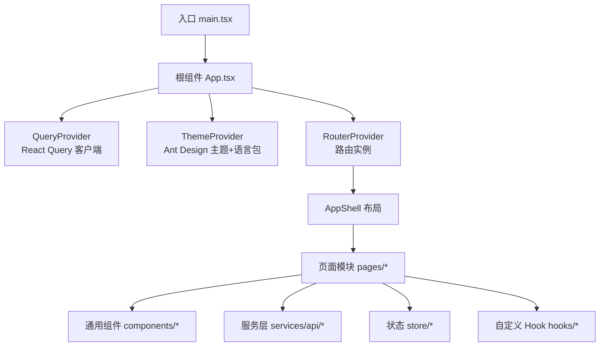
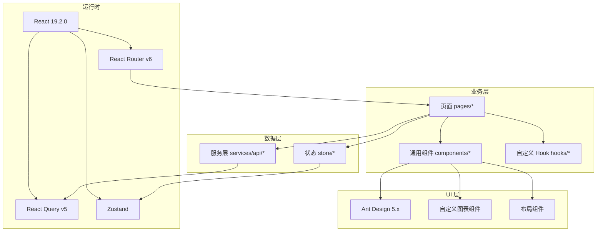
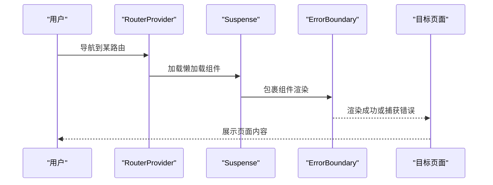
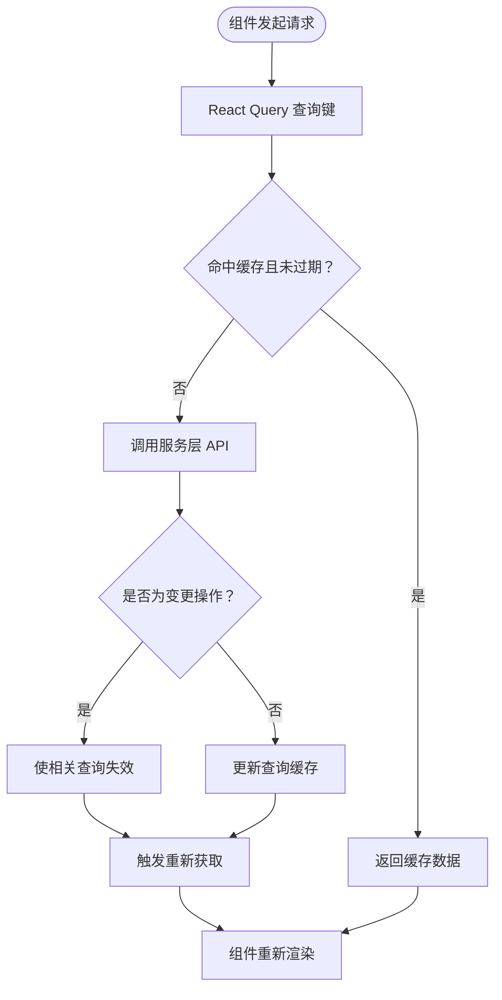
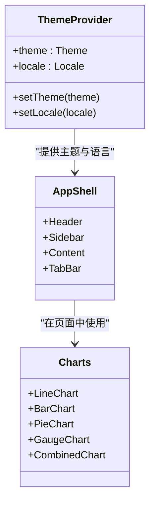
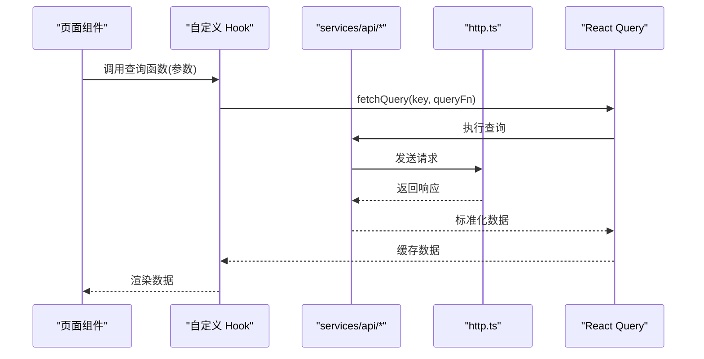
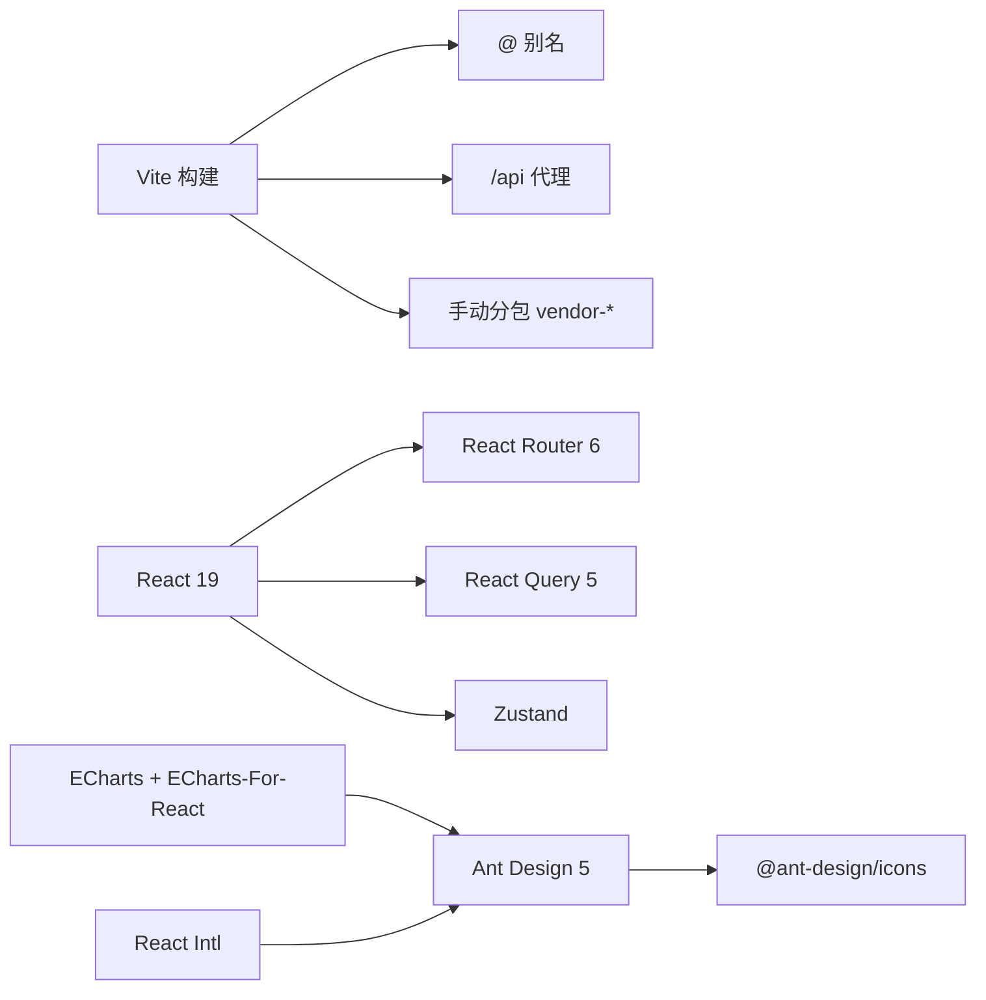

# 前端开发

<cite>
**本文引用的文件**
- [package.json](file://omcmb/webcode/package.json)
- [vite.config.ts](file://omcmb/webcode/vite.config.ts)
- [main.tsx](file://omcmb/webcode/src/main.tsx)
- [App.tsx](file://omcmb/webcode/src/App.tsx)
- [router/index.tsx](file://omcmb/webcode/src/router/index.tsx)
- [router/routes.tsx](file://omcmb/webcode/src/router/routes.tsx)
- [providers/QueryProvider.tsx](file://omcmb/webcode/src/providers/QueryProvider.tsx)
- [providers/ThemeProvider.tsx](file://omcmb/webcode/src/providers/ThemeProvider.tsx)
- [store/index.ts](file://omcmb/webcode/src/store/index.ts)
- [store/appStore.ts](file://omcmb/webcode/src/store/appStore.ts)
- [store/userStore.ts](file://omcmb/webcode/src/store/userStore.ts)
- [store/tabStore.ts](file://omcmb/webcode/src/store/tabStore.ts)
- [store/taskStore.ts](file://omcmb/webcode/src/store/taskStore.ts)
- [store/alarmStore.ts](file://omcmb/webcode/src/store/alarmStore.ts)
- [hooks/useThemeToken.ts](file://omcmb/webcode/src/hooks/useThemeToken.ts)
- [hooks/useResponsive.ts](file://omcmb/webcode/src/hooks/useResponsive.ts)
- [hooks/useKeyboardShortcuts.ts](file://omcmb/webcode/src/hooks/useKeyboardShortcuts.ts)
- [hooks/api/useDevices.ts](file://omcmb/webcode/src/hooks/api/useDevices.ts)
- [hooks/api/useAlarms.ts](file://omcmb/webcode/src/hooks/api/useAlarms.ts)
- [hooks/api/usePerformance.ts](file://omcmb/webcode/src/hooks/api/usePerformance.ts)
- [services/api/deviceApi.ts](file://omcmb/webcode/src/services/api/deviceApi.ts)
- [services/api/alarmApi.ts](file://omcmb/webcode/src/services/api/alarmApi.ts)
- [services/api/pmApi.ts](file://omcmb/webcode/src/services/api/pmApi.ts)
- [services/http.ts](file://omcmb/webcode/src/services/http.ts)
- [types/index.ts](file://omcmb/webcode/src/types/index.ts)
- [components/Layout/index.tsx](file://omcmb/webcode/src/components/Layout/index.tsx)
- [components/Layout/Header/index.tsx](file://omcmb/webcode/src/components/Layout/Header/index.tsx)
- [components/Layout/Sidebar/index.tsx](file://omcmb/webcode/src/components/Layout/Sidebar/index.tsx)
- [components/Charts/chartTheme.ts](file://omcmb/webcode/src/components/Charts/chartTheme.ts)
- [components/Charts/LineChart.tsx](file://omcmb/webcode/src/components/Charts/LineChart.tsx)
- [components/Charts/BarChart.tsx](file://omcmb/webcode/src/components/Charts/BarChart.tsx)
- [components/Charts/PieChart.tsx](file://omcmb/webcode/src/components/Charts/PieChart.tsx)
- [components/Charts/GaugeChart.tsx](file://omcmb/webcode/src/components/Charts/GaugeChart.tsx)
- [components/Charts/CombinedChart.tsx](file://omcmb/webcode/src/components/Charts/CombinedChart.tsx)
- [components/DataTable/index.tsx](file://omcmb/webcode/src/components/DataTable/index.tsx)
- [components/DataTable/Toolbar.tsx](file://omcmb/webcode/src/components/DataTable/Toolbar.tsx)
- [components/DataTable/ColumnFilter.tsx](file://omcmb/webcode/src/components/DataTable/ColumnFilter.tsx)
- [components/DeviceSelector/index.tsx](file://omcmb/webcode/src/components/DeviceSelector/index.tsx)
- [components/DeviceSelector/ByClassificationTab.tsx](file://omcmb/webcode/src/components/DeviceSelector/ByClassificationTab.tsx)
- [components/DeviceSelector/ByElementTab.tsx](file://omcmb/webcode/src/components/DeviceSelector/ByElementTab.tsx)
- [components/DeviceSelector/ByTemplateTab.tsx](file://omcmb/webcode/src/components/DeviceSelector/ByTemplateTab.tsx)
- [components/TopologyCanvas/index.tsx](file://omcmb/webcode/src/components/TopologyCanvas/index.tsx)
- [components/GISMap/index.tsx](file://omcmb/webcode/src/components/GISMap/index.tsx)
- [components/Effects/DynamicLightSource.tsx](file://omcmb/webcode/src/components/Effects/DynamicLightSource.tsx)
- [components/Effects/FloatingElement.tsx](file://omcmb/webcode/src/components/Effects/FloatingElement.tsx)
- [components/Effects/ParticleCanvas.tsx](file://omcmb/webcode/src/components/Effects/ParticleCanvas.tsx)
- [components/Effects/TiltCard.tsx](file://omcmb/webcode/src/components/Effects/TiltCard.tsx)
- [components/Effects/themeEffectConfig.ts](file://omcmb/webcode/src/components/Effects/themeEffectConfig.ts)
- [components/Effects/particlePresets.ts](file://omcmb/webcode/src/components/Effects/particlePresets.ts)
- [pages/dashboard/index.tsx](file://omcmb/webcode/src/pages/dashboard/index.tsx)
- [pages/device/DeviceList/index.tsx](file://omcmb/webcode/src/pages/device/DeviceList/index.tsx)
- [pages/device/DeviceDetail/index.tsx](file://omcmb/webcode/src/pages/device/DeviceDetail/index.tsx)
- [pages/device/OnlineMonitoring/index.tsx](file://omcmb/webcode/src/pages/device/OnlineMonitoring/index.tsx)
- [pages/alarm/CurrentAlarms/index.tsx](file://omcmb/webcode/src/pages/alarm/CurrentAlarms/index.tsx)
- [pages/alarm/HistoricalAlarms/index.tsx](file://omcmb/webcode/src/pages/alarm/HistoricalAlarms/index.tsx)
- [pages/performance/PerformanceCharts/index.tsx](file://omcmb/webcode/src/pages/performance/PerformanceCharts/index.tsx)
- [pages/mr/Indicators/index.tsx](file://omcmb/webcode/src/pages/mr/Indicators/index.tsx)
- [pages/topology/TopologyCanvas/index.tsx](file://omcmb/webcode/src/pages/topology/TopologyCanvas/index.tsx)
- [pages/login/index.tsx](file://omcmb/webcode/src/pages/login/index.tsx)
- [pages/error/NotFound.tsx](file://omcmb/webcode/src/pages/error/NotFound.tsx)
</cite>

## 目录
1. [简介](#简介)
2. [项目结构](#项目结构)
3. [核心组件](#核心组件)
4. [架构总览](#架构总览)
5. [详细组件分析](#详细组件分析)
6. [依赖关系分析](#依赖关系分析)
7. [性能考虑](#性能考虑)
8. [故障排查指南](#故障排查指南)
9. [结论](#结论)
10. [附录](#附录)

## 简介
本文件面向 Baicells OMC 前端应用，基于 React 19.2.0 + TypeScript + Vite 的技术栈，提供从架构设计到组件实现、状态管理、UI 设计系统、开发与部署实践的完整开发文档。应用采用 Ant Design 5.x 作为设计系统，结合多主题与国际化能力；通过 React Router v6 实现路由与懒加载；以 React Query 管理缓存与数据同步；以 Zustand 提供轻量状态管理；并辅以自定义图表、布局与特效组件，满足设备管理、告警管理、性能监控、MR 管理、拓扑可视化等业务场景。

## 项目结构
前端代码位于 omcmb/webcode 目录，采用按功能域划分的组织方式：pages（页面）、components（通用组件）、hooks（自定义 Hook）、services（API 层）、store（状态管理）、providers（上下文提供者）、router（路由）、theme（主题）、styles（样式）等。

图示来源
- [main.tsx:1-21](file://omcmb/webcode/src/main.tsx#L1-L21)
- [App.tsx:1-27](file://omcmb/webcode/src/App.tsx#L1-L27)
- [router/index.tsx:1-16](file://omcmb/webcode/src/router/index.tsx#L1-L16)
- [router/routes.tsx:1-314](file://omcmb/webcode/src/router/routes.tsx#L1-L314)

章节来源
- [main.tsx:1-21](file://omcmb/webcode/src/main.tsx#L1-L21)
- [App.tsx:1-27](file://omcmb/webcode/src/App.tsx#L1-L27)
- [router/index.tsx:1-16](file://omcmb/webcode/src/router/index.tsx#L1-L16)
- [router/routes.tsx:1-314](file://omcmb/webcode/src/router/routes.tsx#L1-L314)

## 核心组件
- 应用根组件 App.tsx：以 Provider 组合顺序（Query → Theme → Locale → Router）装配全局上下文，确保主题、语言与路由在应用启动时即位。
- 路由系统：使用 createBrowserRouter，统一定义所有业务路由，并通过 Suspense + ErrorBoundary 包裹懒加载页面，提升首屏体验与错误兜底。
- 查询客户端：QueryProvider 使用 React Query，默认缓存策略（staleTime、retry、refetchOnWindowFocus），统一处理请求重试与缓存失效。
- 主题与语言：ThemeProvider 读取 appStore 中的 theme 与 locale，动态设置 data-theme 属性与 Ant Design ConfigProvider，避免切换主题导致的空白页问题。
- 样式入口：main.tsx 引入全局样式与多套主题效果样式，便于按主题切换。

章节来源
- [App.tsx:1-27](file://omcmb/webcode/src/App.tsx#L1-L27)
- [router/index.tsx:1-16](file://omcmb/webcode/src/router/index.tsx#L1-L16)
- [router/routes.tsx:1-314](file://omcmb/webcode/src/router/routes.tsx#L1-L314)
- [providers/QueryProvider.tsx:1-37](file://omcmb/webcode/src/providers/QueryProvider.tsx#L1-L37)
- [providers/ThemeProvider.tsx:1-68](file://omcmb/webcode/src/providers/ThemeProvider.tsx#L1-L68)
- [main.tsx:1-21](file://omcmb/webcode/src/main.tsx#L1-L21)

## 架构总览
前端整体采用“页面-组件-服务-状态”的分层架构，页面负责路由与布局，组件负责 UI 与交互，服务层封装 API 请求，状态层通过 React Query 与 Zustand 协同管理。

图示来源
- [package.json:14-31](file://omcmb/webcode/package.json#L14-L31)
- [router/routes.tsx:1-314](file://omcmb/webcode/src/router/routes.tsx#L1-L314)
- [providers/QueryProvider.tsx:14-25](file://omcmb/webcode/src/providers/QueryProvider.tsx#L14-L25)
- [store/index.ts](file://omcmb/webcode/src/store/index.ts)

## 详细组件分析

### 路由与页面组织
- 路由懒加载：所有页面均通过 React.lazy 懒加载，配合 Suspense 的加载占位与 ErrorBoundary 错误兜底，减少首屏体积并提升稳定性。
- 页面布局：AppShell 作为容器，承载 Header、Sidebar、主内容区与标签页等，不同页面可选择性使用 ListPageLayout、TreeListPageLayout、DashboardPageLayout 等布局变体。
- 未匹配路由：使用 * 路由跳转至 NotFound 页面，保证用户体验一致性。

图示来源
- [router/index.tsx:1-16](file://omcmb/webcode/src/router/index.tsx#L1-L16)
- [router/routes.tsx:147-161](file://omcmb/webcode/src/router/routes.tsx#L147-L161)
- [router/routes.tsx:166-314](file://omcmb/webcode/src/router/routes.tsx#L166-L314)

章节来源
- [router/index.tsx:1-16](file://omcmb/webcode/src/router/index.tsx#L1-L16)
- [router/routes.tsx:1-314](file://omcmb/webcode/src/router/routes.tsx#L1-L314)

### 状态管理策略
- React Query：统一缓存与并发控制，避免重复请求与内存泄漏；默认查询缓存 30 秒，失败重试 2 次，窗口聚焦不自动刷新。
- Zustand：轻量状态管理，用于应用级主题、语言、用户信息、标签页、任务面板等非实时数据。
- Store 组织：appStore、userStore、tabStore、taskStore、alarmStore 等，职责清晰，避免跨模块耦合。

图示来源
- [providers/QueryProvider.tsx:14-25](file://omcmb/webcode/src/providers/QueryProvider.tsx#L14-L25)
- [store/appStore.ts](file://omcmb/webcode/src/store/appStore.ts)
- [store/userStore.ts](file://omcmb/webcode/src/store/userStore.ts)
- [store/tabStore.ts](file://omcmb/webcode/src/store/tabStore.ts)
- [store/taskStore.ts](file://omcmb/webcode/src/store/taskStore.ts)
- [store/alarmStore.ts](file://omcmb/webcode/src/store/alarmStore.ts)

章节来源
- [providers/QueryProvider.tsx:1-37](file://omcmb/webcode/src/providers/QueryProvider.tsx#L1-L37)
- [store/index.ts](file://omcmb/webcode/src/store/index.ts)

### UI 设计系统与主题定制
- Ant Design 5.x：提供基础组件库与设计令牌，支持中英文语言包与主题配置。
- 多主题：classic、tech、fresh、cyberpunk、minions、tiffany、rmb 等主题，通过 ThemeProvider 动态切换，同时设置 data-theme 与 colorScheme，确保 CSS 变量与组件令牌一致。
- 图表主题：自定义 chartTheme 与多种图表组件（折线、柱状、饼图、仪表、组合图），统一配色与样式风格。
- 布局与特效：Layout 提供头部、侧边栏、内容区与标签页；Effects 提供粒子、浮动、光源等视觉特效，增强科技感与沉浸感。

图示来源
- [providers/ThemeProvider.tsx:44-67](file://omcmb/webcode/src/providers/ThemeProvider.tsx#L44-L67)
- [components/Layout/index.tsx](file://omcmb/webcode/src/components/Layout/index.tsx)
- [components/Charts/chartTheme.ts](file://omcmb/webcode/src/components/Charts/chartTheme.ts)
- [components/Charts/LineChart.tsx](file://omcmb/webcode/src/components/Charts/LineChart.tsx)
- [components/Charts/BarChart.tsx](file://omcmb/webcode/src/components/Charts/BarChart.tsx)
- [components/Charts/PieChart.tsx](file://omcmb/webcode/src/components/Charts/PieChart.tsx)
- [components/Charts/GaugeChart.tsx](file://omcmb/webcode/src/components/Charts/GaugeChart.tsx)
- [components/Charts/CombinedChart.tsx](file://omcmb/webcode/src/components/Charts/CombinedChart.tsx)

章节来源
- [providers/ThemeProvider.tsx:1-68](file://omcmb/webcode/src/providers/ThemeProvider.tsx#L1-L68)
- [components/Layout/index.tsx](file://omcmb/webcode/src/components/Layout/index.tsx)
- [components/Charts/chartTheme.ts](file://omcmb/webcode/src/components/Charts/chartTheme.ts)

### 核心页面组件设计与交互

#### 仪表盘（Dashboard）
- 聚焦关键指标卡片（KPICard）、实时告警看板、设备在线率与资源使用趋势等。
- 交互：支持时间范围选择、指标筛选、下钻查看详情；与 React Query 结合实现数据刷新与缓存。

章节来源
- [pages/dashboard/index.tsx](file://omcmb/webcode/src/pages/dashboard/index.tsx)

#### 设备管理（DeviceList、DeviceDetail、OnlineMonitoring）
- 列表页：支持分页、列过滤、列可见性、批量导出、分组移动、参数同步等。
- 详情页：展示设备参数、状态、告警、性能指标与操作记录。
- 在线监控：实时展示设备心跳、在线状态与异常告警。
- 交互：通过 DataTable 工具栏、DeviceSelector、DeviceGrouping 等组件协同完成筛选、分组与批量操作。

章节来源
- [pages/device/DeviceList/index.tsx](file://omcmb/webcode/src/pages/device/DeviceList/index.tsx)
- [pages/device/DeviceDetail/index.tsx](file://omcmb/webcode/src/pages/device/DeviceDetail/index.tsx)
- [pages/device/OnlineMonitoring/index.tsx](file://omcmb/webcode/src/pages/device/OnlineMonitoring/index.tsx)
- [components/DataTable/index.tsx](file://omcmb/webcode/src/components/DataTable/index.tsx)
- [components/DeviceSelector/index.tsx](file://omcmb/webcode/src/components/DeviceSelector/index.tsx)

#### 告警管理（CurrentAlarms、HistoricalAlarms）
- 当前告警：实时列表、告警级别筛选、快速处置、批量确认与派单。
- 历史告警：支持时间轴回放、统计分析、导出与归档。
- 交互：AlarmFilterDialog、AlarmBadges、AlarmStatistics 等组件配合，实现复杂筛选与可视化。

章节来源
- [pages/alarm/CurrentAlarms/index.tsx](file://omcmb/webcode/src/pages/alarm/CurrentAlarms/index.tsx)
- [pages/alarm/HistoricalAlarms/index.tsx](file://omcmb/webcode/src/pages/alarm/HistoricalAlarms/index.tsx)
- [components/AlarmFilterDialog/index.tsx](file://omcmb/webcode/src/components/AlarmFilterDialog/index.tsx)
- [components/Layout/Header/AlarmBadges.tsx](file://omcmb/webcode/src/components/Layout/Header/AlarmBadges.tsx)

#### 性能监控（PerformanceCharts）
- 支持 KPI 指标曲线、阈值对比、多维度聚合与导出。
- 交互：时间选择器、指标选择器、阈值配置、图表联动缩放。

章节来源
- [pages/performance/PerformanceCharts/index.tsx](file://omcmb/webcode/src/pages/performance/PerformanceCharts/index.tsx)
- [components/Charts/LineChart.tsx](file://omcmb/webcode/src/components/Charts/LineChart.tsx)
- [components/Charts/CombinedChart.tsx](file://omcmb/webcode/src/components/Charts/CombinedChart.tsx)

#### MR 管理（Indicators）
- 指标管理：指标定义、映射关系、变量配置与报表生成。
- 交互：表格编辑、批量导入导出、指标计算与可视化。

章节来源
- [pages/mr/Indicators/index.tsx](file://omcmb/webcode/src/pages/mr/Indicators/index.tsx)

#### 拓扑管理（TopologyCanvas）
- 地理/逻辑拓扑绘制、节点拖拽、连线关系与图例系统。
- 交互：右键菜单、缩放平移、节点选中高亮、属性面板联动。

章节来源
- [pages/topology/TopologyCanvas/index.tsx](file://omcmb/webcode/src/pages/topology/TopologyCanvas/index.tsx)
- [components/TopologyCanvas/index.tsx](file://omcmb/webcode/src/components/TopologyCanvas/index.tsx)
- [components/GISMap/index.tsx](file://omcmb/webcode/src/components/GISMap/index.tsx)

### 组件开发指南
- 设计原则：单一职责、可复用、可测试；组件 Props 明确、事件回调语义化。
- Props 接口：建议在 types/index.ts 下集中导出各模块类型，如 device、alarm、performance 等，便于跨页面共享。
- 事件处理：统一使用 onXxx 命名，避免直接修改外部状态，优先通过回调上抛交由父组件或状态层处理。
- 样式定制：优先使用 Ant Design Token 与自定义主题变量；必要时通过 CSS Modules 或内联样式扩展。
- 性能优化：合理拆分组件、使用 memo 与 useMemo/useCallback；列表渲染使用虚拟化与分页。

章节来源
- [types/index.ts](file://omcmb/webcode/src/types/index.ts)
- [components/DataTable/index.tsx](file://omcmb/webcode/src/components/DataTable/index.tsx)

### 数据获取与服务层
- 服务层：services/api/* 封装具体业务 API，统一通过 http.ts 发起请求，支持拦截器、超时与错误处理。
- 自定义 Hook：hooks/api/* 对应页面需求，封装查询、分页、筛选、提交等逻辑，复用 QueryClient。
- 示例：useDevices、useAlarms、usePerformance 等，按需传入查询键与参数，自动缓存与刷新。

图示来源
- [hooks/api/useDevices.ts](file://omcmb/webcode/src/hooks/api/useDevices.ts)
- [hooks/api/useAlarms.ts](file://omcmb/webcode/src/hooks/api/useAlarms.ts)
- [hooks/api/usePerformance.ts](file://omcmb/webcode/src/hooks/api/usePerformance.ts)
- [services/api/deviceApi.ts](file://omcmb/webcode/src/services/api/deviceApi.ts)
- [services/api/alarmApi.ts](file://omcmb/webcode/src/services/api/alarmApi.ts)
- [services/api/pmApi.ts](file://omcmb/webcode/src/services/api/pmApi.ts)
- [services/http.ts](file://omcmb/webcode/src/services/http.ts)

章节来源
- [hooks/api/useDevices.ts](file://omcmb/webcode/src/hooks/api/useDevices.ts)
- [hooks/api/useAlarms.ts](file://omcmb/webcode/src/hooks/api/useAlarms.ts)
- [hooks/api/usePerformance.ts](file://omcmb/webcode/src/hooks/api/usePerformance.ts)
- [services/api/deviceApi.ts](file://omcmb/webcode/src/services/api/deviceApi.ts)
- [services/api/alarmApi.ts](file://omcmb/webcode/src/services/api/alarmApi.ts)
- [services/api/pmApi.ts](file://omcmb/webcode/src/services/api/pmApi.ts)
- [services/http.ts](file://omcmb/webcode/src/services/http.ts)

## 依赖关系分析
- 构建与开发：Vite 作为构建工具，配置代理、别名与分包策略；ESLint + TypeScript 提升代码质量。
- 运行时依赖：React 19、Ant Design 5、React Router 6、React Query 5、Zustand、Ant Design Pro Components、ECharts、Axios、Day.js、React Intl 等。
- 代码分割：vite.config.ts 中针对 antd、echarts、react 生态进行手动分包，降低首屏体积。

图示来源
- [vite.config.ts:5-37](file://omcmb/webcode/vite.config.ts#L5-L37)
- [package.json:14-31](file://omcmb/webcode/package.json#L14-L31)

章节来源
- [vite.config.ts:1-38](file://omcmb/webcode/vite.config.ts#L1-L38)
- [package.json:1-47](file://omcmb/webcode/package.json#L1-L47)

## 性能考虑
- 懒加载与骨架：路由懒加载 + Suspense 占位，减少首屏 JS 体积；DataTable 提供空状态与加载骨架。
- 缓存策略：QueryClient 默认 staleTime=30s，减少重复请求；合理使用 invalidateQueries 触发精准刷新。
- 代码分割：手动分包 vendor-antd、vendor-echarts、vendor-react，提升缓存命中率。
- 图表优化：按需渲染、限制并发图表数量、使用 throttle/debounce 控制交互频率。
- 主题切换：ThemeProvider 使用 useMemo 保持对象引用稳定，避免不必要的重渲染。

章节来源
- [router/routes.tsx:147-161](file://omcmb/webcode/src/router/routes.tsx#L147-L161)
- [providers/QueryProvider.tsx:14-25](file://omcmb/webcode/src/providers/QueryProvider.tsx#L14-L25)
- [vite.config.ts:25-36](file://omcmb/webcode/vite.config.ts#L25-L36)
- [components/DataTable/EmptyState.tsx](file://omcmb/webcode/src/components/DataTable/EmptyState.tsx)

## 故障排查指南
- 登录与鉴权：登录页路径 /login，未登录访问受保护路由将被 PrivateRoute 拦截；检查鉴权状态与路由守卫逻辑。
- 404 页面：* 路由指向 NotFound，确保未覆盖的路由正确跳转。
- 网络错误：common/NetworkError 组件用于展示网络异常；检查 http.ts 拦截器与错误处理分支。
- 主题切换空白：ThemeProvider 已通过 useLayoutEffect 设置 data-theme，避免双 ConfigProvider 导致的闪烁；若仍出现，请确认主题配置对象引用稳定。
- 图表不显示：确认 ECharts 初始化时机与容器尺寸，避免在隐藏状态下渲染；必要时使用延迟渲染或 resize 触发。

章节来源
- [router/routes.tsx:166-314](file://omcmb/webcode/src/router/routes.tsx#L166-L314)
- [pages/error/NotFound.tsx](file://omcmb/webcode/src/pages/error/NotFound.tsx)
- [pages/login/index.tsx](file://omcmb/webcode/src/pages/login/index.tsx)
- [components/common/NetworkError.tsx](file://omcmb/webcode/src/components/common/NetworkError.tsx)
- [providers/ThemeProvider.tsx:44-67](file://omcmb/webcode/src/providers/ThemeProvider.tsx#L44-L67)

## 结论
本前端工程以 React 19 + TypeScript + Vite 为基础，结合 Ant Design 5.x 与多主题体系，形成高可维护、可扩展的前端架构。通过 React Router 的路由懒加载、React Query 的缓存与并发控制、Zustand 的轻量状态管理以及丰富的通用组件库，能够高效支撑设备管理、告警管理、性能监控、MR 管理与拓扑可视化等核心业务场景。建议在后续迭代中持续完善类型体系、测试覆盖率与性能监控，以保障长期演进。

## 附录

### 开发环境搭建
- 安装依赖：使用包管理器安装依赖后，执行 dev 启动开发服务器。
- 代理配置：本地 Vite 代理 /api 到后端服务地址，确保前后端联调顺畅。
- 国际化：通过 LocaleProvider 与 react-intl 配置语言；Ant Design 语言包随 locale 切换。
- 主题切换：在 appStore 中切换 theme，ThemeProvider 自动应用对应主题配置。

章节来源
- [package.json:6-12](file://omcmb/webcode/package.json#L6-L12)
- [vite.config.ts:12-21](file://omcmb/webcode/vite.config.ts#L12-L21)
- [providers/ThemeProvider.tsx:44-67](file://omcmb/webcode/src/providers/ThemeProvider.tsx#L44-L67)

### 构建与部署
- 构建命令：先执行 TypeScript 编译，再进行 Vite 构建，产物输出至 dist。
- 分包策略：手动分包 vendor-antd、vendor-echarts、vendor-react，提升缓存命中与加载性能。
- 版本标识：通过 define 注入 __APP_VERSION__，便于运维追踪。

章节来源
- [package.json:10](file://omcmb/webcode/package.json#L10)
- [vite.config.ts:25-36](file://omcmb/webcode/vite.config.ts#L25-L36)
- [vite.config.ts:22-24](file://omcmb/webcode/vite.config.ts#L22-L24)

### 常用 Hook 与工具
- useThemeToken：读取 Ant Design 主题令牌，用于自定义样式适配。
- useResponsive：响应式断点判断，适配移动端与桌面端布局。
- useKeyboardShortcuts：快捷键绑定，提升操作效率。
- useMousePosition/use3DTilt/useScrollReveal：交互与动画辅助 Hook。

章节来源
- [hooks/useThemeToken.ts](file://omcmb/webcode/src/hooks/useThemeToken.ts)
- [hooks/useResponsive.ts](file://omcmb/webcode/src/hooks/useResponsive.ts)
- [hooks/useKeyboardShortcuts.ts](file://omcmb/webcode/src/hooks/useKeyboardShortcuts.ts)