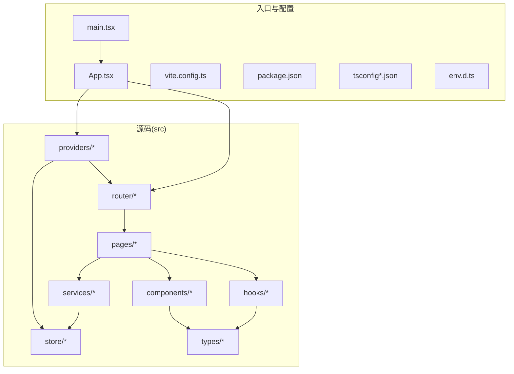
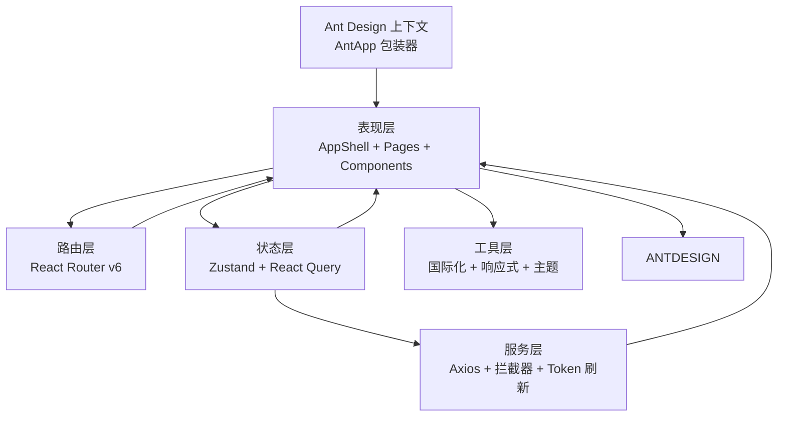
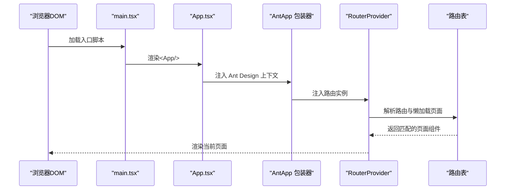
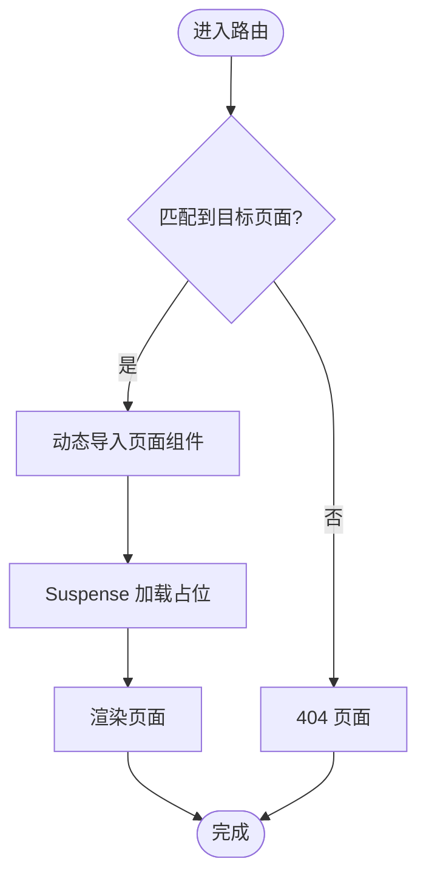
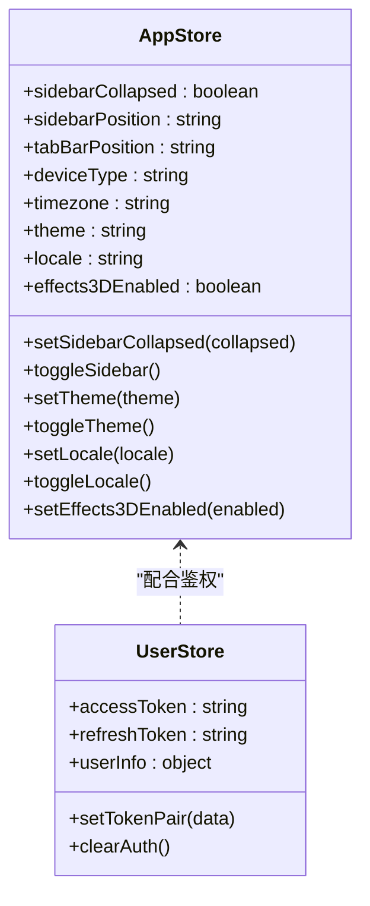
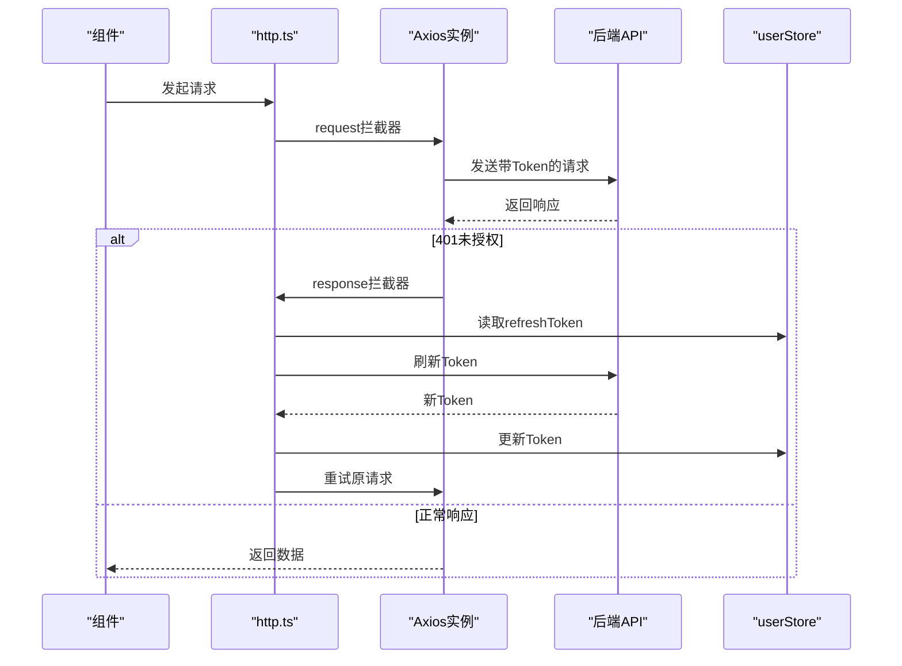
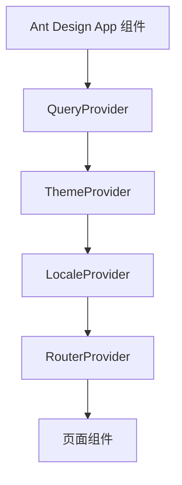
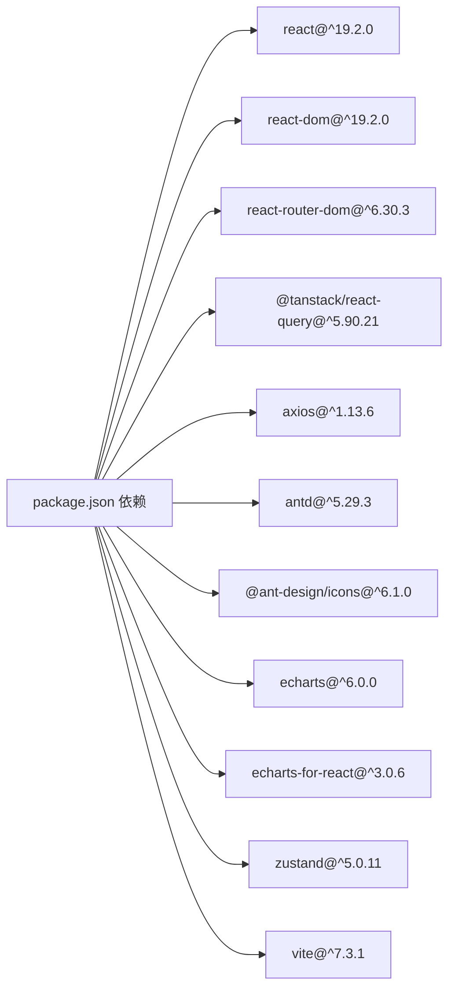

# 应用架构

<cite>
**本文引用的文件**
- [package.json](file://omcmb/webcode/package.json)
- [vite.config.ts](file://omcmb/webcode/vite.config.ts)
- [tsconfig.json](file://omcmb/webcode/tsconfig.json)
- [tsconfig.app.json](file://omcmb/webcode/tsconfig.app.json)
- [tsconfig.node.json](file://omcmb/webcode/tsconfig.node.json)
- [main.tsx](file://omcmb/webcode/src/main.tsx)
- [App.tsx](file://omcmb/webcode/src/App.tsx)
- [router/index.tsx](file://omcmb/webcode/src/router/index.tsx)
- [router/routes.tsx](file://omcmb/webcode/src/router/routes.tsx)
- [providers/QueryProvider.tsx](file://omcmb/webcode/src/providers/QueryProvider.tsx)
- [providers/ThemeProvider.tsx](file://omcmb/webcode/src/providers/ThemeProvider.tsx)
- [providers/LocaleProvider.tsx](file://omcmb/webcode/src/providers/LocaleProvider.tsx)
- [store/index.ts](file://omcmb/webcode/src/store/index.ts)
- [store/appStore.ts](file://omcmb/webcode/src/store/appStore.ts)
- [store/userStore.ts](file://omcmb/webcode/src/store/userStore.ts)
- [services/http.ts](file://omcmb/webcode/src/services/http.ts)
- [hooks/useT.ts](file://omcmb/webcode/src/hooks/useT.ts)
- [components/Layout/index.tsx](file://omcmb/webcode/src/components/Layout/index.tsx)
- [env.d.ts](file://omcmb/webcode/src/env.d.ts)
</cite>

## 目录
1. [简介](#简介)
2. [项目结构](#项目结构)
3. [核心组件](#核心组件)
4. [架构总览](#架构总览)
5. [详细组件分析](#详细组件分析)
6. [依赖关系分析](#依赖关系分析)
7. [性能考量](#性能考量)
8. [故障排查指南](#故障排查指南)
9. [结论](#结论)
10. [附录](#附录)

## 简介
本文件面向 Baicells OMC 前端应用，系统性阐述基于 React 19.2.0 + TypeScript + Vite 的技术栈选型与配置原理，详解应用整体架构（组件层次、路由、状态管理）、目录组织（src 下 components/pages/services/store 等模块职责）、Vite 构建优化策略（开发服务器、代理、分包、体积警告阈值）以及启动流程（从 main.tsx 到 App 组件渲染）。同时提供开发环境搭建、依赖管理与构建部署的实用指南。

## 项目结构
前端工程位于 omcmb/webcode，采用"功能域+分层"的混合组织方式：
- src/components：可复用 UI 组件库（含布局、图表、对话框、效果等）
- src/pages：按业务域划分的页面集合（设备、告警、配置、性能、MR、系统等）
- src/services：网络请求封装与 API 服务抽象
- src/store：Zustand 状态仓库（应用、用户、标签页、任务、告警等）
- src/providers：跨组件的上下文提供者（主题、语言、React Query）
- src/router：路由定义与懒加载页面
- src/hooks：自定义 Hook（国际化、响应式、拖拽、主题等）
- src/types：类型声明聚合
- 根级配置：package.json、vite.config.ts、tsconfig.*.json、env.d.ts

图示来源
- [main.tsx:1-21](file://omcmb/webcode/src/main.tsx#L1-L21)
- [App.tsx:1-31](file://omcmb/webcode/src/App.tsx#L1-L31)
- [router/index.tsx:1-16](file://omcmb/webcode/src/router/index.tsx#L1-L16)
- [router/routes.tsx:1-314](file://omcmb/webcode/src/router/routes.tsx#L1-L314)
- [providers/QueryProvider.tsx:1-37](file://omcmb/webcode/src/providers/QueryProvider.tsx#L1-L37)
- [store/index.ts:1-15](file://omcmb/webcode/src/store/index.ts#L1-L15)
- [services/http.ts:1-175](file://omcmb/webcode/src/services/http.ts#L1-L175)
- [vite.config.ts:1-38](file://omcmb/webcode/vite.config.ts#L1-L38)
- [package.json:1-47](file://omcmb/webcode/package.json#L1-L47)
- [tsconfig.json:1-8](file://omcmb/webcode/tsconfig.json#L1-L8)
- [env.d.ts](file://omcmb/webcode/src/env.d.ts)

章节来源
- [main.tsx:1-21](file://omcmb/webcode/src/main.tsx#L1-L21)
- [App.tsx:1-31](file://omcmb/webcode/src/App.tsx#L1-L31)
- [router/index.tsx:1-16](file://omcmb/webcode/src/router/index.tsx#L1-L16)
- [router/routes.tsx:1-314](file://omcmb/webcode/src/router/routes.tsx#L1-L314)
- [vite.config.ts:1-38](file://omcmb/webcode/vite.config.ts#L1-L38)
- [package.json:1-47](file://omcmb/webcode/package.json#L1-L47)
- [tsconfig.json:1-8](file://omcmb/webcode/tsconfig.json#L1-L8)

## 核心组件
- 启动入口：main.tsx 创建根节点并渲染 App
- 应用壳：App.tsx 以 Provider 组合形式注入主题、语言、路由与缓存能力，**新增 AntApp 包装器提供上下文支持**
- 路由系统：router/index.tsx + router/routes.tsx 定义路由与懒加载页面
- 状态管理：Zustand store（appStore、userStore 等）+ React Query 缓存
- 网络层：Axios 实例封装、拦截器、参数转换、Token 刷新队列
- 国际化：useT Hook 基于 react-intl
- 布局：AppShell 组合 Header、Sidebar、TabBar、TaskPanel，并处理移动端行为

**更新** App.tsx 中的 Provider 组合顺序已更新，新增 AntApp 包装器确保 modal.confirm 等静态方法的上下文正确性

章节来源
- [main.tsx:1-21](file://omcmb/webcode/src/main.tsx#L1-L21)
- [App.tsx:1-31](file://omcmb/webcode/src/App.tsx#L1-L31)
- [router/index.tsx:1-16](file://omcmb/webcode/src/router/index.tsx#L1-L16)
- [router/routes.tsx:1-314](file://omcmb/webcode/src/router/routes.tsx#L1-L314)
- [store/appStore.ts:1-109](file://omcmb/webcode/src/store/appStore.ts#L1-L109)
- [store/userStore.ts](file://omcmb/webcode/src/store/userStore.ts)
- [services/http.ts:1-175](file://omcmb/webcode/src/services/http.ts#L1-L175)
- [hooks/useT.ts:1-8](file://omcmb/webcode/src/hooks/useT.ts#L1-L8)
- [components/Layout/index.tsx:1-114](file://omcmb/webcode/src/components/Layout/index.tsx#L1-L114)

## 架构总览
应用采用"Provider 组合 + 路由懒加载 + Zustand + React Query + Axios"的分层架构：
- 表现层：AppShell + 页面组件 + 可复用组件
- 路由层：React Router v6 + Suspense + 错误边界
- 状态层：Zustand（本地持久化）+ React Query（远端缓存）
- 服务层：Axios 封装 + 请求/响应拦截器 + Token 刷新
- 工具层：国际化 Hook、响应式 Hook、拖拽、主题与样式

**更新** 架构中新增 Ant Design App 组件上下文支持，确保 modal.confirm 等静态方法在所有子组件中正常工作

图示来源
- [App.tsx:1-31](file://omcmb/webcode/src/App.tsx#L1-L31)
- [router/routes.tsx:1-314](file://omcmb/webcode/src/router/routes.tsx#L1-L314)
- [providers/QueryProvider.tsx:1-37](file://omcmb/webcode/src/providers/QueryProvider.tsx#L1-L37)
- [store/appStore.ts:1-109](file://omcmb/webcode/src/store/appStore.ts#L1-L109)
- [services/http.ts:1-175](file://omcmb/webcode/src/services/http.ts#L1-L175)
- [hooks/useT.ts:1-8](file://omcmb/webcode/src/hooks/useT.ts#L1-L8)

## 详细组件分析

### 启动流程与入口
从 main.tsx 到 App 渲染的关键步骤：
- main.tsx 导入全局样式与 App，使用 createRoot 在 DOM 中挂载
- App.tsx 通过 Provider 组合顺序注入 QueryProvider、ThemeProvider、LocaleProvider、**AntApp 包装器**、RouterProvider
- RouterProvider 使用 router 实例（基于 createBrowserRouter），启用 v7_normalizeFormMethod

**更新** App.tsx 中的 Provider 组合顺序已优化，AntApp 包装器现在正确地将 RouterProvider 包裹在内部，确保路由上下文在所有子组件中可用

图示来源
- [main.tsx:1-21](file://omcmb/webcode/src/main.tsx#L1-L21)
- [App.tsx:1-31](file://omcmb/webcode/src/App.tsx#L1-L31)
- [router/index.tsx:1-16](file://omcmb/webcode/src/router/index.tsx#L1-L16)
- [router/routes.tsx:1-314](file://omcmb/webcode/src/router/routes.tsx#L1-L314)

章节来源
- [main.tsx:1-21](file://omcmb/webcode/src/main.tsx#L1-L21)
- [App.tsx:1-31](file://omcmb/webcode/src/App.tsx#L1-L31)
- [router/index.tsx:1-16](file://omcmb/webcode/src/router/index.tsx#L1-L16)

### 路由与页面懒加载
- 使用 React.lazy 对页面进行懒加载，结合 Suspense 提供加载占位
- 错误边界包裹 Suspense，提升异常场景的稳定性
- 路由表 routes.tsx 按业务域组织，支持嵌套路由与通配符 404

图示来源
- [router/routes.tsx:14-161](file://omcmb/webcode/src/router/routes.tsx#L14-L161)

章节来源
- [router/routes.tsx:1-314](file://omcmb/webcode/src/router/routes.tsx#L1-L314)

### 状态管理（Zustand）
- appStore：应用全局状态（侧边栏、主题、语言、时区、3D 效果等），使用 persist 中间件持久化至 localStorage
- userStore：用户认证状态（令牌、登录信息），配合服务层刷新与清理
- store/index.ts 汇总导出，便于统一引入

图示来源
- [store/appStore.ts:1-109](file://omcmb/webcode/src/store/appStore.ts#L1-L109)
- [store/userStore.ts](file://omcmb/webcode/src/store/userStore.ts)
- [store/index.ts:1-15](file://omcmb/webcode/src/store/index.ts#L1-L15)

章节来源
- [store/appStore.ts:1-109](file://omcmb/webcode/src/store/appStore.ts#L1-L109)
- [store/index.ts:1-15](file://omcmb/webcode/src/store/index.ts#L1-L15)

### 网络层与鉴权
- Axios 实例 http.ts：统一 baseURL、超时、Content-Type
- 请求拦截：附加 Authorization、参数驼峰转蛇形（含排序映射）
- 响应拦截：401 自动刷新 Token，支持刷新队列；网络错误记录；统一提取 userMessage
- 与 Zustand userStore 协作，实现无感知刷新与登出

图示来源
- [services/http.ts:1-175](file://omcmb/webcode/src/services/http.ts#L1-L175)
- [store/userStore.ts](file://omcmb/webcode/src/store/userStore.ts)

章节来源
- [services/http.ts:1-175](file://omcmb/webcode/src/services/http.ts#L1-L175)

### 国际化与主题
- useT Hook：基于 react-intl 的格式化消息工具
- LocaleProvider：整合 react-intl 与 Ant Design 语言包
- ThemeProvider：Ant Design 主题与 data-theme 属性联动

**更新** ThemeProvider 现在使用单一 ConfigProvider 包装，避免了双 ConfigProvider 嵌套导致的主题切换问题

章节来源
- [hooks/useT.ts:1-8](file://omcmb/webcode/src/hooks/useT.ts#L1-L8)
- [providers/LocaleProvider.tsx](file://omcmb/webcode/src/providers/LocaleProvider.tsx)
- [providers/ThemeProvider.tsx](file://omcmb/webcode/src/providers/ThemeProvider.tsx)

### 布局与移动端适配
- AppShell：组合 Header、Sidebar、TabBar、TaskPanel，根据位置与尺寸动态计算样式变量
- 移动端行为：平板自动折叠侧边栏；触摸设备自动关闭 3D 效果；Esc 关闭抽屉；抽屉点击外部区域关闭

章节来源
- [components/Layout/index.tsx:1-114](file://omcmb/webcode/src/components/Layout/index.tsx#L1-L114)

### Ant Design 上下文集成
**新增** 应用现已集成 Ant Design App 组件上下文支持：

- **AntApp 包装器**：在 App.tsx 中使用 AntApp 包装器，为整个应用提供 message、modal、notification 等静态方法的上下文支持
- **上下文继承**：RouterProvider 现在被 AntApp 包装，确保路由上下文在所有子组件中正确传递
- **modal.confirm 修复**：通过 AntApp 包装器解决了 modal.confirm 静态方法在某些组件中无法正常工作的问题
- **ConfigProvider 优化**：ThemeProvider 使用单一 ConfigProvider 包装，避免了双 ConfigProvider 嵌套导致的主题切换空白页问题

图示来源
- [App.tsx:18-30](file://omcmb/webcode/src/App.tsx#L18-L30)
- [ThemeProvider.tsx:44-67](file://omcmb/webcode/src/providers/ThemeProvider.tsx#L44-L67)

章节来源
- [App.tsx:1-31](file://omcmb/webcode/src/App.tsx#L1-L31)
- [ThemeProvider.tsx:1-68](file://omcmb/webcode/src/providers/ThemeProvider.tsx#L1-L68)

## 依赖关系分析
- React 19.2.0：作为核心 UI 框架
- Ant Design + ProComponents：UI 组件库与业务组件
- React Router DOM：路由控制
- React Query：远端数据缓存与同步
- Axios：HTTP 客户端
- ECharts + echarts-for-react：可视化图表
- Zustand：轻量状态管理
- Vite 7：构建与开发服务器

**更新** 依赖关系保持不变，但 Ant Design 版本升级至 5.29.3，提供了更好的上下文支持

图示来源
- [package.json:1-47](file://omcmb/webcode/package.json#L1-L47)

章节来源
- [package.json:1-47](file://omcmb/webcode/package.json#L1-L47)

## 性能考量
- 构建分包：通过 Vite rollupOptions.manualChunks 将 antd/@ant-design/icons、echarts、react 生态独立打包，提升缓存命中率
- 体积预警：chunkSizeWarningLimit 设置为 600KB，避免单 chunk 过大
- 懒加载：路由页面懒加载 + Suspense，减少首屏 JS 体积
- 缓存策略：React Query 默认 staleTime 30s、retry=2，减少重复请求与闪烁
- 本地持久化：Zustand persist 仅持久化必要字段，避免存储膨胀

**更新** AntApp 包装器的使用不会影响性能，反而通过提供正确的上下文减少了运行时错误和重渲染

章节来源
- [vite.config.ts:25-36](file://omcmb/webcode/vite.config.ts#L25-L36)
- [providers/QueryProvider.tsx:14-25](file://omcmb/webcode/src/providers/QueryProvider.tsx#L14-L25)
- [store/appStore.ts:86-107](file://omcmb/webcode/src/store/appStore.ts#L86-L107)

## 故障排查指南
- 登录态失效（401）：检查刷新队列与拦截器逻辑，确认 refresh_token 是否存在；如已刷新仍失败，触发登出并跳转登录页
- 网络错误：无响应时会记录错误日志，检查后端连通性与代理配置
- 参数转换问题：驼峰转蛇形与排序映射需与后端约定一致
- 国际化消息缺失：确认 useT 的 id 是否存在于对应语言包
- 主题/语言不生效：检查 ThemeProvider/LocaleProvider 的注入顺序与 <html> 上 data-theme 属性
- **modal.confirm 无效**：确认组件是否在 AntApp 包装器内部使用，确保上下文正确传递

**更新** 新增了 modal.confirm 无效的故障排查项

章节来源
- [services/http.ts:88-171](file://omcmb/webcode/src/services/http.ts#L88-L171)
- [hooks/useT.ts:1-8](file://omcmb/webcode/src/hooks/useT.ts#L1-L8)
- [providers/ThemeProvider.tsx](file://omcmb/webcode/src/providers/ThemeProvider.tsx)
- [providers/LocaleProvider.tsx](file://omcmb/webcode/src/providers/LocaleProvider.tsx)

## 结论
该前端架构以 React 19 + TypeScript + Vite 为基础，结合 Ant Design 生态、Zustand 与 React Query，形成清晰的分层与职责边界。通过路由懒加载、构建分包与缓存策略，兼顾开发体验与运行性能。配套的 Axios 封装与鉴权机制保障了前后端交互的稳定性与安全性。

**更新** 最新的架构改进包括 Ant Design App 组件上下文集成，解决了 modal.confirm 等静态方法的上下文问题，提升了应用的稳定性和用户体验。

## 附录

### 开发环境搭建
- 安装依赖：使用包管理器安装 package.json 中的依赖
- 启动开发：执行 npm run dev 或 npm run dev:api/dev:mock（依据模式）
- 访问地址：默认 http://localhost:3000
- 环境变量：通过 .env 文件或 VITE_* 前缀变量注入（如 VITE_API_BASE_URL）

章节来源
- [package.json:6-12](file://omcmb/webcode/package.json#L6-L12)
- [vite.config.ts:12-21](file://omcmb/webcode/vite.config.ts#L12-L21)
- [env.d.ts](file://omcmb/webcode/src/env.d.ts)

### 构建与部署
- 构建命令：先执行 TypeScript 编译，再进行 Vite 打包
- 产物位置：默认输出至 dist（可通过 Vite 配置调整）
- 代理与端口：开发服务器 host=0.0.0.0、port=3000，/api 代理到后端 8080

章节来源
- [package.json:10-12](file://omcmb/webcode/package.json#L10-L12)
- [vite.config.ts:12-21](file://omcmb/webcode/vite.config.ts#L12-L21)

### TypeScript 配置
- 多项目引用：tsconfig.json 通过 references 引用 tsconfig.app.json 与 tsconfig.node.json
- 应用侧：tsconfig.app.json 控制 React/TS 编译选项
- Node 侧：tsconfig.node.json 控制 Vite/插件等 Node 环境编译选项

章节来源
- [tsconfig.json:1-8](file://omcmb/webcode/tsconfig.json#L1-L8)
- [tsconfig.app.json](file://omcmb/webcode/tsconfig.app.json)
- [tsconfig.node.json](file://omcmb/webcode/tsconfig.node.json)

### Ant Design 上下文最佳实践
**新增** 使用 AntApp 包装器的最佳实践：

- **Provider 组合顺序**：确保 AntApp 包装器位于最内层，RouterProvider 被正确包裹
- **静态方法使用**：在任何子组件中都可以直接使用 modal.confirm、message.success 等静态方法
- **主题切换**：避免双 ConfigProvider 嵌套，使用单一 ConfigProvider 包装
- **上下文传播**：确保所有子组件都能正确访问 Ant Design 的上下文

章节来源
- [App.tsx:18-30](file://omcmb/webcode/src/App.tsx#L18-L30)
- [ThemeProvider.tsx:44-67](file://omcmb/webcode/src/providers/ThemeProvider.tsx#L44-L67)