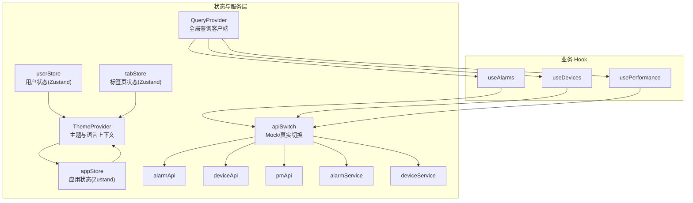
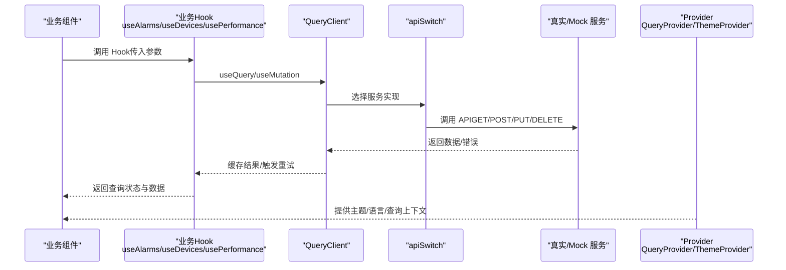
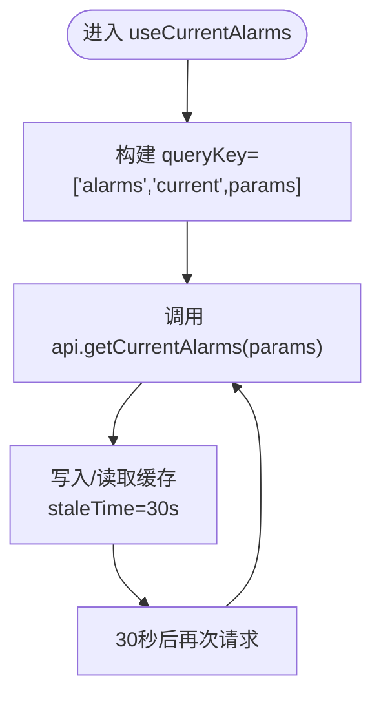
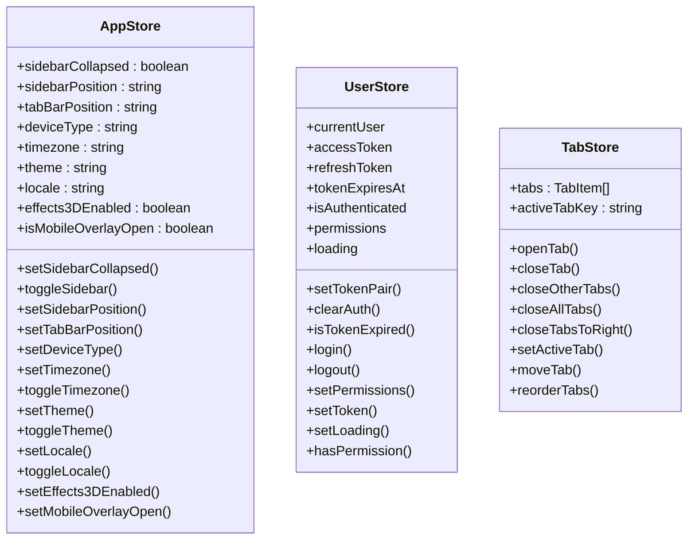
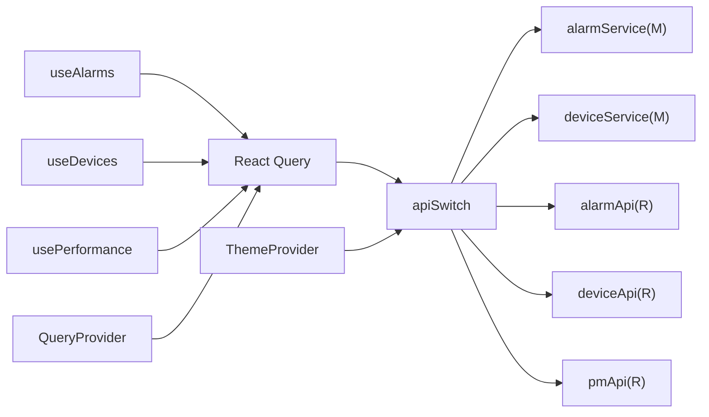

# 状态管理

<cite>
**本文引用的文件**
- [useAlarms.ts](file://omcmb/webcode/src/hooks/api/useAlarms.ts)
- [useDevices.ts](file://omcmb/webcode/src/hooks/api/useDevices.ts)
- [usePerformance.ts](file://omcmb/webcode/src/hooks/api/usePerformance.ts)
- [QueryProvider.tsx](file://omcmb/webcode/src/providers/QueryProvider.tsx)
- [ThemeProvider.tsx](file://omcmb/webcode/src/providers/ThemeProvider.tsx)
- [appStore.ts](file://omcmb/webcode/src/store/appStore.ts)
- [userStore.ts](file://omcmb/webcode/src/store/userStore.ts)
- [tabStore.ts](file://omcmb/webcode/src/store/tabStore.ts)
- [index.ts](file://omcmb/webcode/src/store/index.ts)
- [useThemeToken.ts](file://omcmb/webcode/src/hooks/useThemeToken.ts)
- [useResponsive.ts](file://omcmb/webcode/src/hooks/useResponsive.ts)
- [apiSwitch.ts](file://omcmb/webcode/src/services/apiSwitch.ts)
- [alarmApi.ts](file://omcmb/webcode/src/services/api/alarmApi.ts)
- [deviceApi.ts](file://omcmb/webcode/src/services/api/deviceApi.ts)
- [pmApi.ts](file://omcmb/webcode/src/services/api/pmApi.ts)
- [alarmService.ts](file://omcmb/webcode/src/mock/services/alarmService.ts)
- [deviceService.ts](file://omcmb/webcode/src/mock/services/deviceService.ts)
- [common.ts](file://omcmb/webcode/src/types/common.ts)
</cite>

## 目录
1. [简介](#简介)
2. [项目结构](#项目结构)
3. [核心组件](#核心组件)
4. [架构总览](#架构总览)
5. [详细组件分析](#详细组件分析)
6. [依赖关系分析](#依赖关系分析)
7. [性能考量](#性能考量)
8. [故障排查指南](#故障排查指南)
9. [结论](#结论)
10. [附录](#附录)

## 简介
本文件面向 Baicells OMC 前端的状态管理，系统性阐述 React 状态管理策略与实现，覆盖以下方面：
- React Hooks 使用与自定义 Hook 设计：useAlarms、useDevices、usePerformance 等业务 Hook 的职责、参数、返回值与使用方式
- Context 共享与 Provider 架构：QueryClientProvider、ThemeProvider 的作用与协作
- 本地状态管理：Zustand Store（应用、用户、标签页）的持久化与迁移策略
- API 服务层：RESTful 接口封装、数据映射、Mock 切换、错误处理与重试策略
- 状态持久化与同步：用户偏好、页面状态、实时数据更新
- 主题状态管理：主题切换、颜色变量、暗色模式感知、响应式断点
- 最佳实践：状态设计原则、性能优化、内存管理
- 调试与监控：查询缓存调试、主题切换调试、响应式断点调试

## 项目结构
前端状态管理相关代码主要分布在以下目录与文件：
- hooks/api：业务 Hook（useAlarms、useDevices、usePerformance 等），统一使用 React Query
- providers：QueryProvider、ThemeProvider，提供全局上下文
- store：Zustand 状态存储（appStore、userStore、tabStore）
- services/api：真实 API 服务封装（alarmApi、deviceApi、pmApi）
- mock/services：Mock 数据服务（alarmService、deviceService）
- services/apiSwitch.ts：Mock/真实 API 切换机制
- hooks：通用 Hook（useThemeToken、useResponsive）

图表来源
- [QueryProvider.tsx:1-37](file://omcmb/webcode/src/providers/QueryProvider.tsx#L1-L37)
- [ThemeProvider.tsx:1-68](file://omcmb/webcode/src/providers/ThemeProvider.tsx#L1-L68)
- [useAlarms.ts:1-108](file://omcmb/webcode/src/hooks/api/useAlarms.ts#L1-L108)
- [useDevices.ts:1-88](file://omcmb/webcode/src/hooks/api/useDevices.ts#L1-L88)
- [usePerformance.ts:1-143](file://omcmb/webcode/src/hooks/api/usePerformance.ts#L1-L143)
- [apiSwitch.ts:1-24](file://omcmb/webcode/src/services/apiSwitch.ts#L1-L24)
- [alarmApi.ts:1-316](file://omcmb/webcode/src/services/api/alarmApi.ts#L1-L316)
- [deviceApi.ts:1-427](file://omcmb/webcode/src/services/api/deviceApi.ts#L1-L427)
- [pmApi.ts:1-393](file://omcmb/webcode/src/services/api/pmApi.ts#L1-L393)
- [alarmService.ts:1-195](file://omcmb/webcode/src/mock/services/alarmService.ts#L1-L195)
- [deviceService.ts:1-128](file://omcmb/webcode/src/mock/services/deviceService.ts#L1-L128)

章节来源
- [QueryProvider.tsx:1-37](file://omcmb/webcode/src/providers/QueryProvider.tsx#L1-L37)
- [ThemeProvider.tsx:1-68](file://omcmb/webcode/src/providers/ThemeProvider.tsx#L1-L68)
- [useAlarms.ts:1-108](file://omcmb/webcode/src/hooks/api/useAlarms.ts#L1-L108)
- [useDevices.ts:1-88](file://omcmb/webcode/src/hooks/api/useDevices.ts#L1-L88)
- [usePerformance.ts:1-143](file://omcmb/webcode/src/hooks/api/usePerformance.ts#L1-L143)
- [apiSwitch.ts:1-24](file://omcmb/webcode/src/services/apiSwitch.ts#L1-L24)

## 核心组件
- React Query Provider：集中配置查询缓存策略（staleTime、retry、refetchOnWindowFocus），为所有业务 Hook 提供统一缓存与重试能力
- ThemeProvider：将应用主题与语言注入 Ant Design ConfigProvider，并通过 useLayoutEffect 在首帧前设置 data-theme 属性，确保 CSS 变量与主题一致
- Zustand Stores：appStore（应用布局与偏好）、userStore（认证与权限）、tabStore（标签页集合与激活状态）
- 自定义业务 Hook：useAlarms、useDevices、usePerformance，封装查询与变更操作，统一使用 queryClient.invalidateQueries 进行缓存失效与同步
- Mock/真实 API 切换：通过环境变量控制，业务 Hook 内部自动选择 mock 或真实服务

章节来源
- [QueryProvider.tsx:14-25](file://omcmb/webcode/src/providers/QueryProvider.tsx#L14-L25)
- [ThemeProvider.tsx:44-67](file://omcmb/webcode/src/providers/ThemeProvider.tsx#L44-L67)
- [appStore.ts:45-108](file://omcmb/webcode/src/store/appStore.ts#L45-L108)
- [userStore.ts:45-121](file://omcmb/webcode/src/store/userStore.ts#L45-L121)
- [tabStore.ts:32-112](file://omcmb/webcode/src/store/tabStore.ts#L32-L112)
- [useAlarms.ts:10-108](file://omcmb/webcode/src/hooks/api/useAlarms.ts#L10-L108)
- [useDevices.ts:10-88](file://omcmb/webcode/src/hooks/api/useDevices.ts#L10-L88)
- [usePerformance.ts:8-143](file://omcmb/webcode/src/hooks/api/usePerformance.ts#L8-L143)
- [apiSwitch.ts:15-24](file://omcmb/webcode/src/services/apiSwitch.ts#L15-L24)

## 架构总览
下图展示状态管理的整体交互：业务组件通过自定义 Hook 发起查询或变更；Hook 使用 React Query 管理缓存与重试；通过 apiSwitch 选择真实或 Mock 服务；服务层负责 HTTP 请求与数据映射；Zustand Store 管理应用级本地状态；ThemeProvider 与 QueryProvider 提供上下文。

图表来源
- [useAlarms.ts:10-108](file://omcmb/webcode/src/hooks/api/useAlarms.ts#L10-L108)
- [useDevices.ts:10-88](file://omcmb/webcode/src/hooks/api/useDevices.ts#L10-L88)
- [usePerformance.ts:8-143](file://omcmb/webcode/src/hooks/api/usePerformance.ts#L8-L143)
- [QueryProvider.tsx:30-34](file://omcmb/webcode/src/providers/QueryProvider.tsx#L30-L34)
- [ThemeProvider.tsx:44-67](file://omcmb/webcode/src/providers/ThemeProvider.tsx#L44-L67)
- [apiSwitch.ts:21-23](file://omcmb/webcode/src/services/apiSwitch.ts#L21-L23)

## 详细组件分析

### React Query Provider 与缓存策略
- 默认配置
  - 查询缓存新鲜度：staleTime 30 秒
  - 失败重试：queries 2 次，mutations 0 次
  - 窗口焦点重取：关闭，避免标签切换导致意外刷新
- 作用范围：为所有 useQuery/useMutation 提供统一行为，减少重复配置

章节来源
- [QueryProvider.tsx:14-25](file://omcmb/webcode/src/providers/QueryProvider.tsx#L14-L25)

### 自定义 Hook：useAlarms（告警）
- 查询类
  - 当前告警列表：定时轮询（30 秒）
  - 历史告警列表：一次性查询
  - 告警列表（含活跃状态开关）：根据 isActive 控制是否轮询
  - 按 ID 获取详情：按需启用
  - 告警数量统计：定时轮询（15 秒）
  - 告警规则列表：一次性查询
- 变更类
  - 确认告警：批量确认后失效化 ['alarms'] 缓存
  - 清除告警：批量清除后失效化 ['alarms'] 缓存
  - 创建/更新/删除规则：变更后失效化 ['alarms', 'rules'] 缓存
- 关键点
  - queryKey 包含参数，保证缓存键唯一性
  - enabled 控制按需查询（如 id 为空时禁用详情查询）
  - refetchInterval 控制轮询频率

图表来源
- [useAlarms.ts:10-16](file://omcmb/webcode/src/hooks/api/useAlarms.ts#L10-L16)

章节来源
- [useAlarms.ts:10-108](file://omcmb/webcode/src/hooks/api/useAlarms.ts#L10-L108)

### 自定义 Hook：useDevices（设备）
- 查询类
  - 设备列表：一次性查询
  - 按 ID 获取详情：按需启用
  - 按 SN 获取详情：按需启用
  - 设备分组：带缓存（staleTime 5 分钟）
  - NE 列表与按 SN 查询：一次性查询
- 变更类
  - 新增设备：成功后失效化 ['devices'] 缓存
  - 更新设备：成功后失效化 ['devices','detail',id] 与 ['devices','list']
  - 删除设备：成功后失效化 ['devices','list']

章节来源
- [useDevices.ts:10-88](file://omcmb/webcode/src/hooks/api/useDevices.ts#L10-L88)

### 自定义 Hook：usePerformance（性能）
- 查询类
  - KPI 列表：一次性查询（staleTime 5 分钟）
  - 所有 KPI：一次性查询（staleTime 10 分钟）
  - 计数器列表：一次性查询（staleTime 5 分钟）
  - 测量记录：一次性查询
  - 单个 KPI 时间序列：按需启用（enabled 由 kpiCode 决定）
  - 多 KPI 时间序列：按需启用（enabled 由 kpiCodes 非空决定）
  - 门限列表：一次性查询
  - 性能任务列表：一次性查询
  - 聚合计数器：一次性查询（staleTime 5 分钟）
  - 计算 KPI：一次性调用
- 变更类
  - 创建/更新/删除门限：变更后失效化 ['performance','thresholds'] 缓存
  - 创建性能任务：变更后失效化 ['performance','tasks'] 缓存

章节来源
- [usePerformance.ts:8-143](file://omcmb/webcode/src/hooks/api/usePerformance.ts#L8-L143)

### API 服务层设计
- alarmApi：封装告警相关 REST 接口，包含当前/历史告警列表、按 ID 查询、确认/清除、统计、规则 CRUD 等；内置后端模型到前端模型映射与查询参数转换
- deviceApi：封装设备相关 REST 接口，包含列表、详情、创建/更新/删除、分组、NE 列表、参数、重启等；内置后端模型到前端模型映射与查询参数转换
- pmApi：封装性能相关 REST 接口，包含 KPI 定义、计数器、KPI 时间序列、门限 CRUD、聚合计数器、KPI 计算、任务 CRUD 等；内置后端模型到前端模型映射与查询参数转换
- 错误处理：各服务在异常时返回空值或抛出错误，由上层 Hook 或组件捕获处理
- 重试策略：由 QueryProvider 默认配置生效

章节来源
- [alarmApi.ts:157-315](file://omcmb/webcode/src/services/api/alarmApi.ts#L157-L315)
- [deviceApi.ts:276-426](file://omcmb/webcode/src/services/api/deviceApi.ts#L276-L426)
- [pmApi.ts:197-392](file://omcmb/webcode/src/services/api/pmApi.ts#L197-L392)

### Mock/真实 API 切换机制
- 控制方式：VITE_USE_MOCK 环境变量
  - true：使用 mock 服务（本地数据，无需后端）
  - false：使用真实 API 服务（需要后端运行）
- 使用方式：在业务 Hook 中通过 createApiSwitch 选择具体实现

章节来源
- [apiSwitch.ts:15-24](file://omcmb/webcode/src/services/apiSwitch.ts#L15-L24)
- [useAlarms.ts:8-8](file://omcmb/webcode/src/hooks/api/useAlarms.ts#L8-L8)
- [useDevices.ts:8-8](file://omcmb/webcode/src/hooks/api/useDevices.ts#L8-L8)
- [usePerformance.ts:6-6](file://omcmb/webcode/src/hooks/api/usePerformance.ts#L6-L6)

### 本地状态管理（Zustand）
- appStore：应用布局与偏好（侧边栏折叠/位置、标签栏位置、设备类型、时区、主题、语言、3D 效果开关、移动端抽屉可见性），支持持久化与迁移
- userStore：用户认证与权限（当前用户、访问令牌、刷新令牌、过期时间、是否认证、权限列表、加载状态），支持持久化
- tabStore：标签页集合与激活状态（最大 10 个标签，关闭右侧/其他/全部，移动与重排），使用 sessionStorage 持久化

图表来源
- [appStore.ts:18-108](file://omcmb/webcode/src/store/appStore.ts#L18-L108)
- [userStore.ts:17-121](file://omcmb/webcode/src/store/userStore.ts#L17-L121)
- [tabStore.ts:9-112](file://omcmb/webcode/src/store/tabStore.ts#L9-L112)

章节来源
- [appStore.ts:45-108](file://omcmb/webcode/src/store/appStore.ts#L45-L108)
- [userStore.ts:45-121](file://omcmb/webcode/src/store/userStore.ts#L45-L121)
- [tabStore.ts:32-112](file://omcmb/webcode/src/store/tabStore.ts#L32-L112)
- [index.ts:1-15](file://omcmb/webcode/src/store/index.ts#L1-L15)

### 主题状态管理
- ThemeProvider：从 appStore 读取 theme 与 locale，设置 <html> 的 data-theme 属性与 colorScheme，使用 useMemo 保持对象引用稳定，避免无谓重渲染
- useThemeToken：导出 useToken 与 useIsDark，便于组件感知当前主题是否为深色变体（tech/cyberpunk）

章节来源
- [ThemeProvider.tsx:44-67](file://omcmb/webcode/src/providers/ThemeProvider.tsx#L44-L67)
- [useThemeToken.ts:9-22](file://omcmb/webcode/src/hooks/useThemeToken.ts#L9-L22)
- [common.ts:6-6](file://omcmb/webcode/src/types/common.ts#L6-L6)

### 响应式状态管理
- useResponsive：基于 matchMedia 的响应式断点 Hook，返回 { breakpoint, isMobile, isTablet, isDesktop }，使用 useSyncExternalStore 订阅断点变化，避免频繁 resize 导致的性能问题

章节来源
- [useResponsive.ts:89-93](file://omcmb/webcode/src/hooks/useResponsive.ts#L89-L93)

## 依赖关系分析
- 业务 Hook 依赖 React Query（useQuery/useMutation/useQueryClient）与 apiSwitch
- apiSwitch 依赖环境变量 VITE_USE_MOCK，动态返回 mock 或真实服务
- 真实服务依赖 http 工具（未在本文展开），负责统一的 HTTP 请求封装
- Provider 层为业务组件提供上下文，Theme 与 Query 的组合确保主题与缓存策略的一致性
- Zustand Store 作为本地状态源，与 Provider 解耦，避免跨层级传递

图表来源
- [useAlarms.ts:1-10](file://omcmb/webcode/src/hooks/api/useAlarms.ts#L1-L10)
- [useDevices.ts:1-10](file://omcmb/webcode/src/hooks/api/useDevices.ts#L1-L10)
- [usePerformance.ts:1-10](file://omcmb/webcode/src/hooks/api/usePerformance.ts#L1-L10)
- [apiSwitch.ts:15-24](file://omcmb/webcode/src/services/apiSwitch.ts#L15-L24)
- [alarmService.ts:1-5](file://omcmb/webcode/src/mock/services/alarmService.ts#L1-L5)
- [deviceService.ts:1-5](file://omcmb/webcode/src/mock/services/deviceService.ts#L1-L5)
- [alarmApi.ts:1-5](file://omcmb/webcode/src/services/api/alarmApi.ts#L1-L5)
- [deviceApi.ts:1-5](file://omcmb/webcode/src/services/api/deviceApi.ts#L1-L5)
- [pmApi.ts:1-5](file://omcmb/webcode/src/services/api/pmApi.ts#L1-L5)
- [QueryProvider.tsx:1-10](file://omcmb/webcode/src/providers/QueryProvider.tsx#L1-L10)
- [ThemeProvider.tsx:1-16](file://omcmb/webcode/src/providers/ThemeProvider.tsx#L1-L16)

## 性能考量
- 查询缓存与新鲜度
  - 通过 staleTime 控制缓存新鲜度，避免频繁网络请求
  - 对高频更新的数据（如告警）设置较短 staleTime 或轮询间隔
- 重试与退避
  - queries 默认重试 2 次，降低瞬时失败影响
  - mutations 不重试，避免副作用重复执行
- 按需启用与懒加载
  - enabled 控制查询开启时机，避免无效请求
  - useMock 条件分支仅在必要时引入 mock 服务
- 事件监听与订阅
  - useResponsive 使用 matchMedia 事件，避免 resize 回流
- 本地状态持久化
  - appStore 与 userStore 使用持久化中间件，减少重复初始化
  - tabStore 使用 sessionStorage，避免跨标签页污染

## 故障排查指南
- 查询缓存调试
  - 使用 React Query Devtools 查看 queryKey、状态、缓存命中情况
  - 检查 staleTime 与 refetchInterval 是否符合预期
- 主题切换调试
  - 检查 <html> 上的 data-theme 属性是否随主题变化
  - 确认 colorScheme 是否正确设置（light/dark）
- 响应式断点调试
  - 在不同窗口尺寸下观察 useResponsive 返回值
  - 确认 matchMedia 事件是否正确触发
- Mock/真实切换
  - 设置 VITE_USE_MOCK=true/false 验证业务 Hook 是否正确切换
  - 检查 mock 服务返回数据格式与真实 API 是否一致
- 缓存失效与同步
  - 变更操作完成后检查 queryClient.invalidateQueries 是否被调用
  - 确认 queryKey 与失效范围一致

## 结论
本状态管理方案通过 React Query 实现高效的数据获取与缓存，结合 Zustand 管理应用级本地状态，配合 Provider 提供统一的主题与语言上下文。业务 Hook 将查询与变更抽象为可复用的接口，Mock/真实切换机制提升开发与测试效率。整体设计兼顾性能、可维护性与可扩展性，适合大规模前端工程的状态治理。

## 附录
- 状态导出入口：store/index.ts 汇总导出各 Store Hook 类型与实例，便于统一导入与使用
- 类型定义：common.ts 定义主题、语言、断点等通用类型，确保状态与 UI 的一致性

章节来源
- [index.ts:1-15](file://omcmb/webcode/src/store/index.ts#L1-L15)
- [common.ts:1-40](file://omcmb/webcode/src/types/common.ts#L1-L40)