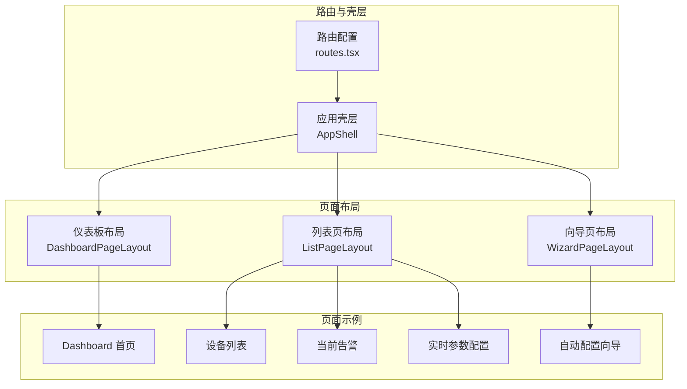
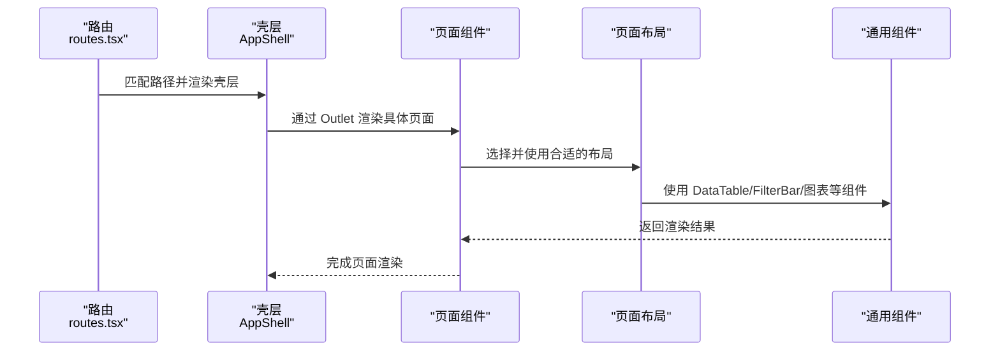
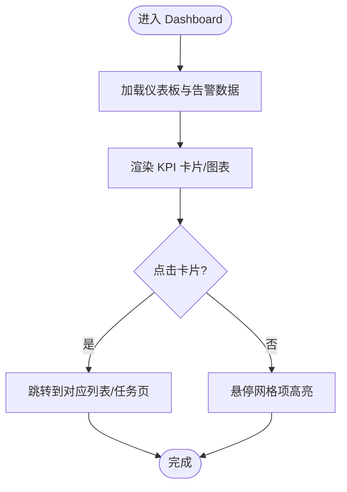
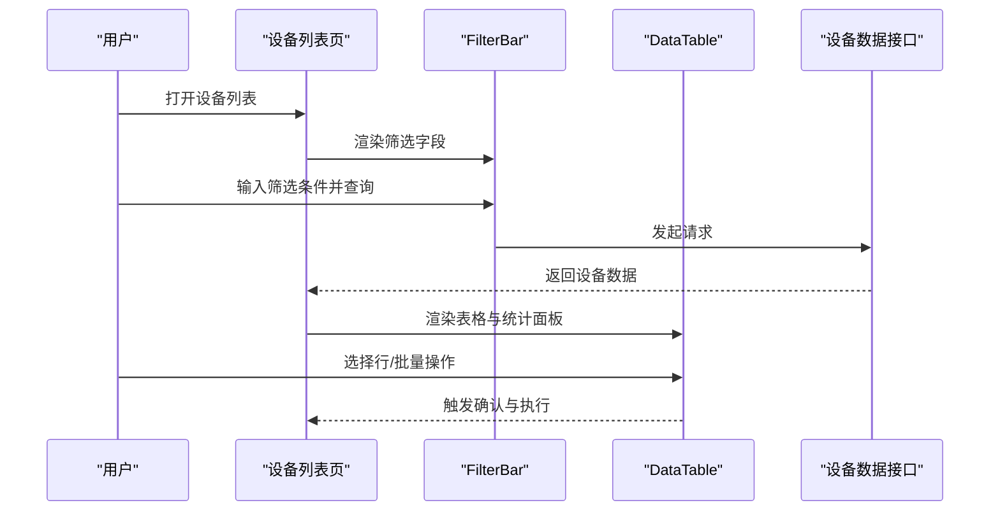
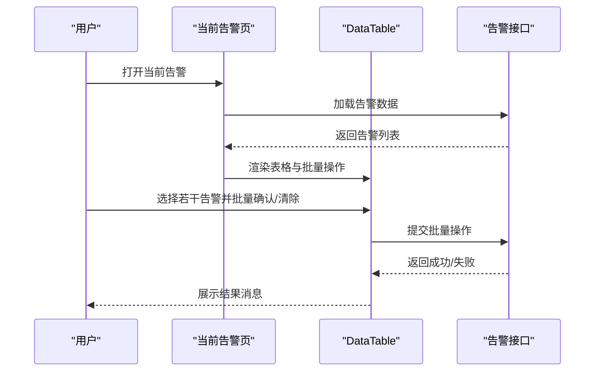
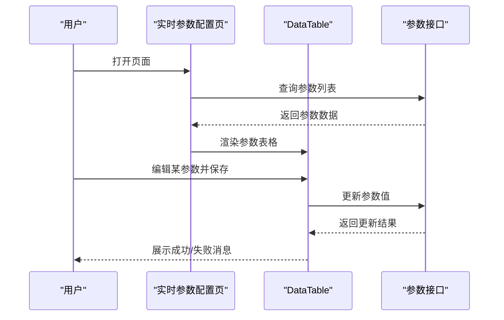
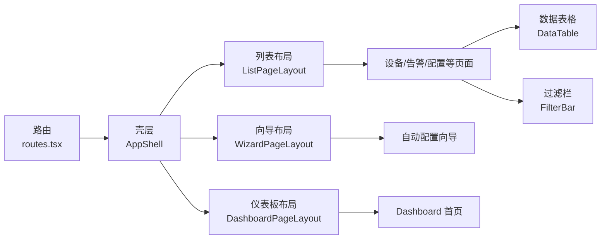

# 页面设计

<cite>
**本文引用的文件**
- [routes.tsx](file://omcmb/webcode/src/router/routes.tsx)
- [index.tsx](file://omcmb/webcode/src/components/Layout/index.tsx)
- [ListPageLayout.tsx](file://omcmb/webcode/src/components/Layout/ListPageLayout.tsx)
- [WizardPageLayout.tsx](file://omcmb/webcode/src/components/Layout/WizardPageLayout.tsx)
- [DashboardPageLayout.tsx](file://omcmb/webcode/src/components/Layout/DashboardPageLayout.tsx)
- [index.tsx](file://omcmb/webcode/src/pages/dashboard/index.tsx)
- [index.tsx](file://omcmb/webcode/src/pages/alarm/CurrentAlarms/index.tsx)
- [index.tsx](file://omcmb/webcode/src/pages/device/DeviceList/index.tsx)
- [index.tsx](file://omcmb/webcode/src/pages/config/LiveParamConfig/index.tsx)
- [index.tsx](file://omcmb/webcode/src/pages/config/AutoProvisioning/index.tsx)
- [index.tsx](file://omcmb/webcode/src/components/DataTable/index.tsx)
- [index.tsx](file://omcmb/webcode/src/components/FilterBar/index.tsx)
- [BarChart.tsx](file://omcmb/webcode/src/components/Charts/BarChart.tsx)
</cite>

## 目录
1. [简介](#简介)
2. [项目结构](#项目结构)
3. [核心组件](#核心组件)
4. [架构总览](#架构总览)
5. [详细组件分析](#详细组件分析)
6. [依赖关系分析](#依赖关系分析)
7. [性能考虑](#性能考虑)
8. [故障排查指南](#故障排查指南)
9. [结论](#结论)
10. [附录](#附录)

## 简介
本文件面向 Baicells OMC 页面设计，系统性梳理前端页面布局体系、页面类型与交互模式，并结合实际页面示例说明设计理念与实现方式。重点覆盖以下方面：
- 页面布局系统：ListPageLayout、WizardPageLayout、DashboardPageLayout 的特点与适用场景
- 页面类型：Dashboard 首页、设备管理、性能管理、告警管理、配置管理、系统管理等
- 组件交互：数据表格、图表展示、表单配置、操作按钮等
- 状态管理：数据加载、错误处理、加载状态、空状态等用户体验设计
- 开发指南：路由配置、权限控制、数据获取、状态同步等实现细节
- 性能优化与体验提升最佳实践

## 项目结构
OMC 前端采用基于 React + Ant Design 的单页应用架构，页面通过路由进行组织，布局通过 AppShell 与多种 PageLayout 组合实现。页面按功能域划分在 pages 下的子目录中，布局与通用组件集中在 components 中。

图示来源
- [routes.tsx:166-314](file://omcmb/webcode/src/router/routes.tsx#L166-L314)
- [index.tsx:15-114](file://omcmb/webcode/src/components/Layout/index.tsx#L15-L114)
- [ListPageLayout.tsx:21-59](file://omcmb/webcode/src/components/Layout/ListPageLayout.tsx#L21-L59)
- [WizardPageLayout.tsx:28-115](file://omcmb/webcode/src/components/Layout/WizardPageLayout.tsx#L28-L115)
- [DashboardPageLayout.tsx:18-41](file://omcmb/webcode/src/components/Layout/DashboardPageLayout.tsx#L18-L41)

章节来源
- [routes.tsx:1-314](file://omcmb/webcode/src/router/routes.tsx#L1-L314)
- [index.tsx:1-114](file://omcmb/webcode/src/components/Layout/index.tsx#L1-L114)

## 核心组件
本节聚焦页面布局与通用组件，说明其职责、特性与典型使用方式。

- 应用壳层 AppShell
  - 负责头部、侧边栏、页签、内容区域与任务面板的整体布局与响应式行为
  - 控制侧边栏折叠、移动端抽屉、3D 效果开关等全局状态
  - 通过 Outlet 渲染当前路由页面

- 列表页布局 ListPageLayout
  - 适用于“标题 + 工具栏 + 表格”的列表/表格类页面
  - 支持可选标题、副标题与右上角扩展区（如批量操作按钮）

- 向导页布局 WizardPageLayout
  - 左侧垂直步骤条 + 右侧内容区 + 底部导航
  - 适合多步骤配置流程，如自动配置向导

- 仪表板布局 DashboardPageLayout
  - 使用 CSS Grid 自适应列宽，适合卡片/图表网格布局
  - 根据屏幕尺寸调整最小列宽与间距

- 数据表格 DataTable
  - 封装 Ant Design Table，提供列排序、筛选、密度切换、列可见性、复制、分页等能力
  - 支持批量操作、告警行样式、可展开行等高级特性

- 过滤栏 FilterBar
  - 提供多种输入控件（单选、多选、日期范围、树选择、数字等）
  - 支持折叠/展开、会话存储、重置与查询

章节来源
- [index.tsx:15-114](file://omcmb/webcode/src/components/Layout/index.tsx#L15-L114)
- [ListPageLayout.tsx:14-60](file://omcmb/webcode/src/components/Layout/ListPageLayout.tsx#L14-L60)
- [WizardPageLayout.tsx:23-115](file://omcmb/webcode/src/components/Layout/WizardPageLayout.tsx#L23-L115)
- [DashboardPageLayout.tsx:12-41](file://omcmb/webcode/src/components/Layout/DashboardPageLayout.tsx#L12-L41)
- [index.tsx:75-311](file://omcmb/webcode/src/components/DataTable/index.tsx#L75-L311)
- [index.tsx:44-215](file://omcmb/webcode/src/components/FilterBar/index.tsx#L44-L215)

## 架构总览
下图展示从路由到页面再到布局与组件的调用关系，体现 OMV 页面的分层与解耦：

图示来源
- [routes.tsx:166-314](file://omcmb/webcode/src/router/routes.tsx#L166-L314)
- [index.tsx:86-92](file://omcmb/webcode/src/components/Layout/index.tsx#L86-L92)
- [index.tsx:779-833](file://omcmb/webcode/src/pages/device/DeviceList/index.tsx#L779-L833)

## 详细组件分析

### Dashboard 首页
- 设计理念
  - 以卡片与图表为核心的信息中枢，提供设备总数、在线率、活动告警、运行任务等关键指标
  - 采用倾斜卡片与主题色增强视觉层次，支持快速浏览与跳转
- 实现要点
  - 使用 DashboardPageLayout 实现自适应网格布局
  - 图表组件包括柱状图、折线图、饼图与 GIS 地图
  - 通过 Hook 获取仪表板与告警统计数据，支持本地化文案与主题色
- 交互设计
  - 指标卡片点击跳转至相应列表或任务页
  - 最近告警列表支持点击跳转到告警页
  - 快速入口网格支持悬停高亮与点击跳转

图示来源
- [index.tsx:80-506](file://omcmb/webcode/src/pages/dashboard/index.tsx#L80-L506)
- [DashboardPageLayout.tsx:18-41](file://omcmb/webcode/src/components/Layout/DashboardPageLayout.tsx#L18-L41)
- [BarChart.tsx:25-110](file://omcmb/webcode/src/components/Charts/BarChart.tsx#L25-L110)

章节来源
- [index.tsx:1-506](file://omcmb/webcode/src/pages/dashboard/index.tsx#L1-L506)

### 设备管理页面族
- 设备列表（DeviceList）
  - 设计理念：提供设备全量视图，支持复杂筛选、统计面板、批量操作与多小区状态可视化
  - 实现要点：使用 ListPageLayout + DataTable + FilterBar；支持列分组、多小区状态 Popover、Remark 列别名编辑
  - 交互设计：批量同步、重启、日志采集、配置重置等操作均通过确认对话框执行
- 设备详情（DeviceDetail）
  - 设计理念：以标签页形式组织设备信息、参数、告警、性能、日志等
  - 实现要点：结合 ListPageLayout 与详情页布局，配合状态指示器与链接跳转
- 在线监控、网管、资源统计等
  - 设计理念：围绕设备生命周期与运维视角提供专项页面
  - 实现要点：统一使用 ListPageLayout 与通用组件，保持一致的交互与视觉语言

图示来源
- [index.tsx:38-833](file://omcmb/webcode/src/pages/device/DeviceList/index.tsx#L38-L833)
- [index.tsx:44-215](file://omcmb/webcode/src/components/FilterBar/index.tsx#L44-L215)
- [index.tsx:75-311](file://omcmb/webcode/src/components/DataTable/index.tsx#L75-L311)

章节来源
- [index.tsx:1-833](file://omcmb/webcode/src/pages/device/DeviceList/index.tsx#L1-L833)

### 告警管理页面族
- 当前告警（CurrentAlarms）
  - 设计理念：集中展示未确认告警，支持批量确认与清除
  - 实现要点：使用 ListPageLayout + DataTable；告警严重级别映射为颜色标签；支持按时间区间筛选
  - 交互设计：未确认数量实时提示；批量操作通过确认对话框执行
- 历史告警、统计、规则、库、同步等
  - 设计理念：覆盖告警全生命周期管理
  - 实现要点：统一布局与组件，保持一致的筛选、分页与操作体验

图示来源
- [index.tsx:43-335](file://omcmb/webcode/src/pages/alarm/CurrentAlarms/index.tsx#L43-L335)
- [index.tsx:75-311](file://omcmb/webcode/src/components/DataTable/index.tsx#L75-L311)

章节来源
- [index.tsx:1-335](file://omcmb/webcode/src/pages/alarm/CurrentAlarms/index.tsx#L1-L335)

### 配置管理页面族
- 实时参数配置（LiveParamConfig）
  - 设计理念：在线编辑设备参数，支持修改与恢复默认值
  - 实现要点：使用 ListPageLayout + DataTable；参数状态以标签展示；支持按设备 SN、参数路径、状态筛选
  - 交互设计：行内编辑、保存与取消；恢复默认值通过二次确认
- 自动配置向导（AutoProvisioning）
  - 设计理念：多步骤任务流，支持进度展示、重试与查看详情
  - 实现要点：使用 WizardPageLayout；左侧步骤条 + 右侧内容 + 底部导航
  - 交互设计：创建任务、查看详情、失败重试等

图示来源
- [index.tsx:30-195](file://omcmb/webcode/src/pages/config/LiveParamConfig/index.tsx#L30-L195)
- [index.tsx:75-311](file://omcmb/webcode/src/components/DataTable/index.tsx#L75-L311)

章节来源
- [index.tsx:1-195](file://omcmb/webcode/src/pages/config/LiveParamConfig/index.tsx#L1-L195)
- [index.tsx:37-314](file://omcmb/webcode/src/pages/config/AutoProvisioning/index.tsx#L37-L314)

### 性能管理页面族
- KPI 报表、性能图表、阈值配置、性能文件、任务配置等
  - 设计理念：围绕性能数据的采集、分析与治理
  - 实现要点：统一使用 ListPageLayout 与图表组件；支持筛选、导出与任务跟踪

章节来源
- [routes.tsx:56-64](file://omcmb/webcode/src/router/routes.tsx#L56-L64)

### 系统管理页面族
- 设备分类、用户管理、角色权限、操作日志、系统配置、数据字典、通知设置、系统仪表板等
  - 设计理念：支撑 OMC 平台运行与运维的后台管理能力
  - 实现要点：统一布局与组件，强调安全与审计

章节来源
- [routes.tsx:108-117](file://omcmb/webcode/src/router/routes.tsx#L108-L117)

## 依赖关系分析
- 路由到页面
  - routes.tsx 定义了所有页面的懒加载与私有路由包装，确保登录态与错误边界
- 壳层到布局
  - AppShell 负责全局布局与状态，页面通过 ListPageLayout/WizardPageLayout/DashboardPageLayout 选择性组合
- 页面到组件
  - 页面普遍依赖 DataTable、FilterBar、图表组件等通用组件，形成高复用的交互与视觉基线

图示来源
- [routes.tsx:166-314](file://omcmb/webcode/src/router/routes.tsx#L166-L314)
- [index.tsx:15-114](file://omcmb/webcode/src/components/Layout/index.tsx#L15-L114)
- [ListPageLayout.tsx:21-59](file://omcmb/webcode/src/components/Layout/ListPageLayout.tsx#L21-L59)
- [WizardPageLayout.tsx:28-115](file://omcmb/webcode/src/components/Layout/WizardPageLayout.tsx#L28-L115)
- [DashboardPageLayout.tsx:18-41](file://omcmb/webcode/src/components/Layout/DashboardPageLayout.tsx#L18-L41)
- [index.tsx:75-311](file://omcmb/webcode/src/components/DataTable/index.tsx#L75-L311)
- [index.tsx:44-215](file://omcmb/webcode/src/components/FilterBar/index.tsx#L44-L215)

章节来源
- [routes.tsx:1-314](file://omcmb/webcode/src/router/routes.tsx#L1-L314)
- [index.tsx:1-114](file://omcmb/webcode/src/components/Layout/index.tsx#L1-L114)

## 性能考虑
- 路由懒加载与骨架屏
  - 通过 React.lazy 与 Suspense 对页面进行懒加载，减少首屏体积
  - 使用 Spin 作为加载占位，提升感知速度
- 表格性能
  - DataTable 默认紧凑密度，支持横向滚动与虚拟化友好配置
  - 列过滤与排序在客户端进行，建议配合服务端分页与筛选以降低数据量
- 图表性能
  - ECharts 渲染器使用 canvas，适合大数据量场景
  - 主题与暗色模式切换时避免重复计算，尽量缓存 palette 与 baseOption
- 响应式与移动端
  - AppShell 根据设备类型自动折叠侧边栏与禁用 3D 效果，减少不必要的渲染
  - DashboardPageLayout 的网格列宽与间距随屏幕尺寸自适应

## 故障排查指南
- 页面空白或长时间加载
  - 检查路由懒加载是否正确，确认 Suspense fallback 是否正常显示
  - 检查网络请求与接口返回，确认数据钩子是否抛错
- 表格无数据或筛选无效
  - 确认 DataSource 与列定义是否正确，检查列过滤逻辑与隐藏列配置
  - 确认分页参数与 total 是否同步
- 布局错位或侧边栏遮挡
  - 检查 AppShell 的 sidebarWidth 计算与 CSS 变量
  - 移动端抽屉是否意外开启或键盘事件未正确移除
- 图表不显示或渲染异常
  - 检查 ECharts option 的 xAxis/yAxis 与 series 配置
  - 确认容器高度与宽度设置，避免 0 值导致渲染失败

章节来源
- [routes.tsx:147-161](file://omcmb/webcode/src/router/routes.tsx#L147-L161)
- [index.tsx:146-157](file://omcmb/webcode/src/components/DataTable/index.tsx#L146-L157)
- [index.tsx:36-58](file://omcmb/webcode/src/components/Layout/index.tsx#L36-L58)
- [BarChart.tsx:38-98](file://omcmb/webcode/src/components/Charts/BarChart.tsx#L38-L98)

## 结论
OMC 页面设计以“布局即契约、组件即标准”为核心，通过 AppShell 与多种 PageLayout 组合，实现跨模块一致的交互与视觉体验。页面族围绕设备、告警、配置、性能、系统等维度构建，通用组件（DataTable、FilterBar、图表）提供强大的数据承载与交互能力。建议在后续开发中持续完善：
- 服务端分页与筛选，降低前端压力
- 统一错误边界与加载策略，提升稳定性
- 丰富主题与无障碍能力，提升可访问性

## 附录
- 页面路由配置要点
  - 使用 React.lazy 与 Suspense 包裹页面组件
  - 使用 ErrorBoundary 包裹 Suspense，捕获渲染错误
  - 子路由统一挂载在 AppShell 下，根路径重定向到 dashboard
- 权限控制
  - 使用 PrivateRoute 包裹需要登录的页面
  - 结合用户状态与菜单权限，动态生成路由与菜单
- 数据获取与状态同步
  - 使用 QueryClient 管理请求缓存与失效
  - 通过 onRefresh、onPageChange 等回调保持 UI 与数据同步
- 交互与可用性
  - 批量操作统一使用确认对话框
  - 支持列可见性、列顺序、密度切换等个性化配置
  - 为关键操作提供快捷键与键盘导航支持