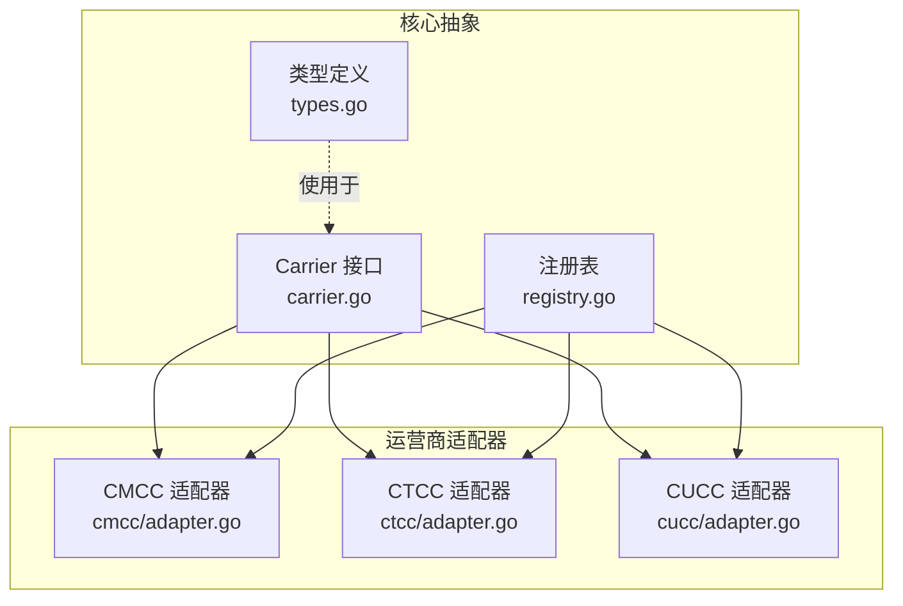
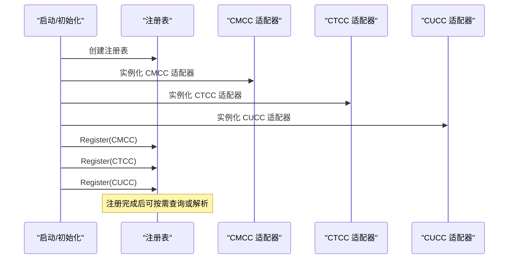
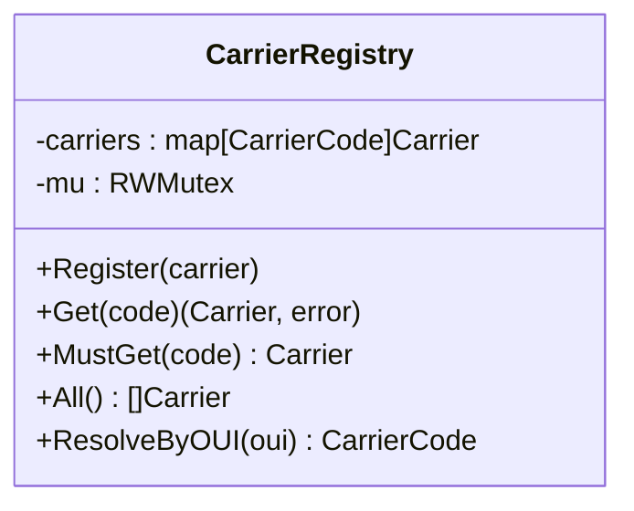
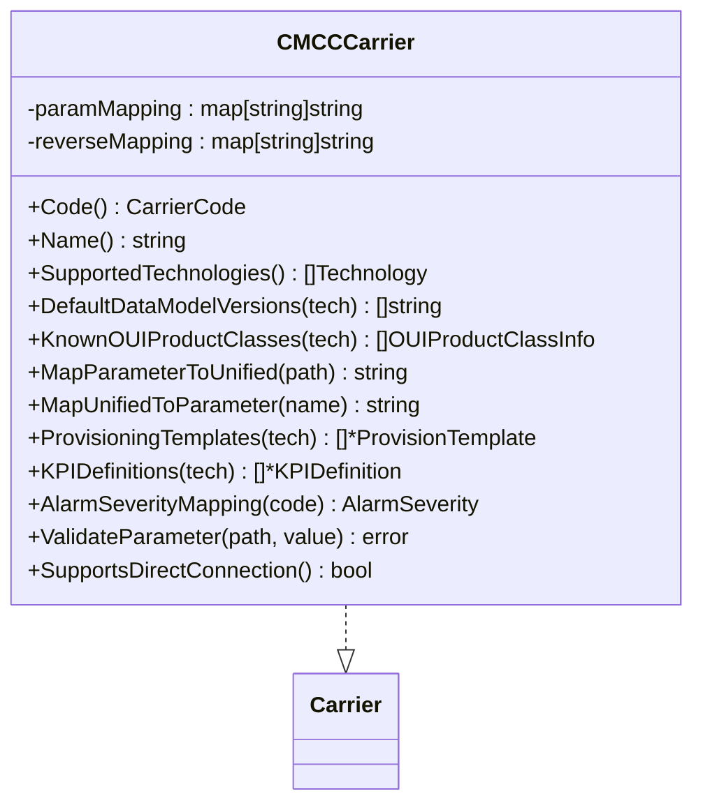
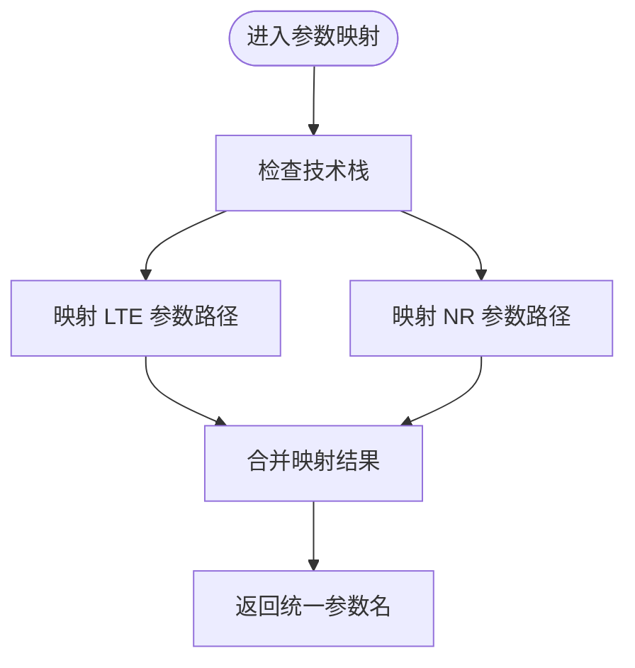
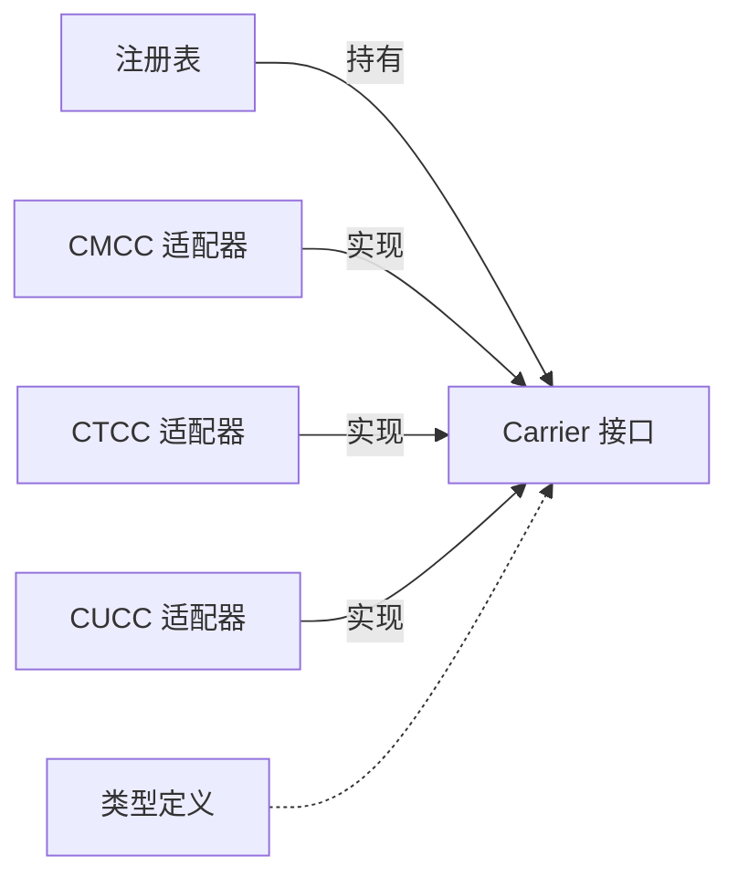

# 多运营商适配

<cite>
**本文引用的文件**
- [carrier.go](file://omcgo/internal/core/carrier/carrier.go)
- [types.go](file://omcgo/internal/core/carrier/types.go)
- [registry.go](file://omcgo/internal/core/carrier/registry.go)
- [adapter.go（CMCC）](file://omcgo/internal/core/carrier/cmcc/adapter.go)
- [params.go（CMCC）](file://omcgo/internal/core/carrier/cmcc/params.go)
- [defaults.go（CMCC）](file://omcgo/internal/core/carrier/cmcc/defaults.go)
- [kpi.go（CMCC）](file://omcgo/internal/core/carrier/cmcc/kpi.go)
- [adapter.go（CTCC）](file://omcgo/internal/core/carrier/ctcc/adapter.go)
- [adapter.go（CUCC）](file://omcgo/internal/core/carrier/cucc/adapter.go)
</cite>

## 目录
1. [简介](#简介)
2. [项目结构](#项目结构)
3. [核心组件](#核心组件)
4. [架构总览](#架构总览)
5. [详细组件分析](#详细组件分析)
6. [依赖分析](#依赖分析)
7. [性能考虑](#性能考虑)
8. [故障排查指南](#故障排查指南)
9. [结论](#结论)
10. [附录：新增运营商适配器开发指南与最佳实践](#附录新增运营商适配器开发指南与最佳实践)

## 简介
本文件面向“多运营商适配模块”的设计与实现，围绕适配器模式展开，系统性说明：
- 运营商抽象与注册表机制
- 参数映射与默认配置模板
- 数据模型模板系统与参数继承
- 主要运营商（CMCC、CTCC、CUCC）适配器实现要点
- 新增运营商适配器的开发流程与最佳实践

目标是帮助开发者在不引入硬编码分支的前提下，通过统一接口与可插拔适配器，满足不同运营商在协议差异、参数命名、业务规则等方面的差异化需求。

## 项目结构
多运营商适配位于 omcgo/internal/core/carrier 目录下，采用按运营商分包的组织方式：
- carrier 接口与通用类型定义
- registry 注册表，负责适配器注册与查找
- 各运营商子包（如 cmcc、ctcc、cucc），每个子包提供该运营商的适配器实现
- CMCC 子包内进一步细分为参数映射、默认配置、KPI 定义等职责



图表来源
- [carrier.go:1-42](file://omcgo/internal/core/carrier/carrier.go#L1-L42)
- [types.go:1-31](file://omcgo/internal/core/carrier/types.go#L1-L31)
- [registry.go:1-78](file://omcgo/internal/core/carrier/registry.go#L1-L78)
- [adapter.go（CMCC）:1-115](file://omcgo/internal/core/carrier/cmcc/adapter.go#L1-L115)
- [adapter.go（CTCC）:1-78](file://omcgo/internal/core/carrier/ctcc/adapter.go#L1-L78)
- [adapter.go（CUCC）:1-72](file://omcgo/internal/core/carrier/cucc/adapter.go#L1-L72)

章节来源
- [carrier.go:1-42](file://omcgo/internal/core/carrier/carrier.go#L1-L42)
- [types.go:1-31](file://omcgo/internal/core/carrier/types.go#L1-L31)
- [registry.go:1-78](file://omcgo/internal/core/carrier/registry.go#L1-L78)

## 核心组件
- Carrier 接口：定义所有运营商差异化行为的统一契约，禁止在业务层使用硬编码分支判断运营商。
- 类型定义：参数映射、默认模板、KPI 定义等跨适配器共享的数据结构。
- 注册表：集中管理适配器注册、查询、按 OUI 解析运营商等能力。
- 运营商适配器：以适配器模式实现具体运营商的行为，如参数映射、默认模板、KPI、告警严重级别映射、参数校验等。

章节来源
- [carrier.go:5-41](file://omcgo/internal/core/carrier/carrier.go#L5-L41)
- [types.go:5-30](file://omcgo/internal/core/carrier/types.go#L5-L30)
- [registry.go:10-77](file://omcgo/internal/core/carrier/registry.go#L10-L77)

## 架构总览
整体采用“接口 + 适配器 + 注册表”的架构，核心流程如下：
- 初始化阶段：各运营商适配器实例化并注册到注册表
- 运行阶段：根据设备 OUI 或显式传入的运营商码，从注册表获取适配器
- 业务阶段：通过适配器接口调用参数映射、默认模板、KPI、告警映射、参数校验等



图表来源
- [registry.go:16-28](file://omcgo/internal/core/carrier/registry.go#L16-L28)
- [adapter.go（CMCC）:16-21](file://omcgo/internal/core/carrier/cmcc/adapter.go#L16-L21)
- [adapter.go（CTCC）:15-22](file://omcgo/internal/core/carrier/ctcc/adapter.go#L15-L22)
- [adapter.go（CUCC）:15-22](file://omcgo/internal/core/carrier/cucc/adapter.go#L15-L22)

## 详细组件分析

### 注册表（CarrierRegistry）
- 职责：提供线程安全的适配器注册、查询、列举、按 OUI 解析运营商码的能力
- 关键方法：
  - Register：注册适配器
  - Get/MustGet：按运营商码获取适配器
  - All：返回全部已注册适配器
  - ResolveByOUI：遍历已注册适配器的已知 OUI 列表，匹配首个命中者
- 并发控制：读写锁保护内部映射，保证高并发下的安全访问



图表来源
- [registry.go:10-77](file://omcgo/internal/core/carrier/registry.go#L10-L77)

章节来源
- [registry.go:10-77](file://omcgo/internal/core/carrier/registry.go#L10-L77)

### Carrier 接口与类型定义
- Carrier 接口：统一暴露运营商码、名称、支持的技术栈、默认数据模型版本、已知 OUI 产品组合、参数双向映射、默认模板、KPI 定义、告警严重级别映射、参数校验等能力
- 类型定义：
  - OUIProductClassInfo：厂商/产品类别的识别信息
  - ProvisionTemplate：默认配置模板，含参数名到默认值的映射与必填项
  - KPIDefinition：KPI 计算公式、单位、计数器依赖、分类等

```mermaid
classDiagram
class Carrier {
<<interface>>
+Code() CarrierCode
+Name() string
+SupportedTechnologies() []Technology
+DefaultDataModelVersions(tech) []string
+KnownOUIProductClasses(tech) []OUIProductClassInfo
+MapParameterToUnified(path) string
+MapUnifiedToParameter(name) string
+ProvisioningTemplates(tech) []*ProvisionTemplate
+KPIDefinitions(tech) []*KPIDefinition
+AlarmSeverityMapping(code) AlarmSeverity
+ValidateParameter(path, value) error
}
class OUIProductClassInfo {
+OUI : string
+ProductClass : string
+ManufacturerName : string
+Description : string
+Technology : Technology
}
class ProvisionTemplate {
+Name : string
+Technology : Technology
+Parameters : map[string]interface{}
+Required : []string
}
class KPIDefinition {
+Name : string
+DisplayName : string
+Formula : string
+Unit : string
+Counters : []string
+Category : string
}
Carrier --> OUIProductClassInfo
Carrier --> ProvisionTemplate
Carrier --> KPIDefinition
```

图表来源
- [carrier.go:5-41](file://omcgo/internal/core/carrier/carrier.go#L5-L41)
- [types.go:5-30](file://omcgo/internal/core/carrier/types.go#L5-L30)

章节来源
- [carrier.go:5-41](file://omcgo/internal/core/carrier/carrier.go#L5-L41)
- [types.go:5-30](file://omcgo/internal/core/carrier/types.go#L5-L30)

### CMCC 适配器（中国移动）
- 支持技术栈：LTE、NR
- 默认数据模型版本：按技术栈返回多个候选版本
- 已知 OUI 产品组合：针对 LTE/NR 的厂商与产品类别
- 参数映射：提供正向与反向映射，覆盖标准 TR-069 路径与 CMCC 扩展字段
- 默认配置模板：按技术栈提供默认参数集合与必填项
- KPI 定义：覆盖接入性、保持性、移动性、利用率、吞吐量等维度
- 告警严重级别映射：将特定告警码映射到标准严重级别
- 参数校验：对关键参数进行格式与范围校验
- 直连支持：明确支持网元直连



图表来源
- [adapter.go（CMCC）:10-115](file://omcgo/internal/core/carrier/cmcc/adapter.go#L10-L115)
- [params.go（CMCC）:3-74](file://omcgo/internal/core/carrier/cmcc/params.go#L3-L74)
- [defaults.go（CMCC）:32-85](file://omcgo/internal/core/carrier/cmcc/defaults.go#L32-L85)
- [kpi.go（CMCC）:8-171](file://omcgo/internal/core/carrier/cmcc/kpi.go#L8-L171)

章节来源
- [adapter.go（CMCC）:10-115](file://omcgo/internal/core/carrier/cmcc/adapter.go#L10-L115)
- [params.go（CMCC）:3-74](file://omcgo/internal/core/carrier/cmcc/params.go#L3-L74)
- [defaults.go（CMCC）:32-85](file://omcgo/internal/core/carrier/cmcc/defaults.go#L32-L85)
- [kpi.go（CMCC）:8-171](file://omcgo/internal/core/carrier/cmcc/kpi.go#L8-L171)

### CTCC 适配器（中国电信）
- 支持技术栈：LTE、NR
- 默认数据模型版本：按技术栈返回版本
- 已知 OUI 产品组合：当前为空（预留）
- 参数映射：当前为空映射（预留）
- 默认模板/KPI：当前为空（预留）
- 告警严重级别映射：返回默认警告级别
- 参数校验：当前无校验（预留）

章节来源
- [adapter.go（CTCC）:8-77](file://omcgo/internal/core/carrier/ctcc/adapter.go#L8-L77)

### CUCC 适配器（中国联通）
- 支持技术栈：仅 NR（5G）
- 默认数据模型版本：仅 NR 返回版本
- 已知 OUI 产品组合：当前为空（预留）
- 参数映射：当前为空映射（预留）
- 默认模板/KPI：当前为空（预留）
- 告警严重级别映射：返回默认警告级别
- 参数校验：当前无校验（预留）

章节来源
- [adapter.go（CUCC）:8-71](file://omcgo/internal/core/carrier/cucc/adapter.go#L8-L71)

### 参数映射与默认配置模板（CMCC）
- 参数映射策略：
  - 正向映射：将运营商特定参数路径映射到统一内部名称
  - 反向映射：将统一内部名称还原为运营商特定参数路径
  - 覆盖范围：标准 TR-069 路径与 CMCC 扩展字段
- 默认配置模板：
  - 按技术栈提供默认参数集合（如周期上报、PLMN、TAC、PM 开关与周期等）
  - 明确必填参数清单，便于后续校验与下发
- KPI 定义：
  - LTE 与 NR 分别提供接入性、保持性、移动性、利用率、吞吐量、时延等维度的计算公式与计数器依赖



图表来源
- [params.go（CMCC）:3-74](file://omcgo/internal/core/carrier/cmcc/params.go#L3-L74)

章节来源
- [params.go（CMCC）:3-74](file://omcgo/internal/core/carrier/cmcc/params.go#L3-L74)
- [defaults.go（CMCC）:32-85](file://omcgo/internal/core/carrier/cmcc/defaults.go#L32-L85)
- [kpi.go（CMCC）:8-171](file://omcgo/internal/core/carrier/cmcc/kpi.go#L8-L171)

## 依赖分析
- 组件耦合：
  - 注册表与适配器之间为弱耦合：注册表仅持有接口类型
  - 适配器彼此独立，互不依赖
  - 适配器内部职责清晰：参数映射、默认模板、KPI、告警映射、参数校验
- 外部依赖：
  - 适配器依赖统一的模型类型（技术栈、告警严重级别等）
  - 注册表依赖并发安全的读写锁
- 循环依赖：
  - 未发现循环依赖，结构清晰



图表来源
- [registry.go:10-77](file://omcgo/internal/core/carrier/registry.go#L10-L77)
- [carrier.go:5-41](file://omcgo/internal/core/carrier/carrier.go#L5-L41)
- [types.go:5-30](file://omcgo/internal/core/carrier/types.go#L5-L30)

章节来源
- [registry.go:10-77](file://omcgo/internal/core/carrier/registry.go#L10-L77)
- [carrier.go:5-41](file://omcgo/internal/core/carrier/carrier.go#L5-L41)
- [types.go:5-30](file://omcgo/internal/core/carrier/types.go#L5-L30)

## 性能考虑
- 注册表并发：读写锁确保高并发场景下的安全访问；建议在启动阶段完成注册，运行期避免频繁注册/注销
- OUI 解析：ResolveByOUI 需遍历所有适配器的已知 OUI 列表，建议在适配器中维护紧凑的已知组合，减少匹配成本
- 参数映射：映射表为内存查找，复杂度为 O(1)，性能开销极低
- 默认模板与 KPI：静态定义，加载后常驻内存，查询为直接索引

## 故障排查指南
- 无法找到运营商适配器
  - 检查是否已调用注册表的 Register 方法完成注册
  - 检查传入的运营商码是否正确
- OUI 无法解析到运营商
  - 确认适配器的 KnownOUIProductClasses 是否包含对应 OUI
  - 检查技术栈过滤条件
- 参数映射异常
  - 检查参数映射表是否完整覆盖目标路径
  - 确认映射方向（正向/反向）使用正确
- 参数校验失败
  - 检查适配器的参数校验函数是否覆盖目标参数
  - 核对输入值格式与范围约束
- 默认模板缺失
  - 确认适配器的 DefaultDataModelVersions 与 ProvisioningTemplates 是否按技术栈返回有效内容

章节来源
- [registry.go:30-77](file://omcgo/internal/core/carrier/registry.go#L30-L77)
- [adapter.go（CMCC）:74-80](file://omcgo/internal/core/carrier/cmcc/adapter.go#L74-L80)
- [defaults.go（CMCC）:32-85](file://omcgo/internal/core/carrier/cmcc/defaults.go#L32-L85)

## 结论
通过 Carrier 接口与注册表，结合按运营商分包的适配器实现，系统实现了对多运营商差异的解耦与扩展。CMCC 提供了完整的参数映射、默认模板与 KPI 定义示例，CTCC/CUCC 作为预留骨架，可在后续阶段逐步完善。该架构具备良好的可维护性与可扩展性，适合持续演进。

## 附录：新增运营商适配器开发指南与最佳实践
- 开发步骤
  - 在 internal/core/carrier 下新建运营商子包（如 myop）
  - 实现 Carrier 接口的关键方法：运营商码、名称、支持技术栈、默认数据模型版本、已知 OUI、参数映射、默认模板、KPI、告警映射、参数校验
  - 在初始化阶段创建适配器实例并通过注册表注册
- 最佳实践
  - 参数映射必须覆盖所有关键 TR-069 路径与运营商扩展字段，并提供双向映射
  - 默认模板应包含常用参数与必填项清单，便于快速下发
  - KPI 定义应与计数器采集体系一致，确保公式可执行
  - 告警映射应标准化严重级别，便于统一展示与告警处理
  - 参数校验应覆盖关键参数的格式与范围约束
  - OUI 产品组合应尽量完整，提升自动识别准确率
  - 保持接口契约稳定，避免破坏现有适配器

章节来源
- [carrier.go:5-41](file://omcgo/internal/core/carrier/carrier.go#L5-L41)
- [registry.go:16-28](file://omcgo/internal/core/carrier/registry.go#L16-L28)