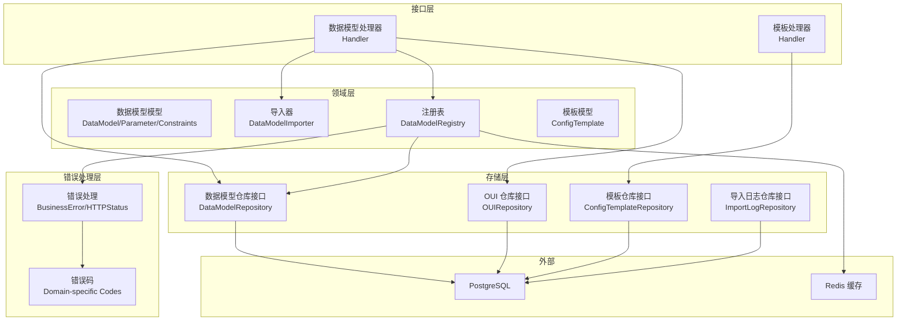
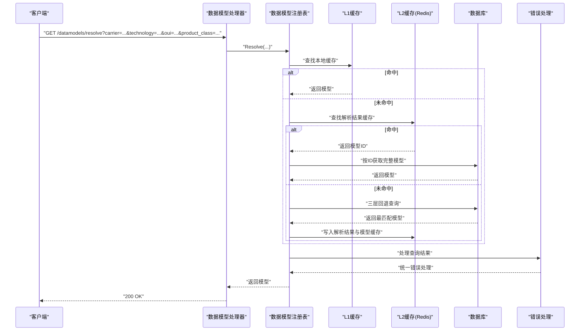
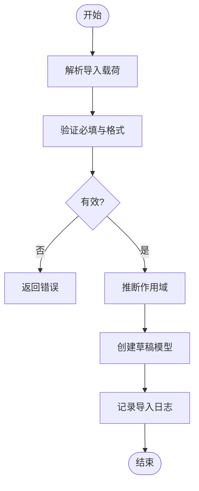
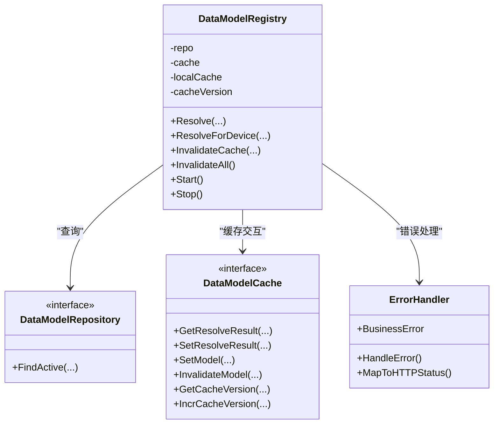
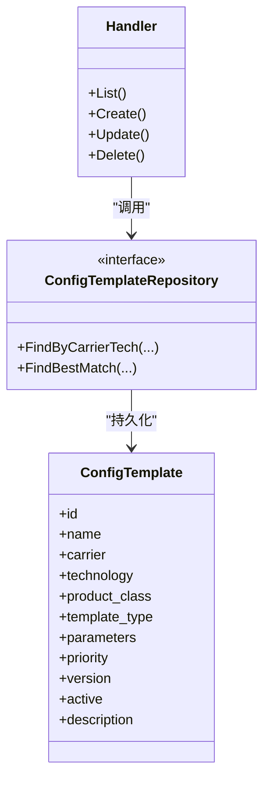
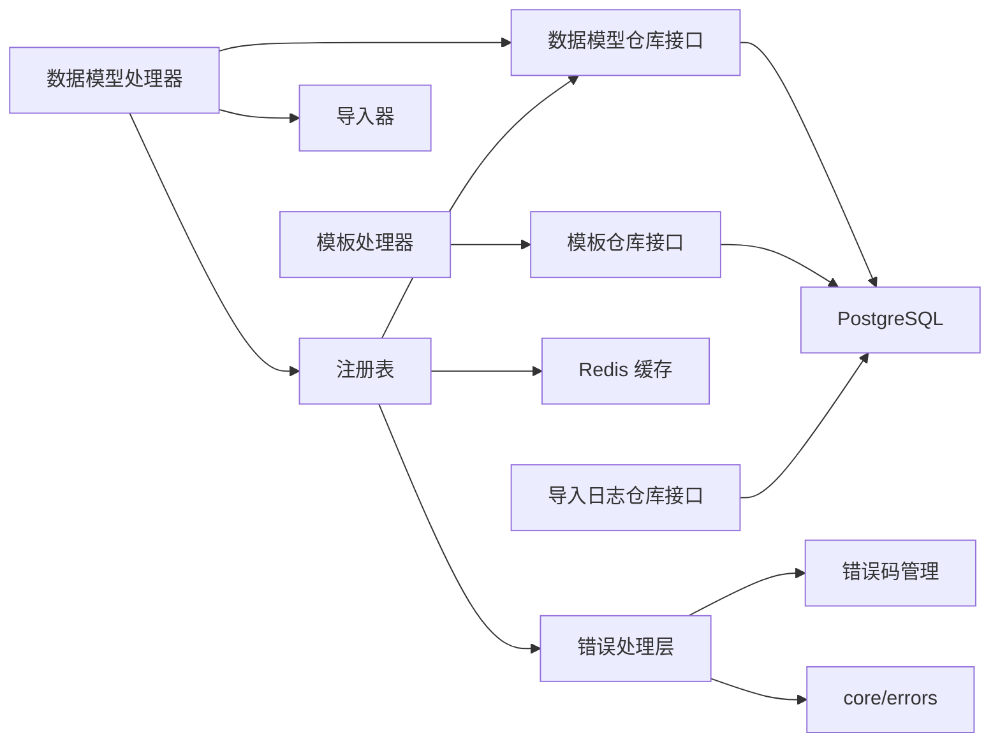

# 数据模型管理

<cite>
**本文引用的文件**
- [omcgo/internal/config/datamodel/model.go](file://omcgo/internal/config/datamodel/model.go)
- [omcgo/internal/config/datamodel/importer.go](file://omcgo/internal/config/datamodel/importer.go)
- [omcgo/internal/config/datamodel/registry.go](file://omcgo/internal/config/datamodel/registry.go)
- [omcgo/internal/config/datamodel/handler.go](file://omcgo/internal/config/datamodel/handler.go)
- [omcgo/internal/config/datamodel/repository.go](file://omcgo/internal/config/datamodel/repository.go)
- [omcgo/internal/config/template/model.go](file://omcgo/internal/config/template/model.go)
- [omcgo/internal/config/template/handler.go](file://omcgo/internal/config/template/handler.go)
- [omcgo/internal/config/template/repository.go](file://omcgo/internal/config/template/repository.go)
- [omcgo/datamodels/seed/carrier_defaults/cmcc_lte.json](file://omcgo/datamodels/seed/carrier_defaults/cmcc_lte.json)
- [omcgo/datamodels/seed/carrier_defaults/cmcc_nr.json](file://omcgo/datamodels/seed/carrier_defaults/cmcc_nr.json)
- [omcgo/migrations/000003_create_data_model_definitions.up.sql](file://omcgo/migrations/000003_create_data_model_definitions.up.sql)
- [omcgo/migrations/000004_create_oui_registry.up.sql](file://omcgo/migrations/000004_create_oui_registry.up.sql)
- [omcgo/migrations/000005_create_data_model_import_log.up.sql](file://omcgo/migrations/000005_create_data_model_import_log.up.sql)
- [omcgo/migrations/000006_create_config_templates.up.sql](file://omcgo/migrations/000006_create_config_templates.up.sql)
- [omcgo/internal/core/carrier/types.go](file://omcgo/internal/core/carrier/types.go)
- [omcgo/internal/core/errors/errors.go](file://omcgo/internal/core/errors/errors.go)
- [omcgo/internal/core/errors/codes.go](file://omcgo/internal/core/errors/codes.go)
- [omcgo/global/errors.go](file://omcgo/global/errors.go)
</cite>

## 更新摘要
**所做更改**
- 更新了数据模型注册表的错误处理机制，反映commonerrors包路径修复
- 新增了错误处理架构的详细说明
- 更新了基础设施改进相关的章节内容
- 增强了错误处理与缓存一致性的说明

## 目录
1. [简介](#简介)
2. [项目结构](#项目结构)
3. [核心组件](#核心组件)
4. [架构总览](#架构总览)
5. [详细组件分析](#详细组件分析)
6. [依赖分析](#依赖分析)
7. [性能考虑](#性能考虑)
8. [故障排查指南](#故障排查指南)
9. [结论](#结论)
10. [附录](#附录)

## 简介
本文件面向"数据模型管理系统"，聚焦 TR069 数据模型的组织结构与管理机制，涵盖以下主题：
- TR069 数据模型的三层作用域与继承关系：厂商级（OUI）、产品级（OUI+ProductClass）、运营商默认（Carrier+Technology）
- 模板系统架构：配置模板的类型、存储与匹配策略
- 运营商默认配置种子数据：中国移动 LTE/5G 小基站默认数据模型结构与用途
- 数据模型导入机制：验证、冲突处理、版本管理与审计日志
- 不同运营商的数据模型差异与继承关系
- 数据模型的创建、修改、删除、激活/弃用流程
- 错误处理与基础设施改进：commonerrors包路径修复与错误处理架构
- 扩展与自定义最佳实践
- 实际配置示例与应用场景

## 项目结构
数据模型管理相关代码主要位于 omcgo 内部服务中，采用分层设计：
- 接口层：HTTP 路由与处理器（Handler）
- 领域层：数据模型与模板的领域模型、导入器、注册表
- 存储层：仓库接口与数据库迁移脚本
- 错误处理层：统一的错误处理与业务错误码管理
- 种子数据：运营商默认配置 JSON 文件

**图表来源**
- [omcgo/internal/config/datamodel/handler.go:12-53](file://omcgo/internal/config/datamodel/handler.go#L12-L53)
- [omcgo/internal/config/template/handler.go:12-32](file://omcgo/internal/config/template/handler.go#L12-L32)
- [omcgo/internal/config/datamodel/registry.go:21-38](file://omcgo/internal/config/datamodel/registry.go#L21-L38)
- [omcgo/internal/config/datamodel/repository.go:10-22](file://omcgo/internal/config/datamodel/repository.go#L10-L22)
- [omcgo/internal/config/template/repository.go:10-19](file://omcgo/internal/config/template/repository.go#L10-L19)
- [omcgo/internal/core/errors/errors.go:11-21](file://omcgo/internal/core/errors/errors.go#L11-L21)
- [omcgo/internal/core/errors/codes.go:3](file://omcgo/internal/core/errors/codes.go#L3](file://omcgo/internal/core/errors/codes.go#L3))

**章节来源**
- [omcgo/internal/config/datamodel/handler.go:30-53](file://omcgo/internal/config/datamodel/handler.go#L30-L53)
- [omcgo/internal/config/template/handler.go:22-32](file://omcgo/internal/config/template/handler.go#L22-L32)

## 核心组件
- 数据模型模型与约束
  - 数据模型实体包含归属运营商、技术类型、版本、OUI、产品类、作用域、状态、根对象、参数树、来源、说明等字段
  - 参数节点包含路径、统一名称、类型、可写性、描述、约束（数值范围、枚举、正则、最大长度）等
- 数据模型导入器
  - 支持从 JSON 导入、验证（干跑）、导出；自动推断作用域；记录导入日志
- 数据模型注册表
  - 提供三层回退解析：产品级 → OUI 级 → 运营商默认；内置三级缓存（内存、Redis、数据库）
  - **新增**：统一的错误处理机制，使用标准的 ErrNotFound 错误进行查询结果判断
- 配置模板模型与处理器
  - 模板类型包括"配置下发""批量配置""固件升级"；支持按运营商/技术/产品类/模板类型筛选与最佳匹配
- 错误处理架构
  - **基础设施改进**：统一的 BusinessError 和错误码管理，支持领域特定的错误处理
  - **错误码体系**：按领域划分的错误码范围，支持精确的错误分类与处理

**章节来源**
- [omcgo/internal/config/datamodel/model.go:20-80](file://omcgo/internal/config/datamodel/model.go#L20-L80)
- [omcgo/internal/config/datamodel/importer.go:41-105](file://omcgo/internal/config/datamodel/importer.go#L41-L105)
- [omcgo/internal/config/datamodel/registry.go:14-38](file://omcgo/internal/config/datamodel/registry.go#L14-L38)
- [omcgo/internal/config/template/model.go:20-45](file://omcgo/internal/config/template/model.go#L20-L45)
- [omcgo/internal/core/errors/errors.go:11-21](file://omcgo/internal/core/errors/errors.go#L11-L21)
- [omcgo/internal/core/errors/codes.go:3](file://omcgo/internal/core/errors/codes.go#L3)

## 架构总览
数据模型解析与使用的关键流程如下：

**图表来源**
- [omcgo/internal/config/datamodel/handler.go:289-311](file://omcgo/internal/config/datamodel/handler.go#L289-L311)
- [omcgo/internal/config/datamodel/registry.go:40-130](file://omcgo/internal/config/datamodel/registry.go#L40-L130)
- [omcgo/internal/config/datamodel/registry.go:145-189](file://omcgo/internal/config/datamodel/registry.go#L145-L189)

## 详细组件分析

### 数据模型导入与验证
- 导入流程
  - 解析 JSON 载荷，校验必填字段与格式
  - 自动推断作用域（产品/OUI/默认）
  - 创建草稿状态的数据模型并记录导入日志
- 验证流程（干跑）
  - 校验必填项与格式
  - 统计参数个数
  - 生成错误/警告清单
- 冲突与版本
  - 通过状态字段区分草稿/激活/弃用
  - 激活/弃用后触发缓存失效，确保跨实例一致性

**图表来源**
- [omcgo/internal/config/datamodel/importer.go:55-105](file://omcgo/internal/config/datamodel/importer.go#L55-L105)
- [omcgo/internal/config/datamodel/importer.go:107-147](file://omcgo/internal/config/datamodel/importer.go#L107-L147)
- [omcgo/internal/config/datamodel/importer.go:192-224](file://omcgo/internal/config/datamodel/importer.go#L192-L224)

**章节来源**
- [omcgo/internal/config/datamodel/importer.go:41-175](file://omcgo/internal/config/datamodel/importer.go#L41-L175)
- [omcgo/internal/config/datamodel/handler.go:262-270](file://omcgo/internal/config/datamodel/handler.go#L262-L270)

### 数据模型注册表与三层回退
- 三层回退优先级
  - 产品级：要求同时具备 OUI 与 ProductClass
  - OUI 级：要求具备 OUI
  - 运营商默认：仅需 Carrier 与 Technology
- 缓存策略
  - L1：进程内缓存（sync.Map）
  - L2：Redis 缓存解析结果与完整模型
  - L3：数据库持久化
- 缓存一致性
  - 激活/弃用/更新后主动失效对应缓存
  - 后台定时检查 Redis 中的版本号，变更时清空 L1
- **错误处理改进**
  - 使用统一的 ErrNotFound 错误进行查询结果判断
  - 标准化的错误处理流程，提升代码可维护性

**图表来源**
- [omcgo/internal/config/datamodel/registry.go:21-38](file://omcgo/internal/config/datamodel/registry.go#L21-L38)
- [omcgo/internal/config/datamodel/repository.go:10-22](file://omcgo/internal/config/datamodel/repository.go#L10-L22)
- [omcgo/internal/core/errors/errors.go:11-21](file://omcgo/internal/core/errors/errors.go#L11-L21)

**章节来源**
- [omcgo/internal/config/datamodel/registry.go:40-164](file://omcgo/internal/config/datamodel/registry.go#L40-L164)
- [omcgo/internal/config/datamodel/registry.go:185-240](file://omcgo/internal/config/datamodel/registry.go#L185-L240)
- [omcgo/internal/config/datamodel/registry.go:271-297](file://omcgo/internal/config/datamodel/registry.go#L271-L297)

### 配置模板系统
- 模板类型
  - provisioning：配置下发
  - batch_config：批量配置
  - firmware_upgrade：固件升级
- 匹配策略
  - 按运营商、技术、产品类、模板类型筛选
  - 支持"最佳匹配"查询，便于按设备属性选择合适模板
- 处理器能力
  - 列表、详情、创建、更新、删除
  - 支持优先级排序与激活状态控制

**图表来源**
- [omcgo/internal/config/template/model.go:20-45](file://omcgo/internal/config/template/model.go#L20-L45)
- [omcgo/internal/config/template/repository.go:10-19](file://omcgo/internal/config/template/repository.go#L10-L19)
- [omcgo/internal/config/template/handler.go:22-32](file://omcgo/internal/config/template/handler.go#L22-L32)

**章节来源**
- [omcgo/internal/config/template/model.go:11-45](file://omcgo/internal/config/template/model.go#L11-L45)
- [omcgo/internal/config/template/handler.go:34-189](file://omcgo/internal/config/template/handler.go#L34-L189)

### 运营商默认配置种子数据
- 中国移动 LTE 默认模型（cmcc_lte.json）
  - 覆盖设备信息、管理服务器、小基站服务、CMCC 扩展参数等
  - 参数包含类型、可写性、描述与约束（如取值范围、枚举、正则）
- 中国移动 5G NR 默认模型（cmcc_nr.json）
  - 覆盖设备信息、管理服务器、小基站服务、CMCC 扩展参数等
  - 参数包含类型、可写性、描述与约束（如取值范围、枚举）

**章节来源**
- [omcgo/datamodels/seed/carrier_defaults/cmcc_lte.json:1-285](file://omcgo/datamodels/seed/carrier_defaults/cmcc_lte.json#L1-L285)
- [omcgo/datamodels/seed/carrier_defaults/cmcc_nr.json:1-260](file://omcgo/datamodels/seed/carrier_defaults/cmcc_nr.json#L1-L260)

### 数据模型生命周期与操作指南
- 创建
  - 通过处理器或导入器创建草稿模型；自动推断作用域与根对象
- 修改
  - 更新版本、根对象、参数树、来源、说明等；保持状态不变
- 删除
  - 仅允许删除草稿状态模型
- 激活/弃用
  - 激活后成为默认可用模型；弃用后不再作为默认回退
  - 操作后触发缓存失效，保证多实例一致性

**章节来源**
- [omcgo/internal/config/datamodel/handler.go:120-155](file://omcgo/internal/config/datamodel/handler.go#L120-L155)
- [omcgo/internal/config/datamodel/handler.go:166-200](file://omcgo/internal/config/datamodel/handler.go#L166-L200)
- [omcgo/internal/config/datamodel/handler.go:202-215](file://omcgo/internal/config/datamodel/handler.go#L202-L215)
- [omcgo/internal/config/datamodel/handler.go:217-260](file://omcgo/internal/config/datamodel/handler.go#L217-L260)

### 数据模型差异与继承关系
- 作用域层级
  - 产品级（OUI+ProductClass）最具体，覆盖厂商与产品差异
  - OUI 级（OUI）覆盖厂商通用差异
  - 运营商默认（Carrier+Technology）提供基础能力
- 解析顺序
  - 优先匹配产品级，其次 OUI 级，最后运营商默认
- 运营商扩展
  - 可在模板系统中为特定运营商/技术/产品类提供差异化模板

**章节来源**
- [omcgo/internal/config/datamodel/registry.go:14-21](file://omcgo/internal/config/datamodel/registry.go#L14-L21)
- [omcgo/internal/config/datamodel/registry.go:132-164](file://omcgo/internal/config/datamodel/registry.go#L132-L164)
- [omcgo/internal/core/carrier/types.go:14-20](file://omcgo/internal/core/carrier/types.go#L14-L20)

### 错误处理与基础设施改进
- **commonerrors 包路径修复**
  - 修正了错误包导入路径，使用正确的 github.com/omcgo/omcgo/internal/core/errors 包
  - 统一了错误处理机制，提升了代码的一致性和可维护性
- **错误处理架构**
  - BusinessError 结构体支持嵌套错误，提供详细的错误信息
  - HTTPStatusFromError 函数将错误映射到标准 HTTP 状态码
  - AbortWithError 函数提供统一的错误响应格式
- **错误码管理体系**
  - 按领域划分的错误码范围（2000-2999 用于数据模型/配置）
  - 支持请求 ID 关联，便于问题追踪
  - 标准化的错误响应结构，包含 code、message、details 等字段

**章节来源**
- [omcgo/internal/config/datamodel/registry.go:10-14](file://omcgo/internal/config/datamodel/registry.go#L10-L14)
- [omcgo/internal/core/errors/errors.go:11-21](file://omcgo/internal/core/errors/errors.go#L11-L21)
- [omcgo/internal/core/errors/errors.go:58-88](file://omcgo/internal/core/errors/errors.go#L58-L88)
- [omcgo/internal/core/errors/codes.go:16-24](file://omcgo/internal/core/errors/codes.go#L16-L24)
- [omcgo/global/errors.go:14-22](file://omcgo/global/errors.go#L14-L22)

## 依赖分析
- 外部依赖
  - PostgreSQL：持久化数据模型、导入日志、模板、OUI 注册表
  - Redis：解析结果与完整模型缓存
- 内部依赖
  - Handler 依赖仓库接口与导入器/注册表
  - 注册表依赖仓库接口、缓存接口与错误处理层
  - 模板处理器依赖模板仓库接口
  - **新增**：错误处理层提供统一的错误处理机制

**图表来源**
- [omcgo/internal/config/datamodel/handler.go:13-27](file://omcgo/internal/config/datamodel/handler.go#L13-L27)
- [omcgo/internal/config/template/handler.go:13-19](file://omcgo/internal/config/template/handler.go#L13-L19)
- [omcgo/internal/config/datamodel/registry.go:21-38](file://omcgo/internal/config/datamodel/registry.go#L21-L38)
- [omcgo/internal/config/datamodel/repository.go:10-22](file://omcgo/internal/config/datamodel/repository.go#L10-L22)
- [omcgo/internal/config/template/repository.go:10-19](file://omcgo/internal/config/template/repository.go#L10-L19)
- [omcgo/internal/core/errors/errors.go:11-21](file://omcgo/internal/core/errors/errors.go#L11-L21)

**章节来源**
- [omcgo/internal/config/datamodel/repository.go:10-35](file://omcgo/internal/config/datamodel/repository.go#L10-L35)
- [omcgo/internal/config/template/repository.go:10-19](file://omcgo/internal/config/template/repository.go#L10-L19)

## 性能考虑
- 三层缓存
  - L1（内存）命中极快，适合高并发场景
  - L2（Redis）降低数据库压力，支持多实例共享
  - L3（数据库）保证持久化与一致性
- 缓存失效与版本同步
  - 激活/弃用/更新后主动失效，避免脏读
  - 后台轮询 Redis 版本号，跨实例保持缓存一致
- 查询优化
  - 三层回退查询按优先级短路，减少无效查询
  - 参数树统计用于导入预检，避免大体积树导致的解析开销
- **错误处理优化**
  - 统一的错误处理机制减少了重复代码
  - 标准化的错误映射提升了错误处理效率

## 故障排查指南
- 导入失败
  - 检查 JSON 结构与必填字段（运营商、技术、版本、参数树）
  - 使用验证接口查看错误/警告清单
- 解析不到模型
  - 确认参数中的 OUI 与 ProductClass 是否满足作用域要求
  - 检查是否存在更高优先级的作用域已激活
- 缓存不一致
  - 执行缓存刷新接口，或等待后台版本轮询
  - 查看日志中缓存失效与版本号变化
- 模板匹配异常
  - 检查模板过滤条件（运营商、技术、产品类、模板类型）
  - 确认模板优先级与激活状态
- **错误处理问题**
  - 检查错误码映射是否正确
  - 验证 BusinessError 的嵌套错误处理
  - 确认请求 ID 关联是否正常

**章节来源**
- [omcgo/internal/config/datamodel/importer.go:107-147](file://omcgo/internal/config/datamodel/importer.go#L107-L147)
- [omcgo/internal/config/datamodel/handler.go:289-311](file://omcgo/internal/config/datamodel/handler.go#L289-L311)
- [omcgo/internal/config/datamodel/registry.go:271-297](file://omcgo/internal/config/datamodel/registry.go#L271-L297)
- [omcgo/internal/config/template/handler.go:34-69](file://omcgo/internal/config/template/handler.go#L34-L69)

## 结论
本系统通过"三层作用域 + 三级缓存"的架构，实现了 TR069 数据模型的高效解析与稳定演进。结合导入器的验证与审计、模板系统的灵活匹配，以及运营商默认种子数据的标准化，能够满足多厂商、多技术、多场景下的配置管理需求。

**基础设施改进亮点**：
- **错误处理架构**：统一的 BusinessError 和错误码管理体系，提升了系统的可维护性和错误处理能力
- **commonerrors 包路径修复**：修正了错误包导入路径，确保了错误处理机制的正确性
- **标准化错误映射**：HTTPStatusFromError 函数提供了标准的错误状态码映射

建议在生产环境中配合缓存版本监控与导入验证流程，确保模型变更的可控与可观测。同时，利用统一的错误处理机制可以提升系统的稳定性和可维护性。

## 附录

### 数据模型与模板的数据库模式
- 数据模型定义表
  - 字段：主键、运营商、技术、版本、OUI、产品类、作用域、状态、根对象、参数树、来源、说明、时间戳
- OUI 注册表
  - 字段：OUI、厂商、简称、国家、时间戳
- 导入日志表
  - 字段：主键、数据模型ID、动作、执行人、变更摘要、时间戳
- 配置模板表
  - 字段：主键、名称、运营商、技术、产品类、模板类型、参数、优先级、版本、激活状态、说明、时间戳

**章节来源**
- [omcgo/migrations/000003_create_data_model_definitions.up.sql](file://omcgo/migrations/000003_create_data_model_definitions.up.sql)
- [omcgo/migrations/000004_create_oui_registry.up.sql](file://omcgo/migrations/000004_create_oui_registry.up.sql)
- [omcgo/migrations/000005_create_data_model_import_log.up.sql](file://omcgo/migrations/000005_create_data_model_import_log.up.sql)
- [omcgo/migrations/000006_create_config_templates.up.sql](file://omcgo/migrations/000006_create_config_templates.up.sql)

### 实际配置示例与应用场景
- 示例：导入中国移动 LTE 默认模型
  - 使用导入接口提交 cmcc_lte.json
  - 审核参数树与约束，必要时进行干跑验证
  - 激活后作为 LTE 小基站的默认数据模型
- 应用场景：多厂商共存
  - 产品级模型优先于 OUI 级模型
  - 若某厂商特定产品存在差异，可在产品级单独建模
- 应用场景：模板驱动的自动化配置
  - 通过模板处理器为不同产品类选择模板
  - 在批量配置任务中按模板类型（provisioning/batch_config）下发

**章节来源**
- [omcgo/datamodels/seed/carrier_defaults/cmcc_lte.json:1-285](file://omcgo/datamodels/seed/carrier_defaults/cmcc_lte.json#L1-L285)
- [omcgo/internal/config/template/model.go:14-18](file://omcgo/internal/config/template/model.go#L14-L18)
- [omcgo/internal/config/template/handler.go:34-69](file://omcgo/internal/config/template/handler.go#L34-L69)

### 错误处理最佳实践
- **使用 BusinessError**：对于业务错误，使用 BusinessError 结构体提供详细的错误信息
- **错误码管理**：遵循领域特定的错误码范围，确保错误码的唯一性和可识别性
- **错误映射**：使用 HTTPStatusFromError 函数进行标准的 HTTP 状态码映射
- **错误响应**：通过 AbortWithError 函数提供统一的错误响应格式
- **请求追踪**：利用请求 ID 关联错误信息，便于问题追踪和诊断

**章节来源**
- [omcgo/internal/core/errors/errors.go:35-88](file://omcgo/internal/core/errors/errors.go#L35-L88)
- [omcgo/internal/core/errors/codes.go:16-24](file://omcgo/internal/core/errors/codes.go#L16-L24)
- [omcgo/global/errors.go:14-22](file://omcgo/global/errors.go#L14-L22)