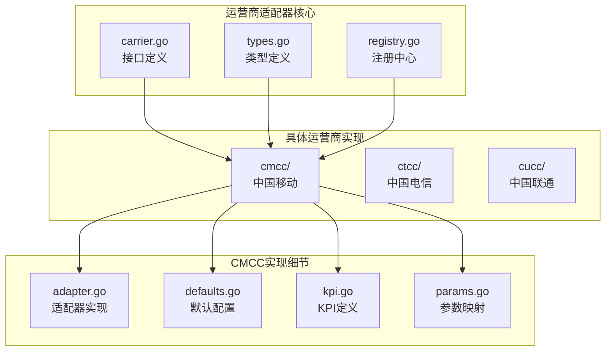
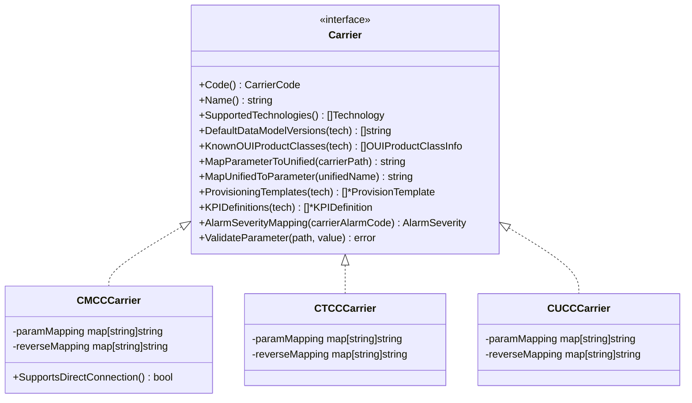
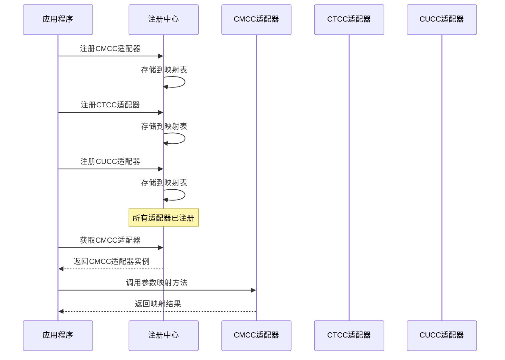
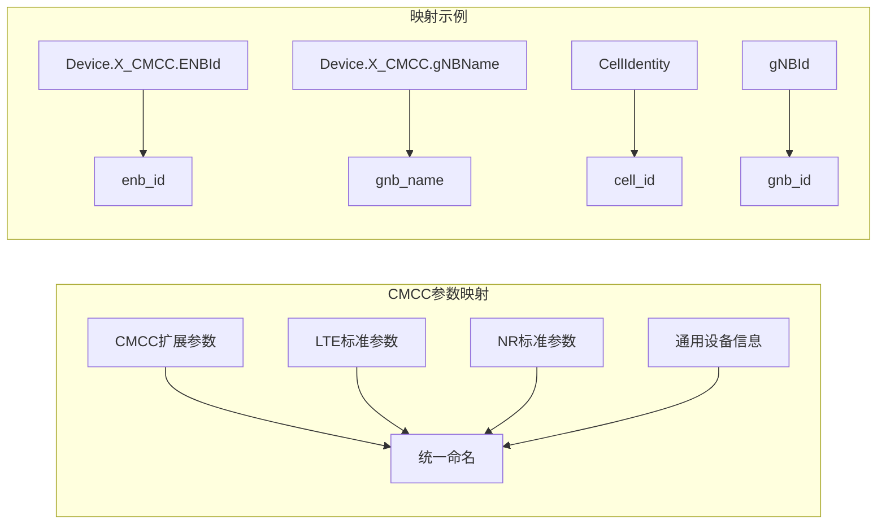
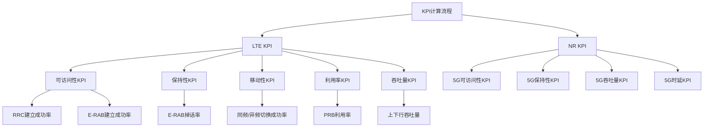
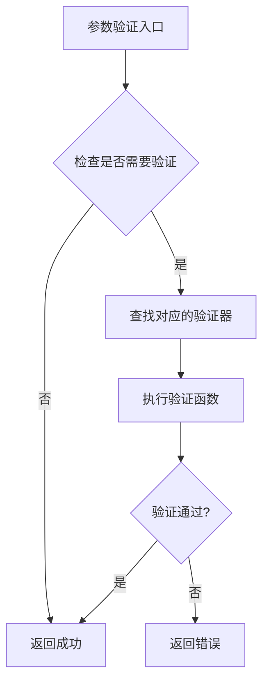
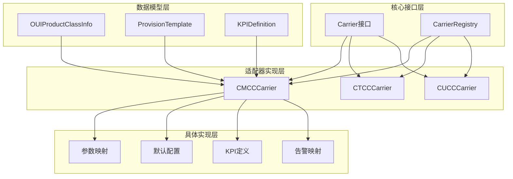

# 运营商适配器实现

<cite>
**本文档引用的文件**
- [carrier.go](file://omcgo/internal/core/carrier/carrier.go)
- [types.go](file://omcgo/internal/core/carrier/types.go)
- [registry.go](file://omcgo/internal/core/carrier/registry.go)
- [adapter.go](file://omcgo/internal/core/carrier/cmcc/adapter.go)
- [defaults.go](file://omcgo/internal/core/carrier/cmcc/defaults.go)
- [kpi.go](file://omcgo/internal/core/carrier/cmcc/kpi.go)
- [params.go](file://omcgo/internal/core/carrier/cmcc/params.go)
- [adapter.go](file://omcgo/internal/core/carrier/ctcc/adapter.go)
- [adapter.go](file://omcgo/internal/core/carrier/cucc/adapter.go)
</cite>

## 目录
1. [简介](#简介)
2. [项目结构](#项目结构)
3. [核心组件](#核心组件)
4. [架构概览](#架构概览)
5. [详细组件分析](#详细组件分析)
6. [依赖关系分析](#依赖关系分析)
7. [性能考虑](#性能考虑)
8. [故障排除指南](#故障排除指南)
9. [结论](#结论)

## 简介

本文档详细分析了Baicells OMC系统中运营商适配器的实现，重点涵盖了中国移动（CMCC）、中国电信（CTCC）和中国联通（CUCC）三大运营商的适配器设计与实现。该系统采用统一的运营商抽象接口，通过适配器模式实现不同运营商间的差异化处理，确保代码的可扩展性和维护性。

系统的核心设计理念是通过Carrier接口定义所有运营商差异化的功能点，包括参数映射、KPI计算、告警处理、配置模板等，避免在业务逻辑中出现硬编码的运营商判断语句。

## 项目结构

运营商适配器模块位于`omcgo/internal/core/carrier/`目录下，采用按运营商分层的组织方式：

**图表来源**
- [carrier.go:1-42](file://omcgo/internal/core/carrier/carrier.go#L1-L42)
- [registry.go:1-78](file://omcgo/internal/core/carrier/registry.go#L1-L78)
- [adapter.go:1-115](file://omcgo/internal/core/carrier/cmcc/adapter.go#L1-L115)

**章节来源**
- [carrier.go:1-42](file://omcgo/internal/core/carrier/carrier.go#L1-L42)
- [types.go:1-31](file://omcgo/internal/core/carrier/types.go#L1-L31)
- [registry.go:1-78](file://omcgo/internal/core/carrier/registry.go#L1-L78)

## 核心组件

### Carrier接口设计

Carrier接口是整个适配器系统的核心抽象，定义了所有运营商差异化的功能点：

**图表来源**
- [carrier.go:8-41](file://omcgo/internal/core/carrier/carrier.go#L8-L41)
- [adapter.go:10-14](file://omcgo/internal/core/carrier/cmcc/adapter.go#L10-L14)
- [adapter.go:8-13](file://omcgo/internal/core/carrier/ctcc/adapter.go#L8-L13)
- [adapter.go:8-14](file://omcgo/internal/core/carrier/cucc/adapter.go#L8-L14)

系统通过接口隔离实现了以下关键特性：

1. **技术栈支持**：每个运营商可以声明支持的无线技术（LTE、NR）
2. **参数映射**：提供运营商特定参数路径到统一命名的双向映射
3. **配置模板**：定义默认的设备配置模板
4. **KPI计算**：提供运营商特定的性能指标计算公式
5. **告警处理**：定义告警严重级别的映射规则
6. **参数验证**：实现运营商特定的参数值验证规则

**章节来源**
- [carrier.go:5-41](file://omcgo/internal/core/carrier/carrier.go#L5-L41)

### 数据模型定义

系统定义了三个核心数据结构来支撑运营商适配器的功能：

1. **OUIProductClassInfo**：描述厂商/OUI与产品类别的对应关系
2. **ProvisionTemplate**：定义设备配置模板，包含参数名到默认值的映射
3. **KPIDefinition**：定义KPI计算公式，包含公式表达式、计数器依赖和分类信息

**章节来源**
- [types.go:5-30](file://omcgo/internal/core/carrier/types.go#L5-L30)

## 架构概览

运营商适配器系统采用注册中心模式进行管理，确保运行时的动态加载和查找：

**图表来源**
- [registry.go:23-48](file://omcgo/internal/core/carrier/registry.go#L23-L48)

注册中心提供了以下核心功能：

1. **并发安全**：使用读写锁确保多线程环境下的安全性
2. **动态注册**：支持运行时注册新的运营商适配器
3. **快速查找**：通过运营商代码快速定位对应的适配器实例
4. **OUI解析**：根据设备的OUI自动识别运营商

**章节来源**
- [registry.go:10-78](file://omcgo/internal/core/carrier/registry.go#L10-L78)

## 详细组件分析

### 中国移动（CMCC）适配器实现

CMCC适配器是系统中最完整的实现，包含了所有核心功能：

#### 参数映射系统

CMCC实现了全面的参数路径映射，覆盖了LTE和NR两种技术制式：

**图表来源**
- [params.go:7-65](file://omcgo/internal/core/carrier/cmcc/params.go#L7-L65)

参数映射系统的特点：

1. **双向映射**：支持从运营商特定路径到统一命名的转换
2. **技术覆盖**：同时支持LTE和NR参数映射
3. **扩展支持**：包含CMCC特有的扩展参数
4. **标准化**：通用设备信息使用标准TR069路径

**章节来源**
- [params.go:1-75](file://omcgo/internal/core/carrier/cmcc/params.go#L1-L75)

#### 默认配置模板

CMCC提供了针对LTE和NR的完整默认配置模板：

| 参数名称 | LTE默认值 | NR默认值 |
|---------|----------|---------|
| PM启用 | true | true |
| PM采集间隔 | 15秒 | 15秒 |
| PLMN ID | 46000 | 46000 |
| 管理服务器URL | 自动设置 | 自动设置 |
| 周期性通知启用 | true | true |
| 周期性通知间隔 | 300秒 | 300秒 |

**章节来源**
- [defaults.go:32-85](file://omcgo/internal/core/carrier/cmcc/defaults.go#L32-L85)

#### KPI计算公式

CMCC定义了完整的KPI计算体系，涵盖多个维度：

**图表来源**
- [kpi.go:19-171](file://omcgo/internal/core/carrier/cmcc/kpi.go#L19-L171)

**章节来源**
- [kpi.go:1-172](file://omcgo/internal/core/carrier/cmcc/kpi.go#L1-L172)

#### 告警严重级别映射

CMCC建立了详细的告警严重级别映射表：

| 告警代码 | 严重级别 | 描述 |
|---------|---------|------|
| CELL_UNAVAILABLE | 紧急 | 小区不可用 |
| S1_LINK_FAILURE | 紧急 | S1链路故障 |
| X2_LINK_FAILURE | 重要 | X2链路故障 |
| RADIO_FAILURE | 重要 | 射频故障 |
| GPS_FAILURE | 重要 | GPS同步故障 |
| CLOCK_SYNC_FAILURE | 重要 | 时钟同步故障 |
| TEMP_HIGH/LOW | 次要 | 温度异常 |
| VSWR_HIGH | 次要 | 驻波比过高 |
| CPU_OVERLOAD | 次要 | CPU过载 |
| MEM_OVERLOAD | 警告 | 内存过载 |
| CONFIG_MISMATCH | 警告 | 配置不匹配 |

**章节来源**
- [adapter.go:85-99](file://omcgo/internal/core/carrier/cmcc/adapter.go#L85-L99)

#### 参数验证规则

CMCC实现了严格的参数验证机制，特别是对PLMN ID的验证：

**图表来源**
- [adapter.go:74-80](file://omcgo/internal/core/carrier/cmcc/adapter.go#L74-L80)

**章节来源**
- [adapter.go:101-115](file://omcgo/internal/core/carrier/cmcc/adapter.go#L101-L115)

### 中国电信（CTCC）适配器实现

CTCC适配器目前处于骨架实现阶段，为后续功能扩展预留了接口：

#### 当前实现特点

1. **基础框架**：实现了Carrier接口的基本方法
2. **技术栈支持**：声明支持LTE和NR技术
3. **数据模型版本**：定义了默认的数据模型版本
4. **扩展性设计**：为后续功能实现预留了扩展点

**章节来源**
- [adapter.go:1-78](file://omcgo/internal/core/carrier/ctcc/adapter.go#L1-L78)

### 中国联通（CUCC）适配器实现

CUCC适配器同样处于骨架实现阶段，具有以下特点：

#### 特殊处理

1. **技术限制**：仅支持NR（5G）技术，不支持LTE小基站
2. **简化设计**：相比其他运营商，参数映射和配置模板相对简单
3. **扩展准备**：为CUCC特有的5G参数预留了实现空间

**章节来源**
- [adapter.go:1-72](file://omcgo/internal/core/carrier/cucc/adapter.go#L1-L72)

## 依赖关系分析

运营商适配器系统展现了清晰的依赖层次结构：

**图表来源**
- [carrier.go:1-42](file://omcgo/internal/core/carrier/carrier.go#L1-L42)
- [registry.go:1-78](file://omcgo/internal/core/carrier/registry.go#L1-L78)
- [types.go:1-31](file://omcgo/internal/core/carrier/types.go#L1-L31)

系统的关键依赖关系：

1. **接口依赖**：所有适配器都依赖Carrier接口
2. **数据共享**：适配器共享相同的数据模型定义
3. **注册管理**：通过注册中心统一管理所有适配器
4. **无循环依赖**：采用单向依赖关系，避免循环引用

**章节来源**
- [carrier.go:1-42](file://omcgo/internal/core/carrier/carrier.go#L1-L42)
- [types.go:1-31](file://omcgo/internal/core/carrier/types.go#L1-L31)
- [registry.go:1-78](file://omcgo/internal/core/carrier/registry.go#L1-L78)

## 性能考虑

运营商适配器系统在设计时充分考虑了性能优化：

### 缓存策略

1. **参数映射缓存**：CMCC适配器将参数映射存储在内存中，避免重复构建
2. **配置模板缓存**：默认配置模板在适配器初始化时构建并缓存
3. **OUI解析缓存**：注册中心缓存所有已知的OUI-ProductClass组合

### 并发安全

1. **读写锁**：注册中心使用读写锁确保高并发场景下的安全性
2. **无锁数据结构**：参数映射使用只读映射，避免锁竞争
3. **原子操作**：关键状态变更使用原子操作保证一致性

### 内存优化

1. **字符串池化**：常用字符串使用常量池减少内存分配
2. **对象复用**：KPI定义和配置模板对象在适配器生命周期内复用
3. **延迟初始化**：非关键功能采用延迟初始化策略

## 故障排除指南

### 常见问题及解决方案

#### 适配器未找到

**问题症状**：调用`Get()`方法时返回"carrier not found"错误

**解决步骤**：
1. 检查适配器是否正确注册到注册中心
2. 验证运营商代码是否正确
3. 确认适配器初始化顺序

#### 参数映射失败

**问题症状**：参数映射返回原始路径而非统一命名

**解决步骤**：
1. 检查参数路径是否在映射表中
2. 验证参数路径的大小写和格式
3. 确认适配器的参数映射是否正确初始化

#### KPI计算异常

**问题症状**：KPI计算结果为NaN或无穷大

**解决步骤**：
1. 检查计数器数据是否为空
2. 验证公式中的除零情况
3. 确认数据类型转换是否正确

#### 告警严重级别异常

**问题症状**：未知告警代码返回警告级别

**解决步骤**：
1. 检查告警代码是否在映射表中
2. 验证告警代码的格式和内容
3. 确认默认严重级别的设置

**章节来源**
- [registry.go:30-39](file://omcgo/internal/core/carrier/registry.go#L30-L39)
- [adapter.go:45-57](file://omcgo/internal/core/carrier/cmcc/adapter.go#L45-L57)

## 结论

运营商适配器系统通过统一的接口设计和适配器模式，成功实现了三大运营商的差异化处理。CMCC作为最完整的实现，展示了如何通过参数映射、配置模板、KPI计算和告警处理等核心功能来满足复杂的运营需求。

系统的架构设计具有以下优势：

1. **高度可扩展**：新增运营商只需实现Carrier接口
2. **强类型安全**：通过接口约束确保实现的一致性
3. **并发友好**：采用读写锁和无锁数据结构优化并发性能
4. **易于维护**：清晰的职责分离和依赖关系

对于CTCC和CUCC，系统提供了完整的扩展框架，可以在后续版本中逐步完善功能实现。这种渐进式的开发策略既保证了当前功能的稳定性，又为未来的扩展预留了充足的空间。