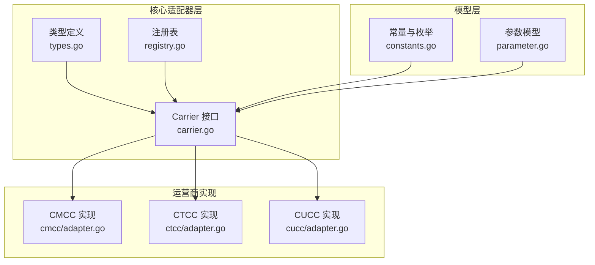
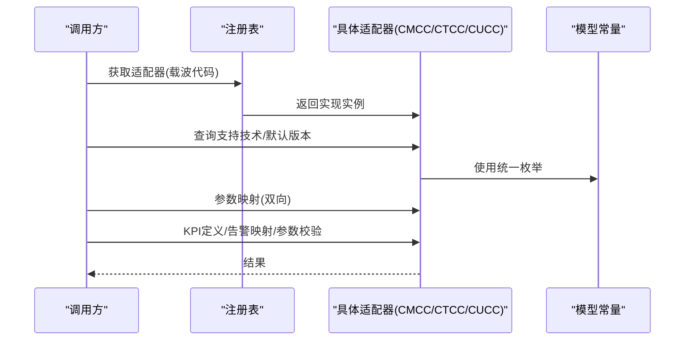
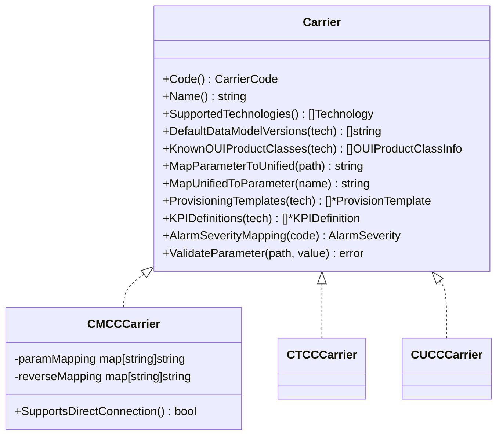
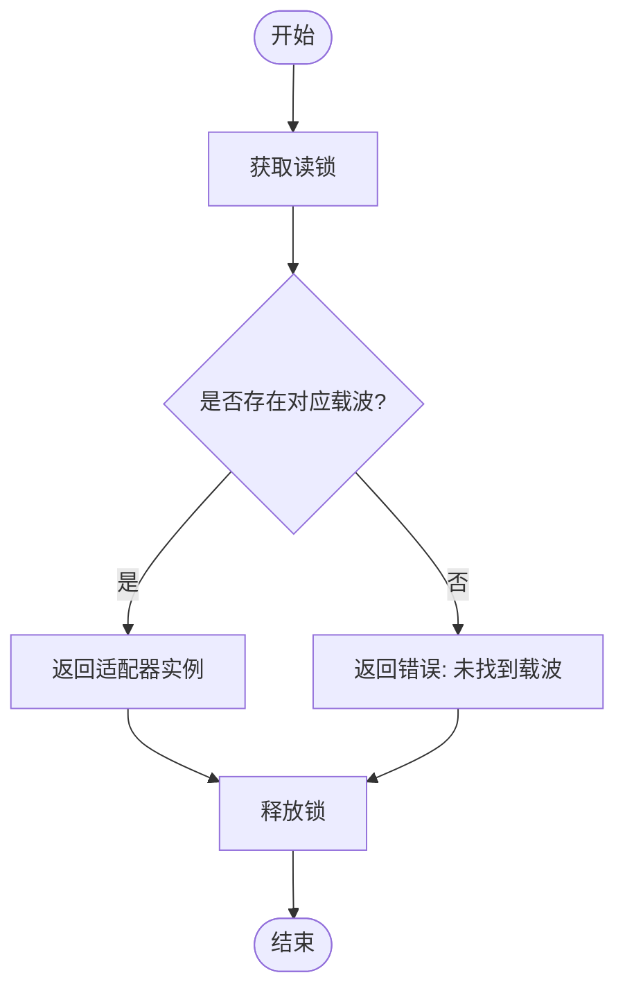
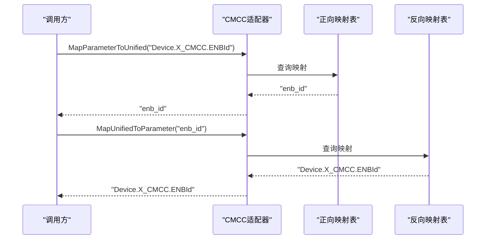
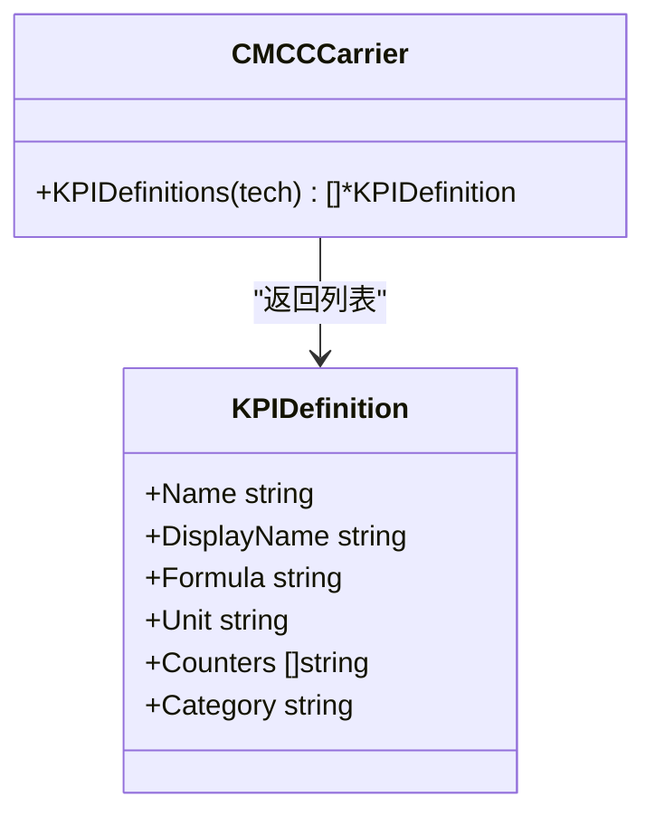
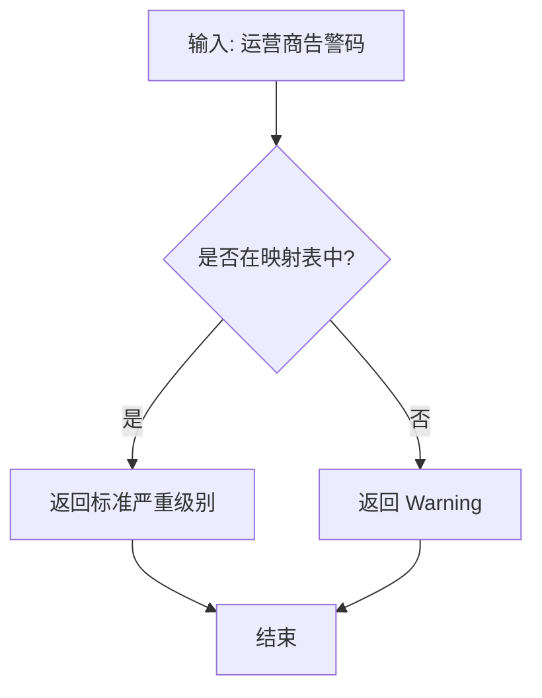
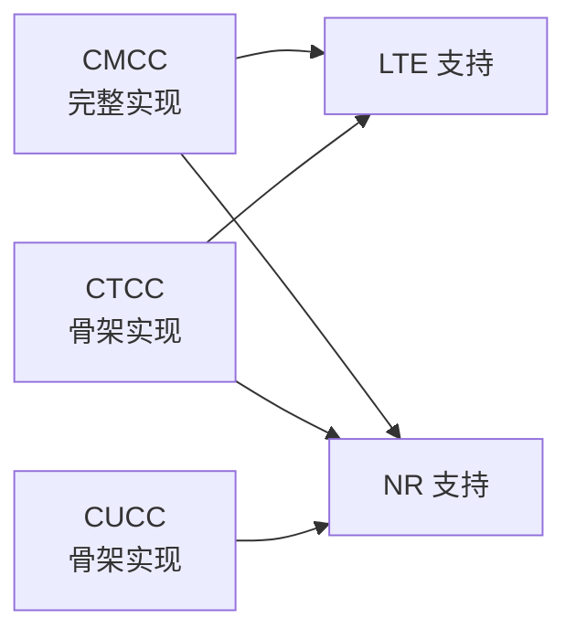
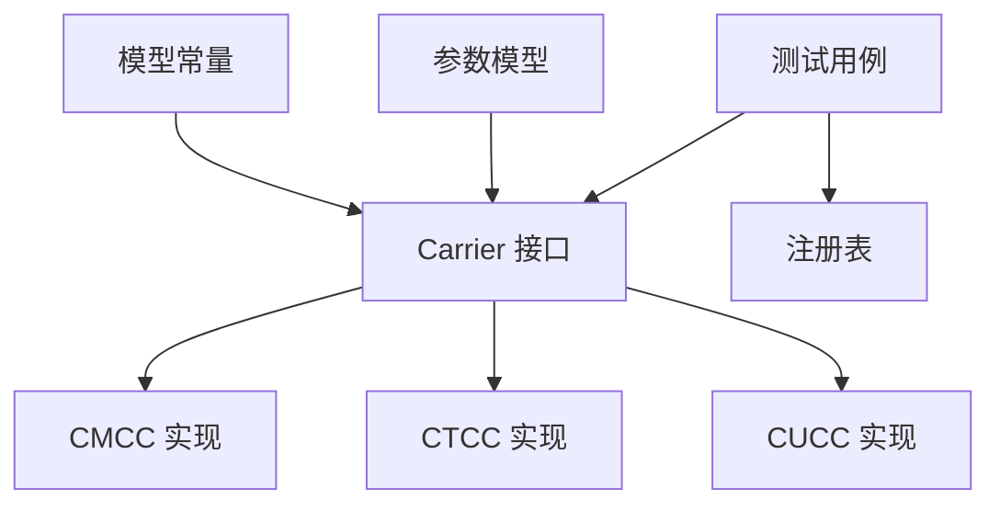

# 适配器架构设计

<cite>
**本文档引用的文件**
- [carrier.go](file://omcgo/internal/core/carrier/carrier.go)
- [types.go](file://omcgo/internal/core/carrier/types.go)
- [registry.go](file://omcgo/internal/core/carrier/registry.go)
- [constants.go](file://omcgo/internal/core/model/constants.go)
- [parameter.go](file://omcgo/internal/core/model/parameter.go)
- [adapter.go (CMCC)](file://omcgo/internal/core/carrier/cmcc/adapter.go)
- [params.go (CMCC)](file://omcgo/internal/core/carrier/cmcc/params.go)
- [kpi.go (CMCC)](file://omcgo/internal/core/carrier/cmcc/kpi.go)
- [defaults.go (CMCC)](file://omcgo/internal/core/carrier/cmcc/defaults.go)
- [adapter.go (CTCC)](file://omcgo/internal/core/carrier/ctcc/adapter.go)
- [adapter.go (CUCC)](file://omcgo/internal/core/carrier/cucc/adapter.go)
- [carrier_test.go](file://omcgo/internal/core/carrier/carrier_test.go)
</cite>

## 目录
1. [简介](#简介)
2. [项目结构](#项目结构)
3. [核心组件](#核心组件)
4. [架构概览](#架构概览)
5. [详细组件分析](#详细组件分析)
6. [依赖关系分析](#依赖关系分析)
7. [性能考虑](#性能考虑)
8. [故障排除指南](#故障排除指南)
9. [结论](#结论)
10. [附录：最佳实践与扩展指南](#附录最佳实践与扩展指南)

## 简介
本文件面向适配器架构设计，系统化阐述Carrier接口的设计理念、适配器注册表机制、参数映射双向转换、KPI定义与告警严重性映射、参数验证等高级能力，并提供可扩展的实现指南。该架构通过统一接口抽象不同运营商的差异，避免在业务层出现硬编码的运营商分支判断，确保系统具备良好的可维护性与可扩展性。

## 项目结构
适配器架构位于核心模块内部，采用按运营商分包的组织方式：
- 接口与通用类型：carrier.go、types.go
- 注册表：registry.go
- 模型常量与枚举：constants.go
- 参数模型：parameter.go
- 运营商实现：cmcc/、ctcc/、cucc/

**图表来源**
- [carrier.go:1-42](file://omcgo/internal/core/carrier/carrier.go#L1-L42)
- [types.go:1-31](file://omcgo/internal/core/carrier/types.go#L1-L31)
- [registry.go:1-78](file://omcgo/internal/core/carrier/registry.go#L1-L78)
- [constants.go:1-70](file://omcgo/internal/core/model/constants.go#L1-L70)
- [parameter.go:1-31](file://omcgo/internal/core/model/parameter.go#L1-L31)
- [adapter.go (CMCC):1-115](file://omcgo/internal/core/carrier/cmcc/adapter.go#L1-L115)
- [adapter.go (CTCC):1-78](file://omcgo/internal/core/carrier/ctcc/adapter.go#L1-L78)
- [adapter.go (CUCC):1-72](file://omcgo/internal/core/carrier/cucc/adapter.go#L1-L72)

**章节来源**
- [carrier.go:1-42](file://omcgo/internal/core/carrier/carrier.go#L1-L42)
- [types.go:1-31](file://omcgo/internal/core/carrier/types.go#L1-L31)
- [registry.go:1-78](file://omcgo/internal/core/carrier/registry.go#L1-L78)
- [constants.go:1-70](file://omcgo/internal/core/model/constants.go#L1-L70)
- [parameter.go:1-31](file://omcgo/internal/core/model/parameter.go#L1-L31)

## 核心组件
- Carrier接口：定义运营商适配器的统一契约，包含标识、名称、支持技术、默认数据模型版本、已知OUI产品类、参数映射、预配置模板、KPI定义、告警严重性映射、参数校验等方法。
- 类型定义：OUIProductClassInfo、ProvisionTemplate、KPIDefinition等，用于承载运营商特定的数据模型与配置信息。
- 注册表：CarrierRegistry负责适配器的注册、查找、遍历与基于OUI的识别。
- 模型常量：统一的枚举（如技术类型、告警级别、设备状态等），保证跨模块一致性。

**章节来源**
- [carrier.go:5-41](file://omcgo/internal/core/carrier/carrier.go#L5-L41)
- [types.go:5-30](file://omcgo/internal/core/carrier/types.go#L5-L30)
- [registry.go:10-77](file://omcgo/internal/core/carrier/registry.go#L10-L77)
- [constants.go:8-70](file://omcgo/internal/core/model/constants.go#L8-L70)

## 架构概览
适配器架构通过接口抽象与注册表解耦，实现“统一接口 + 多实现”的模式。业务层仅依赖Carrier接口，运行时由注册表根据载波代码或OUI选择具体实现。

**图表来源**
- [registry.go:30-48](file://omcgo/internal/core/carrier/registry.go#L30-L48)
- [adapter.go (CMCC):23-80](file://omcgo/internal/core/carrier/cmcc/adapter.go#L23-L80)
- [constants.go:17-43](file://omcgo/internal/core/model/constants.go#L17-L43)

## 详细组件分析

### Carrier接口设计
Carrier接口是适配器架构的核心契约，所有运营商差异均通过此接口暴露。关键方法职责如下：
- Code()/Name()：返回唯一标识与显示名，便于日志与展示。
- SupportedTechnologies()：声明该运营商支持的无线技术集合（如LTE、NR）。
- DefaultDataModelVersions(tech)：返回默认数据模型版本列表，用于设备首次接入时的兼容性匹配。
- KnownOUIProductClasses(tech)：返回已知的厂商OUI与产品类映射，辅助设备识别与归属推断。
- MapParameterToUnified()/MapUnifiedToParameter()：实现参数路径的双向映射，屏蔽不同运营商命名差异。
- ProvisioningTemplates(tech)/KPIDefinitions(tech)：提供默认配置模板与KPI计算公式，支撑自动化配置与性能分析。
- AlarmSeverityMapping()：将运营商特定告警码映射到标准严重级别。
- ValidateParameter(path, value)：执行参数合法性校验，支持运营商特定约束。

**图表来源**
- [carrier.go:8-41](file://omcgo/internal/core/carrier/carrier.go#L8-L41)
- [adapter.go (CMCC):10-21](file://omcgo/internal/core/carrier/cmcc/adapter.go#L10-L21)
- [adapter.go (CTCC):8-13](file://omcgo/internal/core/carrier/ctcc/adapter.go#L8-L13)
- [adapter.go (CUCC):8-14](file://omcgo/internal/core/carrier/cucc/adapter.go#L8-L14)

**章节来源**
- [carrier.go:8-41](file://omcgo/internal/core/carrier/carrier.go#L8-L41)

### 适配器注册表机制
注册表负责适配器的生命周期管理与查找：
- 注册：Register() 将实现注册到内存映射中，键为CarrierCode。
- 查找：Get() 提供安全的读取访问；MustGet() 在未找到时触发异常，适用于初始化阶段。
- 遍历：All() 返回全部适配器实例，用于广播式操作。
- OUI解析：ResolveByOUI() 遍历所有适配器的技术支持与已知OUI，返回首个匹配的载波代码。

并发控制：使用读写锁保护映射，确保高并发场景下的线程安全。

**图表来源**
- [registry.go:30-39](file://omcgo/internal/core/carrier/registry.go#L30-L39)

**章节来源**
- [registry.go:16-77](file://omcgo/internal/core/carrier/registry.go#L16-L77)

### 参数映射机制（双向）
参数映射通过两个方向的映射表实现：
- 正向映射：MapParameterToUnified() 将运营商特定参数路径转换为统一内部名称，便于跨运营商一致处理。
- 反向映射：MapUnifiedToParameter() 将统一名称还原为运营商特定路径，用于下发配置或回显展示。

CMCC实现示例展示了从TR069标准路径到统一名称的映射，以及扩展字段（如ENBId、SiteName等）的映射策略。双向映射保证了参数流转的完整性与可逆性。

**图表来源**
- [adapter.go (CMCC):45-57](file://omcgo/internal/core/carrier/cmcc/adapter.go#L45-L57)
- [params.go (CMCC):3-74](file://omcgo/internal/core/carrier/cmcc/params.go#L3-L74)

**章节来源**
- [adapter.go (CMCC):45-57](file://omcgo/internal/core/carrier/cmcc/adapter.go#L45-L57)
- [params.go (CMCC):3-74](file://omcgo/internal/core/carrier/cmcc/params.go#L3-L74)

### KPI定义与计算
KPI定义通过KPIDefinition结构描述，包含唯一标识、显示名、计算公式、单位、依赖计数器与分类。CMCC实现分别提供LTE与NR的KPI清单，覆盖可接入性、保持性、移动性、利用率、吞吐量等维度。

**图表来源**
- [types.go:22-30](file://omcgo/internal/core/carrier/types.go#L22-L30)
- [kpi.go (CMCC):8-171](file://omcgo/internal/core/carrier/cmcc/kpi.go#L8-L171)

**章节来源**
- [types.go:22-30](file://omcgo/internal/core/carrier/types.go#L22-L30)
- [kpi.go (CMCC):8-171](file://omcgo/internal/core/carrier/cmcc/kpi.go#L8-L171)

### 告警严重性映射
告警严重性映射将运营商特定告警码映射到统一的严重级别（如Critical/Major/Minor/Warning）。CMCC实现提供了常见告警的映射表，未知告警默认为Warning，确保系统的健壮性。

**图表来源**
- [adapter.go (CMCC):67-72](file://omcgo/internal/core/carrier/cmcc/adapter.go#L67-L72)

**章节来源**
- [adapter.go (CMCC):67-72](file://omcgo/internal/core/carrier/cmcc/adapter.go#L67-L72)

### 参数验证
参数验证通过ValidateParameter(path, value)实现，针对特定参数路径应用运营商特有的约束（如PLMNID长度与字符集限制）。未匹配到验证器的参数默认通过，保证扩展性。

**章节来源**
- [adapter.go (CMCC):74-80](file://omcgo/internal/core/carrier/cmcc/adapter.go#L74-L80)

### 运营商实现对比
- CMCC：完整实现参数映射、KPI定义、告警映射、参数验证、默认数据模型版本与OUI产品类，支持LTE与NR。
- CTCC：骨架实现，支持LTE与NR，默认数据模型版本与OUI为空，参数映射与模板待完善。
- CUCC：骨架实现，仅支持NR，其余能力待完善。

**图表来源**
- [adapter.go (CMCC):26-28](file://omcgo/internal/core/carrier/cmcc/adapter.go#L26-L28)
- [adapter.go (CTCC):27-29](file://omcgo/internal/core/carrier/ctcc/adapter.go#L27-L29)
- [adapter.go (CUCC):28-30](file://omcgo/internal/core/carrier/cucc/adapter.go#L28-L30)

**章节来源**
- [adapter.go (CMCC):26-28](file://omcgo/internal/core/carrier/cmcc/adapter.go#L26-L28)
- [adapter.go (CTCC):27-29](file://omcgo/internal/core/carrier/ctcc/adapter.go#L27-L29)
- [adapter.go (CUCC):28-30](file://omcgo/internal/core/carrier/cucc/adapter.go#L28-L30)

## 依赖关系分析
- 接口依赖：所有适配器实现严格依赖Carrier接口，确保行为一致性。
- 模型依赖：统一使用model包中的枚举与常量（如Technology、AlarmSeverity），避免重复定义。
- 数据模型：DeviceParameter与ParameterDefinition用于参数存储与定义，支撑参数映射与校验。
- 测试依赖：carrier_test.go验证注册表、参数映射往返、KPI定义、告警映射与OUI解析等关键流程。

**图表来源**
- [carrier.go:8-41](file://omcgo/internal/core/carrier/carrier.go#L8-L41)
- [constants.go:17-43](file://omcgo/internal/core/model/constants.go#L17-L43)
- [parameter.go:9-30](file://omcgo/internal/core/model/parameter.go#L9-L30)
- [carrier_test.go:15-21](file://omcgo/internal/core/carrier/carrier_test.go#L15-L21)

**章节来源**
- [carrier_test.go:15-21](file://omcgo/internal/core/carrier/carrier_test.go#L15-L21)

## 性能考虑
- 注册表并发：读多写少的场景下，读写锁提供良好性能；建议在启动阶段完成注册，运行时尽量避免频繁注册/注销。
- 映射表缓存：参数映射与告警映射采用内存哈希表，查询复杂度为O(1)，满足高频调用需求。
- 遍历成本：ResolveByOUI()在所有适配器与技术上进行遍历，建议结合KnownOUIProductClasses减少不必要的扫描。
- 扩展性：新增运营商适配器不影响现有实现，仅需实现Carrier接口并注册到注册表。

## 故障排除指南
- 未找到适配器：检查载波代码是否正确，确认已通过Register()注册；使用Get()获取错误信息定位问题。
- 参数映射失败：核对映射表是否包含目标路径；验证双向映射的一致性。
- KPI计算异常：确认KPI定义中的计数器名称与实际可用计数器一致。
- 告警严重性异常：检查告警码是否在映射表中，未知码将被归类为Warning。
- 参数校验失败：根据ValidateParameter返回的错误信息修正参数值或路径。

**章节来源**
- [registry.go:30-39](file://omcgo/internal/core/carrier/registry.go#L30-L39)
- [carrier_test.go:23-46](file://omcgo/internal/core/carrier/carrier_test.go#L23-L46)

## 结论
该适配器架构通过统一接口与注册表机制，有效隔离了运营商差异，实现了参数映射、KPI定义、告警映射与参数验证等核心能力的标准化。CMCC作为完整实现展示了从TR069参数到统一模型的转换路径，为后续扩展CTCC/CUCC及其他运营商适配器奠定了坚实基础。

## 附录：最佳实践与扩展指南

### 最佳实践
- 严格遵循Carrier接口契约，不引入硬编码的运营商分支判断。
- 参数映射应覆盖所有关键参数路径，并保证双向映射的可逆性。
- KPI定义应明确依赖计数器与计算公式，确保可复现与可审计。
- 告警映射应包含常见告警码，未知告警默认为Warning，避免误判。
- 参数验证应针对运营商特定约束编写，提升配置质量与稳定性。

### 扩展指南
- 新增运营商适配器步骤：
  1) 创建新包并实现Carrier接口的所有方法。
  2) 定义参数映射表与KPI定义。
  3) 实现告警严重性映射与参数验证规则。
  4) 在启动阶段调用注册表的Register()完成注册。
- 验证与测试：
  - 使用测试用例验证注册表查找、参数映射往返、KPI定义、告警映射与OUI解析。
  - 对比CMCC实现，确保新增适配器的行为一致性。

**章节来源**
- [carrier.go:8-41](file://omcgo/internal/core/carrier/carrier.go#L8-L41)
- [adapter.go (CMCC):16-21](file://omcgo/internal/core/carrier/cmcc/adapter.go#L16-L21)
- [carrier_test.go:72-157](file://omcgo/internal/core/carrier/carrier_test.go#L72-L157)