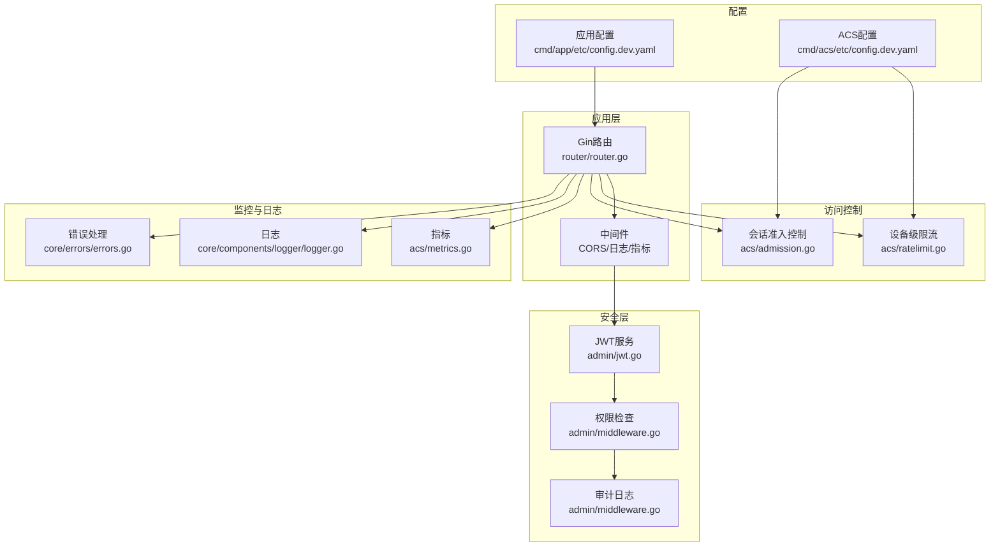
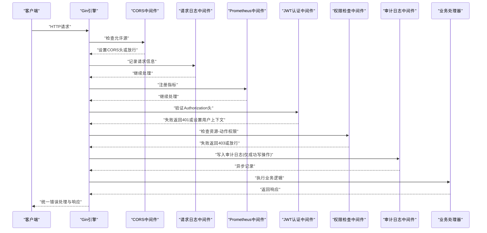
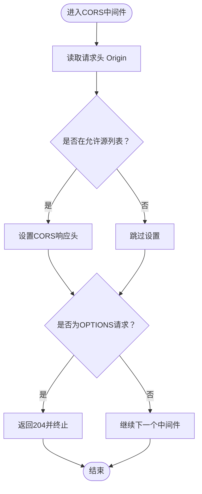
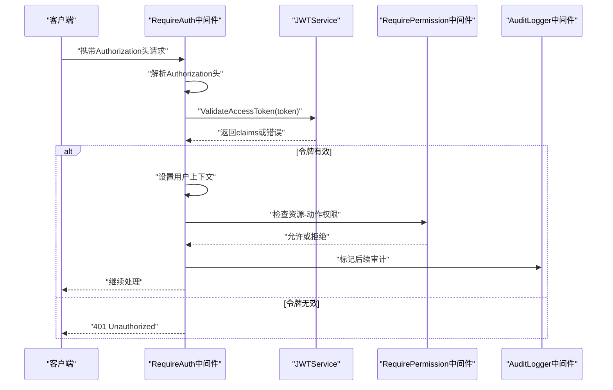
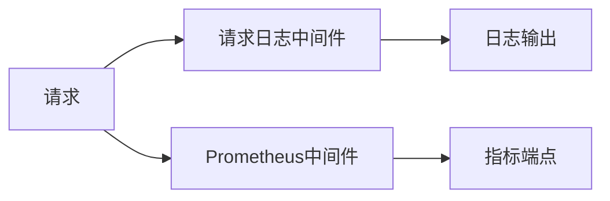
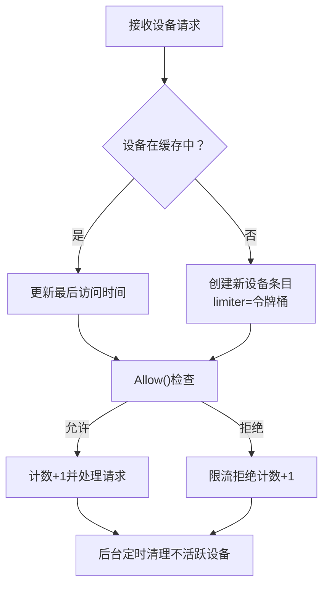
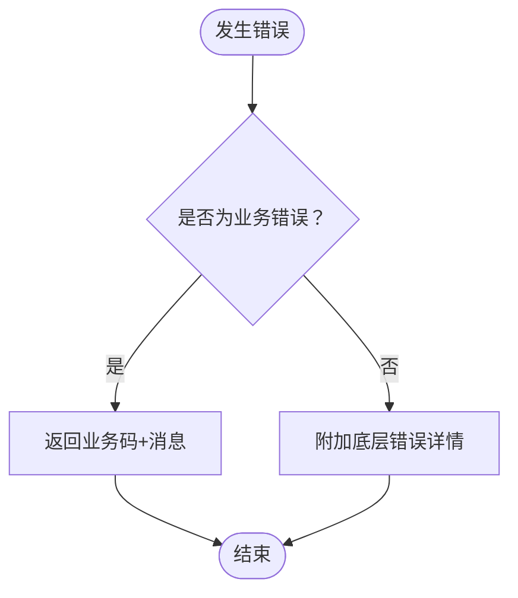
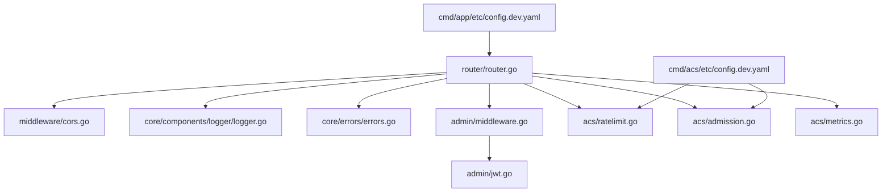

# API安全防护

<cite>
**本文档引用的文件**
- [middleware/cors.go](file://omcgo/internal/core/middleware/cors.go)
- [router/router.go](file://omcgo/cmd/app/router/router.go)
- [admin/middleware.go](file://omcgo/internal/admin/middleware.go)
- [admin/jwt.go](file://omcgo/internal/admin/jwt.go)
- [core/errors/errors.go](file://omcgo/internal/core/errors/errors.go)
- [acs/ratelimit.go](file://omcgo/internal/acs/ratelimit.go)
- [acs/admission.go](file://omcgo/internal/acs/admission.go)
- [acs/metrics.go](file://omcgo/internal/acs/metrics.go)
- [cmd/app/etc/config.dev.yaml](file://omcgo/cmd/app/etc/config.dev.yaml)
- [cmd/acs/etc/config.dev.yaml](file://omcgo/cmd/acs/etc/config.dev.yaml)
- [core/components/logger/logger.go](file://omcgo/internal/core/components/logger/logger.go)
- [api_sprint5_test.go](file://omcgo/test/integration/api_sprint5_test.go)
</cite>

## 目录
1. [简介](#简介)
2. [项目结构](#项目结构)
3. [核心组件](#核心组件)
4. [架构概览](#架构概览)
5. [详细组件分析](#详细组件分析)
6. [依赖分析](#依赖分析)
7. [性能考虑](#性能考虑)
8. [故障排除指南](#故障排除指南)
9. [结论](#结论)
10. [附录](#附录)

## 简介
本文件为Baicells OMC项目的API安全防护文档，聚焦于API安全中间件的实现与配置，涵盖认证中间件、CORS跨域处理、请求日志记录、性能监控等。同时阐述API访问控制策略（IP白名单、请求频率限制、并发连接控制）、输入验证与数据清理机制、API签名验证与防重放攻击、错误处理与信息泄露防护，并提供安全配置指南与性能优化建议。

## 项目结构
OMC后端采用Go-Zero/Gin框架，API安全相关能力主要分布在以下位置：
- 中间件层：CORS处理、请求日志、Prometheus指标
- 认证与授权：JWT服务、权限检查、审计日志
- 访问控制：设备级限流、会话准入控制
- 错误处理：统一错误响应格式
- 配置：应用与ACS服务的运行参数

**图表来源**
- [router/router.go:149-178](file://omcgo/cmd/app/router/router.go#L149-L178)
- [admin/middleware.go:21-120](file://omcgo/internal/admin/middleware.go#L21-L120)
- [admin/jwt.go:12-136](file://omcgo/internal/admin/jwt.go#L12-L136)
- [acs/ratelimit.go:17-76](file://omcgo/internal/acs/ratelimit.go#L17-L76)
- [acs/admission.go:5-41](file://omcgo/internal/acs/admission.go#L5-L41)
- [cmd/app/etc/config.dev.yaml:57-61](file://omcgo/cmd/app/etc/config.dev.yaml#L57-L61)
- [cmd/acs/etc/config.dev.yaml:17-22](file://omcgo/cmd/acs/etc/config.dev.yaml#L17-L22)

**章节来源**
- [router/router.go:149-178](file://omcgo/cmd/app/router/router.go#L149-L178)
- [cmd/app/etc/config.dev.yaml:57-61](file://omcgo/cmd/app/etc/config.dev.yaml#L57-L61)

## 核心组件
本节概述API安全的关键组件及其职责：

- CORS跨域中间件：基于配置的允许源列表进行跨域处理，支持预检OPTIONS请求。
- 请求日志中间件：统一记录请求上下文信息，便于审计与问题排查。
- Prometheus指标中间件：暴露标准指标端点，便于外部监控系统采集。
- JWT认证与授权：令牌签发、校验、权限检查与审计日志。
- 设备级限流：基于LRU缓存的令牌桶限流，按设备维度控制请求速率。
- 会话准入控制：限制并发ACS会话总数，防止资源耗尽。
- 统一错误处理：标准化错误响应，避免敏感信息泄露。
- 日志系统：支持多输出路径与轮转，生产环境推荐JSON格式与文件轮转。

**章节来源**
- [middleware/cors.go:14-38](file://omcgo/internal/core/middleware/cors.go#L14-L38)
- [router/router.go:149-178](file://omcgo/cmd/app/router/router.go#L149-L178)
- [admin/jwt.go:12-136](file://omcgo/internal/admin/jwt.go#L12-L136)
- [admin/middleware.go:21-120](file://omcgo/internal/admin/middleware.go#L21-L120)
- [acs/ratelimit.go:17-76](file://omcgo/internal/acs/ratelimit.go#L17-L76)
- [acs/admission.go:5-41](file://omcgo/internal/acs/admission.go#L5-L41)
- [core/errors/errors.go:58-111](file://omcgo/internal/core/errors/errors.go#L58-L111)
- [core/components/logger/logger.go:16-97](file://omcgo/internal/core/components/logger/logger.go#L16-L97)

## 架构概览
下图展示API安全在请求处理链中的位置与交互关系：

**图表来源**
- [router/router.go:149-178](file://omcgo/cmd/app/router/router.go#L149-L178)
- [admin/middleware.go:21-120](file://omcgo/internal/admin/middleware.go#L21-L120)
- [core/errors/errors.go:66-88](file://omcgo/internal/core/errors/errors.go#L66-L88)

## 详细组件分析

### CORS跨域处理
- 配置来源：应用配置中的允许源列表，若为空则回退到默认值。
- 处理逻辑：根据请求Origin匹配允许源，设置标准CORS响应头；对OPTIONS预检请求直接返回状态码。
- 测试覆盖：集成测试验证不同Origin的允许/拒绝行为及预检响应。

**图表来源**
- [middleware/cors.go:14-38](file://omcgo/internal/core/middleware/cors.go#L14-L38)
- [router/router.go:154-156](file://omcgo/cmd/app/router/router.go#L154-L156)
- [api_sprint5_test.go:14-77](file://omcgo/test/integration/api_sprint5_test.go#L14-L77)

**章节来源**
- [middleware/cors.go:14-38](file://omcgo/internal/core/middleware/cors.go#L14-L38)
- [router/router.go:154-156](file://omcgo/cmd/app/router/router.go#L154-L156)
- [cmd/app/etc/config.dev.yaml:57-61](file://omcgo/cmd/app/etc/config.dev.yaml#L57-L61)
- [api_sprint5_test.go:14-77](file://omcgo/test/integration/api_sprint5_test.go#L14-L77)

### 认证中间件与JWT服务
- 认证流程：要求Authorization头为Bearer Token，校验失败返回401；成功则将用户信息写入请求上下文。
- 权限检查：基于用户ID与资源-动作组合检查RBAC权限，未授权返回403。
- 审计日志：仅对成功的写操作（POST/PUT/PATCH/DELETE）记录审计事件，异步写入以避免阻塞。
- JWT服务：支持生成访问/刷新令牌对，设置过期时间，使用HS256签名算法进行验证。

**图表来源**
- [admin/middleware.go:21-120](file://omcgo/internal/admin/middleware.go#L21-L120)
- [admin/jwt.go:98-135](file://omcgo/internal/admin/jwt.go#L98-L135)

**章节来源**
- [admin/middleware.go:21-120](file://omcgo/internal/admin/middleware.go#L21-L120)
- [admin/jwt.go:98-135](file://omcgo/internal/admin/jwt.go#L98-L135)
- [cmd/app/etc/config.dev.yaml:52-55](file://omcgo/cmd/app/etc/config.dev.yaml#L52-L55)

### 请求日志记录与性能监控
- 请求日志：记录请求方法、路径、客户端IP、User-Agent等，便于审计与问题定位。
- Prometheus指标：注册指标端点，暴露服务健康与性能指标，供外部监控系统抓取。
- 应用配置：可通过配置文件设置指标端口与日志级别、格式与输出路径。

**图表来源**
- [router/router.go:157-158](file://omcgo/cmd/app/router/router.go#L157-L158)

**章节来源**
- [router/router.go:157-158](file://omcgo/cmd/app/router/router.go#L157-L158)
- [cmd/app/etc/config.dev.yaml:70-76](file://omcgo/cmd/app/etc/config.dev.yaml#L70-L76)

### 访问控制策略
- 设备级限流（ACS侧）：基于LRU缓存的令牌桶实现，支持突发容量与设备数量上限，后台定时清理不活跃设备。
- 会话准入控制（ACS侧）：限制并发会话总数，采用原子计数与CAS保证并发安全。
- 应用侧访问控制：结合JWT与RBAC中间件，确保只有具备相应权限的用户才能访问受保护资源。

**图表来源**
- [acs/ratelimit.go:59-76](file://omcgo/internal/acs/ratelimit.go#L59-L76)
- [acs/ratelimit.go:81-128](file://omcgo/internal/acs/ratelimit.go#L81-L128)
- [acs/admission.go:19-35](file://omcgo/internal/acs/admission.go#L19-L35)

**章节来源**
- [acs/ratelimit.go:17-144](file://omcgo/internal/acs/ratelimit.go#L17-L144)
- [acs/admission.go:5-41](file://omcgo/internal/acs/admission.go#L5-L41)
- [cmd/acs/etc/config.dev.yaml:17-22](file://omcgo/cmd/acs/etc/config.dev.yaml#L17-L22)

### 错误处理与信息泄露防护
- 统一错误响应：定义标准JSON结构，包含业务码、消息与可选详情；支持将业务错误映射到HTTP状态码。
- 敏感信息保护：非业务错误时才附加底层错误详情，避免堆栈信息泄露；统一使用HTTP状态文本作为消息主体。
- 404统一处理：未匹配路由统一返回JSON 404。

**图表来源**
- [core/errors/errors.go:58-111](file://omcgo/internal/core/errors/errors.go#L58-L111)

**章节来源**
- [core/errors/errors.go:58-111](file://omcgo/internal/core/errors/errors.go#L58-L111)
- [router/router.go:160-163](file://omcgo/cmd/app/router/router.go#L160-L163)

### 输入验证与数据清理机制
- 参数校验：建议在各业务处理器中对输入参数进行类型、范围与格式校验，结合数据库约束与ORM层验证。
- SQL注入防护：使用ORM/参数化查询，避免动态拼接SQL；对用户输入进行白名单过滤与长度限制。
- XSS防护：对输出内容进行HTML转义，设置安全响应头（如Content-Security-Policy），限制可执行脚本来源。
- 数据清理：对上传文件与日志内容进行脱敏处理，避免敏感信息泄露。

[本节为通用实践指导，不直接分析具体文件，故无章节来源]

### API签名验证与防重放攻击
- 时间戳验证：要求请求包含时间戳，服务端允许一定的时间窗口（如±5分钟）以容忍网络延迟。
- 随机数/Nonce：每次请求携带唯一随机数，服务端去重存储，防止重放。
- 签名算法：使用HMAC-SHA256对请求参数（排序后的键值对）与密钥计算签名，服务端复算比对。
- 密钥管理：密钥应定期轮换，存储在安全的密钥管理系统中，传输过程使用TLS加密。

[本节为通用实践指导，不直接分析具体文件，故无章节来源]

## 依赖分析
API安全相关组件之间的依赖关系如下：

**图表来源**
- [router/router.go:149-178](file://omcgo/cmd/app/router/router.go#L149-L178)
- [admin/middleware.go:21-120](file://omcgo/internal/admin/middleware.go#L21-L120)
- [admin/jwt.go:12-136](file://omcgo/internal/admin/jwt.go#L12-L136)
- [acs/ratelimit.go:17-76](file://omcgo/internal/acs/ratelimit.go#L17-L76)
- [acs/admission.go:5-41](file://omcgo/internal/acs/admission.go#L5-L41)
- [cmd/app/etc/config.dev.yaml:57-61](file://omcgo/cmd/app/etc/config.dev.yaml#L57-L61)
- [cmd/acs/etc/config.dev.yaml:17-22](file://omcgo/cmd/acs/etc/config.dev.yaml#L17-L22)

**章节来源**
- [router/router.go:149-178](file://omcgo/cmd/app/router/router.go#L149-L178)
- [cmd/app/etc/config.dev.yaml:57-61](file://omcgo/cmd/app/etc/config.dev.yaml#L57-L61)
- [cmd/acs/etc/config.dev.yaml:17-22](file://omcgo/cmd/acs/etc/config.dev.yaml#L17-L22)

## 性能考虑
- 中间件顺序：CORS与日志等轻量中间件置于前部，认证与权限检查位于关键路径之前，避免重复计算。
- 异步审计：审计日志采用fire-and-forget方式，降低写操作对主路径的影响。
- 限流与准入：合理设置设备级限流参数与并发会话上限，结合后台清理减少内存占用。
- 指标监控：开启Prometheus指标端点，配合外部监控系统进行容量规划与异常告警。
- 日志轮转：生产环境启用文件轮转，控制单文件大小与保留周期，避免磁盘压力。

[本节提供通用性能建议，不直接分析具体文件，故无章节来源]

## 故障排除指南
- CORS问题：确认配置文件中的允许源与实际请求Origin一致；检查预检请求是否正确返回。
- 认证失败：核对Authorization头格式与令牌有效性；检查JWT密钥与过期时间配置。
- 权限不足：确认用户角色与资源-动作权限映射；检查审计日志是否记录了正确的用户名与IP。
- 限流触发：检查设备级限流参数与后台清理配置；关注指标中限流拒绝计数。
- 错误响应异常：确认业务错误码映射与HTTP状态码一致性；避免在生产环境输出堆栈详情。

**章节来源**
- [api_sprint5_test.go:14-77](file://omcgo/test/integration/api_sprint5_test.go#L14-L77)
- [core/errors/errors.go:90-110](file://omcgo/internal/core/errors/errors.go#L90-L110)

## 结论
OMC项目的API安全体系通过CORS、认证授权、审计日志、设备级限流与会话准入控制等多层防护，结合统一错误处理与日志监控，形成了较为完整的安全基线。建议在现有基础上进一步完善输入验证、SQL注入与XSS防护、API签名与防重放机制，并持续优化性能与可观测性。

## 附录

### API安全配置清单
- CORS允许源：确保仅包含可信域名，避免使用通配符。
- JWT密钥：生产环境必须使用足够强度的密钥并定期轮换。
- 限流参数：根据设备规模与业务峰值调整每设备每分钟限额与突发容量。
- 并发会话：根据服务器资源设定最大并发会话数。
- 指标端口：开放Prometheus端口以便外部抓取。
- 日志配置：生产环境使用JSON格式与文件轮转，避免敏感信息泄露。

**章节来源**
- [cmd/app/etc/config.dev.yaml:57-61](file://omcgo/cmd/app/etc/config.dev.yaml#L57-L61)
- [cmd/app/etc/config.dev.yaml:52-55](file://omcgo/cmd/app/etc/config.dev.yaml#L52-L55)
- [cmd/acs/etc/config.dev.yaml:17-22](file://omcgo/cmd/acs/etc/config.dev.yaml#L17-L22)
- [cmd/app/etc/config.dev.yaml:70-76](file://omcgo/cmd/app/etc/config.dev.yaml#L70-L76)