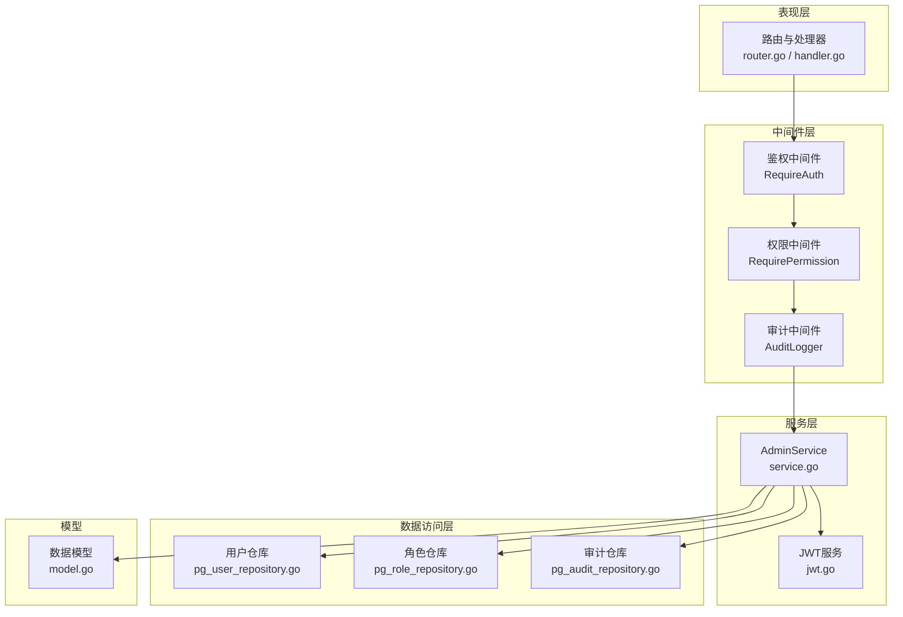
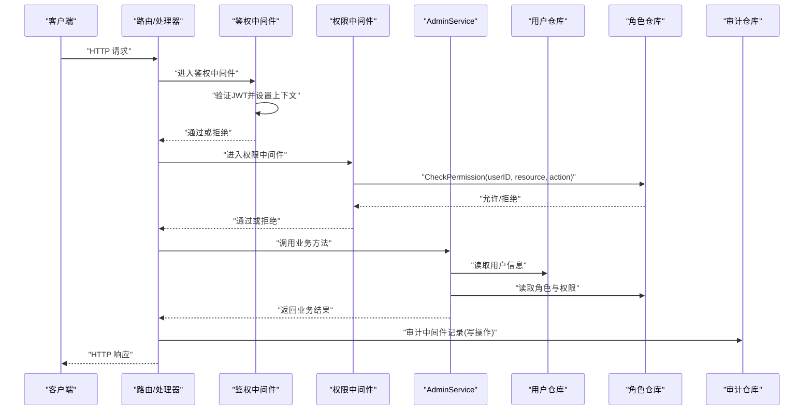
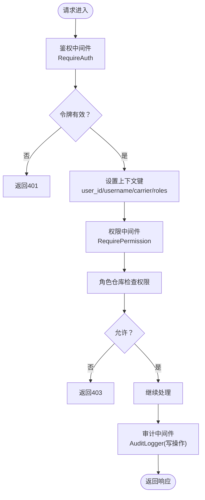
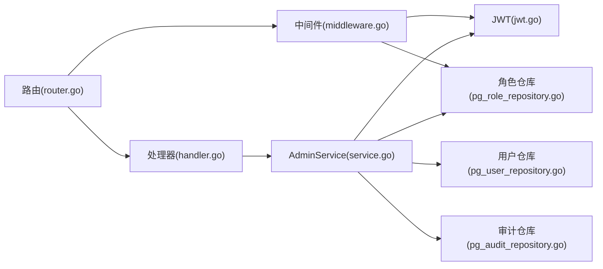

# RBAC访问控制

<cite>
**本文档引用的文件**
- [omcgo/docs/detailed-design/17-admin-rbac.md](file://omcgo/docs/detailed-design/17-admin-rbac.md)
- [omcgo/internal/admin/middleware.go](file://omcgo/internal/admin/middleware.go)
- [omcgo/internal/admin/service.go](file://omcgo/internal/admin/service.go)
- [omcgo/internal/admin/model.go](file://omcgo/internal/admin/model.go)
- [omcgo/internal/admin/pg_role_repository.go](file://omcgo/internal/admin/pg_role_repository.go)
- [omcgo/internal/admin/pg_user_repository.go](file://omcgo/internal/admin/pg_user_repository.go)
- [omcgo/internal/admin/pg_audit_repository.go](file://omcgo/internal/admin/pg_audit_repository.go)
- [omcgo/internal/admin/jwt.go](file://omcgo/internal/admin/jwt.go)
- [omcgo/internal/admin/handler.go](file://omcgo/internal/admin/handler.go)
- [omcgo/cmd/app/router/router.go](file://omcgo/cmd/app/router/router.go)
- [omcgo/internal/core/middleware/auth.go](file://omcgo/internal/core/middleware/auth.go)
- [omcgo/internal/admin/middleware_test.go](file://omcgo/internal/admin/middleware_test.go)
</cite>

## 目录
1. [简介](#简介)
2. [项目结构](#项目结构)
3. [核心组件](#核心组件)
4. [架构总览](#架构总览)
5. [详细组件分析](#详细组件分析)
6. [依赖关系分析](#依赖关系分析)
7. [性能考虑](#性能考虑)
8. [故障排除指南](#故障排除指南)
9. [结论](#结论)
10. [附录](#附录)

## 简介
本文件面向Baicells OMC项目的RBAC（基于角色的访问控制）实现，系统性阐述RBAC模型设计理念、权限中间件工作原理、角色与权限分配策略、资源访问控制机制，并提供权限配置指南与故障排除建议。RBAC在OMC项目中通过JWT认证、权限中间件、角色-权限存储与审计日志共同构成安全体系，确保API端点保护、数据访问限制与操作可追溯。

## 项目结构
RBAC相关代码主要位于后端服务的admin子系统内，采用分层架构：
- 表现层：路由与处理器，负责REST API入口与业务编排
- 中间件层：鉴权与权限校验中间件，贯穿请求生命周期
- 服务层：AdminService封装登录、令牌刷新、用户/角色/权限管理、审计日志
- 数据访问层：PostgreSQL仓库实现用户、角色、权限、审计日志的持久化
- 模型与常量：统一的数据结构定义与过滤参数

图表来源
- [omcgo/cmd/app/router/router.go:340-349](file://omcgo/cmd/app/router/router.go#L340-L349)
- [omcgo/internal/admin/handler.go:35-63](file://omcgo/internal/admin/handler.go#L35-L63)
- [omcgo/internal/admin/middleware.go:21-167](file://omcgo/internal/admin/middleware.go#L21-L167)
- [omcgo/internal/admin/service.go:15-353](file://omcgo/internal/admin/service.go#L15-L353)
- [omcgo/internal/admin/jwt.go:12-136](file://omcgo/internal/admin/jwt.go#L12-L136)
- [omcgo/internal/admin/pg_user_repository.go:25-328](file://omcgo/internal/admin/pg_user_repository.go#L25-L328)
- [omcgo/internal/admin/pg_role_repository.go:16-358](file://omcgo/internal/admin/pg_role_repository.go#L16-L358)
- [omcgo/internal/admin/pg_audit_repository.go:16-155](file://omcgo/internal/admin/pg_audit_repository.go#L16-L155)
- [omcgo/internal/admin/model.go:10-158](file://omcgo/internal/admin/model.go#L10-L158)

章节来源
- [omcgo/cmd/app/router/router.go:340-349](file://omcgo/cmd/app/router/router.go#L340-L349)
- [omcgo/internal/admin/handler.go:35-63](file://omcgo/internal/admin/handler.go#L35-L63)

## 核心组件
- 用户(User)：系统使用者，具备用户名、显示名、邮箱、运营商绑定、状态与角色集合
- 角色(Role)：命名实体，包含名称、描述、是否系统内置、权限列表
- 权限(Permission)：资源-动作对，如设备读取、告警写入等
- Token(Claims/TokenPair)：JWT承载用户身份、角色与运营商信息，支持访问/刷新令牌
- 审计(AuditLog)：记录用户对资源的操作行为，便于合规与追踪

章节来源
- [omcgo/docs/detailed-design/17-admin-rbac.md:54-97](file://omcgo/docs/detailed-design/17-admin-rbac.md#L54-L97)
- [omcgo/internal/admin/model.go:18-80](file://omcgo/internal/admin/model.go#L18-L80)

## 架构总览
RBAC整体流程：客户端发起受保护请求 → 鉴权中间件校验JWT → 权限中间件按资源-动作检查 → 服务层执行业务逻辑 → 审计中间件记录成功写操作 → 返回响应。

图表来源
- [omcgo/internal/admin/middleware.go:21-167](file://omcgo/internal/admin/middleware.go#L21-L167)
- [omcgo/internal/admin/service.go:41-116](file://omcgo/internal/admin/service.go#L41-L116)
- [omcgo/internal/admin/pg_role_repository.go:338-357](file://omcgo/internal/admin/pg_role_repository.go#L338-L357)
- [omcgo/internal/admin/pg_audit_repository.go:122-166](file://omcgo/internal/admin/pg_audit_repository.go#L122-L166)

## 详细组件分析

### 鉴权与权限中间件
- 鉴权中间件RequireAuth：从Authorization头解析Bearer Token，调用JWT服务验证访问令牌，成功则将用户ID、用户名、运营商、角色注入请求上下文
- 权限中间件RequirePermission：从上下文中取出用户ID，调用角色仓库进行资源-动作权限检查；失败返回403，成功放行
- 运营商过滤中间件RequireCarrier：根据用户绑定的运营商设置过滤键，未绑定时视为超级管理员
- 审计中间件AuditLogger：对GET/HEAD/OPTIONS之外的成功写操作异步记录审计日志

图表来源
- [omcgo/internal/admin/middleware.go:21-167](file://omcgo/internal/admin/middleware.go#L21-L167)
- [omcgo/internal/admin/pg_role_repository.go:338-357](file://omcgo/internal/admin/pg_role_repository.go#L338-L357)

章节来源
- [omcgo/internal/admin/middleware.go:21-167](file://omcgo/internal/admin/middleware.go#L21-L167)

### JWT服务与令牌管理
- 支持生成访问/刷新令牌对，设置签发时间、过期时间与唯一ID
- 验证访问/刷新令牌，校验签名与主题类型(subject)，返回Claims
- 默认访问令牌有效期与刷新令牌有效期可配置

章节来源
- [omcgo/internal/admin/jwt.go:12-136](file://omcgo/internal/admin/jwt.go#L12-L136)

### 用户与角色服务
- 登录：校验用户状态与密码，加载角色，签发令牌对
- 刷新：验证刷新令牌，重新加载角色，签发新令牌对
- 用户管理：增删改查、重置密码、锁定/解锁
- 角色管理：增删改查、分配/移除角色、列出所有权限
- 权限检查：对外暴露CheckPermission供服务层使用

章节来源
- [omcgo/internal/admin/service.go:41-353](file://omcgo/internal/admin/service.go#L41-L353)

### 数据模型与数据库Schema
- 用户：包含用户名、密码哈希、显示名、邮箱、运营商、状态、角色集合
- 角色：名称、描述、是否系统内置、权限列表
- 权限：资源、动作
- 审计日志：用户标识、动作、资源、资源ID、详情、IP、UA、时间戳
- 数据库表：users、roles、user_roles、permissions、audit_logs，含索引与约束

章节来源
- [omcgo/docs/detailed-design/17-admin-rbac.md:111-160](file://omcgo/docs/detailed-design/17-admin-rbac.md#L111-L160)
- [omcgo/internal/admin/model.go:18-80](file://omcgo/internal/admin/model.go#L18-L80)

### 仓储层实现
- 用户仓库：提供CRUD、分页查询、密码更新、最后登录时间更新
- 角色仓库：提供CRUD、用户角色查询、权限增删改查、权限检查
- 审计仓库：提供创建与分页查询

章节来源
- [omcgo/internal/admin/pg_user_repository.go:25-328](file://omcgo/internal/admin/pg_user_repository.go#L25-L328)
- [omcgo/internal/admin/pg_role_repository.go:16-358](file://omcgo/internal/admin/pg_role_repository.go#L16-L358)
- [omcgo/internal/admin/pg_audit_repository.go:16-155](file://omcgo/internal/admin/pg_audit_repository.go#L16-L155)

### API路由与权限保护
- 路由注册处对/admin组启用RequirePermission中间件，限定资源为“users”，动作为“admin”
- 处理器注册了用户与角色管理、权限列表、审计日志查询等端点

章节来源
- [omcgo/cmd/app/router/router.go:344-347](file://omcgo/cmd/app/router/router.go#L344-L347)
- [omcgo/internal/admin/handler.go:35-63](file://omcgo/internal/admin/handler.go#L35-L63)

### 权限中间件测试
- 测试覆盖：鉴权通过且拥有目标权限时返回200；鉴权通过但无权限返回403；鉴权失败返回401
- 使用模拟角色仓库回调，按userID/resource/action返回允许/拒绝

章节来源
- [omcgo/internal/admin/middleware_test.go:138-185](file://omcgo/internal/admin/middleware_test.go#L138-L185)

## 依赖关系分析
- 组件耦合
  - 路由依赖AdminService与仓库接口，AdminService依赖用户/角色/审计仓库与JWT服务
  - 中间件依赖JWT服务与角色仓库接口
  - 仓储层依赖PostgreSQL连接池
- 依赖方向
  - Handler → AdminService → Repositories/JWT
  - Middleware → JWTService/RoleRepository
  - Repositories → 数据库
- 循环依赖
  - 未发现循环依赖，层次清晰

图表来源
- [omcgo/internal/admin/handler.go:35-63](file://omcgo/internal/admin/handler.go#L35-L63)
- [omcgo/internal/admin/service.go:15-35](file://omcgo/internal/admin/service.go#L15-L35)
- [omcgo/internal/admin/middleware.go:21-167](file://omcgo/internal/admin/middleware.go#L21-L167)
- [omcgo/internal/admin/jwt.go:12-46](file://omcgo/internal/admin/jwt.go#L12-L46)
- [omcgo/internal/admin/pg_user_repository.go:25-35](file://omcgo/internal/admin/pg_user_repository.go#L25-L35)
- [omcgo/internal/admin/pg_role_repository.go:16-26](file://omcgo/internal/admin/pg_role_repository.go#L16-L26)
- [omcgo/internal/admin/pg_audit_repository.go:16-26](file://omcgo/internal/admin/pg_audit_repository.go#L16-L26)
- [omcgo/cmd/app/router/router.go:344-347](file://omcgo/cmd/app/router/router.go#L344-L347)

## 性能考虑
- 权限检查复杂度
  - 角色仓库的权限检查为单表关联查询，包含COUNT聚合，时间复杂度近似O(1)（依赖索引与连接优化）
- 缓存机制
  - 当前实现未内置权限缓存；可在高并发场景引入Redis缓存用户权限集合，降低数据库压力
- 审计日志
  - 审计中间件采用fire-and-forget异步写入，避免阻塞主响应链路
- 分页与过滤
  - 用户与审计日志均支持分页与多字段过滤，建议在高频查询上增加合适索引

[本节为通用性能讨论，不直接分析具体文件]

## 故障排除指南
- 401 未授权
  - 检查Authorization头格式是否为Bearer Token
  - 确认JWT密钥一致、令牌未过期
- 403 权限不足
  - 确认用户已分配对应角色与权限
  - 检查资源与动作是否匹配（如“users:admin”）
- 404 资源不存在
  - 检查用户ID/角色ID是否存在
- 500 内部错误
  - 查看服务日志，确认数据库连接与SQL构建是否异常
- 审计日志缺失
  - 仅记录成功写操作（POST/PUT/PATCH/DELETE），且状态码需<400

章节来源
- [omcgo/internal/admin/middleware.go:21-167](file://omcgo/internal/admin/middleware.go#L21-L167)
- [omcgo/internal/admin/middleware_test.go:138-185](file://omcgo/internal/admin/middleware_test.go#L138-L185)

## 结论
OMC项目的RBAC以清晰的分层架构实现：JWT负责身份鉴别，中间件负责请求级鉴权与权限校验，服务层协调业务与数据访问，仓储层提供稳定的持久化能力。当前实现满足基本的用户管理、角色权限与审计需求，后续可在权限缓存、细粒度资源隔离与权限继承等方面进一步增强。

[本节为总结性内容，不直接分析具体文件]

## 附录

### RBAC模型与实现要点
- 模型要素
  - 用户：身份标识、状态、角色集合
  - 角色：权限集合的载体
  - 权限：资源-动作对
- 实现特性
  - JWT访问/刷新令牌
  - 中间件级权限检查
  - 审计日志记录
  - 运营商维度的数据隔离

章节来源
- [omcgo/docs/detailed-design/17-admin-rbac.md:10-23](file://omcgo/docs/detailed-design/17-admin-rbac.md#L10-L23)
- [omcgo/internal/admin/model.go:18-80](file://omcgo/internal/admin/model.go#L18-L80)

### 权限中间件工作原理
- 鉴权阶段：RequireAuth解析并验证JWT，注入用户上下文
- 权限阶段：RequirePermission调用CheckPermission进行资源-动作校验
- 错误处理：统一返回HTTP状态码与错误信息
- 审计阶段：AuditLogger对写操作异步记录

章节来源
- [omcgo/internal/admin/middleware.go:21-167](file://omcgo/internal/admin/middleware.go#L21-L167)

### 角色定义与权限分配策略
- 内置角色：系统角色不可删除
- 自定义角色：可创建、修改、删除，支持批量赋予权限
- 动态权限授予：通过AssignRole/RemoveRole实时调整用户角色

章节来源
- [omcgo/internal/admin/pg_role_repository.go:126-151](file://omcgo/internal/admin/pg_role_repository.go#L126-L151)
- [omcgo/internal/admin/service.go:207-221](file://omcgo/internal/admin/service.go#L207-L221)

### 资源访问控制机制
- API端点保护：/admin组强制要求“users:admin”权限
- 数据访问限制：RequireCarrier中间件按用户运营商设置过滤键
- 操作权限验证：权限中间件在每个受保护端点生效

章节来源
- [omcgo/cmd/app/router/router.go:344-347](file://omcgo/cmd/app/router/router.go#L344-L347)
- [omcgo/internal/admin/middleware.go:103-120](file://omcgo/internal/admin/middleware.go#L103-L120)

### 权限配置指南
- 权限矩阵设计
  - 资源：如users、devices、alarms、pm、config、datamodels
  - 动作：read、write、delete、admin
- 角色映射
  - 管理员：users:admin
  - 运营商视图：按运营商绑定过滤
- 权限审计
  - 审计日志查询支持按用户、动作、资源、时间范围筛选

章节来源
- [omcgo/docs/detailed-design/17-admin-rbac.md:162-172](file://omcgo/docs/detailed-design/17-admin-rbac.md#L162-L172)
- [omcgo/internal/admin/pg_audit_repository.go:52-154](file://omcgo/internal/admin/pg_audit_repository.go#L52-L154)

### 实际配置示例（步骤说明）
- 步骤1：创建角色并赋予权限（如“users:admin”）
- 步骤2：为用户分配角色
- 步骤3：登录获取访问令牌
- 步骤4：携带令牌访问/admin受保护端点
- 步骤5：通过审计日志查询验证操作记录

章节来源
- [omcgo/internal/admin/service.go:276-302](file://omcgo/internal/admin/service.go#L276-L302)
- [omcgo/internal/admin/handler.go:35-63](file://omcgo/internal/admin/handler.go#L35-L63)
- [omcgo/internal/admin/pg_audit_repository.go:52-154](file://omcgo/internal/admin/pg_audit_repository.go#L52-L154)