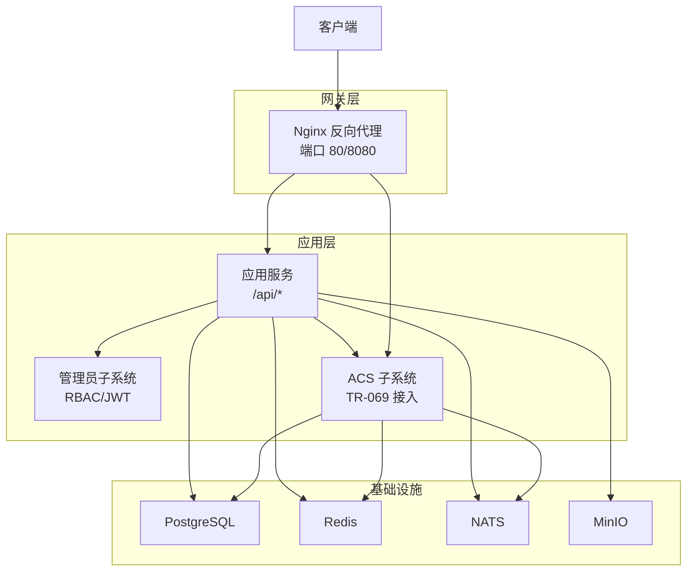
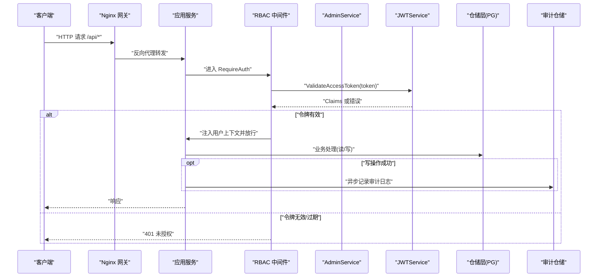
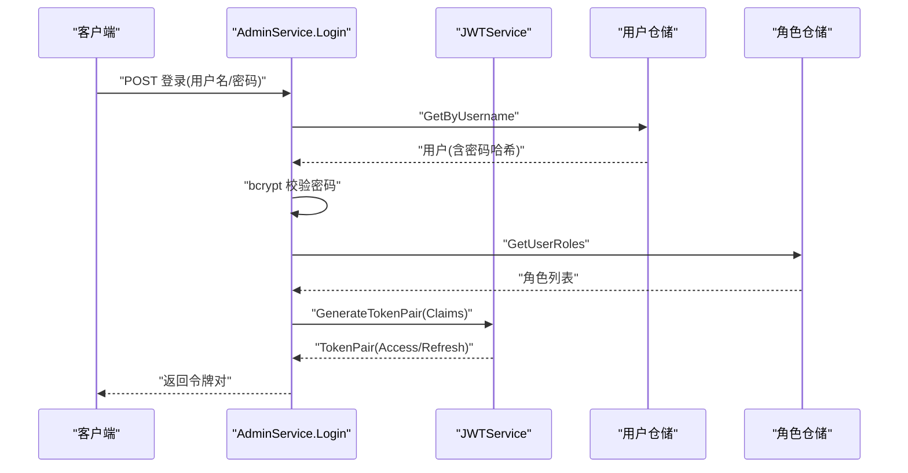
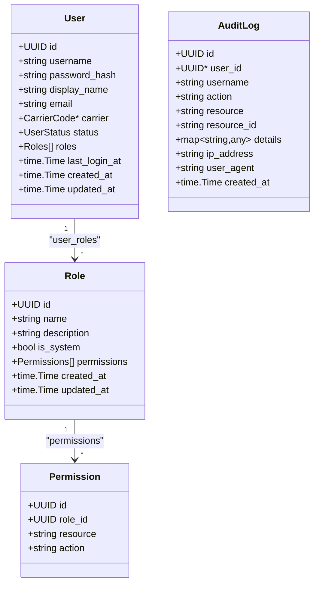
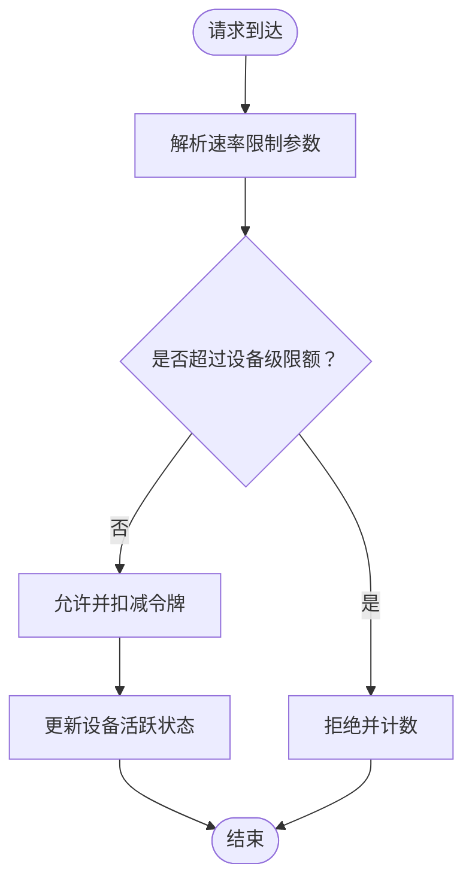
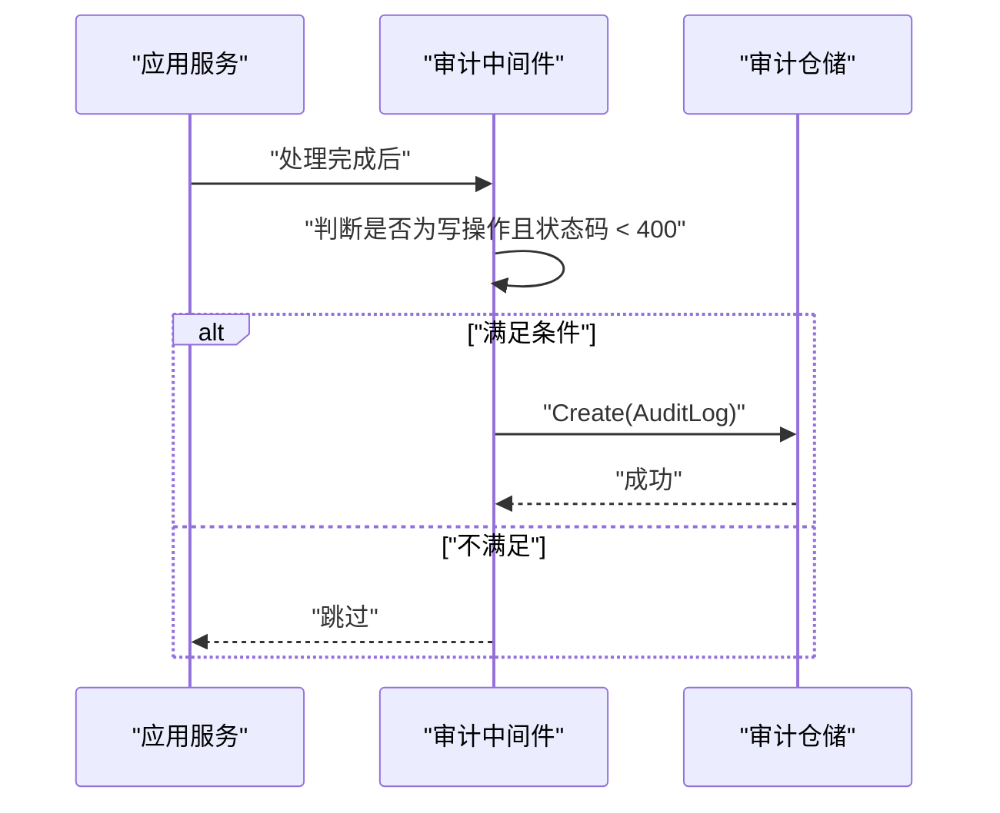
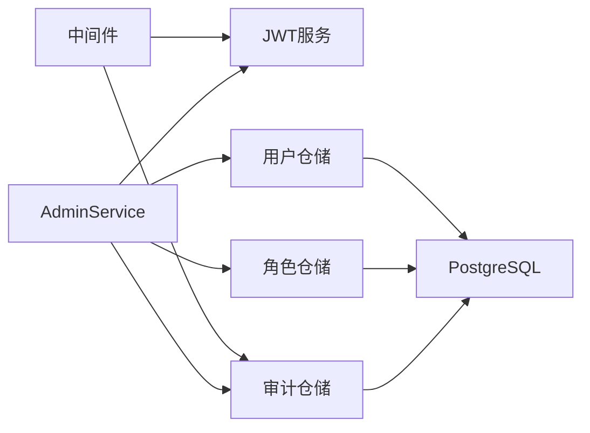

# 安全设计

<cite>
**本文引用的文件**
- [omcgo/internal/admin/jwt.go](file://omcgo/internal/admin/jwt.go)
- [omcgo/internal/admin/middleware.go](file://omcgo/internal/admin/middleware.go)
- [omcgo/internal/admin/service.go](file://omcgo/internal/admin/service.go)
- [omcgo/internal/admin/model.go](file://omcgo/internal/admin/model.go)
- [omcgo/internal/admin/pg_user_repository.go](file://omcgo/internal/admin/pg_user_repository.go)
- [omcgo/internal/admin/pg_role_repository.go](file://omcgo/internal/admin/pg_role_repository.go)
- [omcgo/internal/admin/pg_audit_repository.go](file://omcgo/internal/admin/pg_audit_repository.go)
- [omcgo/internal/core/middleware/auth.go](file://omcgo/internal/core/middleware/auth.go)
- [omcgo/internal/acs/ratelimit.go](file://omcgo/internal/acs/ratelimit.go)
- [omcgo/internal/acs/handler.go](file://omcgo/internal/acs/handler.go)
- [omcgo/internal/acs/session.go](file://omcgo/internal/acs/session.go)
- [omcgo/cmd/app/etc/config.dev.yaml](file://omcgo/cmd/app/etc/config.dev.yaml)
- [omcgo/cmd/acs/etc/config.dev.yaml](file://omcgo/cmd/acs/etc/config.dev.yaml)
- [omcgo/deployments/docker/nginx.conf](file://omcgo/deployments/docker/nginx.conf)
- [omcgo/scripts/e2e_verify.sh](file://omcgo/scripts/e2e_verify.sh)
- [files/Back-end/日志收集功能逻辑设计文档.md](file://files/Back-end/日志收集功能逻辑设计文档.md)
</cite>

## 目录
1. [简介](#简介)
2. [项目结构](#项目结构)
3. [核心组件](#核心组件)
4. [架构总览](#架构总览)
5. [详细组件分析](#详细组件分析)
6. [依赖分析](#依赖分析)
7. [性能考虑](#性能考虑)
8. [故障排查指南](#故障排查指南)
9. [结论](#结论)
10. [附录](#附录)

## 简介
本文件面向 Baicells OMC 项目的后端与网关层，提供一套系统化的安全设计文档，覆盖身份认证与会话管理（含 JWT 令牌生成/验证/刷新）、基于角色的访问控制（RBAC）实现、数据安全保护（密码哈希、传输与存储）、API 安全防护（请求签名、防重放、速率限制、输入验证）、审计日志体系与安全配置建议，并给出常见威胁的防护策略与最佳实践。

## 项目结构
围绕安全主题的关键代码分布在以下模块：
- 认证与授权：admin 子系统（JWT、中间件、服务、仓储）
- 会话与接入控制：acs 子系统（会话、速率限制、准入控制）
- 网关与TLS：docker 部署的 Nginx 反向代理
- 配置：应用与 ACS 的开发环境配置文件
- 测试与验证：e2e 脚本对审计日志可访问性的验证

图示来源
- [omcgo/deployments/docker/nginx.conf:1-58](file://omcgo/deployments/docker/nginx.conf#L1-L58)
- [omcgo/cmd/app/etc/config.dev.yaml:1-91](file://omcgo/cmd/app/etc/config.dev.yaml#L1-L91)
- [omcgo/cmd/acs/etc/config.dev.yaml:1-70](file://omcgo/cmd/acs/etc/config.dev.yaml#L1-L70)

章节来源
- [omcgo/deployments/docker/nginx.conf:1-58](file://omcgo/deployments/docker/nginx.conf#L1-L58)
- [omcgo/cmd/app/etc/config.dev.yaml:1-91](file://omcgo/cmd/app/etc/config.dev.yaml#L1-L91)
- [omcgo/cmd/acs/etc/config.dev.yaml:1-70](file://omcgo/cmd/acs/etc/config.dev.yaml#L1-L70)

## 核心组件
- JWT 令牌服务：负责访问/刷新令牌生成、签名校验、声明解析
- RBAC 中间件：鉴权、权限校验、载荷注入上下文
- 用户/角色/审计仓储：基于 PostgreSQL 的持久化
- 会话与速率限制：设备级限流、会话清理、准入控制
- 网关与 TLS：Nginx 反代与基本头部透传

章节来源
- [omcgo/internal/admin/jwt.go:1-136](file://omcgo/internal/admin/jwt.go#L1-L136)
- [omcgo/internal/admin/middleware.go:1-167](file://omcgo/internal/admin/middleware.go#L1-L167)
- [omcgo/internal/admin/service.go:1-353](file://omcgo/internal/admin/service.go#L1-L353)
- [omcgo/internal/admin/pg_user_repository.go:1-328](file://omcgo/internal/admin/pg_user_repository.go#L1-L328)
- [omcgo/internal/admin/pg_role_repository.go:1-358](file://omcgo/internal/admin/pg_role_repository.go#L1-L358)
- [omcgo/internal/admin/pg_audit_repository.go:1-155](file://omcgo/internal/admin/pg_audit_repository.go#L1-L155)
- [omcgo/internal/acs/ratelimit.go:1-57](file://omcgo/internal/acs/ratelimit.go#L1-L57)
- [omcgo/internal/acs/handler.go:43-90](file://omcgo/internal/acs/handler.go#L43-L90)
- [omcgo/internal/acs/session.go:43-71](file://omcgo/internal/acs/session.go#L43-L71)

## 架构总览
下图展示了认证、授权、审计与接入控制的整体交互流程。

图示来源
- [omcgo/internal/admin/middleware.go:21-58](file://omcgo/internal/admin/middleware.go#L21-L58)
- [omcgo/internal/admin/jwt.go:98-136](file://omcgo/internal/admin/jwt.go#L98-L136)
- [omcgo/internal/admin/service.go:41-81](file://omcgo/internal/admin/service.go#L41-L81)
- [omcgo/internal/admin/pg_audit_repository.go:28-50](file://omcgo/internal/admin/pg_audit_repository.go#L28-L50)
- [omcgo/deployments/docker/nginx.conf:10-18](file://omcgo/deployments/docker/nginx.conf#L10-L18)

## 详细组件分析

### 身份认证与会话管理（JWT）
- 令牌生成：服务端使用对称签名算法生成访问/刷新令牌，包含用户标识、用户名、运营商、角色等声明，分别设置到期时间。
- 令牌验证：中间件从 Authorization 头解析 Bearer 令牌，调用 JWT 服务进行签名校验与过期检查；通过后将用户信息注入请求上下文。
- 刷新策略：提供刷新接口，基于刷新令牌重新签发新的令牌对，同时校验用户状态与角色有效性。
- 会话清理：会话处理器维护连接会话表，启动后台清理协程，按阈值剔除陈旧会话，释放准入槽位并记录指标。

图示来源
- [omcgo/internal/admin/service.go:41-81](file://omcgo/internal/admin/service.go#L41-L81)
- [omcgo/internal/admin/jwt.go:48-96](file://omcgo/internal/admin/jwt.go#L48-L96)
- [omcgo/internal/admin/pg_user_repository.go:81-95](file://omcgo/internal/admin/pg_user_repository.go#L81-L95)
- [omcgo/internal/admin/pg_role_repository.go:214-240](file://omcgo/internal/admin/pg_role_repository.go#L214-L240)

章节来源
- [omcgo/internal/admin/jwt.go:1-136](file://omcgo/internal/admin/jwt.go#L1-L136)
- [omcgo/internal/admin/middleware.go:21-58](file://omcgo/internal/admin/middleware.go#L21-L58)
- [omcgo/internal/admin/service.go:83-116](file://omcgo/internal/admin/service.go#L83-L116)
- [omcgo/internal/acs/handler.go:43-90](file://omcgo/internal/acs/handler.go#L43-L90)
- [omcgo/internal/acs/session.go:43-71](file://omcgo/internal/acs/session.go#L43-L71)

### 基于角色的访问控制（RBAC）
- 角色与权限：角色包含名称、描述、系统标志与权限集合；权限以资源-动作对表示。
- 权限检查：中间件在鉴权后，根据用户 ID 查询其角色关联的权限，匹配资源与动作，拒绝无权限请求。
- 运营商过滤：中间件支持将用户绑定的运营商作为过滤条件注入上下文，便于后续业务层按域隔离。
- 数据模型：用户、角色、权限、审计日志的数据模型定义清晰，便于扩展与审计。

图示来源
- [omcgo/internal/admin/model.go:18-80](file://omcgo/internal/admin/model.go#L18-L80)
- [omcgo/internal/admin/pg_role_repository.go:28-78](file://omcgo/internal/admin/pg_role_repository.go#L28-L78)
- [omcgo/internal/admin/pg_user_repository.go:20-31](file://omcgo/internal/admin/pg_user_repository.go#L20-L31)
- [omcgo/internal/admin/pg_audit_repository.go:60-72](file://omcgo/internal/admin/pg_audit_repository.go#L60-L72)

章节来源
- [omcgo/internal/admin/middleware.go:60-120](file://omcgo/internal/admin/middleware.go#L60-L120)
- [omcgo/internal/admin/pg_role_repository.go:338-357](file://omcgo/internal/admin/pg_role_repository.go#L338-L357)
- [omcgo/internal/admin/pg_user_repository.go:160-247](file://omcgo/internal/admin/pg_user_repository.go#L160-L247)
- [omcgo/internal/admin/model.go:100-158](file://omcgo/internal/admin/model.go#L100-L158)

### 数据安全保护
- 密码存储：注册与重置均使用密码哈希算法生成哈希值存入数据库，避免明文存储。
- 传输安全：开发配置中默认未启用 TLS；生产环境应启用 HTTPS 并配置证书与密钥文件。
- 存储安全：数据库连接字符串默认关闭 SSL，生产需开启 SSL 模式；对象存储 MinIO 默认未启用 SSL，生产需启用 TLS。

章节来源
- [omcgo/internal/admin/service.go:118-151](file://omcgo/internal/admin/service.go#L118-L151)
- [omcgo/cmd/app/etc/config.dev.yaml:11-17](file://omcgo/cmd/app/etc/config.dev.yaml#L11-L17)
- [omcgo/cmd/app/etc/config.dev.yaml:39-50](file://omcgo/cmd/app/etc/config.dev.yaml#L39-L50)
- [omcgo/cmd/acs/etc/config.dev.yaml:5-8](file://omcgo/cmd/acs/etc/config.dev.yaml#L5-L8)

### API 安全防护
- 请求签名与防重放：当前未见统一的请求签名或时间戳/随机数防重放机制，建议在网关层引入 HMAC 签名或 JWT 扩展声明以增强抗重放能力。
- 速率限制：设备级令牌桶限流，支持突发容量、最大设备数、后台清理与优雅关闭；ACS 会话也具备超时与清理机制。
- 输入验证：模型层使用结构体标签进行基础校验（长度、格式），仓储层执行分页与过滤参数构建，建议结合白名单与严格模式提升健壮性。

图示来源
- [omcgo/internal/acs/ratelimit.go:17-57](file://omcgo/internal/acs/ratelimit.go#L17-L57)

章节来源
- [omcgo/internal/acs/ratelimit.go:1-57](file://omcgo/internal/acs/ratelimit.go#L1-L57)
- [omcgo/internal/acs/handler.go:43-90](file://omcgo/internal/acs/handler.go#L43-L90)
- [omcgo/internal/acs/session.go:43-71](file://omcgo/internal/acs/session.go#L43-L71)
- [omcgo/internal/admin/model.go:100-158](file://omcgo/internal/admin/model.go#L100-L158)

### 审计日志系统
- 记录范围：仅对成功的写操作（POST/PUT/PATCH/DELETE）进行审计记录，异步落库，避免阻塞主流程。
- 字段内容：包含用户标识、用户名、操作方法、资源路径、客户端 IP、User-Agent 等，便于回溯与取证。
- 查询与分页：支持按用户、动作、资源、时间范围过滤与分页查询，便于运营与安全部门检索。

图示来源
- [omcgo/internal/admin/middleware.go:122-166](file://omcgo/internal/admin/middleware.go#L122-L166)
- [omcgo/internal/admin/pg_audit_repository.go:28-50](file://omcgo/internal/admin/pg_audit_repository.go#L28-L50)

章节来源
- [omcgo/internal/admin/middleware.go:122-166](file://omcgo/internal/admin/middleware.go#L122-L166)
- [omcgo/internal/admin/pg_audit_repository.go:52-155](file://omcgo/internal/admin/pg_audit_repository.go#L52-L155)
- [omcgo/scripts/e2e_verify.sh:925-953](file://omcgo/scripts/e2e_verify.sh#L925-L953)
- [files/Back-end/日志收集功能逻辑设计文档.md:345-363](file://files/Back-end/日志收集功能逻辑设计文档.md#L345-L363)

## 依赖分析
- 组件内聚：admin 子系统内部职责清晰，JWT、中间件、服务、仓储各司其职。
- 组件耦合：中间件依赖 JWT 服务与仓储接口；服务依赖仓储与 JWT；仓储依赖数据库连接池。
- 外部依赖：PostgreSQL、Redis、NATS、MinIO、Nginx、JWT 库、速率限制库等。

图示来源
- [omcgo/internal/admin/middleware.go:21-58](file://omcgo/internal/admin/middleware.go#L21-L58)
- [omcgo/internal/admin/service.go:15-39](file://omcgo/internal/admin/service.go#L15-L39)
- [omcgo/internal/admin/pg_user_repository.go:25-35](file://omcgo/internal/admin/pg_user_repository.go#L25-L35)
- [omcgo/internal/admin/pg_role_repository.go:16-26](file://omcgo/internal/admin/pg_role_repository.go#L16-L26)
- [omcgo/internal/admin/pg_audit_repository.go:16-26](file://omcgo/internal/admin/pg_audit_repository.go#L16-L26)

章节来源
- [omcgo/internal/admin/service.go:15-39](file://omcgo/internal/admin/service.go#L15-L39)
- [omcgo/internal/admin/middleware.go:21-58](file://omcgo/internal/admin/middleware.go#L21-L58)
- [omcgo/internal/admin/pg_user_repository.go:25-35](file://omcgo/internal/admin/pg_user_repository.go#L25-L35)
- [omcgo/internal/admin/pg_role_repository.go:16-26](file://omcgo/internal/admin/pg_role_repository.go#L16-L26)
- [omcgo/internal/admin/pg_audit_repository.go:16-26](file://omcgo/internal/admin/pg_audit_repository.go#L16-L26)

## 性能考虑
- 令牌签发/校验：采用内存缓存与对称签名，开销较低；建议在高并发场景下复用 JWT 服务实例。
- 限流实现：LRU 缓存 + 令牌桶，支持后台清理与优雅关闭，避免内存膨胀；建议根据设备规模与峰值流量调优 burst 与 max_devices。
- 审计日志：采用“异步落库”策略，避免阻塞主流程；建议对审计表建立合适索引以优化查询。
- 会话清理：定时器扫描与指标观测，建议结合业务高峰时段动态调整清理频率。

## 故障排查指南
- 401 未授权
  - 检查 Authorization 头格式是否为 Bearer Token
  - 校验令牌是否过期或签名无效
  - 确认用户状态为激活
- 403 禁止访问
  - 检查用户是否拥有目标资源-动作的权限
  - 核对运营商过滤是否正确注入
- 审计日志为空
  - 确认请求为写操作且响应状态码 < 400
  - 检查审计仓储是否正常工作
- 速率限制频繁拒绝
  - 调整 per_device、burst、max_devices 参数
  - 关注后台清理是否及时
- 会话异常
  - 检查会话超时与清理周期
  - 观察指标与日志中的陈旧会话清理记录

章节来源
- [omcgo/internal/admin/middleware.go:25-57](file://omcgo/internal/admin/middleware.go#L25-L57)
- [omcgo/internal/admin/service.go:41-81](file://omcgo/internal/admin/service.go#L41-L81)
- [omcgo/internal/admin/middleware.go:122-166](file://omcgo/internal/admin/middleware.go#L122-L166)
- [omcgo/internal/acs/ratelimit.go:31-57](file://omcgo/internal/acs/ratelimit.go#L31-L57)
- [omcgo/internal/acs/handler.go:43-90](file://omcgo/internal/acs/handler.go#L43-L90)
- [omcgo/scripts/e2e_verify.sh:925-953](file://omcgo/scripts/e2e_verify.sh#L925-L953)

## 结论
本设计在开发阶段已实现完善的 JWT 认证与 RBAC 控制、设备级速率限制与会话清理、以及异步审计日志体系。建议在生产环境中补齐 TLS、请求签名与防重放、严格的输入验证与白名单策略，并持续完善安全扫描与合规检查流程，以满足工业级安全要求。

## 附录

### 安全配置指南（生产建议）
- TLS/HTTPS
  - 在应用与 ACS 配置中启用 TLS，提供证书与私钥文件路径
  - 强制 HTTPS 重定向与安全传输头
- 网络与防火墙
  - 仅开放必要端口（80/443/8080/8443/8444），限制源地址
  - 对外暴露的 API 网关启用 WAF 与速率限制
- 数据库与对象存储
  - 强制启用 SSL 连接
  - 最小权限原则与只读备份策略
- 密钥与机密
  - 使用安全的密钥管理服务（KMS/Secret Manager）
  - 定期轮换 JWT 密钥与数据库凭据
- 审计与监控
  - 审计日志分级存储与告警
  - 安全事件联动与自动化处置

章节来源
- [omcgo/cmd/app/etc/config.dev.yaml:6-9](file://omcgo/cmd/app/etc/config.dev.yaml#L6-L9)
- [omcgo/cmd/acs/etc/config.dev.yaml:5-8](file://omcgo/cmd/acs/etc/config.dev.yaml#L5-L8)
- [omcgo/cmd/app/etc/config.dev.yaml:11-17](file://omcgo/cmd/app/etc/config.dev.yaml#L11-L17)
- [omcgo/cmd/app/etc/config.dev.yaml:39-50](file://omcgo/cmd/app/etc/config.dev.yaml#L39-L50)