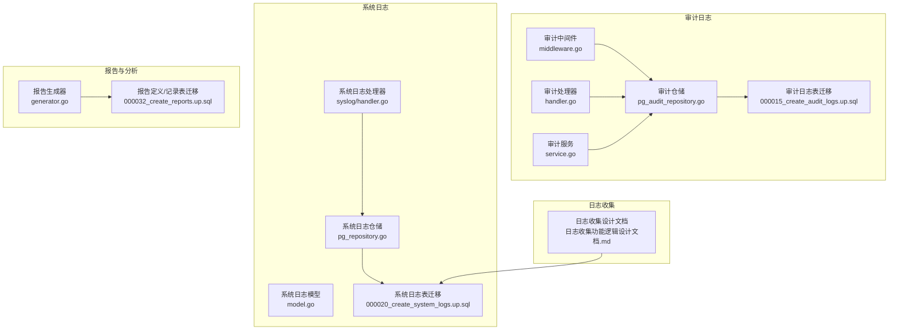
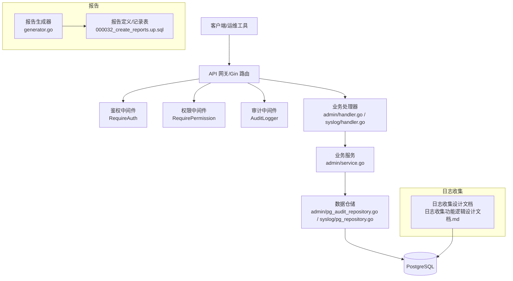
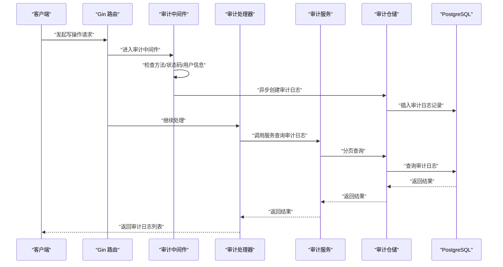
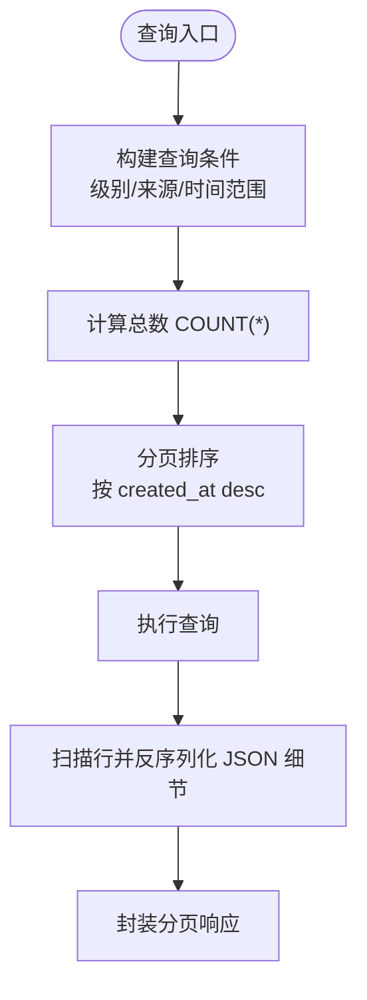
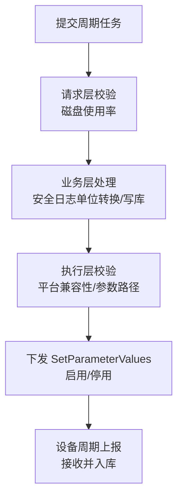
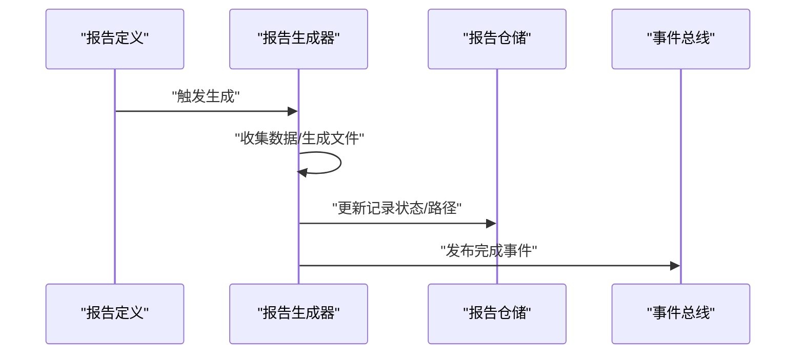
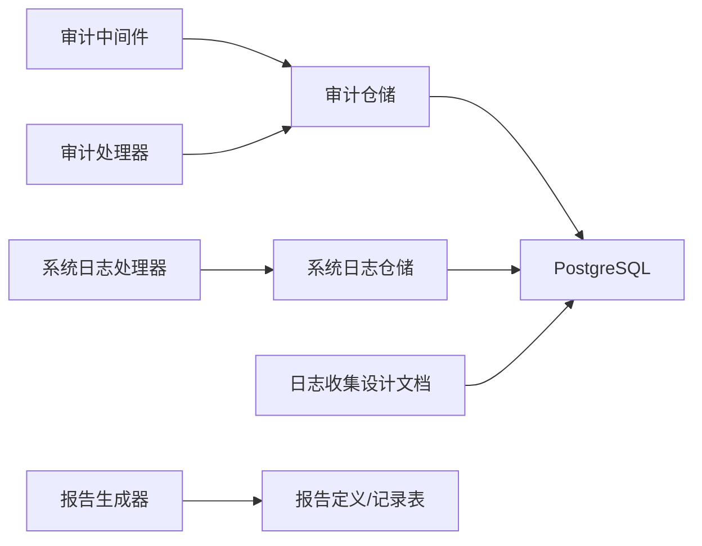

# 审计与安全日志

<cite>
**本文引用的文件**
- [pg_audit_repository.go](file://omcgo/internal/admin/pg_audit_repository.go)
- [handler.go](file://omcgo/internal/admin/handler.go)
- [middleware.go](file://omcgo/internal/admin/middleware.go)
- [service.go](file://omcgo/internal/admin/service.go)
- [000015_create_audit_logs.up.sql](file://omcgo/migrations/000015_create_audit_logs.up.sql)
- [000020_create_system_logs.up.sql](file://omcgo/migrations/000020_create_system_logs.up.sql)
- [pg_repository.go](file://omcgo/internal/syslog/pg_repository.go)
- [model.go](file://omcgo/internal/syslog/model.go)
- [日志收集功能逻辑设计文档.md](file://files/Back-end/日志收集功能逻辑设计文档.md)
- [e2e_verify.sh](file://omcgo/scripts/e2e_verify.sh)
- [generator.go](file://omcgo/internal/report/generator.go)
- [000032_create_reports.up.sql](file://omcgo/migrations/000032_create_reports.up.sql)
- [REVIEW_056e0be_chenbo01_logger.md](file://omcgo/docs/reports/review-report/20260319/REVIEW_056e0be_chenbo01_logger.md)
</cite>

## 目录
1. [简介](#简介)
2. [项目结构](#项目结构)
3. [核心组件](#核心组件)
4. [架构总览](#架构总览)
5. [详细组件分析](#详细组件分析)
6. [依赖分析](#依赖分析)
7. [性能考量](#性能考量)
8. [故障排查指南](#故障排查指南)
9. [结论](#结论)
10. [附录](#附录)

## 简介
本文件面向 Baicells OMC 项目的审计与安全日志体系，系统化阐述审计日志与系统日志的采集、存储、查询与分析机制，覆盖操作审计（用户登录、权限变更、关键操作、系统配置修改等）、安全事件监控（异常登录、权限滥用、系统入侵尝试等）以及合规性与审计报告生成流程。文档同时给出日志格式标准化建议、日志安全管理策略（加密、访问控制、备份与保留）以及日志分析工具与仪表板配置指引。

## 项目结构
围绕审计与安全日志，OMC 后端在以下模块中实现：
- 审计日志：admin 包中的仓储、服务、处理器与中间件，配合数据库迁移脚本创建审计日志表。
- 系统日志：syslog 包中的仓储、模型与处理器，支持应用级日志与网元消息日志。
- 日志收集：后端设计文档定义了设备运行日志与安全日志的收集流程，其中安全日志仅支持周期收集。
- 报告与分析：report 包提供报告生成能力，结合数据库迁移脚本支持报告定义与记录表。

**图表来源**
- [pg_audit_repository.go:1-155](file://omcgo/internal/admin/pg_audit_repository.go#L1-L155)
- [middleware.go:122-166](file://omcgo/internal/admin/middleware.go#L122-L166)
- [handler.go:403-417](file://omcgo/internal/admin/handler.go#L403-L417)
- [service.go:1-353](file://omcgo/internal/admin/service.go#L1-L353)
- [000015_create_audit_logs.up.sql:1-53](file://omcgo/migrations/000015_create_audit_logs.up.sql#L1-L53)
- [pg_repository.go:1-209](file://omcgo/internal/syslog/pg_repository.go#L1-L209)
- [model.go:1-50](file://omcgo/internal/syslog/model.go#L1-L50)
- [日志收集功能逻辑设计文档.md:1-455](file://files/Back-end/日志收集功能逻辑设计文档.md#L1-L455)
- [generator.go:139-180](file://omcgo/internal/report/generator.go#L139-L180)
- [000032_create_reports.up.sql:1-41](file://omcgo/migrations/000032_create_reports.up.sql#L1-L41)

**章节来源**
- [pg_audit_repository.go:1-155](file://omcgo/internal/admin/pg_audit_repository.go#L1-L155)
- [pg_repository.go:1-209](file://omcgo/internal/syslog/pg_repository.go#L1-L209)
- [日志收集功能逻辑设计文档.md:1-455](file://files/Back-end/日志收集功能逻辑设计文档.md#L1-L455)

## 核心组件
- 审计日志仓储：负责审计日志的插入与分页查询，支持按用户、动作、资源、时间范围过滤。
- 审计中间件：拦截写操作（POST/PUT/PATCH/DELETE），在请求完成后异步记录审计日志。
- 审计处理器：提供审计日志查询接口，支持分页与筛选。
- 系统日志仓储与模型：提供应用级日志与网元消息日志的查询能力，并支持按级别、来源、时间范围筛选。
- 日志收集设计：明确设备运行日志与安全日志的收集方式、平台差异与周期上报流程。
- 报告生成：支持按定义生成报告，便于审计报告的自动化产出。

**章节来源**
- [pg_audit_repository.go:28-154](file://omcgo/internal/admin/pg_audit_repository.go#L28-L154)
- [middleware.go:122-166](file://omcgo/internal/admin/middleware.go#L122-L166)
- [handler.go:403-417](file://omcgo/internal/admin/handler.go#L403-L417)
- [pg_repository.go:36-144](file://omcgo/internal/syslog/pg_repository.go#L36-L144)
- [model.go:11-50](file://omcgo/internal/syslog/model.go#L11-L50)
- [日志收集功能逻辑设计文档.md:11-41](file://files/Back-end/日志收集功能逻辑设计文档.md#L11-L41)
- [generator.go:139-180](file://omcgo/internal/report/generator.go#L139-L180)

## 架构总览
下图展示了审计与安全日志在系统中的位置与交互：

**图表来源**
- [middleware.go:23-58](file://omcgo/internal/admin/middleware.go#L23-L58)
- [middleware.go:62-101](file://omcgo/internal/admin/middleware.go#L62-L101)
- [middleware.go:122-166](file://omcgo/internal/admin/middleware.go#L122-L166)
- [handler.go:27-63](file://omcgo/internal/admin/handler.go#L27-L63)
- [pg_audit_repository.go:16-26](file://omcgo/internal/admin/pg_audit_repository.go#L16-L26)
- [pg_repository.go:26-34](file://omcgo/internal/syslog/pg_repository.go#L26-L34)
- [日志收集功能逻辑设计文档.md:1-455](file://files/Back-end/日志收集功能逻辑设计文档.md#L1-L455)
- [generator.go:139-180](file://omcgo/internal/report/generator.go#L139-L180)
- [000032_create_reports.up.sql:1-41](file://omcgo/migrations/000032_create_reports.up.sql#L1-L41)

## 详细组件分析

### 审计日志系统
- 记录范围：写操作（POST/PUT/PATCH/DELETE）且响应状态码小于 400 的成功请求。
- 记录内容：用户标识、用户名、HTTP 方法、资源路径、客户端 IP、User-Agent、时间戳。
- 存储与查询：基于 PostgreSQL 的审计日志表，支持按用户、动作、资源、时间范围分页查询。
- 接口：提供审计日志列表查询接口，支持分页与筛选。

**图表来源**
- [middleware.go:122-166](file://omcgo/internal/admin/middleware.go#L122-L166)
- [handler.go:403-417](file://omcgo/internal/admin/handler.go#L403-L417)
- [pg_audit_repository.go:52-154](file://omcgo/internal/admin/pg_audit_repository.go#L52-L154)

**章节来源**
- [middleware.go:122-166](file://omcgo/internal/admin/middleware.go#L122-L166)
- [handler.go:403-417](file://omcgo/internal/admin/handler.go#L403-L417)
- [pg_audit_repository.go:28-154](file://omcgo/internal/admin/pg_audit_repository.go#L28-L154)
- [000015_create_audit_logs.up.sql:3-19](file://omcgo/migrations/000015_create_audit_logs.up.sql#L3-L19)

### 系统日志与网元消息日志
- 应用级日志：包含级别、来源、消息正文与可选细节，支持按级别、来源、时间范围筛选与分页。
- 网元消息日志：记录设备序列号、设备 ID、消息类型、方向与内容，支持按设备、消息类型、方向与时间范围筛选。
- 存储：分别存储于 system_logs 与 ne_message_logs 表，具备相应索引以优化查询。

**图表来源**
- [pg_repository.go:36-144](file://omcgo/internal/syslog/pg_repository.go#L36-L144)
- [model.go:11-50](file://omcgo/internal/syslog/model.go#L11-L50)
- [000020_create_system_logs.up.sql:1-29](file://omcgo/migrations/000020_create_system_logs.up.sql#L1-L29)

**章节来源**
- [pg_repository.go:36-144](file://omcgo/internal/syslog/pg_repository.go#L36-L144)
- [model.go:11-50](file://omcgo/internal/syslog/model.go#L11-L50)
- [000020_create_system_logs.up.sql:1-29](file://omcgo/migrations/000020_create_system_logs.up.sql#L1-L29)

### 日志收集与安全日志
- 设备运行日志与安全日志：立即收集与周期收集共享大部分校验与下发逻辑，平台差异通过适配器隔离。
- 安全日志特性：仅支持周期收集，平台限定为特定高通平台，周期间隔单位为小时并在业务层转换为秒下发。
- 文件存储：安全日志保存至专用目录。

**图表来源**
- [日志收集功能逻辑设计文档.md:196-277](file://files/Back-end/日志收集功能逻辑设计文档.md#L196-L277)
- [日志收集功能逻辑设计文档.md:345-362](file://files/Back-end/日志收集功能逻辑设计文档.md#L345-L362)

**章节来源**
- [日志收集功能逻辑设计文档.md:11-41](file://files/Back-end/日志收集功能逻辑设计文档.md#L11-L41)
- [日志收集功能逻辑设计文档.md:196-277](file://files/Back-end/日志收集功能逻辑设计文档.md#L196-L277)
- [日志收集功能逻辑设计文档.md:345-362](file://files/Back-end/日志收集功能逻辑设计文档.md#L345-L362)

### 报告与审计报告生成
- 报告生成：根据报告定义收集数据并生成文件，更新记录状态并通过事件总线发布完成事件。
- 报表表结构：支持报告定义与生成记录的管理，便于审计报告的自动化产出与检索。

**图表来源**
- [generator.go:139-180](file://omcgo/internal/report/generator.go#L139-L180)
- [000032_create_reports.up.sql:1-41](file://omcgo/migrations/000032_create_reports.up.sql#L1-L41)

**章节来源**
- [generator.go:139-180](file://omcgo/internal/report/generator.go#L139-L180)
- [000032_create_reports.up.sql:1-41](file://omcgo/migrations/000032_create_reports.up.sql#L1-L41)

## 依赖分析
- 审计日志依赖 PostgreSQL 仓储与 Gin 中间件，通过异步写入避免阻塞主请求路径。
- 系统日志与网元消息日志同样依赖 PostgreSQL 仓储，提供结构化查询与索引优化。
- 日志收集设计文档与系统日志迁移共同支撑设备侧日志的周期上报与存储。
- 报告生成器与报表迁移共同支撑审计报告的自动化生成与管理。

**图表来源**
- [middleware.go:122-166](file://omcgo/internal/admin/middleware.go#L122-L166)
- [pg_audit_repository.go:16-26](file://omcgo/internal/admin/pg_audit_repository.go#L16-L26)
- [pg_repository.go:26-34](file://omcgo/internal/syslog/pg_repository.go#L26-L34)
- [日志收集功能逻辑设计文档.md:1-455](file://files/Back-end/日志收集功能逻辑设计文档.md#L1-L455)
- [generator.go:139-180](file://omcgo/internal/report/generator.go#L139-L180)
- [000032_create_reports.up.sql:1-41](file://omcgo/migrations/000032_create_reports.up.sql#L1-L41)

**章节来源**
- [pg_audit_repository.go:16-26](file://omcgo/internal/admin/pg_audit_repository.go#L16-L26)
- [pg_repository.go:26-34](file://omcgo/internal/syslog/pg_repository.go#L26-L34)
- [日志收集功能逻辑设计文档.md:1-455](file://files/Back-end/日志收集功能逻辑设计文档.md#L1-L455)
- [generator.go:139-180](file://omcgo/internal/report/generator.go#L139-L180)
- [000032_create_reports.up.sql:1-41](file://omcgo/migrations/000032_create_reports.up.sql#L1-L41)

## 性能考量
- 审计日志写入采用“异步 fire-and-forget”策略，避免阻塞响应，降低写放大风险。
- 审计与系统日志表均建立索引（如按时间倒序、按用户/资源等），提升查询效率。
- 日志收集任务在业务层进行必要的磁盘使用率与平台兼容性校验，减少无效下发。
- 报告生成采用事件驱动与状态更新，避免长时间阻塞。

[本节为通用指导，无需列出具体文件来源]

## 故障排查指南
- 审计日志查询接口可用性：端到端测试脚本验证审计日志接口可访问、分页与字段完整性。
- 审计字段校验：确保审计日志返回包含必要字段（如 id、username、action、resource、created_at）。
- 审计过滤：支持按 action 过滤（例如 login），用于快速定位登录相关审计记录。
- 系统日志查询：确认按级别、来源、时间范围的筛选与分页正常工作。
- 日志轮转与输出：审查日志组件的轮转配置与输出路径，确保生产环境日志可持久化与轮转。

**章节来源**
- [e2e_verify.sh:925-1522](file://omcgo/scripts/e2e_verify.sh#L925-L1522)
- [e2e_verify.sh:1448-1490](file://omcgo/scripts/e2e_verify.sh#L1448-L1490)
- [REVIEW_056e0be_chenbo01_logger.md:1-59](file://omcgo/docs/reports/review-report/20260319/REVIEW_056e0be_chenbo01_logger.md#L1-L59)

## 结论
OMC 的审计与安全日志体系以 PostgreSQL 为核心存储，结合 Gin 中间件与仓储层实现了对写操作的自动审计与高效查询；系统日志与网元消息日志提供了应用与设备通信层面的可观测性；日志收集设计文档明确了安全日志的周期上报流程与平台差异；报告生成器与报表表结构支撑审计报告的自动化产出。整体架构在保证性能的同时兼顾了可维护性与扩展性。

[本节为总结性内容，无需列出具体文件来源]

## 附录

### 审计日志字段与索引
- 表结构要点：包含用户标识、用户名、动作、资源、资源 ID、详情（JSONB）、IP 地址、User-Agent、时间戳等。
- 索引策略：按用户与时间、时间倒序、资源与时间建立索引，提升查询效率。

**章节来源**
- [000015_create_audit_logs.up.sql:3-19](file://omcgo/migrations/000015_create_audit_logs.up.sql#L3-L19)

### 系统日志与网元消息日志字段
- 应用级日志：级别、来源、消息正文、细节（JSONB）、时间戳。
- 网元消息日志：设备序列号、设备 ID、消息类型、方向、内容、时间戳。

**章节来源**
- [000020_create_system_logs.up.sql:1-29](file://omcgo/migrations/000020_create_system_logs.up.sql#L1-L29)
- [model.go:11-30](file://omcgo/internal/syslog/model.go#L11-L30)

### 日志格式标准化建议
- 结构化日志：统一使用 JSONB 存储详情，便于查询与分析。
- 时间戳：使用带时区的时间戳字段，确保跨时区一致性。
- 上下文信息：记录用户标识、IP、User-Agent、资源路径等上下文。
- 事件类型：审计日志以 HTTP 方法表示事件类型，系统日志以级别与来源区分。

**章节来源**
- [pg_audit_repository.go:33-39](file://omcgo/internal/admin/pg_audit_repository.go#L33-L39)
- [pg_repository.go:16-22](file://omcgo/internal/syslog/pg_repository.go#L16-L22)
- [middleware.go:152-159](file://omcgo/internal/admin/middleware.go#L152-L159)

### 日志安全管理
- 加密存储：敏感字段（如密码哈希）已在用户表中采用哈希存储；审计日志不存储明文敏感信息。
- 访问控制：通过鉴权与权限中间件确保只有授权用户可访问审计与系统日志。
- 备份策略：结合数据库备份与对象存储（如报告生成器使用的对象路径）实现日志与报告的长期保存。
- 保留期限：依据合规要求设定审计与系统日志的保留期限，定期清理过期数据。

**章节来源**
- [service.go:42-81](file://omcgo/internal/admin/service.go#L42-L81)
- [middleware.go:23-58](file://omcgo/internal/admin/middleware.go#L23-L58)
- [middleware.go:62-101](file://omcgo/internal/admin/middleware.go#L62-L101)
- [generator.go:139-161](file://omcgo/internal/report/generator.go#L139-L161)

### 日志分析工具与仪表板配置
- 系统日志查询接口可用于前端仪表板的数据源，支持按级别、来源、时间范围筛选。
- 建议在前端模块中集成日志查询组件，提供分页与导出能力，便于运维与安管人员查看与分析。

**章节来源**
- [handler.go:25-32](file://omcgo/internal/syslog/handler.go#L25-L32)
- [pg_repository.go:36-88](file://omcgo/internal/syslog/pg_repository.go#L36-L88)

### 合规性与审计报告生成流程
- 审计报告生成：通过报告生成器按定义周期或手动触发生成，更新记录状态并通过事件总线通知。
- 报表表结构：支持报告定义与生成记录的管理，便于审计归档与检索。

**章节来源**
- [generator.go:139-180](file://omcgo/internal/report/generator.go#L139-L180)
- [000032_create_reports.up.sql:1-41](file://omcgo/migrations/000032_create_reports.up.sql#L1-L41)