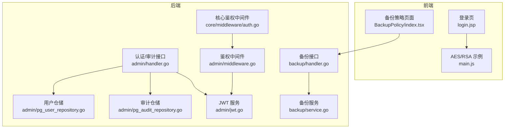
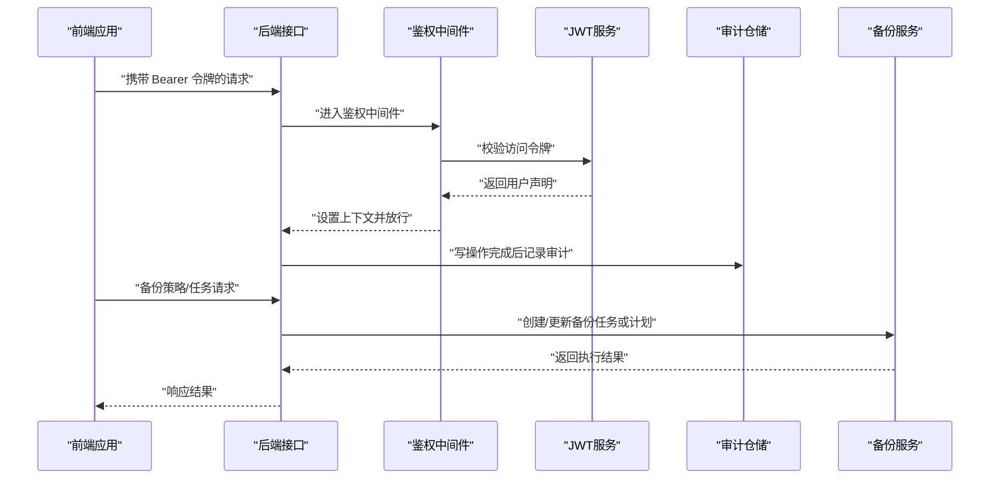
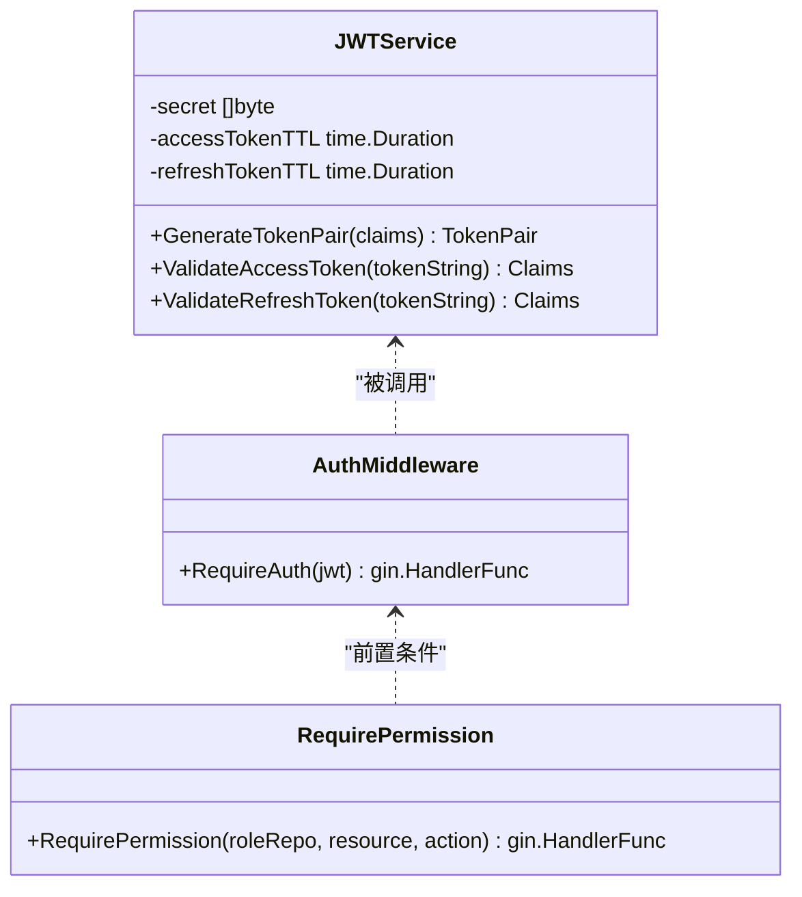
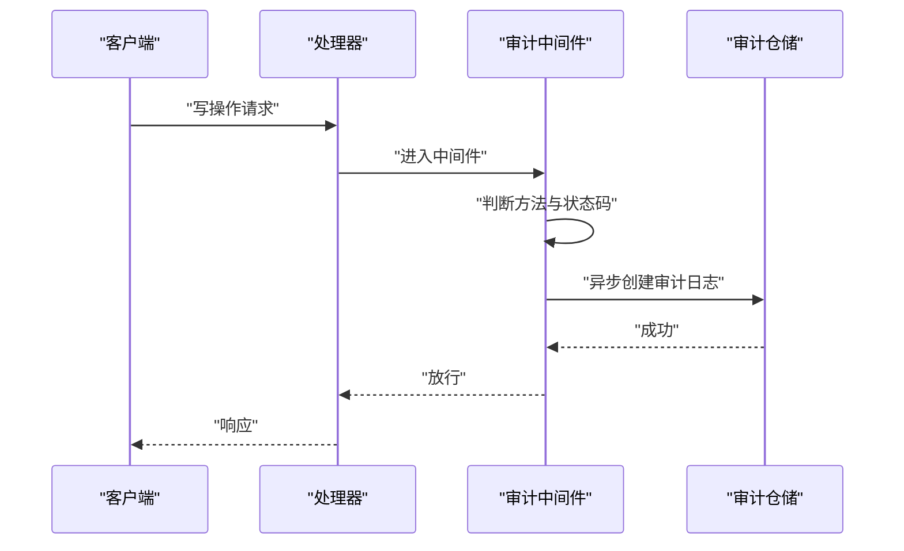
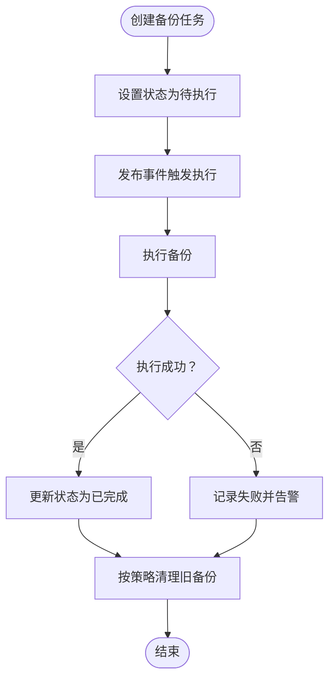
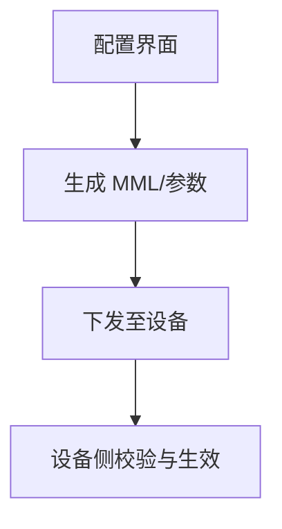
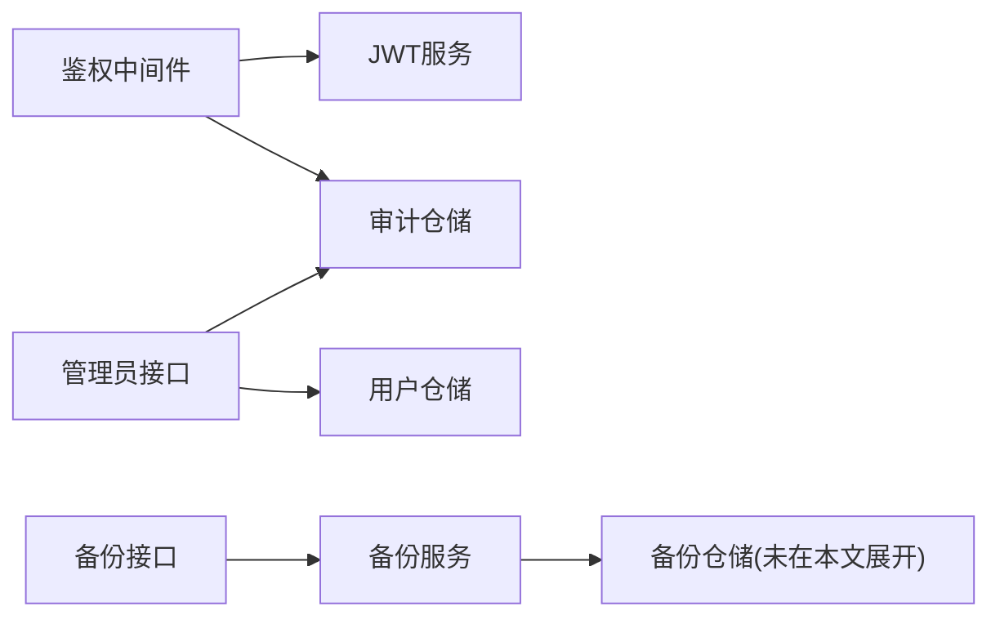

# 数据安全保护

<cite>
**本文引用的文件**
- [omcgo/internal/admin/jwt.go](file://omcgo/internal/admin/jwt.go)
- [omcgo/internal/admin/middleware.go](file://omcgo/internal/admin/middleware.go)
- [omcgo/internal/admin/handler.go](file://omcgo/internal/admin/handler.go)
- [omcgo/internal/admin/pg_user_repository.go](file://omcgo/internal/admin/pg_user_repository.go)
- [omcgo/internal/admin/pg_audit_repository.go](file://omcgo/internal/admin/pg_audit_repository.go)
- [omcgo/internal/core/middleware/auth.go](file://omcgo/internal/core/middleware/auth.go)
- [omcgo/internal/backup/service.go](file://omcgo/internal/backup/service.go)
- [omcgo/internal/backup/handler.go](file://omcgo/internal/backup/handler.go)
- [omcgo/scripts/e2e_verify.sh](file://omcgo/scripts/e2e_verify.sh)
- [omcmb/webcode/src/pages/backup/BackupPolicy/index.tsx](file://omcmb/webcode/src/pages/backup/BackupPolicy/index.tsx)
- [omcmb/original-omc/OMCWebServer/src/main/webapp/WEB-INF/content/enodeb/monitor/setting/ipsec.jsp](file://omcmb/original-omc/OMCWebServer/src/main/webapp/WEB-INF/content/enodeb/monitor/setting/ipsec.jsp)
- [omcmb/original-omc/OMCWebServer/src/main/webapp/WEB-INF/content/enodeb/monitor/setting/ipsec2.jsp](file://omcmb/original-omc/OMCWebServer/src/main/webapp/WEB-INF/content/enodeb/monitor/setting/ipsec2.jsp)
- [omcmb/original-omc/OMCWebServer/src/main/webapp/WEB-INF/content/enodeb/monitor/setting/ipsec3.jsp](file://omcmb/original-omc/OMCWebServer/src/main/webapp/WEB-INF/content/enodeb/monitor/setting/ipsec3.jsp)
- [omcmb/original-omc/OMCWebServer/src/main/webapp/WEB-INF/content/enodeb/halob_self_config/common_config_planning.jsp](file://omcmb/original-omc/OMCWebServer/src/main/webapp/WEB-INF/content/enodeb/halob_self_config/common_config_planning.jsp)
- [omcmb/original-omc/OMCWebServer/src/main/webapp/WEB-INF/content/cell/cellParam/config/modIpsecSetting.jsp](file://omcmb/original-omc/OMCWebServer/src/main/webapp/WEB-INF/content/cell/cellParam/config/modIpsecSetting.jsp)
- [omcmb/original-omc/OMCWebServer/src/main/webapp/WEB-INF/content/cell/cellParam/config/modIpsecSetting436Q.jsp](file://omcmb/original-omc/OMCWebServer/src/main/webapp/WEB-INF/content/cell/cellParam/config/modIpsecSetting436Q.jsp)
- [omcmb/original-omc/OMCWebServer/src/main/webapp/WEB-INF/content/cell/cellParam/config/modSecurity.jsp](file://omcmb/original-omc/OMCWebServer/src/main/webapp/WEB-INF/content/cell/cellParam/config/modSecurity.jsp)
- [omcmb/original-omc/OMCWebServer/src/main/webapp/WEB-INF/content/enodeb/monitor/setting/lteTab.jsp](file://omcmb/original-omc/OMCWebServer/src/main/webapp/WEB-INF/content/enodeb/monitor/setting/lteTab.jsp)
- [omcmb/original-omc/OMCWebServer/src/main/webapp/js/bi/home/main.js](file://omcmb/original-omc/OMCWebServer/src/main/webapp/js/bi/home/main.js)
- [omcmb/original-omc/OMCWebServer/src/main/webapp/skin/NoLogo/login.jsp](file://omcmb/original-omc/OMCWebServer/src/main/webapp/skin/NoLogo/login.jsp)
- [files/Back-end/日志收集功能逻辑设计文档.md](file://files/Back-end/日志收集功能逻辑设计文档.md)
</cite>

## 目录
1. [简介](#简介)
2. [项目结构](#项目结构)
3. [核心组件](#核心组件)
4. [架构总览](#架构总览)
5. [详细组件分析](#详细组件分析)
6. [依赖分析](#依赖分析)
7. [性能考虑](#性能考虑)
8. [故障排查指南](#故障排查指南)
9. [结论](#结论)
10. [附录](#附录)

## 简介
本文件面向 Baicells OMC 项目的“数据安全保护”，围绕敏感数据的分类与分级、加密存储与传输、数据脱敏、完整性保护、生命周期管理、安全配置与合规、以及数据泄露防护与应急响应等方面，结合代码库中的实现与文档进行系统化说明。目标是帮助开发者与运维人员在不直接暴露源码的前提下，理解并落实数据安全策略。

## 项目结构
OMC 后端采用 Go 编写的微服务分层架构，前端使用 React/Ant Design。与数据安全相关的关键模块包括：
- 认证与授权：基于 JWT 的访问令牌与刷新令牌，中间件鉴权与审计日志
- 数据备份与归档：备份策略、压缩与存储后端、FTP 配置
- 传输安全：设备侧 IPsec/LTE 安全参数配置界面
- 前端安全：登录页的 RSA/AES 加解密示例
- 日志与审计：审计日志接口与字段校验

图表来源
- [omcmb/webcode/src/pages/backup/BackupPolicy/index.tsx:1-305](file://omcmb/webcode/src/pages/backup/BackupPolicy/index.tsx#L1-L305)
- [omcgo/internal/admin/handler.go:1-418](file://omcgo/internal/admin/handler.go#L1-L418)
- [omcgo/internal/admin/middleware.go:1-167](file://omcgo/internal/admin/middleware.go#L1-L167)
- [omcgo/internal/core/middleware/auth.go:1-48](file://omcgo/internal/core/middleware/auth.go#L1-L48)
- [omcgo/internal/admin/jwt.go:1-136](file://omcgo/internal/admin/jwt.go#L1-L136)
- [omcgo/internal/admin/pg_user_repository.go:1-328](file://omcgo/internal/admin/pg_user_repository.go#L1-L328)
- [omcgo/internal/admin/pg_audit_repository.go:82-154](file://omcgo/internal/admin/pg_audit_repository.go#L82-L154)
- [omcgo/internal/backup/handler.go:1-469](file://omcgo/internal/backup/handler.go#L1-L469)
- [omcgo/internal/backup/service.go:1-159](file://omcgo/internal/backup/service.go#L1-L159)
- [omcmb/original-omc/OMCWebServer/src/main/webapp/skin/NoLogo/login.jsp:223-271](file://omcmb/original-omc/OMCWebServer/src/main/webapp/skin/NoLogo/login.jsp#L223-L271)
- [omcmb/original-omc/OMCWebServer/src/main/webapp/js/bi/home/main.js:1284-1336](file://omcmb/original-omc/OMCWebServer/src/main/webapp/js/bi/home/main.js#L1284-L1336)

章节来源
- [omcgo/internal/admin/handler.go:1-418](file://omcgo/internal/admin/handler.go#L1-L418)
- [omcgo/internal/backup/handler.go:1-469](file://omcgo/internal/backup/handler.go#L1-L469)

## 核心组件
- 认证与令牌
  - JWT 服务负责生成访问/刷新令牌及校验；访问令牌用于受保护接口调用，刷新令牌用于获取新的访问令牌
  - 中间件负责从 Authorization 头解析 Bearer 令牌，并校验其有效性
- 审计与日志
  - 审计仓储支持分页查询与字段完整性校验；中间件对写操作进行审计记录
- 备份与归档
  - 备份服务与接口支持创建/取消/删除任务与计划；前端提供备份策略配置（保留、压缩、存储、加密、告警）
- 传输安全
  - 设备侧安全参数界面支持 IPsec ESP 加密算法、DH 组、认证算法等配置
  - 登录页前端示例包含 RSA/AES 加解密逻辑

章节来源
- [omcgo/internal/admin/jwt.go:1-136](file://omcgo/internal/admin/jwt.go#L1-L136)
- [omcgo/internal/admin/middleware.go:1-167](file://omcgo/internal/admin/middleware.go#L1-L167)
- [omcgo/internal/admin/pg_audit_repository.go:82-154](file://omcgo/internal/admin/pg_audit_repository.go#L82-L154)
- [omcgo/internal/backup/service.go:1-159](file://omcgo/internal/backup/service.go#L1-L159)
- [omcgo/internal/backup/handler.go:1-469](file://omcgo/internal/backup/handler.go#L1-L469)
- [omcmb/webcode/src/pages/backup/BackupPolicy/index.tsx:1-305](file://omcmb/webcode/src/pages/backup/BackupPolicy/index.tsx#L1-L305)

## 架构总览
下图展示了数据安全相关的关键交互：前端通过 HTTPS 与后端通信；后端使用 JWT 进行鉴权；写操作触发审计日志；备份流程由服务与仓储协作完成。

图表来源
- [omcgo/internal/admin/middleware.go:21-58](file://omcgo/internal/admin/middleware.go#L21-L58)
- [omcgo/internal/admin/jwt.go:98-135](file://omcgo/internal/admin/jwt.go#L98-L135)
- [omcgo/internal/admin/pg_audit_repository.go:122-165](file://omcgo/internal/admin/pg_audit_repository.go#L122-L165)
- [omcgo/internal/backup/service.go:33-63](file://omcgo/internal/backup/service.go#L33-L63)
- [omcgo/internal/backup/handler.go:117-138](file://omcgo/internal/backup/handler.go#L117-L138)

## 详细组件分析

### 组件一：认证与令牌（JWT）
- 令牌类型
  - 访问令牌：短期有效，用于日常接口调用
  - 刷新令牌：长期有效，用于换取新的访问令牌
- 校验机制
  - 中间件解析 Authorization 头，校验 Bearer 格式与令牌内容
  - JWT 服务使用 HMAC 方法签名校验，确保令牌未被篡改
- 上下文注入
  - 成功校验后将用户 ID、用户名、运营商、角色等信息注入请求上下文

图表来源
- [omcgo/internal/admin/jwt.go:12-135](file://omcgo/internal/admin/jwt.go#L12-L135)
- [omcgo/internal/admin/middleware.go:21-101](file://omcgo/internal/admin/middleware.go#L21-L101)

章节来源
- [omcgo/internal/admin/jwt.go:1-136](file://omcgo/internal/admin/jwt.go#L1-L136)
- [omcgo/internal/admin/middleware.go:1-167](file://omcgo/internal/admin/middleware.go#L1-L167)
- [omcgo/internal/core/middleware/auth.go:1-48](file://omcgo/internal/core/middleware/auth.go#L1-L48)

### 组件二：审计与日志
- 审计范围
  - 对写操作（POST/PUT/PATCH/DELETE）进行审计，记录用户、资源、IP、UA、时间等
- 查询能力
  - 支持分页、排序与过滤，保证审计数据可检索
- 字段完整性
  - 接口测试中校验审计日志条目包含必要字段，确保审计完整性

图表来源
- [omcgo/internal/admin/middleware.go:122-166](file://omcgo/internal/admin/middleware.go#L122-L166)
- [omcgo/internal/admin/pg_audit_repository.go:82-154](file://omcgo/internal/admin/pg_audit_repository.go#L82-L154)
- [omcgo/scripts/e2e_verify.sh:1448-1490](file://omcgo/scripts/e2e_verify.sh#L1448-L1490)

章节来源
- [omcgo/internal/admin/middleware.go:122-166](file://omcgo/internal/admin/middleware.go#L122-L166)
- [omcgo/internal/admin/pg_audit_repository.go:82-154](file://omcgo/internal/admin/pg_audit_repository.go#L82-L154)
- [omcgo/scripts/e2e_verify.sh:1448-1490](file://omcgo/scripts/e2e_verify.sh#L1448-L1490)

### 组件三：备份与归档（含加密与压缩）
- 策略配置
  - 前端提供保留天数、最大/最小备份数、自动清理、压缩格式与级别、存储后端（本地/FTP/SFTP/NFS）、加密算法、告警阈值等
- 接口能力
  - 创建/更新/删除备份任务与计划；列出任务与计划；FTP 配置的增删改查与连通性测试占位
- 生命周期
  - 任务状态机：待执行/运行中/已取消/已完成；按策略自动清理旧备份

图表来源
- [omcgo/internal/backup/service.go:33-63](file://omcgo/internal/backup/service.go#L33-L63)
- [omcgo/internal/backup/handler.go:117-138](file://omcgo/internal/backup/handler.go#L117-L138)
- [omcmb/webcode/src/pages/backup/BackupPolicy/index.tsx:222-259](file://omcmb/webcode/src/pages/backup/BackupPolicy/index.tsx#L222-L259)

章节来源
- [omcgo/internal/backup/service.go:1-159](file://omcgo/internal/backup/service.go#L1-L159)
- [omcgo/internal/backup/handler.go:1-469](file://omcgo/internal/backup/handler.go#L1-L469)
- [omcmb/webcode/src/pages/backup/BackupPolicy/index.tsx:1-305](file://omcmb/webcode/src/pages/backup/BackupPolicy/index.tsx#L1-L305)

### 组件四：传输安全（设备侧 IPsec/LTE 安全参数）
- 可配置项
  - ESP 加密算法、DH 组、认证算法；KeyLife；Ike/Esp 分组等
- 目的
  - 在设备侧建立安全隧道，保护南向接口与数据传输

图表来源
- [omcmb/original-omc/OMCWebServer/src/main/webapp/WEB-INF/content/enodeb/monitor/setting/ipsec.jsp:197-231](file://omcmb/original-omc/OMCWebServer/src/main/webapp/WEB-INF/content/enodeb/monitor/setting/ipsec.jsp#L197-L231)
- [omcmb/original-omc/OMCWebServer/src/main/webapp/WEB-INF/content/enodeb/monitor/setting/ipsec2.jsp:294-334](file://omcmb/original-omc/OMCWebServer/src/main/webapp/WEB-INF/content/enodeb/monitor/setting/ipsec2.jsp#L294-L334)
- [omcmb/original-omc/OMCWebServer/src/main/webapp/WEB-INF/content/enodeb/monitor/setting/ipsec3.jsp:294-334](file://omcmb/original-omc/OMCWebServer/src/main/webapp/WEB-INF/content/enodeb/monitor/setting/ipsec3.jsp#L294-L334)
- [omcmb/original-omc/OMCWebServer/src/main/webapp/WEB-INF/content/enodeb/halob_self_config/common_config_planning.jsp:311-570](file://omcmb/original-omc/OMCWebServer/src/main/webapp/WEB-INF/content/enodeb/halob_self_config/common_config_planning.jsp#L311-L570)
- [omcmb/original-omc/OMCWebServer/src/main/webapp/WEB-INF/content/cell/cellParam/config/modIpsecSetting.jsp:96-131](file://omcmb/original-omc/OMCWebServer/src/main/webapp/WEB-INF/content/cell/cellParam/config/modIpsecSetting.jsp#L96-L131)
- [omcmb/original-omc/OMCWebServer/src/main/webapp/WEB-INF/content/cell/cellParam/config/modIpsecSetting436Q.jsp:141-173](file://omcmb/original-omc/OMCWebServer/src/main/webapp/WEB-INF/content/cell/cellParam/config/modIpsecSetting436Q.jsp#L141-L173)
- [omcmb/original-omc/OMCWebServer/src/main/webapp/WEB-INF/content/cell/cellParam/config/modSecurity.jsp:1-23](file://omcmb/original-omc/OMCWebServer/src/main/webapp/WEB-INF/content/cell/cellParam/config/modSecurity.jsp#L1-L23)
- [omcmb/original-omc/OMCWebServer/src/main/webapp/WEB-INF/content/enodeb/monitor/setting/lteTab.jsp:382-410](file://omcmb/original-omc/OMCWebServer/src/main/webapp/WEB-INF/content/enodeb/monitor/setting/lteTab.jsp#L382-L410)

章节来源
- [omcmb/original-omc/OMCWebServer/src/main/webapp/WEB-INF/content/enodeb/monitor/setting/ipsec.jsp:197-231](file://omcmb/original-omc/OMCWebServer/src/main/webapp/WEB-INF/content/enodeb/monitor/setting/ipsec.jsp#L197-L231)
- [omcmb/original-omc/OMCWebServer/src/main/webapp/WEB-INF/content/enodeb/halob_self_config/common_config_planning.jsp:311-570](file://omcmb/original-omc/OMCWebServer/src/main/webapp/WEB-INF/content/enodeb/halob_self_config/common_config_planning.jsp#L311-L570)
- [omcmb/original-omc/OMCWebServer/src/main/webapp/WEB-INF/content/cell/cellParam/config/modSecurity.jsp:1-23](file://omcmb/original-omc/OMCWebServer/src/main/webapp/WEB-INF/content/cell/cellParam/config/modSecurity.jsp#L1-L23)

### 组件五：前端登录安全（RSA/AES 示例）
- RSA 加密
  - 前端使用公钥对敏感数据进行加密，降低明文在网络传输中的风险
- AES 加密
  - 前端示例包含 AES 加解密逻辑，用于本地或特定场景的数据保护

章节来源
- [omcmb/original-omc/OMCWebServer/src/main/webapp/skin/NoLogo/login.jsp:241-265](file://omcmb/original-omc/OMCWebServer/src/main/webapp/skin/NoLogo/login.jsp#L241-L265)
- [omcmb/original-omc/OMCWebServer/src/main/webapp/js/bi/home/main.js:1284-1336](file://omcmb/original-omc/OMCWebServer/src/main/webapp/js/bi/home/main.js#L1284-L1336)

## 依赖分析
- 组件耦合
  - 鉴权中间件依赖 JWT 服务；审计中间件依赖审计仓储；备份接口依赖备份服务
- 外部依赖
  - 数据库存取通过仓储层抽象；日志通过 zap；HTTP 路由使用 Gin
- 安全边界
  - 认证与授权在网关/中间件层统一处理；审计日志独立写入，避免阻塞主流程

图表来源
- [omcgo/internal/admin/middleware.go:21-166](file://omcgo/internal/admin/middleware.go#L21-L166)
- [omcgo/internal/admin/jwt.go:1-136](file://omcgo/internal/admin/jwt.go#L1-L136)
- [omcgo/internal/admin/pg_user_repository.go:1-328](file://omcgo/internal/admin/pg_user_repository.go#L1-L328)
- [omcgo/internal/admin/pg_audit_repository.go:82-154](file://omcgo/internal/admin/pg_audit_repository.go#L82-L154)
- [omcgo/internal/backup/handler.go:1-469](file://omcgo/internal/backup/handler.go#L1-L469)
- [omcgo/internal/backup/service.go:1-159](file://omcgo/internal/backup/service.go#L1-L159)

## 性能考虑
- 审计写入采用异步方式，避免阻塞主请求路径
- 备份任务通过事件驱动触发执行，降低接口延迟
- 压缩与加密在备份执行阶段进行，建议根据数据规模选择合适的压缩级别与算法以平衡性能与安全性

## 故障排查指南
- 认证失败
  - 检查 Authorization 头格式是否为 Bearer；确认令牌未过期；核对 JWT 密钥一致性
- 审计缺失
  - 确认中间件是否正确设置；检查写操作且状态码为 2xx；核对审计仓储查询条件
- 备份异常
  - 检查任务状态与事件发布；核对存储后端配置与连通性；关注自动清理策略

章节来源
- [omcgo/internal/admin/middleware.go:122-166](file://omcgo/internal/admin/middleware.go#L122-L166)
- [omcgo/internal/admin/pg_audit_repository.go:82-154](file://omcgo/internal/admin/pg_audit_repository.go#L82-L154)
- [omcgo/internal/backup/handler.go:450-468](file://omcgo/internal/backup/handler.go#L450-L468)

## 结论
本项目在认证与授权、审计日志、备份归档、传输安全与前端登录安全方面具备清晰的实现路径与配置入口。建议在后续版本中进一步完善：
- 引入更严格的密钥管理与轮换机制
- 在备份执行阶段强制启用加密与校验
- 对导出与报表数据实施标准化脱敏策略
- 明确数据保留与销毁的自动化流程与合规要求

## 附录

### 数据分类与保护策略
- 用户凭证
  - 存储：密码哈希；传输：HTTPS + 前端 RSA/AES 加密
  - 访问：JWT 访问令牌；刷新：刷新令牌；审计：写操作审计
- 设备配置
  - 传输：设备侧 IPsec/LTE 安全参数配置；存储：数据库字段级加密（建议）
- 性能数据与日志
  - 采集：周期性任务；存储：压缩归档；传输：安全隧道
  - 审计：接口调用与关键操作记录

章节来源
- [omcgo/internal/admin/jwt.go:1-136](file://omcgo/internal/admin/jwt.go#L1-L136)
- [omcgo/internal/admin/middleware.go:1-167](file://omcgo/internal/admin/middleware.go#L1-L167)
- [omcgo/internal/admin/pg_audit_repository.go:82-154](file://omcgo/internal/admin/pg_audit_repository.go#L82-L154)
- [omcgo/internal/backup/service.go:1-159](file://omcgo/internal/backup/service.go#L1-L159)
- [omcmb/original-omc/OMCWebServer/src/main/webapp/WEB-INF/content/enodeb/monitor/setting/ipsec.jsp:197-231](file://omcmb/original-omc/OMCWebServer/src/main/webapp/WEB-INF/content/enodeb/monitor/setting/ipsec.jsp#L197-L231)
- [omcmb/original-omc/OMCWebServer/src/main/webapp/skin/NoLogo/login.jsp:241-265](file://omcmb/original-omc/OMCWebServer/src/main/webapp/skin/NoLogo/login.jsp#L241-L265)
- [files/Back-end/日志收集功能逻辑设计文档.md:345-363](file://files/Back-end/日志收集功能逻辑设计文档.md#L345-L363)

### 加密实现与密钥管理
- 对称加密
  - 前端 AES 示例；备份策略支持加密算法选择（如 AES-256-GCM）
- 非对称加密
  - 登录页 RSA 加密示例；设备侧 IPsec 使用 DH 组与认证算法
- 密钥管理
  - 建议引入密钥管理系统（KMS），定期轮换；限制密钥分发与使用范围

章节来源
- [omcmb/webcode/src/pages/backup/BackupPolicy/index.tsx:241-251](file://omcmb/webcode/src/pages/backup/BackupPolicy/index.tsx#L241-L251)
- [omcmb/original-omc/OMCWebServer/src/main/webapp/skin/NoLogo/login.jsp:241-265](file://omcmb/original-omc/OMCWebServer/src/main/webapp/skin/NoLogo/login.jsp#L241-L265)
- [omcmb/original-omc/OMCWebServer/src/main/webapp/WEB-INF/content/enodeb/monitor/setting/ipsec.jsp:197-231](file://omcmb/original-omc/OMCWebServer/src/main/webapp/WEB-INF/content/enodeb/monitor/setting/ipsec.jsp#L197-L231)

### 数据脱敏策略
- 日志脱敏
  - 审计日志记录用户、资源、IP、UA 等必要字段；敏感字段应脱敏或最小化暴露
- 报表与导出
  - 建议对导出数据进行字段级脱敏与水印；异步导出大表时限制下载范围与频率

章节来源
- [omcgo/internal/admin/pg_audit_repository.go:122-165](file://omcgo/internal/admin/pg_audit_repository.go#L122-L165)
- [omcgo/scripts/e2e_verify.sh:1457-1480](file://omcgo/scripts/e2e_verify.sh#L1457-L1480)

### 数据完整性保护
- 哈希校验与数字签名
  - 建议在备份文件与关键接口响应中引入哈希校验与数字签名，防止篡改
- 篡改检测
  - 审计日志与变更轨迹配合使用，快速定位异常

章节来源
- [omcgo/internal/admin/middleware.go:122-166](file://omcgo/internal/admin/middleware.go#L122-L166)

### 数据生命周期管理
- 保留策略
  - 备份策略提供保留天数、最大/最小备份数、自动清理与告警阈值
- 安全删除
  - 归档数据到期后应执行覆盖写与物理删除，确保不可恢复
- 归档加密
  - 建议在归档阶段强制启用加密与完整性校验

章节来源
- [omcmb/webcode/src/pages/backup/BackupPolicy/index.tsx:96-122](file://omcmb/webcode/src/pages/backup/BackupPolicy/index.tsx#L96-L122)
- [omcgo/internal/backup/service.go:33-63](file://omcgo/internal/backup/service.go#L33-L63)

### 数据安全配置指南与合规
- 配置指南
  - 启用 HTTPS；严格密钥管理；开启审计日志；合理设置令牌有效期与刷新策略；备份策略按需启用加密与压缩
- 合规要求
  - 符合数据最小化、可追溯、可删除原则；对跨境数据传输采取加密与合规审查

章节来源
- [omcgo/internal/admin/jwt.go:1-136](file://omcgo/internal/admin/jwt.go#L1-L136)
- [omcgo/internal/admin/middleware.go:1-167](file://omcgo/internal/admin/middleware.go#L1-L167)
- [omcgo/internal/backup/handler.go:294-321](file://omcgo/internal/backup/handler.go#L294-L321)

### 数据泄露防护与应急响应
- 泄露防护
  - 限制敏感字段暴露；最小权限原则；定期审计与巡检
- 应急响应
  - 快速冻结受影响账户；撤销相关令牌；回溯审计日志；修复漏洞并发布补丁

章节来源
- [omcgo/internal/admin/middleware.go:122-166](file://omcgo/internal/admin/middleware.go#L122-L166)
- [omcgo/internal/admin/pg_audit_repository.go:82-154](file://omcgo/internal/admin/pg_audit_repository.go#L82-L154)