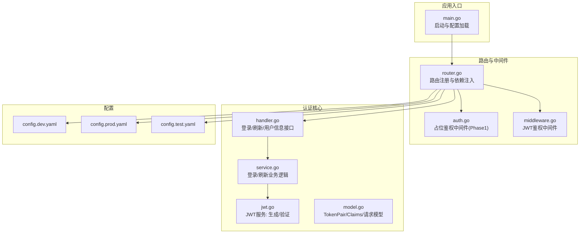
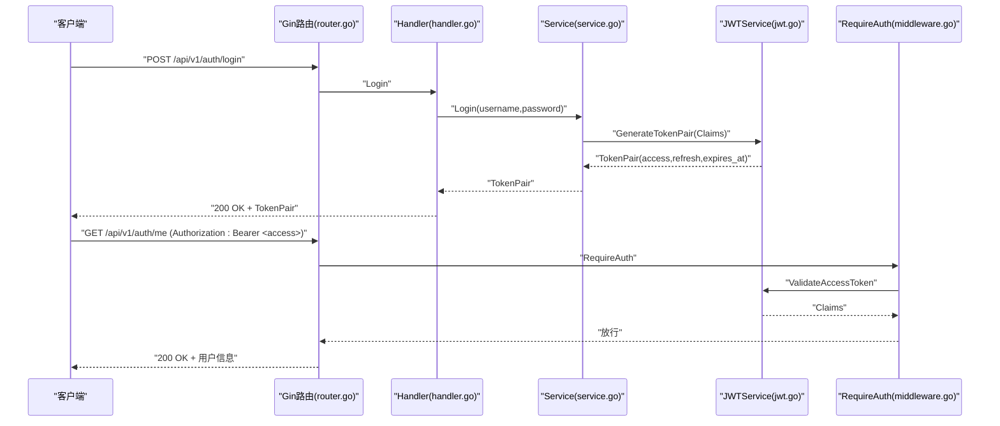
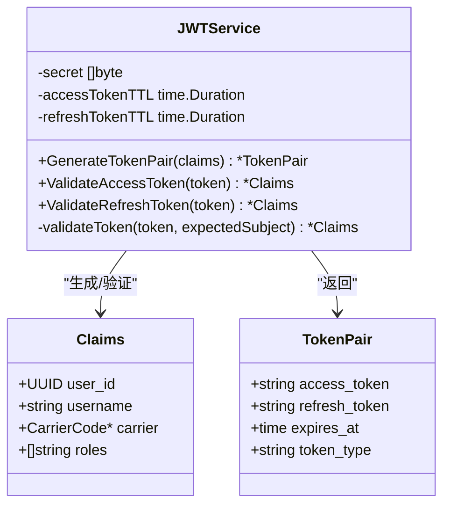
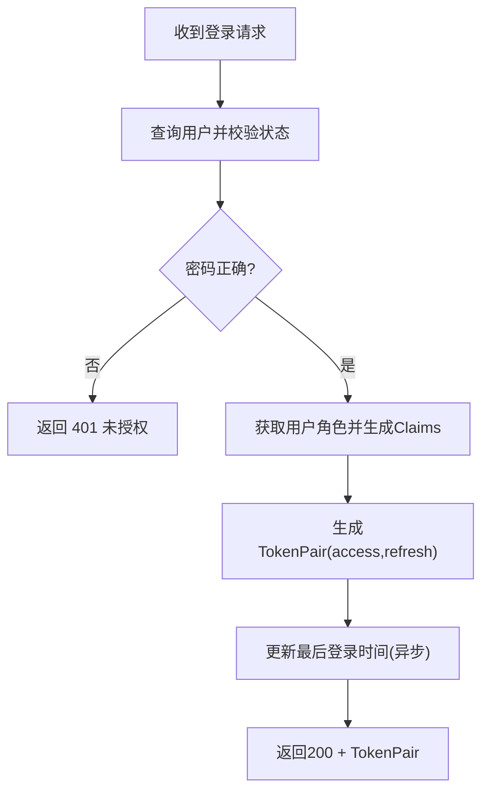
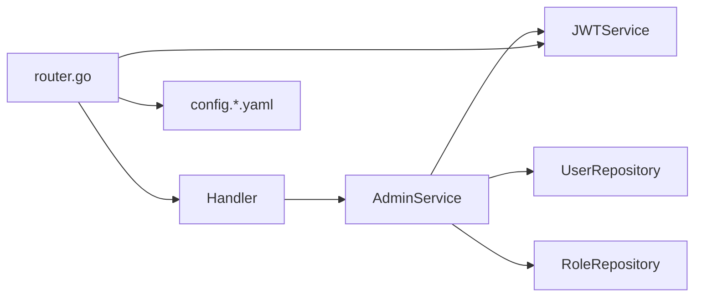

# 身份认证机制

<cite>
**本文引用的文件**
- [jwt.go](file://omcgo/internal/admin/jwt.go)
- [jwt_test.go](file://omcgo/internal/admin/jwt_test.go)
- [middleware.go](file://omcgo/internal/admin/middleware.go)
- [handler.go](file://omcgo/internal/admin/handler.go)
- [service.go](file://omcgo/internal/admin/service.go)
- [model.go](file://omcgo/internal/admin/model.go)
- [router.go](file://omcgo/cmd/app/router/router.go)
- [config.dev.yaml](file://omcgo/cmd/app/etc/config.dev.yaml)
- [config.prod.yaml](file://omcgo/cmd/app/etc/config.prod.yaml)
- [config.test.yaml](file://omcgo/cmd/app/etc/config.test.yaml)
- [main.go](file://omcgo/cmd/app/main.go)
- [auth.go](file://omcgo/internal/core/middleware/auth.go)
- [api_sprint1_test.go](file://omcgo/test/integration/api_sprint1_test.go)
- [middleware_test.go](file://omcgo/internal/admin/middleware_test.go)
</cite>

## 目录
1. [简介](#简介)
2. [项目结构](#项目结构)
3. [核心组件](#核心组件)
4. [架构概览](#架构概览)
5. [详细组件分析](#详细组件分析)
6. [依赖关系分析](#依赖关系分析)
7. [性能考虑](#性能考虑)
8. [故障排查指南](#故障排查指南)
9. [结论](#结论)
10. [附录](#附录)

## 简介
本文件面向 Baicells OMC 项目的 JWT 身份认证机制，系统性阐述令牌生成与验证、访问/刷新令牌的差异与使用场景、用户登录流程、令牌声明结构、令牌管理最佳实践（含撤销与续期）、以及可操作的配置指南与代码示例路径。文档同时给出关键流程的时序图与类图，帮助开发者快速理解并正确集成与扩展。

## 项目结构
JWT 认证相关代码主要集中在以下模块：
- 认证服务与路由：admin 包下的 Handler、Service、JWTService、中间件与模型定义
- 路由注册与依赖注入：app 路由器负责初始化 JWT 服务并挂载认证路由
- 配置：应用启动时从 YAML 加载 JWT 密钥与 TTL 配置
- 测试：覆盖令牌生成、验证、权限中间件、CORS 等行为

图表来源
- [main.go:33-75](file://omcgo/cmd/app/main.go#L33-L75)
- [router.go:45-349](file://omcgo/cmd/app/router/router.go#L45-L349)
- [jwt.go:12-136](file://omcgo/internal/admin/jwt.go#L12-L136)
- [middleware.go:21-58](file://omcgo/internal/admin/middleware.go#L21-L58)
- [handler.go:27-97](file://omcgo/internal/admin/handler.go#L27-L97)
- [service.go:41-116](file://omcgo/internal/admin/service.go#L41-L116)
- [model.go:52-127](file://omcgo/internal/admin/model.go#L52-L127)
- [config.dev.yaml:52-55](file://omcgo/cmd/app/etc/config.dev.yaml#L52-L55)
- [config.prod.yaml:52-55](file://omcgo/cmd/app/etc/config.prod.yaml#L52-L55)
- [config.test.yaml:52-55](file://omcgo/cmd/app/etc/config.test.yaml#L52-L55)

章节来源
- [main.go:17-75](file://omcgo/cmd/app/main.go#L17-L75)
- [router.go:45-349](file://omcgo/cmd/app/router/router.go#L45-L349)

## 核心组件
- JWTService：负责令牌生成与验证，采用 HS256 对称签名，支持自定义访问令牌与刷新令牌有效期
- 中间件 RequireAuth：在受保护路由上校验访问令牌，并将用户上下文写入请求
- Handler/Login：接收用户名/密码，调用服务进行认证，返回访问/刷新令牌对
- Service/Login/Refresh：执行凭据校验、角色获取、令牌签发与刷新逻辑
- 模型 TokenPair/Claims：定义令牌响应结构与声明内容
- 路由与配置：在启动时读取密钥与 TTL，注册公开与受保护路由

章节来源
- [jwt.go:12-136](file://omcgo/internal/admin/jwt.go#L12-L136)
- [middleware.go:21-58](file://omcgo/internal/admin/middleware.go#L21-L58)
- [handler.go:65-97](file://omcgo/internal/admin/handler.go#L65-L97)
- [service.go:41-116](file://omcgo/internal/admin/service.go#L41-L116)
- [model.go:52-127](file://omcgo/internal/admin/model.go#L52-L127)
- [router.go:109-116](file://omcgo/cmd/app/router/router.go#L109-L116)

## 架构概览
下图展示从客户端发起登录请求到令牌发放与后续访问控制的整体流程。

图表来源
- [router.go:170-181](file://omcgo/cmd/app/router/router.go#L170-L181)
- [handler.go:65-97](file://omcgo/internal/admin/handler.go#L65-L97)
- [service.go:41-81](file://omcgo/internal/admin/service.go#L41-L81)
- [jwt.go:48-96](file://omcgo/internal/admin/jwt.go#L48-L96)
- [middleware.go:21-58](file://omcgo/internal/admin/middleware.go#L21-L58)

## 详细组件分析

### JWTService 实现原理
- 令牌类型与签名
  - 使用 HS256 对称签名，密钥来自配置
  - 访问令牌(subject="access")与刷新令牌(subject="refresh")通过子字段区分
- 令牌生成
  - 生成两个独立令牌，各自设置 IssuedAt/ExpiresAt/ID
  - 返回结构包含 access_token、refresh_token、expires_at、token_type
- 令牌验证
  - ParseWithClaims 解析并校验签名
  - 校验签名方法、令牌有效性、subject 类型一致性
  - 返回 Claims 结构供中间件与业务使用

图表来源
- [jwt.go:12-136](file://omcgo/internal/admin/jwt.go#L12-L136)
- [model.go:74-80](file://omcgo/internal/admin/model.go#L74-L80)
- [model.go:52-58](file://omcgo/internal/admin/model.go#L52-L58)

章节来源
- [jwt.go:27-46](file://omcgo/internal/admin/jwt.go#L27-L46)
- [jwt.go:48-96](file://omcgo/internal/admin/jwt.go#L48-L96)
- [jwt.go:108-135](file://omcgo/internal/admin/jwt.go#L108-L135)

### 访问令牌与刷新令牌
- 访问令牌(access)
  - TTL 默认 30 分钟；用于日常 API 请求的身份验证
  - Subject 为 "access"，仅能被访问令牌验证器接受
- 刷新令牌(refresh)
  - TTL 默认 7 天；用于在访问令牌过期后换取新的令牌对
  - Subject 为 "refresh"，访问令牌验证器拒绝该令牌
- 使用场景
  - 前端短期持有访问令牌，定期使用刷新令牌轮换
  - 后端仅接受访问令牌，刷新令牌不参与常规 API 调用

章节来源
- [jwt.go:52-62](file://omcgo/internal/admin/jwt.go#L52-L62)
- [jwt.go:71-82](file://omcgo/internal/admin/jwt.go#L71-L82)
- [jwt.go:98-106](file://omcgo/internal/admin/jwt.go#L98-L106)
- [jwt_test.go:76-104](file://omcgo/internal/admin/jwt_test.go#L76-L104)

### 用户登录流程
- 凭据验证
  - Handler 接收 JSON 登录请求，调用 Service.Login
  - Service 从仓库获取用户，校验状态与密码哈希
  - 获取用户角色集合，转换为字符串数组
- 令牌发放
  - Service 调用 JWTService.GenerateTokenPair 生成访问/刷新令牌对
  - 更新用户最后登录时间（异步记录日志）
- 响应
  - Handler 返回 200 OK + TokenPair

图表来源
- [handler.go:65-80](file://omcgo/internal/admin/handler.go#L65-L80)
- [service.go:41-81](file://omcgo/internal/admin/service.go#L41-L81)
- [jwt.go:48-96](file://omcgo/internal/admin/jwt.go#L48-L96)

章节来源
- [handler.go:65-80](file://omcgo/internal/admin/handler.go#L65-L80)
- [service.go:41-81](file://omcgo/internal/admin/service.go#L41-L81)

### 令牌声明(Claims)结构
- 字段
  - user_id：用户唯一标识
  - username：用户名
  - carrier：运营商绑定（可空）
  - roles：角色名称数组
- 用途
  - 中间件将 Claims 写入请求上下文，供后续中间件与处理器使用
  - 载荷中携带角色信息，配合权限中间件进行细粒度授权

章节来源
- [model.go:74-80](file://omcgo/internal/admin/model.go#L74-L80)
- [middleware.go:52-55](file://omcgo/internal/admin/middleware.go#L52-L55)

### 中间件与权限控制
- RequireAuth
  - 校验 Authorization 头格式与存在性
  - 调用 JWTService.ValidateAccessToken 验证访问令牌
  - 成功后将用户上下文写入请求
- RequirePermission
  - 从上下文中读取用户ID，调用角色仓库检查资源-动作权限
- RequireCarrier
  - 将用户运营商绑定写入上下文过滤器，用于数据隔离

章节来源
- [middleware.go:21-58](file://omcgo/internal/admin/middleware.go#L21-L58)
- [middleware.go:60-101](file://omcgo/internal/admin/middleware.go#L60-L101)
- [middleware.go:103-120](file://omcgo/internal/admin/middleware.go#L103-L120)

### 路由与配置集成
- 路由注册
  - 公开认证路由：/api/v1/auth/login、/api/v1/auth/refresh
  - 受保护路由组：统一挂载 RequireAuth、RequireCarrier、审计中间件
- 配置加载
  - 从 YAML 读取 jwt.secret、jwt.access_token_ttl、jwt.refresh_token_ttl
  - 初始化 JWTServiceWithTTL 并注入到服务层

章节来源
- [router.go:170-181](file://omcgo/cmd/app/router/router.go#L170-L181)
- [router.go:174-179](file://omcgo/cmd/app/router/router.go#L174-L179)
- [router.go:113-116](file://omcgo/cmd/app/router/router.go#L113-L116)
- [config.dev.yaml:52-55](file://omcgo/cmd/app/etc/config.dev.yaml#L52-L55)

## 依赖关系分析
- 组件耦合
  - Handler 依赖 Service；Service 依赖 JWTService、用户/角色仓库
  - 路由层负责装配依赖并注册中间件
- 外部依赖
  - golang-jwt/jwt/v5：JWT 生成与验证
  - bcrypt：密码哈希比较
  - Gin：HTTP 路由与中间件
- 配置依赖
  - YAML 配置文件提供密钥与 TTL，影响令牌有效期与安全性

图表来源
- [router.go:109-116](file://omcgo/cmd/app/router/router.go#L109-L116)
- [service.go:15-39](file://omcgo/internal/admin/service.go#L15-L39)
- [jwt.go:12-17](file://omcgo/internal/admin/jwt.go#L12-L17)

章节来源
- [router.go:109-116](file://omcgo/cmd/app/router/router.go#L109-L116)
- [service.go:15-39](file://omcgo/internal/admin/service.go#L15-L39)

## 性能考虑
- 令牌生成与验证
  - HS256 为对称加密，CPU 开销低，适合高并发场景
  - 建议将访问令牌 TTL 设置为较短周期（如 30 分钟），降低泄露风险
- 中间件链路
  - RequireAuth 每次请求都会进行验证，建议确保 Gin 运行在 Release 模式以减少日志开销
- 存储与缓存
  - 当前实现为无状态令牌，避免了服务器端会话存储
  - 若需实现令牌撤销，可在数据库维护黑名单或缩短访问令牌 TTL 并结合刷新令牌轮换

## 故障排查指南
- 常见错误与定位
  - 缺失或格式错误的 Authorization 头：RequireAuth 返回 401
  - 令牌过期或签名不匹配：ValidateAccessToken 返回无效
  - 使用刷新令牌作为访问令牌：被拒绝并提示令牌类型不匹配
  - 刷新令牌验证失败：返回 401 未授权
- 单元测试参考
  - 令牌生成与解析、过期、非法密钥、空载荷等边界场景均有覆盖
  - 中间件对无效格式、无效令牌、错误令牌类型的处理已验证
- 集成测试参考
  - 端到端验证 TokenPair 字段完整性（access_token、refresh_token、expires_at、token_type）

章节来源
- [middleware.go:25-50](file://omcgo/internal/admin/middleware.go#L25-L50)
- [jwt.go:108-135](file://omcgo/internal/admin/jwt.go#L108-L135)
- [jwt_test.go:121-148](file://omcgo/internal/admin/jwt_test.go#L121-L148)
- [middleware_test.go:94-136](file://omcgo/internal/admin/middleware_test.go#L94-L136)
- [api_sprint1_test.go:51-60](file://omcgo/test/integration/api_sprint1_test.go#L51-L60)

## 结论
本项目采用 HS256 对称签名的 JWT 机制，通过访问/刷新令牌分离实现安全且可轮换的身份认证。路由层统一挂载鉴权中间件，服务层完成凭据校验与令牌发放，模型层定义清晰的声明与响应结构。建议在生产环境强化密钥管理、缩短访问令牌 TTL、结合刷新令牌策略与必要的令牌撤销机制，以进一步提升安全性与可用性。

## 附录

### 令牌管理最佳实践
- 令牌撤销
  - 方案一：引入黑名单（Redis/数据库），在中间件中校验是否在黑名单
  - 方案二：缩短访问令牌 TTL，频繁轮换，降低单次泄露风险
- 令牌续期
  - 使用刷新令牌在后台静默续期，前端保持短期访问令牌
- 安全配置
  - 密钥长度至少 32 字符，定期轮换
  - HTTPS 强制传输，Cookie SameSite/Lax/Strict（若使用 Cookie 存储）
  - 严格限制 CORS 源，避免跨域泄露

### 配置指南
- 密钥与有效期
  - 在配置文件中设置 jwt.secret、jwt.access_token_ttl、jwt.refresh_token_ttl
  - 应用启动时读取并注入到 JWTServiceWithTTL
- 环境变量
  - 可通过环境变量覆盖日志输出路径等配置项

章节来源
- [config.dev.yaml:52-55](file://omcgo/cmd/app/etc/config.dev.yaml#L52-L55)
- [config.prod.yaml:52-55](file://omcgo/cmd/app/etc/config.prod.yaml#L52-L55)
- [config.test.yaml:52-55](file://omcgo/cmd/app/etc/config.test.yaml#L52-L55)
- [main.go:40-44](file://omcgo/cmd/app/main.go#L40-L44)

### 代码示例路径
- 令牌生成与验证
  - [生成令牌对:48-96](file://omcgo/internal/admin/jwt.go#L48-L96)
  - [验证访问令牌:98-106](file://omcgo/internal/admin/jwt.go#L98-L106)
  - [验证刷新令牌:103-106](file://omcgo/internal/admin/jwt.go#L103-L106)
- 登录与刷新流程
  - [登录接口:65-80](file://omcgo/internal/admin/handler.go#L65-L80)
  - [刷新接口:82-97](file://omcgo/internal/admin/handler.go#L82-L97)
  - [登录业务逻辑:41-81](file://omcgo/internal/admin/service.go#L41-81)
  - [刷新业务逻辑:83-116](file://omcgo/internal/admin/service.go#L83-116)
- 中间件与权限
  - [鉴权中间件:21-58](file://omcgo/internal/admin/middleware.go#L21-58)
  - [权限中间件:60-101](file://omcgo/internal/admin/middleware.go#L60-101)
  - [运营商过滤中间件:103-120](file://omcgo/internal/admin/middleware.go#L103-120)
- 路由与依赖注入
  - [路由注册与中间件挂载:170-181](file://omcgo/cmd/app/router/router.go#L170-L181)
  - [JWT 服务初始化:113-116](file://omcgo/cmd/app/router/router.go#L113-L116)
- 测试参考
  - [令牌生成与解析测试:13-30](file://omcgo/internal/admin/jwt_test.go#L13-L30)
  - [令牌验证与过期测试:121-138](file://omcgo/internal/admin/jwt_test.go#L121-138)
  - [中间件鉴权测试:94-136](file://omcgo/internal/admin/middleware_test.go#L94-136)
  - [端到端 TokenPair 字段校验:51-60](file://omcgo/test/integration/api_sprint1_test.go#L51-L60)