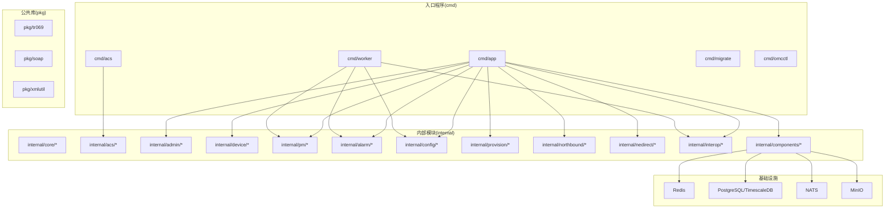
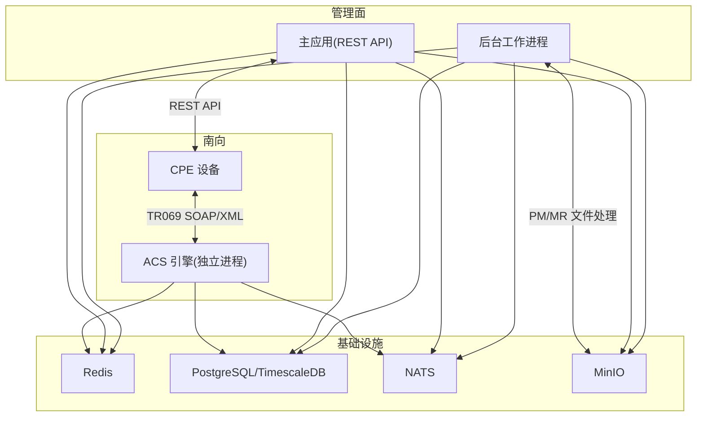

# 开发指南

<cite>
**本文引用的文件**
- [CLAUDE.md](file://CLAUDE.md)
- [Makefile](file://Makefile)
- [.golangci.yml](file://.golangci.yml)
- [go.mod](file://go.mod)
- [docs/README.md](file://docs/README.md)
- [cmd/app/etc/config.dev.yaml](file://cmd/app/etc/config.dev.yaml)
- [cmd/acs/etc/config.dev.yaml](file://cmd/acs/etc/config.dev.yaml)
- [cmd/worker/etc/config.dev.yaml](file://cmd/worker/etc/config.dev.yaml)
- [global/errors.go](file://global/errors.go)
- [deployments/docker/docker-compose.yml](file://deployments/docker/docker-compose.yml)
- [deployments/k8s/app/deployment.yaml](file://deployments/k8s/app/deployment.yaml)
- [test/integration/api_sprint1_test.go](file://test/integration/api_sprint1_test.go)
- [scripts/e2e_verify.sh](file://scripts/e2e_verify.sh)
</cite>

## 目录
1. [简介](#简介)
2. [项目结构](#项目结构)
3. [核心组件](#核心组件)
4. [架构总览](#架构总览)
5. [详细组件分析](#详细组件分析)
6. [依赖分析](#依赖分析)
7. [性能考虑](#性能考虑)
8. [故障排查指南](#故障排查指南)
9. [结论](#结论)
10. [附录](#附录)

## 简介
本指南面向 Baicells OMC 项目开发者，提供从代码规范、开发流程、项目结构、工具配置、测试实践到 CI/CD 的完整开发手册。项目采用模块化单体架构，核心包含 TR069 ACS 引擎、主应用与后台工作进程，配合 NATS、Redis、PostgreSQL/TimescaleDB、MinIO 等基础设施，支撑小基站/微基站的运维与控制。

## 项目结构
项目采用“入口程序 + 内部模块 + 公共库 + 部署与文档”的清晰分层：
- cmd：各进程入口（acs/app/worker/migrate/omcctl）
- internal：按功能域划分的业务模块（device、admin、pm、alarm、mr、config、provision、northbound、nedirect、interop 等）
- pkg：可复用的公共库（tr069、soap、xmlutil）
- deployments：Docker 与 Kubernetes 部署清单
- docs：统一文档中心
- test：单元与集成测试
- scripts：端到端验证与运维脚本
- configs/datamodels/migrations：运行配置、数据模型种子与数据库迁移

图表来源
- [CLAUDE.md:111-220](file://CLAUDE.md#L111-L220)
- [deployments/docker/docker-compose.yml:19-194](file://deployments/docker/docker-compose.yml#L19-L194)

章节来源
- [CLAUDE.md:111-220](file://CLAUDE.md#L111-L220)
- [docs/README.md:7-59](file://docs/README.md#L7-L59)

## 核心组件
- TR069 ACS 引擎：独立进程，负责设备连接请求、会话状态机、命令队列与 SOAP/XML 处理。
- 主应用：REST API 管理面，提供设备、告警、配置、性能、报表、运维工具等功能。
- 后台工作进程：PM/MR 文件处理、KPI 计算、定时任务等。
- 基础设施适配器：数据库、缓存、消息队列、对象存储、指标与链路追踪等。
- 公共库：TR069 类型与事件、SOAP 工具、XML 辅助工具。

章节来源
- [CLAUDE.md:38-60](file://CLAUDE.md#L38-L60)
- [CLAUDE.md:138-220](file://CLAUDE.md#L138-L220)

## 架构总览
系统采用“模块化单体 + 独立 ACS 引擎”的混合架构，避免微服务带来的分布式复杂度，同时将 TR069 有状态会话与管理面解耦。数据层采用 PostgreSQL/TimescaleDB，缓存与消息使用 Redis/NATS，对象存储使用 MinIO。部署支持 Docker Compose 与 Kubernetes。

图表来源
- [CLAUDE.md:38-60](file://CLAUDE.md#L38-L60)
- [deployments/docker/docker-compose.yml:19-194](file://deployments/docker/docker-compose.yml#L19-L194)

## 详细组件分析

### TR069/ACS 专项规范
- SOAP/XML 处理：发送方向使用预编译模板，接收方向使用流式解码，动态参数树使用 etree。
- 会话状态机：IDLE → INFORM_RECEIVED → PROCESSING → RPC_PENDING → RPC_RESPONSE → COMPLETE。
- Redis Key 命名与 TTL：会话、命令队列、心跳、去重、数据模型缓存等。
- 流量控制：设备级限流器、全局准入控制器、WorkerPool 控制并发。

章节来源
- [CLAUDE.md:280-311](file://CLAUDE.md#L280-L311)
- [CLAUDE.md:292-305](file://CLAUDE.md#L292-L305)

### 数据模型与配置专项规范
- 三级回退解析：product → oui → carrier_default。
- 三级缓存：进程内 L1、Redis L2、PostgreSQL。
- 生命周期：draft → active → deprecated，激活新模型自动废弃旧模型。

章节来源
- [CLAUDE.md:312-328](file://CLAUDE.md#L312-L328)

### 事件驱动规范
- EventBus 双实现：ChannelEventBus（单进程）与 NATSEventBus（多实例）。
- 事件 Subject 命名：点分层级，覆盖设备、命令、PM/MR、告警、北向推送等。

章节来源
- [CLAUDE.md:329-348](file://CLAUDE.md#L329-L348)

### 错误码与错误处理
- 全局错误码按域分配区间，便于前端与调用方统一处理。
- 错误处理模式：返回 error，wrap 上下文，sentinel error 与自定义错误类型区分业务与系统错误。

章节来源
- [global/errors.go:1-135](file://global/errors.go#L1-L135)
- [CLAUDE.md:250-255](file://CLAUDE.md#L250-L255)

### 配置与环境
- 三类进程分别提供 dev/test/prod 配置文件，覆盖数据库、缓存、消息队列、对象存储、指标、链路追踪、日志等。
- Docker Compose 一键启动所有依赖服务，并挂载日志卷。

章节来源
- [cmd/app/etc/config.dev.yaml:1-91](file://cmd/app/etc/config.dev.yaml#L1-L91)
- [cmd/acs/etc/config.dev.yaml:1-70](file://cmd/acs/etc/config.dev.yaml#L1-L70)
- [cmd/worker/etc/config.dev.yaml:1-63](file://cmd/worker/etc/config.dev.yaml#L1-L63)
- [deployments/docker/docker-compose.yml:19-194](file://deployments/docker/docker-compose.yml#L19-L194)

### API 文档与 OpenAPI
- 通过 swag 自动生成 OpenAPI 文档，便于前端对接与 API 测试。

章节来源
- [Makefile:42-47](file://Makefile#L42-L47)

## 依赖分析
- 语言与版本：Go 1.25+。
- Web 框架：gin（管理面）、net/http（ACS）。
- RPC：gRPC（进程间通信）。
- XML/SOAP：text/template（发送）、encoding/xml Decoder（接收）、beevik/etree（动态遍历）。
- 配置：viper（YAML + 环境变量 + 热重载）。
- CLI：cobra（omcctl）。
- 日志：zap。
- 指标：prometheus。
- 链路追踪：OpenTelemetry。
- 数据库：pgx/v5（驱动）、squirrel（SQL 构建）、golang-migrate（迁移）。
- 缓存：redis/go-redis/v9。
- 消息队列：nats.go。
- 对象存储：minio-go/v7。
- 参数验证：validator/v10。
- 定时任务：cron/v3。
- 测试：testify。
- API 文档：swag。

章节来源
- [go.mod:1-121](file://go.mod#L1-L121)
- [CLAUDE.md:63-94](file://CLAUDE.md#L63-L94)

## 性能考虑
- 限流与并发控制：设备级限流器、全局准入控制器、WorkerPool。
- 数据库连接池与健康检查：合理配置最大连接数、空闲时间、健康检查间隔。
- 指标与可观测性：Prometheus 指标、OpenTelemetry 链路追踪。
- 缓存策略：三级缓存与缓存版本号协调，避免脏读。
- 文件处理：PM/MR 文件异步处理与并发控制。

章节来源
- [CLAUDE.md:307-311](file://CLAUDE.md#L307-L311)
- [cmd/app/etc/config.dev.yaml:11-25](file://cmd/app/etc/config.dev.yaml#L11-L25)
- [cmd/acs/etc/config.dev.yaml:17-22](file://cmd/acs/etc/config.dev.yaml#L17-L22)
- [cmd/worker/etc/config.dev.yaml:1-7](file://cmd/worker/etc/config.dev.yaml#L1-L7)

## 故障排查指南
- 健康检查：/healthz 端点用于探活。
- CORS：确保前端域名与允许的方法/头正确配置。
- 认证与授权：登录、刷新令牌、鉴权中间件。
- 错误响应：统一的 code/message 格式，便于前端处理。
- 端到端验证：e2e_verify.sh 覆盖关键路径，包括健康检查、CORS、认证、设备、告警、模板、固件、升级任务、用户管理等。

章节来源
- [test/integration/api_sprint1_test.go:18-170](file://test/integration/api_sprint1_test.go#L18-L170)
- [scripts/e2e_verify.sh:103-800](file://scripts/e2e_verify.sh#L103-L800)

## 代码规范与最佳实践

### Go 编码规范
- 命名：exported 使用 PascalCase，unexported 使用 camelCase；接口以名词/动词命名，不加 I 前缀；包名简短、小写、单数。
- 领域常量：统一使用全局常量，避免硬编码字符串。
- 错误处理：返回 error，wrap 上下文；会话内错误隔离；使用 sentinel error 与自定义错误类型。
- 接口优先：核心领域概念用接口定义，便于测试与替换实现。
- 运营商适配：通过 Carrier 接口 + 适配器模式处理差异，禁止硬编码分支。
- 数据库访问：squirrel 构建 SQL + pgx/v5 执行，每个模块拥有独立 repository 层。
- 测试：testify 断言，table-driven tests，单元测试与源文件同目录，集成测试放 test/integration，E2E 放 test/e2e，测试数据放 test/fixtures。

章节来源
- [CLAUDE.md:224-280](file://CLAUDE.md#L224-L280)

### Git 工作流与提交规范
- 分支策略：main（稳定）、feature/{描述}、fix/{描述}、refactor/{描述}、release/x.x。
- 提交信息：Conventional Commits，scope 对应功能域或模块。
- PR 流程：从 main 创建分支，PR 描述包含变更说明、关联功能域编号、测试说明，通过后 squash merge。

章节来源
- [CLAUDE.md:351-408](file://CLAUDE.md#L351-L408)

### 开发工具与质量保障
- 代码检查：golangci-lint，启用 errcheck、govet、staticcheck、unused、gosimple、ineffassign、typecheck、misspell、gofmt、goimports、gocritic。
- 代码生成：protoc 与 swag 生成 protobuf 与 OpenAPI 文档。
- 数据库迁移：make migrate-up/down，或使用 migrate 命令行工具。
- Docker：一键构建与启动本地开发环境。

章节来源
- [.golangci.yml:1-39](file://.golangci.yml#L1-L39)
- [Makefile:35-74](file://Makefile#L35-L74)
- [deployments/docker/docker-compose.yml:80-194](file://deployments/docker/docker-compose.yml#L80-L194)

### 测试驱动开发实践
- 单元测试：与源文件同目录，使用 testify 断言。
- 集成测试：test/integration，依赖外部基础设施（PostgreSQL、Redis 等）。
- 端到端测试：scripts/e2e_verify.sh，覆盖健康检查、CORS、认证、设备、告警、模板、固件、升级任务、用户管理等关键路径。
- 测试覆盖率：使用 make test-coverage 生成覆盖率报告。

章节来源
- [test/integration/api_sprint1_test.go:1-170](file://test/integration/api_sprint1_test.go#L1-L170)
- [scripts/e2e_verify.sh:1-800](file://scripts/e2e_verify.sh#L1-L800)
- [Makefile:27-29](file://Makefile#L27-L29)

### 持续集成与持续部署
- 本地开发：docker-compose 一键启动 PostgreSQL、Redis、NATS、MinIO，迁移数据库，启动各进程。
- 生产部署：Kubernetes Deployment，包含就绪/存活探针、资源限制、Secrets 与 ConfigMap。
- 配置管理：YAML + 环境变量，支持热重载。

章节来源
- [deployments/docker/docker-compose.yml:19-194](file://deployments/docker/docker-compose.yml#L19-L194)
- [deployments/k8s/app/deployment.yaml:1-103](file://deployments/k8s/app/deployment.yaml#L1-L103)

## 结论
本指南提供了 Baicells OMC 项目的开发规范、流程与实践参考，建议新开发者先阅读 CLAUDE.md 的总体架构与规范，再结合 Makefile、.golangci.yml 与配置文件进行本地开发与测试，最后通过 Docker Compose 与 Kubernetes 清单完成本地与生产的部署验证。

## 附录

### 常用命令速查
- 构建：make build、make build-acs、make build-app、make build-worker、make build-migrate、make build-omcctl
- 测试：make test、make test-coverage、make test-integration
- 质量：make lint、make vet
- 生成：make generate
- 数据库：make migrate-up、make migrate-down、make migrate-create name=<migration_name>
- Docker：make docker-build、make docker-up、make docker-down
- 清理：make clean

章节来源
- [Makefile:1-74](file://Makefile#L1-L74)