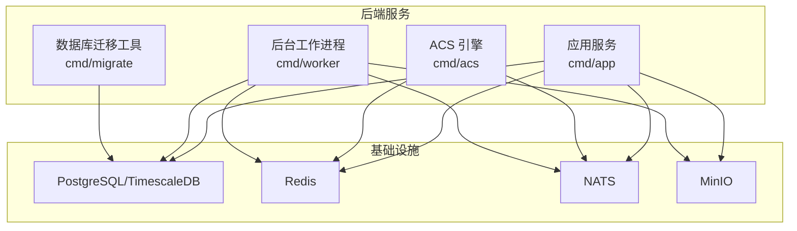
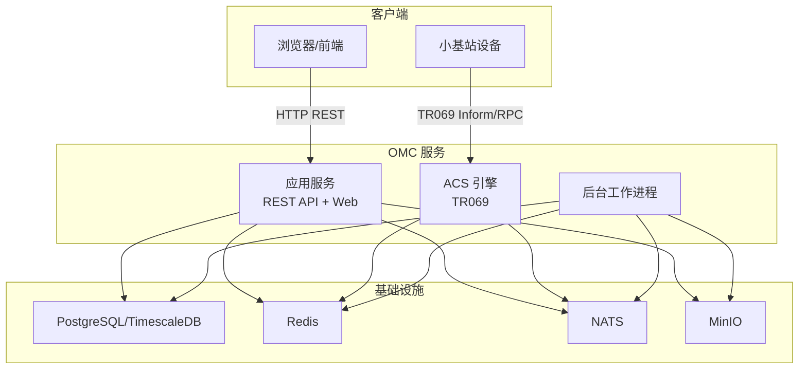
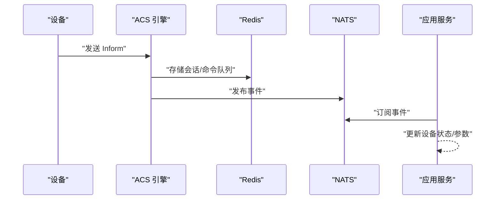
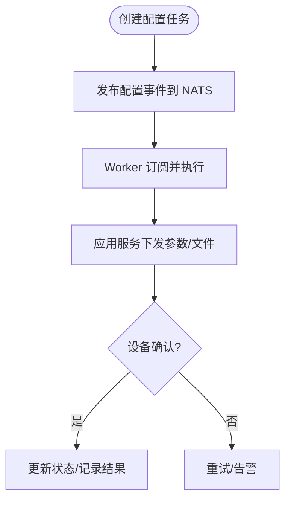
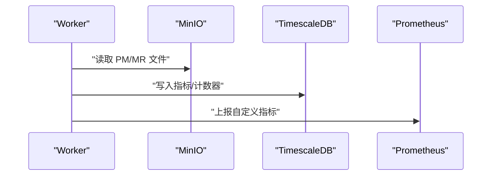
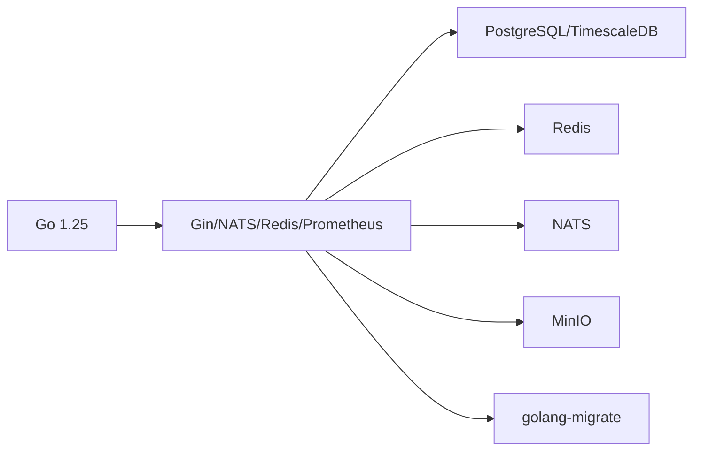

# 快速开始

<cite>
**本文引用的文件**
- [go.mod](file://omcgo/go.mod)
- [Makefile](file://omcgo/Makefile)
- [docker-compose.yml](file://omcgo/deployments/docker/docker-compose.yml)
- [config.dev.yaml（应用）](file://omcgo/cmd/app/etc/config.dev.yaml)
- [config.dev.yaml（ACS）](file://omcgo/cmd/acs/etc/config.dev.yaml)
- [config.dev.yaml（Worker）](file://omcgo/cmd/worker/etc/config.dev.yaml)
- [main.go（应用）](file://omcgo/cmd/app/main.go)
- [main.go（ACS）](file://omcgo/cmd/acs/main.go)
- [main.go（Worker）](file://omcgo/cmd/worker/main.go)
- [main.go（迁移）](file://omcgo/cmd/migrate/main.go)
- [bootstrap.go](file://omcgo/internal/core/bootstrap/bootstrap.go)
- [deployment-guide.md](file://omcgo/docs/operations/deployment-guide.md)
- [seed.sh](file://omcgo/scripts/seed.sh)
</cite>

## 目录
1. [简介](#简介)
2. [项目结构](#项目结构)
3. [核心组件](#核心组件)
4. [架构总览](#架构总览)
5. [详细组件分析](#详细组件分析)
6. [依赖分析](#依赖分析)
7. [性能考虑](#性能考虑)
8. [故障排除指南](#故障排除指南)
9. [结论](#结论)
10. [附录](#附录)

## 简介
本快速开始指南面向新加入 Baicells OMC 项目的开发者，帮助你在最短时间内完成环境准备、项目构建与运行，并掌握本地开发环境的搭建流程。你将学会：
- 安装与配置 Go 1.25+、Docker、PostgreSQL、Redis、NATS、MinIO 等依赖
- 克隆项目、编译与运行后端服务
- 初始化数据库、加载种子数据、配置环境变量与服务启动顺序
- 基本使用示例：设备注册、配置下发、性能监控等核心功能的体验路径
- 常见问题排查与故障处理

## 项目结构
OMC 项目采用多模块、多服务的分层组织方式，核心后端位于 omcgo 目录，包含以下关键子模块：
- cmd/*：各二进制入口（acs、app、worker、migrate、omcctl）
- internal/*：业务领域模块（设备管理、配置下发、性能/告警/MR 处理、告警引擎、备份等）
- deployments/docker：Docker 镜像与 compose 编排
- docs/operations：部署与运维指南
- scripts：数据库迁移与种子数据加载脚本
- migrations：数据库迁移脚本

图表来源
- [docker-compose.yml:19-194](file://omcgo/deployments/docker/docker-compose.yml#L19-L194)
- [bootstrap.go:64-138](file://omcgo/internal/core/bootstrap/bootstrap.go#L64-L138)

章节来源
- [go.mod:1-121](file://omcgo/go.mod#L1-L121)
- [Makefile:1-74](file://omcgo/Makefile#L1-L74)

## 核心组件
- 应用服务（app）：提供 REST API、设备管理、配置下发、报表生成等核心能力，监听 8081 端口，同时暴露 Prometheus 指标 9091
- ACS 引擎（acs）：TR069/CWMP 自动配置服务器，负责设备注册、Inform 上报、命令下发，监听 7547 端口，指标 9090
- 后台工作进程（worker）：事件驱动的数据采集与处理，包括 PM/MR 文件解析、KPI 计算、告警聚合、备份执行、报表生成，指标 9092
- 数据库迁移工具（migrate）：基于 golang-migrate 的数据库迁移 CLI
- 基础设施：PostgreSQL/TimescaleDB、Redis、NATS、MinIO，通过 docker-compose 统一编排

章节来源
- [config.dev.yaml（应用）:1-91](file://omcgo/cmd/app/etc/config.dev.yaml#L1-L91)
- [config.dev.yaml（ACS）:1-70](file://omcgo/cmd/acs/etc/config.dev.yaml#L1-L70)
- [config.dev.yaml（Worker）:1-63](file://omcgo/cmd/worker/etc/config.dev.yaml#L1-L63)
- [main.go（应用）:17-75](file://omcgo/cmd/app/main.go#L17-L75)
- [main.go（ACS）:33-76](file://omcgo/cmd/acs/main.go#L33-L76)
- [main.go（Worker）:44-68](file://omcgo/cmd/worker/main.go#L44-L68)
- [main.go（迁移）:14-52](file://omcgo/cmd/migrate/main.go#L14-L52)

## 架构总览
下图展示了本地开发环境的服务交互关系与数据流：

图表来源
- [docker-compose.yml:19-194](file://omcgo/deployments/docker/docker-compose.yml#L19-L194)
- [bootstrap.go:64-138](file://omcgo/internal/core/bootstrap/bootstrap.go#L64-L138)

## 详细组件分析

### 环境准备与依赖安装
- Go 语言：要求 1.25+，用于编译后端服务
- Docker：用于容器化运行数据库与中间件
- PostgreSQL/TimescaleDB：应用与指标数据存储
- Redis：会话存储、命令队列
- NATS：事件总线与消息传输
- MinIO：对象存储（PM/MR 文件、固件、日志、报表）

章节来源
- [go.mod:3-29](file://omcgo/go.mod#L3-L29)
- [docker-compose.yml:20-78](file://omcgo/deployments/docker/docker-compose.yml#L20-L78)

### 项目克隆与构建
- 克隆仓库后，使用 Makefile 提供的一键构建命令：
  - 构建全部：make build
  - 构建单个：make build-acs / build-app / build-worker / build-migrate / build-omcctl
- 或直接使用 go build 指令在各 cmd 目录下构建

章节来源
- [Makefile:1-22](file://omcgo/Makefile#L1-L22)

### 数据库初始化与迁移
- 使用迁移工具执行 up 命令，或通过 docker-compose 的 migrate 服务自动执行
- 迁移工具支持 --dsn 与 --path 参数，也可通过环境变量 OMCGO_DB_DSN 指定 DSN

章节来源
- [main.go（迁移）:14-52](file://omcgo/cmd/migrate/main.go#L14-L52)
- [docker-compose.yml:80-91](file://omcgo/deployments/docker/docker-compose.yml#L80-L91)

### 加载种子数据
- 提供 seed.sh 脚本，自动从 datamodels/seed 导入运营商默认数据模型
- 支持通过 --dsn 或 OMCGO_DB_DSN 指定数据库连接

章节来源
- [seed.sh:1-61](file://omcgo/scripts/seed.sh#L1-L61)

### 本地开发环境启动顺序
- 启动基础设施：docker-compose up -d（PostgreSQL、Redis、NATS、MinIO）
- 执行数据库迁移：make migrate-up 或 docker-compose 运行 migrate 服务
- 加载种子数据：./scripts/seed.sh
- 启动各服务：
  - 应用服务：./bin/omcgo-app --config cmd/app/etc/config.dev.yaml
  - ACS 引擎：./bin/omcgo-acs --config cmd/acs/etc/config.dev.yaml
  - 后台工作进程：./bin/omcgo-worker --config cmd/worker/etc/config.dev.yaml
- Web 访问：Nginx 反向代理至 app 与 acs，默认 80/8080 端口

章节来源
- [docker-compose.yml:65-187](file://omcgo/deployments/docker/docker-compose.yml#L65-L187)
- [config.dev.yaml（应用）:1-91](file://omcgo/cmd/app/etc/config.dev.yaml#L1-L91)
- [config.dev.yaml（ACS）:1-70](file://omcgo/cmd/acs/etc/config.dev.yaml#L1-L70)
- [config.dev.yaml（Worker）:1-63](file://omcgo/cmd/worker/etc/config.dev.yaml#L1-L63)

### 基本使用示例

#### 设备注册与 Inform 上报
- 启动 ACS 引擎与应用服务
- 在设备侧配置正确的 ACS URL（由 compose 中暴露的端口决定）
- 设备发起 TR069 Inform，ACS 接收并写入会话与命令队列
- 应用服务可通过 REST API 查询设备状态与参数

图表来源
- [main.go（ACS）:53-76](file://omcgo/cmd/acs/main.go#L53-L76)
- [bootstrap.go:199-202](file://omcgo/internal/core/bootstrap/bootstrap.go#L199-L202)

章节来源
- [config.dev.yaml（ACS）:13-22](file://omcgo/cmd/acs/etc/config.dev.yaml#L13-L22)
- [config.dev.yaml（应用）:11-17](file://omcgo/cmd/app/etc/config.dev.yaml#L11-L17)

#### 配置下发与参数管理
- 应用服务提供 REST API，支持创建/下发配置模板与基线
- Worker 订阅事件，执行参数同步与文件传输
- 配置变更通过 NATS 事件驱动传播

图表来源
- [bootstrap.go:199-202](file://omcgo/internal/core/bootstrap/bootstrap.go#L199-L202)
- [main.go（Worker）:70-144](file://omcgo/cmd/worker/main.go#L70-L144)

章节来源
- [config.dev.yaml（应用）:44-50](file://omcgo/cmd/app/etc/config.dev.yaml#L44-L50)
- [config.dev.yaml（Worker）:29-40](file://omcgo/cmd/worker/etc/config.dev.yaml#L29-L40)

#### 性能监控与指标采集
- 各服务均暴露 Prometheus 指标端点（9090/9091/9092）
- 应用服务与 ACS 引擎分别提供 HTTP 与指标服务器
- Worker 通过 NATS 消费事件，处理 PM/MR 文件并计算 KPI

图表来源
- [config.dev.yaml（应用）:70-76](file://omcgo/cmd/app/etc/config.dev.yaml#L70-L76)
- [config.dev.yaml（ACS）:49-50](file://omcgo/cmd/acs/etc/config.dev.yaml#L49-L50)
- [config.dev.yaml（Worker）:42-43](file://omcgo/cmd/worker/etc/config.dev.yaml#L42-L43)

章节来源
- [main.go（应用）:221-242](file://omcgo/cmd/app/main.go#L221-L242)
- [main.go（ACS）:70-76](file://omcgo/cmd/acs/main.go#L70-L76)
- [main.go（Worker）:63-67](file://omcgo/cmd/worker/main.go#L63-L67)

## 依赖分析
- 语言与框架：Go 1.25，Gin、gRPC、OpenTelemetry、Prometheus、Viper、Cobra 等
- 数据库：PostgreSQL/TimescaleDB（PGX 连接池），支持独立 TSDB 连接
- 缓存与消息：Redis（go-redis）、NATS（JetStream）
- 对象存储：MinIO（用于 PM/MR/固件/日志/报表）
- 迁移：golang-migrate
- 构建与编排：Makefile、Docker、docker-compose

图表来源
- [go.mod:5-29](file://omcgo/go.mod#L5-L29)
- [bootstrap.go:14-31](file://omcgo/internal/core/bootstrap/bootstrap.go#L14-L31)

章节来源
- [go.mod:1-121](file://omcgo/go.mod#L1-L121)
- [bootstrap.go:64-138](file://omcgo/internal/core/bootstrap/bootstrap.go#L64-L138)

## 性能考虑
- 连接池与健康检查：PostgreSQL/TimescaleDB 连接池配置了最大连接数、空闲时间与健康检查间隔
- NATS JetStream：自动创建流并确保消费者可用，避免背压
- 指标与可观测性：每个服务独立指标端口，便于 Prometheus 抓取
- 生产部署建议：参考部署指南中的容量规划与扩缩容策略

章节来源
- [config.dev.yaml（应用）:11-25](file://omcgo/cmd/app/etc/config.dev.yaml#L11-L25)
- [config.dev.yaml（Worker）:1-15](file://omcgo/cmd/worker/etc/config.dev.yaml#L1-L15)
- [deployment-guide.md:108-136](file://omcgo/docs/operations/deployment-guide.md#L108-L136)

## 故障排除指南
- 无法访问应用服务
  - 检查应用服务端口 8081 与 Nginx 映射是否正确
  - 查看应用服务日志与指标端口 9091
- 设备无法注册/接收 Inform
  - 确认 ACS 服务端口与外部可达性
  - 检查 Redis 连接与 NATS JetStream 可用性
- 数据库连接失败
  - 确认 PostgreSQL/TimescaleDB 已启动并通过健康检查
  - 使用迁移工具验证 DSN 与权限
- Worker 不处理事件
  - 检查 NATS 消费者状态与 lag
  - 查看 Worker 日志与指标端口 9092
- 日志轮转与输出路径
  - 通过环境变量 OMCGO_LOG_OUTPUT_PATHS 指定输出路径（逗号分隔）

章节来源
- [docker-compose.yml:80-187](file://omcgo/deployments/docker/docker-compose.yml#L80-L187)
- [config.dev.yaml（应用）:78-91](file://omcgo/cmd/app/etc/config.dev.yaml#L78-L91)
- [config.dev.yaml（ACS）:57-69](file://omcgo/cmd/acs/etc/config.dev.yaml#L57-L69)
- [config.dev.yaml（Worker）:50-63](file://omcgo/cmd/worker/etc/config.dev.yaml#L50-L63)
- [deployment-guide.md:186-207](file://omcgo/docs/operations/deployment-guide.md#L186-L207)

## 结论
通过本指南，你可以快速完成本地开发环境的搭建与运行，理解各服务的职责与交互关系，并掌握设备注册、配置下发、性能监控等核心功能的基本使用路径。建议在熟悉本地环境后，进一步阅读部署指南以了解生产级部署与运维实践。

## 附录

### 环境变量与配置要点
- OMCGO_DB_DSN：数据库连接字符串（迁移工具优先使用该环境变量）
- OMCGO_LOG_OUTPUT_PATHS：日志输出路径（逗号分隔），可覆盖配置文件中的输出路径
- 各服务的指标端口与日志格式可在对应 config.dev.yaml 中配置

章节来源
- [main.go（迁移）:54-71](file://omcgo/cmd/migrate/main.go#L54-L71)
- [main.go（应用）:40-43](file://omcgo/cmd/app/main.go#L40-L43)
- [main.go（ACS）:40-43](file://omcgo/cmd/acs/main.go#L40-L43)
- [main.go（Worker）:51-54](file://omcgo/cmd/worker/main.go#L51-L54)