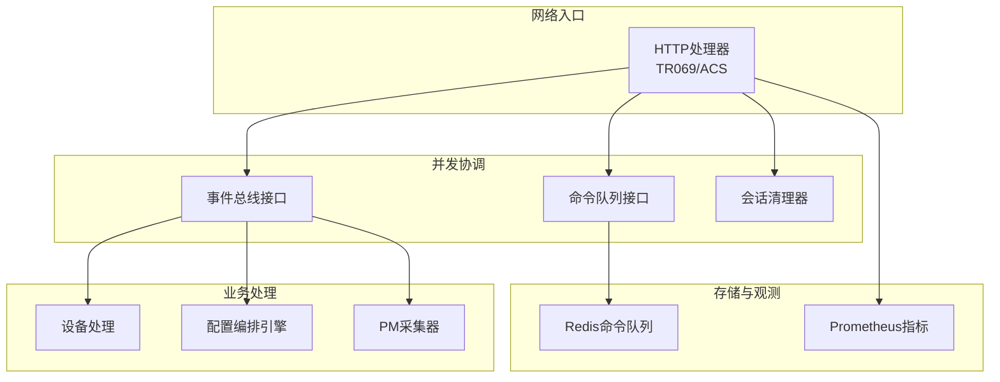
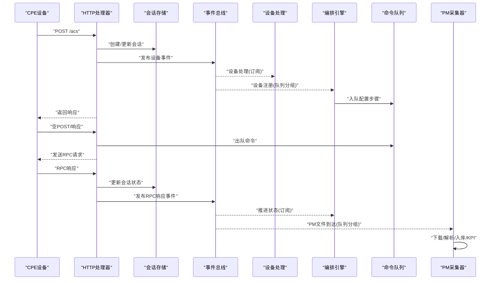
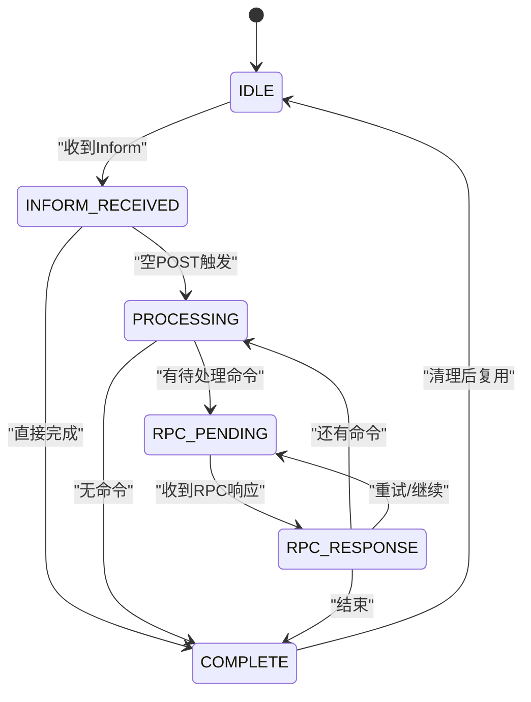
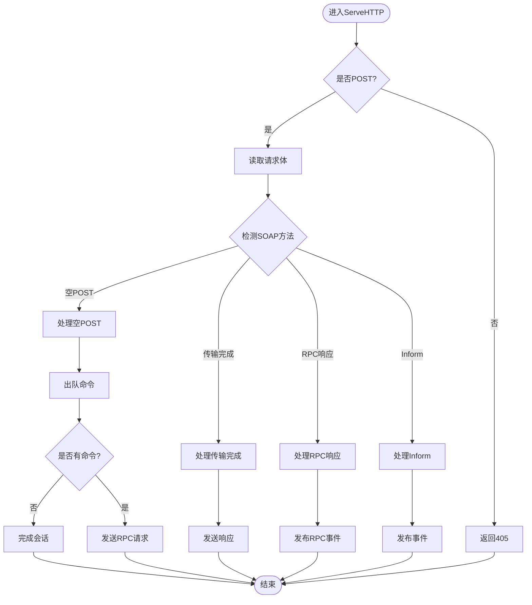
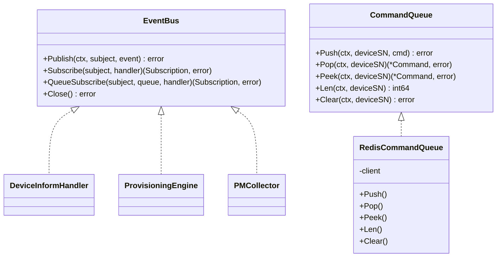
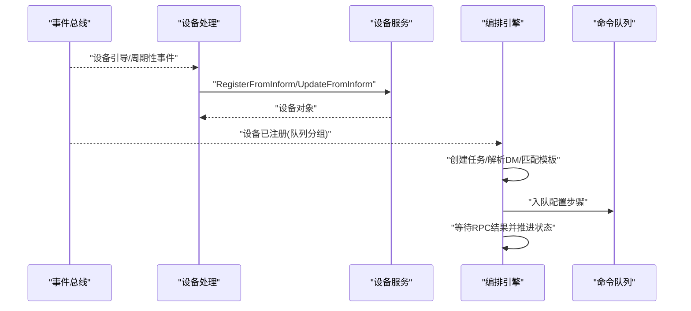
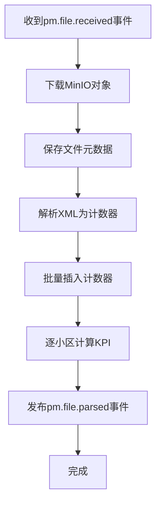
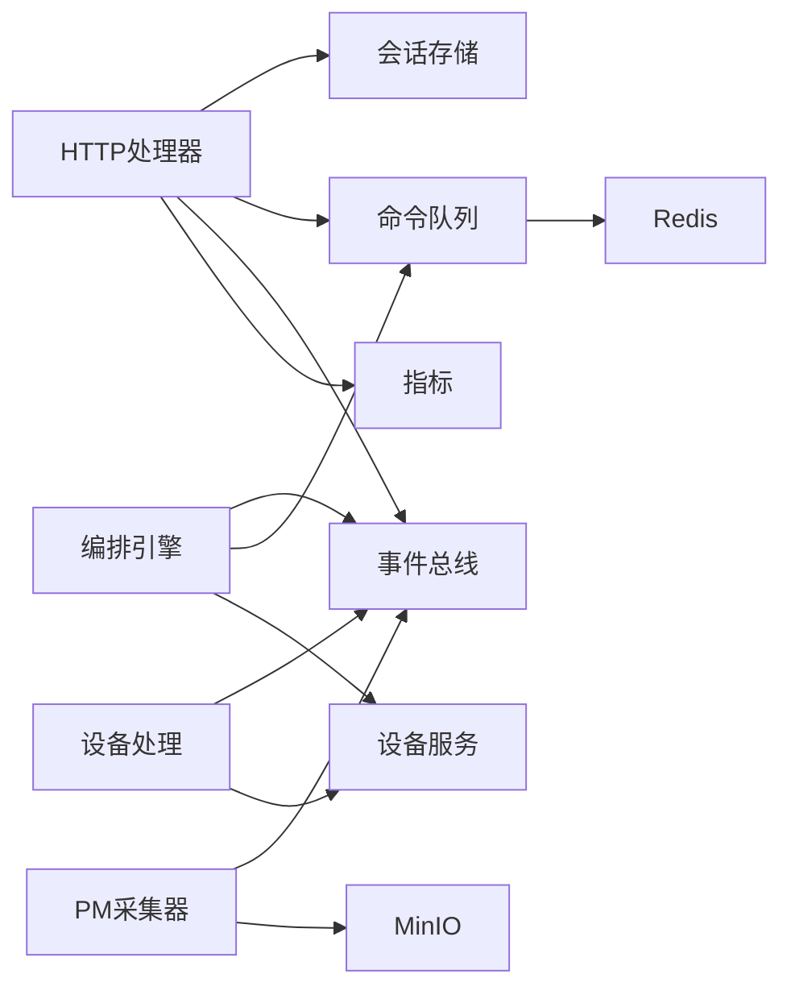

# 并发处理优化

<cite>
**本文引用的文件**
- [session.go](file://omcgo/internal/acs/session.go)
- [handler.go](file://omcgo/internal/acs/handler.go)
- [metrics.go](file://omcgo/internal/acs/metrics.go)
- [queue.go](file://omcgo/internal/acs/cmdqueue/queue.go)
- [bus.go](file://omcgo/internal/core/event/bus.go)
- [inform_handler.go](file://omcgo/internal/device/inform_handler.go)
- [collector.go](file://omcgo/internal/pm/collector/collector.go)
- [engine.go](file://omcgo/internal/provision/engine.go)
</cite>

## 目录
1. [简介](#简介)
2. [项目结构](#项目结构)
3. [核心组件](#核心组件)
4. [架构总览](#架构总览)
5. [详细组件分析](#详细组件分析)
6. [依赖分析](#依赖分析)
7. [性能考虑](#性能考虑)
8. [故障排查指南](#故障排查指南)
9. [结论](#结论)
10. [附录](#附录)

## 简介
本文件面向Baicells OMC项目的并发处理优化，聚焦于Go语言并发模型在系统中的落地：goroutine管理、channel使用、context传递；异步处理优化（事件总线设计、消息队列、批处理）；锁优化策略（互斥锁、读写锁、无锁数据结构）；并发安全的数据结构设计；并发性能监控（Goroutines数量、阻塞分析、死锁检测）以及并发调试工具与最佳实践。

## 项目结构
围绕并发处理的关键模块包括：
- ACS会话与请求处理：HTTP入口、会话状态机、速率限制与准入控制、后台清理器
- 事件总线：发布订阅与队列分组负载均衡
- 命令队列：基于Redis的有序命令队列，支持优先级与过期
- 设备与配置编排：设备信息处理、自动配置编排引擎
- 性能与MR数据采集：PM文件接收、解析、计数器批量入库、KPI计算
- 指标监控：Prometheus指标注册与观测

**图表来源**
- [handler.go:27-68](file://omcgo/internal/acs/handler.go#L27-L68)
- [bus.go:5-20](file://omcgo/internal/core/event/bus.go#L5-L20)
- [queue.go:24-47](file://omcgo/internal/acs/cmdqueue/queue.go#L24-L47)
- [metrics.go:5-14](file://omcgo/internal/acs/metrics.go#L5-L14)

**章节来源**
- [handler.go:27-68](file://omcgo/internal/acs/handler.go#L27-L68)
- [bus.go:5-20](file://omcgo/internal/core/event/bus.go#L5-L20)
- [queue.go:24-47](file://omcgo/internal/acs/cmdqueue/queue.go#L24-L47)
- [metrics.go:5-14](file://omcgo/internal/acs/metrics.go#L5-L14)

## 核心组件
- 会话与状态机：定义TR069会话状态与合法转换，确保并发场景下的状态一致性
- HTTP处理器：基于sync.Map进行连接到设备的绑定，启动后台清理器，按方法分派处理
- 事件总线：支持普通订阅与队列分组订阅，实现负载均衡与解耦
- 命令队列：基于Redis有序集合，支持优先级、FIFO同优先级排序、过期跳过、并发弹出
- 配置编排引擎：订阅设备注册事件，构建并入队配置步骤，基于RPC响应推进状态
- PM采集器：订阅文件到达事件，串行下载解析入库，批量插入计数器，逐小区计算KPI
- 指标监控：注册活跃会话、Inform事件、RPC耗时、错误、会话时长、速率限制等指标

**章节来源**
- [session.go:21-59](file://omcgo/internal/acs/session.go#L21-L59)
- [handler.go:27-68](file://omcgo/internal/acs/handler.go#L27-L68)
- [bus.go:5-20](file://omcgo/internal/core/event/bus.go#L5-L20)
- [queue.go:13-47](file://omcgo/internal/acs/cmdqueue/queue.go#L13-L47)
- [engine.go:19-52](file://omcgo/internal/provision/engine.go#L19-L52)
- [collector.go:28-63](file://omcgo/internal/pm/collector/collector.go#L28-L63)
- [metrics.go:5-14](file://omcgo/internal/acs/metrics.go#L5-L14)

## 架构总览
下图展示从HTTP请求到事件驱动处理、再到命令队列与编排引擎的整体流程，体现异步化与并发化设计：

**图表来源**
- [handler.go:119-216](file://omcgo/internal/acs/handler.go#L119-L216)
- [inform_handler.go:46-67](file://omcgo/internal/device/inform_handler.go#L46-L67)
- [engine.go:64-75](file://omcgo/internal/provision/engine.go#L64-L75)
- [queue.go:49-110](file://omcgo/internal/acs/cmdqueue/queue.go#L49-L110)
- [collector.go:55-63](file://omcgo/internal/pm/collector/collector.go#L55-L63)

## 详细组件分析

### 会话与状态机
- 设计要点
  - 使用字符串枚举表示会话状态，配合映射表限定合法转换，避免竞态下的非法状态
  - 提供原子化的状态迁移函数，结合时间戳更新，便于审计与超时判断
  - 通过JSON序列化支持持久化存储（如Redis）
- 并发安全
  - 状态迁移在单个会话对象上执行，建议在调用侧加锁或使用单消费者保证状态变更串行化
  - 存储层可采用分布式锁或CAS操作，确保跨实例一致性

**图表来源**
- [session.go:12-41](file://omcgo/internal/acs/session.go#L12-L41)

**章节来源**
- [session.go:21-71](file://omcgo/internal/acs/session.go#L21-L71)

### HTTP处理器与goroutine管理
- 设计要点
  - 使用sync.Map维护“连接地址→设备SN”的映射，支持高并发读写
  - 启动后台清理器定时扫描并释放过期连接绑定、释放准入槽位、更新指标
  - 按SOAP方法分派处理：Inform、空POST、RPC响应、传输完成等
  - 在处理过程中使用上下文传播取消信号，确保I/O操作可取消
- goroutine与channel
  - 清理器以ticker驱动，内部使用goroutine循环
  - 未见显式channel用于请求处理，主要通过sync.Map与Prometheus指标进行并发协调
- 锁优化
  - sync.Map适合高读低写场景；若存在热点键冲突，可考虑拆分键空间或引入更细粒度的锁

**图表来源**
- [handler.go:70-117](file://omcgo/internal/acs/handler.go#L70-L117)
- [handler.go:119-216](file://omcgo/internal/acs/handler.go#L119-L216)
- [handler.go:218-278](file://omcgo/internal/acs/handler.go#L218-L278)
- [handler.go:280-342](file://omcgo/internal/acs/handler.go#L280-L342)
- [handler.go:361-391](file://omcgo/internal/acs/handler.go#L361-L391)
- [handler.go:393-442](file://omcgo/internal/acs/handler.go#L393-L442)

**章节来源**
- [handler.go:27-68](file://omcgo/internal/acs/handler.go#L27-L68)
- [handler.go:70-117](file://omcgo/internal/acs/handler.go#L70-L117)
- [handler.go:119-216](file://omcgo/internal/acs/handler.go#L119-L216)
- [handler.go:218-278](file://omcgo/internal/acs/handler.go#L218-L278)
- [handler.go:280-342](file://omcgo/internal/acs/handler.go#L280-L342)
- [handler.go:361-391](file://omcgo/internal/acs/handler.go#L361-L391)
- [handler.go:393-442](file://omcgo/internal/acs/handler.go#L393-L442)

### 事件总线与消息队列
- 事件总线
  - 支持普通订阅（多订阅者各自接收）与队列分组订阅（同组内负载均衡）
  - 订阅接口返回订阅句柄，便于取消订阅
- 命令队列
  - 基于Redis有序集合，score综合优先级与时间戳，实现优先级+公平调度
  - 出队时跳过过期项，最大迭代次数防止无限循环
  - 提供Push、Pop、Peek、Len、Clear等操作

**图表来源**
- [bus.go:5-20](file://omcgo/internal/core/event/bus.go#L5-L20)
- [queue.go:24-47](file://omcgo/internal/acs/cmdqueue/queue.go#L24-L47)
- [queue.go:39-47](file://omcgo/internal/acs/cmdqueue/queue.go#L39-L47)

**章节来源**
- [bus.go:5-20](file://omcgo/internal/core/event/bus.go#L5-L20)
- [queue.go:13-47](file://omcgo/internal/acs/cmdqueue/queue.go#L13-L47)
- [queue.go:49-110](file://omcgo/internal/acs/cmdqueue/queue.go#L49-L110)

### 设备处理与配置编排
- 设备处理
  - 订阅设备Inform事件，按事件类型路由到引导注册或周期性更新
  - 解析OUI确定运营商，调用设备服务完成注册或更新
- 配置编排引擎
  - 订阅设备注册事件（队列分组），创建任务、解析数据模型、匹配模板、构建步骤并入队
  - 基于RPC响应推进任务状态，支持重试与失败处理

**图表来源**
- [inform_handler.go:46-67](file://omcgo/internal/device/inform_handler.go#L46-L67)
- [inform_handler.go:69-114](file://omcgo/internal/device/inform_handler.go#L69-L114)
- [inform_handler.go:116-149](file://omcgo/internal/device/inform_handler.go#L116-L149)
- [engine.go:64-75](file://omcgo/internal/provision/engine.go#L64-L75)
- [engine.go:77-163](file://omcgo/internal/provision/engine.go#L77-L163)
- [engine.go:148-150](file://omcgo/internal/provision/engine.go#L148-L150)

**章节来源**
- [inform_handler.go:23-67](file://omcgo/internal/device/inform_handler.go#L23-L67)
- [inform_handler.go:69-114](file://omcgo/internal/device/inform_handler.go#L69-L114)
- [inform_handler.go:116-149](file://omcgo/internal/device/inform_handler.go#L116-L149)
- [engine.go:19-52](file://omcgo/internal/provision/engine.go#L19-L52)
- [engine.go:64-75](file://omcgo/internal/provision/engine.go#L64-L75)
- [engine.go:77-163](file://omcgo/internal/provision/engine.go#L77-L163)
- [engine.go:148-150](file://omcgo/internal/provision/engine.go#L148-L150)

### PM采集与批处理
- 流程
  - 订阅PM文件到达事件（队列分组），下载MinIO对象、保存文件元数据、解析XML、批量插入计数器、逐小区计算KPI
  - 发布解析完成事件
- 批处理优化
  - 计数器批量插入减少数据库往返
  - 唯一小区ID去重，降低重复计算

**图表来源**
- [collector.go:55-63](file://omcgo/internal/pm/collector/collector.go#L55-L63)
- [collector.go:65-148](file://omcgo/internal/pm/collector/collector.go#L65-L148)

**章节来源**
- [collector.go:28-63](file://omcgo/internal/pm/collector/collector.go#L28-L63)
- [collector.go:65-148](file://omcgo/internal/pm/collector/collector.go#L65-L148)

### 指标监控与并发观测
- 指标类别
  - 活跃会话数、Inform事件计数、RPC耗时分布、RPC错误计数、会话时长分布、速率限制拒绝数、速率限制设备数
- 使用方式
  - 注册到Prometheus注册器，运行时暴露指标端点
  - 处理流程中按事件与方法维度打点，便于定位热点与异常

**章节来源**
- [metrics.go:5-14](file://omcgo/internal/acs/metrics.go#L5-L14)
- [metrics.go:16-62](file://omcgo/internal/acs/metrics.go#L16-L62)
- [handler.go:153-177](file://omcgo/internal/acs/handler.go#L153-L177)
- [handler.go:303-306](file://omcgo/internal/acs/handler.go#L303-L306)

## 依赖分析
- 组件耦合
  - HTTP处理器依赖会话存储、命令队列、事件总线、认证器、速率限制器、准入控制器、指标
  - 设备处理依赖设备服务、运营商注册表
  - 编排引擎依赖任务仓库、设备服务、数据模型注册表、模板服务、运营商注册表、命令队列、事件总线
  - PM采集器依赖MinIO客户端、解析器、计数器仓库、KPI引擎、事件总线
- 外部依赖
  - Redis用于命令队列
  - Prometheus用于指标
  - MinIO用于PM文件存储

**图表来源**
- [handler.go:27-41](file://omcgo/internal/acs/handler.go#L27-L41)
- [inform_handler.go:23-44](file://omcgo/internal/device/inform_handler.go#L23-L44)
- [engine.go:19-52](file://omcgo/internal/provision/engine.go#L19-L52)
- [collector.go:28-53](file://omcgo/internal/pm/collector/collector.go#L28-L53)
- [queue.go:39-47](file://omcgo/internal/acs/cmdqueue/queue.go#L39-L47)

**章节来源**
- [handler.go:27-41](file://omcgo/internal/acs/handler.go#L27-L41)
- [inform_handler.go:23-44](file://omcgo/internal/device/inform_handler.go#L23-L44)
- [engine.go:19-52](file://omcgo/internal/provision/engine.go#L19-L52)
- [collector.go:28-53](file://omcgo/internal/pm/collector/collector.go#L28-L53)
- [queue.go:39-47](file://omcgo/internal/acs/cmdqueue/queue.go#L39-L47)

## 性能考虑
- goroutine与调度
  - 合理设置GOMAXPROCS，确保CPU密集型阶段充分利用多核
  - 对高频I/O（Redis、MinIO、数据库）使用带超时的context，避免goroutine泄漏
- channel与同步
  - 仅在需要解耦或跨组件通信时使用channel；本地串行处理优先
  - 若需背压，使用带缓冲的channel并配合context取消
- 锁与并发容器
  - sync.Map适合高读低写；若热点键冲突严重，考虑分片Map或局部锁
  - 互斥锁尽量短持有；读写锁适用于读多写少场景
- 批处理与资源池
  - 数据库批量写入、HTTP客户端连接池、MinIO客户端复用
- 指标与可观测性
  - 持续观察活跃会话、RPC耗时、错误率、队列长度、Redis延迟
  - 使用pprof、trace定位热点与阻塞

## 故障排查指南
- 死锁与竞态
  - 使用go run -race检查竞态；对共享状态访问路径进行审查
  - 关注sync.Map的读写模式，避免在Range回调中做长时间阻塞操作
- 队列积压
  - 检查队列长度与出队耗时，确认消费者数量与负载
  - 核对命令过期策略与Pop循环次数上限
- 会话异常
  - 关注会话清理器日志与指标，排查连接断开导致的过期绑定
  - 核对状态机转换合法性
- 指标异常
  - 活跃会话突增：检查上游流量与速率限制
  - RPC错误增多：检查设备兼容性与网络稳定性
  - PM解析失败：检查MinIO连通性与文件格式

**章节来源**
- [handler.go:43-68](file://omcgo/internal/acs/handler.go#L43-L68)
- [queue.go:74-110](file://omcgo/internal/acs/cmdqueue/queue.go#L74-L110)
- [session.go:43-59](file://omcgo/internal/acs/session.go#L43-L59)

## 结论
本项目在并发处理方面采用了清晰的职责分离与异步化设计：HTTP入口负责会话与事件发布，事件总线实现解耦与负载均衡，命令队列保障配置下发的有序与可靠，编排引擎与PM采集器分别覆盖设备生命周期与性能数据处理。通过Prometheus指标与后台清理器，系统具备良好的可观测性与自愈能力。后续可在热点键优化、背压控制、批处理参数调优等方面进一步提升吞吐与稳定性。

## 附录
- 最佳实践清单
  - 使用context贯穿所有I/O与外部调用，设置合理超时
  - 对共享状态采用最小化锁范围，优先使用并发安全容器
  - 利用队列分组实现水平扩展，避免单点瓶颈
  - 批量操作减少系统调用与网络往返
  - 定期导出pprof与trace，定位热点与阻塞
  - 通过指标阈值告警与日志审计快速定位问题