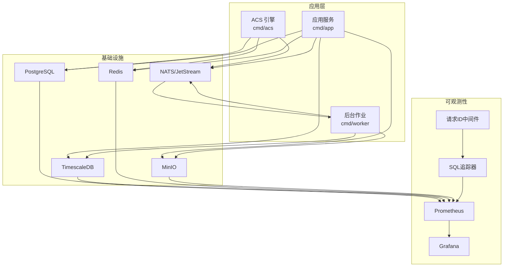
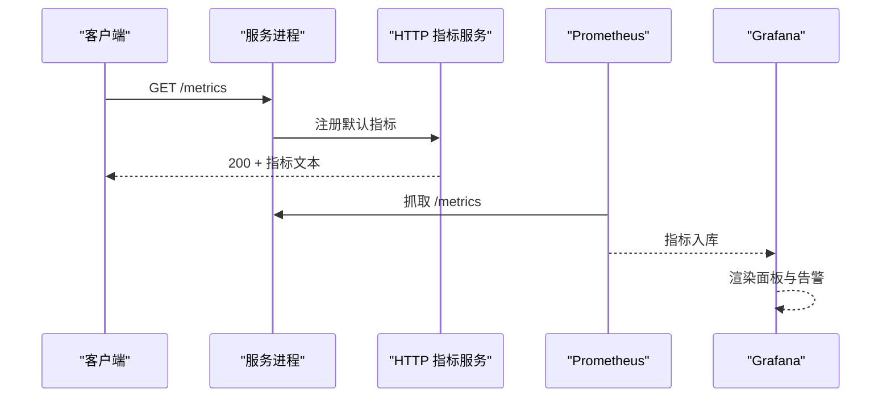
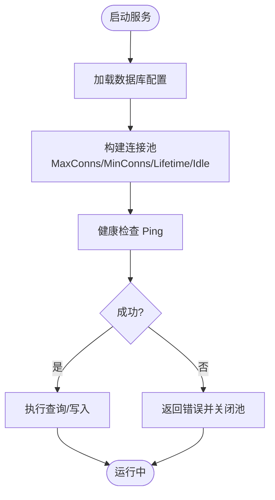
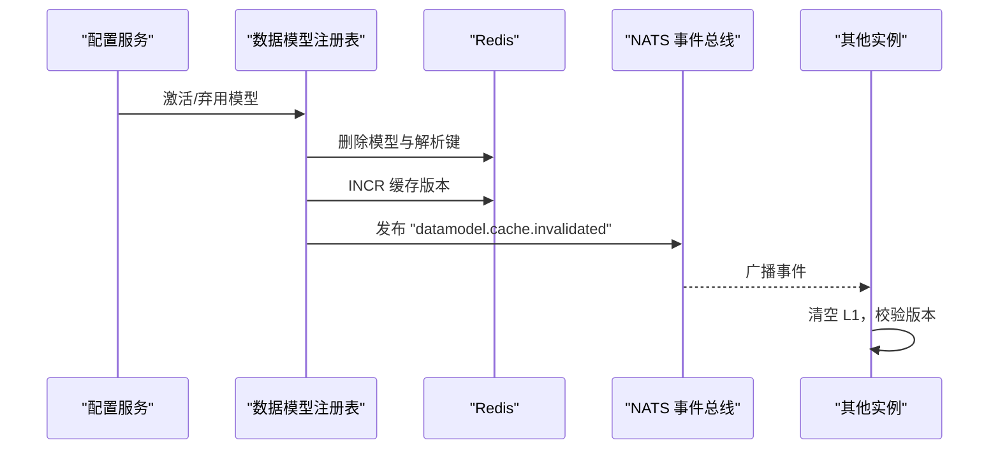
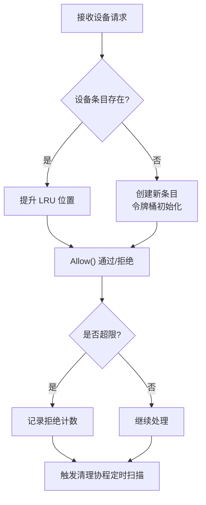
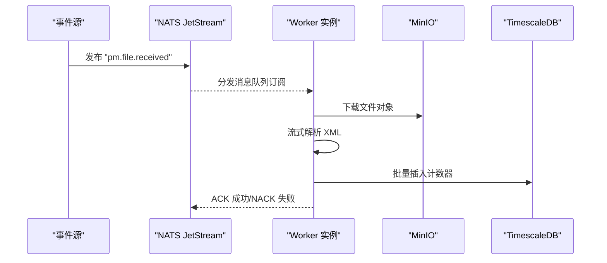
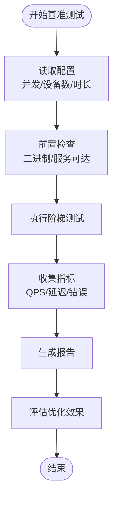
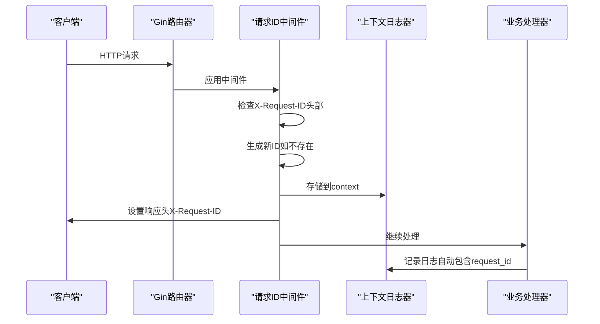
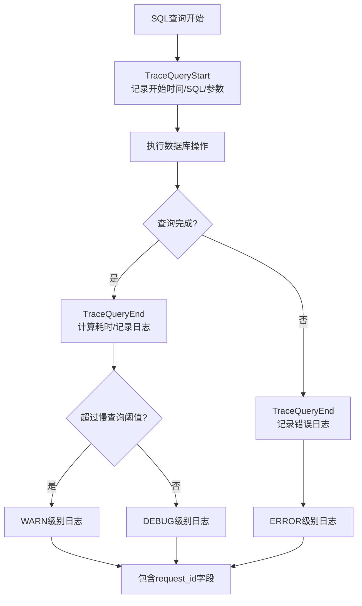
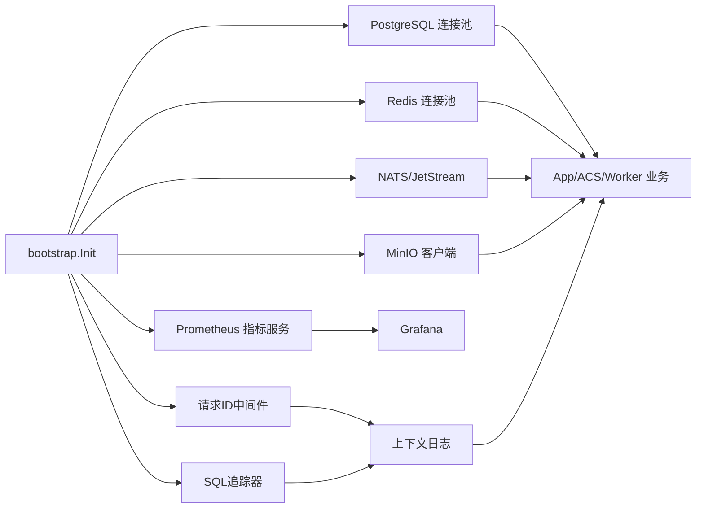

# 性能优化

<cite>
**本文引用的文件**
- [grafana-dashboard.json](file://omcgo/deployments/monitoring/grafana-dashboard.json)
- [metrics.go](file://omcgo/internal/core/components/monitor/metrics.go)
- [bootstrap.go](file://omcgo/internal/core/bootstrap/bootstrap.go)
- [metrics.go](file://omcgo/internal/acs/metrics.go)
- [postgres.go](file://omcgo/internal/core/components/postgres/postgres.go)
- [timescale.go](file://omcgo/internal/core/components/postgres/timescale.go)
- [tracer.go](file://omcgo/internal/core/components/postgres/tracer.go)
- [request_id.go](file://omcgo/internal/core/middleware/request_id.go)
- [logger.go](file://omcgo/internal/core/components/logger/logger.go)
- [config.go](file://omcgo/internal/core/appconfig/config.go)
- [router.go](file://omcgo/cmd/app/router/router.go)
- [main.go（acs）](file://omcgo/cmd/acs/main.go)
- [config.dev.yaml（acs）](file://omcgo/cmd/acs/etc/config.dev.yaml)
- [config.dev.yaml（app）](file://omcgo/cmd/app/etc/config.dev.yaml)
- [config.dev.yaml（worker）](file://omcgo/cmd/worker/etc/config.dev.yaml)
- [08-infrastructure.md](file://omcgo/docs/go-zero-design/08-infrastructure.md)
- [04-data-model-service.md](file://omcgo/docs/go-zero-design/04-data-model-service.md)
- [cache.go](file://omcgo/internal/config/datamodel/cache.go)
- [registry.go](file://omcgo/internal/config/datamodel/registry.go)
- [ratelimit.go](file://omcgo/internal/acs/ratelimit.go)
- [ratelimit_test.go](file://omcgo/internal/acs/ratelimit_test.go)
- [loadtest-benchmark.sh](file://omcgo/scripts/loadtest-benchmark.sh)
- [main.go（loadtest）](file://omcgo/scripts/loadtest/main.go)
- [usePerformance.ts](file://omcmb/webcode/src/hooks/api/usePerformance.ts)
- [performanceService.ts](file://omcmb/webcode/src/mock/services/performanceService.ts)
- [main.go（worker）](file://omcgo/cmd/worker/main.go)
- [06-data-pipeline.md](file://omcgo/docs/go-zero-design/06-data-pipeline.md)
- [main-simplification-proposal.md](file://omcgo/docs/design/main-simplification-proposal.md)
- [phase4-analysis-report.md](file://omcgo/docs/phase4-analysis-report.md)
- [REVIEW_request_id_sql_logging_components.md](file://omcgo/docs/review-report/20260319/REVIEW_request_id_sql_logging_components.md)
- [request-id-middleware.md](file://omcgo/docs/design/request-id-middleware.md)
</cite>

## 更新摘要
**所做更改**
- 新增分布式追踪基础设施章节，详细介绍请求ID中间件和SQL日志记录系统
- 更新指标与监控体系，增加SQL追踪器和请求ID关联监控
- 新增性能监控增强章节，涵盖全链路追踪和SQL性能监控
- 更新配置管理，添加请求ID前缀和SQL日志配置选项
- 新增故障排查指南，包含SQL日志和请求追踪故障排除

## 目录
1. [简介](#简介)
2. [项目结构](#项目结构)
3. [核心组件](#核心组件)
4. [架构总览](#架构总览)
5. [详细组件分析](#详细组件分析)
6. [分布式追踪基础设施](#分布式追踪基础设施)
7. [性能监控增强](#性能监控增强)
8. [依赖关系分析](#依赖关系分析)
9. [性能考量](#性能考量)
10. [故障排查指南](#故障排查指南)
11. [结论](#结论)
12. [附录](#附录)

## 简介
本文件面向 Baicells OMC 项目的性能优化工作，聚焦以下关键领域：
- 系统性能瓶颈识别：CPU、内存、数据库查询、网络延迟等
- 性能监控体系：Prometheus 指标采集、Grafana 可视化、告警
- 分布式追踪基础设施：请求ID中间件、SQL日志记录系统
- 数据库性能优化：查询优化、索引设计、连接池配置、读写分离
- 缓存策略优化：Redis 缓存、失效策略、热点数据处理
- 并发处理优化：goroutine 管理、channel 使用、锁优化、异步处理
- 网络通信优化：连接复用、批量处理、压缩传输
- 性能测试与评估：基准测试脚本、结果分析与优化效果评估

## 项目结构
OMC 后端采用 Go-zero 架构，服务拆分为多个进程（acs、app、worker），通过 NATS/JetStream 实现消息驱动的数据管道，使用 PostgreSQL/TimescaleDB 存储结构化数据，Redis 提供缓存，Prometheus/Grafana 进行可观测性。



**图表来源**
- [08-infrastructure.md:7-37](file://omcgo/docs/go-zero-design/08-infrastructure.md#L7-L37)
- [config.dev.yaml（app）:11-25](file://omcgo/cmd/app/etc/config.dev.yaml#L11-L25)
- [config.dev.yaml（acs）:41-47](file://omcgo/cmd/acs/etc/config.dev.yaml#L41-L47)
- [config.dev.yaml（worker）:1-15](file://omcgo/cmd/worker/etc/config.dev.yaml#L1-L15)

**章节来源**
- [08-infrastructure.md:7-37](file://omcgo/docs/go-zero-design/08-infrastructure.md#L7-L37)
- [config.dev.yaml（acs）:1-72](file://omcgo/cmd/acs/etc/config.dev.yaml#L1-L72)
- [config.dev.yaml（app）:1-99](file://omcgo/cmd/app/etc/config.dev.yaml#L1-L99)
- [config.dev.yaml（worker）:1-63](file://omcgo/cmd/worker/etc/config.dev.yaml#L1-L63)

## 核心组件
- 指标与监控
  - Prometheus 指标服务：每个服务启动独立指标端口，暴露 Go/进程指标与自定义指标
  - Grafana 仪表盘：集中展示会话数、请求速率、队列深度、CPU/内存、GC 等
- 分布式追踪
  - 请求ID中间件：为所有请求生成/传播唯一ID，支持配置化前缀
  - SQL日志追踪器：记录所有SQL查询，支持慢查询警告，自动关联request_id
- 数据库与时序库
  - PostgreSQL 连接池：统一配置 MaxConns/MinConns/Lifetime/Idle/健康检查
  - TimescaleDB 连接池：与 PostgreSQL 共享配置，启用扩展校验
- 缓存与数据模型
  - 三级缓存：进程内 sync.Map、Redis、PostgreSQL
  - 缓存失效：版本号递增 + 模型键删除 + NATS 事件广播
- 并发与限流
  - 设备级令牌桶限流 + LRU 清理
  - NATS JetStream 队列消费者实现水平扩展
- 网络与文件
  - MinIO 对象存储 + NATS 事件驱动的 PM/MR 文件处理流水线
  - Push 引擎复用 HTTP 连接，指数退避重试

**章节来源**
- [metrics.go:65-85](file://omcgo/internal/core/components/monitor/metrics.go#L65-L85)
- [bootstrap.go:244-292](file://omcgo/internal/core/bootstrap/bootstrap.go#L244-L292)
- [grafana-dashboard.json:1-142](file://omcgo/deployments/monitoring/grafana-dashboard.json#L1-L142)
- [postgres.go:12-46](file://omcgo/internal/core/components/postgres/postgres.go#L12-L46)
- [timescale.go:11-20](file://omcgo/internal/core/components/postgres/timescale.go#L11-L20)
- [04-data-model-service.md:332-378](file://omcgo/docs/go-zero-design/04-data-model-service.md#L332-L378)
- [cache.go:144-192](file://omcgo/internal/config/datamodel/cache.go#L144-L192)
- [registry.go:185-224](file://omcgo/internal/config/datamodel/registry.go#L185-L224)
- [ratelimit.go:59-107](file://omcgo/internal/acs/ratelimit.go#L59-L107)
- [06-data-pipeline.md:577-631](file://omcgo/docs/go-zero-design/06-data-pipeline.md#L577-L631)
- [phase4-analysis-report.md:139-180](file://omcgo/docs/phase4-analysis-report.md#L139-L180)

## 架构总览
下图展示指标采集、监控与告警的关键交互路径，以及服务间的消息流转。

```mermaid
graph TB
subgraph "服务进程"
S1["ACS 进程"]
S2["App 进程"]
S3["Worker 进程"]
end
subgraph "监控"
M["Prometheus"]
V["Grafana"]
end
subgraph "中间件"
N["NATS/JetStream"]
R["Redis"]
P["PostgreSQL"]
T["TimescaleDB"]
O["MinIO"]
REQID["请求ID中间件"]
SQLT["SQL追踪器"]
END
S1 -- "/metrics" --> M
S2 -- "/metrics" --> M
S3 -- "/metrics" --> M
M --> V
S1 -- "NATS 事件" --> N
S2 -- "NATS 事件" --> N
S3 -- "NATS 事件" --> N
N --> S3
S2 -- "Redis" --> R
S1 -- "Redis" --> R
S2 -- "PostgreSQL" --> P
S2 -- "TimescaleDB" --> T
S3 -- "TimescaleDB" --> T
S2 -- "MinIO" --> O
REQID --> SQLT
SQLT --> P
```

**图表来源**
- [bootstrap.go:244-292](file://omcgo/internal/core/bootstrap/bootstrap.go#L244-L292)
- [grafana-dashboard.json:1-142](file://omcgo/deployments/monitoring/grafana-dashboard.json#L1-L142)
- [08-infrastructure.md:7-37](file://omcgo/docs/go-zero-design/08-infrastructure.md#L7-L37)

## 详细组件分析

### 指标与监控体系
- 指标服务
  - 每个服务独立启动 HTTP 指标服务器，暴露 /metrics 端点
  - 默认注册 Go/进程指标，便于观察 goroutine 数、GC 暂停等
- Grafana 仪表盘
  - 展示 ACS 活跃会话、设备总数、活动告警、Pod 数
  - 请求速率、RPC 延迟分位、NATS 队列积压、CPU/内存、GC 暂停
- 建议
  - 在各服务中补充关键业务指标（如队列深度、处理耗时、错误率）
  - 针对热点面板设置阈值告警，结合 Alertmanager 实现分级通知



**图表来源**
- [metrics.go:65-85](file://omcgo/internal/core/components/monitor/metrics.go#L65-L85)
- [bootstrap.go:244-292](file://omcgo/internal/core/bootstrap/bootstrap.go#L244-L292)
- [grafana-dashboard.json:1-142](file://omcgo/deployments/monitoring/grafana-dashboard.json#L1-L142)

**章节来源**
- [metrics.go:65-85](file://omcgo/internal/core/components/monitor/metrics.go#L65-L85)
- [bootstrap.go:244-292](file://omcgo/internal/core/bootstrap/bootstrap.go#L244-L292)
- [grafana-dashboard.json:1-142](file://omcgo/deployments/monitoring/grafana-dashboard.json#L1-L142)

### 数据库性能优化
- 连接池配置
  - 统一通过配置项设置 MaxConns/MinConns/Lifetime/Idle/健康检查
  - 全局连接预算：服务数 × MaxConns，建议将数据库 max_connections 调整至预算之上
- TimescaleDB
  - 连接池复用 PostgreSQL 配置，启动时校验 timescaledb 扩展是否存在
- 建议
  - 针对长事务与大批量写入场景，评估连接池上限与生命周期参数
  - 对高频查询建立合适索引，避免全表扫描；对分区表使用时间维度裁剪



**图表来源**
- [postgres.go:12-46](file://omcgo/internal/core/components/postgres/postgres.go#L12-L46)
- [timescale.go:11-20](file://omcgo/internal/core/components/postgres/timescale.go#L11-L20)
- [config.dev.yaml（acs）:41-47](file://omcgo/cmd/acs/etc/config.dev.yaml#L41-L47)
- [config.dev.yaml（app）:11-25](file://omcgo/cmd/app/etc/config.dev.yaml#L11-L25)
- [config.dev.yaml（worker）:1-15](file://omcgo/cmd/worker/etc/config.dev.yaml#L1-L15)

**章节来源**
- [postgres.go:12-46](file://omcgo/internal/core/components/postgres/postgres.go#L12-L46)
- [timescale.go:11-20](file://omcgo/internal/core/components/postgres/timescale.go#L11-L20)
- [08-infrastructure.md:155-167](file://omcgo/docs/go-zero-design/08-infrastructure.md#L155-L167)

### 缓存策略优化
- 三级缓存
  - L1：进程内 sync.Map，极低延迟，进程重启或主动清除失效
  - L2：Redis，持久化缓存，TTL 策略（解析结果 1h、模型 24h）
  - L3：PostgreSQL data_model_definitions，持久化存储
- 失效机制
  - 激活/弃用数据模型时：更新状态、递增缓存版本、删除相关解析键、发布缓存失效事件
  - 其他实例收到事件后：清空 L1，检查版本号一致性
- 建议
  - 对热点模型设置更短 TTL 或预热策略
  - 使用 SCAN 逐批失效避免阻塞



**图表来源**
- [04-data-model-service.md:332-378](file://omcgo/docs/go-zero-design/04-data-model-service.md#L332-L378)
- [cache.go:144-192](file://omcgo/internal/config/datamodel/cache.go#L144-L192)
- [registry.go:185-224](file://omcgo/internal/config/datamodel/registry.go#L185-L224)

**章节来源**
- [04-data-model-service.md:332-378](file://omcgo/docs/go-zero-design/04-data-model-service.md#L332-L378)
- [cache.go:144-192](file://omcgo/internal/config/datamodel/cache.go#L144-L192)
- [registry.go:185-224](file://omcgo/internal/config/datamodel/registry.go#L185-L224)

### 并发处理优化
- 设备级限流
  - 令牌桶 + LRU 缓存设备条目，支持清理超时未访问设备
  - 支持并发访问，避免竞争条件
- NATS 队列消费者
  - 多实例负载均衡消费，失败重试（NACK），成功确认（ACK）
- 建议
  - 根据设备规模与峰值流量调整 per_device/burst/max_devices
  - 对热点设备进行隔离或降级策略



**图表来源**
- [ratelimit.go:59-107](file://omcgo/internal/acs/ratelimit.go#L59-L107)
- [ratelimit_test.go:50-223](file://omcgo/internal/acs/ratelimit_test.go#L50-L223)

**章节来源**
- [ratelimit.go:59-107](file://omcgo/internal/acs/ratelimit.go#L59-L107)
- [ratelimit_test.go:50-223](file://omcgo/internal/acs/ratelimit_test.go#L50-L223)

### 网络通信优化
- 连接复用
  - Push 引擎复用 HTTP 客户端连接，减少握手开销
- 批量与事件驱动
  - PM/MR 文件通过 NATS 事件驱动，Worker 流式解析并批量写入 TimescaleDB
- 建议
  - 对推送目标使用指数退避与并发上限，避免雪崩
  - 对大文件传输启用压缩（如 gzip），并考虑分块上传



**图表来源**
- [06-data-pipeline.md:577-631](file://omcgo/docs/go-zero-design/06-data-pipeline.md#L577-L631)
- [phase4-analysis-report.md:139-180](file://omcgo/docs/phase4-analysis-report.md#L139-L180)

**章节来源**
- [06-data-pipeline.md:577-631](file://omcgo/docs/go-zero-design/06-data-pipeline.md#L577-L631)
- [phase4-analysis-report.md:139-180](file://omcgo/docs/phase4-analysis-report.md#L139-L180)

### 性能测试与评估
- 基准脚本
  - 阶梯式压力测试：并发与设备数逐步提升，输出吞吐、延迟、错误率
  - 自动检查 ACS 可达性与二进制存在性
- 前端性能页面
  - 使用 React Query 管理查询与缓存，支持分页、关键词过滤、阈值 CRUD
- 建议
  - 明确基线环境（CPU/内存/网络），固定测试参数
  - 对比不同配置下的指标变化，量化优化收益



**图表来源**
- [loadtest-benchmark.sh:1-47](file://omcgo/scripts/loadtest-benchmark.sh#L1-L47)
- [main.go（loadtest）:411-450](file://omcgo/scripts/loadtest/main.go#L411-L450)
- [usePerformance.ts:88-127](file://omcmb/webcode/src/hooks/api/usePerformance.ts#L88-L127)
- [performanceService.ts:1-28](file://omcmb/webcode/src/mock/services/performanceService.ts#L1-L28)

**章节来源**
- [loadtest-benchmark.sh:1-47](file://omcgo/scripts/loadtest-benchmark.sh#L1-L47)
- [main.go（loadtest）:411-450](file://omcgo/scripts/loadtest/main.go#L411-L450)
- [usePerformance.ts:88-127](file://omcmb/webcode/src/hooks/api/usePerformance.ts#L88-L127)
- [performanceService.ts:1-28](file://omcmb/webcode/src/mock/services/performanceService.ts#L1-L28)

## 分布式追踪基础设施

### 请求ID中间件
请求ID中间件为所有请求生成或传播唯一标识符，支持分布式追踪和全链路日志关联。

- **核心功能**
  - 自动生成唯一请求ID（格式：{prefix}-{timestamp}-{random}）
  - 支持从上游服务接收X-Request-ID头部
  - 将请求ID存储在Go context和Gin context中
  - 在响应头中返回请求ID便于客户端追踪

- **配置支持**
  - 可配置请求ID前缀（如"app"、"acs"、"worker"）
  - 默认前缀为"req"
  - 支持环境变量覆盖

- **集成方式**
  - App服务：在路由中注册RequestIDWithConfig中间件
  - ACS服务：通过main.go读取配置并传递给依赖注入
  - 支持自定义前缀区分不同服务类型



**图表来源**
- [request_id.go:27-65](file://omcgo/internal/core/middleware/request_id.go#L27-L65)
- [logger.go:24-36](file://omcgo/internal/core/components/logger/logger.go#L24-L36)
- [router.go:155-160](file://omcgo/cmd/app/router/router.go#L155-L160)
- [main.go（acs）:56-72](file://omcgo/cmd/acs/main.go#L56-L72)

**章节来源**
- [request_id.go:1-87](file://omcgo/internal/core/middleware/request_id.go#L1-L87)
- [logger.go:1-200](file://omcgo/internal/core/components/logger/logger.go#L1-L200)
- [router.go:155-160](file://omcgo/cmd/app/router/router.go#L155-L160)
- [main.go（acs）:56-72](file://omcgo/cmd/acs/main.go#L56-L72)
- [config.dev.yaml（app）:98](file://omcgo/cmd/app/etc/config.dev.yaml#L98)
- [config.dev.yaml（acs）:71](file://omcgo/cmd/acs/etc/config.dev.yaml#L71)

### SQL日志记录系统
SQL日志记录系统基于pgx.Tracer接口实现，提供详细的SQL执行监控和性能分析能力。

- **核心特性**
  - 自动记录所有SQL查询执行时间
  - 支持慢查询检测和警告级别日志
  - 自动关联请求ID实现全链路追踪
  - 可配置参数记录开关
  - 支持批量查询和复制操作监控

- **日志级别策略**
  - DEBUG级别：普通SQL查询
  - WARN级别：超过慢查询阈值的查询
  - ERROR级别：SQL执行错误
  - BATCH：批量操作统计
  - COPY：复制操作监控

- **配置选项**
  ```yaml
  db:
    log_sql: true                    # 是否记录SQL
    log_sql_params: true             # 是否记录参数
    log_sql_slow_threshold: 500      # 慢查询阈值(ms)
  ```



**图表来源**
- [tracer.go:38-95](file://omcgo/internal/core/components/postgres/tracer.go#L38-L95)
- [tracer.go:97-142](file://omcgo/internal/core/components/postgres/tracer.go#L97-L142)
- [postgres.go:37-40](file://omcgo/internal/core/components/postgres/postgres.go#L37-L40)

**章节来源**
- [tracer.go:1-200](file://omcgo/internal/core/components/postgres/tracer.go#L1-L200)
- [postgres.go:13-53](file://omcgo/internal/core/components/postgres/postgres.go#L13-L53)
- [config.go:144-156](file://omcgo/internal/core/appconfig/config.go#L144-L156)
- [config.dev.yaml（app）:18-20](file://omcgo/cmd/app/etc/config.dev.yaml#L18-L20)
- [config.dev.yaml（app）:29-31](file://omcgo/cmd/app/etc/config.dev.yaml#L29-L31)

### 上下文日志集成
上下文日志系统自动在所有日志中包含请求ID，实现真正的全链路追踪。

- **核心功能**
  - L()函数自动检测context中的request_id并添加到日志
  - 支持Info/Error/Debug/Warn等多种日志级别
  - 与zap日志库无缝集成
  - 无侵入式API设计

- **使用方式**
  ```go
  // 传统日志
  logger.Info("用户登录", zap.String("username", user))
  
  // 上下文日志（自动包含request_id）
  logger.Info(ctx, "用户登录", zap.String("username", user))
  ```

**章节来源**
- [logger.go:165-200](file://omcgo/internal/core/components/logger/logger.go#L165-L200)
- [REVIEW_request_id_sql_logging_components.md:55-58](file://omcgo/docs/review-report/20260319/REVIEW_request_id_sql_logging_components.md#L55-L58)

## 性能监控增强

### SQL性能监控
SQL日志记录系统提供了全面的数据库性能监控能力：

- **实时监控指标**
  - SQL执行时间分布
  - 慢查询识别和统计
  - 批量操作性能分析
  - 复制操作监控

- **告警机制**
  - 自动检测超过阈值的慢查询
  - 错误SQL查询告警
  - 连接建立失败监控

- **日志格式示例**
  ```json
  {"level":"warn","logger":"sql","msg":"SLOW SQL","request_id":"app-20260319150430-a1b2c3d4","sql":"SELECT * FROM devices","duration":"2.345ms","params":["device123"],"rows":100}
  ```

### 全链路追踪
请求ID中间件与SQL追踪器协同工作，实现端到端的请求追踪：

- **追踪范围**
  - HTTP请求到数据库查询的完整链路
  - 跨服务调用的请求关联
  - 批量处理和异步任务的追踪

- **监控价值**
  - 快速定位性能瓶颈
  - 精确的问题根因分析
  - 业务流程的可视化监控

**章节来源**
- [tracer.go:48-95](file://omcgo/internal/core/components/postgres/tracer.go#L48-L95)
- [request-id-middleware.md:252-258](file://omcgo/docs/design/request-id-middleware.md#L252-L258)

## 依赖关系分析
- 组件耦合
  - 服务进程通过 bootstrap 统一初始化基础设施，降低重复代码与耦合
  - NATS/JetStream 作为跨服务通信中枢，Worker 与 App/ACS 解耦
  - 请求ID中间件与SQL追踪器通过上下文解耦，支持按需启用
- 外部依赖
  - Prometheus/Grafana：指标采集与可视化
  - PostgreSQL/TimescaleDB/Redis/MinIO/NATS：数据与消息基础设施
  - OpenTelemetry：分布式追踪（可选配置）
- 建议
  - 保持配置结构一致（BaseConfig），便于统一初始化与运维
  - 对关键路径（NATS/数据库）增加熔断与降级策略
  - 合理配置SQL日志级别，避免生产环境性能影响



**图表来源**
- [main-simplification-proposal.md:395-412](file://omcgo/docs/design/main-simplification-proposal.md#L395-L412)
- [bootstrap.go:244-292](file://omcgo/internal/core/bootstrap/bootstrap.go#L244-L292)
- [08-infrastructure.md:7-37](file://omcgo/docs/go-zero-design/08-infrastructure.md#L7-L37)

**章节来源**
- [main-simplification-proposal.md:395-412](file://omcgo/docs/design/main-simplification-proposal.md#L395-L412)
- [bootstrap.go:244-292](file://omcgo/internal/core/bootstrap/bootstrap.go#L244-L292)

## 性能考量
- CPU 与内存
  - 关注 goroutine 数、GC 暂停时间、内存分配速率
  - 通过 Grafana 面板与指标阈值及时发现异常
- 数据库
  - 控制连接池大小与生命周期，避免连接泄漏与抖动
  - 对热点查询建立索引，必要时引入只读副本或读写分离
  - 启用SQL日志监控慢查询，合理设置慢查询阈值
- 缓存
  - 合理设置 TTL 与失效策略，避免缓存穿透与雪崩
  - 对热点键进行预热与隔离
- 并发
  - 限流参数与清理策略需与业务峰值匹配
  - NATS 队列消费者数量与处理能力平衡
- 网络
  - 复用连接、批量写入、事件驱动，减少往返与阻塞
- 分布式追踪
  - 请求ID中间件对性能影响极小（仅在context中存储字符串）
  - SQL日志默认DEBUG级别，生产环境可根据需要调整
  - 建议为慢查询单独使用WARN级别，避免日志风暴

## 故障排查指南
- 指标与告警
  - Grafana 面板异常：检查 /metrics 可达性与抓取间隔
  - NATS 队列积压：核查消费者数量与处理耗时
- 数据库
  - 连接池耗尽：检查 MaxConns 与健康检查周期
  - 查询慢：分析执行计划与索引使用情况
  - SQL日志异常：检查db.log_sql配置和日志级别
- 缓存
  - 缓存不一致：确认版本号递增与事件广播
- 并发
  - 设备限流误杀：调整 per_device/burst/max_devices
  - LRU 清理不生效：检查清理协程与超时参数
- 分布式追踪
  - 请求ID缺失：检查中间件是否正确注册
  - SQL日志无请求ID：确认上下文传递和tracer集成
  - 日志级别过高：调整log_sql和log_sql_slow_threshold配置

**章节来源**
- [grafana-dashboard.json:1-142](file://omcgo/deployments/monitoring/grafana-dashboard.json#L1-L142)
- [postgres.go:12-46](file://omcgo/internal/core/components/postgres/postgres.go#L12-L46)
- [cache.go:144-192](file://omcgo/internal/config/datamodel/cache.go#L144-L192)
- [ratelimit.go:59-107](file://omcgo/internal/acs/ratelimit.go#L59-L107)
- [request_id.go:44-64](file://omcgo/internal/core/middleware/request_id.go#L44-L64)
- [tracer.go:38-95](file://omcgo/internal/core/components/postgres/tracer.go#L38-L95)

## 结论
通过统一的监控体系、合理的数据库与缓存策略、精细化的并发与网络优化，以及新增的分布式追踪基础设施，OMC 项目可在高并发场景下保持稳定与高效。请求ID中间件和SQL日志记录系统的引入显著提升了系统的可观测性和故障排查效率。建议持续完善指标覆盖、细化告警策略，并根据业务增长动态调整资源与参数。

## 附录
- 配置要点
  - 数据库连接池：MaxConns/MinConns/Lifetime/Idle/健康检查
  - NATS/JetStream：队列消费者数量与重试策略
  - Redis：连接池大小与键空间 TTL
  - MinIO：桶命名与对象生命周期
  - 请求ID：request_id_prefix配置
  - SQL日志：log_sql/log_sql_params/log_sql_slow_threshold
- 建议的优化清单
  - 为关键业务接口补充自定义指标
  - 对热点查询建立索引与物化视图
  - 缓存预热与热点隔离
  - 限流参数与清理策略的 A/B 测试
  - 压力测试自动化与回归基线
  - 分布式追踪的性能影响评估
  - SQL日志级别的生产环境优化