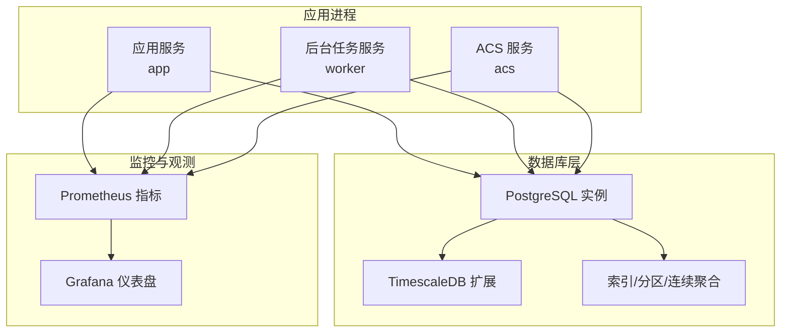
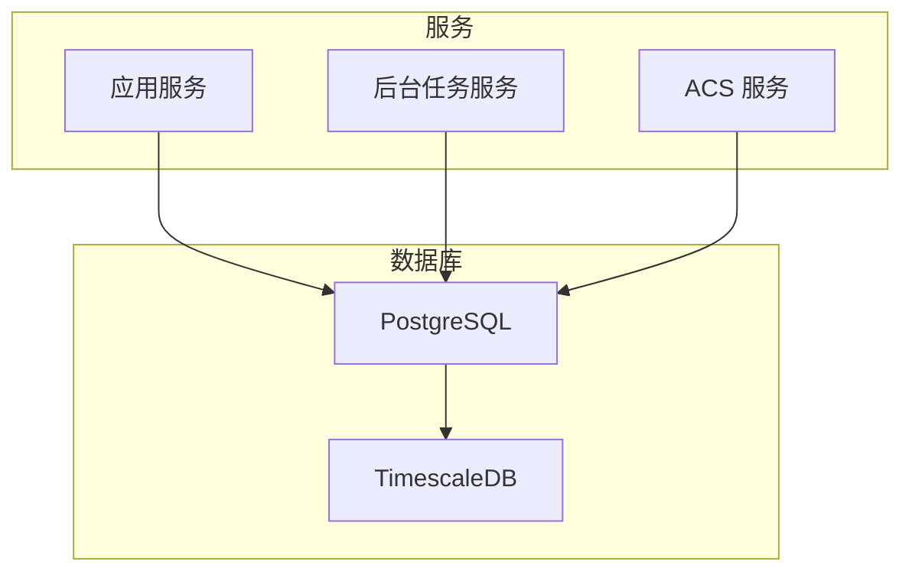
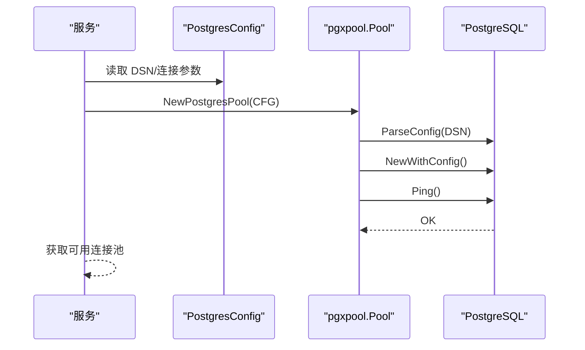
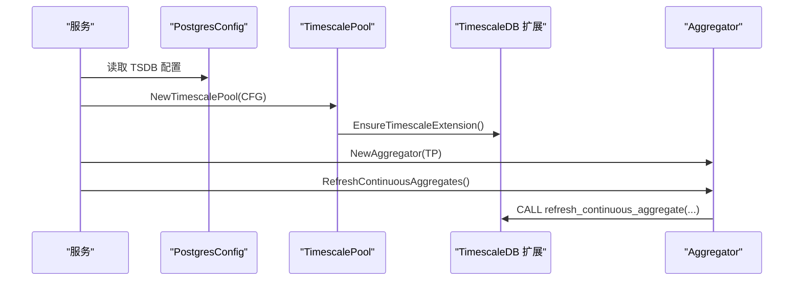
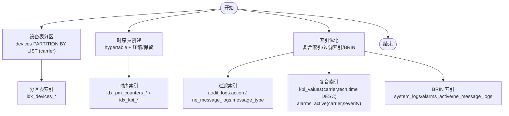
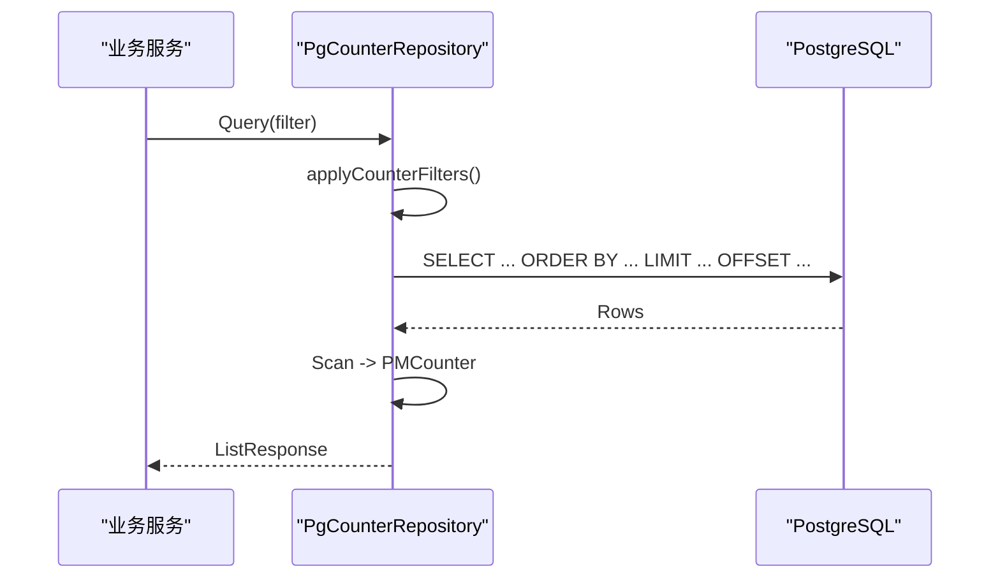
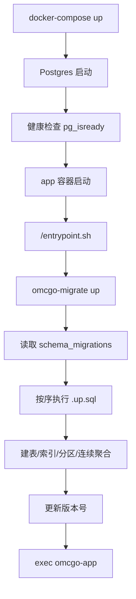
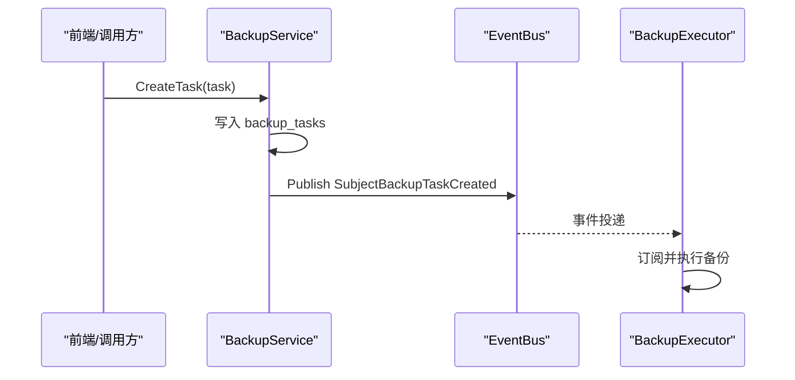
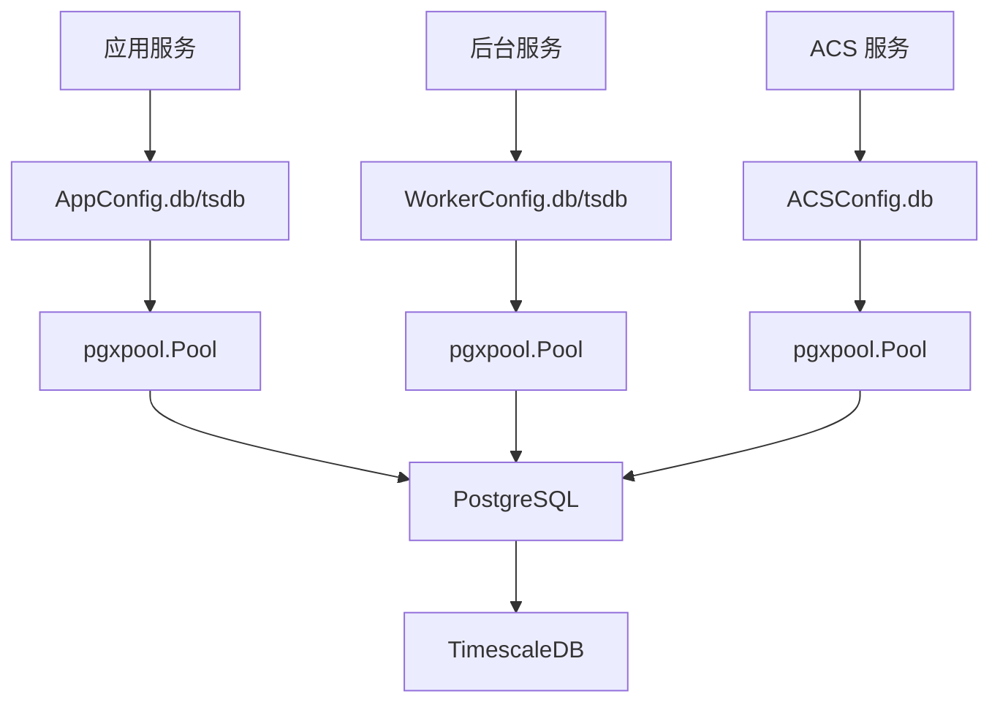

# 数据库优化

<cite>
**本文引用的文件**   
- [postgres.go](file://omcgo/internal/core/components/postgres/postgres.go)
- [timescale.go](file://omcgo/internal/core/components/postgres/timescale.go)
- [config.go](file://omcgo/internal/core/appconfig/config.go)
- [config.dev.yaml](file://omcgo/cmd/app/etc/config.dev.yaml)
- [config.prod.yaml](file://omcgo/cmd/app/etc/config.prod.yaml)
- [config.dev.yaml](file://omcgo/cmd/worker/etc/config.dev.yaml)
- [config.dev.yaml](file://omcgo/cmd/acs/etc/config.dev.yaml)
- [000001_create_devices.up.sql](file://omcgo/migrations/000001_create_devices.up.sql)
- [000010_create_pm_counters.up.sql](file://omcgo/migrations/000010_create_pm_counters.up.sql)
- [000011_create_kpi_tables.up.sql](file://omcgo/migrations/000011_create_kpi_tables.up.sql)
- [000021_optimize_indexes.up.sql](file://omcgo/migrations/000021_optimize_indexes.up.sql)
- [aggregator.go](file://omcgo/internal/pm/aggregation/aggregator.go)
- [pg_repository.go](file://omcgo/internal/pm/counter/pg_repository.go)
- [metrics.go](file://omcgo/internal/core/components/monitor/metrics.go)
- [grafana-dashboard.json](file://omcgo/deployments/monitoring/grafana-dashboard.json)
- [service.go](file://omcgo/internal/backup/service.go)
- [repository.go](file://omcgo/internal/backup/repository.go)
- [000022_create_backup_tables.down.sql](file://omcgo/migrations/000022_create_backup_tables.down.sql)
- [Sprint5-完成度分析报告.md](file://Sprint5-完成度分析报告.md)
- [database-migration.md](file://omcgo/docs/design/database-migration.md)
- [21-database-migrations.md](file://omcgo/docs/detailed-design/21-database-migrations.md)
- [08-infrastructure.md](file://omcgo/docs/go-zero-design/08-infrastructure.md)
- [REVIEW_4304d1f_chenbo01_migration.md](file://omcgo/docs/reports/review-report/20260318/REVIEW_4304d1f_chenbo01_migration.md)
</cite>

## 目录
1. [简介](#简介)
2. [项目结构](#项目结构)
3. [核心组件](#核心组件)
4. [架构总览](#架构总览)
5. [详细组件分析](#详细组件分析)
6. [依赖分析](#依赖分析)
7. [性能考量](#性能考量)
8. [故障排查指南](#故障排查指南)
9. [结论](#结论)
10. [附录](#附录)

## 简介
本文件面向 Baicells OMC 项目的数据库优化，聚焦以下目标：
- 深入分析数据库查询性能瓶颈，包括索引优化、查询计划分析、慢查询识别
- 优化数据库表结构，涵盖索引设计策略、分区表使用、复合索引设计
- 连接池配置优化，包括连接数设置、超时配置、连接复用策略
- 读写分离与分库分表策略建议
- 数据库监控指标，包括查询响应时间、连接数、锁等待等
- 数据库备份恢复优化与存储空间管理

## 项目结构
OMC 后端采用 Go-zero 微服务架构，数据库层以 PostgreSQL 为核心，并通过 TimescaleDB 扩展支撑时序数据。连接池通过 pgx/pool 管理，迁移与版本控制由 golang-migrate 驱动，Prometheus 提供基础设施指标，Grafana 展示运维仪表盘。

图表来源
- [08-infrastructure.md:100-135](file://omcgo/docs/go-zero-design/08-infrastructure.md#L100-L135)
- [postgres.go:12-46](file://omcgo/internal/core/components/postgres/postgres.go#L12-L46)
- [timescale.go:11-20](file://omcgo/internal/core/components/postgres/timescale.go#L11-L20)

章节来源
- [08-infrastructure.md:100-135](file://omcgo/docs/go-zero-design/08-infrastructure.md#L100-L135)

## 核心组件
- 连接池与健康检查：基于 pgxpool 的连接池创建、生命周期与健康检查
- TimescaleDB 集成：连接池复用、扩展检测、连续聚合刷新
- 配置体系：PostgresConfig 结构体定义连接参数，多份配置文件按环境区分
- 迁移与版本控制：golang-migrate + schema_migrations，支持 up/down、幂等与增量升级
- 监控指标：db_query_duration_seconds 等基础设施指标
- 备份与恢复：备份任务与调度表、事件驱动执行

章节来源
- [postgres.go:12-53](file://omcgo/internal/core/components/postgres/postgres.go#L12-L53)
- [timescale.go:11-35](file://omcgo/internal/core/components/postgres/timescale.go#L11-L35)
- [config.go:141-149](file://omcgo/internal/core/appconfig/config.go#L141-L149)
- [config.dev.yaml:11-17](file://omcgo/cmd/app/etc/config.dev.yaml#L11-L17)
- [config.dev.yaml:19-25](file://omcgo/cmd/app/etc/config.dev.yaml#L19-L25)
- [config.dev.yaml:1-63](file://omcgo/cmd/worker/etc/config.dev.yaml#L1-L63)
- [config.dev.yaml:41-47](file://omcgo/cmd/acs/etc/config.dev.yaml#L41-L47)
- [21-database-migrations.md:27-42](file://omcgo/docs/detailed-design/21-database-migrations.md#L27-L42)
- [metrics.go:20-57](file://omcgo/internal/core/components/monitor/metrics.go#L20-L57)
- [service.go:15-31](file://omcgo/internal/backup/service.go#L15-L31)

## 架构总览
下图展示数据库层与各服务的关系、连接池与 TimescaleDB 的集成方式，以及迁移与监控链路。

图表来源
- [08-infrastructure.md:100-135](file://omcgo/docs/go-zero-design/08-infrastructure.md#L100-L135)
- [postgres.go:12-46](file://omcgo/internal/core/components/postgres/postgres.go#L12-L46)
- [timescale.go:11-20](file://omcgo/internal/core/components/postgres/timescale.go#L11-L20)

## 详细组件分析

### 连接池与健康检查
- 连接池创建：解析 DSN，按配置设置 MaxConns、MinConns、MaxConnLifetime、MaxConnIdleTime、HealthCheckPeriod，并进行 Ping 校验
- 健康检查：独立的健康检查函数，带超时控制
- TimescaleDB 连接池：复用相同配置结构，确保扩展可用性检测

图表来源
- [postgres.go:12-46](file://omcgo/internal/core/components/postgres/postgres.go#L12-L46)

章节来源
- [postgres.go:12-53](file://omcgo/internal/core/components/postgres/postgres.go#L12-L53)
- [timescale.go:11-35](file://omcgo/internal/core/components/postgres/timescale.go#L11-L35)
- [config.go:141-149](file://omcgo/internal/core/appconfig/config.go#L141-L149)

### TimescaleDB 与连续聚合
- 连接池复用：与 PostgreSQL 共享配置结构
- 扩展检测：确保 TimescaleDB 已安装
- 连续聚合刷新：提供手动刷新接口，用于高频写入后的聚合一致性

图表来源
- [timescale.go:11-35](file://omcgo/internal/core/components/postgres/timescale.go#L11-L35)
- [aggregator.go:17-31](file://omcgo/internal/pm/aggregation/aggregator.go#L17-L31)

章节来源
- [timescale.go:11-35](file://omcgo/internal/core/components/postgres/timescale.go#L11-L35)
- [aggregator.go:17-31](file://omcgo/internal/pm/aggregation/aggregator.go#L17-L31)

### 表结构与索引优化
- 分区表：设备表按 carrier 列分区，提升隔离与查询性能
- 时序表：pm_counters、kpi_values 创建为 hypertable，配合压缩与保留策略
- 索引优化：针对常见过滤、连接与排序字段建立索引，包含复合索引与 BRIN 索引
- 过滤索引：对特定 action/message_type 等进行条件过滤

图表来源
- [000001_create_devices.up.sql:1-55](file://omcgo/migrations/000001_create_devices.up.sql#L1-L55)
- [000010_create_pm_counters.up.sql:1-27](file://omcgo/migrations/000010_create_pm_counters.up.sql#L1-L27)
- [000011_create_kpi_tables.up.sql:1-56](file://omcgo/migrations/000011_create_kpi_tables.up.sql#L1-L56)
- [000021_optimize_indexes.up.sql:1-36](file://omcgo/migrations/000021_optimize_indexes.up.sql#L1-L36)

章节来源
- [000001_create_devices.up.sql:1-55](file://omcgo/migrations/000001_create_devices.up.sql#L1-L55)
- [000010_create_pm_counters.up.sql:1-27](file://omcgo/migrations/000010_create_pm_counters.up.sql#L1-L27)
- [000011_create_kpi_tables.up.sql:1-56](file://omcgo/migrations/000011_create_kpi_tables.up.sql#L1-L56)
- [000021_optimize_indexes.up.sql:1-36](file://omcgo/migrations/000021_optimize_indexes.up.sql#L1-L36)
- [Sprint5-完成度分析报告.md:32-42](file://Sprint5-完成度分析报告.md#L32-L42)

### 查询与排序实现
- 查询构建：根据过滤条件动态拼装 SQL，支持排序与分页
- 执行与扫描：使用连接池执行查询并扫描结果集
- 连续聚合查询：通过物化视图提供小时粒度聚合

图表来源
- [pg_repository.go:77-112](file://omcgo/internal/pm/counter/pg_repository.go#L77-L112)

章节来源
- [pg_repository.go:77-112](file://omcgo/internal/pm/counter/pg_repository.go#L77-L112)

### 迁移与版本控制
- 工具与格式：golang-migrate，文件命名 {sequence}_{description}.{up|down}.sql
- 部署流程：容器健康检查后执行 migrate up，按顺序执行未执行的 up 文件
- 幂等性：通过 schema_migrations 记录版本，避免重复执行
- 增量升级：新增迁移文件后重新部署，只执行新增部分

图表来源
- [database-migration.md:120-165](file://omcgo/docs/design/database-migration.md#L120-L165)
- [21-database-migrations.md:27-42](file://omcgo/docs/detailed-design/21-database-migrations.md#L27-L42)

章节来源
- [database-migration.md:120-165](file://omcgo/docs/design/database-migration.md#L120-L165)
- [21-database-migrations.md:27-42](file://omcgo/docs/detailed-design/21-database-migrations.md#L27-L42)

### 监控指标与可视化
- 指标定义：db_query_duration_seconds（按操作分类）、Redis 操作耗时、NATS 发布/消费计数
- 指标采集：Prometheus Registry + Go/Process Collectors
- 可视化：Grafana 仪表盘展示运行时关键指标

图表来源
- [metrics.go:20-57](file://omcgo/internal/core/components/monitor/metrics.go#L20-L57)
- [grafana-dashboard.json:1-142](file://omcgo/deployments/monitoring/grafana-dashboard.json#L1-L142)

章节来源
- [metrics.go:20-57](file://omcgo/internal/core/components/monitor/metrics.go#L20-L57)
- [grafana-dashboard.json:1-142](file://omcgo/deployments/monitoring/grafana-dashboard.json#L1-L142)

### 备份恢复与存储空间管理
- 业务模型：备份任务与调度表，支持类型、目标、状态、进度、时间戳
- 事件驱动：创建任务后发布事件，后台执行器订阅并处理
- 迁移支持：提供备份相关表的 up/down 迁移文件

图表来源
- [service.go:33-63](file://omcgo/internal/backup/service.go#L33-L63)
- [repository.go:10-26](file://omcgo/internal/backup/repository.go#L10-L26)
- [000022_create_backup_tables.down.sql:1-2](file://omcgo/migrations/000022_create_backup_tables.down.sql#L1-L2)

章节来源
- [service.go:15-159](file://omcgo/internal/backup/service.go#L15-L159)
- [repository.go:1-27](file://omcgo/internal/backup/repository.go#L1-L27)
- [000022_create_backup_tables.down.sql:1-2](file://omcgo/migrations/000022_create_backup_tables.down.sql#L1-L2)

## 依赖分析
- 服务到数据库：应用、后台、ACS 三类服务共享同一 PostgreSQL 实例，TSDB 作为扩展使用
- 连接池参数：不同服务配置不同的 MaxConns/MinConns，以适配负载差异
- 迁移依赖：部署阶段先确保数据库健康，再执行迁移，最后启动应用

图表来源
- [config.go:32-90](file://omcgo/internal/core/appconfig/config.go#L32-L90)
- [config.dev.yaml:11-25](file://omcgo/cmd/app/etc/config.dev.yaml#L11-L25)
- [config.dev.yaml:1-63](file://omcgo/cmd/worker/etc/config.dev.yaml#L1-L63)
- [config.dev.yaml:41-47](file://omcgo/cmd/acs/etc/config.dev.yaml#L41-L47)

章节来源
- [config.go:32-90](file://omcgo/internal/core/appconfig/config.go#L32-L90)
- [config.dev.yaml:11-25](file://omcgo/cmd/app/etc/config.dev.yaml#L11-L25)
- [config.dev.yaml:1-63](file://omcgo/cmd/worker/etc/config.dev.yaml#L1-L63)
- [config.dev.yaml:41-47](file://omcgo/cmd/acs/etc/config.dev.yaml#L41-L47)

## 性能考量
- 索引策略
  - 复合索引：针对高选择性与常用过滤组合，如 kpi_values(carrier, technology, time DESC)、alarms_active(carrier, severity)
  - 过滤索引：对 action/message_type 等进行条件过滤，减少全表扫描
  - BRIN 索引：append-only 表（system_logs、ne_message_logs、alarms_active）使用 BRIN，降低存储与维护成本
- 分区表
  - 设备表按 carrier 分区，提升跨运营商数据隔离与查询效率
- TimescaleDB
  - hypetables + 压缩/保留策略，结合连续聚合，降低时序数据存储与查询成本
- 连接池
  - 合理设置 MaxConns/MinConns，避免过高导致数据库压力过大，过低导致排队
  - 控制 MaxConnLifetime/MaxConnIdleTime，平衡连接复用与资源回收
- 查询与排序
  - 通过过滤器与排序参数生成 SQL，避免不必要的全表扫描
  - 对高频查询字段建立合适索引，减少排序开销

章节来源
- [000001_create_devices.up.sql:1-55](file://omcgo/migrations/000001_create_devices.up.sql#L1-L55)
- [000010_create_pm_counters.up.sql:1-27](file://omcgo/migrations/000010_create_pm_counters.up.sql#L1-L27)
- [000011_create_kpi_tables.up.sql:1-56](file://omcgo/migrations/000011_create_kpi_tables.up.sql#L1-L56)
- [000021_optimize_indexes.up.sql:1-36](file://omcgo/migrations/000021_optimize_indexes.up.sql#L1-L36)
- [Sprint5-完成度分析报告.md:158-174](file://Sprint5-完成度分析报告.md#L158-L174)
- [pg_repository.go:77-112](file://omcgo/internal/pm/counter/pg_repository.go#L77-L112)

## 故障排查指南
- 连接池问题
  - 检查 DSN 与连接参数是否正确，确认 MaxConns/MinConns 设置合理
  - 使用健康检查函数验证数据库可达性
- TimescaleDB 相关
  - 确认扩展已安装，必要时执行 EnsureTimescaleExtension
  - 连续聚合刷新失败时，检查物化视图定义与时间窗口
- 迁移失败
  - 核对 schema_migrations 版本，必要时使用 force N 强制版本
  - 按顺序执行 up/down，确保依赖顺序正确
- 指标缺失
  - 确认 Prometheus 暴露端口与抓取配置
  - Grafana 数据源与面板配置正确

章节来源
- [postgres.go:48-53](file://omcgo/internal/core/components/postgres/postgres.go#L48-L53)
- [timescale.go:22-35](file://omcgo/internal/core/components/postgres/timescale.go#L22-L35)
- [aggregator.go:22-31](file://omcgo/internal/pm/aggregation/aggregator.go#L22-L31)
- [database-migration.md:150-165](file://omcgo/docs/design/database-migration.md#L150-L165)
- [REVIEW_4304d1f_chenbo01_migration.md:12-27](file://omcgo/docs/reports/review-report/20260318/REVIEW_4304d1f_chenbo01_migration.md#L12-L27)
- [metrics.go:59-63](file://omcgo/internal/core/components/monitor/metrics.go#L59-L63)

## 结论
本项目在数据库层面已具备良好的基础：共享数据库架构、分区表与索引优化、TimescaleDB 时序能力、完善的迁移与版本控制、可观测性指标与可视化。建议在现有基础上进一步完善读写分离与分库分表策略评估、细化慢查询识别与优化流程、强化备份恢复演练与存储空间治理，以支撑更大规模与更高并发场景。

## 附录
- 配置要点
  - 应用服务：db.tsdb 的 DSN、连接数与健康检查间隔
  - 后台服务：db.tsdb 的连接池参数与指标端口
  - ACS 服务：db 的连接池参数与超时设置
- 迁移清单（节选）
  - 基础表：devices、device_parameters、data_model_definitions 等
  - 时序表：pm_counters、kpi_values、alarms_history
  - 索引优化：provisioning_tasks、alarms_active、user_roles、audit_logs、ne_message_logs、kpi_values、alarms_active 的复合与过滤索引
  - 备份表：backup_tasks、backup_schedules

章节来源
- [config.dev.yaml:11-25](file://omcgo/cmd/app/etc/config.dev.yaml#L11-L25)
- [config.dev.yaml:1-63](file://omcgo/cmd/worker/etc/config.dev.yaml#L1-L63)
- [config.dev.yaml:41-47](file://omcgo/cmd/acs/etc/config.dev.yaml#L41-L47)
- [21-database-migrations.md:46-110](file://omcgo/docs/detailed-design/21-database-migrations.md#L46-L110)
- [000021_optimize_indexes.up.sql:1-36](file://omcgo/migrations/000021_optimize_indexes.up.sql#L1-L36)
- [000022_create_backup_tables.down.sql:1-2](file://omcgo/migrations/000022_create_backup_tables.down.sql#L1-L2)