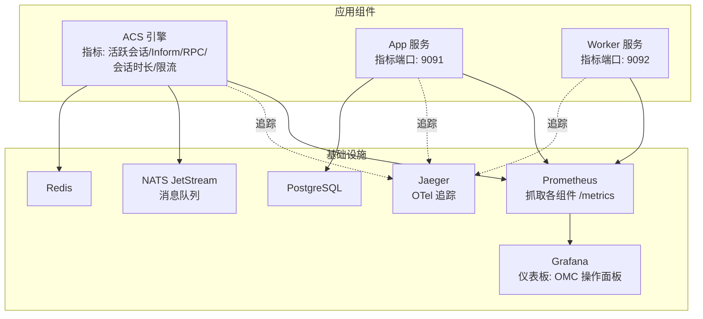
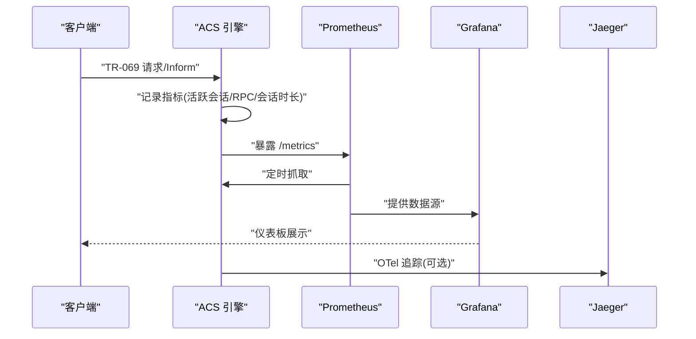
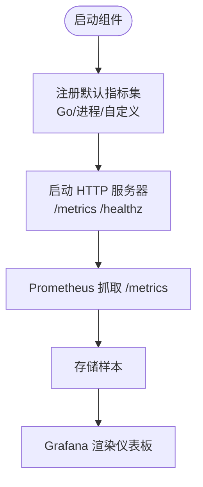
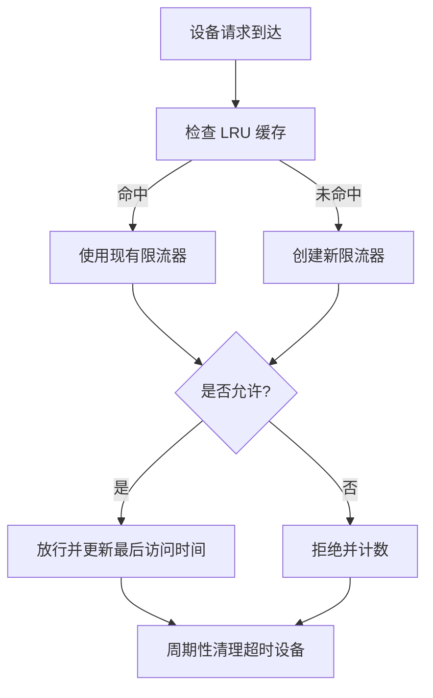
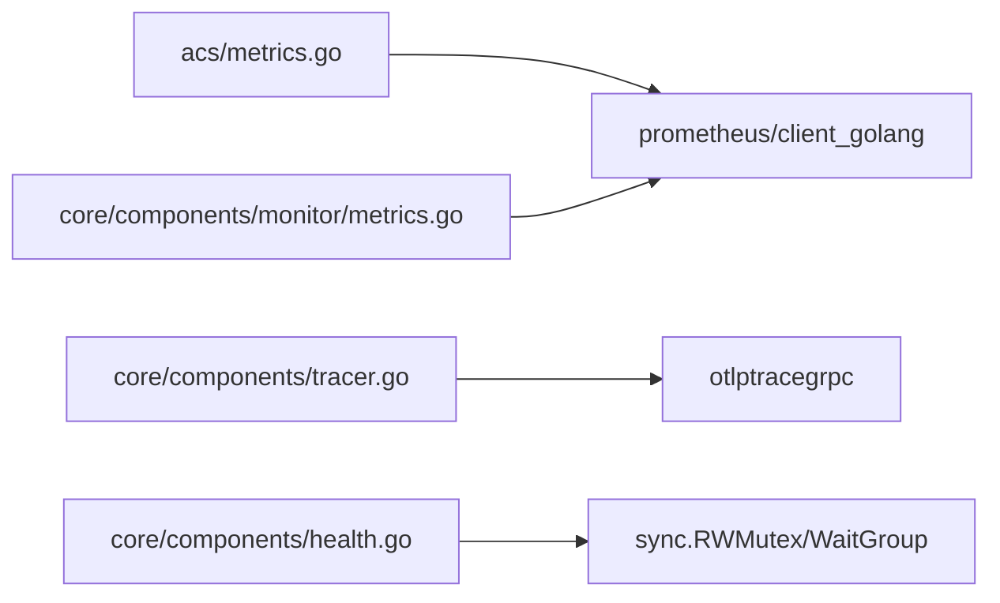

# 系统监控

<cite>
**本文引用的文件**   
- [omcgo/internal/acs/metrics.go](file://omcgo/internal/acs/metrics.go)
- [omcgo/internal/acs/ratelimit.go](file://omcgo/internal/acs/ratelimit.go)
- [omcgo/internal/core/components/monitor/metrics.go](file://omcgo/internal/core/components/monitor/metrics.go)
- [omcgo/internal/core/components/tracer.go](file://omcgo/internal/core/components/tracer.go)
- [omcgo/internal/core/components/health.go](file://omcgo/internal/core/components/health.go)
- [omcgo/docs/detailed-design/19-observability.md](file://omcgo/docs/detailed-design/19-observability.md)
- [omcgo/deployments/monitoring/grafana-dashboard.json](file://omcgo/deployments/monitoring/grafana-dashboard.json)
- [omcgo/cmd/acs/etc/config.dev.yaml](file://omcgo/cmd/acs/etc/config.dev.yaml)
- [omcgo/cmd/app/etc/config.dev.yaml](file://omcgo/cmd/app/etc/config.dev.yaml)
- [omcgo/docs/go-zero-design/08-infrastructure.md](file://omcgo/docs/go-zero-design/08-infrastructure.md)
- [omcgo/internal/pm/handler.go](file://omcgo/internal/pm/handler.go)
</cite>

## 目录
1. [简介](#简介)
2. [项目结构](#项目结构)
3. [核心组件](#核心组件)
4. [架构总览](#架构总览)
5. [详细组件分析](#详细组件分析)
6. [依赖分析](#依赖分析)
7. [性能考虑](#性能考虑)
8. [故障排查指南](#故障排查指南)
9. [结论](#结论)
10. [附录](#附录)

## 简介
本文件面向 Baicells OMC 项目的系统监控与可观测性，围绕 Prometheus 指标采集、Grafana 可视化、OpenTelemetry 追踪、健康检查端点以及告警规则进行系统化说明。内容覆盖 ACS 引擎指标、系统资源指标、业务指标（PM/KPI/告警），并给出采集频率、存储与清理策略建议、部署配置与维护指南，帮助运维与开发团队建立稳定可靠的监控体系。

## 项目结构
监控相关能力主要分布在以下位置：
- 指标定义与导出：ACS 引擎指标、基础设施指标、健康检查端点
- 可观测性设计文档：指标命名、端点、追踪与采样策略
- Grafana 仪表板：预置面板与查询表达式
- 配置文件：各组件指标端口、限流参数、追踪开关
- 基础设施编排：docker-compose 中 Prometheus/Grafana/Jaeger 部署

图表来源
- [omcgo/internal/acs/metrics.go:1-63](file://omcgo/internal/acs/metrics.go#L1-L63)
- [omcgo/internal/core/components/monitor/metrics.go:1-85](file://omcgo/internal/core/components/monitor/metrics.go#L1-L85)
- [omcgo/docs/detailed-design/19-observability.md:63-125](file://omcgo/docs/detailed-design/19-observability.md#L63-L125)
- [omcgo/deployments/monitoring/grafana-dashboard.json:1-142](file://omcgo/deployments/monitoring/grafana-dashboard.json#L1-L142)
- [omcgo/docs/go-zero-design/08-infrastructure.md:214-354](file://omcgo/docs/go-zero-design/08-infrastructure.md#L214-L354)

章节来源
- [omcgo/docs/detailed-design/19-observability.md:63-125](file://omcgo/docs/detailed-design/19-observability.md#L63-L125)
- [omcgo/docs/go-zero-design/08-infrastructure.md:214-354](file://omcgo/docs/go-zero-design/08-infrastructure.md#L214-L354)

## 核心组件
- 指标导出与注册
  - ACS 引擎指标：活跃会话数、Inform 数量、RPC 执行耗时、RPC 错误数、会话时长、限流拒绝数、限流设备计数
  - 基础设施指标：数据库查询耗时、Redis 操作耗时、NATS 发布/消费计数
  - 健康检查端点：/metrics、/healthz
- 追踪与采样
  - OpenTelemetry TracerProvider 支持 OTLP gRPC 导出，按配置采样率或全量采样
- 限流与监控
  - 设备级令牌桶限流器，带 LRU 清理与设备计数监控
- 可视化
  - Grafana 仪表板包含 ACS 活跃会话、Inform 速率、RPC 延迟、组件请求速率、NATS 队列深度、CPU/内存、Go 运行时指标等

章节来源
- [omcgo/internal/acs/metrics.go:1-63](file://omcgo/internal/acs/metrics.go#L1-L63)
- [omcgo/internal/core/components/monitor/metrics.go:1-85](file://omcgo/internal/core/components/monitor/metrics.go#L1-L85)
- [omcgo/internal/core/components/tracer.go:1-54](file://omcgo/internal/core/components/tracer.go#L1-L54)
- [omcgo/internal/acs/ratelimit.go:1-144](file://omcgo/internal/acs/ratelimit.go#L1-L144)
- [omcgo/deployments/monitoring/grafana-dashboard.json:1-142](file://omcgo/deployments/monitoring/grafana-dashboard.json#L1-L142)

## 架构总览
下图展示了监控链路：组件暴露 /metrics，Prometheus 抓取，Grafana 展示，Jaeger 接收 OTel 追踪。

图表来源
- [omcgo/docs/detailed-design/19-observability.md:63-125](file://omcgo/docs/detailed-design/19-observability.md#L63-L125)
- [omcgo/internal/acs/metrics.go:1-63](file://omcgo/internal/acs/metrics.go#L1-L63)
- [omcgo/internal/core/components/tracer.go:1-54](file://omcgo/internal/core/components/tracer.go#L1-L54)

## 详细组件分析

### 指标定义与含义
- ACS 引擎指标
  - 活跃会话数：当前 TR-069 会话数，反映并发接入规模
  - Inform 总数：按事件类型分组的 Inform 消息累计数
  - RPC 执行耗时：按方法分组的 RPC 调用耗时直方图
  - RPC 错误数：按方法分组的 RPC 错误累计数
  - 会话持续时间：完整会话生命周期耗时直方图
  - 限流拒绝数：按设备限流策略拒绝的请求数
  - 限流设备计数：当前被跟踪的设备数
- 基础设施指标
  - 数据库查询耗时：DB 查询耗时直方图
  - Redis 操作耗时：Redis 操作耗时直方图
  - NATS 发布/消费计数：消息发布/消费累计数
- 业务指标（PM/KPI/告警）
  - PM 文件处理数、PM 解析耗时、KPI 计算耗时
  - 告警活跃数、告警产生数、告警清除数

章节来源
- [omcgo/docs/detailed-design/19-observability.md:63-94](file://omcgo/docs/detailed-design/19-observability.md#L63-L94)
- [omcgo/internal/acs/metrics.go:1-63](file://omcgo/internal/acs/metrics.go#L1-L63)
- [omcgo/internal/core/components/monitor/metrics.go:1-85](file://omcgo/internal/core/components/monitor/metrics.go#L1-L85)

### 指标采集与导出流程
- 指标注册：组件使用默认注册表，注册 Go/进程指标与自定义指标
- HTTP 服务：在配置的端口上暴露 /metrics 与 /healthz
- 采集频率：Prometheus 以固定 scrape_interval 抓取（建议 15s~30s）

图表来源
- [omcgo/internal/core/components/monitor/metrics.go:65-85](file://omcgo/internal/core/components/monitor/metrics.go#L65-L85)
- [omcgo/cmd/acs/etc/config.dev.yaml:49-50](file://omcgo/cmd/acs/etc/config.dev.yaml#L49-L50)
- [omcgo/cmd/app/etc/config.dev.yaml:70-71](file://omcgo/cmd/app/etc/config.dev.yaml#L70-L71)

章节来源
- [omcgo/internal/core/components/monitor/metrics.go:1-85](file://omcgo/internal/core/components/monitor/metrics.go#L1-L85)
- [omcgo/cmd/acs/etc/config.dev.yaml:49-50](file://omcgo/cmd/acs/etc/config.dev.yaml#L49-L50)
- [omcgo/cmd/app/etc/config.dev.yaml:70-71](file://omcgo/cmd/app/etc/config.dev.yaml#L70-L71)

### 限流与速率限制监控
- 设备级限流：基于令牌桶算法，支持突发容量、LRU 设备淘汰、后台清理
- 指标联动：限流拒绝数与限流设备计数用于观察接入压力与策略有效性
- 配置项：每设备每分钟上限、突发容量、最大跟踪设备数、清理间隔与超时

图表来源
- [omcgo/internal/acs/ratelimit.go:1-144](file://omcgo/internal/acs/ratelimit.go#L1-L144)
- [omcgo/internal/acs/metrics.go:1-63](file://omcgo/internal/acs/metrics.go#L1-L63)

章节来源
- [omcgo/internal/acs/ratelimit.go:1-144](file://omcgo/internal/acs/ratelimit.go#L1-L144)
- [omcgo/internal/acs/metrics.go:1-63](file://omcgo/internal/acs/metrics.go#L1-L63)

### 追踪与采样策略
- OTLP 导出：支持 gRPC 导出到 Jaeger
- 采样策略：开发环境全量采样；生产环境按采样率尾部采样（错误全采、成功 1%）
- Span 命名：组件.操作，如 acs.handle_inform、acs.execute_rpc、pm.parse_file 等

章节来源
- [omcgo/internal/core/components/tracer.go:1-54](file://omcgo/internal/core/components/tracer.go#L1-L54)
- [omcgo/docs/detailed-design/19-observability.md:104-118](file://omcgo/docs/detailed-design/19-observability.md#L104-L118)

### 健康检查端点
- /healthz：存活探针，返回 200 表示健康
- /readyz：就绪探针（设计文档中定义），用于容器编排就绪判断

章节来源
- [omcgo/docs/detailed-design/19-observability.md:120-125](file://omcgo/docs/detailed-design/19-observability.md#L120-L125)
- [omcgo/internal/core/components/monitor/metrics.go:65-70](file://omcgo/internal/core/components/monitor/metrics.go#L65-L70)

### Grafana 仪表板配置与可视化
- 面板概览
  - 统计类：ACS 活跃会话、设备总数、活跃告警、Pod 数
  - 速率类：Inform 速率（含成功/失败）、RPC 延迟（p50/p95/p99）
  - 组件类：按组件聚合的 HTTP 请求速率
  - 队列类：NATS JetStream 消费者待处理数
  - 资源类：Pod CPU 百分比、内存字节、Go Goroutines、GC 暂停
- 时间范围：默认最近 1 小时
- 查询表达式示例
  - Inform 成功率/失败率：rate(acs_inform_total{status="success"| "error"}[1m])
  - RPC 延迟分位：histogram_quantile(0.95, sum(rate(acs_rpc_duration_seconds_bucket[5m])) by (le))

章节来源
- [omcgo/deployments/monitoring/grafana-dashboard.json:1-142](file://omcgo/deployments/monitoring/grafana-dashboard.json#L1-L142)

### 采集频率、存储策略与清理机制
- 采集频率（建议）
  - scrape_interval：15s~30s
  - scrape_timeout：10s~20s
- 存储与保留
  - 本地磁盘或对象存储：结合 Prometheus 社区最佳实践
  - retention：按容量与时间维度设定（例如 15d~30d）
- 清理机制
  - Prometheus 侧：基于时间的块清理与远端写入（如需）
  - 日志轮转：组件日志轮转配置（参考配置文件中的 rotation 字段）

章节来源
- [omcgo/cmd/acs/etc/config.dev.yaml:63-68](file://omcgo/cmd/acs/etc/config.dev.yaml#L63-L68)
- [omcgo/cmd/app/etc/config.dev.yaml:84-90](file://omcgo/cmd/app/etc/config.dev.yaml#L84-L90)

### 监控告警配置（阈值、规则与通知）
- 告警规则建议
  - ACS 指标
    - 活跃会话数异常下降：可能表示设备大规模离线
    - Inform 错误率突增：按 event_type 分组监控
    - RPC 延迟 p95/p99 持续高于阈值：触发延迟告警
    - 限流拒绝数增长：触发接入压力告警
  - 基础设施
    - DB/Redis/NATS 操作耗时 p95 超阈
    - NATS 队列积压（消费者 pending）持续升高
  - 业务
    - PM 文件处理数/解析耗时/KPI 计算耗时异常
    - 告警活跃数持续上升
- 通知机制
  - 通过 AlertManager 配置 Slack/钉钉/邮件等接收人
  - 告警级别：警告/严重/危急，区分恢复条件
- 规则示例（表达式思路）
  - Inform 错误率：sum(rate(acs_inform_total{status="error"}[5m])) / sum(rate(acs_inform_total[5m]))
  - RPC 延迟 p95：histogram_quantile(0.95, sum(rate(acs_rpc_duration_seconds_bucket[5m])) by (le)) > T
  - NATS 待处理：nats_jetstream_consumer_num_pending{stream="omcgo"} > N

章节来源
- [omcgo/docs/detailed-design/19-observability.md:63-94](file://omcgo/docs/detailed-design/19-observability.md#L63-L94)
- [omcgo/deployments/monitoring/grafana-dashboard.json:80-87](file://omcgo/deployments/monitoring/grafana-dashboard.json#L80-L87)

### 部署配置与维护指南
- 本地开发（docker-compose）
  - 基础设施：PostgreSQL、Redis、NATS、MinIO、Etcd
  - 应用服务：acs、app、worker、device-api、monitor-api、admin-api
  - 可观测性：Prometheus、Grafana、Jaeger
- Kubernetes（示例）
  - 各组件 Deployment/HPA/Service/Ingress
  - ConfigMap/Secret/Namespace 等资源
- 维护要点
  - 定期校验 /metrics 与 /healthz 可达性
  - 调整限流参数以适配设备规模变化
  - 更新 Grafana 仪表板与告警规则
  - 保障 Prometheus 存储空间与备份策略

章节来源
- [omcgo/docs/go-zero-design/08-infrastructure.md:214-354](file://omcgo/docs/go-zero-design/08-infrastructure.md#L214-L354)
- [omcgo/cmd/acs/etc/config.dev.yaml:1-70](file://omcgo/cmd/acs/etc/config.dev.yaml#L1-L70)
- [omcgo/cmd/app/etc/config.dev.yaml:1-91](file://omcgo/cmd/app/etc/config.dev.yaml#L1-L91)

## 依赖分析
- 指标导出依赖
  - Prometheus 客户端库：注册、直方图/计数器/网关
  - HTTP 服务：/metrics 与 /healthz
- 追踪依赖
  - OTLP gRPC 导出器、资源属性、采样器
- 健康检查
  - 并发执行多个组件健康检查，汇总状态码与结果字符串

图表来源
- [omcgo/internal/acs/metrics.go:1-63](file://omcgo/internal/acs/metrics.go#L1-L63)
- [omcgo/internal/core/components/monitor/metrics.go:1-85](file://omcgo/internal/core/components/monitor/metrics.go#L1-L85)
- [omcgo/internal/core/components/tracer.go:1-54](file://omcgo/internal/core/components/tracer.go#L1-L54)
- [omcgo/internal/core/components/health.go:1-107](file://omcgo/internal/core/components/health.go#L1-L107)

章节来源
- [omcgo/internal/acs/metrics.go:1-63](file://omcgo/internal/acs/metrics.go#L1-L63)
- [omcgo/internal/core/components/monitor/metrics.go:1-85](file://omcgo/internal/core/components/monitor/metrics.go#L1-L85)
- [omcgo/internal/core/components/tracer.go:1-54](file://omcgo/internal/core/components/tracer.go#L1-L54)
- [omcgo/internal/core/components/health.go:1-107](file://omcgo/internal/core/components/health.go#L1-L107)

## 性能考虑
- 指标粒度
  - 使用直方图分位数评估尾延时，避免仅看平均值
  - 对高频计数器（如 Inform/RPC）采用 rate() 计算速率
- 限流策略
  - 合理设置 per_device 上限与 burst，避免频繁拒绝
  - 启用后台清理，控制缓存大小与内存占用
- 追踪采样
  - 生产环境采用低采样率，减少追踪开销
- 资源监控
  - 关注 Go Goroutines 与 GC 暂停，定位并发与垃圾回收问题

## 故障排查指南
- 指标不可见
  - 检查组件是否正确注册 /metrics 端口与 HTTP 服务
  - 确认 Prometheus 抓取目标与网络连通性
- 健康检查失败
  - 查看 /healthz 返回状态，确认依赖组件（DB/Redis/NATS）可用
  - 使用健康检查聚合器输出的人类可读摘要定位具体组件
- 追踪缺失
  - 检查 TracerConfig.enabled 与 endpoint
  - 确认采样率设置与 OTLP 出口可达
- 业务异常
  - PM/KPI 处理耗时异常：检查存储与计算任务队列
  - NATS 积压：检查消费者处理能力与并发

章节来源
- [omcgo/internal/core/components/monitor/metrics.go:65-85](file://omcgo/internal/core/components/monitor/metrics.go#L65-L85)
- [omcgo/internal/core/components/health.go:42-106](file://omcgo/internal/core/components/health.go#L42-L106)
- [omcgo/internal/core/components/tracer.go:17-54](file://omcgo/internal/core/components/tracer.go#L17-L54)

## 结论
通过统一的指标命名、完善的基础设施与业务指标、可视化的 Grafana 面板以及可扩展的告警规则，OMC 项目已具备完整的可观测性基础。建议在生产环境中启用 OTel 追踪、完善告警策略，并结合 Prometheus 存储与清理策略，持续优化监控体验与告警质量。

## 附录
- 关键端点与端口
  - omcgo-acs: 9090 (/metrics)
  - omcgo-app: 9091 (/metrics)
  - omcgo-worker: 9092 (/metrics)
- 重要配置项
  - 指标端口：acs/app/worker 配置文件中的 metrics.port
  - 限流参数：acs 配置中的 rate_limit.*
  - 追踪开关：acs/app 配置中的 tracer.enabled/endpoint/sample_rate
  - 日志轮转：acs/app 配置中的 log.rotation.*

章节来源
- [omcgo/docs/detailed-design/19-observability.md:96-104](file://omcgo/docs/detailed-design/19-observability.md#L96-L104)
- [omcgo/cmd/acs/etc/config.dev.yaml:17-22](file://omcgo/cmd/acs/etc/config.dev.yaml#L17-L22)
- [omcgo/cmd/acs/etc/config.dev.yaml:52-55](file://omcgo/cmd/acs/etc/config.dev.yaml#L52-L55)
- [omcgo/cmd/acs/etc/config.dev.yaml:63-68](file://omcgo/cmd/acs/etc/config.dev.yaml#L63-L68)
- [omcgo/cmd/app/etc/config.dev.yaml:70-71](file://omcgo/cmd/app/etc/config.dev.yaml#L70-L71)
- [omcgo/cmd/app/etc/config.dev.yaml:73-76](file://omcgo/cmd/app/etc/config.dev.yaml#L73-L76)
- [omcgo/cmd/app/etc/config.dev.yaml:84-90](file://omcgo/cmd/app/etc/config.dev.yaml#L84-L90)