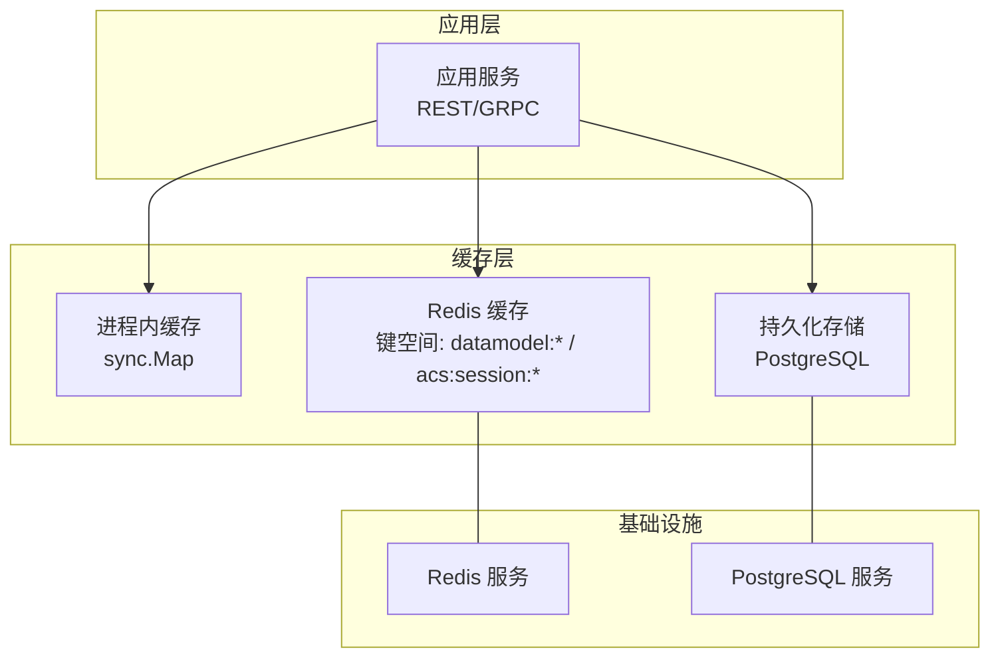
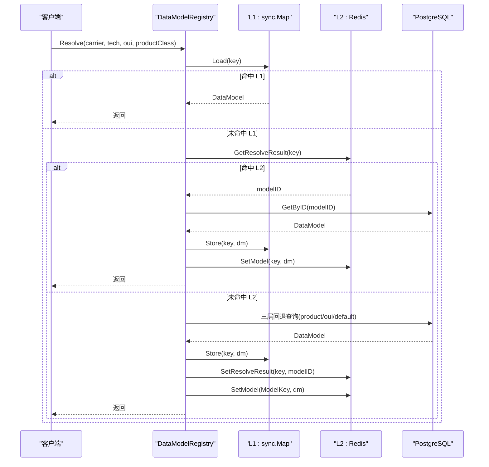
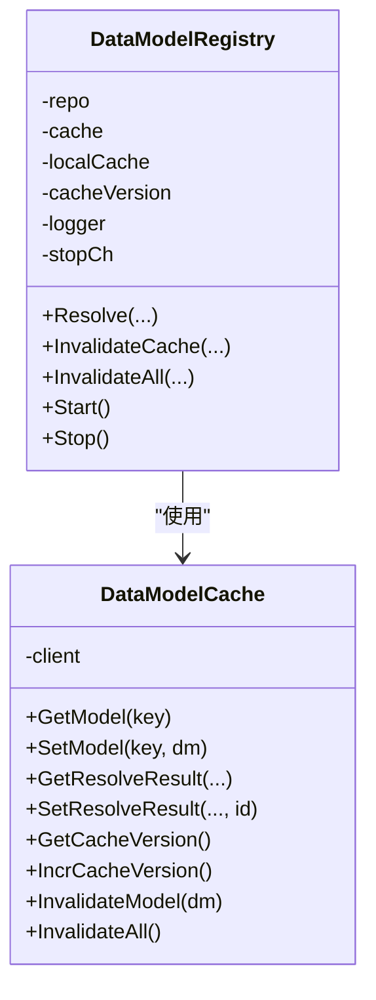
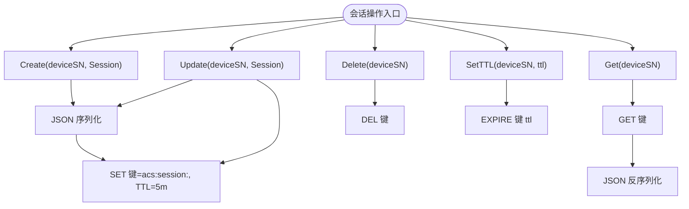
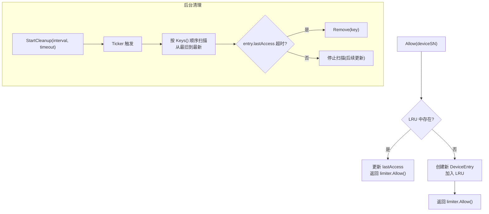
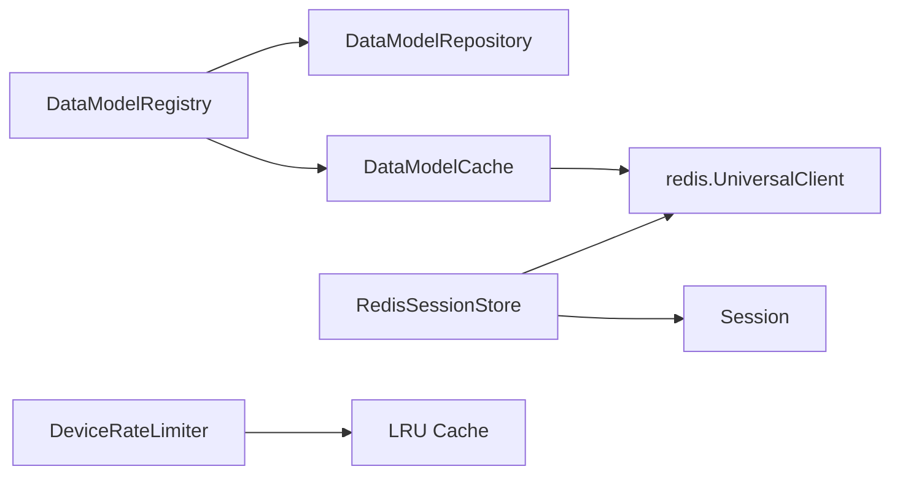
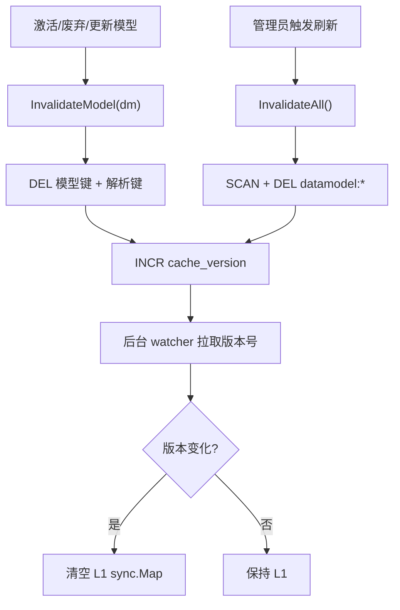

# 缓存策略

<cite>
**本文引用的文件**
- [omcgo/internal/config/datamodel/cache.go](file://omcgo/internal/config/datamodel/cache.go)
- [omcgo/internal/config/datamodel/registry.go](file://omcgo/internal/config/datamodel/registry.go)
- [omcgo/internal/acs/session_store.go](file://omcgo/internal/acs/session_store.go)
- [omcgo/internal/acs/session.go](file://omcgo/internal/acs/session.go)
- [omcgo/internal/acs/ratelimit.go](file://omcgo/internal/acs/ratelimit.go)
- [omcgo/internal/core/components/redis/redis.go](file://omcgo/internal/core/components/redis/redis.go)
- [omcgo/cmd/app/etc/config.dev.yaml](file://omcgo/cmd/app/etc/config.dev.yaml)
- [omcgo/cmd/acs/etc/config.dev.yaml](file://omcgo/cmd/acs/etc/config.dev.yaml)
- [omcgo/docs/go-zero-design/04-data-model-service.md](file://omcgo/docs/go-zero-design/04-data-model-service.md)
- [omcgo/docs/detailed-design/08-data-model-config.md](file://omcgo/docs/detailed-design/08-data-model-config.md)
- [omcgo/docs/design/session-design.md](file://omcgo/docs/design/session-design.md)
</cite>

## 目录
1. [简介](#简介)
2. [项目结构](#项目结构)
3. [核心组件](#核心组件)
4. [架构总览](#架构总览)
5. [详细组件分析](#详细组件分析)
6. [依赖分析](#依赖分析)
7. [性能考虑](#性能考虑)
8. [故障排查指南](#故障排查指南)
9. [结论](#结论)
10. [附录](#附录)

## 简介
本文件面向 Baicells OMC 项目的缓存策略优化，聚焦 Redis 缓存使用模式与一致性保障，覆盖数据缓存、会话缓存、配置缓存等场景；解释缓存失效策略（TTL 设置、LRU 淘汰、手动失效）、热点数据处理机制（缓存预热、穿透防护、雪崩预防）、缓存一致性保证（读写策略、更新机制）、缓存性能监控与调优（命中率统计、内存使用分析），并讨论分布式缓存一致性问题及解决方案。

## 项目结构
围绕缓存的关键代码分布在以下模块：
- 数据模型三级缓存：进程内内存（L1）+ Redis（L2）+ PostgreSQL（L3）
- TR069 会话状态缓存：Redis
- 设备级限流：基于 LRU 的内存缓存（非 Redis）

图表来源
- [omcgo/internal/config/datamodel/registry.go:14-38](file://omcgo/internal/config/datamodel/registry.go#L14-L38)
- [omcgo/internal/config/datamodel/cache.go:31-42](file://omcgo/internal/config/datamodel/cache.go#L31-L42)
- [omcgo/internal/acs/session_store.go:23-35](file://omcgo/internal/acs/session_store.go#L23-L35)

章节来源
- [omcgo/docs/go-zero-design/04-data-model-service.md:332-378](file://omcgo/docs/go-zero-design/04-data-model-service.md#L332-L378)
- [omcgo/docs/detailed-design/08-data-model-config.md:51-102](file://omcgo/docs/detailed-design/08-data-model-config.md#L51-L102)

## 核心组件
- 数据模型三级缓存（L1/L2/L3）：提供产品级、OUI 级、默认级三类模型的解析与缓存，解析结果与完整模型分别采用不同 TTL。
- Redis 会话缓存：TR069 会话状态的持久化与 TTL 控制。
- 设备级限流：基于 LRU 的内存缓存，结合定时清理与容量淘汰，避免内存膨胀。
- Redis 客户端封装：统一创建与健康检查，便于在多模块复用。

章节来源
- [omcgo/internal/config/datamodel/cache.go:14-37](file://omcgo/internal/config/datamodel/cache.go#L14-L37)
- [omcgo/internal/config/datamodel/registry.go:21-28](file://omcgo/internal/config/datamodel/registry.go#L21-L28)
- [omcgo/internal/acs/session_store.go:24-35](file://omcgo/internal/acs/session_store.go#L24-L35)
- [omcgo/internal/acs/ratelimit.go:19-57](file://omcgo/internal/acs/ratelimit.go#L19-L57)
- [omcgo/internal/core/components/redis/redis.go:14-36](file://omcgo/internal/core/components/redis/redis.go#L14-L36)

## 架构总览
数据模型解析遵循“L1 内存 → L2 Redis → L3 数据库”的三层回退策略；缓存失效通过版本号递增与键删除实现跨实例一致性；会话缓存与限流分别服务于 TR069 生命周期与流量治理。

图表来源
- [omcgo/internal/config/datamodel/registry.go:40-130](file://omcgo/internal/config/datamodel/registry.go#L40-L130)
- [omcgo/internal/config/datamodel/cache.go:101-131](file://omcgo/internal/config/datamodel/cache.go#L101-L131)

## 详细组件分析

### 数据模型三级缓存（L1/L2/L3）
- L1：进程内内存缓存，键格式为 carrier:tech:oui:productClass，命中延迟极低，适合高频热点。
- L2：Redis 缓存两类键
  - 解析结果键：datamodel:resolve:{...}，TTL 1 小时，仅缓存解析得到的模型 ID。
  - 模型内容键：datamodel:product|oui|default:{...}，TTL 24 小时，缓存完整模型定义。
  - 版本号键：datamodel:cache_version，用于跨实例失效通知。
- L3：PostgreSQL 表 data_model_definitions，作为最终一致性来源。

图表来源
- [omcgo/internal/config/datamodel/registry.go:21-38](file://omcgo/internal/config/datamodel/registry.go#L21-L38)
- [omcgo/internal/config/datamodel/cache.go:35-42](file://omcgo/internal/config/datamodel/cache.go#L35-L42)

章节来源
- [omcgo/docs/go-zero-design/04-data-model-service.md:332-378](file://omcgo/docs/go-zero-design/04-data-model-service.md#L332-L378)
- [omcgo/docs/detailed-design/08-data-model-config.md:91-102](file://omcgo/docs/detailed-design/08-data-model-config.md#L91-L102)
- [omcgo/internal/config/datamodel/cache.go:14-37](file://omcgo/internal/config/datamodel/cache.go#L14-L37)
- [omcgo/internal/config/datamodel/registry.go:40-130](file://omcgo/internal/config/datamodel/registry.go#L40-L130)

### Redis 会话缓存（TR069 会话）
- 会话对象序列化为 JSON 存储于 Redis，键前缀为 acs:session:，默认 TTL 5 分钟。
- 提供 Create/Get/Update/Delete/SetTTL 接口，支持动态调整过期时间。
- 会话状态机定义了合法状态转换，确保业务一致性。

图表来源
- [omcgo/internal/acs/session_store.go:41-81](file://omcgo/internal/acs/session_store.go#L41-L81)
- [omcgo/internal/acs/session.go:22-31](file://omcgo/internal/acs/session.go#L22-L31)

章节来源
- [omcgo/internal/acs/session_store.go:24-35](file://omcgo/internal/acs/session_store.go#L24-L35)
- [omcgo/internal/acs/session.go:61-71](file://omcgo/internal/acs/session.go#L61-L71)
- [omcgo/docs/design/session-design.md:440-453](file://omcgo/docs/design/session-design.md#L440-L453)

### 设备级限流（LRU 内存缓存）
- 基于 LRU 的设备级限流器，容量满时 O(1) 淘汰最久未访问设备。
- 提供后台清理协程，按固定间隔扫描并移除超时未访问的设备条目。
- 支持 Reset、DeviceCount、Contains 等辅助能力，便于监控与运维。

图表来源
- [omcgo/internal/acs/ratelimit.go:61-76](file://omcgo/internal/acs/ratelimit.go#L61-L76)
- [omcgo/internal/acs/ratelimit.go:81-128](file://omcgo/internal/acs/ratelimit.go#L81-L128)

章节来源
- [omcgo/internal/acs/ratelimit.go:19-57](file://omcgo/internal/acs/ratelimit.go#L19-L57)

### Redis 客户端与配置
- 统一创建 Redis 客户端，自动识别单机/集群模式，并进行健康检查。
- 应用与 ACS 服务均提供 Redis 连接池大小配置，满足高并发场景。

章节来源
- [omcgo/internal/core/components/redis/redis.go:14-36](file://omcgo/internal/core/components/redis/redis.go#L14-L36)
- [omcgo/cmd/app/etc/config.dev.yaml:27-34](file://omcgo/cmd/app/etc/config.dev.yaml#L27-L34)
- [omcgo/cmd/acs/etc/config.dev.yaml:29-35](file://omcgo/cmd/acs/etc/config.dev.yaml#L29-L35)

## 依赖分析
- DataModelRegistry 依赖 DataModelRepository（数据库）与 DataModelCache（Redis）。
- DataModelCache 依赖 redis.UniversalClient。
- RedisSessionStore 依赖 redis.UniversalClient 与 Session 结构。
- 限流器 DeviceRateLimiter 依赖 LRU 缓存与日志组件。

图表来源
- [omcgo/internal/config/datamodel/registry.go:21-38](file://omcgo/internal/config/datamodel/registry.go#L21-L38)
- [omcgo/internal/config/datamodel/cache.go:35-42](file://omcgo/internal/config/datamodel/cache.go#L35-L42)
- [omcgo/internal/acs/session_store.go:24-35](file://omcgo/internal/acs/session_store.go#L24-L35)
- [omcgo/internal/acs/ratelimit.go:19-25](file://omcgo/internal/acs/ratelimit.go#L19-L25)

## 性能考虑
- 命中率优化
  - 将高频解析结果（UUID）与完整模型（JSON）分别缓存，缩短序列化/反序列化路径。
  - L1 使用 sync.Map，命中延迟接近 < 1μs；L2 使用 Redis，命中延迟 < 1ms。
- 内存与网络权衡
  - L2 模型内容键采用压缩 JSON（文档建议），降低带宽与内存占用。
  - 通过版本号递增与键删除，避免全量扫描带来的阻塞。
- 并发与连接池
  - Redis 连接池大小按场景配置（应用 200，ACS 100），避免过度竞争。
- 监控与调优
  - 建议采集 Redis 命中率、内存使用、慢查询、连接数等指标，结合业务峰值进行容量规划。
  - 对热点键（如解析结果）可考虑预热或增加副本（若使用集群模式）。

章节来源
- [omcgo/docs/go-zero-design/04-data-model-service.md:332-347](file://omcgo/docs/go-zero-design/04-data-model-service.md#L332-L347)
- [omcgo/cmd/app/etc/config.dev.yaml](file://omcgo/cmd/app/etc/config.dev.yaml#L32)
- [omcgo/cmd/acs/etc/config.dev.yaml](file://omcgo/cmd/acs/etc/config.dev.yaml#L34)

## 故障排查指南
- 缓存不一致
  - 现象：某实例看到旧模型。
  - 排查：确认 Redis 中 datamodel:cache_version 是否递增；L1 是否已刷新版本并清空。
  - 处理：触发 InvalidateAll 或等待后台 watcher 刷新。
- 缓存穿透
  - 现象：对不存在的 key 频繁查询数据库。
  - 防护：对空结果设置短 TTL 的占位键；或引入布隆过滤器（建议在入口层）。
- 缓存雪崩
  - 现象：大量键同时过期导致瞬时 DB 压力剧增。
  - 防护：为 TTL 加随机抖动；热点键设置互斥更新；预热关键键。
- 会话异常
  - 现象：会话丢失或过期过快。
  - 排查：核对 TTL 配置与 SetTTL 调用；检查序列化/反序列化错误。
- 限流误伤
  - 现象：正常设备被限流。
  - 排查：检查 per_device、burst、max_devices 配置；关注后台清理是否误删。
- Redis 连接问题
  - 现象：连接失败或超时。
  - 排查：确认地址、密码、DB、PoolSize；执行健康检查。

章节来源
- [omcgo/internal/config/datamodel/registry.go:242-269](file://omcgo/internal/config/datamodel/registry.go#L242-L269)
- [omcgo/internal/acs/session_store.go:79-81](file://omcgo/internal/acs/session_store.go#L79-L81)
- [omcgo/internal/acs/ratelimit.go:81-128](file://omcgo/internal/acs/ratelimit.go#L81-L128)
- [omcgo/internal/core/components/redis/redis.go:39-43](file://omcgo/internal/core/components/redis/redis.go#L39-L43)

## 结论
本项目通过“L1 内存 + L2 Redis + L3 数据库”的三级缓存体系，结合版本号递增与键删除的失效策略，实现了跨实例缓存一致性与高性能访问。针对会话与限流场景，分别采用 Redis 持久化与 LRU 内存淘汰，满足 TR069 生命周期与流量治理需求。建议在生产环境完善监控指标与热点预热策略，持续优化 TTL 与连接池参数以应对业务峰值。

## 附录

### 缓存失效策略与流程
- 主动失效：InvalidateModel 删除模型内容与解析结果键，同时递增版本号。
- 全量失效：InvalidateAll 使用 SCAN 批量删除 datamodel:* 键，再递增版本号。
- 跨实例同步：后台 watcher 定期拉取版本号，发现变更则清空 L1。

图表来源
- [omcgo/internal/config/datamodel/cache.go:159-187](file://omcgo/internal/config/datamodel/cache.go#L159-L187)
- [omcgo/internal/config/datamodel/cache.go:189-217](file://omcgo/internal/config/datamodel/cache.go#L189-L217)
- [omcgo/internal/config/datamodel/registry.go:242-269](file://omcgo/internal/config/datamodel/registry.go#L242-L269)

### 热点数据处理机制
- 缓存预热：在模型激活后，将解析结果与模型内容写入 L2，必要时可批量预热热点组合键。
- 缓存穿透防护：对空结果设置短 TTL 占位键；或在入口层引入布隆过滤器。
- 缓存雪崩预防：为 TTL 加入随机抖动；热点键互斥更新；预热关键键。

章节来源
- [omcgo/docs/go-zero-design/04-data-model-service.md:332-357](file://omcgo/docs/go-zero-design/04-data-model-service.md#L332-L357)
- [omcgo/docs/detailed-design/08-data-model-config.md:91-99](file://omcgo/docs/detailed-design/08-data-model-config.md#L91-L99)

### 缓存一致性保证策略
- 读策略：L1 → L2 → DB 三层回退，未命中时写回 L1/L2。
- 写/失效策略：主动失效 + 全量失效 + 版本号递增 + 后台 watcher 同步。
- 会话一致性：会话对象 JSON 序列化存储，TTL 管理，状态机约束转换。

章节来源
- [omcgo/internal/config/datamodel/registry.go:40-130](file://omcgo/internal/config/datamodel/registry.go#L40-L130)
- [omcgo/internal/acs/session_store.go:41-81](file://omcgo/internal/acs/session_store.go#L41-L81)
- [omcgo/internal/acs/session.go:34-59](file://omcgo/internal/acs/session.go#L34-L59)

### 分布式缓存一致性问题与方案
- 问题：多实例缓存不一致、缓存击穿、缓存雪崩。
- 方案：版本号递增 + 键删除 + 后台 watcher 同步；TTL 抖动 + 预热 + 互斥更新；入口层布隆过滤器。

章节来源
- [omcgo/docs/go-zero-design/04-data-model-service.md:359-378](file://omcgo/docs/go-zero-design/04-data-model-service.md#L359-L378)
- [omcgo/internal/config/datamodel/cache.go:147-157](file://omcgo/internal/config/datamodel/cache.go#L147-L157)
- [omcgo/internal/config/datamodel/registry.go:271-297](file://omcgo/internal/config/datamodel/registry.go#L271-L297)