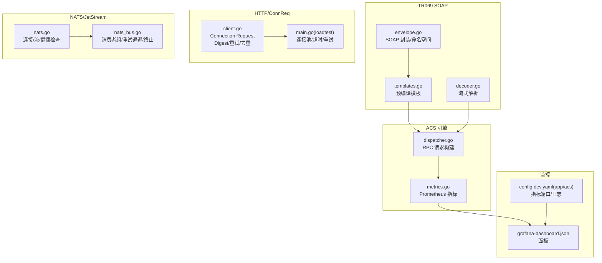
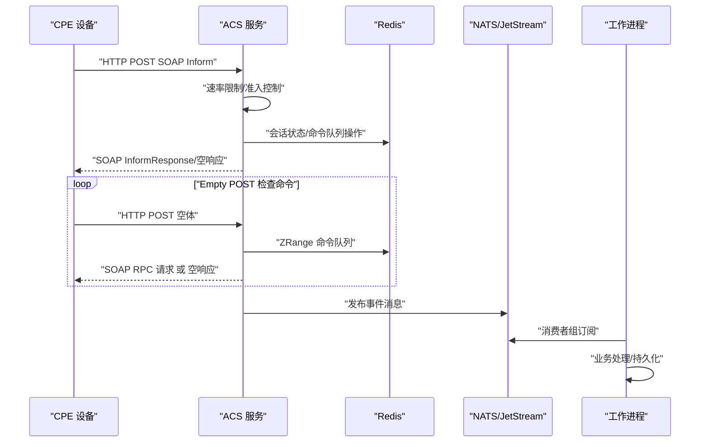
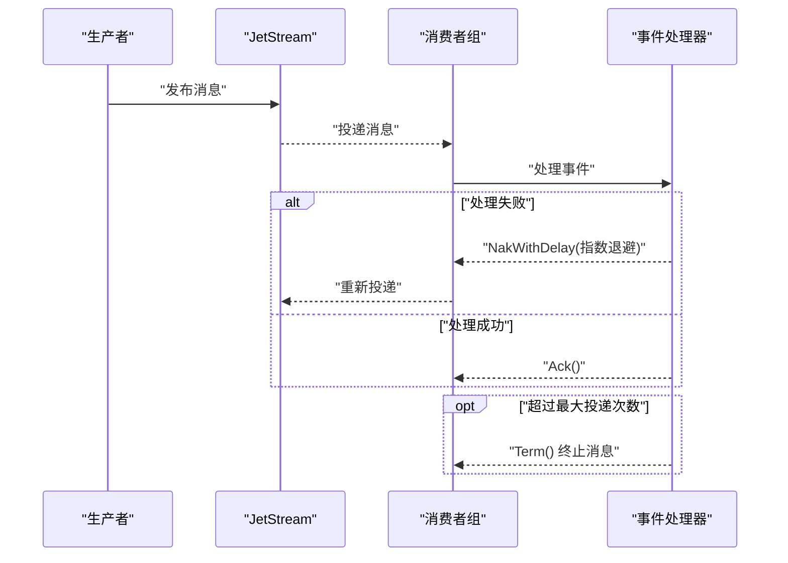
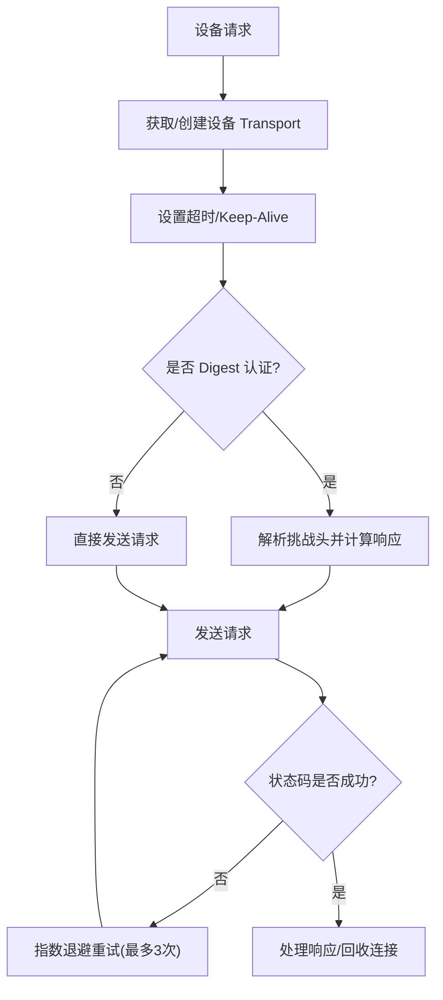
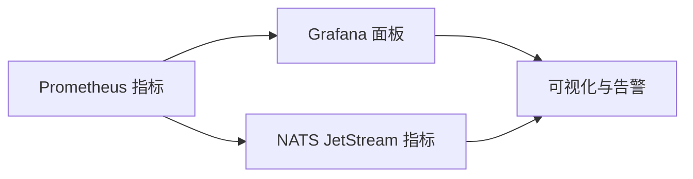
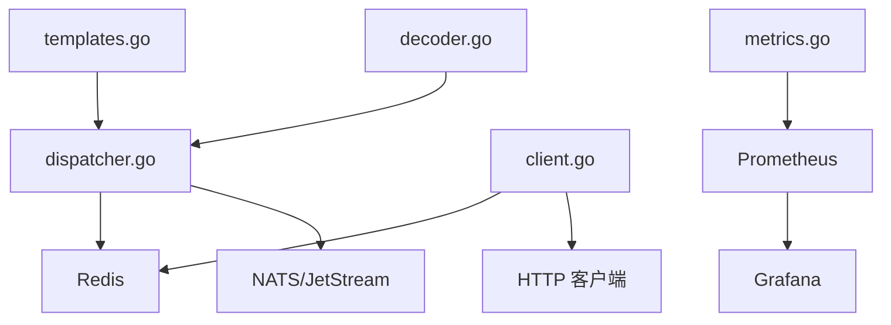

# 网络通信优化

<cite>
**本文引用的文件**
- [envelope.go](file://omcgo/pkg/soap/envelope.go)
- [templates.go](file://omcgo/pkg/soap/templates.go)
- [decoder.go](file://omcgo/pkg/soap/decoder.go)
- [dispatcher.go](file://omcgo/internal/acs/rpc/dispatcher.go)
- [client.go](file://omcgo/internal/acs/connreq/client.go)
- [nats.go](file://omcgo/internal/core/components/nats/nats.go)
- [nats_bus.go](file://omcgo/internal/core/event/nats_bus.go)
- [metrics.go](file://omcgo/internal/acs/metrics.go)
- [config.dev.yaml (acs)](file://omcgo/cmd/acs/etc/config.dev.yaml)
- [config.dev.yaml (app)](file://omcgo/cmd/app/etc/config.dev.yaml)
- [grafana-dashboard.json](file://omcgo/deployments/monitoring/grafana-dashboard.json)
- [main.go (loadtest)](file://omcgo/scripts/loadtest/main.go)
- [acs-stress-test-prediction.md](file://omcgo/docs/acs-stress-test-prediction.md)
- [acs-stress-test-fix-plan.md](file://omcgo/docs/acs-stress-test-fix-plan.md)
- [index.tsx (NetworkDiagnosis)](file://omcmb/webcode/src/pages/ops/NetworkDiagnosis/index.tsx)
</cite>

## 目录
1. [简介](#简介)
2. [项目结构](#项目结构)
3. [核心组件](#核心组件)
4. [架构总览](#架构总览)
5. [详细组件分析](#详细组件分析)
6. [依赖关系分析](#依赖关系分析)
7. [性能考量](#性能考量)
8. [故障排查指南](#故障排查指南)
9. [结论](#结论)
10. [附录](#附录)

## 简介
本文件面向 Baicells OMC 项目的网络通信优化，围绕 TR069 协议的 SOAP 消息传输、NATS 消息队列、HTTP 请求与连接优化，以及网络监控与故障排查进行系统化梳理。重点包括：
- TR069 传输优化：SOAP 模板预编译、流式解析、连接复用与重试策略
- NATS 性能优化：JetStream 队列深度、消费者组与重试退避
- HTTP 请求优化：连接池、超时、重试与认证
- 网络监控指标：带宽、延迟、丢包、队列深度与运行时指标
- 环境适配：不同网络环境下的配置建议与调优方法

## 项目结构
与网络通信优化直接相关的关键模块：
- TR069 SOAP 层：消息封装、模板渲染、流式解析
- ACS 引擎：会话管理、RPC 分发、速率限制与准入控制
- 连接请求（ConnReq）：HTTP GET、Digest 认证、去重与指数退避
- NATS/JetStream：连接、流与消费者组、消息重试与终止
- 监控与可视化：Prometheus 指标、Grafana 仪表盘
- 压测与预测：负载测试工具、性能预测与修复方案

**图表来源**
- [envelope.go:1-35](file://omcgo/pkg/soap/envelope.go#L1-L35)
- [templates.go:1-303](file://omcgo/pkg/soap/templates.go#L1-L303)
- [decoder.go:1-67](file://omcgo/pkg/soap/decoder.go#L1-L67)
- [dispatcher.go:89-135](file://omcgo/internal/acs/rpc/dispatcher.go#L89-L135)
- [client.go:1-243](file://omcgo/internal/acs/connreq/client.go#L1-L243)
- [nats.go:1-113](file://omcgo/internal/core/components/nats/nats.go#L1-L113)
- [nats_bus.go:64-135](file://omcgo/internal/core/event/nats_bus.go#L64-L135)
- [metrics.go:1-63](file://omcgo/internal/acs/metrics.go#L1-L63)
- [config.dev.yaml (acs):1-70](file://omcgo/cmd/acs/etc/config.dev.yaml#L1-L70)
- [config.dev.yaml (app):1-91](file://omcgo/cmd/app/etc/config.dev.yaml#L1-L91)
- [grafana-dashboard.json:1-142](file://omcgo/deployments/monitoring/grafana-dashboard.json#L1-L142)
- [main.go (loadtest):262-306](file://omcgo/scripts/loadtest/main.go#L262-L306)

**章节来源**
- [envelope.go:1-35](file://omcgo/pkg/soap/envelope.go#L1-L35)
- [templates.go:1-303](file://omcgo/pkg/soap/templates.go#L1-L303)
- [decoder.go:1-67](file://omcgo/pkg/soap/decoder.go#L1-L67)
- [dispatcher.go:89-135](file://omcgo/internal/acs/rpc/dispatcher.go#L89-L135)
- [client.go:1-243](file://omcgo/internal/acs/connreq/client.go#L1-L243)
- [nats.go:1-113](file://omcgo/internal/core/components/nats/nats.go#L1-L113)
- [nats_bus.go:64-135](file://omcgo/internal/core/event/nats_bus.go#L64-L135)
- [metrics.go:1-63](file://omcgo/internal/acs/metrics.go#L1-L63)
- [config.dev.yaml (acs):1-70](file://omcgo/cmd/acs/etc/config.dev.yaml#L1-L70)
- [config.dev.yaml (app):1-91](file://omcgo/cmd/app/etc/config.dev.yaml#L1-L91)
- [grafana-dashboard.json:1-142](file://omcgo/deployments/monitoring/grafana-dashboard.json#L1-L142)
- [main.go (loadtest):262-306](file://omcgo/scripts/loadtest/main.go#L262-L306)

## 核心组件
- SOAP 消息封装与模板渲染：通过预编译模板减少每次渲染开销，采用流式解析提升解码效率。
- ACS RPC 分发：根据命令队列生成对应 RPC 请求，统一输出 SOAP 响应。
- Connection Request：支持 Digest 认证、Redis 去重、指数退避重试，避免重复触发。
- NATS/JetStream：使用 JetStream 工作队列策略，消费者组支持并行消费与重试退避。
- HTTP 连接池与超时：按设备维度建立连接池，确保同一设备的 TCP 复用；合理设置超时与 Keep-Alive。
- 监控与可视化：暴露 Prometheus 指标并通过 Grafana 展示会话、RPC 延迟、队列深度等。

**章节来源**
- [templates.go:29-46](file://omcgo/pkg/soap/templates.go#L29-L46)
- [decoder.go:13-59](file://omcgo/pkg/soap/decoder.go#L13-L59)
- [dispatcher.go:89-135](file://omcgo/internal/acs/rpc/dispatcher.go#L89-L135)
- [client.go:73-121](file://omcgo/internal/acs/connreq/client.go#L73-L121)
- [nats.go:76-96](file://omcgo/internal/core/components/nats/nats.go#L76-L96)
- [nats_bus.go:64-127](file://omcgo/internal/core/event/nats_bus.go#L64-L127)
- [main.go (loadtest):282-306](file://omcgo/scripts/loadtest/main.go#L282-L306)
- [metrics.go:17-62](file://omcgo/internal/acs/metrics.go#L17-L62)

## 架构总览
下图展示了 TR069 与 NATS 的关键交互路径，以及 HTTP 连接优化与监控链路。

**图表来源**
- [client.go:73-121](file://omcgo/internal/acs/connreq/client.go#L73-L121)
- [dispatcher.go:89-135](file://omcgo/internal/acs/rpc/dispatcher.go#L89-L135)
- [nats_bus.go:64-127](file://omcgo/internal/core/event/nats_bus.go#L64-L127)
- [grafana-dashboard.json:80-87](file://omcgo/deployments/monitoring/grafana-dashboard.json#L80-L87)

## 详细组件分析

### TR069 SOAP 传输优化
- 模板预编译：在初始化阶段预编译所有 SOAP 模板，避免运行时解析开销，提高响应生成速度。
- 流式解析：使用 xml.Decoder 对 SOAP Body 进行流式解析，仅提取必要字段，降低内存占用与 CPU 开销。
- 命名空间与头部：明确 SOAP/CWMP 命名空间与 Header ID，保证兼容性与可追踪性。

```mermaid
flowchart TD
Start(["接收 SOAP 请求"]) --> ParseHeader["流式解析 Header ID"]
ParseHeader --> ParseBody["进入 Body 并定位 RPC 方法"]
ParseBody --> BuildResp["根据方法选择预编译模板"]
BuildResp --> Render["执行模板渲染"]
Render --> Send["发送响应"]
Send --> End(["结束"])
```

**图表来源**
- [decoder.go:13-59](file://omcgo/pkg/soap/decoder.go#L13-L59)
- [templates.go:29-55](file://omcgo/pkg/soap/templates.go#L29-L55)
- [envelope.go:17-32](file://omcgo/pkg/soap/envelope.go#L17-L32)

**章节来源**
- [envelope.go:1-35](file://omcgo/pkg/soap/envelope.go#L1-L35)
- [templates.go:29-55](file://omcgo/pkg/soap/templates.go#L29-L55)
- [decoder.go:13-59](file://omcgo/pkg/soap/decoder.go#L13-L59)

### NATS 消息队列性能优化
- JetStream 工作队列：使用 WorkQueuePolicy 与 Subjects 路由，确保消息有序且可并行消费。
- 消费者组与重试：消费者组支持多实例并行；失败消息采用指数退避重试，达到最大投递次数后终止。
- 持久化与保留：文件存储、TTL 保留与副本配置，兼顾可靠性与成本。
- 健康检查：连接健康检查与优雅关闭，避免资源泄露。

**图表来源**
- [nats.go:76-96](file://omcgo/internal/core/components/nats/nats.go#L76-L96)
- [nats_bus.go:64-127](file://omcgo/internal/core/event/nats_bus.go#L64-L127)

**章节来源**
- [nats.go:26-96](file://omcgo/internal/core/components/nats/nats.go#L26-L96)
- [nats_bus.go:64-127](file://omcgo/internal/core/event/nats_bus.go#L64-L127)

### HTTP 请求优化（连接池、超时、重试）
- 按设备连接池：每个设备维护独立的 http.Transport，MaxConnsPerHost=1，确保同一设备的 TCP 连接复用，同时避免跨设备连接串扰。
- 超时与 Keep-Alive：合理设置 Dial、ResponseHeaderTimeout、IdleConnTimeout，平衡延迟与资源占用。
- ConnReq 重试：基于 Redis 去重与指数退避（1s→2s→4s），支持 HTTP Digest 认证，降低重复请求与鉴权失败带来的开销。
- 压测工具：提供完整会话模拟与统计，便于评估优化效果。

**图表来源**
- [main.go (loadtest):282-306](file://omcgo/scripts/loadtest/main.go#L282-L306)
- [client.go:73-121](file://omcgo/internal/acs/connreq/client.go#L73-L121)

**章节来源**
- [main.go (loadtest):262-306](file://omcgo/scripts/loadtest/main.go#L262-L306)
- [client.go:19-121](file://omcgo/internal/acs/connreq/client.go#L19-L121)

### 网络监控与指标
- ACS 指标：活动会话数、Inform 总量、RPC 执行时延与错误、会话时长、设备限流拒绝数与跟踪设备数。
- NATS 指标：消费者待处理消息数（队列深度），结合 Grafana 面板观察。
- Grafana 面板：包含 ACS 活跃会话、设备总数、告警数、Inform 速率、RPC 延迟、HTTP 请求速率、队列深度、CPU/内存、Go 运行时指标等。

**图表来源**
- [metrics.go:17-62](file://omcgo/internal/acs/metrics.go#L17-L62)
- [grafana-dashboard.json:11-128](file://omcgo/deployments/monitoring/grafana-dashboard.json#L11-L128)

**章节来源**
- [metrics.go:1-63](file://omcgo/internal/acs/metrics.go#L1-L63)
- [grafana-dashboard.json:1-142](file://omcgo/deployments/monitoring/grafana-dashboard.json#L1-L142)

## 依赖关系分析
- SOAP 模块依赖 TR069 类型定义，模板渲染依赖预编译模板集合。
- ACS 引擎依赖 Redis 存储会话与命令队列，依赖 NATS 发布事件。
- NATS 客户端依赖配置中的 URL、重连等待与最大重连次数。
- 监控依赖 Prometheus 注册器与 Grafana 面板配置。

**图表来源**
- [templates.go:29-55](file://omcgo/pkg/soap/templates.go#L29-L55)
- [decoder.go:13-59](file://omcgo/pkg/soap/decoder.go#L13-L59)
- [dispatcher.go:89-135](file://omcgo/internal/acs/rpc/dispatcher.go#L89-L135)
- [client.go:73-121](file://omcgo/internal/acs/connreq/client.go#L73-L121)
- [nats.go:38-73](file://omcgo/internal/core/components/nats/nats.go#L38-L73)
- [metrics.go:17-62](file://omcgo/internal/acs/metrics.go#L17-L62)

**章节来源**
- [templates.go:1-303](file://omcgo/pkg/soap/templates.go#L1-L303)
- [decoder.go:1-67](file://omcgo/pkg/soap/decoder.go#L1-L67)
- [dispatcher.go:89-135](file://omcgo/internal/acs/rpc/dispatcher.go#L89-L135)
- [client.go:1-243](file://omcgo/internal/acs/connreq/client.go#L1-L243)
- [nats.go:1-113](file://omcgo/internal/core/components/nats/nats.go#L1-L113)
- [metrics.go:1-63](file://omcgo/internal/acs/metrics.go#L1-L63)

## 性能考量
- TR069 处理瓶颈：XML 流式解析为主导，模板渲染极快；Redis 连接池充裕时非瓶颈。
- 连接复用：按设备连接池显著降低 TCP 握手开销，提升 Empty POST 成功率与整体吞吐。
- 速率限制与准入控制：防止突发流量击穿，结合 Prometheus 指标动态调参。
- NATS 消费：消费者组并行度与退避策略需与上游生产速率匹配，避免堆积与重复处理。

**章节来源**
- [acs-stress-test-prediction.md:93-125](file://omcgo/docs/acs-stress-test-prediction.md#L93-L125)
- [main.go (loadtest):282-306](file://omcgo/scripts/loadtest/main.go#L282-L306)
- [nats_bus.go:113-127](file://omcgo/internal/core/event/nats_bus.go#L113-L127)

## 故障排查指南
- 连接请求失败
  - 现象：Digest 401、重试后仍失败、重复触发。
  - 排查：确认 Digest 参数解析、Authorization 头构造；检查 Redis 去重键 TTL；查看指数退避日志。
- Empty POST 失败（204/RemoteAddr 不匹配）
  - 现象：大量 204 或连接复用异常。
  - 排查：确认 per-device 连接池生效；确保同一设备使用相同 Transport；检查会话状态与队列弹出逻辑。
- NATS 消息堆积
  - 现象：消费者 pending 持续增长。
  - 排查：增加消费者组实例、优化处理耗时、检查最大投递次数与退避策略；确认 JetStream 存储与保留策略。
- 指标异常
  - 现象：RPC 延迟升高、会话时长异常、限流拒绝增多。
  - 排查：结合 Grafana 面板定位时段峰值；检查 Redis 延迟、CPU 竞争、连接池饱和；调整速率限制与并发阈值。

**章节来源**
- [client.go:73-121](file://omcgo/internal/acs/connreq/client.go#L73-L121)
- [main.go (loadtest):282-306](file://omcgo/scripts/loadtest/main.go#L282-L306)
- [nats_bus.go:113-127](file://omcgo/internal/core/event/nats_bus.go#L113-L127)
- [grafana-dashboard.json:80-87](file://omcgo/deployments/monitoring/grafana-dashboard.json#L80-L87)

## 结论
通过对 TR069 SOAP 的模板预编译与流式解析、HTTP 连接池与重试策略、NATS 消费者组与退避重试的系统性优化，并配合完善的监控与压测验证，可在不同网络环境下获得稳定、可观测、可扩展的网络通信能力。建议在生产环境中进一步细化 NATS 副本与存储策略、按业务峰值调优速率限制与并发阈值，并持续通过 Grafana 与 Prometheus 追踪关键指标。

## 附录

### 网络监控指标清单
- ACS 指标
  - 活跃会话数：acs_active_sessions
  - Inform 总量：acs_inform_total
  - RPC 执行时延：acs_rpc_duration_seconds
  - RPC 错误数：acs_rpc_errors_total
  - 会话时长：acs_session_duration_seconds
  - 限流拒绝数：acs_rate_limit_rejected_total
  - 限流设备数：acs_rate_limit_device_count
- NATS 指标
  - 队列深度（消费者待处理）：nats_jetstream_consumer_num_pending
- Grafana 面板
  - 会话与设备统计、Inform 速率、RPC 延迟、HTTP 请求速率、队列深度、CPU/内存、Go 运行时指标

**章节来源**
- [metrics.go:17-62](file://omcgo/internal/acs/metrics.go#L17-L62)
- [grafana-dashboard.json:11-128](file://omcgo/deployments/monitoring/grafana-dashboard.json#L11-L128)

### 不同网络环境下的优化策略与配置建议
- 开发/本地环境
  - 关闭 TLS 证书校验（仅开发）、降低日志级别、适度放宽速率限制。
  - NATS 单节点副本，JetStream 文件存储即可。
- 预生产/小规模生产
  - 启用 TLS、合理设置 Redis 连接池与 NATS 重连等待；开启 Prometheus 指标端口。
- 生产大规模
  - NATS 多副本、磁盘/对象存储、消费者组水平扩展；Redis 主从或集群；ACS 并发与速率限制按峰值调优；监控面板覆盖全链路。

**章节来源**
- [config.dev.yaml (acs):1-70](file://omcgo/cmd/acs/etc/config.dev.yaml#L1-L70)
- [config.dev.yaml (app):1-91](file://omcgo/cmd/app/etc/config.dev.yaml#L1-L91)
- [nats.go:76-96](file://omcgo/internal/core/components/nats/nats.go#L76-L96)

### 网络诊断前端页面
- 提供 Ping/Traceroute 诊断界面，支持统计概要（发送/接收/丢包、RTT 统计）。
- 便于快速定位网络连通性与路由问题。

**章节来源**
- [index.tsx (NetworkDiagnosis):239-266](file://omcmb/webcode/src/pages/ops/NetworkDiagnosis/index.tsx#L239-L266)