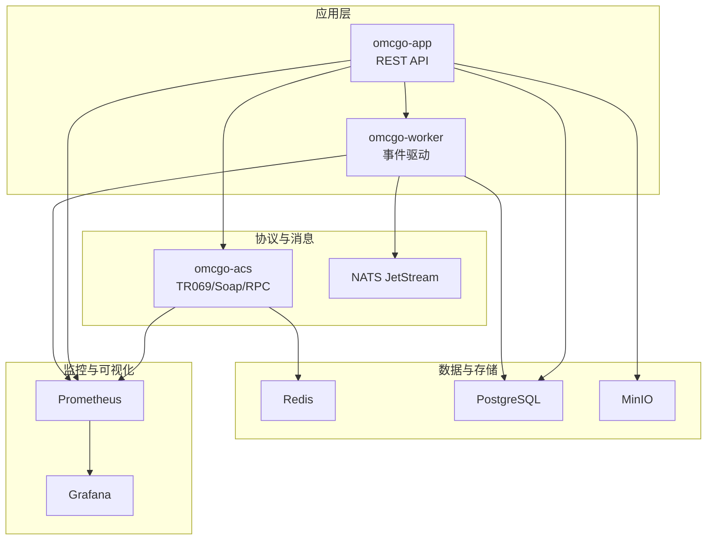
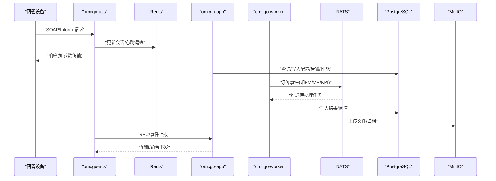
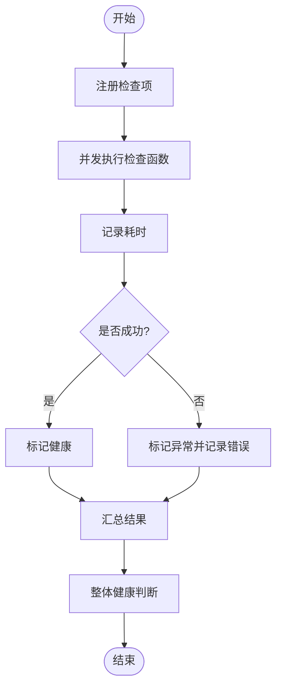
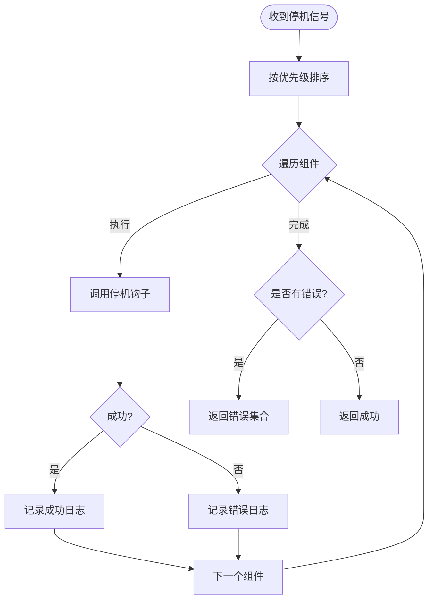
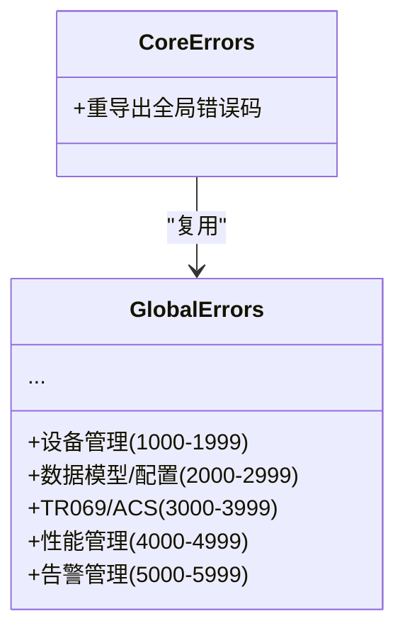
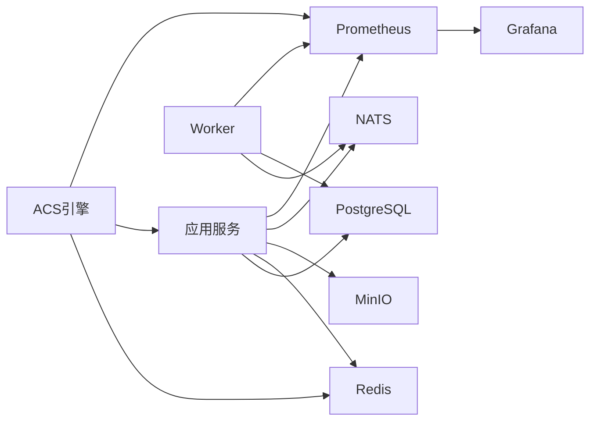

# 故障排除

<cite>
**本文引用的文件**
- [omcgo/internal/core/components/health.go](file://omcgo/internal/core/components/health.go)
- [omcgo/internal/core/components/shutdown.go](file://omcgo/internal/core/components/shutdown.go)
- [omcgo/internal/core/errors/codes.go](file://omcgo/internal/core/errors/codes.go)
- [omcgo/global/errors.go](file://omcgo/global/errors.go)
- [omcgo/internal/core/components/logger/logger.go](file://omcgo/internal/core/components/logger/logger.go)
- [omcgo/internal/acs/metrics.go](file://omcgo/internal/acs/metrics.go)
- [omcgo/deployments/monitoring/grafana-dashboard.json](file://omcgo/deployments/monitoring/grafana-dashboard.json)
- [omcgo/scripts/health-check.sh](file://omcgo/scripts/health-check.sh)
- [omcgo/docs/operations/deployment-guide.md](file://omcgo/docs/operations/deployment-guide.md)
- [omcgo/internal/device/handler.go](file://omcgo/internal/device/handler.go)
- [omcgo/internal/provision/engine.go](file://omcgo/internal/provision/engine.go)
- [omcgo/internal/pm/handler.go](file://omcgo/internal/pm/handler.go)
- [omcgo/internal/alarm/engine.go](file://omcgo/internal/alarm/engine.go)
- [omcgo/internal/northbound/alarm_handler.go](file://omcgo/internal/northbound/alarm_handler.go)
- [omcgo/internal/northbound/pm_handler.go](file://omcgo/internal/northbound/pm_handler.go)
- [omcgo/internal/syslog/handler.go](file://omcgo/internal/syslog/handler.go)
- [omcgo/internal/admin/middleware.go](file://omcgo/internal/admin/middleware.go)
- [omcgo/internal/transfer/bridge.go](file://omcgo/internal/transfer/bridge.go)
</cite>

## 目录
1. [简介](#简介)
2. [项目结构](#项目结构)
3. [核心组件](#核心组件)
4. [架构总览](#架构总览)
5. [详细组件分析](#详细组件分析)
6. [依赖分析](#依赖分析)
7. [性能考虑](#性能考虑)
8. [故障排除指南](#故障排除指南)
9. [结论](#结论)
10. [附录](#附录)

## 简介
本指南面向Baicells OMC项目的运维与开发人员，提供系统性的故障诊断方法与应急处置流程。内容覆盖日志分析、性能监控、错误追踪、健康检查、紧急处理、内存与并发问题排查等，帮助快速定位并解决设备连接失败、配置下发错误、性能数据缺失、告警不触发等常见问题。

## 项目结构
OMC后端采用多服务分层架构：应用服务负责REST API与业务编排；ACS引擎负责TR069协议交互；Worker通过事件驱动处理PM/MR/KPI等异步任务；NATS作为消息总线；Redis存储会话与心跳；PostgreSQL存储主数据；MinIO用于文件归档；Prometheus/Grafana提供可观测性。

图表来源
- [omcgo/internal/acs/metrics.go:1-63](file://omcgo/internal/acs/metrics.go#L1-L63)
- [omcgo/deployments/monitoring/grafana-dashboard.json:1-142](file://omcgo/deployments/monitoring/grafana-dashboard.json#L1-L142)

章节来源
- [omcgo/docs/operations/deployment-guide.md:1-207](file://omcgo/docs/operations/deployment-guide.md#L1-L207)

## 核心组件
- 健康检查器：统一注册并并发执行各组件健康检查，输出状态、延迟与错误摘要，并提供整体健康判定与HTTP状态码映射。
- 优雅停机编排：按优先级顺序执行各组件停机钩子，记录日志并汇总错误，保障服务平滑下线。
- 错误码体系：按域划分错误码范围，便于快速定位问题域与语义化诊断。
- 日志系统：支持控制台与文件输出、多路合并、结构化编码与日志轮转。
- 指标与监控：暴露TR069会话、Inform速率、RPC耗时、队列深度、资源使用等关键指标，配合Grafana看板实时观测。

章节来源
- [omcgo/internal/core/components/health.go:1-107](file://omcgo/internal/core/components/health.go#L1-L107)
- [omcgo/internal/core/components/shutdown.go:1-76](file://omcgo/internal/core/components/shutdown.go#L1-L76)
- [omcgo/internal/core/errors/codes.go:1-137](file://omcgo/internal/core/errors/codes.go#L1-L137)
- [omcgo/global/errors.go:1-135](file://omcgo/global/errors.go#L1-L135)
- [omcgo/internal/core/components/logger/logger.go:1-142](file://omcgo/internal/core/components/logger/logger.go#L1-L142)
- [omcgo/internal/acs/metrics.go:1-63](file://omcgo/internal/acs/metrics.go#L1-L63)

## 架构总览
下图展示OMC在运行期的关键交互路径：设备经由TR069与ACS引擎通信，会话与心跳通过Redis维护；应用服务与Worker分别读写数据库与消费NATS消息；Prometheus抓取指标，Grafana呈现。

图表来源
- [omcgo/internal/acs/metrics.go:1-63](file://omcgo/internal/acs/metrics.go#L1-L63)
- [omcgo/deployments/monitoring/grafana-dashboard.json:1-142](file://omcgo/deployments/monitoring/grafana-dashboard.json#L1-L142)

## 详细组件分析

### 健康检查机制
- 组件注册：通过名称与检查函数注册，支持并发执行。
- 结果聚合：返回每个组件的状态、耗时与错误详情；整体健康判定基于全部组件健康。
- HTTP映射：健康返回200，任一组件异常返回503，便于Kubernetes存活/就绪探针使用。
- 使用场景：部署后自检、CI集成、自动化巡检脚本调用。

图表来源
- [omcgo/internal/core/components/health.go:41-92](file://omcgo/internal/core/components/health.go#L41-L92)

章节来源
- [omcgo/internal/core/components/health.go:1-107](file://omcgo/internal/core/components/health.go#L1-L107)

### 优雅停机编排
- 优先级排序：HTTP服务器、NATS、Redis、数据库、对象存储等按序关闭，避免数据不一致或消息丢失。
- 超时控制：统一超时上下文，防止停机卡死。
- 错误汇总：记录每个组件停机日志并汇总错误，便于事后审计。

图表来源
- [omcgo/internal/core/components/shutdown.go:45-75](file://omcgo/internal/core/components/shutdown.go#L45-L75)

章节来源
- [omcgo/internal/core/components/shutdown.go:1-76](file://omcgo/internal/core/components/shutdown.go#L1-L76)

### 错误码体系与语义化诊断
- 域划分：设备管理、数据模型/配置、TR069/ACS、性能管理、告警管理、自动配置、认证授权、软件升级、北向/OSS、互操作测试、基线/任务/邻区、许可证、报表、运维工具、备份FTP、MR指标等。
- 一致性：内部模块复用全局错误码常量，保证跨模块语义一致。
- 实战建议：结合错误码范围快速定位模块域，再结合日志堆栈与指标进行根因分析。

图表来源
- [omcgo/global/errors.go:1-135](file://omcgo/global/errors.go#L1-L135)
- [omcgo/internal/core/errors/codes.go:1-137](file://omcgo/internal/core/errors/codes.go#L1-L137)

章节来源
- [omcgo/global/errors.go:1-135](file://omcgo/global/errors.go#L1-L135)
- [omcgo/internal/core/errors/codes.go:1-137](file://omcgo/internal/core/errors/codes.go#L1-L137)

### 日志系统与采集
- 输出模式：控制台彩色编码与生产JSON编码可选；支持stdout/stderr与文件输出。
- 轮转策略：基于lumberjack实现大小/时间/备份数限制的滚动日志。
- 多路合并：可同时输出到多个目标，满足不同采集器需求。
- 建议：在容器环境统一输出到stdout/stderr，由Sidecar或DaemonSet采集；本地开发启用控制台格式提升可读性。

章节来源
- [omcgo/internal/core/components/logger/logger.go:1-142](file://omcgo/internal/core/components/logger/logger.go#L1-L142)

### 指标与监控
- ACS关键指标：活跃会话数、Inform总量、RPC耗时分布、RPC错误计数、会话时长、限流拒绝数与跟踪设备数。
- Grafana看板：包含ACS活跃会话、设备总数、活动告警、Pod数量、Inform速率、RPC延迟、组件HTTP请求率、NATS队列深度、CPU/内存、Go运行时协程与GC等面板。
- 建议：结合告警规则（如会话过载、错误率上升、队列积压、连接池高占用、Pod重启风暴）进行分级处置。

章节来源
- [omcgo/internal/acs/metrics.go:1-63](file://omcgo/internal/acs/metrics.go#L1-L63)
- [omcgo/deployments/monitoring/grafana-dashboard.json:1-142](file://omcgo/deployments/monitoring/grafana-dashboard.json#L1-L142)

## 依赖分析
- 服务耦合：应用服务与Worker均依赖数据库与NATS；ACS依赖Redis存储会话；所有组件均暴露Prometheus指标供抓取。
- 外部依赖：PostgreSQL、Redis、NATS、MinIO；监控链路：Prometheus抓取→Grafana展示。
- 风险点：NATS消费者滞后可能引发PM/MR/KPI处理延迟；Redis内存不足影响会话与心跳；数据库连接池紧张导致请求排队。

图表来源
- [omcgo/deployments/monitoring/grafana-dashboard.json:1-142](file://omcgo/deployments/monitoring/grafana-dashboard.json#L1-L142)
- [omcgo/internal/acs/metrics.go:1-63](file://omcgo/internal/acs/metrics.go#L1-L63)

## 性能考虑
- 指标观测：关注Inform速率、RPC延迟分位、活跃会话、队列积压、CPU/内存、Go协程数与GC暂停时间。
- 扩缩容策略：根据容量规划与HPA/KEDA策略动态伸缩；NATS队列深度触发Worker扩缩容。
- 资源瓶颈：优先检查数据库连接池、Redis内存与淘汰策略、NATS消费者滞后与JetStream配置。

章节来源
- [omcgo/docs/operations/deployment-guide.md:108-136](file://omcgo/docs/operations/deployment-guide.md#L108-L136)
- [omcgo/deployments/monitoring/grafana-dashboard.json:1-142](file://omcgo/deployments/monitoring/grafana-dashboard.json#L1-L142)

## 故障排除指南

### 通用诊断流程
- 快速自检：使用内置健康检查脚本核验数据库、缓存、消息、对象存储、各服务进程与最近设备活动。
- 日志定位：结合错误码范围与日志堆栈，缩小问题域；必要时开启更详细级别并启用堆栈记录。
- 指标关联：查看Grafana看板，确认是否存在异常峰值或持续异常趋势。
- 依赖验证：逐一验证数据库、缓存、消息中间件连通性与健康状态。

章节来源
- [omcgo/scripts/health-check.sh:1-129](file://omcgo/scripts/health-check.sh#L1-L129)
- [omcgo/internal/core/components/logger/logger.go:1-142](file://omcgo/internal/core/components/logger/logger.go#L1-L142)
- [omcgo/deployments/monitoring/grafana-dashboard.json:1-142](file://omcgo/deployments/monitoring/grafana-dashboard.json#L1-L142)

### 设备连接失败
- 现象特征：设备无法发起Inform、会话键不存在、ACS日志出现连接异常。
- 排查步骤：
  1) 确认ACS服务LB外网可达与TLS配置正确。
  2) 检查Redis会话/心跳键是否存在与TTL是否异常。
  3) 查看ACS指标中的活跃会话与RPC错误计数。
  4) 核对设备侧TR069 URL、证书与网络连通性。
- 常见原因：DNS/TLS/防火墙、Redis内存淘汰、NATS消费者异常、数据库连接池耗尽。
- 相关指标与组件：acs_active_sessions、acs_rpc_errors_total、nats_jetstream_consumer_num_pending、container_memory_working_set_bytes。

章节来源
- [omcgo/scripts/health-check.sh:66-82](file://omcgo/scripts/health-check.sh#L66-L82)
- [omcgo/internal/acs/metrics.go:1-63](file://omcgo/internal/acs/metrics.go#L1-L63)
- [omcgo/docs/operations/deployment-guide.md:188-194](file://omcgo/docs/operations/deployment-guide.md#L188-L194)

### 配置下发错误
- 现象特征：设备未收到配置、下发超时、配置同步失败。
- 排查步骤：
  1) 确认模板与数据模型导入成功且作用域有效。
  2) 检查配置任务状态与匹配规则。
  3) 关注ACS RPC耗时与错误分布，定位慢方法与失败方法。
  4) 核对数据库中配置任务与设备参数仓库状态。
- 常见原因：模板参数无效、匹配器不匹配、数据库写入阻塞、NATS消息堆积。
- 相关错误码：配置同步失败、模板参数无效、配置任务不存在。
- 相关组件：internal/device、internal/provision、internal/config。

章节来源
- [omcgo/internal/core/errors/codes.go:16-24](file://omcgo/internal/core/errors/codes.go#L16-L24)
- [omcgo/internal/provision/engine.go](file://omcgo/internal/provision/engine.go)
- [omcgo/internal/device/handler.go](file://omcgo/internal/device/handler.go)

### 性能数据缺失
- 现象特征：性能指标报表为空、KPI计算失败、阈值未触发。
- 排查步骤：
  1) 检查Worker是否运行及NATS消费者状态。
  2) 关注PM任务与阈值仓库状态，确认任务调度正常。
  3) 查看PM文件存储与指标采集链路。
  4) 对比Grafana“NATS队列深度”与“Inform速率”，判断是否存在积压。
- 常见原因：Worker未启动、NATS消费者滞后、阈值未配置、PM文件未生成。
- 相关组件：internal/pm、internal/mr、internal/northbound/pm_handler。

章节来源
- [omcgo/scripts/health-check.sh:95-102](file://omcgo/scripts/health-check.sh#L95-L102)
- [omcgo/internal/pm/handler.go](file://omcgo/internal/pm/handler.go)
- [omcgo/internal/northbound/pm_handler.go](file://omcgo/internal/northbound/pm_handler.go)

### 告警不触发
- 现象特征：阈值越界但未产生告警、历史告警缺失。
- 排查步骤：
  1) 检查告警规则与阈值配置。
  2) 确认告警引擎与存储状态。
  3) 核对北向推送与接收链路。
  4) 查看告警相关指标与队列深度。
- 常见原因：规则未生效、阈值未设置、存储异常、北向推送失败。
- 相关错误码：告警规则不存在、告警已确认/清除、北向推送失败。
- 相关组件：internal/alarm、internal/northbound/alarm_handler。

章节来源
- [omcgo/internal/core/errors/codes.go:42-48](file://omcgo/internal/core/errors/codes.go#L42-L48)
- [omcgo/internal/alarm/engine.go](file://omcgo/internal/alarm/engine.go)
- [omcgo/internal/northbound/alarm_handler.go](file://omcgo/internal/northbound/alarm_handler.go)

### 认证与权限问题
- 现象特征：登录失败、Token过期/无效、权限不足。
- 排查步骤：
  1) 检查鉴权中间件与用户/角色/权限状态。
  2) 核对JWT签发与校验配置。
  3) 关注认证相关错误码与日志堆栈。
- 常见原因：凭据错误、Token失效、RBAC配置不当。
- 相关错误码：认证凭据无效、Token过期、权限不足。
- 相关组件：internal/admin。

章节来源
- [omcgo/internal/core/errors/codes.go:57-68](file://omcgo/internal/core/errors/codes.go#L57-L68)
- [omcgo/internal/admin/middleware.go](file://omcgo/internal/admin/middleware.go)

### 北向/OSS对接异常
- 现象特征：告警/性能数据无法推送到OSS、同步失败、导出异常。
- 排查步骤：
  1) 检查OSS目标配置与连通性。
  2) 关注北向处理器状态与错误计数。
  3) 核对导出任务与文件存储状态。
- 常见原因：目标不可达、导出失败、配置错误。
- 相关错误码：北向目标不存在、推送失败、同步失败、导出失败。
- 相关组件：internal/northbound/*、internal/transfer。

章节来源
- [omcgo/internal/core/errors/codes.go:78-84](file://omcgo/internal/core/errors/codes.go#L78-L84)
- [omcgo/internal/northbound/alarm_handler.go](file://omcgo/internal/northbound/alarm_handler.go)
- [omcgo/internal/northbound/pm_handler.go](file://omcgo/internal/northbound/pm_handler.go)
- [omcgo/internal/transfer/bridge.go](file://omcgo/internal/transfer/bridge.go)

### 日志管理与取证
- 现象特征：日志缺失、检索困难、磁盘爆满。
- 排查步骤：
  1) 检查日志输出路径与轮转配置。
  2) 确认采集器连通性与索引完整性。
  3) 根据错误码范围与时间窗口进行检索。
- 建议：统一stdout/stderr输出，结合lumberjack轮转，使用集中式日志平台。

章节来源
- [omcgo/internal/core/components/logger/logger.go:1-142](file://omcgo/internal/core/components/logger/logger.go#L1-L142)
- [omcgo/internal/syslog/handler.go](file://omcgo/internal/syslog/handler.go)

### 紧急处理流程
- 故障隔离：优先停止对外服务入口（如禁用LB或临时下线），保留内部依赖检查。
- 降级策略：关闭非关键功能（如部分报表/导出）、降低日志级别、启用只读模式。
- 逐步恢复：先恢复数据库/缓存/消息中间件，再恢复应用与Worker；最后恢复外部北向对接。
- 优雅停机：使用停机编排按优先级关闭组件，记录停机日志与错误，确保数据一致性。

章节来源
- [omcgo/internal/core/components/shutdown.go:1-76](file://omcgo/internal/core/components/shutdown.go#L1-L76)
- [omcgo/docs/operations/deployment-guide.md:186-207](file://omcgo/docs/operations/deployment-guide.md#L186-L207)

### 高级故障排除技巧
- 内存泄漏检测：观察Go运行时指标中的内存使用与GC暂停时间，对比部署前基线；结合pprof采样定位热点。
- 死锁排查：检查协程数与阻塞调用，结合日志堆栈定位等待链；必要时启用更详细的日志级别。
- 并发竞争：关注限流与队列深度，避免热点设备/方法成为瓶颈；优化批处理与重试策略。
- 数据库慢查询：结合PG慢日志与连接池使用率，优化索引与查询计划。

章节来源
- [omcgo/deployments/monitoring/grafana-dashboard.json:109-128](file://omcgo/deployments/monitoring/grafana-dashboard.json#L109-L128)
- [omcgo/docs/operations/deployment-guide.md:186-207](file://omcgo/docs/operations/deployment-guide.md#L186-L207)

## 结论
通过统一的健康检查、错误码体系、日志与指标可观测性，以及标准化的紧急处理流程，可以显著缩短故障定位与恢复时间。建议在日常运维中定期巡检、建立基线与告警阈值，并结合本指南的步骤进行例行演练，以提升系统的稳定性与可维护性。

## 附录

### 常用命令与脚本
- 健康检查脚本：一键检查数据库、缓存、消息、对象存储、各服务进程与设备活动。
- 部署与扩缩容：参考部署指南中的镜像构建、Secret配置、迁移执行与HPA/KEDA配置。
- 监控仪表盘：导入Grafana看板，关注关键指标面板与告警规则。

章节来源
- [omcgo/scripts/health-check.sh:1-129](file://omcgo/scripts/health-check.sh#L1-L129)
- [omcgo/docs/operations/deployment-guide.md:1-207](file://omcgo/docs/operations/deployment-guide.md#L1-L207)
- [omcgo/deployments/monitoring/grafana-dashboard.json:1-142](file://omcgo/deployments/monitoring/grafana-dashboard.json#L1-L142)