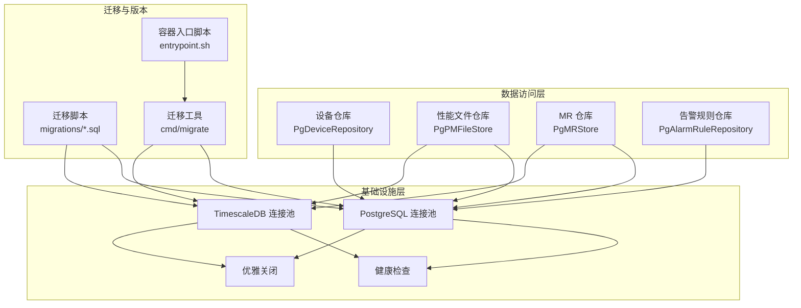
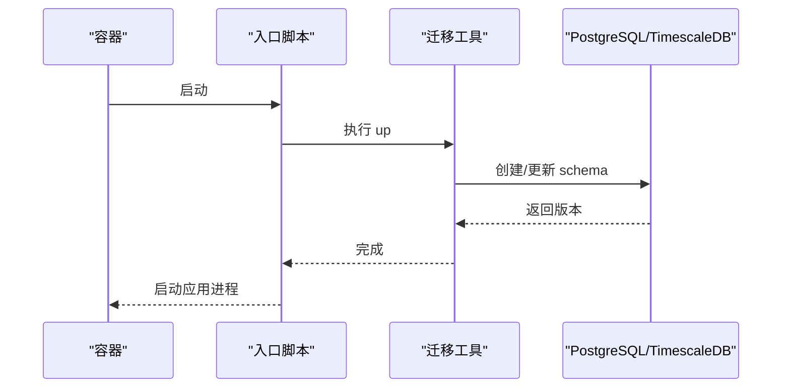
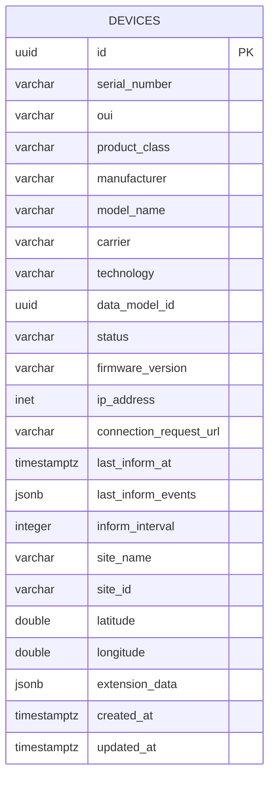
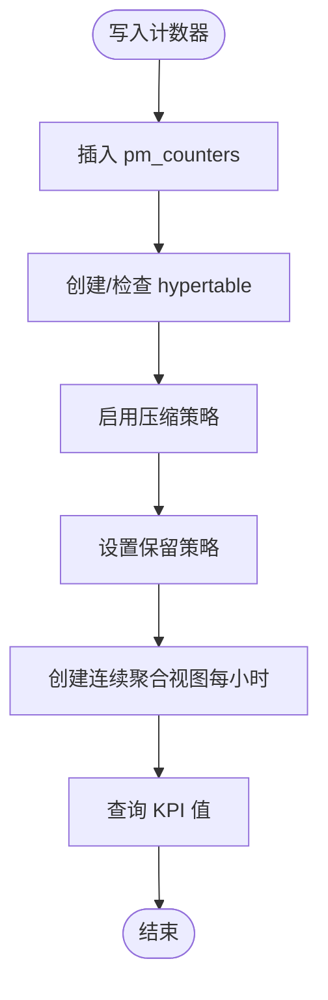
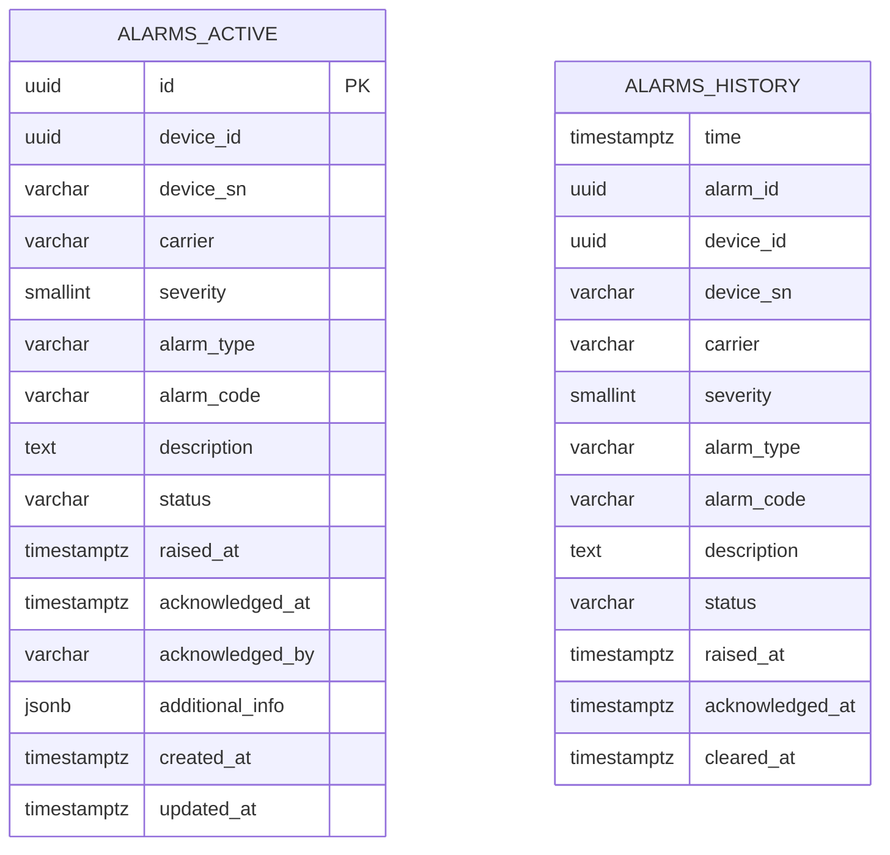
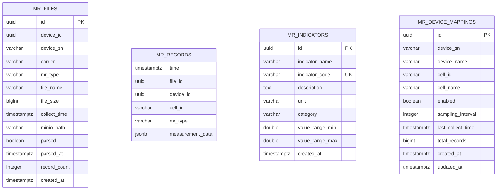
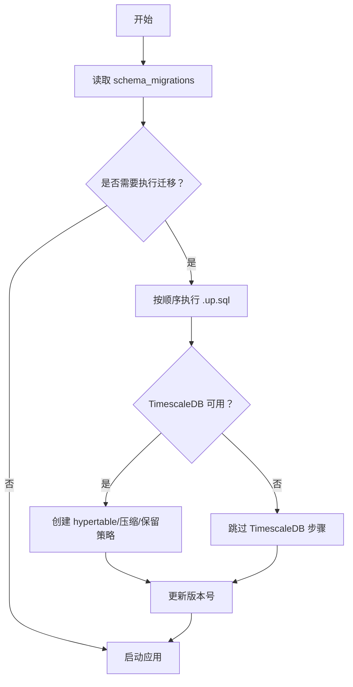
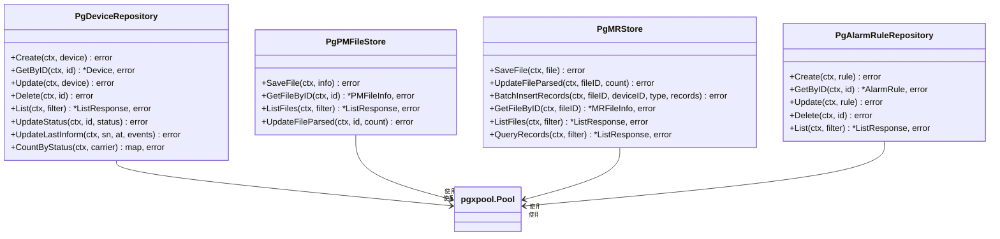
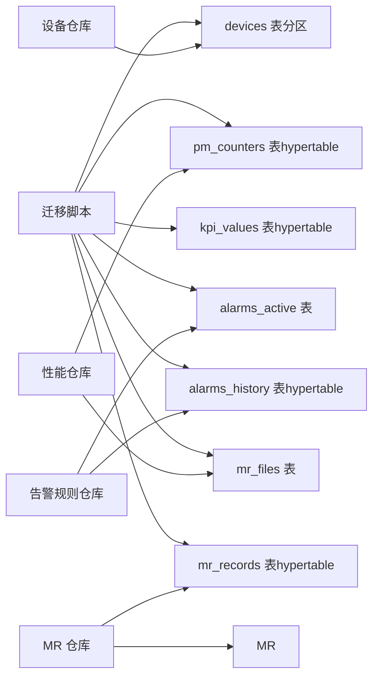

# 数据库设计

<cite>
**本文引用的文件**
- [000001_create_devices.up.sql](file://omcgo/migrations/000001_create_devices.up.sql)
- [000010_create_pm_counters.up.sql](file://omcgo/migrations/000010_create_pm_counters.up.sql)
- [000011_create_kpi_tables.up.sql](file://omcgo/migrations/000011_create_kpi_tables.up.sql)
- [000012_create_alarms.up.sql](file://omcgo/migrations/000012_create_alarms.up.sql)
- [000013_create_mr_tables.up.sql](file://omcgo/migrations/000013_create_mr_tables.up.sql)
- [000021_optimize_indexes.up.sql](file://omcgo/migrations/000021_optimize_indexes.up.sql)
- [000029_create_mr_indicators.up.sql](file://omcgo/migrations/000029_create_mr_indicators.up.sql)
- [database-migration.md](file://omcgo/docs/design/database-migration.md)
- [02-infrastructure-layer.md](file://omcgo/docs/detailed-design/02-infrastructure-layer.md)
- [pg_repository.go](file://omcgo/internal/device/pg_repository.go)
- [pg_store.go](file://omcgo/internal/mr/pg_store.go)
- [pg_file_store.go](file://omcgo/internal/pm/pg_file_store.go)
- [pg_rule_repository.go](file://omcgo/internal/alarm/pg_rule_repository.go)
- [device.go](file://omcgo/internal/core/model/device.go)
- [pm.go](file://omcgo/internal/core/model/pm.go)
</cite>

## 目录
1. [简介](#简介)
2. [项目结构](#项目结构)
3. [核心组件](#核心组件)
4. [架构总览](#架构总览)
5. [详细组件分析](#详细组件分析)
6. [依赖分析](#依赖分析)
7. [性能考虑](#性能考虑)
8. [故障排查指南](#故障排查指南)
9. [结论](#结论)
10. [附录](#附录)

## 简介
本文件面向 Baicells OMC 项目的数据库设计，系统化阐述数据库架构、表结构、索引与分区策略、数据模型演进机制、数据访问层设计、备份恢复策略以及性能优化建议。项目采用 PostgreSQL 作为主数据库，并结合 TimescaleDB 扩展用于时序数据高效存储与查询，覆盖设备、参数、性能、告警、MR 等核心业务域。

## 项目结构
- 数据库迁移采用 golang-migrate 管理，迁移文件位于 migrations/，按编号顺序 up/down 执行。
- 基础设施层负责 PostgreSQL/TimescaleDB 连接池、健康检查与优雅关闭。
- 数据访问层采用 Repository 模式，结合 SQL 构建器与 pgx 连接池，分别实现设备、性能、告警、MR 等模块的数据持久化。
- 核心领域模型定义于 internal/core/model，统一承载设备、性能、告警等实体。

**图表来源**
- [database-migration.md:120-144](file://omcgo/docs/design/database-migration.md#L120-L144)
- [02-infrastructure-layer.md:33-64](file://omcgo/docs/detailed-design/02-infrastructure-layer.md#L33-L64)
- [pg_repository.go:18-26](file://omcgo/internal/device/pg_repository.go#L18-L26)
- [pg_file_store.go:15-23](file://omcgo/internal/pm/pg_file_store.go#L15-L23)
- [pg_store.go:19-28](file://omcgo/internal/mr/pg_store.go#L19-L28)
- [pg_rule_repository.go:28-36](file://omcgo/internal/alarm/pg_rule_repository.go#L28-L36)

**章节来源**
- [database-migration.md:1-268](file://omcgo/docs/design/database-migration.md#L1-L268)
- [02-infrastructure-layer.md:1-306](file://omcgo/docs/detailed-design/02-infrastructure-layer.md#L1-L306)

## 核心组件
- PostgreSQL 主数据库：承载设备、参数、告警规则、KPI 定义、系统日志等非时序数据，配合分区表与索引提升查询性能。
- TimescaleDB 时序数据库：对性能计数器、KPI 值、MR 记录等高吞吐时序数据进行分块压缩与保留策略管理。
- 迁移与版本管理：基于 golang-migrate 的 up/down、版本追溯、强制回滚修复能力。
- 数据访问层：Repository 模式 + SQL Builder + pgx 连接池，统一 CRUD、分页与过滤。
- 健康检查与优雅关闭：基础设施层统一管理各外部组件健康状态与关闭顺序。

**章节来源**
- [database-migration.md:1-268](file://omcgo/docs/design/database-migration.md#L1-L268)
- [02-infrastructure-layer.md:1-306](file://omcgo/docs/detailed-design/02-infrastructure-layer.md#L1-L306)

## 架构总览
下图展示数据库层整体交互：迁移工具在容器启动前执行 up，创建设备分区表、时序表及索引；应用通过基础设施层连接池访问数据库；数据访问层以 Repository 模式封装具体业务表的读写。

**图表来源**
- [database-migration.md:75-92](file://omcgo/docs/design/database-migration.md#L75-L92)
- [database-migration.md:120-144](file://omcgo/docs/design/database-migration.md#L120-L144)

## 详细组件分析

### 设备表（devices）与参数表（device_parameters）
- 设备表采用按运营商分区（carrier）的列表分区，分区表包含 cmcc、ctcc、cucc，便于跨运营商数据隔离与查询优化。
- 关键字段：序列号、OUI、厂商、型号、运营商、制式、状态、固件版本、IP 地址、最后 Inform 时间与事件、站点名称/ID、经纬度、扩展数据等。
- 索引策略：唯一索引（序列号+运营商）、复合索引（运营商+状态、运营商+制式、状态、最后 Inform 时间）。
- 更新时间戳：通过触发器自动维护 updated_at。

**图表来源**
- [000001_create_devices.up.sql:2-27](file://omcgo/migrations/000001_create_devices.up.sql#L2-L27)

**章节来源**
- [000001_create_devices.up.sql:1-55](file://omcgo/migrations/000001_create_devices.up.sql#L1-L55)
- [pg_repository.go:18-26](file://omcgo/internal/device/pg_repository.go#L18-L26)
- [device.go:9-34](file://omcgo/internal/core/model/device.go#L9-L34)

### 性能计数器表（pm_counters）与 KPI 表（kpi_values）
- pm_counters：时序表，按天分块，启用压缩（按设备、小区、计数器组、计数器名分段），并配置压缩与保留策略。
- kpi_values：时序表，按天分块；提供连续聚合视图（每小时滚动聚合）以支撑报表与可视化。
- 索引策略：设备+时间倒序索引、计数器组+计数器名+时间索引，满足高频查询与聚合场景。

**图表来源**
- [000010_create_pm_counters.up.sql:1-28](file://omcgo/migrations/000010_create_pm_counters.up.sql#L1-L28)
- [000011_create_kpi_tables.up.sql:26-56](file://omcgo/migrations/000011_create_kpi_tables.up.sql#L26-L56)

**章节来源**
- [000010_create_pm_counters.up.sql:1-28](file://omcgo/migrations/000010_create_pm_counters.up.sql#L1-L28)
- [000011_create_kpi_tables.up.sql:1-56](file://omcgo/migrations/000011_create_kpi_tables.up.sql#L1-L56)
- [pg_file_store.go:15-23](file://omcgo/internal/pm/pg_file_store.go#L15-L23)
- [pm.go:9-29](file://omcgo/internal/core/model/pm.go#L9-L29)

### 告警表（alarms_active 与 alarms_history）
- alarms_active：活跃告警表，常规 PostgreSQL 表，包含设备标识、告警类型与代码、严重级别、状态、首次/确认/清除时间、附加信息等。
- alarms_history：历史告警表，时序表，按时间分块，支持压缩与保留策略；提供设备+时间倒序索引与告警 ID+时间倒序索引，满足快速检索与归档。

**图表来源**
- [000012_create_alarms.up.sql:1-53](file://omcgo/migrations/000012_create_alarms.up.sql#L1-L53)

**章节来源**
- [000012_create_alarms.up.sql:1-53](file://omcgo/migrations/000012_create_alarms.up.sql#L1-L53)
- [pg_rule_repository.go:28-36](file://omcgo/internal/alarm/pg_rule_repository.go#L28-L36)

### MR 表（mr_files 与 mr_records）与 MR 指标（mr_indicators）
- mr_files：MR 文件元数据表，记录设备、文件名、大小、采集时间、MinIO 路径、解析状态与记录数等。
- mr_records：MR 解析后的时序记录表，按天分块，启用压缩与保留策略；提供设备+时间倒序、文件 ID、MR 类型+时间倒序索引。
- mr_indicators：MR 指标定义表，包含指标编码、显示名、单位、类别与数值范围；mr_device_mappings：设备映射与采样配置。

**图表来源**
- [000013_create_mr_tables.up.sql:1-49](file://omcgo/migrations/000013_create_mr_tables.up.sql#L1-L49)
- [000029_create_mr_indicators.up.sql:1-41](file://omcgo/migrations/000029_create_mr_indicators.up.sql#L1-L41)

**章节来源**
- [000013_create_mr_tables.up.sql:1-49](file://omcgo/migrations/000013_create_mr_tables.up.sql#L1-L49)
- [000029_create_mr_indicators.up.sql:1-41](file://omcgo/migrations/000029_create_mr_indicators.up.sql#L1-L41)
- [pg_store.go:19-28](file://omcgo/internal/mr/pg_store.go#L19-L28)

### 数据模型演进机制（迁移）
- 迁移工具：基于 golang-migrate，提供 up、down、version、force 等命令；容器启动前自动执行迁移。
- 幂等性：使用 IF NOT EXISTS 确保重复执行不产生副作用；schema_migrations 记录当前版本。
- 新增迁移：通过 make 或命令行生成迁移文件对，遵循主键、时间戳、触发器等约定。
- 回滚与修复：支持 down 回滚与 force 强制版本修复；dirty 状态需人工干预。

**图表来源**
- [database-migration.md:120-144](file://omcgo/docs/design/database-migration.md#L120-L144)

**章节来源**
- [database-migration.md:1-268](file://omcgo/docs/design/database-migration.md#L1-L268)

### 数据访问层设计（Repository 模式）
- 设备仓库：封装设备的增删改查、分页过滤、状态统计等，使用 SQL Builder 构造查询，pgx 连接池执行。
- 性能文件仓库：封装 PM 文件的保存、查询、解析状态更新，同时支持计数器文件元数据的分页查询。
- MR 仓库：支持 MR 文件元数据与解析记录的读写；解析记录批量写入使用 CopyFrom，针对时序表使用 TimescaleDB 连接池。
- 告警规则仓库：封装告警规则的增删改查与分页过滤，JSON 配置字段安全处理。

**图表来源**
- [pg_repository.go:18-26](file://omcgo/internal/device/pg_repository.go#L18-L26)
- [pg_file_store.go:15-23](file://omcgo/internal/pm/pg_file_store.go#L15-L23)
- [pg_store.go:19-28](file://omcgo/internal/mr/pg_store.go#L19-L28)
- [pg_rule_repository.go:28-36](file://omcgo/internal/alarm/pg_rule_repository.go#L28-L36)

**章节来源**
- [pg_repository.go:1-333](file://omcgo/internal/device/pg_repository.go#L1-L333)
- [pg_file_store.go:1-124](file://omcgo/internal/pm/pg_file_store.go#L1-L124)
- [pg_store.go:1-208](file://omcgo/internal/mr/pg_store.go#L1-L208)
- [pg_rule_repository.go:1-253](file://omcgo/internal/alarm/pg_rule_repository.go#L1-L253)

## 依赖分析
- 迁移依赖：迁移脚本依赖 TimescaleDB 扩展存在性检测，若可用则创建 hypertable、压缩与保留策略。
- 访问层依赖：各仓库依赖基础设施层提供的连接池；MR 仓库同时依赖 PostgreSQL 与 TimescaleDB 连接池。
- 索引与分区：设备表按运营商分区；时序表按时间分块；索引覆盖常见查询条件（设备、时间、类型、状态等）。

**图表来源**
- [000001_create_devices.up.sql:2-27](file://omcgo/migrations/000001_create_devices.up.sql#L2-L27)
- [000010_create_pm_counters.up.sql:1-28](file://omcgo/migrations/000010_create_pm_counters.up.sql#L1-L28)
- [000011_create_kpi_tables.up.sql:1-56](file://omcgo/migrations/000011_create_kpi_tables.up.sql#L1-L56)
- [000012_create_alarms.up.sql:1-53](file://omcgo/migrations/000012_create_alarms.up.sql#L1-L53)
- [000013_create_mr_tables.up.sql:1-49](file://omcgo/migrations/000013_create_mr_tables.up.sql#L1-L49)

**章节来源**
- [000001_create_devices.up.sql:1-55](file://omcgo/migrations/000001_create_devices.up.sql#L1-L55)
- [000010_create_pm_counters.up.sql:1-28](file://omcgo/migrations/000010_create_pm_counters.up.sql#L1-L28)
- [000011_create_kpi_tables.up.sql:1-56](file://omcgo/migrations/000011_create_kpi_tables.up.sql#L1-L56)
- [000012_create_alarms.up.sql:1-53](file://omcgo/migrations/000012_create_alarms.up.sql#L1-L53)
- [000013_create_mr_tables.up.sql:1-49](file://omcgo/migrations/000013_create_mr_tables.up.sql#L1-L49)

## 性能考虑
- 分区与分块
  - 设备表按运营商分区，减少扫描范围，提升过滤查询性能。
  - 时序表按天分块，降低单块大小，提高压缩与清理效率。
- 压缩与保留
  - pm_counters、kpi_values、mr_records 启用压缩（按设备/文件/类型分段），显著节省存储空间。
  - 设置保留策略（如 90 天），定期回收旧数据，控制表规模增长。
- 索引策略
  - 设备：唯一（序列号+运营商）、复合（运营商+状态、运营商+制式、状态、最后 Inform 时间）。
  - 告警：活跃表与历史表均建立设备+时间倒序索引，支持快速检索与排序。
  - MR：文件与记录表分别建立设备+时间、文件 ID、类型+时间索引。
  - KPI：设备+时间与名称+时间索引，支撑聚合与筛选。
  - 索引优化：Sprint 5 新增 provisioning_tasks、audit_logs、ne_message_logs 等表的复合索引与 BRIN 索引，提升追加式表的范围扫描效率。
- 查询优化建议
  - 使用分页与排序字段限定（如按 collect_time/raised_at/time 倒序），避免全表扫描。
  - 时序查询尽量带上设备 ID、时间范围与类型过滤，充分利用索引。
  - 批量写入使用 CopyFrom（MR 解析记录），减少网络往返与事务开销。
  - 连接池参数根据规模调优（最大连接数、空闲时间、健康检查周期）。

**章节来源**
- [000001_create_devices.up.sql:29-41](file://omcgo/migrations/000001_create_devices.up.sql#L29-L41)
- [000010_create_pm_counters.up.sql:12-24](file://omcgo/migrations/000010_create_pm_counters.up.sql#L12-L24)
- [000011_create_kpi_tables.up.sql:26-36](file://omcgo/migrations/000011_create_kpi_tables.up.sql#L26-L36)
- [000012_create_alarms.up.sql:42-49](file://omcgo/migrations/000012_create_alarms.up.sql#L42-L49)
- [000013_create_mr_tables.up.sql:32-44](file://omcgo/migrations/000013_create_mr_tables.up.sql#L32-L44)
- [000021_optimize_indexes.up.sql:1-37](file://omcgo/migrations/000021_optimize_indexes.up.sql#L1-L37)
- [02-infrastructure-layer.md:200-230](file://omcgo/docs/detailed-design/02-infrastructure-layer.md#L200-L230)

## 故障排查指南
- 迁移失败（dirty 状态）
  - 现象：schema_migrations 标记为 dirty，up 不再执行。
  - 处理：查看当前版本，使用 force 强制回滚至上一个成功版本，修复 SQL 后再次 up。
- TimescaleDB 扩展缺失
  - 现象：hypertable 创建与压缩策略跳过。
  - 处理：确保 TimescaleDB 扩展已安装；迁移脚本内含存在性检测。
- 容器启动失败
  - 现象：入口脚本 set -e 导致容器退出。
  - 处理：查看容器日志定位迁移错误，修正后重启。
- 连接池问题
  - 现象：超时、连接不足。
  - 处理：检查连接池参数与健康检查间隔，按规模调整 MaxConns/MinConns。

**章节来源**
- [database-migration.md:226-256](file://omcgo/docs/design/database-migration.md#L226-L256)
- [02-infrastructure-layer.md:231-230](file://omcgo/docs/detailed-design/02-infrastructure-layer.md#L231-L230)

## 结论
本设计以 PostgreSQL 为核心，结合 TimescaleDB 的时序能力，形成“结构化数据 + 高吞吐时序”的混合存储方案。通过分区、分块、压缩与索引策略，有效平衡查询性能与存储成本；借助 golang-migrate 的幂等与版本管理能力，保障数据库演进的可控与可追溯；Repository 模式与连接池封装提升了数据访问层的可维护性与一致性。

## 附录
- 迁移命令速查
  - up：执行所有待执行迁移
  - down：回滚最近一次迁移
  - version：查看当前版本
  - force N：强制设置版本号
- 连接池参数建议（按规模）
  - PostgreSQL：最大连接数、最小连接数、连接生命周期、空闲时间、健康检查间隔
  - Redis：连接池大小、最小空闲连接、读写超时
- 常用 SQL 示例（路径）
  - 设备分页查询与过滤：[pg_repository.go:133-208](file://omcgo/internal/device/pg_repository.go#L133-L208)
  - MR 文件列表与过滤：[pg_store.go:98-146](file://omcgo/internal/mr/pg_store.go#L98-L146)
  - MR 记录时序查询：[pg_store.go:148-205](file://omcgo/internal/mr/pg_store.go#L148-L205)
  - PM 文件解析状态更新：[pg_file_store.go:111-121](file://omcgo/internal/pm/pg_file_store.go#L111-L121)
  - 告警规则增删改查：[pg_rule_repository.go:38-138](file://omcgo/internal/alarm/pg_rule_repository.go#L38-L138)