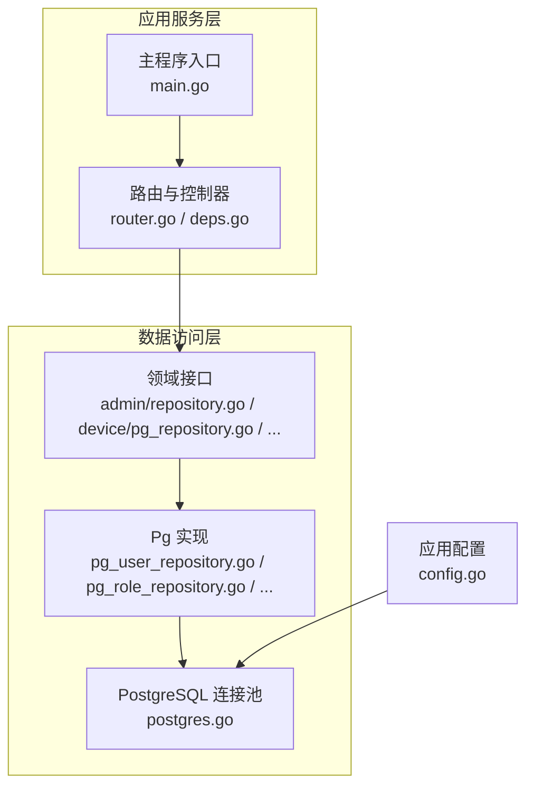
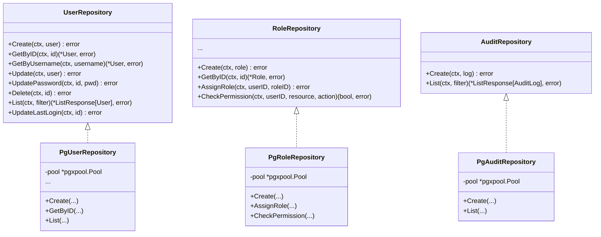
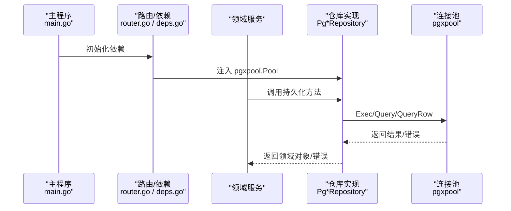

# 数据访问层

<cite>
**本文引用的文件**
- [repository.go](file://omcgo/internal/admin/repository.go)
- [pg_user_repository.go](file://omcgo/internal/admin/pg_user_repository.go)
- [pg_role_repository.go](file://omcgo/internal/admin/pg_role_repository.go)
- [pg_audit_repository.go](file://omcgo/internal/admin/pg_audit_repository.go)
- [pg_repository.go](file://omcgo/internal/device/pg_repository.go)
- [pg_param_repository.go](file://omcgo/internal/device/pg_param_repository.go)
- [pg_rule_repository.go](file://omcgo/internal/alarm/pg_rule_repository.go)
- [pg_task_repository.go](file://omcgo/internal/pm/pg_task_repository.go)
- [postgres.go](file://omcgo/internal/core/components/postgres/postgres.go)
- [config.go](file://omcgo/internal/core/appconfig/config.go)
- [router.go](file://omcgo/cmd/app/router/router.go)
- [deps.go](file://omcgo/cmd/app/router/deps.go)
- [main.go](file://omcgo/cmd/app/main.go)
- [openapi.yaml](file://omcgo/api/openapi/openapi.yaml)
</cite>

## 目录
1. [简介](#简介)
2. [项目结构](#项目结构)
3. [核心组件](#核心组件)
4. [架构总览](#架构总览)
5. [详细组件分析](#详细组件分析)
6. [依赖分析](#依赖分析)
7. [性能考虑](#性能考虑)
8. [故障排查指南](#故障排查指南)
9. [结论](#结论)
10. [附录](#附录)

## 简介
本文件面向 Baicells OMC 项目的“数据访问层”，系统性阐述基于 PostgreSQL 的 Repository 模式实现与使用方法，覆盖接口设计、具体实现类、连接池配置与最佳实践、ORM 使用策略（GORM 在本项目中未直接使用，采用原生 pgx/pqxpool 与 Squirrel 构建 SQL）、异常处理与错误传播机制、以及性能优化策略（批量操作、预加载/懒加载思想、分页与索引）。文档同时给出关键流程的时序图与类图，帮助读者快速理解并正确使用。

## 项目结构
数据访问层主要由以下部分组成：
- 接口层：各领域模块定义的 Repository 接口（如 admin、device、alarm、pm 等）
- 实现层：以 PgX 原生驱动 + pgxpool 连接池 + Squirrel 查询构建器实现的具体仓库
- 核心组件：PostgreSQL 连接池创建与健康检查
- 应用配置：PostgresConfig 从配置文件读取 DSN 与连接池参数
- 依赖注入：通过路由层的依赖装配，将连接池注入到各仓库实例

图表来源
- [router.go](file://omcgo/cmd/app/router/router.go)
- [deps.go](file://omcgo/cmd/app/router/deps.go)
- [repository.go](file://omcgo/internal/admin/repository.go)
- [pg_user_repository.go](file://omcgo/internal/admin/pg_user_repository.go)
- [postgres.go](file://omcgo/internal/core/components/postgres/postgres.go)
- [config.go](file://omcgo/internal/core/appconfig/config.go)

章节来源
- [router.go](file://omcgo/cmd/app/router/router.go)
- [deps.go](file://omcgo/cmd/app/router/deps.go)
- [repository.go](file://omcgo/internal/admin/repository.go)
- [pg_user_repository.go](file://omcgo/internal/admin/pg_user_repository.go)
- [postgres.go](file://omcgo/internal/core/components/postgres/postgres.go)
- [config.go](file://omcgo/internal/core/appconfig/config.go)

## 核心组件
- Repository 接口：定义领域持久化契约，如用户、角色、审计日志、设备、参数、告警规则、性能任务等模块的 CRUD 与查询能力
- PgX 实现：每个领域接口对应一个 PgX 实现类，内部持有 pgxpool.Pool，使用 Squirrel 构建 SQL，执行 Exec/Query/QueryRow，并进行扫描映射
- 连接池：通过 ParseConfig + NewWithConfig 创建，支持最大最小连接数、生命周期、空闲时间、健康检查周期等配置
- 错误处理：统一返回包装后的错误，结合 NotFound/Forbidden 等业务错误码，便于上层处理

章节来源
- [repository.go](file://omcgo/internal/admin/repository.go)
- [pg_user_repository.go](file://omcgo/internal/admin/pg_user_repository.go)
- [pg_role_repository.go](file://omcgo/internal/admin/pg_role_repository.go)
- [pg_audit_repository.go](file://omcgo/internal/admin/pg_audit_repository.go)
- [pg_repository.go](file://omcgo/internal/device/pg_repository.go)
- [pg_param_repository.go](file://omcgo/internal/device/pg_param_repository.go)
- [pg_rule_repository.go](file://omcgo/internal/alarm/pg_rule_repository.go)
- [pg_task_repository.go](file://omcgo/internal/pm/pg_task_repository.go)
- [postgres.go](file://omcgo/internal/core/components/postgres/postgres.go)

## 架构总览
数据访问层采用“接口隔离 + PgX 实现 + 连接池”的分层设计。所有仓库实现共享同一连接池，避免重复创建连接；通过 Squirrel 统一生成 SQL，减少手写 SQL 的出错率；在扫描阶段将数据库列映射到领域模型，必要时进行 JSON 解析或类型转换。

图表来源
- [repository.go](file://omcgo/internal/admin/repository.go)
- [pg_user_repository.go](file://omcgo/internal/admin/pg_user_repository.go)
- [pg_role_repository.go](file://omcgo/internal/admin/pg_role_repository.go)
- [pg_audit_repository.go](file://omcgo/internal/admin/pg_audit_repository.go)

## 详细组件分析

### 用户仓储（UserRepository/PgUserRepository）
- 接口职责：提供用户增删改查、按用户名获取、密码更新、登录时间更新、分页列表等能力
- 实现要点：
  - 使用 Squirrel 构建 INSERT/UPDATE/DELETE/SELECT，占位符格式为 $n
  - 批量/单条插入时自动填充 ID、时间戳
  - 更新失败返回 NotFound 错误
  - 列名映射到 User 结构体，可空字段使用指针与辅助函数转换
  - 分页与排序通过 Limit/Offset/OrderBy 实现，总数通过 COUNT(*) 计算
- 关键路径参考
  - [Create:37-63](file://omcgo/internal/admin/pg_user_repository.go#L37-L63)
  - [List:160-247](file://omcgo/internal/admin/pg_user_repository.go#L160-L247)
  - [Update:97-120](file://omcgo/internal/admin/pg_user_repository.go#L97-L120)

章节来源
- [repository.go](file://omcgo/internal/admin/repository.go)
- [pg_user_repository.go](file://omcgo/internal/admin/pg_user_repository.go)

### 角色与权限仓储（RoleRepository/PgRoleRepository）
- 接口职责：角色的增删改查、分配/移除用户角色、获取用户角色、权限的增删查、权限校验
- 实现要点：
  - 删除系统角色时进行保护，返回 Forbidden
  - 权限与角色通过 JOIN 查询，支持资源+动作的细粒度校验
  - 批量添加权限时使用多值 INSERT
  - 用户角色分配使用 ON CONFLICT DO NOTHING 避免重复
- 关键路径参考
  - [Delete:126-151](file://omcgo/internal/admin/pg_role_repository.go#L126-L151)
  - [CheckPermission:338-357](file://omcgo/internal/admin/pg_role_repository.go#L338-L357)
  - [AddPermissions:295-321](file://omcgo/internal/admin/pg_role_repository.go#L295-L321)

章节来源
- [repository.go](file://omcgo/internal/admin/repository.go)
- [pg_role_repository.go](file://omcgo/internal/admin/pg_role_repository.go)

### 审计日志仓储（AuditRepository/PgAuditRepository）
- 接口职责：审计日志的创建与分页查询
- 实现要点：
  - 支持按用户、动作、资源、时间范围过滤
  - IP/UserAgent/Resource 等可空字段使用辅助函数转换
  - 分页与排序固定按创建时间倒序
- 关键路径参考
  - [List:52-154](file://omcgo/internal/admin/pg_audit_repository.go#L52-L154)

章节来源
- [repository.go](file://omcgo/internal/admin/repository.go)
- [pg_audit_repository.go](file://omcgo/internal/admin/pg_audit_repository.go)

### 设备仓储（DeviceRepository/PgDeviceRepository）与参数仓储（DeviceParameterRepository/PgDeviceParameterRepository）
- 设备仓储：
  - JSON 字段扩展数据与最近上报事件序列化存储
  - INET 类型字段需传入 nil 而非空字符串
  - 提供按 SN 查询、状态统计、最后上报时间批量更新等能力
- 设备参数仓储：
  - 批量 Upsert 使用 ON CONFLICT 子句，避免逐条冲突
  - 使用 SendBatch + Exec 循环执行，提升吞吐
- 关键路径参考
  - [设备 Upsert:28-67](file://omcgo/internal/device/pg_repository.go#L28-L67)
  - [参数批量 Upsert:25-54](file://omcgo/internal/device/pg_param_repository.go#L25-L54)
  - [参数按设备查询:56-85](file://omcgo/internal/device/pg_param_repository.go#L56-L85)

章节来源
- [pg_repository.go](file://omcgo/internal/device/pg_repository.go)
- [pg_param_repository.go](file://omcgo/internal/device/pg_param_repository.go)

### 告警规则仓储（AlarmRuleRepository/PgAlarmRuleRepository）
- 接口职责：告警规则的增删改查、分页、条件与动作配置的 JSON 存储
- 实现要点：
  - 条件/动作配置为空时保证为合法 JSON
  - 过滤器支持运营商、制式、启用状态、告警码、条件类型
- 关键路径参考
  - [List:140-193](file://omcgo/internal/alarm/pg_rule_repository.go#L140-L193)
  - [ensureJSON:246-252](file://omcgo/internal/alarm/pg_rule_repository.go#L246-L252)

章节来源
- [pg_rule_repository.go](file://omcgo/internal/alarm/pg_rule_repository.go)

### 性能任务仓储（TaskRepository/PgTaskRepository）
- 接口职责：性能任务的创建、分页查询、状态与类型过滤
- 实现要点：
  - 默认值填充（状态、任务类型、粒度、数组字段）
  - 过滤器支持状态、任务类型
- 关键路径参考
  - [List:76-132](file://omcgo/internal/pm/pg_task_repository.go#L76-L132)

章节来源
- [pg_task_repository.go](file://omcgo/internal/pm/pg_task_repository.go)

### 事务管理
- 当前实现未显式使用事务 API；若需要跨多个仓库的原子性操作，可在调用方封装事务（例如在服务层使用 Begin/Commit/Rollback），并在仓库中接收 context 传递给 pgxpool。
- 对于批量写入（如参数 Upsert），已使用 SendBatch 提升性能，但不保证原子性；如需强一致，应结合事务。

[本节为通用指导，不直接分析特定文件]

### ORM 使用策略
- 本项目未使用 GORM；而是采用原生 pgx 驱动与 pgxpool 连接池，配合 Squirrel 构建 SQL，实现类型安全与高性能。
- 若未来引入 GORM，建议：
  - 使用连接池配置与现有 DSN 保持一致
  - 通过 Model/Association/Preload/LazyLoad 控制关联加载
  - 使用原生 SQL 或 Named Scope 处理复杂查询
  - 严格区分只读查询与写入事务，避免长事务

[本节为通用指导，不直接分析特定文件]

## 依赖分析
- 依赖注入链路：main -> router(deps) -> 各领域服务 -> 仓库 -> pgxpool
- 仓库与连接池：所有 PgX 仓库均依赖 pgxpool.Pool，避免重复创建连接
- 配置来源：PostgresConfig 从配置文件读取 DSN 与连接池参数，再交由 NewPostgresPool 创建池

图表来源
- [main.go](file://omcgo/cmd/app/main.go)
- [router.go](file://omcgo/cmd/app/router/router.go)
- [deps.go](file://omcgo/cmd/app/router/deps.go)
- [pg_user_repository.go](file://omcgo/internal/admin/pg_user_repository.go)
- [postgres.go](file://omcgo/internal/core/components/postgres/postgres.go)

章节来源
- [main.go](file://omcgo/cmd/app/main.go)
- [router.go](file://omcgo/cmd/app/router/router.go)
- [deps.go](file://omcgo/cmd/app/router/deps.go)
- [postgres.go](file://omcgo/internal/core/components/postgres/postgres.go)

## 性能考虑
- 连接池配置
  - 最小/最大连接数：根据并发请求峰值与数据库承载能力设定
  - 生命周期与空闲时间：避免连接老化导致的频繁重建
  - 健康检查周期：定期 Ping 保持连接可用
  - 参考实现：[NewPostgresPool:12-46](file://omcgo/internal/core/components/postgres/postgres.go#L12-L46)
- 批量操作
  - 参数批量 Upsert 使用 SendBatch + Exec，显著降低往返开销
  - 参考实现：[BatchUpsert:25-54](file://omcgo/internal/device/pg_param_repository.go#L25-L54)
- 预加载与懒加载
  - 本项目采用原生 SQL，可通过 JOIN 实现“预加载”（一次性拉取关联数据）
  - 对于大结果集，优先使用分页与索引，避免一次性加载过多数据
- 分页与排序
  - 固定排序列 + LIMIT/OFFSET，确保可预测的延迟
  - 参考实现：[List 分页:160-247](file://omcgo/internal/admin/pg_user_repository.go#L160-L247)
- JSON 字段
  - 扩展数据与事件序列化仅在需要时解析，避免不必要的 CPU 开销
  - 参考实现：[scanDeviceFromRow:274-300](file://omcgo/internal/device/pg_repository.go#L274-L300)

[本节提供通用指导，部分参考已在章节来源中标注]

## 故障排查指南
- 连接池问题
  - 健康检查失败：确认 DSN 正确、网络可达、数据库服务正常
  - 参考实现：[PostgresHealthCheck:48-53](file://omcgo/internal/core/components/postgres/postgres.go#L48-L53)
- 查询错误
  - SQL 构建失败：检查 Squirrel 条件拼装是否完整
  - 扫描失败：确认列名与顺序一致，可空字段使用指针
- 业务错误
  - 未找到记录：返回 NotFound 错误，上层应区分处理
  - 禁止删除系统角色：返回 Forbidden 错误
- API 层对接
  - OpenAPI 描述了对外接口，便于定位请求参数与响应结构
  - 参考：[openapi.yaml](file://omcgo/api/openapi/openapi.yaml)

章节来源
- [postgres.go](file://omcgo/internal/core/components/postgres/postgres.go)
- [pg_user_repository.go](file://omcgo/internal/admin/pg_user_repository.go)
- [pg_role_repository.go](file://omcgo/internal/admin/pg_role_repository.go)
- [openapi.yaml](file://omcgo/api/openapi/openapi.yaml)

## 结论
本项目的数据访问层以 Repository 模式为核心，结合 PgX 原生驱动与 Squirrel 查询构建器，实现了高内聚、低耦合且性能优良的数据持久化层。通过集中式的连接池配置与健康检查，保障了服务稳定性；通过批量操作与合理的分页策略，提升了吞吐与响应时间。未来如需引入 ORM，建议在现有连接池与配置基础上平滑迁移，并严格控制关联加载策略与事务边界。

## 附录
- 配置项参考
  - DSN、MaxConns、MinConns、MaxConnLifetime、MaxConnIdleTime、HealthCheckInterval
  - 参考实现：[NewPostgresPool:12-46](file://omcgo/internal/core/components/postgres/postgres.go#L12-L46)
- 依赖注入参考
  - main -> router(deps) -> 服务 -> 仓库 -> pool
  - 参考：[main.go](file://omcgo/cmd/app/main.go)、[router.go](file://omcgo/cmd/app/router/router.go)、[deps.go](file://omcgo/cmd/app/router/deps.go)