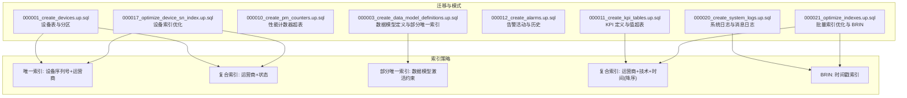
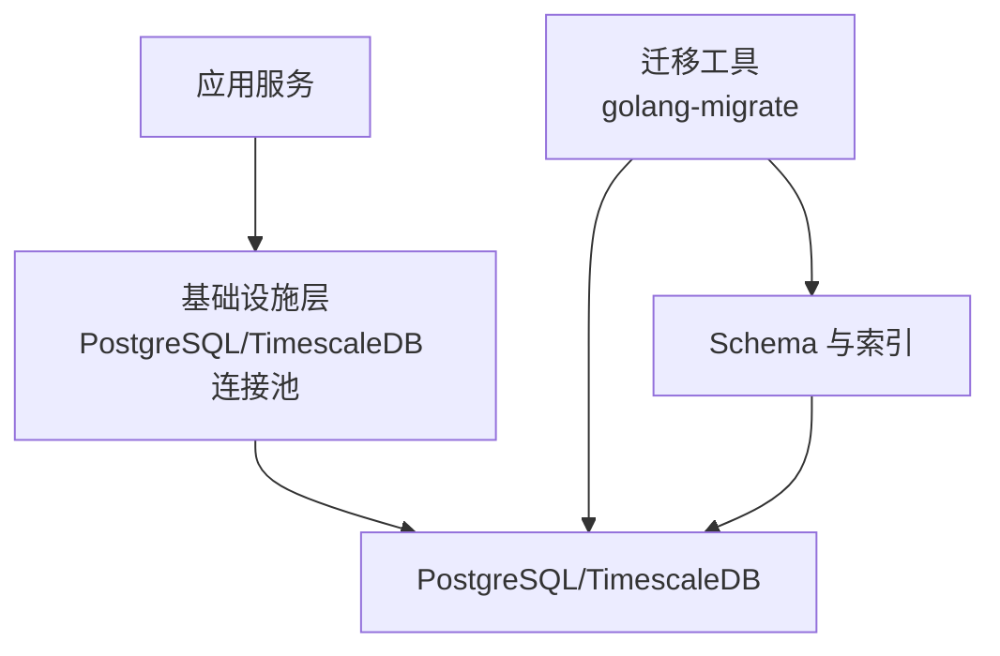
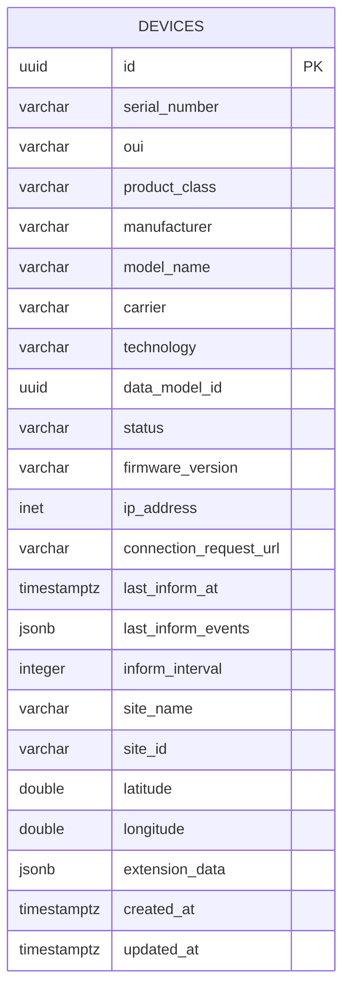
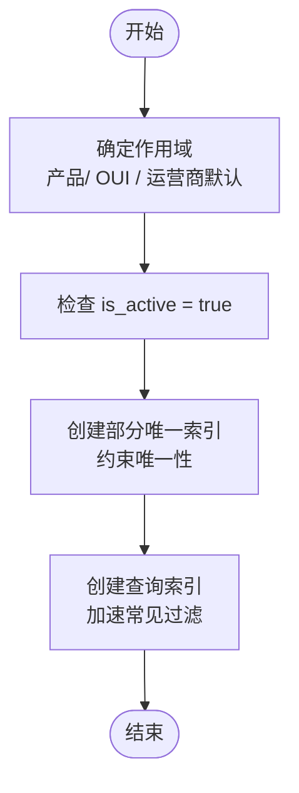
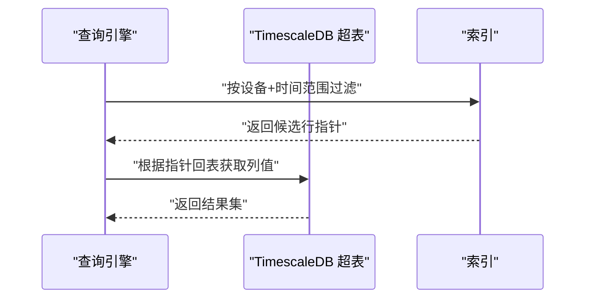
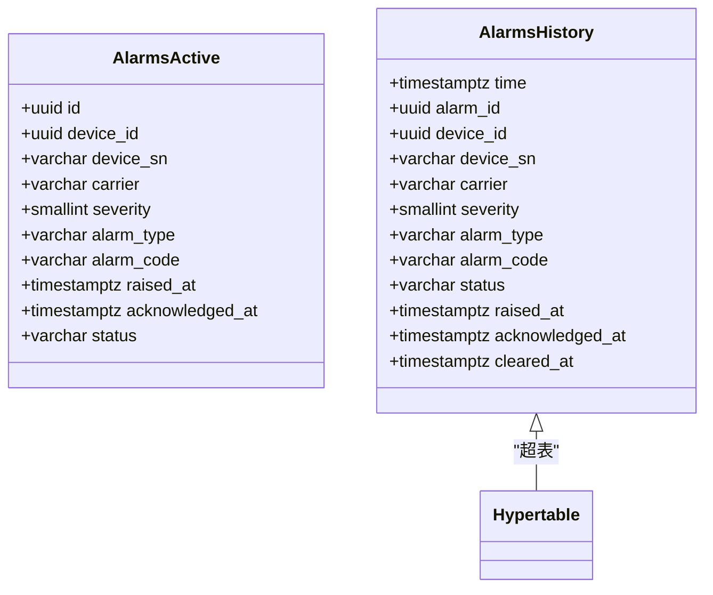
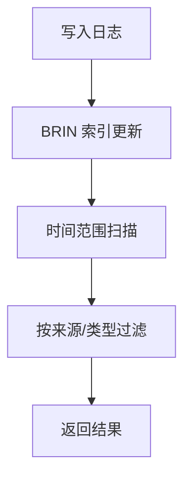
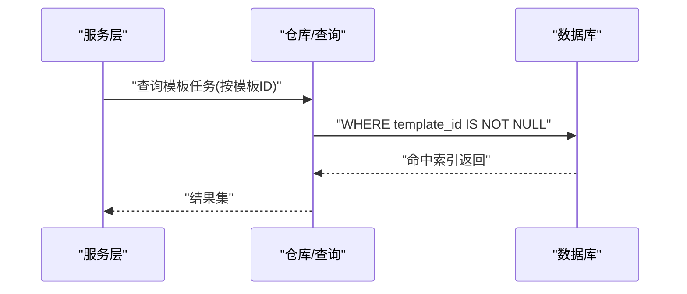
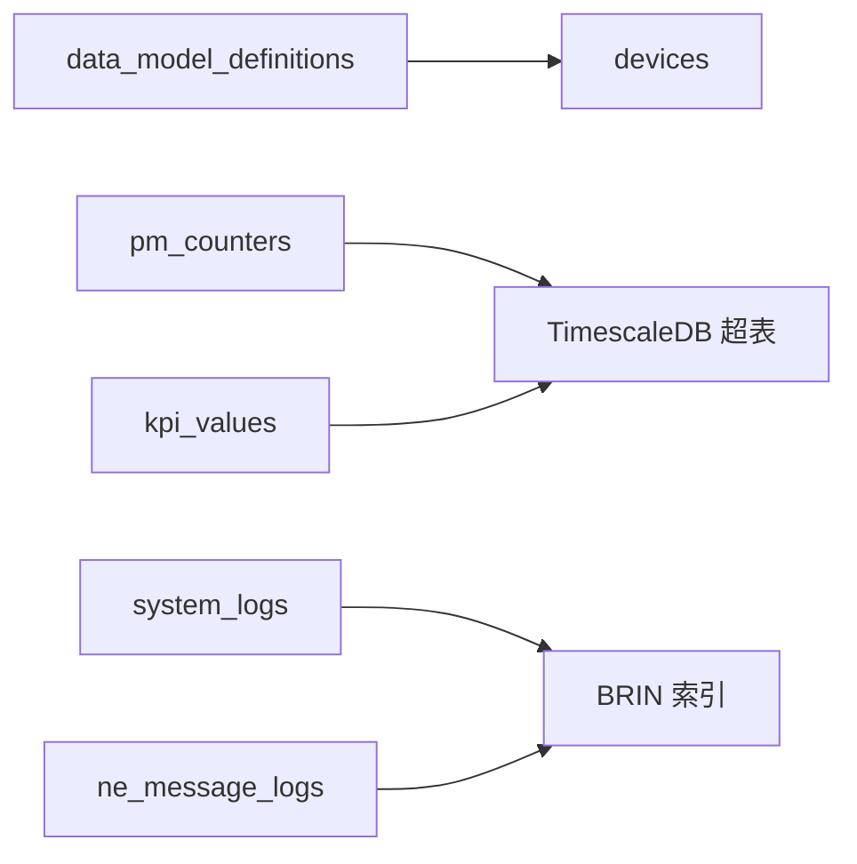

# 索引策略

<cite>
**本文引用的文件**   
- [000001_create_devices.up.sql](file://omcgo/migrations/000001_create_devices.up.sql)
- [000017_optimize_device_sn_index.up.sql](file://omcgo/migrations/000017_optimize_device_sn_index.up.sql)
- [000003_create_data_model_definitions.up.sql](file://omcgo/migrations/000003_create_data_model_definitions.up.sql)
- [000010_create_pm_counters.up.sql](file://omcgo/migrations/000010_create_pm_counters.up.sql)
- [000011_create_kpi_tables.up.sql](file://omcgo/migrations/000011_create_kpi_tables.up.sql)
- [000012_create_alarms.up.sql](file://omcgo/migrations/000012_create_alarms.up.sql)
- [000020_create_system_logs.up.sql](file://omcgo/migrations/000020_create_system_logs.up.sql)
- [000021_optimize_indexes.up.sql](file://omcgo/migrations/000021_optimize_indexes.up.sql)
- [database-migration.md](file://omcgo/docs/design/database-migration.md)
- [02-infrastructure-layer.md](file://omcgo/docs/detailed-design/02-infrastructure-layer.md)
- [00-索引.md](file://omcmb/docs/00-索引.md)
</cite>

## 目录
1. [简介](#简介)
2. [项目结构](#项目结构)
3. [核心组件](#核心组件)
4. [架构总览](#架构总览)
5. [详细组件分析](#详细组件分析)
6. [依赖分析](#依赖分析)
7. [性能考量](#性能考量)
8. [故障排查指南](#故障排查指南)
9. [结论](#结论)
10. [附录](#附录)

## 简介
本文件面向 Baicells OMC 项目的数据库索引策略，系统化阐述索引类型选择与设计原则，结合实际迁移文件中的索引实现，给出针对设备序列号查询、设备状态过滤、时间范围查询等高频场景的索引优化建议，并补充索引维护与性能监控方法、最佳实践与常见陷阱，以及分区表场景下的索引设计与维护成本分析。

## 项目结构
OMC 的数据库模式通过迁移文件逐步构建，涵盖设备、性能、KPI、告警、系统日志等核心领域。索引策略贯穿各表的建模阶段，部分表采用 TimescaleDB 超表并配合连续聚合与压缩策略，日志类表采用 BRIN 索引以降低写放大与存储占用。

**图表来源**
- [000001_create_devices.up.sql:1-55](file://omcgo/migrations/000001_create_devices.up.sql#L1-L55)
- [000017_optimize_device_sn_index.up.sql:1-7](file://omcgo/migrations/000017_optimize_device_sn_index.up.sql#L1-L7)
- [000003_create_data_model_definitions.up.sql:31-56](file://omcgo/migrations/000003_create_data_model_definitions.up.sql#L31-L56)
- [000011_create_kpi_tables.up.sql:16-36](file://omcgo/migrations/000011_create_kpi_tables.up.sql#L16-L36)
- [000020_create_system_logs.up.sql:1-29](file://omcgo/migrations/000020_create_system_logs.up.sql#L1-L29)
- [000021_optimize_indexes.up.sql:1-37](file://omcgo/migrations/000021_optimize_indexes.up.sql#L1-L37)

**章节来源**
- [database-migration.md:11-144](file://omcgo/docs/design/database-migration.md#L11-L144)

## 核心组件
- 设备表 devices：按运营商分区，包含唯一索引（序列号+运营商）与复合索引（运营商+状态），支撑设备序列号快速定位与按状态过滤。
- 数据模型定义 data_model_definitions：使用部分唯一索引保证同一分类下仅有一个激活模型，同时提供查询相关索引。
- 性能计数器 pm_counters 与 KPI 值 kpi_values：作为 TimescaleDB 超表，建立时间维度的复合索引，支持高效的时间窗口查询。
- 告警表 alarms_active/alarms_history：活动告警按设备与严重级别建立索引，历史告警按时间建立超表并配置保留策略。
- 系统日志 system_logs 与消息日志 ne_message_logs：采用 BRIN 索引覆盖时间戳，降低写放大与存储占用。
- 批量索引优化：对外键、动作、消息类型等常见过滤字段建立索引，并引入 BRIN 以适配追加写场景。

**章节来源**
- [000001_create_devices.up.sql:1-55](file://omcgo/migrations/000001_create_devices.up.sql#L1-L55)
- [000017_optimize_device_sn_index.up.sql:1-7](file://omcgo/migrations/000017_optimize_device_sn_index.up.sql#L1-L7)
- [000003_create_data_model_definitions.up.sql:31-56](file://omcgo/migrations/000003_create_data_model_definitions.up.sql#L31-L56)
- [000010_create_pm_counters.up.sql:1-28](file://omcgo/migrations/000010_create_pm_counters.up.sql#L1-L28)
- [000011_create_kpi_tables.up.sql:16-36](file://omcgo/migrations/000011_create_kpi_tables.up.sql#L16-L36)
- [000012_create_alarms.up.sql:1-53](file://omcgo/migrations/000012_create_alarms.up.sql#L1-L53)
- [000020_create_system_logs.up.sql:1-29](file://omcgo/migrations/000020_create_system_logs.up.sql#L1-L29)
- [000021_optimize_indexes.up.sql:1-37](file://omcgo/migrations/000021_optimize_indexes.up.sql#L1-L37)

## 架构总览
索引策略与数据库模式紧密耦合，迁移文件体现了“先表后索引”的演进过程。应用通过统一的基础设施层连接数据库，索引优化贯穿设备、性能、告警、日志等关键领域，满足高并发查询与长周期归档的需求。

**图表来源**
- [02-infrastructure-layer.md:35-64](file://omcgo/docs/detailed-design/02-infrastructure-layer.md#L35-L64)
- [database-migration.md:56-116](file://omcgo/docs/design/database-migration.md#L56-L116)

**章节来源**
- [02-infrastructure-layer.md:10-306](file://omcgo/docs/detailed-design/02-infrastructure-layer.md#L10-L306)
- [database-migration.md:118-144](file://omcgo/docs/design/database-migration.md#L118-L144)

## 详细组件分析

### 设备表 devices 的索引设计
- 唯一索引：设备序列号与运营商组合唯一，保障跨运营商去重与快速查找。
- 复合索引：运营商+状态，用于按运营商维度筛选设备状态。
- 适用场景：设备序列号查询、设备状态过滤、站点/区域维度的设备检索。

**图表来源**
- [000001_create_devices.up.sql:2-27](file://omcgo/migrations/000001_create_devices.up.sql#L2-L27)

**章节来源**
- [000001_create_devices.up.sql:34-41](file://omcgo/migrations/000001_create_devices.up.sql#L34-L41)
- [000017_optimize_device_sn_index.up.sql:1-7](file://omcgo/migrations/000017_optimize_device_sn_index.up.sql#L1-L7)

### 数据模型定义 data_model_definitions 的部分唯一索引
- 针对产品分类、OUI、运营商默认等不同作用域，建立部分唯一索引，确保同一作用域下仅有一个激活模型。
- 查询索引：运营商+技术、OUI（非空）、激活状态快速查找等。

**图表来源**
- [000003_create_data_model_definitions.up.sql:31-56](file://omcgo/migrations/000003_create_data_model_definitions.up.sql#L31-L56)

**章节来源**
- [000003_create_data_model_definitions.up.sql:31-56](file://omcgo/migrations/000003_create_data_model_definitions.up.sql#L31-L56)

### 性能计数器 pm_counters 与 KPI 值 kpi_values 的索引设计
- 超表：按时间分片，支持压缩与保留策略。
- 索引：设备+时间（降序）复合索引，支持按设备与时间窗口查询。
- KPI 值：设备+时间、指标名+时间等复合索引，满足聚合与筛选需求。

**图表来源**
- [000010_create_pm_counters.up.sql:12-27](file://omcgo/migrations/000010_create_pm_counters.up.sql#L12-L27)
- [000011_create_kpi_tables.up.sql:26-36](file://omcgo/migrations/000011_create_kpi_tables.up.sql#L26-L36)

**章节来源**
- [000010_create_pm_counters.up.sql:12-27](file://omcgo/migrations/000010_create_pm_counters.up.sql#L12-L27)
- [000011_create_kpi_tables.up.sql:26-36](file://omcgo/migrations/000011_create_kpi_tables.up.sql#L26-L36)

### 告警表 alarms_active/alarms_history 的索引设计
- 活动告警：设备 ID、序列号+告警码、严重级别、状态等索引，支撑实时告警查询与仪表盘聚合。
- 历史告警：超表按时间分片，配置保留策略，建立设备+时间、告警 ID+时间索引，支持历史回溯。

**图表来源**
- [000012_create_alarms.up.sql:1-53](file://omcgo/migrations/000012_create_alarms.up.sql#L1-L53)

**章节来源**
- [000012_create_alarms.up.sql:20-24](file://omcgo/migrations/000012_create_alarms.up.sql#L20-L24)
- [000012_create_alarms.up.sql:51-52](file://omcgo/migrations/000012_create_alarms.up.sql#L51-L52)

### 系统日志与消息日志的 BRIN 索引
- 系统日志与消息日志均为追加写场景，采用 BRIN 索引覆盖时间戳，显著降低写放大与存储占用。
- 适用于时间范围扫描、按来源/类型过滤等查询模式。

**图表来源**
- [000020_create_system_logs.up.sql:11-13](file://omcgo/migrations/000020_create_system_logs.up.sql#L11-L13)
- [000021_optimize_indexes.up.sql:25-36](file://omcgo/migrations/000021_optimize_indexes.up.sql#L25-L36)

**章节来源**
- [000020_create_system_logs.up.sql:11-13](file://omcgo/migrations/000020_create_system_logs.up.sql#L11-L13)
- [000021_optimize_indexes.up.sql:25-36](file://omcgo/migrations/000021_optimize_indexes.up.sql#L25-L36)

### 批量索引优化与外键/过滤字段
- 外键索引：provisioning_tasks 的 template_id 非空索引，提升连接性能。
- 过滤字段：用户角色的 role_id、审计日志的 action、消息日志的消息类型等。
- 复合索引：kpi_values 的运营商+技术+时间（降序），alarms_active 的运营商+严重级别。

**图表来源**
- [000021_optimize_indexes.up.sql:3-5](file://omcgo/migrations/000021_optimize_indexes.up.sql#L3-L5)

**章节来源**
- [000021_optimize_indexes.up.sql:1-37](file://omcgo/migrations/000021_optimize_indexes.up.sql#L1-L37)

## 依赖分析
- 设备表 devices 与数据模型定义 data_model_definitions：devices 的 data_model_id 引用 data_model_definitions 的主键，需在外键列建立索引以优化连接与级联删除。
- 性能与 KPI 表：依赖 TimescaleDB 扩展，索引与压缩/保留策略协同工作。
- 日志表：BRIN 索引与时间范围查询高度契合，减少索引维护成本。

**图表来源**
- [000001_create_devices.up.sql:82-82](file://omcgo/migrations/000001_create_devices.up.sql#L82-L82)
- [000010_create_pm_counters.up.sql:13-24](file://omcgo/migrations/000010_create_pm_counters.up.sql#L13-L24)
- [000011_create_kpi_tables.up.sql:26-32](file://omcgo/migrations/000011_create_kpi_tables.up.sql#L26-L32)
- [000020_create_system_logs.up.sql:11-13](file://omcgo/migrations/000020_create_system_logs.up.sql#L11-L13)

**章节来源**
- [000001_create_devices.up.sql:82-82](file://omcgo/migrations/000001_create_devices.up.sql#L82-L82)
- [000010_create_pm_counters.up.sql:13-24](file://omcgo/migrations/000010_create_pm_counters.up.sql#L13-L24)
- [000011_create_kpi_tables.up.sql:26-32](file://omcgo/migrations/000011_create_kpi_tables.up.sql#L26-L32)
- [000020_create_system_logs.up.sql:11-13](file://omcgo/migrations/000020_create_system_logs.up.sql#L11-L13)

## 性能考量
- 写放大控制：日志类表采用 BRIN 索引，降低索引维护成本；超表启用压缩与保留策略，减少冷数据占用。
- 查询路径优化：针对热点查询建立复合索引，确保最左前缀匹配；对时间字段建立降序索引以支持时间窗口扫描。
- 维护成本：分区表与超表的索引维护需结合数据分布与查询模式评估；定期审查未使用索引，避免冗余。

[本节为通用指导，无需具体文件来源]

## 故障排查指南
- 迁移失败（脏状态）：通过强制设置版本号回退至上一个成功版本，修复后再执行迁移。
- 容器启动失败：查看容器日志定位迁移错误，确认数据库可达与凭据正确。
- 连接池与健康检查：通过基础设施层的健康检查接口确认数据库连接状态。

**章节来源**
- [database-migration.md:226-256](file://omcgo/docs/design/database-migration.md#L226-L256)
- [02-infrastructure-layer.md:150-194](file://omcgo/docs/detailed-design/02-infrastructure-layer.md#L150-L194)

## 结论
OMC 的索引策略围绕高频查询与数据生命周期进行设计：设备表通过唯一与复合索引保障序列号与状态查询效率；数据模型定义通过部分唯一索引确保业务一致性；性能与 KPI 表借助超表与索引实现时间窗口高效查询；日志表采用 BRIN 索引平衡写入与查询成本。整体策略兼顾查询性能、维护成本与可扩展性，适合大规模设备与海量时序数据场景。

[本节为总结，无需具体文件来源]

## 附录

### 索引类型与设计原则
- 唯一索引：用于保证业务唯一性与快速查找，如设备序列号+运营商。
- 复合索引：按查询最左前缀设计，优先覆盖高频过滤字段与时间字段。
- 部分索引：限定激活状态或特定作用域，确保唯一性约束在业务上下文中成立。
- BRIN 索引：适用于追加写且时间范围扫描为主的日志类表。

**章节来源**
- [000001_create_devices.up.sql:34-41](file://omcgo/migrations/000001_create_devices.up.sql#L34-L41)
- [000003_create_data_model_definitions.up.sql:31-56](file://omcgo/migrations/000003_create_data_model_definitions.up.sql#L31-L56)
- [000020_create_system_logs.up.sql:11-13](file://omcgo/migrations/000020_create_system_logs.up.sql#L11-L13)

### 核心查询模式与索引映射
- 设备序列号查询：devices 上的唯一索引（序列号+运营商）。
- 设备状态过滤：devices 上的复合索引（运营商+状态）。
- 时间范围查询：pm_counters/kpi_values 的设备+时间（降序）复合索引。
- 告警查询：alarms_active 的设备/序列号/严重级别/状态索引；alarms_history 的设备+时间索引。
- 日志查询：system_logs/ne_message_logs 的时间戳索引与来源/类型过滤索引。

**章节来源**
- [000017_optimize_device_sn_index.up.sql:1-7](file://omcgo/migrations/000017_optimize_device_sn_index.up.sql#L1-L7)
- [000010_create_pm_counters.up.sql:26-27](file://omcgo/migrations/000010_create_pm_counters.up.sql#L26-L27)
- [000011_create_kpi_tables.up.sql:34-35](file://omcgo/migrations/000011_create_kpi_tables.up.sql#L34-L35)
- [000012_create_alarms.up.sql:20-24](file://omcgo/migrations/000012_create_alarms.up.sql#L20-L24)
- [000012_create_alarms.up.sql:51-52](file://omcgo/migrations/000012_create_alarms.up.sql#L51-L52)
- [000020_create_system_logs.up.sql:11-13](file://omcgo/migrations/000020_create_system_logs.up.sql#L11-L13)
- [000021_optimize_indexes.up.sql:19-23](file://omcgo/migrations/000021_optimize_indexes.up.sql#L19-L23)

### 索引维护策略与性能监控
- 维护策略：定期评估索引选择性与使用率，清理未使用索引；对超表与分区表的索引维护结合数据分布与查询模式。
- 性能监控：通过数据库内置统计与查询计划分析索引命中情况；关注慢查询与高 IO 的查询路径。

**章节来源**
- [database-migration.md:148-223](file://omcgo/docs/design/database-migration.md#L148-L223)

### 最佳实践与常见陷阱
- 最佳实践：先识别查询模式再设计索引；时间字段优先降序索引；对热点过滤字段建立复合索引；日志类表优先考虑 BRIN。
- 常见陷阱：过度索引导致写入性能下降；索引失效于函数运算或隐式转换；忽略分区/超表的索引约束与维护成本。

**章节来源**
- [000021_optimize_indexes.up.sql:25-36](file://omcgo/migrations/000021_optimize_indexes.up.sql#L25-L36)

### 分区表与超表的索引设计
- 分区表：索引通常在父表层面创建，但需结合分区键与查询模式；设备表按运营商分区，索引设计需考虑分区键的使用。
- 超表：索引与分片键协同，时间字段优先；压缩与保留策略影响索引维护与查询代价。

**章节来源**
- [000001_create_devices.up.sql:27-32](file://omcgo/migrations/000001_create_devices.up.sql#L27-L32)
- [000010_create_pm_counters.up.sql:13-24](file://omcgo/migrations/000010_create_pm_counters.up.sql#L13-L24)
- [000011_create_kpi_tables.up.sql:26-32](file://omcgo/migrations/000011_create_kpi_tables.up.sql#L26-L32)