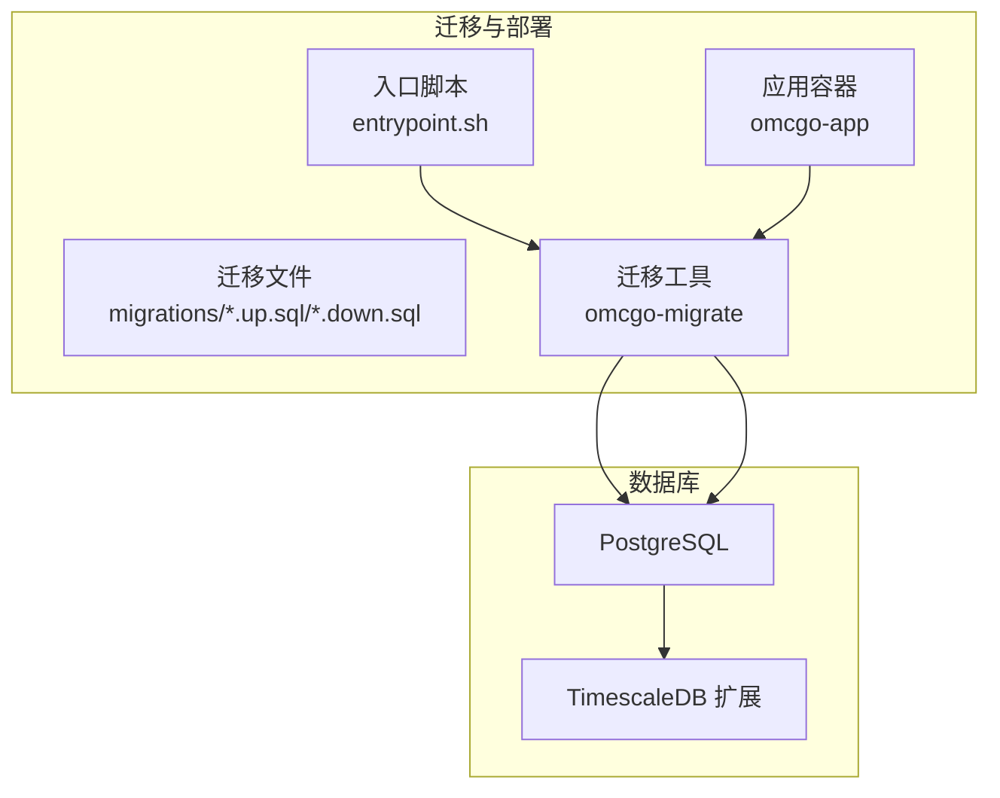
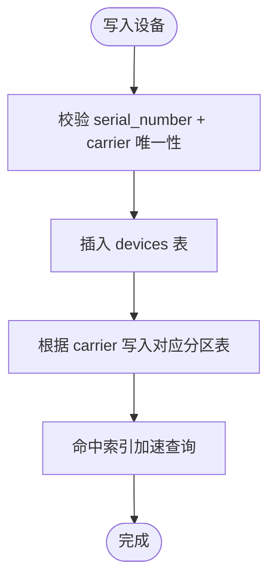
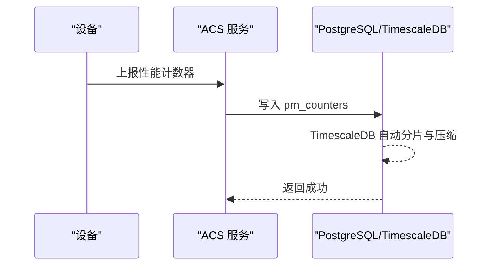
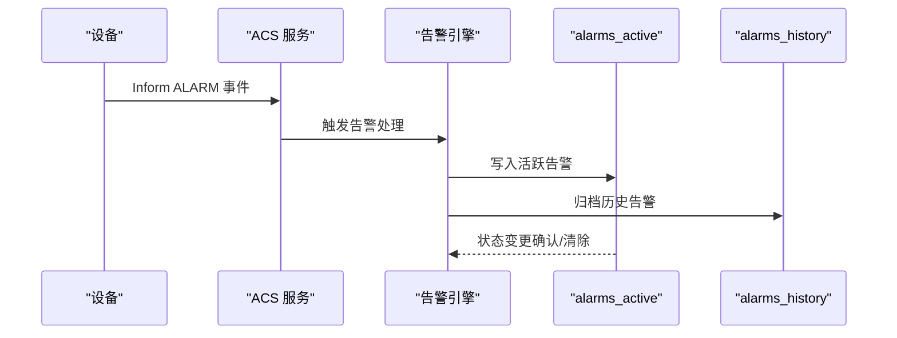
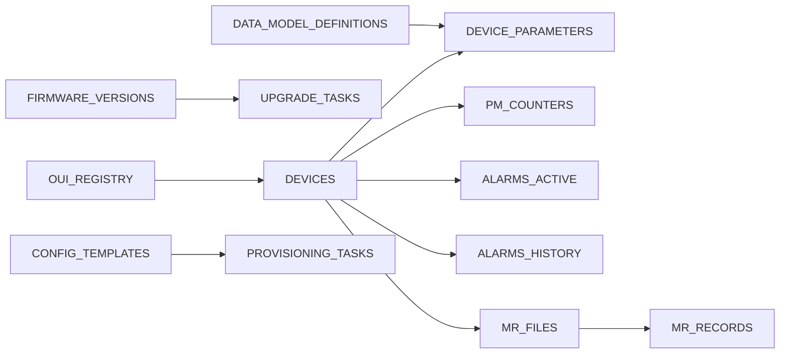

# 表结构设计

<cite>
**本文引用的文件**
- [000001_create_devices.up.sql](file://omcgo/migrations/000001_create_devices.up.sql)
- [000002_create_device_parameters.up.sql](file://omcgo/migrations/000002_create_device_parameters.up.sql)
- [000003_create_data_model_definitions.up.sql](file://omcgo/migrations/000003_create_data_model_definitions.up.sql)
- [000004_create_oui_registry.up.sql](file://omcgo/migrations/000004_create_oui_registry.up.sql)
- [000006_create_config_templates.up.sql](file://omcgo/migrations/000006_create_config_templates.up.sql)
- [000007_create_provisioning_tasks.up.sql](file://omcgo/migrations/000007_create_provisioning_tasks.up.sql)
- [000010_create_pm_counters.up.sql](file://omcgo/migrations/000010_create_pm_counters.up.sql)
- [000011_create_kpi_tables.up.sql](file://omcgo/migrations/000011_create_kpi_tables.up.sql)
- [000012_create_alarms.up.sql](file://omcgo/migrations/000012_create_alarms.up.sql)
- [000013_create_mr_tables.up.sql](file://omcgo/migrations/000013_create_mr_tables.up.sql)
- [000016_create_firmware.up.sql](file://omcgo/migrations/000016_create_firmware.up.sql)
- [000018_create_alarm_rules.up.sql](file://omcgo/migrations/000018_create_alarm_rules.up.sql)
- [000019_create_kpi_thresholds.up.sql](file://omcgo/migrations/000019_create_kpi_thresholds.up.sql)
- [database-migration.md](file://omcgo/docs/design/database-migration.md)
- [03-common-domain-models.md](file://omcgo/docs/detailed-design/03-common-domain-models.md)
- [05-carrier-abstraction.md](file://omcgo/docs/detailed-design/05-carrier-abstraction.md)
- [12-alarm-management.md](file://omcgo/docs/detailed-design/12-alarm-management.md)
- [13-measurement-reports.md](file://omcgo/docs/detailed-design/13-measurement-reports.md)
</cite>

## 目录
1. [简介](#简介)
2. [项目结构](#项目结构)
3. [核心组件](#核心组件)
4. [架构总览](#架构总览)
5. [详细组件分析](#详细组件分析)
6. [依赖分析](#依赖分析)
7. [性能考量](#性能考量)
8. [故障排查指南](#故障排查指南)
9. [结论](#结论)
10. [附录](#附录)

## 简介
本文件面向 Baicells OMC 项目的表结构设计，聚焦于核心业务表的主键设计、外键关系、字段约束与业务含义，并结合分区表策略（尤其是设备表按运营商分区）进行深入说明。同时提供 ER 图与字段详细说明，解释数据类型选择理由与取值范围限制，帮助开发者与运维人员准确理解与使用数据库结构。

## 项目结构
OMC 的数据库结构通过迁移文件逐步构建，采用 golang-migrate 管理版本，Docker Compose 启动时自动执行迁移，确保数据库 Schema 与代码版本一致。迁移文件位于 migrations/ 目录，按编号顺序执行，涵盖设备、参数、数据模型、性能、告警、MR、固件、规则与阈值等关键表。



图表来源
- [database-migration.md:120-144](file://omcgo/docs/design/database-migration.md#L120-L144)

章节来源
- [database-migration.md:1-268](file://omcgo/docs/design/database-migration.md#L1-L268)

## 核心组件
本节概述本次文档关注的核心业务表及其职责：
- 设备表 devices：按运营商分区，存储设备基本信息、状态与位置等。
- 设备参数表 device_parameters：存储每台设备的 TR069 参数键值。
- 数据模型表 data_model_definitions：存储 TR069 参数树定义及版本控制。
- 性能计数器表 pm_counters：高频性能数据，采用 TimescaleDB 超表。
- 告警表 alarms_active/alarms_history：活跃与历史告警，历史表为 TimescaleDB 超表。
- MR 表 mr_files/mr_records：MR 文件元数据与解析后的记录，记录表为 TimescaleDB 超表。
- 固件表 firmware_versions/upgrade_tasks：固件版本与升级任务。
- 告警规则表 alarm_rules：可配置的告警规则。
- KPI 阈值表 kpi_thresholds：可配置的 KPI 阈值。

章节来源
- [000001_create_devices.up.sql:1-55](file://omcgo/migrations/000001_create_devices.up.sql#L1-L55)
- [000002_create_device_parameters.up.sql:1-13](file://omcgo/migrations/000002_create_device_parameters.up.sql#L1-L13)
- [000003_create_data_model_definitions.up.sql:1-57](file://omcgo/migrations/000003_create_data_model_definitions.up.sql#L1-L57)
- [000010_create_pm_counters.up.sql:1-28](file://omcgo/migrations/000010_create_pm_counters.up.sql#L1-L28)
- [000012_create_alarms.up.sql:1-53](file://omcgo/migrations/000012_create_alarms.up.sql#L1-L53)
- [000013_create_mr_tables.up.sql:1-49](file://omcgo/migrations/000013_create_mr_tables.up.sql#L1-L49)
- [000016_create_firmware.up.sql:1-51](file://omcgo/migrations/000016_create_firmware.up.sql#L1-L51)
- [000018_create_alarm_rules.up.sql:1-27](file://omcgo/migrations/000018_create_alarm_rules.up.sql#L1-L27)
- [000019_create_kpi_thresholds.up.sql:1-26](file://omcgo/migrations/000019_create_kpi_thresholds.up.sql#L1-L26)

## 架构总览
下图展示核心业务表之间的关系与依赖，突出设备表的分区设计以及与参数、数据模型、性能、告警、MR、固件、规则与阈值的关联。

```mermaid
erDiagram
DEVICES {
uuid id PK
varchar serial_number
varchar oui
varchar product_class
varchar manufacturer
varchar model_name
varchar carrier
varchar technology
uuid data_model_id
varchar status
varchar firmware_version
inet ip_address
varchar connection_request_url
timestamptz last_inform_at
jsonb last_inform_events
integer inform_interval
varchar site_name
varchar site_id
double latitude
double longitude
jsonb extension_data
timestamptz created_at
timestamptz updated_at
}
DEVICE_PARAMETERS {
uuid device_id PK
varchar parameter_path PK
text parameter_value
varchar parameter_type
boolean writable
timestamptz last_updated_at
}
DATA_MODEL_DEFINITIONS {
uuid id PK
varchar carrier
varchar technology
varchar version
varchar oui
varchar product_class
varchar scope
varchar status
boolean is_active
varchar root_object
jsonb parameter_tree
varchar source
varchar imported_by
varchar spec_document_ref
text description
timestamptz created_at
timestamptz updated_at
}
PM_COUNTERS {
timestamptz time PK
uuid device_id PK
varchar cell_id
varchar counter_group
varchar counter_name
double precision counter_value
smallint granularity
}
ALARMS_ACTIVE {
uuid id PK
uuid device_id
varchar device_sn
varchar carrier
smallint severity
varchar alarm_type
varchar alarm_code
text description
varchar status
timestamptz raised_at
timestamptz acknowledged_at
varchar acknowledged_by
jsonb additional_info
timestamptz created_at
timestamptz updated_at
}
ALARMS_HISTORY {
timestamptz time PK
uuid alarm_id PK
uuid device_id
varchar device_sn
varchar carrier
smallint severity
varchar alarm_type
varchar alarm_code
text description
varchar status
timestamptz raised_at
timestamptz acknowledged_at
timestamptz cleared_at
}
MR_FILES {
uuid id PK
uuid device_id
varchar device_sn
varchar carrier
varchar mr_type
varchar file_name
bigint file_size
timestamptz collect_time
varchar minio_path
boolean parsed
timestamptz parsed_at
int record_count
timestamptz created_at
}
MR_RECORDS {
timestamptz time PK
uuid file_id PK
uuid device_id
varchar cell_id
varchar mr_type
jsonb measurement_data
}
FIRMWARE_VERSIONS {
uuid id PK
varchar carrier
varchar product_class
varchar version
varchar file_name
bigint file_size
varchar minio_path
jsonb compatible_oui
text release_notes
varchar status
timestamptz created_at
timestamptz updated_at
}
UPGRADE_TASKS {
uuid id PK
uuid device_id
uuid firmware_id FK
uuid batch_id
varchar status
text error_message
integer retry_count
integer max_retries
timestamptz started_at
timestamptz completed_at
timestamptz created_at
timestamptz updated_at
}
ALARM_RULES {
uuid id PK
varchar name
text description
varchar alarm_code
integer severity
varchar condition_type
jsonb condition_config
varchar action_type
jsonb action_config
varchar carrier
varchar technology
boolean enabled
timestamptz created_at
timestamptz updated_at
}
KPI_THRESHOLDS {
uuid id PK
varchar kpi_name
varchar carrier
varchar technology
double precision warning_threshold
double precision minor_threshold
double precision major_threshold
double precision critical_threshold
varchar comparison
boolean enabled
text description
timestamptz created_at
timestamptz updated_at
}
DEVICES ||--o{ DEVICE_PARAMETERS : "拥有"
DEVICES ||--o{ PM_COUNTERS : "产生"
DEVICES ||--o{ ALARMS_ACTIVE : "触发"
DEVICES ||--o{ ALARMS_HISTORY : "历史关联"
DEVICES ||--o{ MR_FILES : "上传"
MR_FILES ||--o{ MR_RECORDS : "解析"
FIRMWARE_VERSIONS ||--o{ UPGRADE_TASKS : "被升级"
```

图表来源
- [000001_create_devices.up.sql:1-55](file://omcgo/migrations/000001_create_devices.up.sql#L1-L55)
- [000002_create_device_parameters.up.sql:1-13](file://omcgo/migrations/000002_create_device_parameters.up.sql#L1-L13)
- [000003_create_data_model_definitions.up.sql:1-57](file://omcgo/migrations/000003_create_data_model_definitions.up.sql#L1-L57)
- [000010_create_pm_counters.up.sql:1-28](file://omcgo/migrations/000010_create_pm_counters.up.sql#L1-L28)
- [000012_create_alarms.up.sql:1-53](file://omcgo/migrations/000012_create_alarms.up.sql#L1-L53)
- [000013_create_mr_tables.up.sql:1-49](file://omcgo/migrations/000013_create_mr_tables.up.sql#L1-L49)
- [000016_create_firmware.up.sql:1-51](file://omcgo/migrations/000016_create_firmware.up.sql#L1-L51)
- [000018_create_alarm_rules.up.sql:1-27](file://omcgo/migrations/000018_create_alarm_rules.up.sql#L1-L27)
- [000019_create_kpi_thresholds.up.sql:1-26](file://omcgo/migrations/000019_create_kpi_thresholds.up.sql#L1-L26)

## 详细组件分析

### 设备表 devices（按运营商分区）
- 主键设计：复合主键 (id, carrier)，确保同一设备在不同运营商分区内的唯一性。
- 分区策略：按 carrier 使用 LIST 分区，创建 cmcc/ctcc/cucc 三个分区表，实现数据隔离与查询性能优化。
- 字段约束与业务含义：
  - serial_number：设备序列号，联合唯一索引包含 carrier，保证同一运营商内唯一。
  - oui、product_class、manufacturer、model_name：设备厂商与型号信息，便于参数映射与兼容性管理。
  - carrier、technology：运营商与无线制式，支撑多运营商与多制式场景。
  - status：设备状态，配合 inform 事件与自动状态机流转。
  - firmware_version、ip_address、connection_request_url：设备连接与版本信息。
  - last_inform_at/last_inform_events：设备上报时间与事件，用于心跳与异常检测。
  - inform_interval：上报周期，默认 300 秒。
  - site_name/site_id/latitude/longitude：站点信息与地理坐标。
  - extension_data：扩展字段，存储非结构化配置或临时数据。
  - created_at/updated_at：时间戳，统一使用 timestamptz 并带默认值。
- 索引：
  - 唯一索引：(serial_number, carrier)
  - 常用查询索引：(carrier, status)、(oui)、(carrier, technology)、(status)、(last_inform_at)
- 触发器：更新时自动更新 updated_at。



图表来源
- [000001_create_devices.up.sql:29-41](file://omcgo/migrations/000001_create_devices.up.sql#L29-L41)

章节来源
- [000001_create_devices.up.sql:1-55](file://omcgo/migrations/000001_create_devices.up.sql#L1-L55)
- [03-common-domain-models.md:81-109](file://omcgo/docs/detailed-design/03-common-domain-models.md#L81-L109)
- [05-carrier-abstraction.md:188-201](file://omcgo/docs/detailed-design/05-carrier-abstraction.md#L188-L201)

### 设备参数表 device_parameters
- 主键设计：复合主键 (device_id, parameter_path)，保证同一设备的参数路径唯一。
- 字段约束与业务含义：
  - parameter_path：TR069 参数路径，作为参数键。
  - parameter_value：参数值，TEXT 类型支持任意长度字符串。
  - parameter_type：参数类型，如 string/int/boolean 等，便于类型校验与展示。
  - writable：是否可写，用于参数下发策略。
  - last_updated_at：参数最后更新时间。
- 索引：(device_id) 用于按设备批量查询。

章节来源
- [000002_create_device_parameters.up.sql:1-13](file://omcgo/migrations/000002_create_device_parameters.up.sql#L1-L13)
- [03-common-domain-models.md:130-151](file://omcgo/docs/detailed-design/03-common-domain-models.md#L130-L151)

### 数据模型表 data_model_definitions
- 主键设计：id（UUID），统一与其他表保持一致。
- 字段约束与业务含义：
  - carrier、technology、version：模型归属与版本标识。
  - oui、product_class：支持按产品维度的模型定义。
  - scope：作用域，支持 product/oui/carrier_default 三类，通过约束保证字段组合合法性。
  - status：draft/active/deprecated，配合 is_active 控制生效状态。
  - is_active：布尔标志，唯一激活模型的判定依据。
  - root_object：参数树根节点，默认 “Device.”。
  - parameter_tree：JSONB 存储参数树，支持复杂嵌套结构。
  - source/imported_by/spec_document_ref/description：来源与说明信息。
  - created_at/updated_at：时间戳。
- 索引：
  - 唯一索引：针对 scope=product/oui/carrier_default 的唯一激活模型。
  - 查询索引：(carrier, technology)、(oui)、(status)、激活模型专用索引。
- 触发器：更新时自动更新 updated_at。

章节来源
- [000003_create_data_model_definitions.up.sql:1-57](file://omcgo/migrations/000003_create_data_model_definitions.up.sql#L1-L57)
- [03-common-domain-models.md:28-79](file://omcgo/docs/detailed-design/03-common-domain-models.md#L28-L79)

### OUI 注册表 oui_registry
- 主键设计：oui（VARCHAR(6)），映射厂商短名与国家。
- 字段约束与业务含义：
  - manufacturer/short_name/country：厂商全称、简称与国家。
  - created_at：创建时间。
- 索引：(short_name) 便于快速查找。
- 种子数据：内置主要设备厂商的 OUI 映射。

章节来源
- [000004_create_oui_registry.up.sql:1-24](file://omcgo/migrations/000004_create_oui_registry.up.sql#L1-L24)

### 配置模板表 config_templates
- 主键设计：id（UUID）。
- 字段约束与业务含义：
  - name、carrier、technology、product_class：模板匹配条件。
  - template_type：provisioning/batch_config/firmware_upgrade，限定模板用途。
  - parameters：JSONB 存储模板参数。
  - priority/version/active：优先级、版本与启用状态。
  - description：描述信息。
  - created_at/updated_at：时间戳。
- 索引：(carrier, technology)、(template_type)、(active=true) 的部分索引、(carrier, technology, product_class, template_type) 的匹配索引。

章节来源
- [000006_create_config_templates.up.sql:1-31](file://omcgo/migrations/000006_create_config_templates.up.sql#L1-L31)

### 自动开站任务表 provisioning_tasks
- 主键设计：id（UUID）。
- 字段约束与业务含义：
  - device_id/template_id：关联设备与模板。
  - status：discovered/identifying/matching/configuring/verifying/completed/failed。
  - current_step/total_steps：步骤进度。
  - error_message/retry_count/max_retries：错误与重试控制。
  - started_at/completed_at：生命周期时间点。
  - created_at/updated_at：时间戳。
- 索引：(device_id)、(status)、(device_id, status)、(created_at DESC)。

章节来源
- [000007_create_provisioning_tasks.up.sql:1-30](file://omcgo/migrations/000007_create_provisioning_tasks.up.sql#L1-L30)

### 性能计数器表 pm_counters（TimescaleDB 超表）
- 主键设计：复合主键 (time, device_id)，并按 time 分片。
- 字段约束与业务含义：
  - device_id：所属设备。
  - cell_id/counter_group/counter_name：计数器分组与名称。
  - counter_value：数值，DOUBLE PRECISION。
  - granularity：粒度（分钟），默认 15。
- TimescaleDB 配置：
  - 超表：按 time 分片，chunk_time_interval=1 天。
  - 压缩：开启压缩，segmentby=device_id,cell_id,counter_group,counter_name。
  - 策略：压缩策略 7 天，保留策略 90 天。
- 索引：(device_id, time DESC)、(counter_group, counter_name, time DESC)。



图表来源
- [000010_create_pm_counters.up.sql:12-28](file://omcgo/migrations/000010_create_pm_counters.up.sql#L12-L28)

章节来源
- [000010_create_pm_counters.up.sql:1-28](file://omcgo/migrations/000010_create_pm_counters.up.sql#L1-L28)

### KPI 定义与值表（kpi_definitions、kpi_values）
- kpi_definitions：
  - 主键：id（UUID），name 唯一。
  - 字段：display_name/formula/unit/category/counters 等。
  - carrier/technology：可选限定。
- kpi_values：
  - 主键：(time, device_id)。
  - 字段：device_id/cell_id/kpi_name/kpi_value/carrier/technology。
  - TimescaleDB：按 time 分片（1 天）。
  - 索引：(device_id, time DESC)、(kpi_name, time DESC)。

章节来源
- [000011_create_kpi_tables.up.sql:1-56](file://omcgo/migrations/000011_create_kpi_tables.up.sql#L1-L56)

### 告警表（alarms_active、alarms_history）
- alarms_active：
  - 主键：id（UUID）。
  - 字段：device_id/device_sn/carrier/severity/alarm_type/alarm_code/description/status/raised_at/acknowledged_at/acknowledged_by/additional_info。
  - 索引：(device_id)、(device_sn, alarm_code)、(severity)、(status)。
- alarms_history：
  - 主键：(time, alarm_id)。
  - TimescaleDB：按 time 分片（7 天），保留策略 365 天。
  - 索引：(device_id, time DESC)、(alarm_id, time DESC)。



图表来源
- [000012_create_alarms.up.sql:25-53](file://omcgo/migrations/000012_create_alarms.up.sql#L25-L53)
- [12-alarm-management.md:18-26](file://omcgo/docs/detailed-design/12-alarm-management.md#L18-L26)

章节来源
- [000012_create_alarms.up.sql:1-53](file://omcgo/migrations/000012_create_alarms.up.sql#L1-L53)
- [12-alarm-management.md:119-157](file://omcgo/docs/detailed-design/12-alarm-management.md#L119-L157)

### MR 表（mr_files、mr_records）
- mr_files：
  - 主键：id（UUID）。
  - 字段：device_id/device_sn/carrier/mr_type/file_name/file_size/minio_path/parsed/parsed_at/record_count。
  - 索引：(device_id, collect_time DESC)、(mr_type)、(carrier)。
- mr_records：
  - 主键：(time, file_id)。
  - TimescaleDB：按 time 分片（1 天），压缩 segmentby=device_id,file_id,mr_type。
  - 索引：(device_id, time DESC)、(file_id)、(mr_type, time DESC)。

章节来源
- [000013_create_mr_tables.up.sql:1-49](file://omcgo/migrations/000013_create_mr_tables.up.sql#L1-L49)
- [13-measurement-reports.md:113-129](file://omcgo/docs/detailed-design/13-measurement-reports.md#L113-L129)

### 固件表（firmware_versions、upgrade_tasks）
- firmware_versions：
  - 主键：id（UUID）。
  - 字段：carrier/product_class/version/file_name/file_size/minio_path/compatible_oui/release_notes/status。
  - 索引：(carrier)、(carrier, product_class)、(carrier, product_class, version) 唯一。
- upgrade_tasks：
  - 主键：id（UUID）。
  - 外键：firmware_id 引用 firmware_versions(id)。
  - 字段：device_id/firmware_id/batch_id/status/error_message/retry_count/max_retries/started_at/completed_at。
  - 索引：(device_id)、(firmware_id)、(batch_id)、(status)。

章节来源
- [000016_create_firmware.up.sql:1-51](file://omcgo/migrations/000016_create_firmware.up.sql#L1-L51)

### 告警规则表 alarm_rules
- 主键：id（UUID）。
- 字段：name/description/alarm_code/severity/condition_type/condition_config/action_type/action_config/carrier/technology/enabled。
- 索引：(carrier)、(enabled)、(alarm_code)。

章节来源
- [000018_create_alarm_rules.up.sql:1-27](file://omcgo/migrations/000018_create_alarm_rules.up.sql#L1-L27)

### KPI 阈值表 kpi_thresholds
- 主键：id（UUID）。
- 字段：kpi_name/carrier/technology/warning_threshold/minor_threshold/major_threshold/critical_threshold/comparison/enabled/description。
- 索引：(kpi_name)、(carrier)、(enabled)。

章节来源
- [000019_create_kpi_thresholds.up.sql:1-26](file://omcgo/migrations/000019_create_kpi_thresholds.up.sql#L1-L26)

## 依赖分析
- 设备表 devices 是核心枢纽，被多个子系统依赖：
  - 设备参数表 device_parameters：按 device_id 关联。
  - 性能计数器表 pm_counters：按 device_id 关联。
  - 告警表 alarms_active/alarms_history：按 device_id 关联。
  - MR 文件表 mr_files：按 device_id 关联。
  - 固件升级任务表 upgrade_tasks：按 device_id 关联。
- 数据模型表 data_model_definitions 与 OUI 注册表 oui_registry 为参数映射与兼容性提供基础。
- 配置模板表 config_templates 与自动开站任务表 provisioning_tasks 支撑设备自动开站流程。
- 告警规则表 alarm_rules 与 KPI 阈值表 kpi_thresholds 为告警与 KPI 管理提供配置能力。



图表来源
- [000001_create_devices.up.sql:1-55](file://omcgo/migrations/000001_create_devices.up.sql#L1-L55)
- [000002_create_device_parameters.up.sql:1-13](file://omcgo/migrations/000002_create_device_parameters.up.sql#L1-L13)
- [000003_create_data_model_definitions.up.sql:1-57](file://omcgo/migrations/000003_create_data_model_definitions.up.sql#L1-L57)
- [000004_create_oui_registry.up.sql:1-24](file://omcgo/migrations/000004_create_oui_registry.up.sql#L1-L24)
- [000006_create_config_templates.up.sql:1-31](file://omcgo/migrations/000006_create_config_templates.up.sql#L1-L31)
- [000007_create_provisioning_tasks.up.sql:1-30](file://omcgo/migrations/000007_create_provisioning_tasks.up.sql#L1-L30)
- [000010_create_pm_counters.up.sql:1-28](file://omcgo/migrations/000010_create_pm_counters.up.sql#L1-L28)
- [000012_create_alarms.up.sql:1-53](file://omcgo/migrations/000012_create_alarms.up.sql#L1-L53)
- [000013_create_mr_tables.up.sql:1-49](file://omcgo/migrations/000013_create_mr_tables.up.sql#L1-L49)
- [000016_create_firmware.up.sql:1-51](file://omcgo/migrations/000016_create_firmware.up.sql#L1-L51)

## 性能考量
- 分区与分片：
  - 设备表按运营商分区，减少跨运营商扫描与提升查询局部性。
  - TimescaleDB 超表按时间分片，配合压缩与保留策略，降低存储与查询成本。
- 索引设计：
  - 针对热点查询建立复合索引与部分索引，如设备参数按 device_id、活跃告警按 device_id/severity/status。
- 时间类型：
  - 统一使用 timestamptz，避免时区问题，便于跨时区部署与审计。
- JSONB 字段：
  - parameter_tree、measurement_data、additional_info 等采用 JSONB，灵活存储非结构化数据，但需注意查询与索引策略。

## 故障排查指南
- 迁移失败（dirty 状态）：
  - 使用 force 命令强制回滚到上一个成功版本，修复后再执行 up。
- TimescaleDB 扩展缺失：
  - 超表与压缩策略在扩展不可用时跳过，不影响基本表结构。
- 索引缺失或失效：
  - 检查是否执行了优化迁移（如索引优化），必要时重建索引。
- 设备分区写入异常：
  - 确认 carrier 值在 cmcc/ctcc/cucc 范围内，否则无法写入对应分区。

章节来源
- [database-migration.md:226-256](file://omcgo/docs/design/database-migration.md#L226-L256)

## 结论
OMC 的表结构围绕“设备为中心”的多模态数据流设计，通过运营商分区与 TimescaleDB 超表实现高并发与高扩展性。核心表之间职责清晰、约束完备，配合迁移与索引策略，满足设备管理、参数下发、性能采集、告警处理、MR 解析与固件升级等关键业务场景。建议在生产环境中持续关注索引维护、压缩与保留策略的执行情况，并结合业务增长趋势动态评估分区与分片策略。

## 附录
- 数据类型选择与取值范围说明：
  - UUID：统一主键，跨服务一致性。
  - VARCHAR/TEXT：参数值、描述、文件名等可变长文本。
  - JSONB：参数树、测量数据、附加信息等半结构化数据。
  - INET：IP 地址，支持 IPv4/IPv6。
  - DOUBLE PRECISION：性能计数器与 KPI 数值。
  - SMALLINT/INTEGER：告警严重级别、粒度等整型。
  - BOOLEAN：状态与开关字段。
  - timestamptz：统一时间与时区，便于审计与跨时区查询。