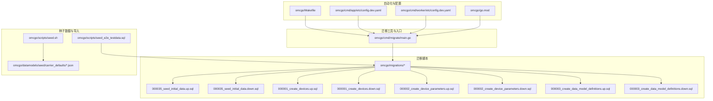
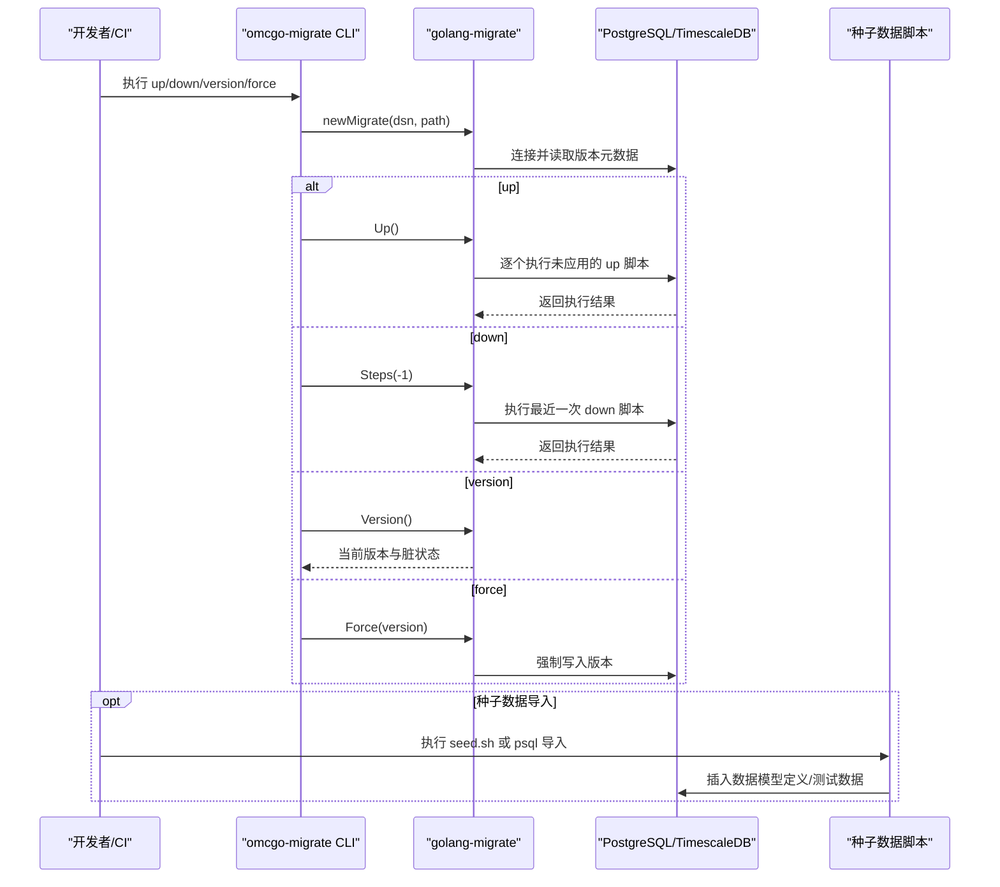
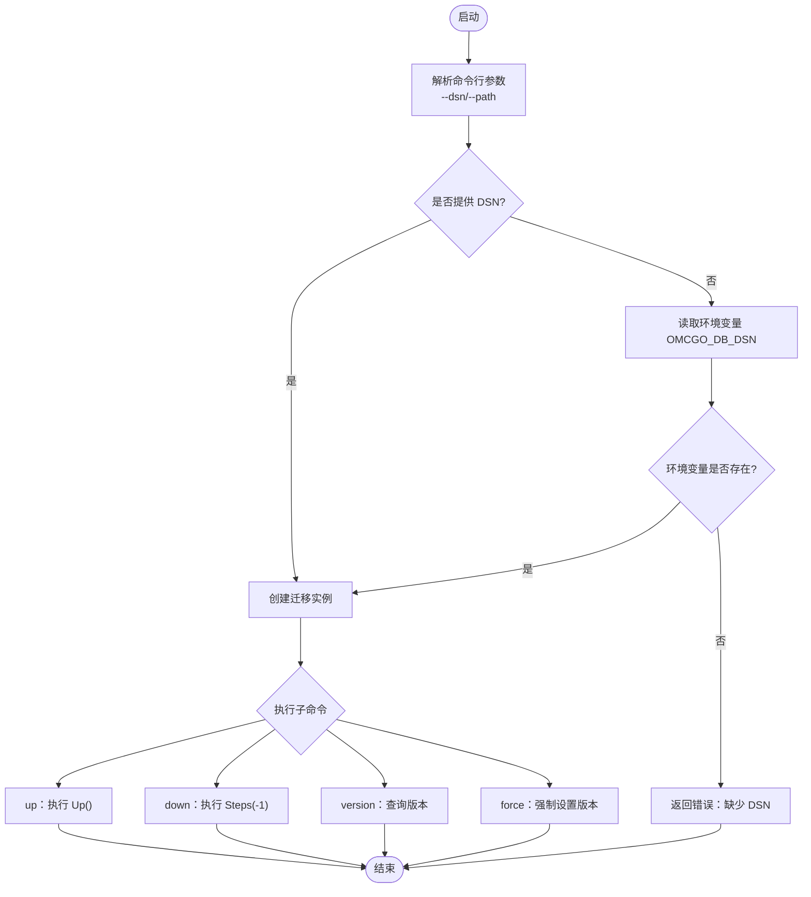
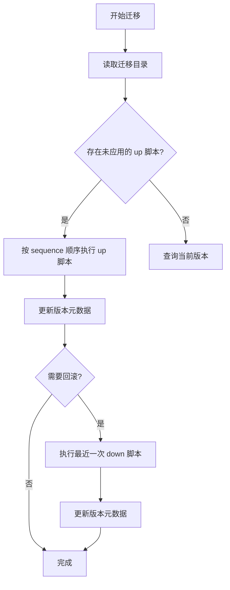
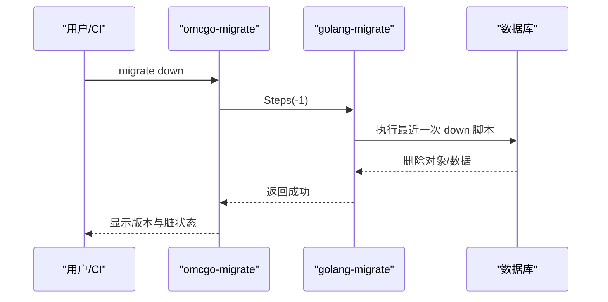
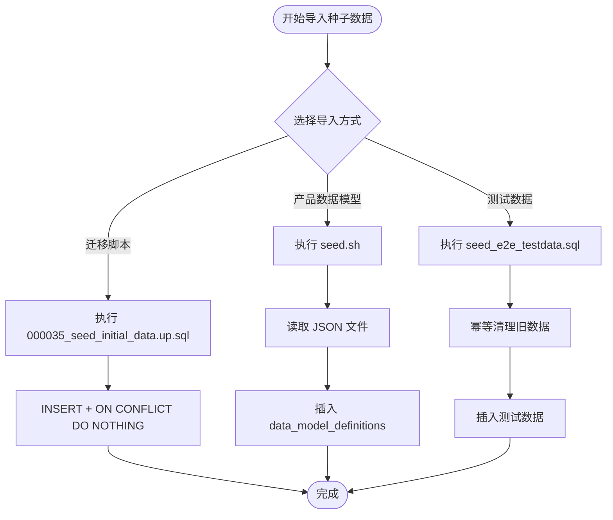
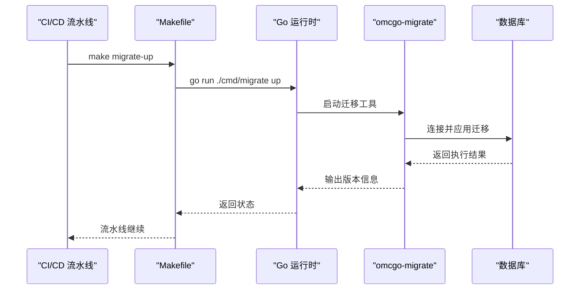
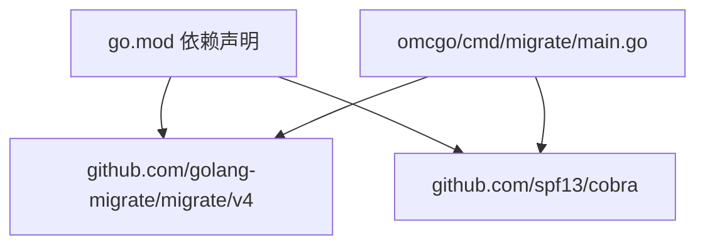

# 迁移管理

<cite>
**本文档引用的文件**
- [omcgo/cmd/migrate/main.go](file://omcgo/cmd/migrate/main.go)
- [omcgo/migrations/000035_seed_initial_data.up.sql](file://omcgo/migrations/000035_seed_initial_data.up.sql)
- [omcgo/migrations/000035_seed_initial_data.down.sql](file://omcgo/migrations/000035_seed_initial_data.down.sql)
- [omcgo/migrations/000001_create_devices.up.sql](file://omcgo/migrations/000001_create_devices.up.sql)
- [omcgo/migrations/000001_create_devices.down.sql](file://omcgo/migrations/000001_create_devices.down.sql)
- [omcgo/migrations/000002_create_device_parameters.up.sql](file://omcgo/migrations/000002_create_device_parameters.up.sql)
- [omcgo/migrations/000002_create_device_parameters.down.sql](file://omcgo/migrations/000002_create_device_parameters.down.sql)
- [omcgo/migrations/000003_create_data_model_definitions.up.sql](file://omcgo/migrations/000003_create_data_model_definitions.up.sql)
- [omcgo/migrations/000003_create_data_model_definitions.down.sql](file://omcgo/migrations/000003_create_data_model_definitions.down.sql)
- [omcgo/scripts/seed.sh](file://omcgo/scripts/seed.sh)
- [omcgo/scripts/seed_e2e_testdata.sql](file://omcgo/scripts/seed_e2e_testdata.sql)
- [omcgo/datamodels/seed/carrier_defaults/cmcc_lte.json](file://omcgo/datamodels/seed/carrier_defaults/cmcc_lte.json)
- [omcgo/docs/detailed-design/21-database-migrations.md](file://omcgo/docs/detailed-design/21-database-migrations.md)
- [omcgo/Makefile](file://omcgo/Makefile)
- [omcgo/cmd/app/etc/config.dev.yaml](file://omcgo/cmd/app/etc/config.dev.yaml)
- [omcgo/cmd/worker/etc/config.dev.yaml](file://omcgo/cmd/worker/etc/config.dev.yaml)
- [omcgo/go.mod](file://omcgo/go.mod)
</cite>

## 目录
1. [简介](#简介)
2. [项目结构](#项目结构)
3. [核心组件](#核心组件)
4. [架构概览](#架构概览)
5. [详细组件分析](#详细组件分析)
6. [依赖分析](#依赖分析)
7. [性能考虑](#性能考虑)
8. [故障排查指南](#故障排查指南)
9. [结论](#结论)
10. [附录](#附录)

## 简介
本文件面向 Baicells OMC 项目的数据库迁移管理，系统化阐述迁移设计理念、实现机制与最佳实践。内容涵盖：
- 迁移脚本命名规范与版本管理策略
- up/down 脚本的对应关系与回滚机制
- 迁移脚本编写规范（幂等性、依赖处理、约束设计）
- 初始数据种子的管理与导入流程
- 迁移执行自动化与 CI/CD 集成方式
- 风险控制与数据安全保护措施
- 迁移脚本编写示例与执行命令说明

## 项目结构
OMC 项目采用分层与功能域结合的组织方式，数据库迁移相关的关键位置如下：
- 迁移工具与入口：omcgo/cmd/migrate
- 迁移脚本目录：omcgo/migrations
- 种子数据与导入脚本：omcgo/scripts/seed*.sh, *.sql；种子数据 JSON：omcgo/datamodels/seed
- 文档与设计：omcgo/docs/detailed-design/21-database-migrations.md
- 自动化与配置：omcgo/Makefile、各服务配置文件

**图表来源**
- [omcgo/cmd/migrate/main.go:1-143](file://omcgo/cmd/migrate/main.go#L1-L143)
- [omcgo/migrations/000035_seed_initial_data.up.sql:1-300](file://omcgo/migrations/000035_seed_initial_data.up.sql#L1-L300)
- [omcgo/migrations/000035_seed_initial_data.down.sql:1-90](file://omcgo/migrations/000035_seed_initial_data.down.sql#L1-L90)
- [omcgo/migrations/000001_create_devices.up.sql:1-55](file://omcgo/migrations/000001_create_devices.up.sql#L1-L55)
- [omcgo/migrations/000001_create_devices.down.sql:1-4](file://omcgo/migrations/000001_create_devices.down.sql#L1-L4)
- [omcgo/migrations/000002_create_device_parameters.up.sql:1-13](file://omcgo/migrations/000002_create_device_parameters.up.sql#L1-L13)
- [omcgo/migrations/000002_create_device_parameters.down.sql:1-2](file://omcgo/migrations/000002_create_device_parameters.down.sql#L1-L2)
- [omcgo/migrations/000003_create_data_model_definitions.up.sql:1-57](file://omcgo/migrations/000003_create_data_model_definitions.up.sql#L1-L57)
- [omcgo/migrations/000003_create_data_model_definitions.down.sql:1-3](file://omcgo/migrations/000003_create_data_model_definitions.down.sql#L1-L3)
- [omcgo/scripts/seed.sh:1-61](file://omcgo/scripts/seed.sh#L1-L61)
- [omcgo/scripts/seed_e2e_testdata.sql:1-722](file://omcgo/scripts/seed_e2e_testdata.sql#L1-L722)
- [omcgo/datamodels/seed/carrier_defaults/cmcc_lte.json:1-285](file://omcgo/datamodels/seed/carrier_defaults/cmcc_lte.json#L1-L285)
- [omcgo/Makefile:1-74](file://omcgo/Makefile#L1-L74)
- [omcgo/cmd/app/etc/config.dev.yaml:1-91](file://omcgo/cmd/app/etc/config.dev.yaml#L1-L91)
- [omcgo/cmd/worker/etc/config.dev.yaml:1-63](file://omcgo/cmd/worker/etc/config.dev.yaml#L1-L63)
- [omcgo/go.mod:1-121](file://omcgo/go.mod#L1-L121)

**章节来源**
- [omcgo/cmd/migrate/main.go:1-143](file://omcgo/cmd/migrate/main.go#L1-L143)
- [omcgo/docs/detailed-design/21-database-migrations.md:1-166](file://omcgo/docs/detailed-design/21-database-migrations.md#L1-L166)
- [omcgo/Makefile:1-74](file://omcgo/Makefile#L1-L74)

## 核心组件
- 迁移工具与 CLI
  - 基于 golang-migrate，提供 up、down、version、force 等子命令
  - 支持通过命令行参数或环境变量 OMCGO_DB_DSN 指定数据库连接串
  - 迁移脚本目录默认为 migrations，可通过 --path 指定
- 迁移脚本
  - 采用 {sequence}_{description}.{up|down}.sql 命名，sequence 为三位数字，从 001 开始
  - 每个 up 脚本必须有对应的 down 脚本，确保可回滚
  - 脚本内实现幂等性（如使用 ON CONFLICT DO NOTHING），并遵循依赖顺序
- 种子数据
  - 初始数据通过迁移脚本 000035_seed_initial_data.* 执行
  - 通过专用脚本 seed.sh 导入产品数据模型定义
  - 提供端到端测试数据脚本 seed_e2e_testdata.sql，支持幂等清理与插入

**章节来源**
- [omcgo/cmd/migrate/main.go:14-143](file://omcgo/cmd/migrate/main.go#L14-L143)
- [omcgo/docs/detailed-design/21-database-migrations.md:27-42](file://omcgo/docs/detailed-design/21-database-migrations.md#L27-L42)
- [omcgo/migrations/000035_seed_initial_data.up.sql:1-300](file://omcgo/migrations/000035_seed_initial_data.up.sql#L1-L300)
- [omcgo/migrations/000035_seed_initial_data.down.sql:1-90](file://omcgo/migrations/000035_seed_initial_data.down.sql#L1-L90)
- [omcgo/scripts/seed.sh:1-61](file://omcgo/scripts/seed.sh#L1-L61)
- [omcgo/scripts/seed_e2e_testdata.sql:1-722](file://omcgo/scripts/seed_e2e_testdata.sql#L1-L722)

## 架构概览
下图展示迁移工具、脚本与数据流之间的交互关系：

**图表来源**
- [omcgo/cmd/migrate/main.go:54-143](file://omcgo/cmd/migrate/main.go#L54-L143)
- [omcgo/scripts/seed.sh:1-61](file://omcgo/scripts/seed.sh#L1-L61)
- [omcgo/scripts/seed_e2e_testdata.sql:1-722](file://omcgo/scripts/seed_e2e_testdata.sql#L1-L722)

## 详细组件分析

### 组件A：迁移工具与命令行接口
- 设计要点
  - 使用 Cobra 构建子命令，统一风格与帮助信息
  - 支持通过 --dsn 或 OMCGO_DB_DSN 注入数据库连接串，避免硬编码
  - 提供 version 与 force 子命令，用于状态诊断与修复
- 处理逻辑
  - newMigrate：组装 sourceURL=file://{path} 与 dsn，创建迁移实例
  - runMigrateUp/Down/Version/Force：封装迁移操作并输出版本与脏状态

**图表来源**
- [omcgo/cmd/migrate/main.go:14-143](file://omcgo/cmd/migrate/main.go#L14-L143)

**章节来源**
- [omcgo/cmd/migrate/main.go:14-143](file://omcgo/cmd/migrate/main.go#L14-L143)

### 组件B：迁移脚本命名规范与版本管理
- 命名规范
  - {sequence}_{description}.{up|down}.sql
  - sequence 为三位数字，递增编号，确保版本顺序
- 版本管理策略
  - 严格一一对称：每个 up 必须有对应 down
  - 幂等性：使用 ON CONFLICT DO NOTHING 等机制
  - 依赖顺序：按阶段分批创建，先基础表，再扩展表，最后种子数据
- 示例路径
  - 基础表：000001_create_devices.*
  - 参数表：000002_create_device_parameters.*
  - 数据模型表：000003_create_data_model_definitions.*
  - 种子数据：000035_seed_initial_data.*

**图表来源**
- [omcgo/docs/detailed-design/21-database-migrations.md:27-42](file://omcgo/docs/detailed-design/21-database-migrations.md#L27-L42)
- [omcgo/migrations/000001_create_devices.up.sql:1-55](file://omcgo/migrations/000001_create_devices.up.sql#L1-L55)
- [omcgo/migrations/000002_create_device_parameters.up.sql:1-13](file://omcgo/migrations/000002_create_device_parameters.up.sql#L1-L13)
- [omcgo/migrations/000003_create_data_model_definitions.up.sql:1-57](file://omcgo/migrations/000003_create_data_model_definitions.up.sql#L1-L57)
- [omcgo/migrations/000035_seed_initial_data.up.sql:1-300](file://omcgo/migrations/000035_seed_initial_data.up.sql#L1-L300)

**章节来源**
- [omcgo/docs/detailed-design/21-database-migrations.md:27-42](file://omcgo/docs/detailed-design/21-database-migrations.md#L27-L42)

### 组件C：回滚机制与幂等性保证
- 回滚机制
  - down 脚本精确删除 up 脚本创建的对象与数据
  - 使用 UUID 前缀区分种子数据，确保不影响用户自定义数据
- 幂等性保证
  - up 脚本广泛使用 ON CONFLICT DO NOTHING
  - 唯一索引与部分唯一索引防止重复插入
  - 触发器与函数复用，减少重复定义

**图表来源**
- [omcgo/cmd/migrate/main.go:89-107](file://omcgo/cmd/migrate/main.go#L89-L107)
- [omcgo/migrations/000035_seed_initial_data.down.sql:1-90](file://omcgo/migrations/000035_seed_initial_data.down.sql#L1-L90)
- [omcgo/migrations/000001_create_devices.down.sql:1-4](file://omcgo/migrations/000001_create_devices.down.sql#L1-L4)
- [omcgo/migrations/000002_create_device_parameters.down.sql:1-2](file://omcgo/migrations/000002_create_device_parameters.down.sql#L1-L2)
- [omcgo/migrations/000003_create_data_model_definitions.down.sql:1-3](file://omcgo/migrations/000003_create_data_model_definitions.down.sql#L1-L3)

**章节来源**
- [omcgo/migrations/000035_seed_initial_data.down.sql:1-90](file://omcgo/migrations/000035_seed_initial_data.down.sql#L1-L90)
- [omcgo/migrations/000035_seed_initial_data.up.sql:1-300](file://omcgo/migrations/000035_seed_initial_data.up.sql#L1-L300)

### 组件D：初始数据种子管理
- 种子数据来源
  - 迁移脚本：000035_seed_initial_data.*
  - 产品数据模型：datamodels/seed/carrier_defaults/*.json
  - 端到端测试数据：scripts/seed_e2e_testdata.sql
- 导入流程
  - 迁移脚本：在 up 中执行 INSERT，并使用 ON CONFLICT DO NOTHING
  - 产品数据模型：通过 seed.sh 读取 JSON，插入 data_model_definitions
  - 测试数据：通过 psql 执行 seed_e2e_testdata.sql，包含幂等清理与插入

**图表来源**
- [omcgo/migrations/000035_seed_initial_data.up.sql:1-300](file://omcgo/migrations/000035_seed_initial_data.up.sql#L1-L300)
- [omcgo/scripts/seed.sh:1-61](file://omcgo/scripts/seed.sh#L1-L61)
- [omcgo/scripts/seed_e2e_testdata.sql:1-722](file://omcgo/scripts/seed_e2e_testdata.sql#L1-L722)
- [omcgo/datamodels/seed/carrier_defaults/cmcc_lte.json:1-285](file://omcgo/datamodels/seed/carrier_defaults/cmcc_lte.json#L1-L285)

**章节来源**
- [omcgo/migrations/000035_seed_initial_data.up.sql:1-300](file://omcgo/migrations/000035_seed_initial_data.up.sql#L1-L300)
- [omcgo/scripts/seed.sh:1-61](file://omcgo/scripts/seed.sh#L1-L61)
- [omcgo/scripts/seed_e2e_testdata.sql:1-722](file://omcgo/scripts/seed_e2e_testdata.sql#L1-L722)
- [omcgo/datamodels/seed/carrier_defaults/cmcc_lte.json:1-285](file://omcgo/datamodels/seed/carrier_defaults/cmcc_lte.json#L1-L285)

### 组件E：迁移执行自动化与 CI/CD 集成
- 自动化入口
  - Makefile 提供 migrate-up、migrate-down、migrate-create 等目标
  - 通过 go run ./cmd/migrate 方式调用 CLI
- CI/CD 集成建议
  - 在构建流水线中添加 migrate-up 步骤，确保部署前数据库结构一致
  - 使用环境变量 OMCGO_DB_DSN 注入数据库连接串
  - 对生产环境增加 force 修复与版本校验步骤

**图表来源**
- [omcgo/Makefile:48-58](file://omcgo/Makefile#L48-L58)
- [omcgo/cmd/migrate/main.go:54-87](file://omcgo/cmd/migrate/main.go#L54-L87)

**章节来源**
- [omcgo/Makefile:48-58](file://omcgo/Makefile#L48-L58)
- [omcgo/cmd/migrate/main.go:54-87](file://omcgo/cmd/migrate/main.go#L54-L87)

## 依赖分析
- 外部依赖
  - golang-migrate/migrate/v4：迁移工具核心
  - spf13/cobra：命令行接口
  - PostgreSQL/TimescaleDB：后端存储
- 内部依赖
  - 迁移工具依赖 golang-migrate 与 Cobra
  - 迁移脚本依赖数据库特性（如分区表、时序表、JSONB 等）

**图表来源**
- [omcgo/go.mod:1-121](file://omcgo/go.mod#L1-L121)
- [omcgo/cmd/migrate/main.go:3-12](file://omcgo/cmd/migrate/main.go#L3-L12)

**章节来源**
- [omcgo/go.mod:1-121](file://omcgo/go.mod#L1-L121)

## 性能考虑
- 迁移性能
  - 使用索引与分区表提升查询与维护效率（如 devices 表按 carrier 分区）
  - 时序表使用 TimescaleDB 的压缩与保留策略，降低存储与查询成本
- 幂等性与并发
  - 幂等性设计减少重复执行带来的性能损耗
  - 合理的事务边界与批量操作，避免长时间锁持有
- CI/CD 中的迁移
  - 在流水线中尽早执行迁移，避免运行期失败
  - 对大表操作建议在维护窗口进行

## 故障排查指南
- 常见问题与处理
  - 缺少 DSN：检查命令行参数或 OMCGO_DB_DSN 环境变量
  - 迁移卡住或脏状态：使用 force 子命令修复版本
  - 回滚失败：确认 down 脚本完整性与依赖顺序
  - 种子数据冲突：利用 ON CONFLICT DO NOTHING 或 UUID 前缀区分
- 排查步骤
  - 使用 version 子命令查看当前版本与脏状态
  - 手动执行单个 up/down 脚本定位问题
  - 检查数据库连接串与权限

**章节来源**
- [omcgo/cmd/migrate/main.go:109-142](file://omcgo/cmd/migrate/main.go#L109-L142)
- [omcgo/migrations/000035_seed_initial_data.up.sql:1-300](file://omcgo/migrations/000035_seed_initial_data.up.sql#L1-L300)

## 结论
OMC 项目的数据库迁移管理以 golang-migrate 为核心，结合严格的命名规范、对称的 up/down 设计、幂等性保障与种子数据导入机制，形成了可回滚、可审计、可自动化的完整体系。通过 Makefile 与 CI/CD 的集成，能够在多环境中稳定地演进数据库结构，同时通过测试数据脚本与产品数据模型导入，支撑开发、测试与预生产环境的快速搭建。

## 附录

### A. 迁移脚本编写规范
- 命名与版本
  - 使用 {sequence}_{description}.{up|down}.sql，sequence 为三位数字
  - 每个 up 必须有对应 down
- 幂等性
  - 使用 ON CONFLICT DO NOTHING、唯一索引、条件判断
- 依赖与顺序
  - 按阶段分批创建，先基础表，再扩展表，最后种子数据
- 约束与索引
  - 合理设计主键、唯一索引与查询索引
  - 使用部分唯一索引保证业务唯一性

**章节来源**
- [omcgo/docs/detailed-design/21-database-migrations.md:27-42](file://omcgo/docs/detailed-design/21-database-migrations.md#L27-L42)
- [omcgo/migrations/000001_create_devices.up.sql:1-55](file://omcgo/migrations/000001_create_devices.up.sql#L1-L55)
- [omcgo/migrations/000003_create_data_model_definitions.up.sql:1-57](file://omcgo/migrations/000003_create_data_model_definitions.up.sql#L1-L57)

### B. 执行命令与示例
- 迁移工具
  - 运行：go run ./cmd/migrate up
  - 回滚：go run ./cmd/migrate down
  - 查看版本：go run ./cmd/migrate version
  - 强制设置版本：go run ./cmd/migrate force <version>
- Makefile 目标
  - make migrate-up
  - make migrate-down
  - make migrate-create name=<migration_name>
- 种子数据
  - 导入产品数据模型：./scripts/seed.sh
  - 导入测试数据：psql "$DSN" -f scripts/seed_e2e_testdata.sql

**章节来源**
- [omcgo/cmd/migrate/main.go:14-143](file://omcgo/cmd/migrate/main.go#L14-L143)
- [omcgo/Makefile:48-58](file://omcgo/Makefile#L48-L58)
- [omcgo/scripts/seed.sh:1-61](file://omcgo/scripts/seed.sh#L1-L61)
- [omcgo/scripts/seed_e2e_testdata.sql:1-722](file://omcgo/scripts/seed_e2e_testdata.sql#L1-L722)

### C. 风险控制与数据安全
- 风险控制
  - 严格的 up/down 对称设计，确保可回滚
  - 幂等性设计，避免重复执行造成副作用
  - 使用 UUID 前缀区分种子数据，回滚时精准删除
- 数据安全
  - 迁移脚本不包含敏感信息，连接串通过环境变量注入
  - 测试数据脚本提供幂等清理，避免污染生产数据

**章节来源**
- [omcgo/migrations/000035_seed_initial_data.down.sql:1-90](file://omcgo/migrations/000035_seed_initial_data.down.sql#L1-L90)
- [omcgo/cmd/migrate/main.go:54-71](file://omcgo/cmd/migrate/main.go#L54-L71)
- [omcgo/scripts/seed_e2e_testdata.sql:1-722](file://omcgo/scripts/seed_e2e_testdata.sql#L1-L722)