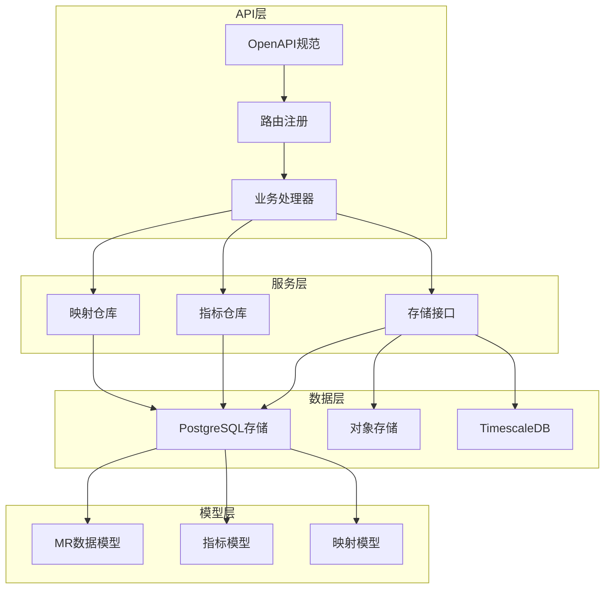
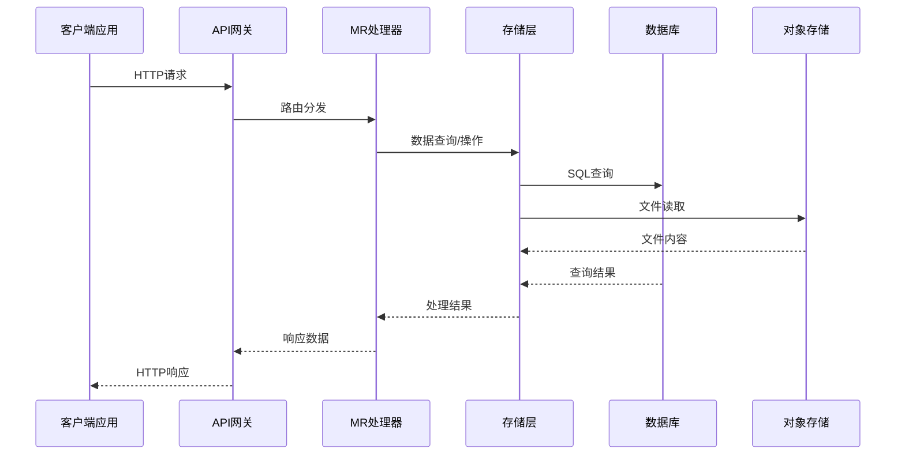
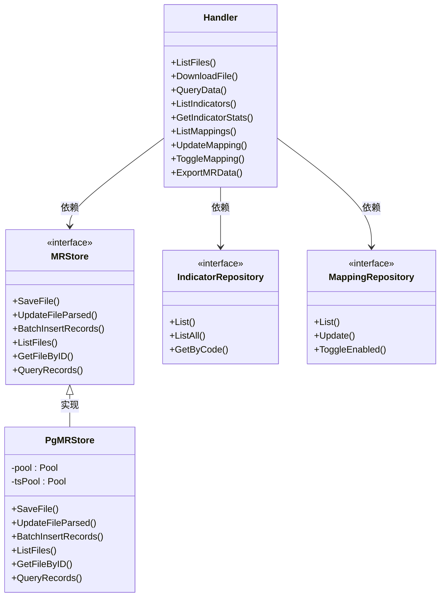

# MR API接口

<cite>
**本文档引用的文件**
- [openapi.yaml](file://omcgo/api/openapi/openapi.yaml)
- [handler.go](file://omcgo/internal/mr/handler.go)
- [store.go](file://omcgo/internal/mr/store.go)
- [pg_store.go](file://omcgo/internal/mr/pg_store.go)
- [indicator_model.go](file://omcgo/internal/mr/indicator_model.go)
- [indicator_repository.go](file://omcgo/internal/mr/indicator_repository.go)
- [parser.go](file://omcgo/internal/mr/parser/parser.go)
- [000013_create_mr_tables.up.sql](file://omcgo/migrations/000013_create_mr_tables.up.sql)
- [000029_create_mr_indicators.up.sql](file://omcgo/migrations/000029_create_mr_indicators.up.sql)
- [handler_test.go](file://omcgo/internal/mr/handler_test.go)
</cite>

## 目录
1. [简介](#简介)
2. [项目结构](#项目结构)
3. [核心组件](#核心组件)
4. [架构概览](#架构概览)
5. [详细组件分析](#详细组件分析)
6. [依赖关系分析](#依赖关系分析)
7. [性能考虑](#性能考虑)
8. [故障排除指南](#故障排除指南)
9. [结论](#结论)
10. [附录](#附录)

## 简介

MR API接口是OMC（操作维护中心）系统中用于管理测量报告（Measurement Report）数据的核心REST API。该接口提供了完整的MR数据生命周期管理功能，包括文件列表查询、文件下载、数据查询、指标管理、映射管理和数据导出等核心功能。

本系统基于Go语言开发，采用现代化的微服务架构，集成了PostgreSQL/TimescaleDB作为数据存储，MinIO作为对象存储，支持高并发的MR数据处理和分析需求。

## 项目结构

MR API接口在项目中的组织结构如下：



**图表来源**
- [handler.go:32-48](file://omcgo/internal/mr/handler.go#L32-L48)
- [store.go:59-68](file://omcgo/internal/mr/store.go#L59-L68)
- [pg_store.go:19-28](file://omcgo/internal/mr/pg_store.go#L19-L28)

**章节来源**
- [handler.go:17-30](file://omcgo/internal/mr/handler.go#L17-L30)
- [store.go:12-27](file://omcgo/internal/mr/store.go#L12-L27)

## 核心组件

### MR文件管理组件
MR文件管理组件负责处理MR文件的元数据管理，包括文件上传、状态跟踪和生命周期管理。

### MR数据查询组件
MR数据查询组件提供灵活的数据检索能力，支持按设备、时间范围、MR类型等多种维度进行过滤查询。

### 指标管理组件
指标管理组件维护MR相关的指标定义和分类信息，支持指标的增删改查操作。

### 映射管理组件
映射管理组件处理设备与MR采集配置之间的映射关系，支持动态启用/禁用和参数调整。

**章节来源**
- [handler.go:32-48](file://omcgo/internal/mr/handler.go#L32-L48)
- [indicator_model.go:10-36](file://omcgo/internal/mr/indicator_model.go#L10-L36)

## 架构概览

MR API接口采用分层架构设计，确保了良好的可维护性和扩展性：



**图表来源**
- [handler.go:58-95](file://omcgo/internal/mr/handler.go#L58-L95)
- [pg_store.go:98-146](file://omcgo/internal/mr/pg_store.go#L98-L146)

## 详细组件分析

### 文件管理API

#### 列表查询MR文件
- **HTTP方法**: GET
- **URL模式**: `/api/v1/mr/files`
- **认证机制**: Bearer Token
- **分页参数**: page, page_size
- **查询参数**:
  - device_id (可选): 设备UUID
  - device_sn (可选): 设备序列号
  - file_type (可选): 文件类型
- **响应格式**: 分页响应，包含MR文件列表
- **错误码**: 401 (未授权), 500 (服务器错误)

#### 下载MR文件
- **HTTP方法**: GET
- **URL模式**: `/api/v1/mr/files/{id}`
- **路径参数**: id (文件ID)
- **响应格式**: 二进制XML文件流
- **错误码**: 404 (文件不存在), 500 (下载失败)

#### 解析MR文件
- **HTTP方法**: POST
- **URL模式**: `/api/v1/mr/files/{id}/parse`
- **响应格式**: 解析状态和记录数量
- **错误码**: 404 (文件不存在), 500 (解析失败)

**章节来源**
- [openapi.yaml:1775-1855](file://omcgo/api/openapi/openapi.yaml#L1775-L1855)
- [handler.go:58-131](file://omcgo/internal/mr/handler.go#L58-L131)

### 数据查询API

#### 查询MR数据
- **HTTP方法**: GET
- **URL模式**: `/api/v1/mr/results`
- **查询参数**:
  - device_id (可选): 设备UUID
  - cell_id (可选): 小区ID
  - period (可选): 时间段
- **分页参数**: page, page_size
- **响应格式**: 分页响应，包含MR记录列表

#### 导出MR数据
- **HTTP方法**: POST
- **URL模式**: `/api/v1/mr/export`
- **请求体参数**:
  - device_id (可选): 设备UUID
  - mr_type (可选): MR类型
  - cell_id (可选): 小区ID
  - start_time (可选): 开始时间
  - end_time (可选): 结束时间
  - format (可选): 输出格式 (json/csv，默认json)
- **响应格式**: JSON或CSV文件流

**章节来源**
- [openapi.yaml:1857-1893](file://omcgo/api/openapi/openapi.yaml#L1857-L1893)
- [handler.go:143-191](file://omcgo/internal/mr/handler.go#L143-L191)
- [handler.go:371-424](file://omcgo/internal/mr/handler.go#L371-L424)

### 指标管理API

#### 列表查询指标
- **HTTP方法**: GET
- **URL模式**: `/api/v1/mr/indicators`
- **查询参数**:
  - category (可选): 指标分类
  - keyword (可选): 关键词搜索
- **分页参数**: page, page_size
- **响应格式**: 分页响应，包含MR指标列表

#### 获取指标统计
- **HTTP方法**: GET
- **URL模式**: `/api/v1/mr/indicators/{code}/stats`
- **路径参数**: code (指标代码)
- **响应格式**: 指标统计信息（平均值、最小值、最大值等）

#### 获取所有指标
- **HTTP方法**: GET
- **URL模式**: `/api/v1/mr/indicators/all`
- **响应格式**: 指标数组

**章节来源**
- [openapi.yaml:46-47](file://omcgo/api/openapi/openapi.yaml#L46-L47)
- [handler.go:195-263](file://omcgo/internal/mr/handler.go#L195-L263)

### 映射管理API

#### 列表查询映射
- **HTTP方法**: GET
- **URL模式**: `/api/v1/mr/mappings`
- **查询参数**:
  - device_sn (可选): 设备序列号
  - enabled (可选): 启用状态
- **分页参数**: page, page_size
- **响应格式**: 分页响应，包含设备映射列表

#### 更新映射
- **HTTP方法**: PUT
- **URL模式**: `/api/v1/mr/mappings/{id}`
- **路径参数**: id (映射ID)
- **请求体参数**:
  - device_sn: 设备序列号
  - device_name (可选): 设备名称
  - cell_id: 小区ID
  - cell_name (可选): 小区名称
  - enabled: 启用状态
  - sampling_interval: 采样间隔

#### 切换映射状态
- **HTTP方法**: PUT
- **URL模式**: `/api/v1/mr/mappings/{id}/toggle`
- **路径参数**: id (映射ID)
- **请求体参数**: enabled (新状态)

**章节来源**
- [openapi.yaml:46-47](file://omcgo/api/openapi/openapi.yaml#L46-L47)
- [handler.go:280-359](file://omcgo/internal/mr/handler.go#L280-L359)

## 依赖关系分析

MR API接口的依赖关系图展示了各组件之间的交互关系：



**图表来源**
- [handler.go:17-30](file://omcgo/internal/mr/handler.go#L17-L30)
- [store.go:59-68](file://omcgo/internal/mr/store.go#L59-L68)
- [pg_store.go:19-28](file://omcgo/internal/mr/pg_store.go#L19-L28)
- [indicator_repository.go:10-22](file://omcgo/internal/mr/indicator_repository.go#L10-L22)

**章节来源**
- [handler.go:17-30](file://omcgo/internal/mr/handler.go#L17-L30)
- [store.go:59-68](file://omcgo/internal/mr/store.go#L59-L68)

## 性能考虑

### 数据库优化
- **索引策略**: MR文件表和MR记录表都建立了复合索引，支持高效的查询操作
- **分区策略**: MR记录表使用TimescaleDB进行时间序列分区，提高大数据量查询性能
- **缓存机制**: 支持指标和映射数据的缓存，减少重复查询开销

### 存储优化
- **对象存储**: 使用MinIO存储MR原始文件，支持大文件的高效访问
- **批量操作**: 提供批量插入功能，优化大量数据的导入性能
- **压缩策略**: TimescaleDB自动压缩历史数据，节省存储空间

### API优化
- **分页查询**: 所有列表查询都支持分页，避免一次性返回大量数据
- **过滤条件**: 支持多维度过滤，精确控制查询范围
- **并发处理**: 基于Gin框架的高性能HTTP处理

## 故障排除指南

### 常见错误及解决方案

#### 认证失败 (401 Unauthorized)
- **原因**: 缺少或无效的Bearer Token
- **解决方案**: 确保在请求头中正确设置Authorization: Bearer <token>

#### 参数验证失败 (400 Bad Request)
- **原因**: 请求参数格式不正确或缺失
- **解决方案**: 检查UUID格式、时间格式等参数是否符合要求

#### 资源不存在 (404 Not Found)
- **原因**: 请求的文件或资源不存在
- **解决方案**: 确认文件ID或资源标识符的正确性

#### 服务器内部错误 (500 Internal Server Error)
- **原因**: 数据库连接失败或处理异常
- **解决方案**: 检查数据库连接配置和日志信息

### 调试工具使用

#### API测试
使用curl命令测试API接口：
```bash
# 测试文件列表查询
curl -X GET "http://localhost:8080/api/v1/mr/files?page=1&page_size=20" \
  -H "Authorization: Bearer YOUR_TOKEN"

# 测试数据导出
curl -X POST "http://localhost:8080/api/v1/mr/export" \
  -H "Authorization: Bearer YOUR_TOKEN" \
  -H "Content-Type: application/json" \
  -d '{"device_id":"YOUR_DEVICE_ID","format":"csv"}'
```

#### 日志分析
- **访问日志**: 查看Gin框架的日志输出
- **数据库日志**: 监控SQL执行时间和错误
- **存储日志**: 跟踪文件上传下载状态

**章节来源**
- [handler.go:61-94](file://omcgo/internal/mr/handler.go#L61-L94)
- [pg_store.go:30-54](file://omcgo/internal/mr/pg_store.go#L30-L54)

## 结论

MR API接口提供了完整的测量报告数据管理功能，具有以下特点：

1. **功能完整性**: 覆盖MR数据的全生命周期管理
2. **性能优化**: 基于TimescaleDB的时间序列优化
3. **扩展性强**: 清晰的分层架构便于功能扩展
4. **易用性好**: 标准化的REST API设计

该接口为运营商网络优化和数据分析提供了强有力的技术支撑，能够满足大规模MR数据的处理和分析需求。

## 附录

### 数据模型定义

#### MR文件信息
| 字段名 | 类型 | 描述 |
|--------|------|------|
| id | UUID | 文件唯一标识 |
| device_id | UUID | 设备标识 |
| device_sn | String | 设备序列号 |
| carrier | String | 运营商代码 |
| mr_type | String | MR类型 (MRO/MRS/MRE) |
| file_name | String | 文件名 |
| file_size | Integer | 文件大小 |
| collect_time | Timestamp | 采集时间 |
| minio_path | String | MinIO存储路径 |
| parsed | Boolean | 是否已解析 |
| parsed_at | Timestamp | 解析时间 |
| record_count | Integer | 记录数量 |
| created_at | Timestamp | 创建时间 |

#### MR记录条目
| 字段名 | 类型 | 描述 |
|--------|------|------|
| time | Timestamp | 时间戳 |
| file_id | UUID | 文件ID |
| device_id | UUID | 设备ID |
| cell_id | String | 小区ID |
| mr_type | String | MR类型 |
| measurement_data | JSON | 测量数据 |

### 最佳实践建议

1. **参数验证**: 始终验证输入参数的有效性
2. **错误处理**: 实现完善的错误处理和重试机制
3. **性能监控**: 监控API响应时间和数据库性能
4. **安全考虑**: 实施适当的访问控制和数据加密
5. **日志记录**: 保持详细的日志记录便于问题排查