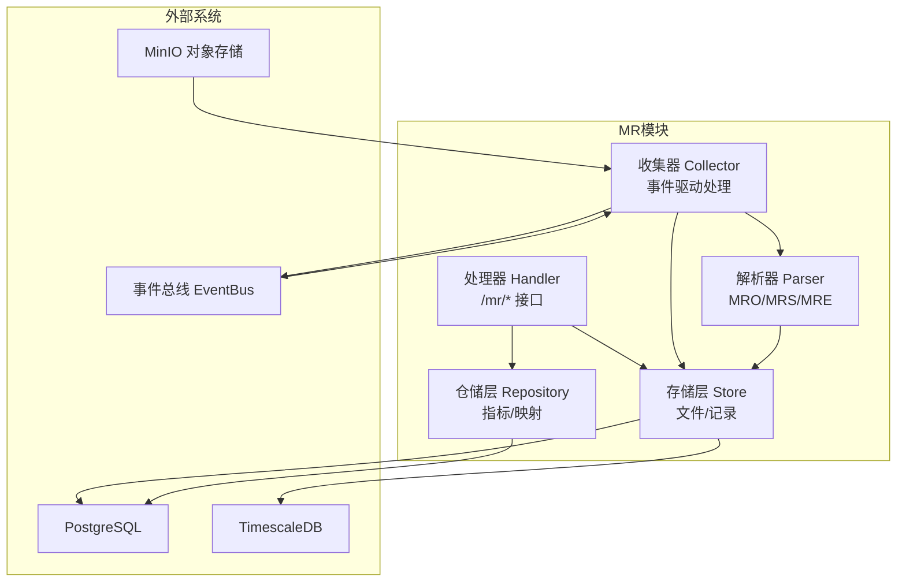
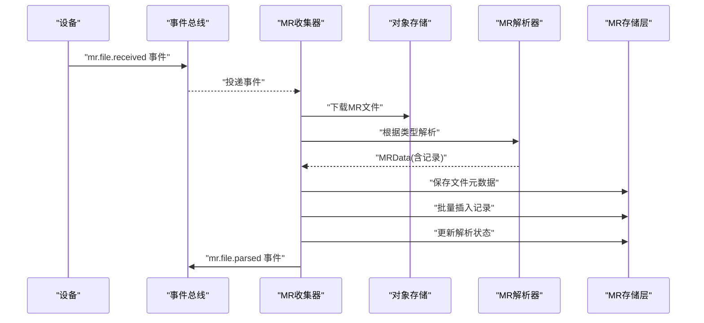
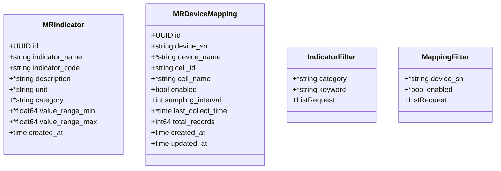
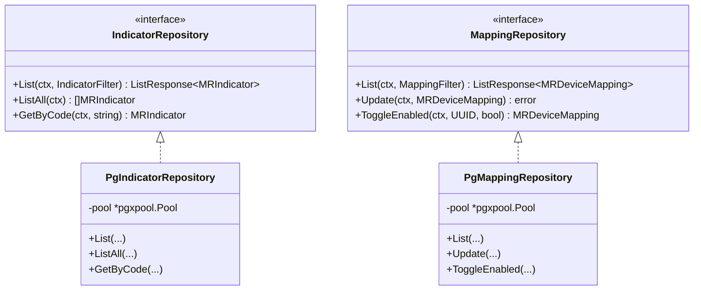
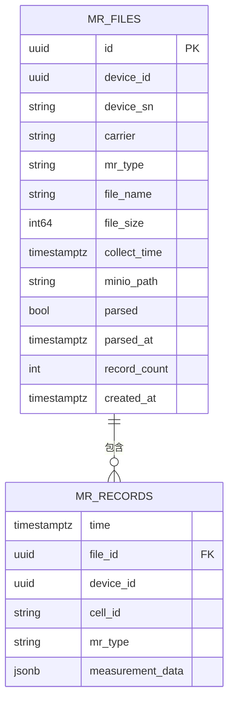
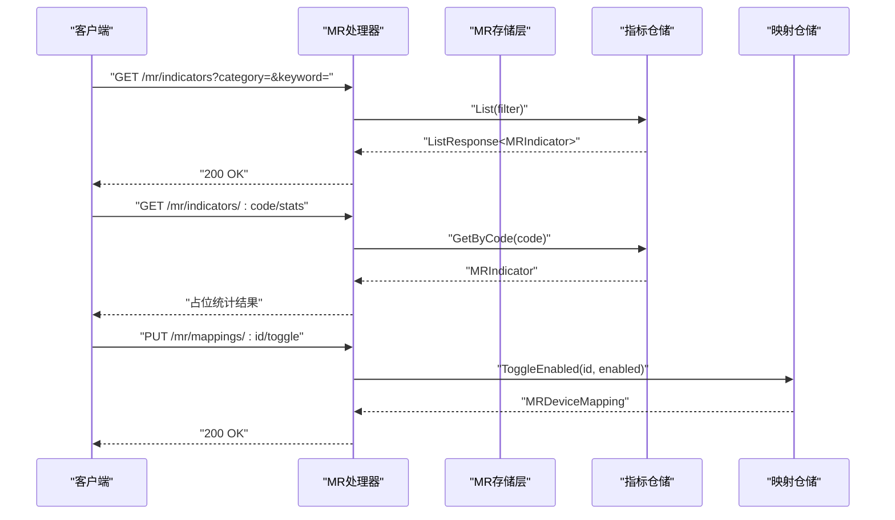
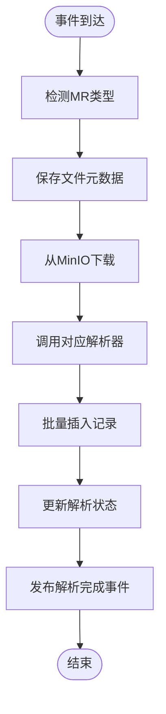
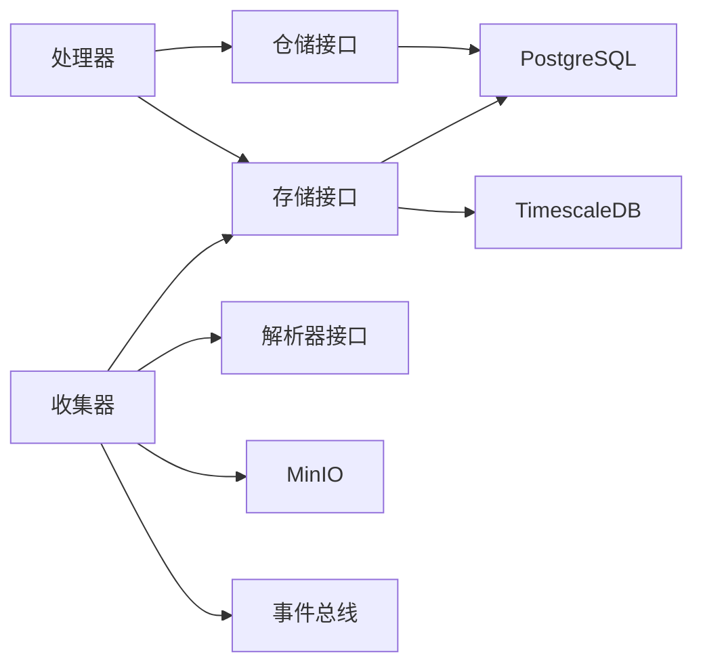

# MR指标管理

<cite>
**本文引用的文件**
- [omcgo/internal/mr/indicator_model.go](file://omcgo/internal/mr/indicator_model.go)
- [omcgo/internal/mr/indicator_repository.go](file://omcgo/internal/mr/indicator_repository.go)
- [omcgo/internal/mr/pg_indicator_repository.go](file://omcgo/internal/mr/pg_indicator_repository.go)
- [omcgo/internal/mr/store.go](file://omcgo/internal/mr/store.go)
- [omcgo/internal/mr/pg_store.go](file://omcgo/internal/mr/pg_store.go)
- [omcgo/internal/mr/handler.go](file://omcgo/internal/mr/handler.go)
- [omcgo/internal/mr/collector/collector.go](file://omcgo/internal/mr/collector/collector.go)
- [omcgo/internal/mr/parser/parser.go](file://omcgo/internal/mr/parser/parser.go)
- [omcgo/internal/mr/parser/mre_parser.go](file://omcgo/internal/mr/parser/mre_parser.go)
- [omcgo/migrations/000013_create_mr_tables.up.sql](file://omcgo/migrations/000013_create_mr_tables.up.sql)
- [omcgo/migrations/000029_create_mr_indicators.up.sql](file://omcgo/migrations/000029_create_mr_indicators.up.sql)
</cite>

## 目录
1. [简介](#简介)
2. [项目结构](#项目结构)
3. [核心组件](#核心组件)
4. [架构总览](#架构总览)
5. [详细组件分析](#详细组件分析)
6. [依赖分析](#依赖分析)
7. [性能考虑](#性能考虑)
8. [故障排查指南](#故障排查指南)
9. [结论](#结论)
10. [附录](#附录)

## 简介
本文件面向MR（Measurement Report）指标管理功能，系统化阐述指标的定义、分类与管理机制，覆盖指标代码、名称、单位、范围与计算公式等属性；详述指标的增删改查、分类管理与统计能力；解释指标与MR数据的关联关系、指标计算逻辑以及指标数据的存储结构；并提供最佳实践、性能优化与扩展性设计建议，辅以API接口说明与维护指南。

## 项目结构
MR指标管理相关代码主要位于后端服务的mr子模块中，包含：
- 数据模型与过滤器：指标模型、设备映射模型、分页过滤器
- 仓储层：指标与映射的接口及PostgreSQL实现
- 存储层：MR文件与记录的接口及PostgreSQL/TimescaleDB实现
- 处理器：REST API路由与业务处理
- 收集器：事件驱动的MR文件下载、解析与入库流程
- 解析器：MRO/MRS/MRE三类MR文件的解析实现
- 数据库迁移：mr_indicators、mr_device_mappings、mr_files、mr_records等表结构

图表来源
- [omcgo/internal/mr/handler.go:32-48](file://omcgo/internal/mr/handler.go#L32-L48)
- [omcgo/internal/mr/pg_indicator_repository.go:35-43](file://omcgo/internal/mr/pg_indicator_repository.go#L35-L43)
- [omcgo/internal/mr/pg_store.go:19-28](file://omcgo/internal/mr/pg_store.go#L19-L28)
- [omcgo/internal/mr/collector/collector.go:29-60](file://omcgo/internal/mr/collector/collector.go#L29-L60)
- [omcgo/internal/mr/parser/parser.go:31-34](file://omcgo/internal/mr/parser/parser.go#L31-L34)

章节来源
- [omcgo/internal/mr/handler.go:17-48](file://omcgo/internal/mr/handler.go#L17-L48)
- [omcgo/internal/mr/pg_indicator_repository.go:35-43](file://omcgo/internal/mr/pg_indicator_repository.go#L35-L43)
- [omcgo/internal/mr/pg_store.go:19-28](file://omcgo/internal/mr/pg_store.go#L19-L28)
- [omcgo/internal/mr/collector/collector.go:29-60](file://omcgo/internal/mr/collector/collector.go#L29-L60)
- [omcgo/internal/mr/parser/parser.go:31-34](file://omcgo/internal/mr/parser/parser.go#L31-L34)

## 核心组件
- 指标模型与过滤器
  - 指标定义：包含指标ID、指标代码、指标名称、描述、单位、分类、数值范围、创建时间等字段
  - 设备映射：设备SN、小区ID、启用状态、采样间隔、最后采集时间、记录总数等
  - 过滤器：支持按分类、关键词、启用状态、设备SN等条件分页查询
- 仓储层
  - 指标仓储：提供列表、全量查询、按编码获取等能力
  - 映射仓储：提供列表、更新、启停切换等能力
- 存储层
  - 文件元数据：mr_files，包含设备ID/SN、运营商、MR类型、文件名、大小、采集时间、MinIO路径、解析状态与计数等
  - 记录表：mr_records，按时间序列存储，使用TimescaleDB进行压缩与保留策略
- 处理器
  - 提供MR文件列表、下载、数据查询、指标列表、指标统计、映射列表、映射更新与启停等接口
- 收集器
  - 订阅MR文件到达事件，自动下载、识别类型、解析、批量入库、更新解析状态并发布解析完成事件
- 解析器
  - MRO/MRS/MRE三种格式解析，输出统一的MRData结构

章节来源
- [omcgo/internal/mr/indicator_model.go:10-50](file://omcgo/internal/mr/indicator_model.go#L10-L50)
- [omcgo/internal/mr/indicator_repository.go:10-22](file://omcgo/internal/mr/indicator_repository.go#L10-L22)
- [omcgo/internal/mr/store.go:12-67](file://omcgo/internal/mr/store.go#L12-L67)
- [omcgo/internal/mr/handler.go:17-48](file://omcgo/internal/mr/handler.go#L17-L48)
- [omcgo/internal/mr/collector/collector.go:29-74](file://omcgo/internal/mr/collector/collector.go#L29-L74)
- [omcgo/internal/mr/parser/parser.go:15-34](file://omcgo/internal/mr/parser/parser.go#L15-L34)

## 架构总览
MR指标管理采用“事件驱动 + 分层架构”：
- 事件驱动：设备侧产生MR文件，经事件总线触发收集器，自动完成下载、解析、入库
- 分层解耦：处理器负责API编排，仓储层抽象持久化，存储层对接PostgreSQL与TimescaleDB
- 指标与数据分离：指标定义独立于具体MR数据，通过指标代码在统计时进行关联

图表来源
- [omcgo/internal/mr/collector/collector.go:62-181](file://omcgo/internal/mr/collector/collector.go#L62-L181)
- [omcgo/internal/mr/parser/parser.go:31-34](file://omcgo/internal/mr/parser/parser.go#L31-L34)
- [omcgo/internal/mr/pg_store.go:30-78](file://omcgo/internal/mr/pg_store.go#L30-L78)

## 详细组件分析

### 指标模型与数据结构
- 指标实体
  - 关键字段：指标代码（唯一）、名称、描述、单位、分类、数值范围（最小/最大）
  - 用途：作为MR指标的权威定义，用于统计口径与展示
- 设备映射实体
  - 关键字段：设备SN、小区ID、启用状态、采样间隔、最后采集时间、记录总数
  - 用途：控制设备的MR采集行为与统计范围
- 过滤器
  - 指标过滤：支持按分类与关键词搜索
  - 映射过滤：支持按设备SN与启用状态筛选

图表来源
- [omcgo/internal/mr/indicator_model.go:10-50](file://omcgo/internal/mr/indicator_model.go#L10-L50)

章节来源
- [omcgo/internal/mr/indicator_model.go:10-50](file://omcgo/internal/mr/indicator_model.go#L10-L50)

### 仓储层：指标与映射
- 指标仓储接口
  - 列表查询：支持分类与关键词过滤、分页排序
  - 全量查询：按编码升序返回全部指标
  - 按编码获取：用于统计接口前置校验
- 映射仓储接口
  - 列表查询：支持设备SN与启用状态过滤
  - 更新映射：支持设备SN/名称、小区ID/名称、启用状态、采样间隔等更新
  - 启停切换：原子更新启用状态并返回最新映射

图表来源
- [omcgo/internal/mr/indicator_repository.go:10-22](file://omcgo/internal/mr/indicator_repository.go#L10-L22)
- [omcgo/internal/mr/pg_indicator_repository.go:35-43](file://omcgo/internal/mr/pg_indicator_repository.go#L35-L43)
- [omcgo/internal/mr/pg_indicator_repository.go:195-203](file://omcgo/internal/mr/pg_indicator_repository.go#L195-L203)

章节来源
- [omcgo/internal/mr/indicator_repository.go:10-22](file://omcgo/internal/mr/indicator_repository.go#L10-L22)
- [omcgo/internal/mr/pg_indicator_repository.go:45-161](file://omcgo/internal/mr/pg_indicator_repository.go#L45-L161)
- [omcgo/internal/mr/pg_indicator_repository.go:205-313](file://omcgo/internal/mr/pg_indicator_repository.go#L205-L313)

### 存储层：MR文件与记录
- 文件元数据表（mr_files）
  - 字段：设备ID/SN、运营商、MR类型、文件名、大小、采集时间、MinIO路径、解析状态与计数、创建时间
  - 索引：按设备+采集时间降序、MR类型、运营商
- 记录表（mr_records）
  - 字段：时间、文件ID、设备ID、小区ID、MR类型、测量数据(JSONB)
  - TimescaleDB：按时间分区、压缩、保留策略
  - 索引：设备+时间、文件ID、MR类型+时间
- 存储接口
  - 保存文件、更新解析状态、批量插入记录、文件列表查询、按ID获取文件、记录查询

图表来源
- [omcgo/migrations/000013_create_mr_tables.up.sql:1-49](file://omcgo/migrations/000013_create_mr_tables.up.sql#L1-L49)
- [omcgo/internal/mr/store.go:12-67](file://omcgo/internal/mr/store.go#L12-L67)

章节来源
- [omcgo/migrations/000013_create_mr_tables.up.sql:1-49](file://omcgo/migrations/000013_create_mr_tables.up.sql#L1-L49)
- [omcgo/internal/mr/store.go:12-67](file://omcgo/internal/mr/store.go#L12-L67)
- [omcgo/internal/mr/pg_store.go:30-205](file://omcgo/internal/mr/pg_store.go#L30-L205)

### 处理器：API与业务编排
- MR文件接口
  - 列表：按设备ID、MR类型、时间范围分页查询
  - 下载：按文件ID从MinIO下载XML文件
- MR数据查询接口
  - 支持按设备ID、文件ID、MR类型、小区ID、时间范围查询
- 指标接口
  - 列表：支持分类与关键词过滤
  - 全量：返回全部指标
  - 统计：按指标代码返回平均值、最小值、最大值、分位值与样本数（基于指标范围的占位统计）
- 映射接口
  - 列表：支持设备SN与启用状态过滤
  - 更新：更新设备/小区信息与采样间隔
  - 启停：切换启用状态
- 导出接口
  - 支持JSON/CSV导出，按设备ID、MR类型、小区ID、时间范围查询后导出

图表来源
- [omcgo/internal/mr/handler.go:195-263](file://omcgo/internal/mr/handler.go#L195-L263)
- [omcgo/internal/mr/handler.go:280-359](file://omcgo/internal/mr/handler.go#L280-L359)

章节来源
- [omcgo/internal/mr/handler.go:32-48](file://omcgo/internal/mr/handler.go#L32-L48)
- [omcgo/internal/mr/handler.go:58-95](file://omcgo/internal/mr/handler.go#L58-L95)
- [omcgo/internal/mr/handler.go:143-191](file://omcgo/internal/mr/handler.go#L143-L191)
- [omcgo/internal/mr/handler.go:195-263](file://omcgo/internal/mr/handler.go#L195-L263)
- [omcgo/internal/mr/handler.go:280-359](file://omcgo/internal/mr/handler.go#L280-L359)
- [omcgo/internal/mr/handler.go:371-448](file://omcgo/internal/mr/handler.go#L371-L448)

### 收集器与解析器：数据入湖
- 收集器
  - 订阅“mr.file.received”事件，下载文件、检测MR类型、保存文件元数据、解析并批量写入记录、更新解析状态、发布“mr.file.parsed”
- 解析器
  - MRO/MRS/MRE分别解析不同格式，统一产出MRData结构，包含文件ID、设备SN、MR类型、采集时间与记录数组

图表来源
- [omcgo/internal/mr/collector/collector.go:76-181](file://omcgo/internal/mr/collector/collector.go#L76-L181)
- [omcgo/internal/mr/parser/parser.go:31-34](file://omcgo/internal/mr/parser/parser.go#L31-L34)

章节来源
- [omcgo/internal/mr/collector/collector.go:29-74](file://omcgo/internal/mr/collector/collector.go#L29-L74)
- [omcgo/internal/mr/collector/collector.go:76-181](file://omcgo/internal/mr/collector/collector.go#L76-L181)
- [omcgo/internal/mr/parser/parser.go:15-34](file://omcgo/internal/mr/parser/parser.go#L15-L34)
- [omcgo/internal/mr/parser/mre_parser.go:24-127](file://omcgo/internal/mr/parser/mre_parser.go#L24-L127)

## 依赖分析
- 组件耦合
  - 处理器依赖仓储与存储接口，便于替换实现
  - 收集器依赖解析器与存储接口，通过事件总线解耦
- 外部依赖
  - 数据库：PostgreSQL用于mr_indicators、mr_device_mappings、mr_files；TimescaleDB用于mr_records
  - 对象存储：MinIO用于MR文件存储
  - 事件总线：用于MR文件到达与解析完成事件传递
- 可能的循环依赖
  - 当前模块间通过接口解耦，未见循环依赖迹象

图表来源
- [omcgo/internal/mr/handler.go:17-30](file://omcgo/internal/mr/handler.go#L17-L30)
- [omcgo/internal/mr/pg_indicator_repository.go:35-43](file://omcgo/internal/mr/pg_indicator_repository.go#L35-L43)
- [omcgo/internal/mr/pg_store.go:19-28](file://omcgo/internal/mr/pg_store.go#L19-L28)
- [omcgo/internal/mr/collector/collector.go:29-60](file://omcgo/internal/mr/collector/collector.go#L29-L60)

章节来源
- [omcgo/internal/mr/handler.go:17-30](file://omcgo/internal/mr/handler.go#L17-L30)
- [omcgo/internal/mr/pg_indicator_repository.go:35-43](file://omcgo/internal/mr/pg_indicator_repository.go#L35-L43)
- [omcgo/internal/mr/pg_store.go:19-28](file://omcgo/internal/mr/pg_store.go#L19-L28)
- [omcgo/internal/mr/collector/collector.go:29-60](file://omcgo/internal/mr/collector/collector.go#L29-L60)

## 性能考虑
- 存储层
  - mr_records使用TimescaleDB分区与压缩，结合压缩策略与保留策略，降低存储与查询成本
  - 为mr_records建立多维索引，提升按设备、文件、类型与时间的查询效率
- 查询层
  - 分页与排序默认按创建/时间倒序，避免全表扫描
  - 指标列表与映射列表均支持条件过滤，建议在高频查询字段上建立索引
- 写入层
  - 批量插入记录使用CopyFrom，显著提升吞吐
  - 解析完成后一次性更新解析状态，减少多次往返
- 缓存与扩展
  - 指标全量查询可考虑缓存，结合定时刷新或变更事件失效
  - 映射启停切换为轻量更新，建议配合前端状态缓存

[本节为通用性能建议，不直接分析具体文件]

## 故障排查指南
- 指标统计异常
  - 确认指标是否存在且有数值范围定义；若无范围，统计接口将返回占位值
- 映射更新失败
  - 检查ID合法性与记录存在性；不存在时返回“未找到”
- 文件下载失败
  - 校验文件ID与MinIO路径；确认桶名与对象存在
- 解析失败
  - 检查MR类型与运营商组合是否受支持；MRE不支持CUCC
- 查询为空
  - 核对时间范围、设备ID、MR类型、小区ID等过滤条件是否过严

章节来源
- [omcgo/internal/mr/handler.go:230-263](file://omcgo/internal/mr/handler.go#L230-L263)
- [omcgo/internal/mr/pg_indicator_repository.go:144-161](file://omcgo/internal/mr/pg_indicator_repository.go#L144-L161)
- [omcgo/internal/mr/pg_indicator_repository.go:269-293](file://omcgo/internal/mr/pg_indicator_repository.go#L269-L293)
- [omcgo/internal/mr/handler.go:97-131](file://omcgo/internal/mr/handler.go#L97-L131)
- [omcgo/internal/mr/parser/mre_parser.go:24-27](file://omcgo/internal/mr/parser/mre_parser.go#L24-L27)

## 结论
MR指标管理通过清晰的分层架构与事件驱动机制，实现了从MR文件采集、解析到指标统计与查询的完整闭环。指标定义与MR数据解耦，便于灵活扩展与维护；存储层利用TimescaleDB实现高吞吐与时序优化。建议在生产环境中完善指标缓存、映射启停状态的前端缓存，并持续评估索引与压缩策略以平衡查询与存储成本。

[本节为总结性内容，不直接分析具体文件]

## 附录

### 指标定义与分类
- 指标代码：唯一标识，如RSRP、RSRQ、SINR、TA、PHR
- 名称：指标中文名称
- 描述：指标说明
- 单位：物理单位
- 分类：覆盖(coverage)/质量(quality)/时延(timing)/功率(power)等
- 数值范围：最小/最大值，用于统计占位计算

章节来源
- [omcgo/migrations/000029_create_mr_indicators.up.sql:35-40](file://omcgo/migrations/000029_create_mr_indicators.up.sql#L35-L40)
- [omcgo/internal/mr/indicator_model.go:10-21](file://omcgo/internal/mr/indicator_model.go#L10-L21)

### 指标与MR数据的关联关系
- 指标定义独立于具体MR数据，通过指标代码在统计时进行关联
- MR记录中的measurement_data为JSONB结构，包含各指标观测值
- 统计接口可基于指标范围生成占位统计结果，便于前端展示

章节来源
- [omcgo/internal/mr/handler.go:229-263](file://omcgo/internal/mr/handler.go#L229-L263)
- [omcgo/internal/mr/store.go:29-37](file://omcgo/internal/mr/store.go#L29-L37)

### API接口清单
- MR文件
  - GET /api/v1/mr/files：文件列表（支持设备ID、MR类型、时间范围）
  - GET /api/v1/mr/files/:id/download：下载指定文件
- MR数据
  - GET /api/v1/mr/data：记录查询（支持设备ID、文件ID、MR类型、小区ID、时间范围）
  - POST /api/v1/mr/export：导出（支持JSON/CSV，默认JSON）
- 指标
  - GET /api/v1/mr/indicators：指标列表（支持分类、关键词、分页）
  - GET /api/v1/mr/indicators/all：全部指标
  - GET /api/v1/mr/indicators/:code/stats：指标统计（基于指标范围的占位统计）
- 映射
  - GET /api/v1/mr/mappings：映射列表（支持设备SN、启用状态、分页）
  - PUT /api/v1/mr/mappings/:id：更新映射
  - PUT /api/v1/mr/mappings/:id/toggle：启停映射

章节来源
- [omcgo/internal/mr/handler.go:32-48](file://omcgo/internal/mr/handler.go#L32-L48)
- [omcgo/internal/mr/handler.go:58-95](file://omcgo/internal/mr/handler.go#L58-L95)
- [omcgo/internal/mr/handler.go:143-191](file://omcgo/internal/mr/handler.go#L143-L191)
- [omcgo/internal/mr/handler.go:195-263](file://omcgo/internal/mr/handler.go#L195-L263)
- [omcgo/internal/mr/handler.go:280-359](file://omcgo/internal/mr/handler.go#L280-L359)
- [omcgo/internal/mr/handler.go:371-448](file://omcgo/internal/mr/handler.go#L371-L448)

### 最佳实践与扩展性设计
- 指标管理
  - 使用指标代码作为跨系统稳定标识；分类统一管理，便于统计维度扩展
  - 数值范围建议与业务域一致，确保统计结果可解释
- 数据存储
  - 为高频查询字段建立索引；合理设置TimescaleDB压缩与保留策略
  - 批量写入时控制批次大小，避免单次过大导致锁竞争
- 事件与可靠性
  - 收集器失败重试与幂等处理；解析完成后及时发布事件
  - 对外提供健康检查与错误码，便于前端与运维定位问题
- 扩展性
  - 新增MR类型时，扩展解析器并完善事件处理；保持存储接口不变
  - 指标统计可引入更复杂的聚合算法，当前接口支持占位统计以便后续演进

[本节为通用最佳实践，不直接分析具体文件]