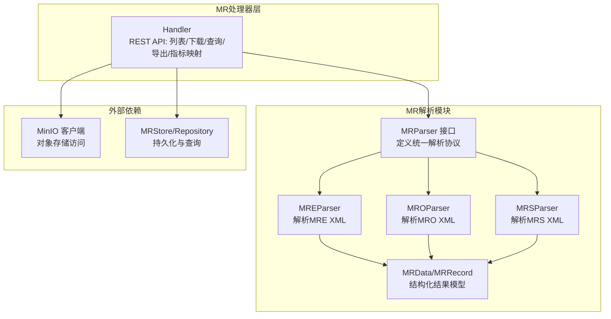
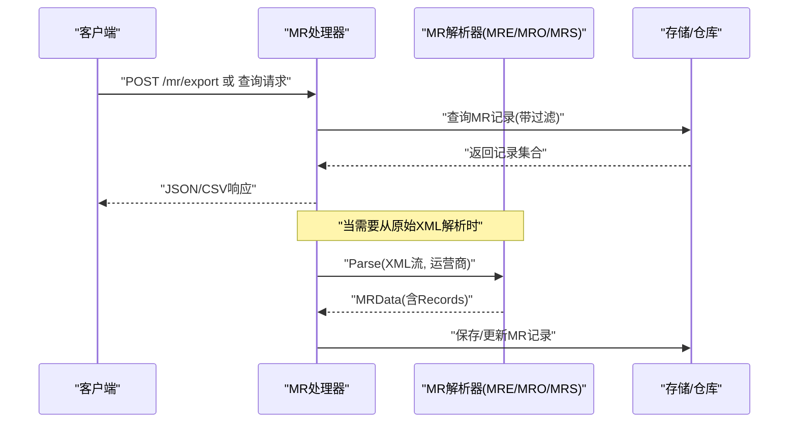
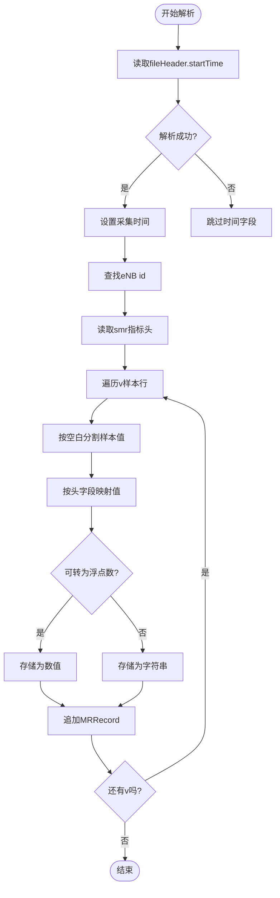
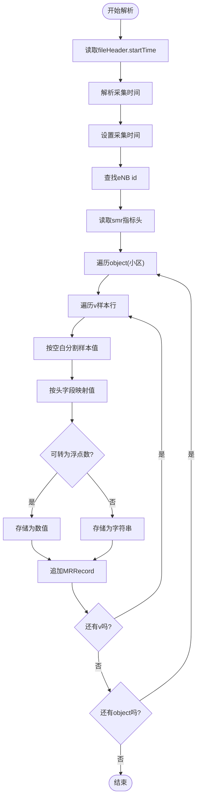
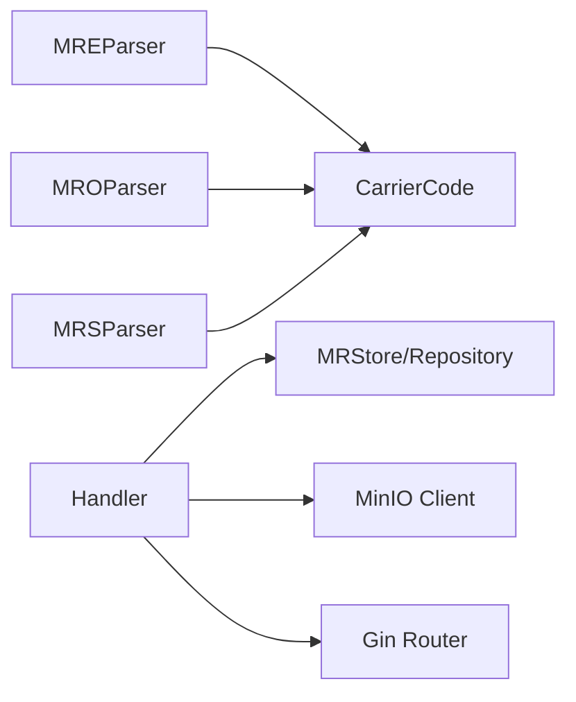

# MR数据解析

<cite>
**本文引用的文件**
- [parser.go](file://omcgo/internal/mr/parser/parser.go)
- [mre_parser.go](file://omcgo/internal/mr/parser/mre_parser.go)
- [mro_parser.go](file://omcgo/internal/mr/parser/mro_parser.go)
- [mrs_parser.go](file://omcgo/internal/mr/parser/mrs_parser.go)
- [mre_parser_test.go](file://omcgo/internal/mr/parser/mre_parser_test.go)
- [mro_parser_test.go](file://omcgo/internal/mr/parser/mro_parser_test.go)
- [mrs_parser_test.go](file://omcgo/internal/mr/parser/mrs_parser_test.go)
- [handler.go](file://omcgo/internal/mr/handler.go)
- [sample_mre.xml](file://omcgo/test/fixtures/mr/sample_mre.xml)
- [sample_mro.xml](file://omcgo/test/fixtures/mr/sample_mro.xml)
- [sample_mrs.xml](file://omcgo/test/fixtures/mr/sample_mrs.xml)
</cite>

## 目录
1. [简介](#简介)
2. [项目结构](#项目结构)
3. [核心组件](#核心组件)
4. [架构概览](#架构概览)
5. [详细组件分析](#详细组件分析)
6. [依赖分析](#依赖分析)
7. [性能考虑](#性能考虑)
8. [故障排查指南](#故障排查指南)
9. [结论](#结论)
10. [附录](#附录)

## 简介
本文件面向MR（Measurement Report）数据解析功能，系统性阐述MRE、MRO、MRS三类MR文件的解析算法、实现机制与数据处理流程。内容涵盖：
- XML格式MR数据的解析步骤、字段映射规则与数据验证逻辑
- MR记录的结构化处理、时间戳解析与测量数据提取
- 解析器的错误处理机制、数据清洗策略与性能优化方法
- 具体解析示例、数据格式说明与常见问题解决方案

## 项目结构
MR解析相关代码位于后端服务模块中，采用按职责分层的组织方式：
- 解析器层：分别实现MRE/MRO/MRS三种类型解析器，统一通过接口对外提供解析能力
- 处理器层：提供REST API用于文件查询、下载、数据导出与指标映射管理
- 测试夹具：提供标准XML样例，便于验证解析逻辑与边界条件



图表来源
- [parser.go:31-35](file://omcgo/internal/mr/parser/parser.go#L31-L35)
- [mre_parser.go:14-22](file://omcgo/internal/mr/parser/mre_parser.go#L14-L22)
- [mro_parser.go:14-22](file://omcgo/internal/mr/parser/mro_parser.go#L14-L22)
- [mrs_parser.go:14-21](file://omcgo/internal/mr/parser/mrs_parser.go#L14-L21)
- [handler.go:17-30](file://omcgo/internal/mr/handler.go#L17-L30)

章节来源
- [parser.go:15-35](file://omcgo/internal/mr/parser/parser.go#L15-L35)
- [handler.go:32-48](file://omcgo/internal/mr/handler.go#L32-L48)

## 核心组件
- MRParser接口：定义统一的解析入口，接收XML流与运营商标识，返回结构化的MR数据
- MRData/MRRecord模型：承载解析后的文件元信息与逐条测量记录
- MRE/MRO/MRS解析器：针对不同MR类型的XML结构进行定制化解析
- Handler：提供REST API，负责文件生命周期管理、数据查询与导出

章节来源
- [parser.go:15-35](file://omcgo/internal/mr/parser/parser.go#L15-L35)
- [mre_parser.go:24-127](file://omcgo/internal/mr/parser/mre_parser.go#L24-L127)
- [mro_parser.go:45-144](file://omcgo/internal/mr/parser/mro_parser.go#L45-L144)
- [mrs_parser.go:23-122](file://omcgo/internal/mr/parser/mrs_parser.go#L23-L122)
- [handler.go:17-48](file://omcgo/internal/mr/handler.go#L17-L48)

## 架构概览
MR解析的整体流程如下：
- 文件上传或发现后，由处理器触发解析
- 解析器基于XML流式解析，提取文件头时间戳、设备ID、测量头字段与样本值
- 将每条样本转换为MRRecord，聚合到MRData中
- 结果可直接返回或写入存储，供后续查询与导出



图表来源
- [handler.go:371-448](file://omcgo/internal/mr/handler.go#L371-L448)
- [parser.go:31-35](file://omcgo/internal/mr/parser/parser.go#L31-L35)

## 详细组件分析

### MRParser接口与数据模型
- 接口职责：统一解析入口，屏蔽不同MR类型的差异
- 数据模型：
  - MRData：包含文件标识、设备序列号、MR类型、采集时间与记录数组
  - MRRecord：包含时间戳、小区ID与测量数据字典（键为指标名，值为数值或字符串）

```mermaid
classDiagram
class MRParser {
+Parse(r, carrier) MRData
}
class MRData {
+uuid 文件ID
+string 设备SN
+string MR类型
+time 采集时间
+[]MRRecord 记录
}
class MRRecord {
+time 时间
+string 小区ID
+map[string]interface{} 测量数据
}
MRParser --> MRData : "生成"
MRData --> MRRecord : "包含"
```

图表来源
- [parser.go:31-35](file://omcgo/internal/mr/parser/parser.go#L31-L35)
- [parser.go:15-29](file://omcgo/internal/mr/parser/parser.go#L15-L29)

章节来源
- [parser.go:15-35](file://omcgo/internal/mr/parser/parser.go#L15-L35)

### MRE解析器（终端能力类）
- 支持场景：解析MRE XML，提取UE能力相关信息
- 关键限制：CUCC不支持MRE，遇到该运营商将返回“不支持”错误
- 解析要点：
  - 从fileHeader.startTime解析采集时间，支持两种时间格式
  - 从eNB id获取设备SN
  - 从measurement下smr提取指标头字段，从每个object下的v行提取样本值
  - 将样本值按头字段一一对应，尝试解析为浮点数，否则保留字符串
  - 每个样本生成一条MRRecord



图表来源
- [mre_parser.go:24-127](file://omcgo/internal/mr/parser/mre_parser.go#L24-L127)

章节来源
- [mre_parser.go:14-22](file://omcgo/internal/mr/parser/mre_parser.go#L14-L22)
- [mre_parser.go:24-127](file://omcgo/internal/mr/parser/mre_parser.go#L24-L127)
- [mre_parser_test.go:13-59](file://omcgo/internal/mr/parser/mre_parser_test.go#L13-L59)
- [sample_mre.xml:1-14](file://omcgo/test/fixtures/mr/sample_mre.xml#L1-L14)

### MRO解析器（优化类）
- 支持场景：解析MRO XML，包含服务小区与邻区的RSRP、RSRQ、SINR等指标
- 解析要点：
  - 同步解析采集时间、设备SN与指标头字段
  - 针对每个object（小区）生成多条样本记录
  - 数值解析策略与MRE一致



图表来源
- [mro_parser.go:45-144](file://omcgo/internal/mr/parser/mro_parser.go#L45-L144)

章节来源
- [mro_parser.go:14-22](file://omcgo/internal/mr/parser/mro_parser.go#L14-L22)
- [mro_parser.go:45-144](file://omcgo/internal/mr/parser/mro_parser.go#L45-L144)
- [mro_parser_test.go:12-46](file://omcgo/internal/mr/parser/mro_parser_test.go#L12-L46)
- [sample_mro.xml:1-19](file://omcgo/test/fixtures/mr/sample_mro.xml#L1-L19)

### MRS解析器（统计类）
- 支持场景：解析MRS XML，包含各RSRP区间的统计分布
- 解析要点：
  - 与MRO类似，但样本通常表示区间频次而非瞬时观测
  - 指标头字段多为MR.RSRP.xx形式


图表来源
- [mrs_parser.go:23-122](file://omcgo/internal/mr/parser/mrs_parser.go#L23-L122)

章节来源
- [mrs_parser.go:14-21](file://omcgo/internal/mr/parser/mrs_parser.go#L14-L21)
- [mrs_parser.go:23-122](file://omcgo/internal/mr/parser/mrs_parser.go#L23-L122)
- [mrs_parser_test.go:12-41](file://omcgo/internal/mr/parser/mrs_parser_test.go#L12-L41)
- [sample_mrs.xml:1-16](file://omcgo/test/fixtures/mr/sample_mrs.xml#L1-L16)

### 字段映射规则与数据验证
- 指标头字段（smr）：按空白分割得到指标名列表
- 样本值（v）：按空白分割，与指标头一一对应
- 数值解析：优先尝试浮点数解析；失败则保留原字符串，便于后续清洗
- 时间戳解析：支持两种ISO时间格式；若均失败则记录为零值（需上层校验）
- 设备与小区：从fileHeader与object属性中提取，作为记录维度字段

章节来源
- [mre_parser.go:68-113](file://omcgo/internal/mr/parser/mre_parser.go#L68-L113)
- [mro_parser.go:85-130](file://omcgo/internal/mr/parser/mro_parser.go#L85-L130)
- [mrs_parser.go:63-108](file://omcgo/internal/mr/parser/mrs_parser.go#L63-L108)

### 错误处理机制
- 不支持的运营商：如MRE在CUCC场景直接返回“不支持”错误
- XML解码异常：捕获解码错误并包装为可识别的解析错误
- 无记录：若解析完成后未生成任何记录，返回“未找到记录”错误
- 输入参数校验：处理器对查询参数进行格式校验，非法参数返回400

章节来源
- [mre_parser.go:24-27](file://omcgo/internal/mr/parser/mre_parser.go#L24-L27)
- [mre_parser.go:122-124](file://omcgo/internal/mr/parser/mre_parser.go#L122-L124)
- [mro_parser.go:139-141](file://omcgo/internal/mr/parser/mro_parser.go#L139-L141)
- [mrs_parser.go:117-119](file://omcgo/internal/mr/parser/mrs_parser.go#L117-L119)
- [handler.go:58-95](file://omcgo/internal/mr/handler.go#L58-L95)

### 数据清洗策略
- 数值解析失败回退：将无法解析为数值的字段保留为字符串，避免丢失信息
- 空记录过滤：仅在生成有效记录后才返回结果
- 时间字段校验：建议上层对零值时间进行二次校验与补全
- 指标头一致性：确保smr与v列数一致，不一致时丢弃该样本或进行截断/填充

章节来源
- [mre_parser.go:99-106](file://omcgo/internal/mr/parser/mre_parser.go#L99-L106)
- [mro_parser.go:116-124](file://omcgo/internal/mr/parser/mro_parser.go#L116-L124)
- [mrs_parser.go:94-102](file://omcgo/internal/mr/parser/mrs_parser.go#L94-L102)

### 性能优化方法
- 流式解析：使用XML Decoder逐令牌解析，降低内存占用
- 批量导出：处理器默认分页大小较大，减少多次往返
- 对象存储直传：下载文件时直接从MinIO读取并透传，避免本地落盘
- 指标映射缓存：建议在查询阶段复用已加载的指标映射，减少重复查询

章节来源
- [handler.go:371-448](file://omcgo/internal/mr/handler.go#L371-L448)
- [handler.go:97-131](file://omcgo/internal/mr/handler.go#L97-L131)

## 依赖分析
- 组件耦合：
  - 解析器依赖CarrierCode进行能力控制（如MRE对CUCC禁用）
  - 处理器依赖存储与对象存储，负责数据持久化与文件下载
- 外部依赖：
  - MinIO客户端：用于对象存储访问
  - Gin路由：提供REST API
  - 标准库：encoding/xml、encoding/csv、time、json等



图表来源
- [mre_parser.go:24-27](file://omcgo/internal/mr/parser/mre_parser.go#L24-L27)
- [handler.go:17-30](file://omcgo/internal/mr/handler.go#L17-L30)

章节来源
- [mre_parser.go:24-27](file://omcgo/internal/mr/parser/mre_parser.go#L24-L27)
- [handler.go:17-30](file://omcgo/internal/mr/handler.go#L17-L30)

## 性能考虑
- 内存占用：XML流式解析避免一次性加载整个文件
- CPU开销：数值解析与字符串分割为O(n)操作，n为样本字段数
- I/O优化：导出CSV时直接写入HTTP响应，减少中间缓冲
- 可扩展性：解析器接口统一，新增MR类型只需实现新解析器

## 故障排查指南
- “未找到记录”错误：检查XML是否包含有效样本，确认smr与v字段数量一致
- “不支持”错误：确认运营商配置与MR类型匹配（如CUCC不支持MRE）
- 时间解析失败：确认fileHeader.startTime格式符合预期
- 下载失败：检查MinIO连接与桶权限
- 导出为空：确认查询条件（设备ID、时间范围、MR类型）是否过于严格

章节来源
- [mre_parser_test.go:30-36](file://omcgo/internal/mr/parser/mre_parser_test.go#L30-L36)
- [mro_parser_test.go:34-45](file://omcgo/internal/mr/parser/mro_parser_test.go#L34-L45)
- [mrs_parser_test.go:30-40](file://omcgo/internal/mr/parser/mrs_parser_test.go#L30-L40)
- [handler.go:97-131](file://omcgo/internal/mr/handler.go#L97-L131)

## 结论
本模块通过统一的MRParser接口与三类专用解析器，实现了对MRE/MRO/MRS XML的稳定解析。结合处理器提供的查询与导出能力，能够高效地完成MR数据的采集、清洗与应用。建议在生产环境中配合指标映射与数据校验策略，进一步提升解析质量与系统鲁棒性。

## 附录

### 数据格式说明
- MRData
  - file_id: 文件唯一标识
  - device_sn: 设备序列号
  - mr_type: MR类型（mre/mro/mrs）
  - collect_time: 采集时间
  - records: 记录数组
- MRRecord
  - time: 采样时间
  - cell_id: 小区ID
  - measurement_data: 指标名到值的映射

章节来源
- [parser.go:15-29](file://omcgo/internal/mr/parser/parser.go#L15-L29)

### 解析示例
- MRE示例：参考测试夹具与测试用例
  - 示例路径：[sample_mre.xml:1-14](file://omcgo/test/fixtures/mr/sample_mre.xml#L1-L14)
  - 行为验证：[mre_parser_test.go:13-28](file://omcgo/internal/mr/parser/mre_parser_test.go#L13-L28)
- MRO示例：参考测试夹具与测试用例
  - 示例路径：[sample_mro.xml:1-19](file://omcgo/test/fixtures/mr/sample_mro.xml#L1-L19)
  - 行为验证：[mro_parser_test.go:12-32](file://omcgo/internal/mr/parser/mro_parser_test.go#L12-L32)
- MRS示例：参考测试夹具与测试用例
  - 示例路径：[sample_mrs.xml:1-16](file://omcgo/test/fixtures/mr/sample_mrs.xml#L1-L16)
  - 行为验证：[mrs_parser_test.go:12-28](file://omcgo/internal/mr/parser/mrs_parser_test.go#L12-L28)

### 常见解析问题与解决方案
- 无记录：确认XML中存在有效的smr与v节点
- 数值解析失败：保留字符串并在下游进行类型转换
- 时间格式不符：确保fileHeader.startTime符合支持格式
- 运营商不支持：根据CarrierCode调整MR类型选择

章节来源
- [mre_parser.go:122-124](file://omcgo/internal/mr/parser/mre_parser.go#L122-L124)
- [mro_parser.go:139-141](file://omcgo/internal/mr/parser/mro_parser.go#L139-L141)
- [mrs_parser.go:117-119](file://omcgo/internal/mr/parser/mrs_parser.go#L117-L119)