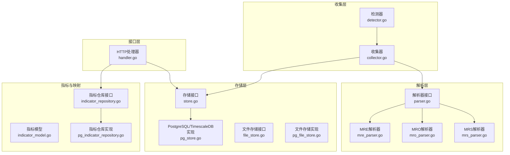
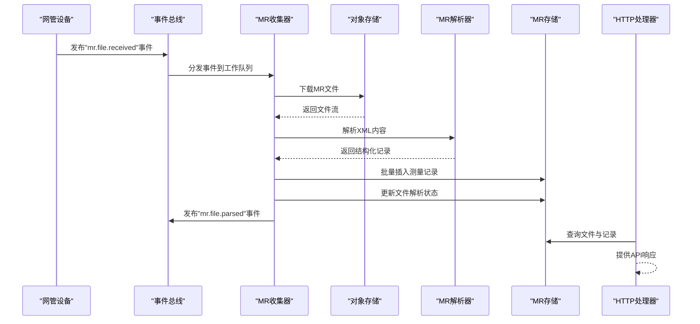
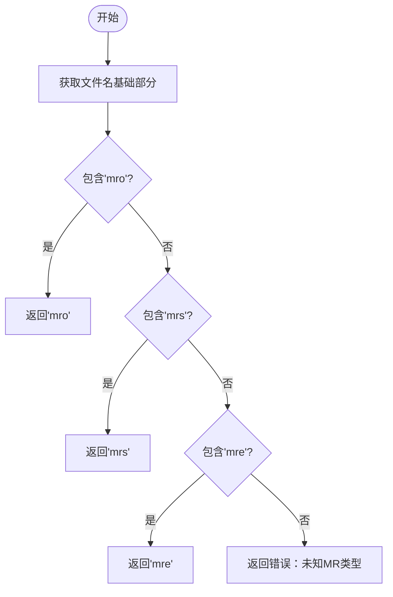
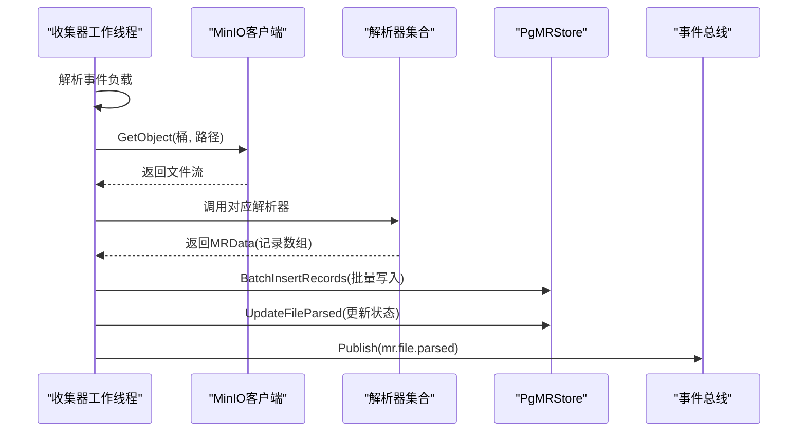
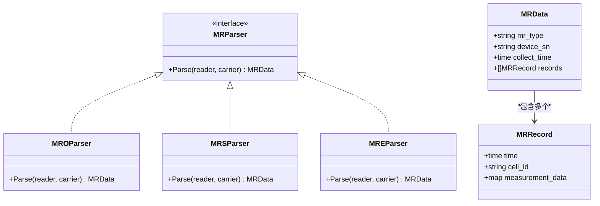
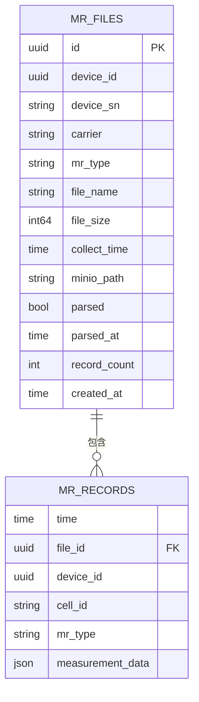
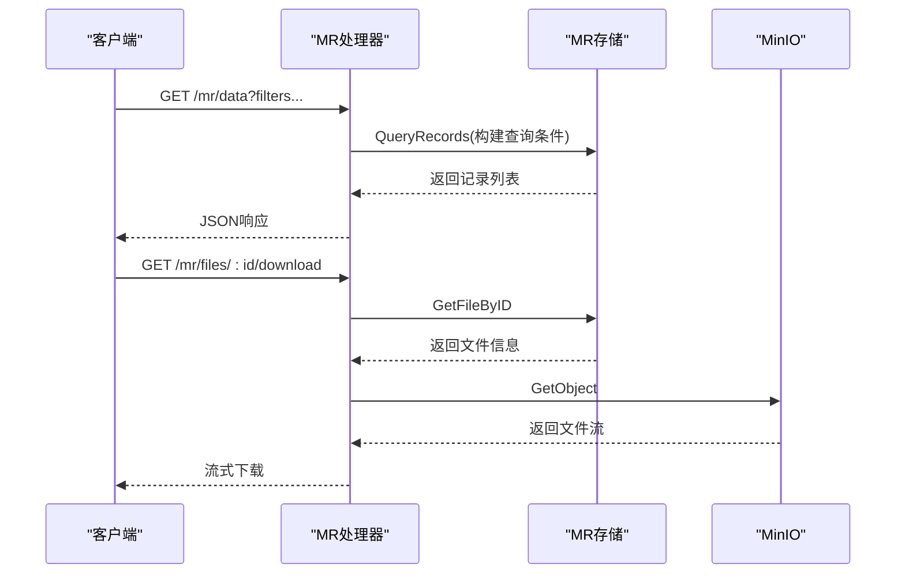
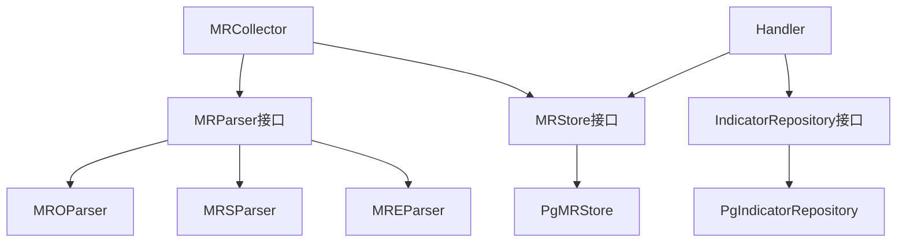

# MR数据采集

<cite>
**本文引用的文件**
- [omcgo/internal/mr/collector/detector.go](file://omcgo/internal/mr/collector/detector.go)
- [omcgo/internal/mr/collector/collector.go](file://omcgo/internal/mr/collector/collector.go)
- [omcgo/internal/mr/parser/parser.go](file://omcgo/internal/mr/parser/parser.go)
- [omcgo/internal/mr/parser/mre_parser.go](file://omcgo/internal/mr/parser/mre_parser.go)
- [omcgo/internal/mr/parser/mro_parser.go](file://omcgo/internal/mr/parser/mro_parser.go)
- [omcgo/internal/mr/parser/mrs_parser.go](file://omcgo/internal/mr/parser/mrs_parser.go)
- [omcgo/internal/mr/store.go](file://omcgo/internal/mr/store.go)
- [omcgo/internal/mr/pg_store.go](file://omcgo/internal/mr/pg_store.go)
- [omcgo/internal/mr/handler.go](file://omcgo/internal/mr/handler.go)
- [omcgo/internal/mr/indicator_model.go](file://omcgo/internal/mr/indicator_model.go)
- [omcgo/internal/mr/indicator_repository.go](file://omcgo/internal/mr/indicator_repository.go)
- [omcgo/internal/mr/pg_indicator_repository.go](file://omcgo/internal/mr/pg_indicator_repository.go)
- [omcgo/internal/mr/pg_file_store.go](file://omcgo/internal/mr/pg_file_store.go)
- [omcgo/internal/mr/task_model.go](file://omcgo/internal/mr/task_model.go)
- [omcgo/internal/mr/task_repository.go](file://omcgo/internal/mr/task_repository.go)
- [omcgo/internal/mr/threshold_model.go](file://omcgo/internal/mr/threshold_model.go)
- [omcgo/internal/mr/threshold_repository.go](file://omcgo/internal/mr/threshold_repository.go)
- [omcgo/internal/mr/pm_handler.go](file://omcgo/internal/mr/pm_handler.go)
- [omcgo/internal/mr/pm_task_repository.go](file://omcgo/internal/mr/pm_task_repository.go)
- [omcgo/internal/mr/pm_file_store.go](file://omcgo/internal/mr/pm_file_store.go)
- [omcgo/internal/mr/file_store.go](file://omcgo/internal/mr/file_store.go)
- [omcgo/internal/mr/handler_test.go](file://omcgo/internal/mr/handler_test.go)
- [omcgo/internal/mr/collector/detector_test.go](file://omcgo/internal/mr/collector/detector_test.go)
- [omcgo/internal/mr/parser/mre_parser_test.go](file://omcgo/internal/mr/parser/mre_parser_test.go)
- [omcgo/internal/mr/parser/mro_parser_test.go](file://omcgo/internal/mr/parser/mro_parser_test.go)
- [omcgo/internal/mr/parser/mrs_parser_test.go](file://omcgo/internal/mr/parser/mrs_parser_test.go)
- [omcgo/internal/mr/pg_store_test.go](file://omcgo/internal/mr/pg_store_test.go)
- [omcgo/internal/mr/pg_indicator_repository_test.go](file://omcgo/internal/mr/pg_indicator_repository_test.go)
- [omcgo/internal/mr/pm_file_store_test.go](file://omcgo/internal/mr/pm_file_store_test.go)
- [omcgo/internal/mr/pm_task_repository_test.go](file://omcgo/internal/mr/pm_task_repository_test.go)
- [omcgo/internal/mr/test/fixtures/mr/mro_sample.xml](file://omcgo/internal/mr/test/fixtures/mr/mro_sample.xml)
- [omcgo/internal/mr/test/fixtures/mr/mrs_sample.xml](file://omcgo/internal/mr/test/fixtures/mr/mrs_sample.xml)
- [omcgo/internal/mr/test/fixtures/mr/mre_sample.xml](file://omcgo/internal/mr/test/fixtures/mr/mre_sample.xml)
</cite>

## 目录
1. [简介](#简介)
2. [项目结构](#项目结构)
3. [核心组件](#核心组件)
4. [架构概览](#架构概览)
5. [详细组件分析](#详细组件分析)
6. [依赖关系分析](#依赖关系分析)
7. [性能考虑](#性能考虑)
8. [故障排除指南](#故障排除指南)
9. [结论](#结论)
10. [附录](#附录)

## 简介
本文件为MR（Measurement Report）数据采集功能的技术文档，涵盖MR文件的自动检测与收集机制、MRE/MRO/MRS等不同类型的MR文件识别与处理、上传流程、存储策略与文件格式验证、批量导入机制、文件完整性检查与错误处理策略，并提供最佳实践、性能优化技巧与故障排除指南。文档同时包含具体的MR文件处理示例、API使用方法与常见问题解决方案。

## 项目结构
MR数据采集功能主要位于omcgo/internal/mr目录下，采用分层架构设计：
- 收集层：负责接收事件、下载文件、类型检测、解析与入库
- 解析层：针对MRE/MRO/MRS三种XML格式进行解析
- 存储层：提供PostgreSQL/TimescaleDB的数据持久化能力
- 接口层：提供REST API用于文件查询、数据检索与导出
- 指标与映射：维护MR指标定义与设备映射配置

**图表来源**
- [omcgo/internal/mr/collector/detector.go:1-37](file://omcgo/internal/mr/collector/detector.go#L1-L37)
- [omcgo/internal/mr/collector/collector.go:1-182](file://omcgo/internal/mr/collector/collector.go#L1-L182)
- [omcgo/internal/mr/parser/parser.go:1-35](file://omcgo/internal/mr/parser/parser.go#L1-L35)
- [omcgo/internal/mr/parser/mre_parser.go:1-128](file://omcgo/internal/mr/parser/mre_parser.go#L1-L128)
- [omcgo/internal/mr/parser/mro_parser.go:1-145](file://omcgo/internal/mr/parser/mro_parser.go#L1-L145)
- [omcgo/internal/mr/parser/mrs_parser.go:1-123](file://omcgo/internal/mr/parser/mrs_parser.go#L1-L123)
- [omcgo/internal/mr/store.go:1-68](file://omcgo/internal/mr/store.go#L1-L68)
- [omcgo/internal/mr/pg_store.go:1-208](file://omcgo/internal/mr/pg_store.go#L1-L208)
- [omcgo/internal/mr/handler.go:1-449](file://omcgo/internal/mr/handler.go#L1-L449)
- [omcgo/internal/mr/indicator_model.go:1-51](file://omcgo/internal/mr/indicator_model.go#L1-L51)
- [omcgo/internal/mr/indicator_repository.go:1-23](file://omcgo/internal/mr/indicator_repository.go#L1-L23)
- [omcgo/internal/mr/pg_indicator_repository.go:1-353](file://omcgo/internal/mr/pg_indicator_repository.go#L1-L353)

**章节来源**
- [omcgo/internal/mr/collector/detector.go:1-37](file://omcgo/internal/mr/collector/detector.go#L1-L37)
- [omcgo/internal/mr/collector/collector.go:1-182](file://omcgo/internal/mr/collector/collector.go#L1-L182)
- [omcgo/internal/mr/parser/parser.go:1-35](file://omcgo/internal/mr/parser/parser.go#L1-L35)
- [omcgo/internal/mr/parser/mre_parser.go:1-128](file://omcgo/internal/mr/parser/mre_parser.go#L1-L128)
- [omcgo/internal/mr/parser/mro_parser.go:1-145](file://omcgo/internal/mr/parser/mro_parser.go#L1-L145)
- [omcgo/internal/mr/parser/mrs_parser.go:1-123](file://omcgo/internal/mr/parser/mrs_parser.go#L1-L123)
- [omcgo/internal/mr/store.go:1-68](file://omcgo/internal/mr/store.go#L1-L68)
- [omcgo/internal/mr/pg_store.go:1-208](file://omcgo/internal/mr/pg_store.go#L1-L208)
- [omcgo/internal/mr/handler.go:1-449](file://omcgo/internal/mr/handler.go#L1-L449)
- [omcgo/internal/mr/indicator_model.go:1-51](file://omcgo/internal/mr/indicator_model.go#L1-L51)
- [omcgo/internal/mr/indicator_repository.go:1-23](file://omcgo/internal/mr/indicator_repository.go#L1-L23)
- [omcgo/internal/mr/pg_indicator_repository.go:1-353](file://omcgo/internal/mr/pg_indicator_repository.go#L1-L353)

## 核心组件
- MR文件类型检测器：基于文件名模式识别MRE/MRO/MRS类型
- MR收集器：订阅事件、下载文件、解析并批量写入数据库
- MR解析器：分别处理MRE/MRO/MRS XML格式，提取测量记录
- MR存储接口与实现：提供文件元数据与测量记录的持久化
- HTTP处理器：提供文件查询、数据检索与导出API
- 指标与映射：维护MR指标定义与设备映射配置

**章节来源**
- [omcgo/internal/mr/collector/detector.go:16-36](file://omcgo/internal/mr/collector/detector.go#L16-L36)
- [omcgo/internal/mr/collector/collector.go:29-74](file://omcgo/internal/mr/collector/collector.go#L29-L74)
- [omcgo/internal/mr/parser/parser.go:31-34](file://omcgo/internal/mr/parser/parser.go#L31-L34)
- [omcgo/internal/mr/store.go:59-67](file://omcgo/internal/mr/store.go#L59-L67)
- [omcgo/internal/mr/handler.go:32-48](file://omcgo/internal/mr/handler.go#L32-L48)
- [omcgo/internal/mr/indicator_model.go:10-36](file://omcgo/internal/mr/indicator_model.go#L10-L36)

## 架构概览
MR数据采集采用事件驱动架构，通过消息队列接收MR文件到达事件，触发收集器执行下载、解析与入库流程，并发布解析完成事件供后续处理。

**图表来源**
- [omcgo/internal/mr/collector/collector.go:62-74](file://omcgo/internal/mr/collector/collector.go#L62-L74)
- [omcgo/internal/mr/collector/collector.go:124-157](file://omcgo/internal/mr/collector/collector.go#L124-L157)
- [omcgo/internal/mr/handler.go:58-95](file://omcgo/internal/mr/handler.go#L58-L95)

## 详细组件分析

### 文件类型检测与识别
- 支持的MR类型：mro、mrs、mre
- 检测规则：基于文件名包含特定关键词（大小写不敏感）
- 不支持的组合：联通（CUCC）不支持MRE类型

**图表来源**
- [omcgo/internal/mr/collector/detector.go:16-31](file://omcgo/internal/mr/collector/detector.go#L16-L31)

**章节来源**
- [omcgo/internal/mr/collector/detector.go:9-36](file://omcgo/internal/mr/collector/detector.go#L9-L36)

### MR文件收集与处理流程
- 订阅事件主题：mr.file.received
- 下载文件：从MinIO读取对象流
- 类型检测：根据文件名判断MR类型
- 解析：调用对应解析器生成结构化记录
- 批量入库：使用CopyFrom高效写入TimescaleDB
- 状态更新：标记文件解析完成并记录记录数
- 事件发布：发布mr.file.parsed事件

**图表来源**
- [omcgo/internal/mr/collector/collector.go:76-181](file://omcgo/internal/mr/collector/collector.go#L76-L181)
- [omcgo/internal/mr/pg_store.go:56-78](file://omcgo/internal/mr/pg_store.go#L56-L78)

**章节来源**
- [omcgo/internal/mr/collector/collector.go:29-181](file://omcgo/internal/mr/collector/collector.go#L29-L181)
- [omcgo/internal/mr/pg_store.go:19-208](file://omcgo/internal/mr/pg_store.go#L19-L208)

### MR解析器实现
- MRO解析器：解析优化类测量报告，包含RSRP、RSRQ、SINR等指标
- MRS解析器：解析统计分布类测量报告，按小区维度统计
- MRE解析器：解析UE能力信息，联通不支持该类型
- 共同特性：统一的XML解码流程，提取文件头时间戳、设备标识、测量头字段与数值行

**图表来源**
- [omcgo/internal/mr/parser/parser.go:31-34](file://omcgo/internal/mr/parser/parser.go#L31-L34)
- [omcgo/internal/mr/parser/mro_parser.go:14-145](file://omcgo/internal/mr/parser/mro_parser.go#L14-L145)
- [omcgo/internal/mr/parser/mrs_parser.go:14-123](file://omcgo/internal/mr/parser/mrs_parser.go#L14-L123)
- [omcgo/internal/mr/parser/mre_parser.go:14-128](file://omcgo/internal/mr/parser/mre_parser.go#L14-L128)

**章节来源**
- [omcgo/internal/mr/parser/mro_parser.go:14-145](file://omcgo/internal/mr/parser/mro_parser.go#L14-L145)
- [omcgo/internal/mr/parser/mrs_parser.go:14-123](file://omcgo/internal/mr/parser/mrs_parser.go#L14-L123)
- [omcgo/internal/mr/parser/mre_parser.go:14-128](file://omcgo/internal/mr/parser/mre_parser.go#L14-L128)

### 存储与数据模型
- MRFileInfo：文件元数据，包含设备信息、文件名、大小、采集时间、MinIO路径、解析状态与记录数
- MRRecordEntry：测量记录条目，包含时间、文件ID、设备ID、小区ID、MR类型与测量数据
- PgMRStore：基于PostgreSQL/TimescaleDB的实现，使用CopyFrom进行高性能批量写入
- 列表查询：支持按设备ID、MR类型、时间范围过滤，分页排序

**图表来源**
- [omcgo/internal/mr/store.go:12-27](file://omcgo/internal/mr/store.go#L12-L27)
- [omcgo/internal/mr/store.go:29-37](file://omcgo/internal/mr/store.go#L29-L37)
- [omcgo/internal/mr/pg_store.go:30-42](file://omcgo/internal/mr/pg_store.go#L30-L42)

**章节来源**
- [omcgo/internal/mr/store.go:12-67](file://omcgo/internal/mr/store.go#L12-L67)
- [omcgo/internal/mr/pg_store.go:19-208](file://omcgo/internal/mr/pg_store.go#L19-L208)

### HTTP API与查询导出
- 文件查询：支持按设备ID、MR类型、时间范围查询，分页返回
- 数据查询：支持按设备ID、文件ID、MR类型、小区ID、时间范围查询
- 文件下载：直接从MinIO下载原始XML文件
- 导出功能：支持JSON与CSV两种格式导出，CSV包含标准化字段

**图表来源**
- [omcgo/internal/mr/handler.go:133-191](file://omcgo/internal/mr/handler.go#L133-L191)
- [omcgo/internal/mr/handler.go:97-131](file://omcgo/internal/mr/handler.go#L97-L131)

**章节来源**
- [omcgo/internal/mr/handler.go:32-48](file://omcgo/internal/mr/handler.go#L32-L48)
- [omcgo/internal/mr/handler.go:58-95](file://omcgo/internal/mr/handler.go#L58-L95)
- [omcgo/internal/mr/handler.go:143-191](file://omcgo/internal/mr/handler.go#L143-L191)
- [omcgo/internal/mr/handler.go:371-424](file://omcgo/internal/mr/handler.go#L371-L424)

### 指标与设备映射
- MRIndicator：指标定义，包含名称、编码、单位、分类与数值范围
- MRDeviceMapping：设备映射配置，关联设备SN、小区ID、采样间隔与启用状态
- 仓库接口：提供列表、查询与更新操作
- 实现：基于PostgreSQL的查询与更新

**章节来源**
- [omcgo/internal/mr/indicator_model.go:10-50](file://omcgo/internal/mr/indicator_model.go#L10-L50)
- [omcgo/internal/mr/indicator_repository.go:10-22](file://omcgo/internal/mr/indicator_repository.go#L10-L22)
- [omcgo/internal/mr/pg_indicator_repository.go:35-353](file://omcgo/internal/mr/pg_indicator_repository.go#L35-L353)

## 依赖关系分析
MR模块内部依赖清晰，遵循接口隔离原则：
- 收集器依赖解析器接口与存储接口，便于扩展新类型解析器
- 解析器独立于存储，专注于XML解析逻辑
- 存储实现依赖数据库访问库，提供高性能批量写入
- 处理器依赖存储与仓库接口，提供REST API

**图表来源**
- [omcgo/internal/mr/collector/collector.go:30-60](file://omcgo/internal/mr/collector/collector.go#L30-L60)
- [omcgo/internal/mr/parser/parser.go:31-34](file://omcgo/internal/mr/parser/parser.go#L31-L34)
- [omcgo/internal/mr/store.go:59-67](file://omcgo/internal/mr/store.go#L59-L67)
- [omcgo/internal/mr/handler.go:18-30](file://omcgo/internal/mr/handler.go#L18-L30)
- [omcgo/internal/mr/indicator_repository.go:10-22](file://omcgo/internal/mr/indicator_repository.go#L10-L22)

**章节来源**
- [omcgo/internal/mr/collector/collector.go:29-60](file://omcgo/internal/mr/collector/collector.go#L29-L60)
- [omcgo/internal/mr/parser/parser.go:31-34](file://omcgo/internal/mr/parser/parser.go#L31-L34)
- [omcgo/internal/mr/store.go:59-67](file://omcgo/internal/mr/store.go#L59-L67)
- [omcgo/internal/mr/handler.go:18-30](file://omcgo/internal/mr/handler.go#L18-L30)
- [omcgo/internal/mr/indicator_repository.go:10-22](file://omcgo/internal/mr/indicator_repository.go#L10-L22)

## 性能考虑
- 批量写入：使用PostgreSQL CopyFrom进行高性能批量插入，减少网络往返
- 时间序列存储：测量记录存储在TimescaleDB中，优化时间序列查询
- 分页查询：默认每页10000条记录，避免大结果集内存占用
- 内存管理：解析器使用流式XML解码，逐条处理记录
- 缓存策略：建议在应用层缓存常用指标定义与设备映射配置

[本节为通用性能指导，无需具体文件分析]

## 故障排除指南
- 文件类型识别失败：检查文件名是否包含'mro'/'mrs'/'mre'关键词
- 解析错误：确认XML格式符合标准，检查文件头时间戳与测量字段
- 数据库连接异常：检查PostgreSQL/TimescaleDB连接参数与网络连通性
- 导出为空：确认查询条件是否过于严格，检查记录是否已成功入库
- 权限问题：确保MinIO访问权限正确，能够读取指定桶与路径

**章节来源**
- [omcgo/internal/mr/collector/collector.go:88-92](file://omcgo/internal/mr/collector/collector.go#L88-L92)
- [omcgo/internal/mr/parser/mro_parser.go:139-141](file://omcgo/internal/mr/parser/mro_parser.go#L139-L141)
- [omcgo/internal/mr/parser/mrs_parser.go:117-119](file://omcgo/internal/mr/parser/mrs_parser.go#L117-L119)
- [omcgo/internal/mr/parser/mre_parser.go:122-124](file://omcgo/internal/mr/parser/mre_parser.go#L122-L124)

## 结论
MR数据采集功能通过事件驱动架构实现了自动化、可扩展的数据处理流程。模块化设计使得新增MR类型与优化存储策略变得简单。结合高性能的批量写入与灵活的查询导出能力，能够满足大规模MR数据的采集与分析需求。

## 附录

### MR文件处理示例
- MRO样本文件：包含eNB标识、文件头时间戳与测量记录
- MRS样本文件：包含统计分布信息与测量字段
- MRE样本文件：包含UE能力信息（联通不支持）

**章节来源**
- [omcgo/internal/mr/test/fixtures/mr/mro_sample.xml](file://omcgo/internal/mr/test/fixtures/mr/mro_sample.xml)
- [omcgo/internal/mr/test/fixtures/mr/mrs_sample.xml](file://omcgo/internal/mr/test/fixtures/mr/mrs_sample.xml)
- [omcgo/internal/mr/test/fixtures/mr/mre_sample.xml](file://omcgo/internal/mr/test/fixtures/mr/mre_sample.xml)

### API使用方法
- 文件查询：GET /api/v1/mr/files?device_id=&mr_type=&start_time=&end_time=
- 数据查询：GET /api/v1/mr/data?device_id=&file_id=&mr_type=&cell_id=&start_time=&end_time=
- 文件下载：GET /api/v1/mr/files/:id/download
- 导出数据：POST /api/v1/mr/export（支持JSON/CSV）

**章节来源**
- [omcgo/internal/mr/handler.go:36-46](file://omcgo/internal/mr/handler.go#L36-L46)
- [omcgo/internal/mr/handler.go:371-424](file://omcgo/internal/mr/handler.go#L371-L424)

### 最佳实践
- 统一文件命名规范，确保类型识别准确
- 合理设置采样间隔，平衡数据粒度与存储成本
- 定期清理历史数据，保持数据库性能
- 使用分页查询处理大数据量场景
- 建立完善的监控与告警机制

[本节为通用最佳实践建议，无需具体文件分析]