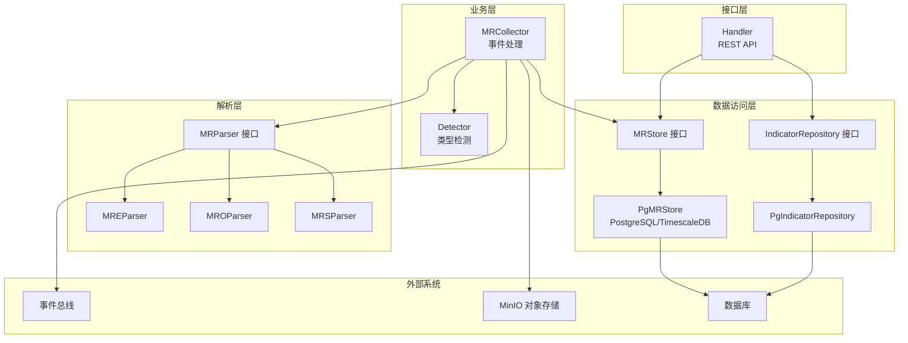
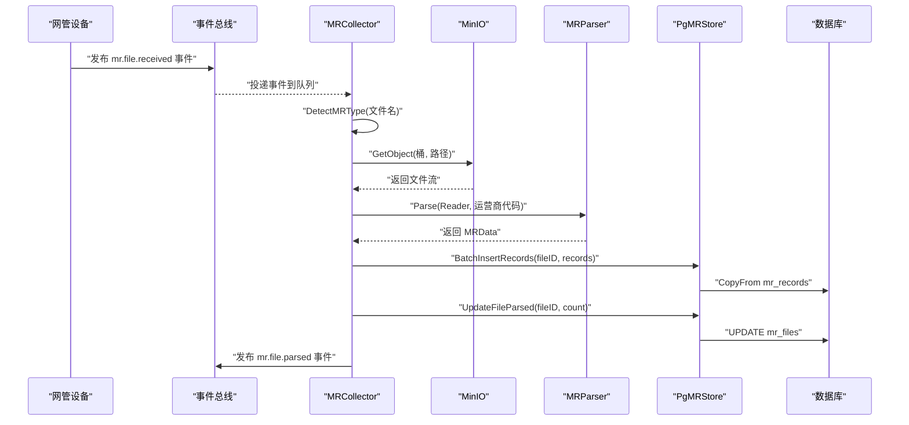
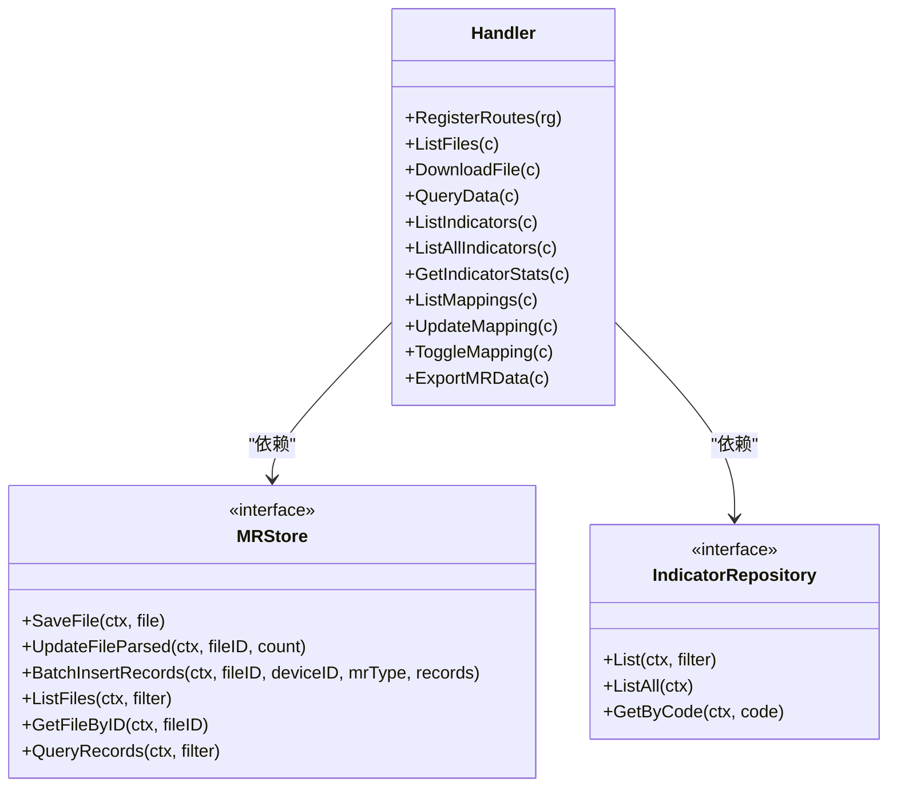
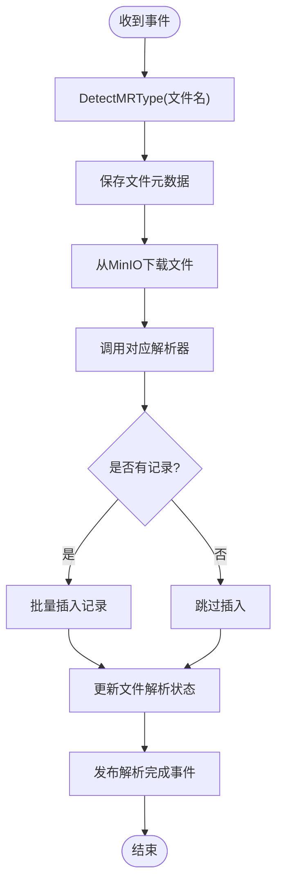
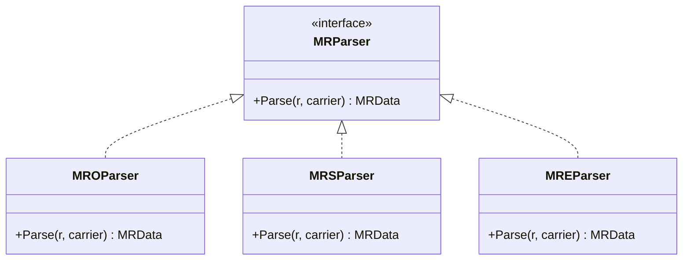
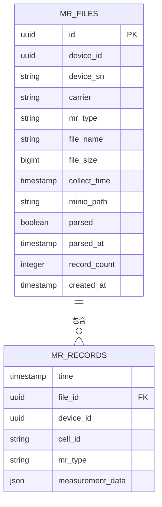
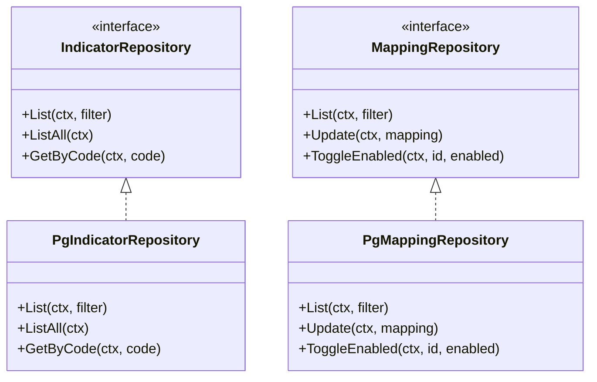
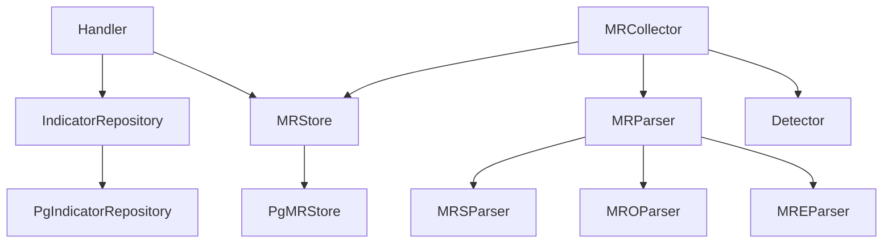

# MR管理模块

<cite>
**本文引用的文件**
- [handler.go](file://omcgo/internal/mr/handler.go)
- [store.go](file://omcgo/internal/mr/store.go)
- [indicator_model.go](file://omcgo/internal/mr/indicator_model.go)
- [indicator_repository.go](file://omcgo/internal/mr/indicator_repository.go)
- [pg_indicator_repository.go](file://omcgo/internal/mr/pg_indicator_repository.go)
- [pg_store.go](file://omcgo/internal/mr/pg_store.go)
- [parser.go](file://omcgo/internal/mr/parser/parser.go)
- [mre_parser.go](file://omcgo/internal/mr/parser/mre_parser.go)
- [mro_parser.go](file://omcgo/internal/mr/parser/mro_parser.go)
- [mrs_parser.go](file://omcgo/internal/mr/parser/mrs_parser.go)
- [collector.go](file://omcgo/internal/mr/collector/collector.go)
- [detector.go](file://omcgo/internal/mr/collector/detector.go)
- [openapi.yaml](file://omcgo/api/openapi/openapi.yaml)
- [mr_files.sql](file://omcgo/migrations/000013_create_mr_tables.up.sql)
- [mr_indicators.sql](file://omcgo/migrations/000029_create_mr_indicators.up.sql)
- [mr_task_repository.go](file://omcgo/internal/pm/task_repository.go)
- [pm_task_model.go](file://omcgo/internal/pm/task_model.go)
- [pm_file_store.go](file://omcgo/internal/pm/file_store.go)
- [pm_handler.go](file://omcgo/internal/pm/handler.go)
- [report_generator.go](file://omcgo/internal/report/generator.go)
- [report_handler.go](file://omcgo/internal/report/handler.go)
- [report_model.go](file://omcgo/internal/report/model.go)
- [report_repository.go](file://omcgo/internal/report/repository.go)
</cite>

## 目录
1. [简介](#简介)
2. [项目结构](#项目结构)
3. [核心组件](#核心组件)
4. [架构概览](#架构概览)
5. [详细组件分析](#详细组件分析)
6. [依赖关系分析](#依赖关系分析)
7. [性能考虑](#性能考虑)
8. [故障排除指南](#故障排除指南)
9. [结论](#结论)
10. [附录](#附录)

## 简介
本文件为MR管理模块的技术文档，全面阐述测量报告（Measurement Reports, MR）数据的采集、解析、存储、查询、导出及可视化的完整流程。MR数据主要包括三类文件：MRO（优化类）、MRS（统计类）、MRE（设备/终端能力类）。文档涵盖以下关键内容：
- MR文件类型识别与解析机制（MRE/MRO/MRS）
- MR数据的采集、入库与查询接口
- MR指标体系与映射配置
- MR任务调度与执行、文件上传下载、报表生成与导出
- 数据质量评估、性能优化策略与最佳实践
- API使用指南与常见问题解决方案

## 项目结构
MR管理模块位于后端服务的内部包中，采用分层架构组织：
- 接口层：REST API处理器，负责请求参数绑定、校验与响应
- 业务层：收集器（Collector），负责事件订阅、文件下载、类型检测、解析与入库
- 数据访问层：存储接口与PostgreSQL/TimescaleDB实现，提供文件与记录的持久化
- 解析层：针对不同MR类型的专用解析器
- 指标与映射：指标定义与设备映射配置的仓储实现

**图表来源**
- [handler.go:17-48](file://omcgo/internal/mr/handler.go#L17-L48)
- [collector.go:29-74](file://omcgo/internal/mr/collector/collector.go#L29-L74)
- [detector.go:16-31](file://omcgo/internal/mr/collector/detector.go#L16-L31)
- [parser.go:31-34](file://omcgo/internal/mr/parser/parser.go#L31-L34)
- [mre_parser.go:14-22](file://omcgo/internal/mr/parser/mre_parser.go#L14-L22)
- [mro_parser.go:14-22](file://omcgo/internal/mr/parser/mro_parser.go#L14-L22)
- [mrs_parser.go:14-21](file://omcgo/internal/mr/parser/mrs_parser.go#L14-L21)
- [store.go:59-67](file://omcgo/internal/mr/store.go#L59-L67)
- [pg_store.go:19-28](file://omcgo/internal/mr/pg_store.go#L19-L28)
- [indicator_repository.go:10-22](file://omcgo/internal/mr/indicator_repository.go#L10-L22)
- [pg_indicator_repository.go:35-43](file://omcgo/internal/mr/pg_indicator_repository.go#L35-L43)

**章节来源**
- [handler.go:17-48](file://omcgo/internal/mr/handler.go#L17-L48)
- [collector.go:29-74](file://omcgo/internal/mr/collector/collector.go#L29-L74)
- [store.go:59-67](file://omcgo/internal/mr/store.go#L59-L67)
- [pg_store.go:19-28](file://omcgo/internal/mr/pg_store.go#L19-L28)
- [indicator_repository.go:10-22](file://omcgo/internal/mr/indicator_repository.go#L10-L22)
- [pg_indicator_repository.go:35-43](file://omcgo/internal/mr/pg_indicator_repository.go#L35-L43)

## 核心组件
- Handler：提供MR文件列表、下载、数据查询、指标与映射管理、数据导出等REST接口
- MRCollector：订阅MR文件接收事件，完成类型检测、下载、解析、批量入库与状态更新
- Parser：统一的MR解析接口，具体实现分别处理MRE/MRO/MRS
- MRStore/PgMRStore：MR文件与记录的持久化接口与PostgreSQL/TimescaleDB实现
- IndicatorRepository/PgIndicatorRepository：MR指标与设备映射的查询与维护
- Detector：基于文件名模式识别MR类型（mro/mrs/mre）

**章节来源**
- [handler.go:17-48](file://omcgo/internal/mr/handler.go#L17-L48)
- [collector.go:29-74](file://omcgo/internal/mr/collector/collector.go#L29-L74)
- [parser.go:31-34](file://omcgo/internal/mr/parser/parser.go#L31-L34)
- [store.go:59-67](file://omcgo/internal/mr/store.go#L59-L67)
- [pg_store.go:19-28](file://omcgo/internal/mr/pg_store.go#L19-L28)
- [indicator_repository.go:10-22](file://omcgo/internal/mr/indicator_repository.go#L10-L22)
- [pg_indicator_repository.go:35-43](file://omcgo/internal/mr/pg_indicator_repository.go#L35-L43)
- [detector.go:16-31](file://omcgo/internal/mr/collector/detector.go#L16-L31)

## 架构概览
MR管理模块遵循事件驱动与分层解耦的设计原则：
- 事件驱动：通过事件总线接收MR文件到达通知，避免轮询与耦合
- 类型检测：根据文件名模式自动识别MR类型，确保后续解析正确性
- 流式解析：逐元素解析XML，构建统一的MRData结构，便于后续入库
- 批量入库：利用TimescaleDB的CopyFrom进行高性能写入
- 查询接口：提供灵活的过滤条件与分页，支持按设备、文件、时间范围等维度查询

**图表来源**
- [collector.go:62-74](file://omcgo/internal/mr/collector/collector.go#L62-L74)
- [collector.go:76-181](file://omcgo/internal/mr/collector/collector.go#L76-L181)
- [detector.go:16-31](file://omcgo/internal/mr/collector/detector.go#L16-L31)
- [parser.go:31-34](file://omcgo/internal/mr/parser/parser.go#L31-L34)
- [pg_store.go:56-78](file://omcgo/internal/mr/pg_store.go#L56-L78)

## 详细组件分析

### 接口层（Handler）
- 文件管理：列出MR文件、按ID下载文件
- 数据查询：按设备、文件、MR类型、小区、时间范围查询MR记录
- 指标管理：列出指标、按编码获取指标统计信息
- 映射管理：列出设备映射、更新映射、启用/禁用映射
- 导出功能：支持JSON/CSV格式导出MR数据

**图表来源**
- [handler.go:17-48](file://omcgo/internal/mr/handler.go#L17-L48)
- [store.go:59-67](file://omcgo/internal/mr/store.go#L59-L67)
- [indicator_repository.go:10-22](file://omcgo/internal/mr/indicator_repository.go#L10-L22)

**章节来源**
- [handler.go:32-48](file://omcgo/internal/mr/handler.go#L32-L48)
- [handler.go:58-95](file://omcgo/internal/mr/handler.go#L58-L95)
- [handler.go:97-131](file://omcgo/internal/mr/handler.go#L97-L131)
- [handler.go:143-191](file://omcgo/internal/mr/handler.go#L143-L191)
- [handler.go:195-263](file://omcgo/internal/mr/handler.go#L195-L263)
- [handler.go:280-359](file://omcgo/internal/mr/handler.go#L280-L359)
- [handler.go:371-424](file://omcgo/internal/mr/handler.go#L371-L424)
- [handler.go:426-448](file://omcgo/internal/mr/handler.go#L426-L448)

### 收集器（MRCollector）
- 订阅事件：注册mr.file.received主题，异步处理新文件
- 类型检测：根据文件名判断mro/mrs/mre
- 下载与解析：从MinIO下载文件并调用对应解析器
- 批量入库：将解析后的记录批量写入TimescaleDB
- 状态更新：标记文件解析完成并发布mr.file.parsed事件

**图表来源**
- [collector.go:62-74](file://omcgo/internal/mr/collector/collector.go#L62-L74)
- [collector.go:76-181](file://omcgo/internal/mr/collector/collector.go#L76-L181)
- [detector.go:16-31](file://omcgo/internal/mr/collector/detector.go#L16-L31)

**章节来源**
- [collector.go:29-74](file://omcgo/internal/mr/collector/collector.go#L29-L74)
- [collector.go:76-181](file://omcgo/internal/mr/collector/collector.go#L76-L181)
- [detector.go:16-31](file://omcgo/internal/mr/collector/detector.go#L16-L31)

### 解析器（Parser）
- 统一接口：MRParser.Parse(r, carrier)返回MRData
- MRO解析：解析优化类测量报告，包含RSRP、RSRQ、SINR等指标
- MRS解析：解析统计分布类测量报告，按小区聚合统计
- MRE解析：解析设备/终端能力信息，部分运营商不支持该类型

**图表来源**
- [parser.go:31-34](file://omcgo/internal/mr/parser/parser.go#L31-L34)
- [mro_parser.go:14-22](file://omcgo/internal/mr/parser/mro_parser.go#L14-L22)
- [mrs_parser.go:14-21](file://omcgo/internal/mr/parser/mrs_parser.go#L14-L21)
- [mre_parser.go:14-22](file://omcgo/internal/mr/parser/mre_parser.go#L14-L22)

**章节来源**
- [parser.go:15-34](file://omcgo/internal/mr/parser/parser.go#L15-L34)
- [mro_parser.go:45-144](file://omcgo/internal/mr/parser/mro_parser.go#L45-L144)
- [mrs_parser.go:23-122](file://omcgo/internal/mr/parser/mrs_parser.go#L23-L122)
- [mre_parser.go:24-127](file://omcgo/internal/mr/parser/mre_parser.go#L24-L127)

### 存储层（MRStore/PgMRStore）
- 文件存储：mr_files表，记录文件元数据、解析状态与记录数
- 记录存储：mr_records表，按时间序列存储测量记录，支持高效查询
- 批量写入：使用CopyFrom进行高性能批量导入
- 查询接口：支持多维过滤与分页，分别在PostgreSQL与TimescaleDB上执行

**图表来源**
- [pg_store.go:30-54](file://omcgo/internal/mr/pg_store.go#L30-L54)
- [pg_store.go:56-78](file://omcgo/internal/mr/pg_store.go#L56-L78)
- [pg_store.go:98-146](file://omcgo/internal/mr/pg_store.go#L98-L146)
- [pg_store.go:148-205](file://omcgo/internal/mr/pg_store.go#L148-L205)
- [mr_files.sql](file://omcgo/migrations/000013_create_mr_tables.up.sql)

**章节来源**
- [store.go:12-57](file://omcgo/internal/mr/store.go#L12-L57)
- [pg_store.go:30-54](file://omcgo/internal/mr/pg_store.go#L30-L54)
- [pg_store.go:56-78](file://omcgo/internal/mr/pg_store.go#L56-L78)
- [pg_store.go:98-146](file://omcgo/internal/mr/pg_store.go#L98-L146)
- [pg_store.go:148-205](file://omcgo/internal/mr/pg_store.go#L148-L205)

### 指标与映射（IndicatorRepository/PgIndicatorRepository）
- 指标定义：MR指标名称、编码、单位、分类与取值范围
- 设备映射：设备SN与小区的映射关系，控制采样间隔与启用状态
- 查询与维护：支持按分类/关键词筛选指标，按编码获取指标详情；支持更新映射与启用/禁用切换

**图表来源**
- [indicator_repository.go:10-22](file://omcgo/internal/mr/indicator_repository.go#L10-L22)
- [pg_indicator_repository.go:35-43](file://omcgo/internal/mr/pg_indicator_repository.go#L35-L43)
- [pg_indicator_repository.go:195-203](file://omcgo/internal/mr/pg_indicator_repository.go#L195-L203)

**章节来源**
- [indicator_model.go:10-50](file://omcgo/internal/mr/indicator_model.go#L10-L50)
- [indicator_repository.go:10-22](file://omcgo/internal/mr/indicator_repository.go#L10-L22)
- [pg_indicator_repository.go:45-161](file://omcgo/internal/mr/pg_indicator_repository.go#L45-L161)
- [pg_indicator_repository.go:205-313](file://omcgo/internal/mr/pg_indicator_repository.go#L205-L313)

### MR任务与报表集成
- 任务管理：PM模块提供任务创建、执行与状态管理，MR文件通常作为任务产出
- 文件存储：PM模块的文件存储与MR模块共享对象存储与数据库
- 报表生成：Report模块提供报表生成与导出能力，可结合MR数据进行分析展示

**图表来源**
- [pm_handler.go](file://omcgo/internal/pm/handler.go)
- [pm_file_store.go](file://omcgo/internal/pm/file_store.go)
- [report_generator.go](file://omcgo/internal/report/generator.go)
- [report_handler.go](file://omcgo/internal/report/handler.go)

**章节来源**
- [pm_task_repository.go](file://omcgo/internal/pm/task_repository.go)
- [pm_task_model.go](file://omcgo/internal/pm/task_model.go)
- [pm_file_store.go](file://omcgo/internal/pm/file_store.go)
- [report_generator.go](file://omcgo/internal/report/generator.go)
- [report_handler.go](file://omcgo/internal/report/handler.go)

## 依赖关系分析
- 组件内聚：各层职责清晰，接口抽象良好，降低耦合度
- 外部依赖：MinIO用于对象存储，PostgreSQL/TimescaleDB用于结构化与时序数据存储，事件总线用于异步通信
- 循环依赖：未发现循环依赖，模块间通过接口解耦
- 错误传播：解析错误、存储错误均向上抛出，由调用方或中间件处理

**图表来源**
- [handler.go:17-30](file://omcgo/internal/mr/handler.go#L17-L30)
- [collector.go:39-60](file://omcgo/internal/mr/collector/collector.go#L39-L60)
- [parser.go:31-34](file://omcgo/internal/mr/parser/parser.go#L31-L34)
- [store.go:59-67](file://omcgo/internal/mr/store.go#L59-L67)
- [pg_store.go:19-28](file://omcgo/internal/mr/pg_store.go#L19-L28)
- [indicator_repository.go:10-22](file://omcgo/internal/mr/indicator_repository.go#L10-L22)
- [pg_indicator_repository.go:35-43](file://omcgo/internal/mr/pg_indicator_repository.go#L35-L43)

**章节来源**
- [handler.go:17-30](file://omcgo/internal/mr/handler.go#L17-L30)
- [collector.go:39-60](file://omcgo/internal/mr/collector/collector.go#L39-L60)
- [store.go:59-67](file://omcgo/internal/mr/store.go#L59-L67)
- [pg_store.go:19-28](file://omcgo/internal/mr/pg_store.go#L19-L28)
- [indicator_repository.go:10-22](file://omcgo/internal/mr/indicator_repository.go#L10-L22)
- [pg_indicator_repository.go:35-43](file://omcgo/internal/mr/pg_indicator_repository.go#L35-L43)

## 性能考虑
- 批量写入：使用CopyFrom进行批量导入，显著提升写入吞吐
- 时间序列优化：mr_records表基于TimescaleDB，适合时间维度查询与聚合
- 分页与过滤：查询接口支持多维过滤与分页，避免一次性加载大量数据
- 异步处理：事件驱动避免阻塞主线程，提高并发处理能力
- 缓存策略：指标与映射查询可结合应用层缓存减少数据库压力

[本节为通用性能建议，无需特定文件来源]

## 故障排除指南
- 文件下载失败：检查MinIO连接参数与桶权限，确认文件路径与对象存在
- 解析异常：核对文件命名是否符合mro/mrs/mre模式，检查XML格式与字段一致性
- 存储错误：确认数据库连接池配置，检查mr_files与mr_records表结构
- 导出为空：检查查询条件与时间范围，确认记录已成功入库
- 事件未触发：确认事件总线订阅状态与主题名称一致

**章节来源**
- [collector.go:124-128](file://omcgo/internal/mr/collector/collector.go#L124-L128)
- [collector.go:138-145](file://omcgo/internal/mr/collector/collector.go#L138-L145)
- [pg_store.go:69-77](file://omcgo/internal/mr/pg_store.go#L69-L77)
- [handler.go:407-411](file://omcgo/internal/mr/handler.go#L407-L411)

## 结论
MR管理模块通过事件驱动与分层架构实现了MR文件的自动化采集、解析与存储，并提供了完善的查询、导出与指标管理能力。模块设计具备良好的扩展性与可维护性，能够支撑大规模MR数据的处理与分析需求。

[本节为总结性内容，无需特定文件来源]

## 附录

### API使用指南
- 文件管理
  - 列出MR文件：GET /api/v1/mr/files
  - 下载MR文件：GET /api/v1/mr/files/:id/download
- 数据查询
  - 查询MR记录：GET /api/v1/mr/data
- 指标管理
  - 列出指标：GET /api/v1/mr/indicators
  - 获取所有指标：GET /api/v1/mr/indicators/all
  - 获取指标统计：GET /api/v1/mr/indicators/:code/stats
- 映射管理
  - 列出映射：GET /api/v1/mr/mappings
  - 更新映射：PUT /api/v1/mr/mappings/:id
  - 启用/禁用映射：PUT /api/v1/mr/mappings/:id/toggle
- 数据导出
  - 导出MR数据：POST /api/v1/mr/export（支持JSON/CSV）

**章节来源**
- [handler.go:32-48](file://omcgo/internal/mr/handler.go#L32-L48)
- [openapi.yaml](file://omcgo/api/openapi/openapi.yaml)

### MR文件类型与处理
- MRO（优化类）：包含每用户样本，用于切换与干扰优化
- MRS（统计类）：包含小区级统计分布，用于覆盖率与质量评估
- MRE（设备/终端能力类）：包含UE能力信息，部分运营商不支持

**章节来源**
- [detector.go:16-31](file://omcgo/internal/mr/collector/detector.go#L16-L31)
- [mre_parser.go:14-27](file://omcgo/internal/mr/parser/mre_parser.go#L14-L27)
- [mro_parser.go:14-22](file://omcgo/internal/mr/parser/mro_parser.go#L14-L22)
- [mrs_parser.go:14-21](file://omcgo/internal/mr/parser/mrs_parser.go#L14-L21)

### 数据库表结构
- mr_files：MR文件元数据与解析状态
- mr_records：MR测量记录（时间序列）
- mr_indicators：MR指标定义
- mr_device_mappings：设备与小区映射配置

**章节来源**
- [mr_files.sql](file://omcgo/migrations/000013_create_mr_tables.up.sql)
- [mr_indicators.sql](file://omcgo/migrations/000029_create_mr_indicators.up.sql)