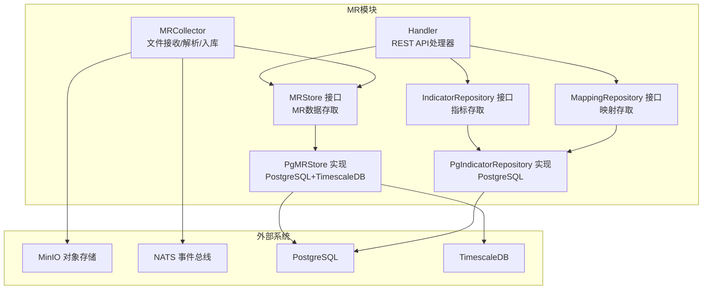
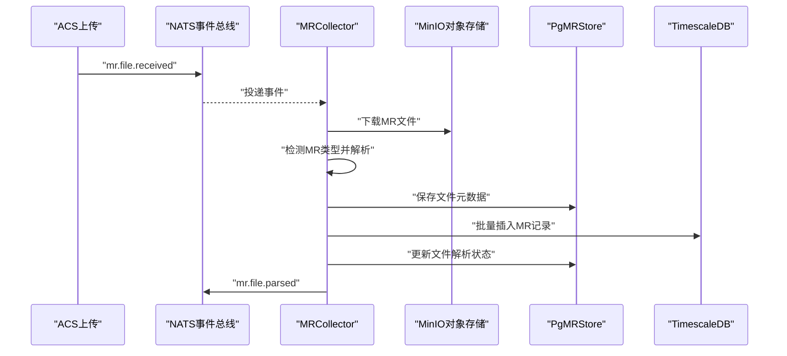
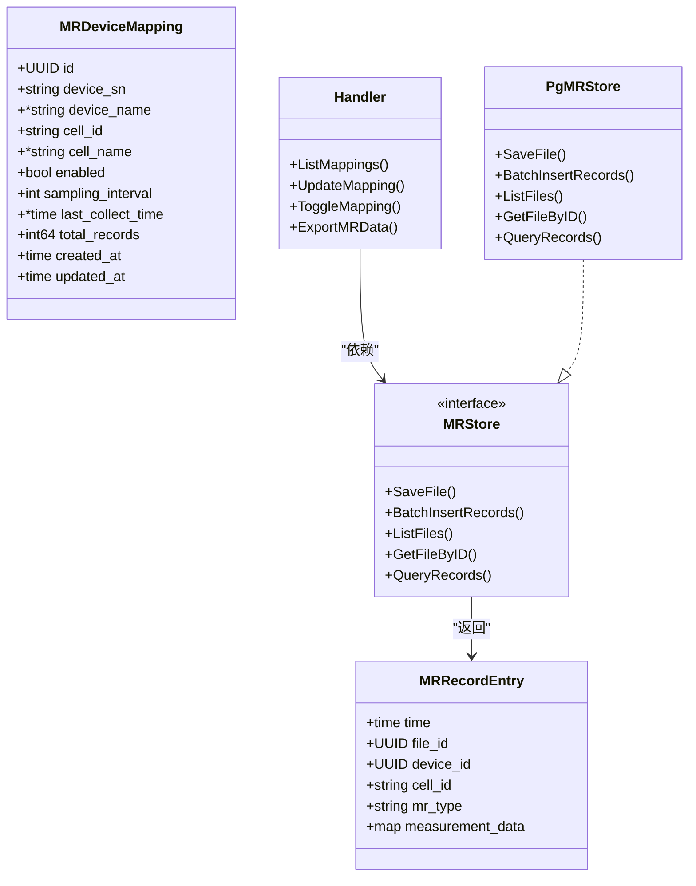
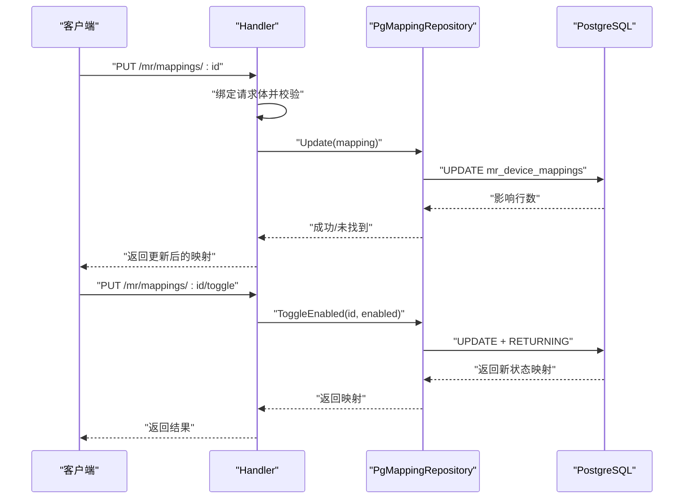
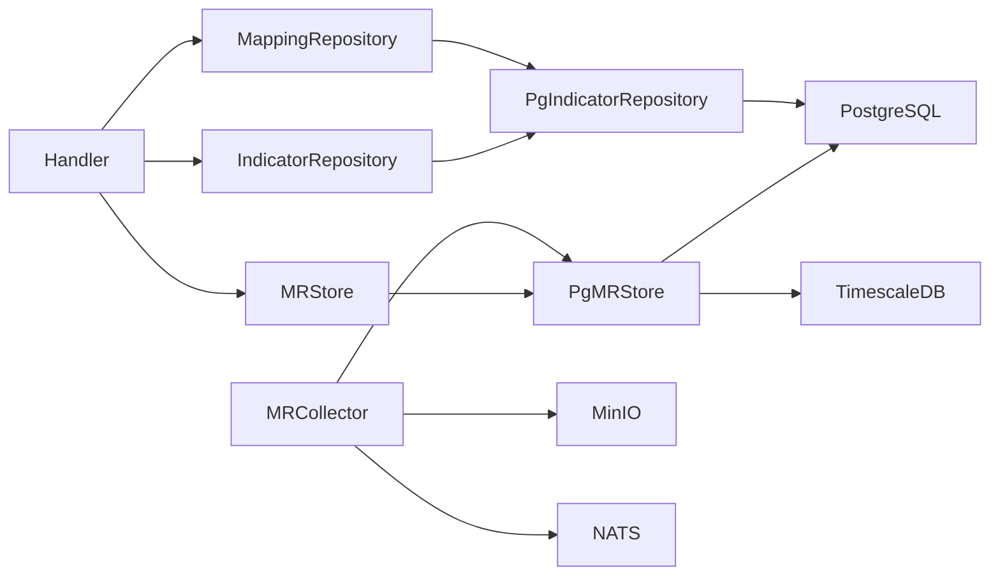

# MR设备映射

<cite>
**本文引用的文件**
- [handler.go](file://omcgo/internal/mr/handler.go)
- [store.go](file://omcgo/internal/mr/store.go)
- [indicator_model.go](file://omcgo/internal/mr/indicator_model.go)
- [indicator_repository.go](file://omcgo/internal/mr/indicator_repository.go)
- [pg_indicator_repository.go](file://omcgo/internal/mr/pg_indicator_repository.go)
- [pg_store.go](file://omcgo/internal/mr/pg_store.go)
- [collector.go](file://omcgo/internal/mr/collector/collector.go)
- [000013_create_mr_tables.up.sql](file://omcgo/migrations/000013_create_mr_tables.up.sql)
- [000029_create_mr_indicators.up.sql](file://omcgo/migrations/000029_create_mr_indicators.up.sql)
- [05-measurement-reports.md](file://omcgo/docs/features/05-measurement-reports.md)
- [13-measurement-reports.md](file://omcgo/docs/detailed-design/13-measurement-reports.md)
</cite>

## 目录
1. [简介](#简介)
2. [项目结构](#项目结构)
3. [核心组件](#核心组件)
4. [架构概览](#架构概览)
5. [详细组件分析](#详细组件分析)
6. [依赖分析](#依赖分析)
7. [性能考虑](#性能考虑)
8. [故障排除指南](#故障排除指南)
9. [结论](#结论)
10. [附录](#附录)

## 简介
本文件针对MR（Measurement Report，测量报告）设备映射功能进行深入技术文档编写，重点解释MR设备与小区之间的映射关系管理，涵盖以下方面：
- 设备序列号（DeviceSN）、小区ID（CellID）与采样间隔（SamplingInterval）的配置与作用
- 映射关系的启用/禁用机制与状态控制
- 映射关系的查询与更新流程
- 采样间隔的配置策略与默认行为
- 映射关系的数据一致性保障与性能优化
- 最佳实践、故障排除与监控告警建议
- 具体的映射配置示例、API使用方法与常见问题解决方案

## 项目结构
MR设备映射功能位于后端模块omcgo的internal/mr目录中，主要由以下层次构成：
- 接口层：REST API处理器，负责路由注册与请求参数绑定
- 存储层：MR数据持久化接口与PostgreSQL/TimescaleDB实现
- 仓储层：指标与设备映射的持久化接口与PostgreSQL实现
- 收集器：MR文件接收、解析与入库流程
- 数据模型：MR文件信息、记录条目、设备映射、指标定义等
- 迁移脚本：数据库表结构定义与索引、触发器、压缩与保留策略

图表来源
- [handler.go:17-48](file://omcgo/internal/mr/handler.go#L17-L48)
- [store.go:59-67](file://omcgo/internal/mr/store.go#L59-L67)
- [pg_store.go:19-28](file://omcgo/internal/mr/pg_store.go#L19-L28)
- [indicator_repository.go:10-22](file://omcgo/internal/mr/indicator_repository.go#L10-L22)
- [pg_indicator_repository.go:35-43](file://omcgo/internal/mr/pg_indicator_repository.go#L35-L43)
- [collector.go:29-74](file://omcgo/internal/mr/collector/collector.go#L29-L74)

章节来源
- [handler.go:17-48](file://omcgo/internal/mr/handler.go#L17-L48)
- [store.go:59-67](file://omcgo/internal/mr/store.go#L59-L67)
- [pg_store.go:19-28](file://omcgo/internal/mr/pg_store.go#L19-L28)
- [indicator_repository.go:10-22](file://omcgo/internal/mr/indicator_repository.go#L10-L22)
- [pg_indicator_repository.go:35-43](file://omcgo/internal/mr/pg_indicator_repository.go#L35-L43)
- [collector.go:29-74](file://omcgo/internal/mr/collector/collector.go#L29-L74)

## 核心组件
- Handler：提供MR相关的REST API，包括文件列表、下载、数据查询、指标查询、映射查询、更新与启用/禁用等。
- MRStore接口及PgMRStore实现：负责MR文件元数据与解析后记录的持久化，使用PostgreSQL存储文件元数据，TimescaleDB存储时序记录并具备压缩与保留策略。
- IndicatorRepository与MappingRepository接口及PgIndicatorRepository实现：提供MR指标与设备映射的查询、更新与启用/禁用控制。
- MRCollector：订阅NATS事件，从MinIO下载MR文件，识别类型，调用对应解析器解析，批量写入TimescaleDB，并发布解析完成事件。

章节来源
- [handler.go:17-48](file://omcgo/internal/mr/handler.go#L17-L48)
- [store.go:59-67](file://omcgo/internal/mr/store.go#L59-L67)
- [pg_store.go:19-28](file://omcgo/internal/mr/pg_store.go#L19-L28)
- [indicator_repository.go:10-22](file://omcgo/internal/mr/indicator_repository.go#L10-L22)
- [pg_indicator_repository.go:35-43](file://omcgo/internal/mr/pg_indicator_repository.go#L35-L43)
- [collector.go:29-74](file://omcgo/internal/mr/collector/collector.go#L29-L74)

## 架构概览
MR设备映射贯穿“事件驱动 + 对象存储 + 时序数据库”的整体架构：
- 事件驱动：通过NATS接收“文件已上传”事件，触发收集器处理流程
- 对象存储：MR文件保存在MinIO，元数据与记录分别落库
- 时序数据库：使用TimescaleDB存储MR记录，具备压缩与保留策略，提升查询与存储效率
- 映射控制：通过设备序列号与小区ID建立映射，结合采样间隔控制采集频率

图表来源
- [collector.go:76-181](file://omcgo/internal/mr/collector/collector.go#L76-L181)
- [pg_store.go:30-78](file://omcgo/internal/mr/pg_store.go#L30-L78)
- [000013_create_mr_tables.up.sql:1-49](file://omcgo/migrations/000013_create_mr_tables.up.sql#L1-L49)

章节来源
- [collector.go:76-181](file://omcgo/internal/mr/collector/collector.go#L76-L181)
- [pg_store.go:30-78](file://omcgo/internal/mr/pg_store.go#L30-L78)
- [000013_create_mr_tables.up.sql:1-49](file://omcgo/migrations/000013_create_mr_tables.up.sql#L1-L49)

## 详细组件分析

### 设备映射数据模型与API
- 数据模型
  - MRDeviceMapping：包含设备序列号、设备名称、小区ID、小区名称、启用状态、采样间隔、最后采集时间、记录总数、创建与更新时间等字段
  - MRRecordEntry：解析后的MR记录条目，包含时间、文件ID、设备ID、小区ID、MR类型与测量数据
- API接口
  - 列出映射：GET /api/v1/mr/mappings（支持按设备序列号、启用状态过滤）
  - 更新映射：PUT /api/v1/mr/mappings/:id（支持修改设备序列号、设备名称、小区ID、小区名称、启用状态、采样间隔）
  - 启用/禁用映射：PUT /api/v1/mr/mappings/:id/toggle（传入enabled字段）
  - 导出MR数据：POST /api/v1/mr/export（支持JSON/CVS导出）

图表来源
- [indicator_model.go:23-36](file://omcgo/internal/mr/indicator_model.go#L23-L36)
- [store.go:29-37](file://omcgo/internal/mr/store.go#L29-L37)
- [handler.go:280-359](file://omcgo/internal/mr/handler.go#L280-L359)
- [pg_store.go:19-78](file://omcgo/internal/mr/pg_store.go#L19-L78)

章节来源
- [indicator_model.go:23-36](file://omcgo/internal/mr/indicator_model.go#L23-L36)
- [store.go:29-37](file://omcgo/internal/mr/store.go#L29-L37)
- [handler.go:280-359](file://omcgo/internal/mr/handler.go#L280-L359)
- [pg_store.go:19-78](file://omcgo/internal/mr/pg_store.go#L19-L78)

### 映射查询与更新流程
- 查询映射
  - 支持按设备序列号与启用状态过滤，分页排序，默认按创建时间倒序
- 更新映射
  - 支持修改设备序列号、设备名称、小区ID、小区名称、启用状态、采样间隔
  - 若采样间隔为0，则回退到默认值15秒
- 启用/禁用映射
  - 通过toggle接口设置enabled字段，返回更新后的映射对象

图表来源
- [handler.go:305-359](file://omcgo/internal/mr/handler.go#L305-L359)
- [pg_indicator_repository.go:269-313](file://omcgo/internal/mr/pg_indicator_repository.go#L269-L313)

章节来源
- [handler.go:280-359](file://omcgo/internal/mr/handler.go#L280-L359)
- [pg_indicator_repository.go:205-313](file://omcgo/internal/mr/pg_indicator_repository.go#L205-L313)

### 采样间隔配置策略
- 默认值：若请求中的采样间隔为0，则自动设置为15秒
- 作用范围：映射启用状态下生效，决定设备侧MR数据采集周期
- 建议策略：
  - 高频场景：较短采样间隔（如15秒）以提升时序分辨率
  - 成本敏感场景：适当延长采样间隔（如60秒或更高）以降低存储与计算压力
  - 业务需求：结合KPI阈值与告警策略，平衡数据粒度与资源消耗

章节来源
- [handler.go:328-330](file://omcgo/internal/mr/handler.go#L328-L330)
- [000029_create_mr_indicators.up.sql:21-22](file://omcgo/migrations/000029_create_mr_indicators.up.sql#L21-L22)

### 数据一致性与事务特性
- 文件元数据与记录分离：文件元数据写入PostgreSQL，解析记录写入TimescaleDB，确保时序数据高效查询
- 批量写入：解析完成后通过CopyFrom批量插入记录，减少往返开销
- 状态更新：先写入文件元数据，再批量写入记录，最后更新解析状态，保证最终一致性
- 索引与压缩：为mr_records建立多维索引，开启压缩与保留策略，兼顾查询性能与存储成本

章节来源
- [pg_store.go:56-78](file://omcgo/internal/mr/pg_store.go#L56-L78)
- [000013_create_mr_tables.up.sql:22-49](file://omcgo/migrations/000013_create_mr_tables.up.sql#L22-L49)

### API使用方法与示例
- 列出映射
  - GET /api/v1/mr/mappings?device_sn={设备序列号}&enabled={true/false}&page={页码}&pageSize={每页数量}
- 更新映射
  - PUT /api/v1/mr/mappings/{id}
  - 请求体包含device_sn、device_name、cell_id、cell_name、enabled、sampling_interval
  - 注意：sampling_interval为0时将被重置为默认值15
- 启用/禁用映射
  - PUT /api/v1/mr/mappings/{id}/toggle
  - 请求体包含enabled=true/false
- 导出MR数据
  - POST /api/v1/mr/export
  - 支持JSON与CSV两种格式，可按设备ID、MR类型、小区ID、时间范围过滤

章节来源
- [handler.go:305-424](file://omcgo/internal/mr/handler.go#L305-L424)

## 依赖分析
- Handler依赖MRStore、IndicatorRepository、MappingRepository与MinIO客户端
- PgMRStore依赖PostgreSQL连接池与TimescaleDB连接池
- PgIndicatorRepository与PgMappingRepository依赖PostgreSQL连接池
- MRCollector依赖MinIO客户端、事件总线与解析器集合

图表来源
- [handler.go:17-30](file://omcgo/internal/mr/handler.go#L17-L30)
- [pg_store.go:19-28](file://omcgo/internal/mr/pg_store.go#L19-L28)
- [pg_indicator_repository.go:35-43](file://omcgo/internal/mr/pg_indicator_repository.go#L35-L43)
- [collector.go:29-60](file://omcgo/internal/mr/collector/collector.go#L29-L60)

章节来源
- [handler.go:17-30](file://omcgo/internal/mr/handler.go#L17-L30)
- [pg_store.go:19-28](file://omcgo/internal/mr/pg_store.go#L19-L28)
- [pg_indicator_repository.go:35-43](file://omcgo/internal/mr/pg_indicator_repository.go#L35-L43)
- [collector.go:29-60](file://omcgo/internal/mr/collector/collector.go#L29-L60)

## 性能考虑
- TimescaleDB压缩与保留策略：开启压缩与7天压缩策略、90天保留策略，降低存储与查询成本
- 索引优化：mr_files与mr_records建立复合索引，加速按设备ID、MR类型、时间范围的查询
- 批量写入：解析后采用CopyFrom批量插入，显著提升写入吞吐
- 分页与排序：默认按创建时间倒序，避免全表扫描；查询时根据过滤条件选择最优索引
- 缓存与限流：建议在网关层对高频查询接口进行缓存与限流，防止突发流量冲击数据库

章节来源
- [000013_create_mr_tables.up.sql:32-49](file://omcgo/migrations/000013_create_mr_tables.up.sql#L32-L49)
- [pg_store.go:148-205](file://omcgo/internal/mr/pg_store.go#L148-L205)

## 故障排除指南
- 映射更新失败
  - 现象：返回未找到或更新失败
  - 排查：确认映射ID是否有效；检查数据库连接与权限；核对字段约束
- 启用/禁用异常
  - 现象：toggle接口返回错误
  - 排查：确认请求体enabled字段合法；检查数据库触发器与列约束
- 数据查询为空
  - 现象：查询MR数据返回空集
  - 排查：确认过滤条件（设备ID、MR类型、小区ID、时间范围）是否正确；检查索引是否存在
- 文件下载失败
  - 现象：下载原始MR文件失败
  - 排查：确认MinIO路径与桶名；检查对象存在性与访问权限
- 解析状态异常
  - 现象：文件解析状态未更新
  - 排查：确认解析流程是否完成；检查数据库事务与错误日志

章节来源
- [pg_indicator_repository.go:269-313](file://omcgo/internal/mr/pg_indicator_repository.go#L269-L313)
- [pg_store.go:44-54](file://omcgo/internal/mr/pg_store.go#L44-L54)
- [handler.go:97-131](file://omcgo/internal/mr/handler.go#L97-L131)

## 结论
MR设备映射功能通过清晰的接口层、可靠的存储层与事件驱动的收集器，实现了设备序列号、小区ID与采样间隔的灵活配置与高效管理。配合TimescaleDB的压缩与保留策略、合理的索引设计与批量写入机制，系统在保证数据一致性的同时，兼顾了查询性能与存储成本。建议在生产环境中结合业务需求制定采样间隔策略，并完善监控与告警体系，确保映射配置的稳定性与可观测性。

## 附录

### 数据库表结构与索引
- mr_files：MR文件元数据表，包含设备ID、序列号、运营商、MR类型、文件名、大小、采集时间、MinIO路径、解析状态与记录数等
- mr_records：MR解析记录表，基于TimescaleDB的超表，包含时间、文件ID、设备ID、小区ID、MR类型与测量数据JSONB
- mr_indicators：MR指标定义表，包含指标名称、编码、单位、分类与数值范围
- mr_device_mappings：设备映射表，包含设备序列号、设备名称、小区ID、小区名称、启用状态、采样间隔、最后采集时间与统计信息

章节来源
- [000013_create_mr_tables.up.sql:1-49](file://omcgo/migrations/000013_create_mr_tables.up.sql#L1-L49)
- [000029_create_mr_indicators.up.sql:1-41](file://omcgo/migrations/000029_create_mr_indicators.up.sql#L1-L41)

### MR功能背景与规范
- MR功能涵盖5G NR与LTE两类制式，支持MRO/MRS/MRE三类数据类型，是无线网络优化的核心数据源
- 不同运营商在版本与支持范围上存在差异，需结合具体规范进行适配

章节来源
- [05-measurement-reports.md:1-123](file://omcgo/docs/features/05-measurement-reports.md#L1-L123)
- [13-measurement-reports.md:10-167](file://omcgo/docs/detailed-design/13-measurement-reports.md#L10-L167)