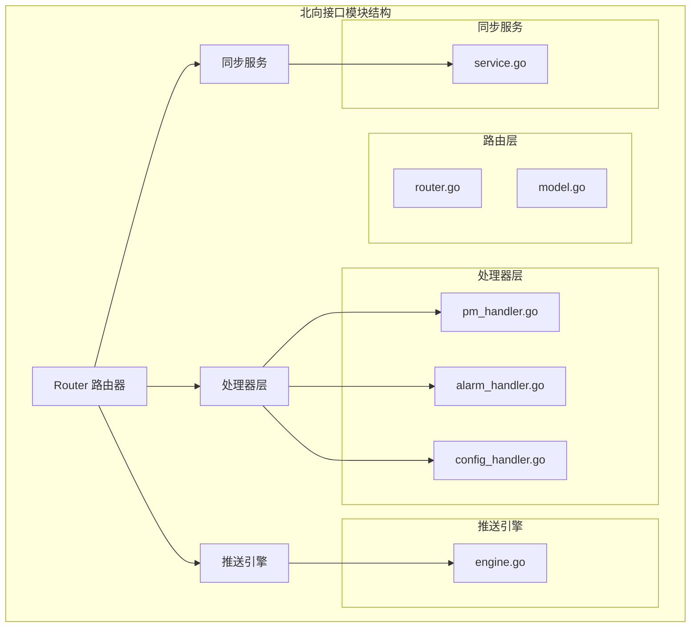
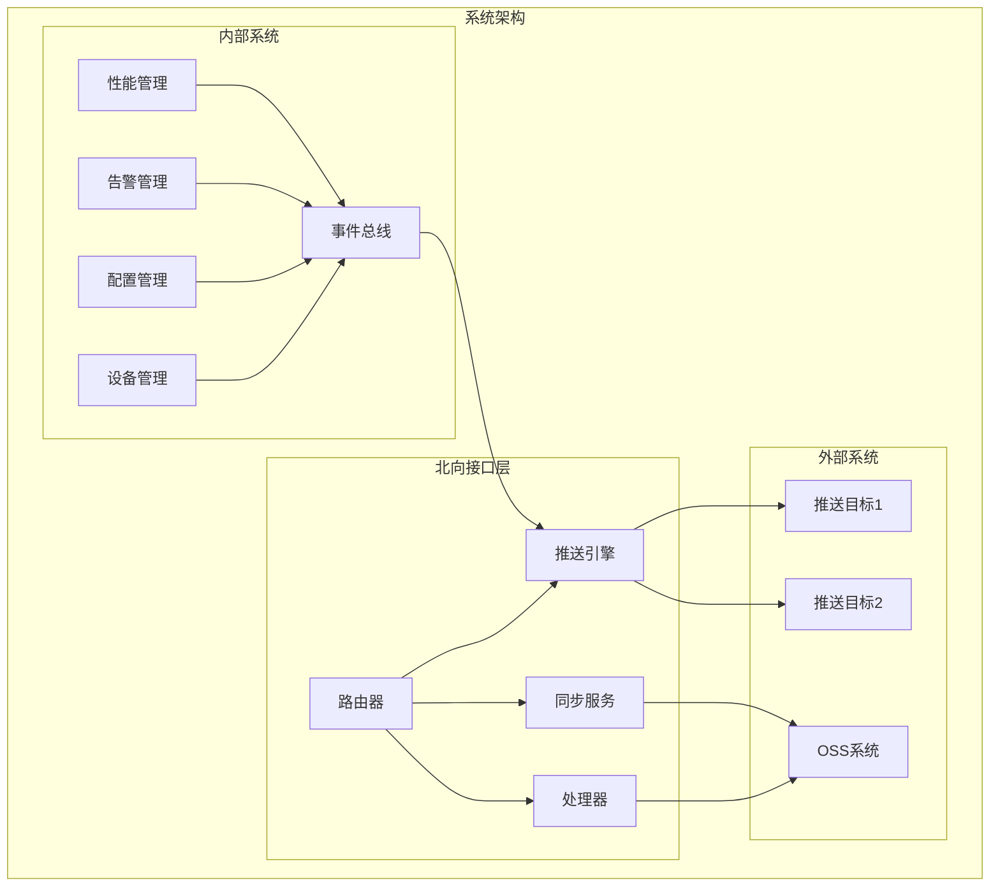
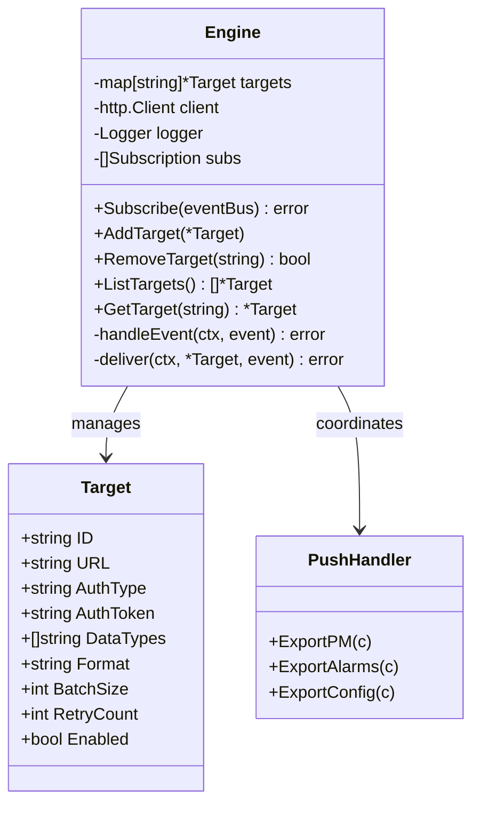
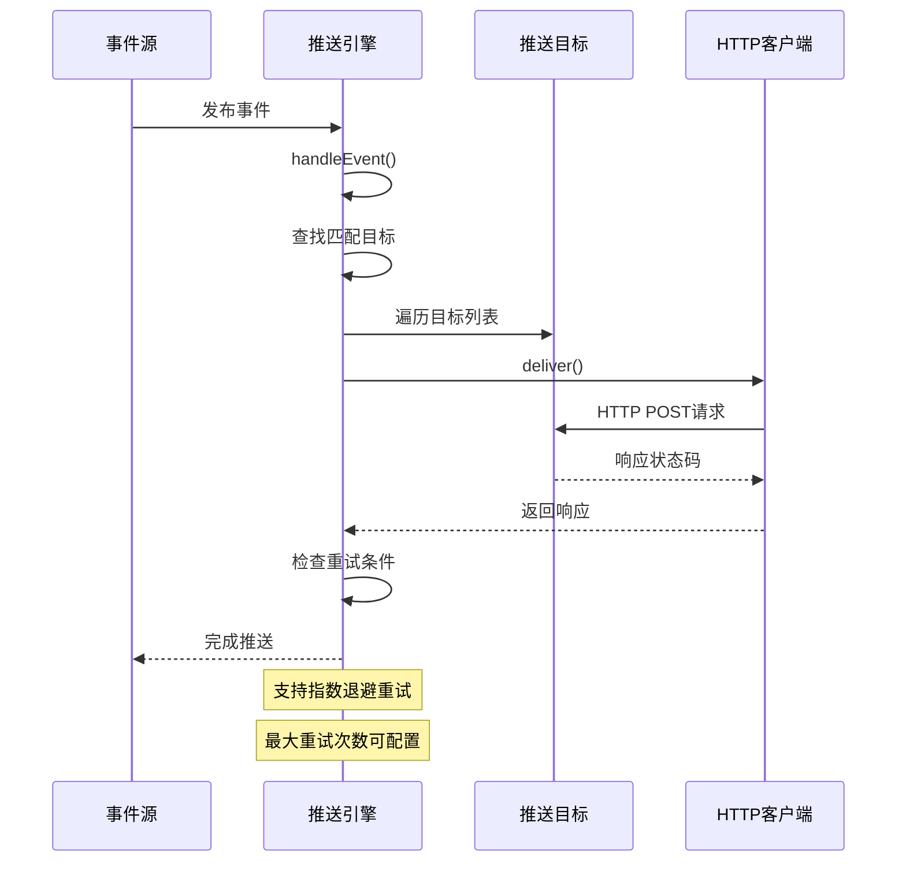
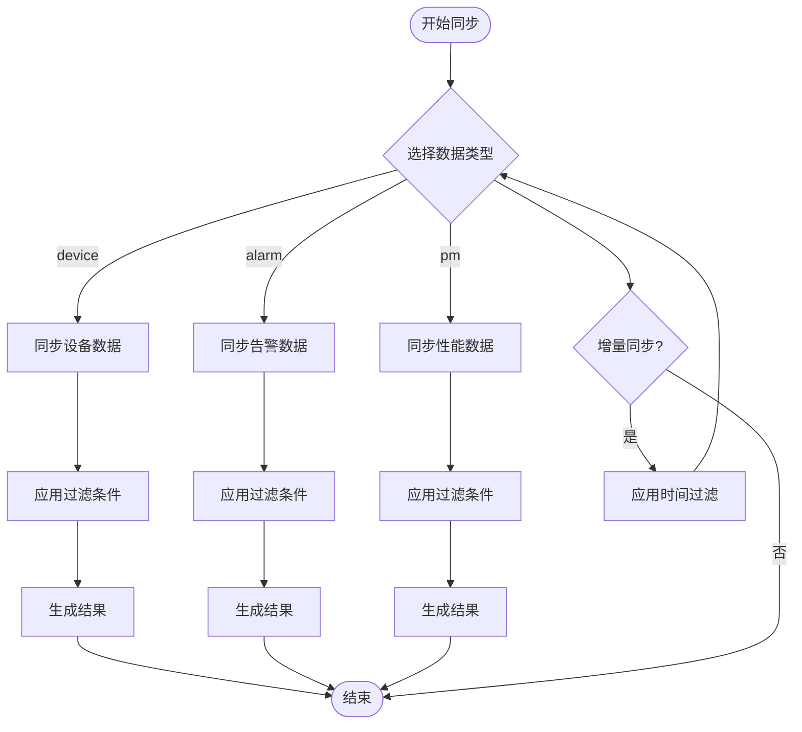
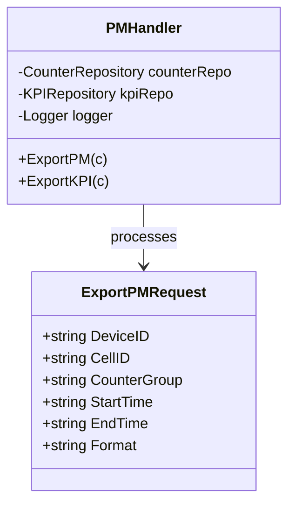
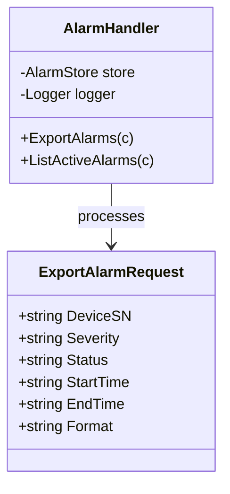
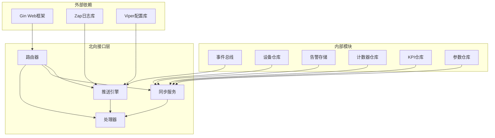

# 北向接口模块

<cite>
**本文档引用的文件**
- [router.go](file://omcgo/internal/northbound/router.go)
- [engine.go](file://omcgo/internal/northbound/push/engine.go)
- [service.go](file://omcgo/internal/northbound/sync/service.go)
- [model.go](file://omcgo/internal/northbound/model.go)
- [pm_handler.go](file://omcgo/internal/northbound/pm_handler.go)
- [alarm_handler.go](file://omcgo/internal/northbound/alarm_handler.go)
- [config_handler.go](file://omcgo/internal/northbound/config_handler.go)
- [config.go](file://omcgo/internal/core/appconfig/config.go)
</cite>

## 目录
1. [简介](#简介)
2. [项目结构](#项目结构)
3. [核心组件](#核心组件)
4. [架构概览](#架构概览)
5. [详细组件分析](#详细组件分析)
6. [依赖关系分析](#依赖关系分析)
7. [性能考虑](#性能考虑)
8. [故障排除指南](#故障排除指南)
9. [结论](#结论)
10. [附录](#附录)

## 简介

北向接口模块是联通规范数据推送的核心组件，负责将网管系统的性能数据、告警数据、配置数据推送到外部OSS（运营支撑系统）或进行同步。该模块实现了完整的协议转换和数据格式处理机制，支持多种数据类型的推送和同步，并提供了完善的错误处理和重试机制。

模块主要包含三个核心功能：
- **实时推送**：通过事件驱动的方式，将告警、性能、配置等数据实时推送到配置的目标系统
- **批量同步**：提供全量和增量的数据同步接口，支持设备、告警、性能数据的定期同步
- **数据导出**：支持按需的数据导出功能，满足不同场景下的数据需求

## 项目结构

北向接口模块采用清晰的分层架构设计，主要文件组织如下：



**图表来源**
- [router.go:1-126](file://omcgo/internal/northbound/router.go#L1-L126)
- [engine.go:1-262](file://omcgo/internal/northbound/push/engine.go#L1-L262)
- [service.go:1-180](file://omcgo/internal/northbound/sync/service.go#L1-L180)

**章节来源**
- [router.go:1-126](file://omcgo/internal/northbound/router.go#L1-L126)
- [engine.go:1-262](file://omcgo/internal/northbound/push/engine.go#L1-L262)
- [service.go:1-180](file://omcgo/internal/northbound/sync/service.go#L1-L180)

## 核心组件

### 路由路由器 (Router)

路由路由器负责注册和管理所有北向接口的HTTP端点，采用Gin框架实现RESTful API设计。

**主要功能**：
- 推送目标管理：支持推送目标的增删查操作
- 同步接口：提供全量和增量同步功能
- 导出接口：支持性能、告警、配置数据的导出

**路由定义**：
- `/northbound/push/targets`：推送目标管理
- `/northbound/sync/full`：全量同步
- `/northbound/sync/incremental`：增量同步
- `/northbound/export/pm`：性能数据导出
- `/northbound/export/alarms`：告警数据导出
- `/northbound/export/config/:deviceId`：配置数据导出

### 推送引擎 (Push Engine)

推送引擎是北向接口的核心组件，负责将事件数据推送到外部系统。

**关键特性**：
- **事件订阅**：订阅系统内部的OSS事件
- **多目标推送**：支持多个推送目标同时推送
- **重试机制**：指数退避重试策略
- **认证支持**：支持Bearer Token和Basic认证

### 同步服务 (Sync Service)

同步服务提供批量数据同步功能，支持全量和增量两种模式。

**支持的数据类型**：
- 设备信息同步
- 告警数据同步
- 性能数据同步

### 处理器层

处理器层包含专门的数据处理组件：

- **PM处理器**：处理性能管理和KPI导出
- **告警处理器**：处理告警数据导出和查询
- **配置处理器**：处理设备配置快照导出

**章节来源**
- [router.go:38-56](file://omcgo/internal/northbound/router.go#L38-L56)
- [engine.go:32-39](file://omcgo/internal/northbound/push/engine.go#L32-L39)
- [service.go:25-33](file://omcgo/internal/northbound/sync/service.go#L25-L33)

## 架构概览

北向接口模块采用事件驱动架构，实现了松耦合的设计模式：



**图表来源**
- [engine.go:59-77](file://omcgo/internal/northbound/push/engine.go#L59-L77)
- [router.go:39-55](file://omcgo/internal/northbound/router.go#L39-L55)

## 详细组件分析

### 推送引擎组件分析

推送引擎是整个北向接口模块的核心，负责将系统内部产生的事件数据推送到外部目标系统。



**图表来源**
- [engine.go:32-132](file://omcgo/internal/northbound/push/engine.go#L32-L132)
- [model.go:5-16](file://omcgo/internal/northbound/model.go#L5-L16)

#### 推送流程序列图



**图表来源**
- [engine.go:134-225](file://omcgo/internal/northbound/push/engine.go#L134-L225)

#### 数据推送流程

推送引擎实现了完整的事件处理流程：

1. **事件订阅**：订阅系统内部的OSS事件主题
2. **目标匹配**：根据事件类型筛选匹配的推送目标
3. **数据转换**：将事件数据转换为标准格式
4. **HTTP推送**：通过HTTP POST发送到目标URL
5. **重试处理**：失败时进行指数退避重试

**章节来源**
- [engine.go:134-225](file://omcgo/internal/northbound/push/engine.go#L134-L225)

### 同步服务组件分析

同步服务提供批量数据同步功能，支持全量和增量两种同步模式。

```mermaid
classDiagram
class Service {
-DeviceRepository deviceRepo
-AlarmStore alarmStore
-CounterRepository counterRepo
-KPIRepository kpiRepo
-DeviceParameterRepository paramRepo
+FullSync(ctx, string) *Result
+IncrementalSync(ctx, string, time) *Result
-syncDevices(ctx) *Result
-syncAlarms(ctx) *Result
-syncPM(ctx) *Result
-syncAlarmsSince(ctx, time) *Result
-syncPMSince(ctx, time) *Result
}
class Result {
+string DataType
+interface{} Items
+int Total
+time.Time SyncedAt
+bool Truncated
}
Service --> Result : returns
```

**图表来源**
- [service.go:25-52](file://omcgo/internal/northbound/sync/service.go#L25-L52)
- [service.go:16-23](file://omcgo/internal/northbound/sync/service.go#L16-L23)

#### 同步流程图



**图表来源**
- [service.go:54-78](file://omcgo/internal/northbound/sync/service.go#L54-L78)

**章节来源**
- [service.go:54-179](file://omcgo/internal/northbound/sync/service.go#L54-L179)

### 处理器组件分析

处理器层包含专门的数据处理组件，每个组件负责特定类型数据的导出和处理。

#### PM处理器分析

PM处理器负责性能数据的导出和查询：



**图表来源**
- [pm_handler.go:15-29](file://omcgo/internal/northbound/pm_handler.go#L15-L29)
- [model.go:34-42](file://omcgo/internal/northbound/model.go#L34-L42)

#### 告警处理器分析

告警处理器提供告警数据的导出和查询功能：



**图表来源**
- [alarm_handler.go:13-25](file://omcgo/internal/northbound/alarm_handler.go#L13-L25)
- [model.go:44-52](file://omcgo/internal/northbound/model.go#L44-L52)

**章节来源**
- [pm_handler.go:31-136](file://omcgo/internal/northbound/pm_handler.go#L31-L136)
- [alarm_handler.go:27-105](file://omcgo/internal/northbound/alarm_handler.go#L27-L105)
- [config_handler.go:26-49](file://omcgo/internal/northbound/config_handler.go#L26-L49)

## 依赖关系分析

北向接口模块的依赖关系体现了清晰的分层架构：



**图表来源**
- [engine.go:3-17](file://omcgo/internal/northbound/push/engine.go#L3-L17)
- [router.go:3-10](file://omcgo/internal/northbound/router.go#L3-L10)

**章节来源**
- [engine.go:3-17](file://omcgo/internal/northbound/push/engine.go#L3-L17)
- [router.go:3-10](file://omcgo/internal/northbound/router.go#L3-L10)

## 性能考虑

### 推送性能优化

推送引擎在设计时充分考虑了性能优化：

- **并发处理**：使用读写锁确保多目标推送的并发安全
- **HTTP连接复用**：共享HTTP客户端实例，减少连接开销
- **指数退避**：失败时采用指数退避策略，避免雪崩效应
- **超时控制**：设置合理的HTTP请求超时时间

### 同步性能优化

同步服务采用了多项性能优化措施：

- **分页查询**：默认每页100条记录，避免大数据量查询
- **时间范围限制**：性能数据默认查询最近24小时
- **条件过滤**：支持多种过滤条件，减少不必要的数据传输
- **结果截断标记**：通过`truncated`字段标识结果是否被截断

### 内存管理

- **目标缓存**：推送目标信息缓存在内存中，避免频繁磁盘访问
- **事件处理**：采用事件驱动模式，避免阻塞式调用
- **资源清理**：正确关闭HTTP响应体，释放网络资源

## 故障排除指南

### 常见问题及解决方案

#### 推送失败排查

1. **网络连接问题**
   - 检查目标URL是否可达
   - 验证防火墙设置
   - 确认网络延迟是否正常

2. **认证失败**
   - 验证认证类型配置
   - 检查认证令牌有效性
   - 确认目标系统认证配置

3. **重试机制**
   - 查看重试次数配置
   - 检查指数退避间隔
   - 监控重试日志输出

#### 同步数据异常

1. **数据量过大**
   - 调整分页大小
   - 使用更精确的时间范围
   - 应用更多过滤条件

2. **查询超时**
   - 优化数据库查询
   - 检查索引配置
   - 考虑数据归档策略

#### 配置管理问题

1. **推送目标配置**
   - 验证配置文件格式
   - 检查环境变量覆盖
   - 确认配置加载顺序

2. **路由配置**
   - 验证路由注册
   - 检查中间件配置
   - 确认权限设置

**章节来源**
- [engine.go:164-225](file://omcgo/internal/northbound/push/engine.go#L164-L225)
- [service.go:54-78](file://omcgo/internal/northbound/sync/service.go#L54-L78)

## 结论

北向接口模块通过事件驱动架构实现了联通规范数据的高效推送和同步。模块设计具有以下特点：

**架构优势**：
- 松耦合设计，各组件职责明确
- 事件驱动模式，支持实时数据推送
- 可扩展性好，支持新增数据类型

**功能完整性**：
- 支持三种核心数据类型的推送和同步
- 提供灵活的过滤和查询能力
- 完善的错误处理和重试机制

**性能保障**：
- 多项性能优化措施
- 合理的资源管理和内存控制
- 可配置的超时和重试策略

该模块为联通规范数据的集成提供了稳定可靠的技术基础，能够满足运营商复杂场景下的数据推送和同步需求。

## 附录

### 接口配置示例

#### 推送目标配置

```yaml
northbound:
  push_targets:
    - id: "oss-system-1"
      url: "https://oss.example.com/api/data"
      auth_type: "bearer"
      auth_token: "your-token-here"
      data_types: ["alarm", "pm", "config"]
      format: "json"
      batch_size: 100
      retry_count: 3
      enabled: true
```

#### 同步配置

```yaml
# 全量同步
GET /northbound/sync/full?data_type=device

# 增量同步
GET /northbound/sync/incremental?data_type=alarm&since=2024-01-01T00:00:00Z
```

### 数据格式说明

#### 推送事件格式

```json
{
  "event_id": "string",
  "subject": "string",
  "payload": {},
  "timestamp": "datetime"
}
```

#### 同步结果格式

```json
{
  "data_type": "string",
  "items": [],
  "total": 0,
  "synced_at": "datetime",
  "truncated": false
}
```

### 集成指南

#### 快速集成步骤

1. **配置推送目标**
   - 在配置文件中添加推送目标
   - 设置认证信息和数据类型
   - 验证目标URL可达性

2. **启动服务**
   - 启动北向接口服务
   - 监控服务日志
   - 验证路由注册

3. **测试连接**
   - 发送测试请求
   - 验证数据推送
   - 检查错误日志

#### 监控告警配置

- **日志级别**：建议设置为Info级别
- **性能监控**：启用Prometheus指标
- **健康检查**：配置定期健康检查
- **告警规则**：设置推送失败告警