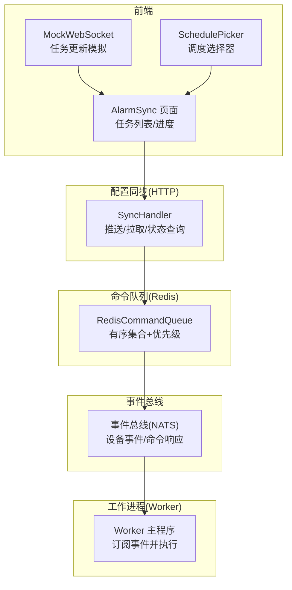
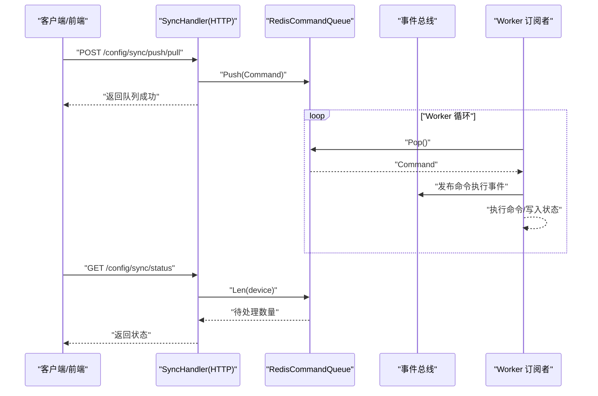
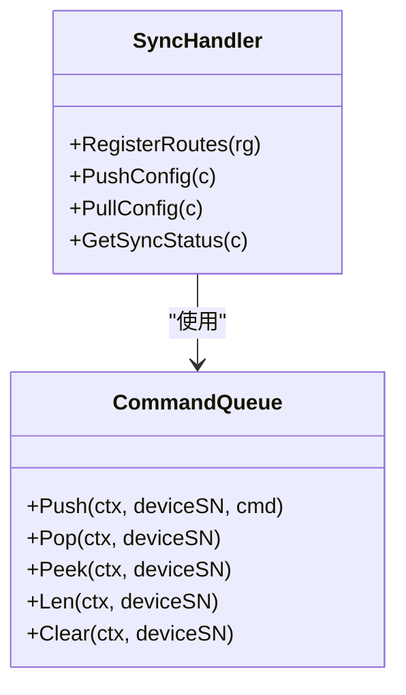
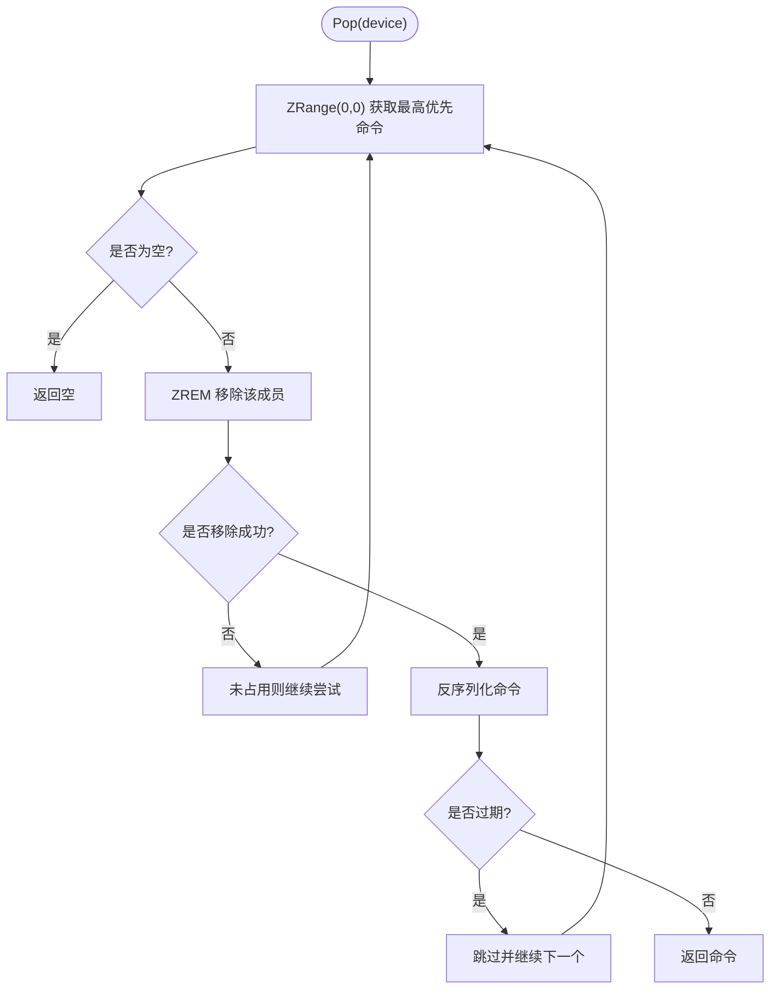
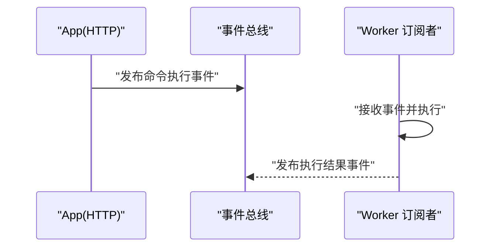
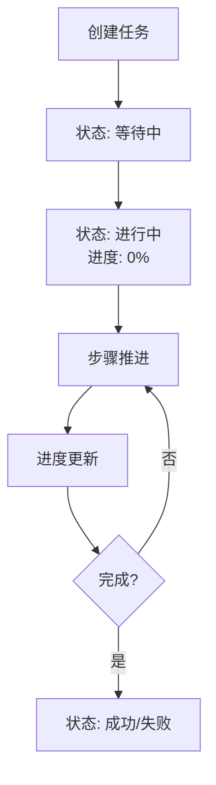
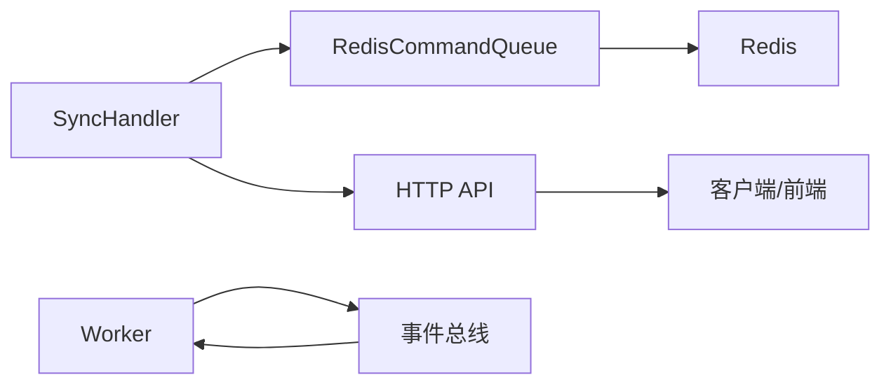

# 同步服务

<cite>
**本文引用的文件**
- [omcgo/internal/config/sync_handler.go](file://omcgo/internal/config/sync_handler.go)
- [omcgo/internal/config/sync_handler_test.go](file://omcgo/internal/config/sync_handler_test.go)
- [omcgo/internal/acs/cmdqueue/queue.go](file://omcgo/internal/acs/cmdqueue/queue.go)
- [omcgo/cmd/worker/main.go](file://omcgo/cmd/worker/main.go)
- [omcgo/internal/config/template/handler.go](file://omcgo/internal/config/template/handler.go)
- [omcgo/internal/config/datamodel/handler.go](file://omcgo/internal/config/datamodel/handler.go)
- [omcgo/internal/config/datamodel/importer.go](file://omcgo/internal/config/datamodel/importer.go)
- [omcgo/docs/design/session-design.md](file://omcgo/docs/design/session-design.md)
- [omcgo/docs/design/inform-handler-migration-evaluation.md](file://omcgo/docs/design/inform-handler-migration-evaluation.md)
- [omcgo/docs/reports/review-report/20260318/REVIEW_adc99fd_chenbo01_device.md](file://omcgo/docs/reports/review-report/20260318/REVIEW_adc99fd_chenbo01_device.md)
- [omcgo/docs/detailed-design/08-data-model-config.md](file://omcgo/docs/detailed-design/08-data-model-config.md)
- [omcmb/design/04-modules/04-alarm-management/08-alarm-sync.md](file://omcmb/design/04-modules/04-alarm-management/08-alarm-sync.md)
- [omcmb/webcode/src/pages/alarm/AlarmSync/index.tsx](file://omcmb/webcode/src/pages/alarm/AlarmSync/index.tsx)
- [omcmb/webcode/src/mock/websocket/taskWebSocket.ts](file://omcmb/webcode/src/mock/websocket/taskWebSocket.ts)
- [omcmb/design/02-components/05-data-entry/schedule-picker.md](file://omcmb/design/02-components/05-data-entry/schedule-picker.md)
- [omcmb/webcode/src/components/SchedulePicker/index.tsx](file://omcmb/webcode/src/components/SchedulePicker/index.tsx)
</cite>

## 目录
1. [简介](#简介)
2. [项目结构](#项目结构)
3. [核心组件](#核心组件)
4. [架构总览](#架构总览)
5. [详细组件分析](#详细组件分析)
6. [依赖分析](#依赖分析)
7. [性能考虑](#性能考虑)
8. [故障排查指南](#故障排查指南)
9. [结论](#结论)
10. [附录](#附录)

## 简介
本文件面向“同步服务”的技术文档，聚焦于配置参数的推送与拉取同步机制，以及与之配套的任务调度、状态跟踪与进度监控。同步服务覆盖以下能力：
- 定时同步：通过调度组件与事件总线联动，按日/周/月周期触发同步任务。
- 事件驱动同步：基于设备 Inform/RPC 响应事件，自动触发参数同步或状态更新。
- 手动触发同步：通过 HTTP 接口即时下发参数同步指令，并查询排队状态。

同步服务的关键在于命令队列的可靠性、事件驱动的解耦、以及前端进度与状态的实时反馈。本文将从架构、流程、数据结构、错误处理与性能优化等维度进行系统化阐述。

## 项目结构
围绕同步服务的相关模块与文件如下图所示：

图表来源
- [omcgo/internal/config/sync_handler.go:52-58](file://omcgo/internal/config/sync_handler.go#L52-L58)
- [omcgo/internal/acs/cmdqueue/queue.go:39-47](file://omcgo/internal/acs/cmdqueue/queue.go#L39-L47)
- [omcgo/cmd/worker/main.go:70-144](file://omcgo/cmd/worker/main.go#L70-L144)
- [omcmb/webcode/src/pages/alarm/AlarmSync/index.tsx:31-62](file://omcmb/webcode/src/pages/alarm/AlarmSync/index.tsx#L31-L62)
- [omcmb/webcode/src/mock/websocket/taskWebSocket.ts:47-197](file://omcmb/webcode/src/mock/websocket/taskWebSocket.ts#L47-L197)
- [omcmb/webcode/src/components/SchedulePicker/index.tsx:42-157](file://omcmb/webcode/src/components/SchedulePicker/index.tsx#L42-L157)

章节来源
- [omcgo/internal/config/sync_handler.go:1-157](file://omcgo/internal/config/sync_handler.go#L1-L157)
- [omcgo/internal/acs/cmdqueue/queue.go:1-135](file://omcgo/internal/acs/cmdqueue/queue.go#L1-L135)
- [omcgo/cmd/worker/main.go:1-161](file://omcgo/cmd/worker/main.go#L1-L161)
- [omcmb/webcode/src/pages/alarm/AlarmSync/index.tsx:31-62](file://omcmb/webcode/src/pages/alarm/AlarmSync/index.tsx#L31-L62)
- [omcmb/webcode/src/mock/websocket/taskWebSocket.ts:47-197](file://omcmb/webcode/src/mock/websocket/taskWebSocket.ts#L47-L197)
- [omcmb/webcode/src/components/SchedulePicker/index.tsx:42-157](file://omcmb/webcode/src/components/SchedulePicker/index.tsx#L42-L157)

## 核心组件
- 同步处理器（SyncHandler）
  - 提供配置推送/拉取与同步状态查询的 HTTP 接口，将命令入队至 Redis。
- 命令队列（RedisCommandQueue）
  - 基于 Redis 有序集合实现，支持优先级与过期控制，保证公平调度与幂等。
- 工作进程（Worker）
  - 订阅事件总线，从队列取出命令并执行，实现事件驱动的异步处理。
- 前端同步面板（AlarmSync）
  - 展示任务列表、状态与进度，支持手动创建任务与查看日志。
- 调度组件（SchedulePicker）
  - 支持按天/周/月的周期配置，生成 Cron 表达式并驱动定时任务。

章节来源
- [omcgo/internal/config/sync_handler.go:14-59](file://omcgo/internal/config/sync_handler.go#L14-L59)
- [omcgo/internal/acs/cmdqueue/queue.go:24-47](file://omcgo/internal/acs/cmdqueue/queue.go#L24-L47)
- [omcgo/cmd/worker/main.go:70-144](file://omcgo/cmd/worker/main.go#L70-L144)
- [omcmb/webcode/src/pages/alarm/AlarmSync/index.tsx:172-194](file://omcmb/webcode/src/pages/alarm/AlarmSync/index.tsx#L172-L194)
- [omcmb/webcode/src/components/SchedulePicker/index.tsx:42-157](file://omcmb/webcode/src/components/SchedulePicker/index.tsx#L42-L157)

## 架构总览
下图展示同步服务从请求到执行的端到端流程：

图表来源
- [omcgo/internal/config/sync_handler.go:62-135](file://omcgo/internal/config/sync_handler.go#L62-L135)
- [omcgo/internal/acs/cmdqueue/queue.go:49-110](file://omcgo/internal/acs/cmdqueue/queue.go#L49-L110)
- [omcgo/cmd/worker/main.go:115-126](file://omcgo/cmd/worker/main.go#L115-L126)

章节来源
- [omcgo/internal/config/sync_handler.go:62-156](file://omcgo/internal/config/sync_handler.go#L62-L156)
- [omcgo/internal/acs/cmdqueue/queue.go:49-130](file://omcgo/internal/acs/cmdqueue/queue.go#L49-L130)
- [omcgo/cmd/worker/main.go:115-126](file://omcgo/cmd/worker/main.go#L115-L126)

## 详细组件分析

### 同步处理器（SyncHandler）
- 职责
  - 推送参数：将 SetParameterValues 命令入队。
  - 拉取参数：将 GetParameterValues 命令入队。
  - 查询状态：返回设备命令队列长度（待处理数）。
- 关键点
  - 输入校验与错误处理统一通过公共错误模块返回。
  - 命令序列化后入队，返回命令 ID 便于追踪。
- 测试覆盖
  - 路由匹配、参数校验、入队成功与错误路径均有单元测试。

图表来源
- [omcgo/internal/config/sync_handler.go:14-59](file://omcgo/internal/config/sync_handler.go#L14-L59)
- [omcgo/internal/acs/cmdqueue/queue.go:24-31](file://omcgo/internal/acs/cmdqueue/queue.go#L24-L31)

章节来源
- [omcgo/internal/config/sync_handler.go:62-156](file://omcgo/internal/config/sync_handler.go#L62-L156)
- [omcgo/internal/config/sync_handler_test.go:75-230](file://omcgo/internal/config/sync_handler_test.go#L75-L230)

### 命令队列（RedisCommandQueue）
- 数据结构
  - 使用 Redis ZSET 存储命令，score 组合优先级与时间戳，实现同优先级内的 FIFO。
- 核心能力
  - Push：序列化命令并插入队列。
  - Pop：循环尝试弹出未过期且未被并发消费者占用的命令。
  - Peek/Len/Clear：用于状态查询与运维。
- 异常与并发
  - 通过多次尝试避免“空窗”；过期命令跳过；并发弹出通过 ZREM 返回判断。

图表来源
- [omcgo/internal/acs/cmdqueue/queue.go:74-110](file://omcgo/internal/acs/cmdqueue/queue.go#L74-L110)

章节来源
- [omcgo/internal/acs/cmdqueue/queue.go:49-130](file://omcgo/internal/acs/cmdqueue/queue.go#L49-L130)

### 工作进程（Worker）与事件驱动
- Worker 订阅
  - PM/MR/告警/传输桥/备份执行器等均以事件驱动方式订阅与处理。
- 与同步的关系
  - 同步命令经由事件总线传播，Worker 订阅者消费并执行，实现真正的异步解耦。
- 设计依据
  - 文档指出 InformHandler 不迁移至 Worker，应保留在 App，以避免事件级联带来的时序依赖问题；同步命令同样采用事件驱动，保持模块边界清晰。

图表来源
- [omcgo/cmd/worker/main.go:70-144](file://omcgo/cmd/worker/main.go#L70-L144)
- [omcgo/docs/design/session-design.md:438-475](file://omcgo/docs/design/session-design.md#L438-L475)
- [omcgo/docs/design/inform-handler-migration-evaluation.md:1-27](file://omcgo/docs/design/inform-handler-migration-evaluation.md#L1-L27)
- [omcgo/docs/reports/review-report/20260318/REVIEW_adc99fd_chenbo01_device.md:39-46](file://omcgo/docs/reports/review-report/20260318/REVIEW_adc99fd_chenbo01_device.md#L39-L46)

章节来源
- [omcgo/cmd/worker/main.go:70-144](file://omcgo/cmd/worker/main.go#L70-L144)
- [omcgo/docs/design/session-design.md:438-475](file://omcgo/docs/design/session-design.md#L438-L475)
- [omcgo/docs/design/inform-handler-migration-evaluation.md:1-27](file://omcgo/docs/design/inform-handler-migration-evaluation.md#L1-L27)
- [omcgo/docs/reports/review-report/20260318/REVIEW_adc99fd_chenbo01_device.md:39-46](file://omcgo/docs/reports/review-report/20260318/REVIEW_adc99fd_chenbo01_device.md#L39-L46)

### 前端同步面板与进度监控
- AlarmSync 页面
  - 展示任务列表、状态、进度与操作（取消/重试/查看日志）。
  - 支持手动创建任务，初始状态为运行中，进度逐步推进。
- WebSocket 任务更新
  - 模拟任务生命周期：pending -> running -> success/failed。
  - 支持批量任务进度聚合，便于大范围同步的可视化监控。
- 调度选择器
  - 支持按天/周/月周期配置，生成 Cron 表达式，驱动定时同步任务。

图表来源
- [omcmb/webcode/src/pages/alarm/AlarmSync/index.tsx:31-62](file://omcmb/webcode/src/pages/alarm/AlarmSync/index.tsx#L31-L62)
- [omcmb/webcode/src/pages/alarm/AlarmSync/index.tsx:172-194](file://omcmb/webcode/src/pages/alarm/AlarmSync/index.tsx#L172-L194)
- [omcmb/webcode/src/mock/websocket/taskWebSocket.ts:47-197](file://omcmb/webcode/src/mock/websocket/taskWebSocket.ts#L47-L197)
- [omcmb/design/02-components/05-data-entry/schedule-picker.md:1-36](file://omcmb/design/02-components/05-data-entry/schedule-picker.md#L1-L36)
- [omcmb/webcode/src/components/SchedulePicker/index.tsx:42-157](file://omcmb/webcode/src/components/SchedulePicker/index.tsx#L42-L157)

章节来源
- [omcmb/webcode/src/pages/alarm/AlarmSync/index.tsx:31-62](file://omcmb/webcode/src/pages/alarm/AlarmSync/index.tsx#L31-L62)
- [omcmb/webcode/src/pages/alarm/AlarmSync/index.tsx:172-194](file://omcmb/webcode/src/pages/alarm/AlarmSync/index.tsx#L172-L194)
- [omcmb/webcode/src/mock/websocket/taskWebSocket.ts:47-197](file://omcmb/webcode/src/mock/websocket/taskWebSocket.ts#L47-L197)
- [omcmb/design/02-components/05-data-entry/schedule-picker.md:1-36](file://omcmb/design/02-components/05-data-entry/schedule-picker.md#L1-L36)
- [omcmb/webcode/src/components/SchedulePicker/index.tsx:42-157](file://omcmb/webcode/src/components/SchedulePicker/index.tsx#L42-L157)

### 配置模板与数据模型（支撑同步）
- 配置模板（ConfigTemplate）
  - 支持按运营商/制式/产品类目等维度存储参数模板，便于批量下发与一致性管理。
- 数据模型（DataModel）
  - 统一参数树与约束，支持导入/导出、激活/废弃、缓存刷新等操作。
- 与同步的关系
  - 模板与数据模型为同步提供“参数定义与版本化”的基础，确保推送/拉取的参数具备统一语义与约束。

章节来源
- [omcgo/internal/config/template/handler.go:22-32](file://omcgo/internal/config/template/handler.go#L22-L32)
- [omcgo/internal/config/datamodel/handler.go:30-53](file://omcgo/internal/config/datamodel/handler.go#L30-L53)
- [omcgo/docs/detailed-design/08-data-model-config.md:275-320](file://omcgo/docs/detailed-design/08-data-model-config.md#L275-L320)

## 依赖分析
- 组件耦合
  - SyncHandler 仅依赖 CommandQueue 接口，降低与具体存储实现的耦合。
  - Worker 通过事件总线与各订阅者解耦，提升可扩展性。
- 外部依赖
  - Redis：命令队列持久化与并发安全。
  - 事件总线：跨模块通信与解耦。
- 潜在风险
  - 队列堆积：需结合过期策略与容量监控。
  - 并发弹出竞争：Pop 的重试机制有效，但仍需关注高并发下的延迟。

图表来源
- [omcgo/internal/config/sync_handler.go:14-26](file://omcgo/internal/config/sync_handler.go#L14-L26)
- [omcgo/internal/acs/cmdqueue/queue.go:39-47](file://omcgo/internal/acs/cmdqueue/queue.go#L39-L47)
- [omcgo/cmd/worker/main.go:115-126](file://omcgo/cmd/worker/main.go#L115-L126)

章节来源
- [omcgo/internal/config/sync_handler.go:14-26](file://omcgo/internal/config/sync_handler.go#L14-L26)
- [omcgo/internal/acs/cmdqueue/queue.go:39-47](file://omcgo/internal/acs/cmdqueue/queue.go#L39-L47)
- [omcgo/cmd/worker/main.go:115-126](file://omcgo/cmd/worker/main.go#L115-L126)

## 性能考虑
- 队列性能
  - Redis ZSET 的 Push/Pop/Peek 均为 O(log N)，适合高吞吐命令队列。
  - 通过优先级与时间戳组合，避免饥饿并保证公平性。
- 并发与一致性
  - Pop 的循环尝试与 ZREM 返回值确保并发安全；建议配合过期时间避免无限等待。
- 前端体验
  - 进度更新频率建议控制在合理区间（如每 500ms），避免频繁渲染。
- 扩展性
  - 事件驱动架构便于新增订阅者与处理逻辑，无需修改核心同步链路。

## 故障排查指南
- 常见问题定位
  - HTTP 请求失败：检查输入参数绑定与错误码映射。
  - 队列无响应：确认 Redis 是否可用、Key 命名是否一致、Pop 是否被阻塞。
  - Worker 未执行：检查事件总线订阅是否成功、日志级别与过滤条件。
- 建议排查步骤
  - 通过状态接口获取待处理数量，确认命令是否入队。
  - 查看 Worker 日志，确认事件是否到达与执行是否成功。
  - 若出现大量失败，检查设备在线状态与网络连通性。
- 相关文档参考
  - 事件驱动与 Inform 处理的设计文档，有助于理解事件级联与订阅者职责划分。

章节来源
- [omcgo/internal/config/sync_handler.go:137-156](file://omcgo/internal/config/sync_handler.go#L137-L156)
- [omcgo/internal/acs/cmdqueue/queue.go:74-110](file://omcgo/internal/acs/cmdqueue/queue.go#L74-L110)
- [omcgo/cmd/worker/main.go:115-126](file://omcgo/cmd/worker/main.go#L115-L126)
- [omcgo/docs/design/session-design.md:438-475](file://omcgo/docs/design/session-design.md#L438-L475)

## 结论
同步服务通过“HTTP 接口 + 命令队列 + 事件驱动 + 前端进度”的完整闭环，实现了配置参数的可靠推送与拉取。其关键优势在于：
- 解耦：接口层与执行层通过事件总线解耦，便于扩展与维护。
- 可靠：Redis 有序集合提供公平调度与过期控制，保障高并发下的稳定性。
- 可视化：前端提供进度与状态展示，便于用户感知与操作。

## 附录

### 同步接口定义（摘要）
- 推送配置
  - POST /api/v1/config/sync/push/:deviceId
  - Body：参数数组（名称、值、类型）
- 拉取配置
  - POST /api/v1/config/sync/pull/:deviceId
  - Body：参数名数组
- 查询状态
  - GET /api/v1/config/sync/status/:deviceId
  - 返回：设备 ID 与待处理命令数

章节来源
- [omcgo/internal/config/sync_handler.go:52-58](file://omcgo/internal/config/sync_handler.go#L52-L58)
- [omcgo/internal/config/sync_handler.go:62-156](file://omcgo/internal/config/sync_handler.go#L62-L156)

### 任务状态与操作（前端）
- 状态：等待中、进行中、完成、失败、已取消
- 操作：取消、重试、查看日志
- 进度：百分比、已/进行/等待/失败统计、预估剩余时间

章节来源
- [omcmb/design/04-modules/04-alarm-management/08-alarm-sync.md:107-170](file://omcmb/design/04-modules/04-alarm-management/08-alarm-sync.md#L107-L170)
- [omcmb/webcode/src/pages/alarm/AlarmSync/index.tsx:31-62](file://omcmb/webcode/src/pages/alarm/AlarmSync/index.tsx#L31-L62)