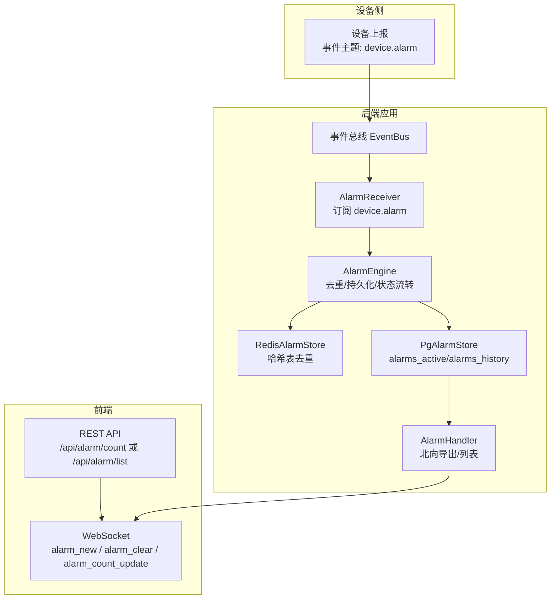
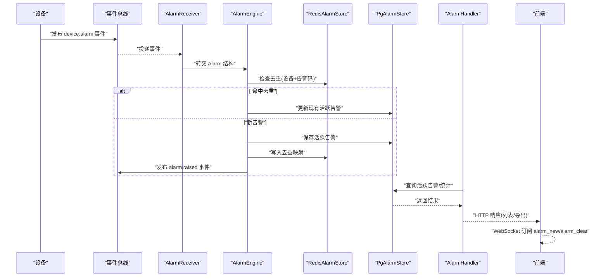
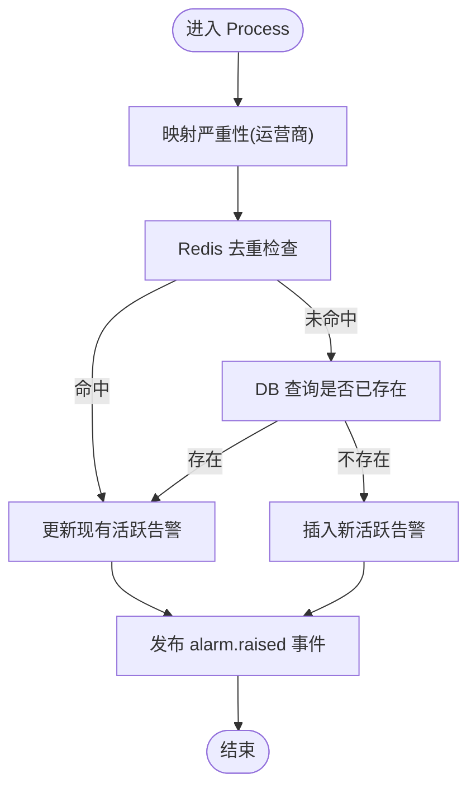
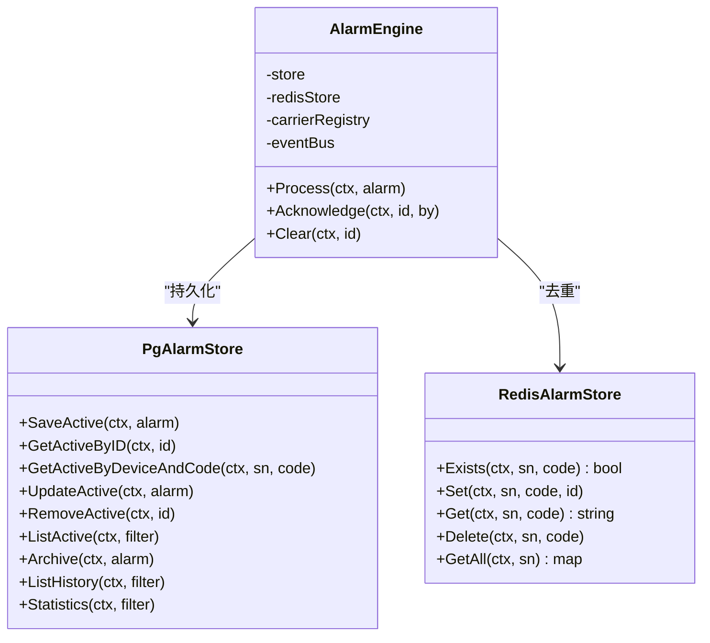
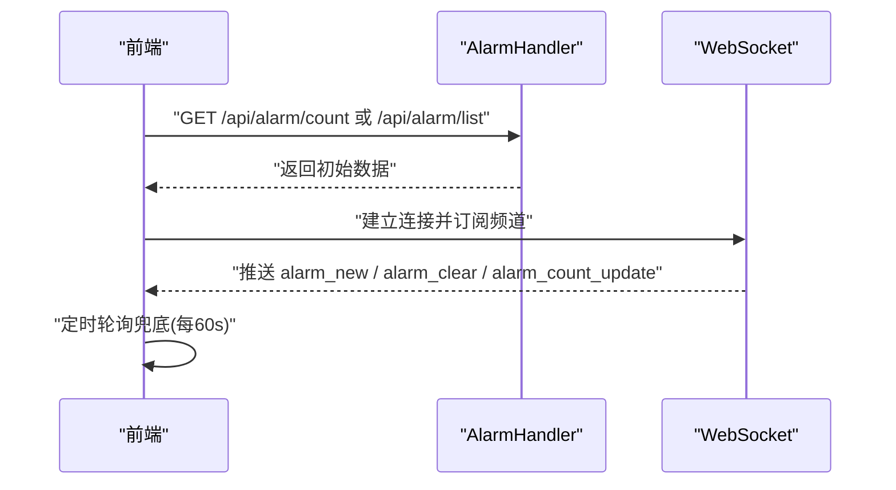
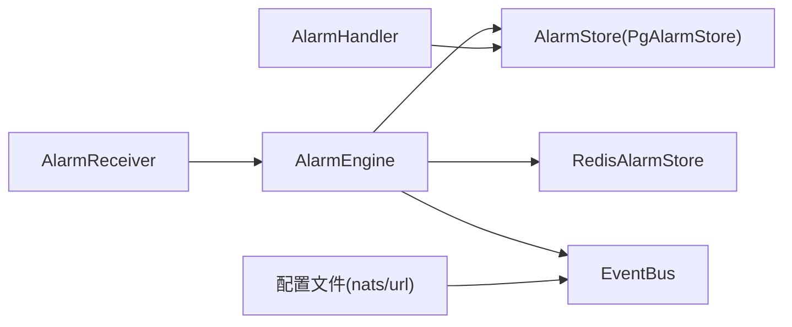

# 告警数据推送

<cite>
**本文引用的文件**   
- [engine.go](file://omcgo/internal/alarm/engine.go)
- [receiver.go](file://omcgo/internal/alarm/receiver.go)
- [store.go](file://omcgo/internal/alarm/store.go)
- [pg_store.go](file://omcgo/internal/alarm/pg_store.go)
- [redis_store.go](file://omcgo/internal/alarm/redis_store.go)
- [alarm_handler.go](file://omcgo/internal/northbound/alarm_handler.go)
- [bus.go](file://omcgo/internal/core/event/bus.go)
- [config.dev.yaml](file://omcgo/cmd/app/etc/config.dev.yaml)
- [alarmApi.ts](file://omcmb/webcode/src/services/api/alarmApi.ts)
- [alarmWebSocket.ts](file://omcmb/webcode/src/mock/websocket/alarmWebSocket.ts)
- [alarm_status_bar.md](file://omcmb/design/04-modules/01-global-framework/04-alert-status-bar.md)
</cite>

## 目录
1. [简介](#简介)
2. [项目结构](#项目结构)
3. [核心组件](#核心组件)
4. [架构总览](#架构总览)
5. [详细组件分析](#详细组件分析)
6. [依赖分析](#依赖分析)
7. [性能考虑](#性能考虑)
8. [故障排除指南](#故障排除指南)
9. [结论](#结论)
10. [附录](#附录)

## 简介
本文件面向告警数据推送功能，系统性阐述从“告警接收—处理—转发”的完整链路，覆盖告警数据格式、推送频率、批量处理与错误重试、状态管理、去重策略与优先级处理，并提供配置项、监控指标与故障排除指南及集成示例与最佳实践。

## 项目结构
告警推送涉及后端事件总线、存储层、北向导出接口，以及前端 WebSocket 实时推送与 REST 兜底策略。关键路径如下：
- 后端：设备侧通过事件总线发布告警事件，AlarmReceiver 订阅并交由 AlarmEngine 处理；AlarmEngine 负责去重、持久化、状态变更与事件发布；PgAlarmStore/TimescaleDB 存储活跃与历史告警；Redis 作为 L1 缓存用于去重。
- 北向：AlarmHandler 提供活跃告警列表与导出能力，供第三方系统拉取。
- 前端：页面先 REST 获取初始计数/列表，再建立 WebSocket 订阅；模拟 WebSocket 演示了推送节奏与消息格式。

图表来源
- [receiver.go:37-49](file://omcgo/internal/alarm/receiver.go#L37-L49)
- [engine.go:42-134](file://omcgo/internal/alarm/engine.go#L42-L134)
- [pg_store.go:28-122](file://omcgo/internal/alarm/pg_store.go#L28-L122)
- [redis_store.go:24-46](file://omcgo/internal/alarm/redis_store.go#L24-L46)
- [alarm_handler.go:27-90](file://omcgo/internal/northbound/alarm_handler.go#L27-L90)
- [alarmApi.ts:6-53](file://omcmb/webcode/src/services/api/alarmApi.ts#L6-L53)
- [alarmWebSocket.ts:69-118](file://omcmb/webcode/src/mock/websocket/alarmWebSocket.ts#L69-L118)

章节来源
- [receiver.go:37-49](file://omcgo/internal/alarm/receiver.go#L37-L49)
- [engine.go:42-134](file://omcgo/internal/alarm/engine.go#L42-L134)
- [pg_store.go:28-122](file://omcgo/internal/alarm/pg_store.go#L28-L122)
- [redis_store.go:24-46](file://omcgo/internal/alarm/redis_store.go#L24-L46)
- [alarm_handler.go:27-90](file://omcgo/internal/northbound/alarm_handler.go#L27-L90)
- [alarmApi.ts:6-53](file://omcmb/webcode/src/services/api/alarmApi.ts#L6-L53)
- [alarmWebSocket.ts:69-118](file://omcmb/webcode/src/mock/websocket/alarmWebSocket.ts#L69-L118)

## 核心组件
- AlarmReceiver：订阅设备告警事件，解码并转交给 AlarmEngine。
- AlarmEngine：执行严重性映射、Redis 去重、数据库落盘、状态更新与事件发布。
- PgAlarmStore：基于 PostgreSQL/TimescaleDB 的活跃/历史告警读写与统计。
- RedisAlarmStore：以哈希表记录设备-告警码到告警 ID 的映射，实现 L1 去重。
- AlarmHandler（北向）：提供活跃告警列表与导出接口。
- EventBus 接口：定义发布/订阅与队列分组订阅能力。
- 前端 REST/WebSocket：REST 初次拉取+WebSocket 实时推送，带断线重连与兜底轮询。

章节来源
- [receiver.go:26-85](file://omcgo/internal/alarm/receiver.go#L26-L85)
- [engine.go:15-134](file://omcgo/internal/alarm/engine.go#L15-L134)
- [store.go:30-41](file://omcgo/internal/alarm/store.go#L30-L41)
- [pg_store.go:17-273](file://omcgo/internal/alarm/pg_store.go#L17-L273)
- [redis_store.go:10-51](file://omcgo/internal/alarm/redis_store.go#L10-L51)
- [alarm_handler.go:13-106](file://omcgo/internal/northbound/alarm_handler.go#L13-L106)
- [bus.go:5-26](file://omcgo/internal/core/event/bus.go#L5-L26)
- [alarmApi.ts:6-53](file://omcmb/webcode/src/services/api/alarmApi.ts#L6-L53)
- [alarmWebSocket.ts:69-118](file://omcmb/webcode/src/mock/websocket/alarmWebSocket.ts#L69-L118)

## 架构总览
告警推送采用“事件驱动 + 分层存储 + 北向导出 + 前端实时”的组合模式：
- 事件驱动：设备侧通过 EventBus 发布 device.alarm，AlarmReceiver 消费并交由 AlarmEngine。
- 分层存储：Redis 用于高频去重，PostgreSQL 存活跃告警，TimescaleDB 存历史告警。
- 北向导出：AlarmHandler 支持按条件导出现有活跃告警，便于第三方系统集成。
- 前端推送：REST 初次渲染 + WebSocket 实时推送，断线自动重连，定时轮询兜底。

图表来源
- [receiver.go:37-85](file://omcgo/internal/alarm/receiver.go#L37-L85)
- [engine.go:42-134](file://omcgo/internal/alarm/engine.go#L42-L134)
- [pg_store.go:28-122](file://omcgo/internal/alarm/pg_store.go#L28-L122)
- [redis_store.go:24-46](file://omcgo/internal/alarm/redis_store.go#L24-L46)
- [alarm_handler.go:27-90](file://omcgo/internal/northbound/alarm_handler.go#L27-L90)

## 详细组件分析

### 组件一：告警接收与处理（AlarmReceiver 与 AlarmEngine）
- 接收：AlarmReceiver 订阅 device.alarm 主题，解码为 AlarmPayload，构造 model.Alarm。
- 处理：AlarmEngine 执行以下步骤：
  - 严重性映射：根据运营商注册表将外部告警码映射为内部严重性。
  - 去重：优先使用 Redis 哈希表进行设备-告警码去重；若 Redis 不可用则回退至数据库查询。
  - 新增/更新：新告警写入 alarms_active；重复告警更新时间、严重性与描述。
  - 事件发布：成功处理后发布 alarm.raised/alarm.acknowledged/alarm.cleared 等事件。

图表来源
- [engine.go:42-134](file://omcgo/internal/alarm/engine.go#L42-L134)
- [receiver.go:51-85](file://omcgo/internal/alarm/receiver.go#L51-L85)

章节来源
- [receiver.go:26-85](file://omcgo/internal/alarm/receiver.go#L26-L85)
- [engine.go:42-134](file://omcgo/internal/alarm/engine.go#L42-L134)

### 组件二：存储层（PgAlarmStore 与 RedisAlarmStore）
- PgAlarmStore
  - 活跃告警：alarms_active 表，支持按设备、告警码、严重性、状态等过滤与分页。
  - 历史告警：alarms_history 表（TimescaleDB），按时间序列归档。
  - 统计：按严重性与类型聚合活跃告警数量。
- RedisAlarmStore
  - 使用哈希表记录 deviceSN -> alarmCode -> alarmID，实现 L1 去重与快速命中。

图表来源
- [pg_store.go:17-273](file://omcgo/internal/alarm/pg_store.go#L17-L273)
- [redis_store.go:10-51](file://omcgo/internal/alarm/redis_store.go#L10-L51)
- [engine.go:15-39](file://omcgo/internal/alarm/engine.go#L15-L39)

章节来源
- [pg_store.go:17-273](file://omcgo/internal/alarm/pg_store.go#L17-L273)
- [redis_store.go:10-51](file://omcgo/internal/alarm/redis_store.go#L10-L51)
- [store.go:30-41](file://omcgo/internal/alarm/store.go#L30-L41)

### 组件三：北向导出与前端推送
- 北向导出：AlarmHandler 提供活跃告警列表与导出接口，支持按设备序列号、严重性、状态、时间范围过滤。
- 前端推送：页面先通过 REST 获取当前告警计数或列表，随后建立 WebSocket 订阅；模拟 WebSocket 每隔数秒随机产生新增或清除事件，前端更新计数与列表。

图表来源
- [alarm_handler.go:27-90](file://omcgo/internal/northbound/alarm_handler.go#L27-L90)
- [alarmApi.ts:6-53](file://omcmb/webcode/src/services/api/alarmApi.ts#L6-L53)
- [alarmWebSocket.ts:69-118](file://omcmb/webcode/src/mock/websocket/alarmWebSocket.ts#L69-L118)
- [alarm_status_bar.md:140-152](file://omcmb/design/04-modules/01-global-framework/04-alert-status-bar.md#L140-L152)

章节来源
- [alarm_handler.go:27-90](file://omcgo/internal/northbound/alarm_handler.go#L27-L90)
- [alarmApi.ts:6-53](file://omcmb/webcode/src/services/api/alarmApi.ts#L6-L53)
- [alarmWebSocket.ts:69-118](file://omcmb/webcode/src/mock/websocket/alarmWebSocket.ts#L69-L118)
- [alarm_status_bar.md:111-152](file://omcmb/design/04-modules/01-global-framework/04-alert-status-bar.md#L111-L152)

## 依赖分析
- 组件耦合
  - AlarmReceiver 依赖 EventBus 与 AlarmEngine；AlarmEngine 依赖 AlarmStore、RedisAlarmStore、CarrierRegistry 与 EventBus。
  - AlarmHandler 仅依赖 AlarmStore，不直接参与事件发布，职责清晰。
- 外部依赖
  - PostgreSQL/TimescaleDB：存储活跃/历史告警。
  - Redis：L1 去重缓存。
  - NATS：事件总线（配置项见配置文件）。
- 可能的循环依赖
  - 当前模块间为单向依赖，未发现循环。

图表来源
- [receiver.go:26-49](file://omcgo/internal/alarm/receiver.go#L26-L49)
- [engine.go:15-39](file://omcgo/internal/alarm/engine.go#L15-L39)
- [pg_store.go:17-26](file://omcgo/internal/alarm/pg_store.go#L17-L26)
- [redis_store.go:10-18](file://omcgo/internal/alarm/redis_store.go#L10-L18)
- [bus.go:5-26](file://omcgo/internal/core/event/bus.go#L5-L26)
- [config.dev.yaml:40-43](file://omcgo/cmd/app/etc/config.dev.yaml#L40-L43)

章节来源
- [receiver.go:26-49](file://omcgo/internal/alarm/receiver.go#L26-L49)
- [engine.go:15-39](file://omcgo/internal/alarm/engine.go#L15-L39)
- [pg_store.go:17-26](file://omcgo/internal/alarm/pg_store.go#L17-L26)
- [redis_store.go:10-18](file://omcgo/internal/alarm/redis_store.go#L10-L18)
- [bus.go:5-26](file://omcgo/internal/core/event/bus.go#L5-L26)
- [config.dev.yaml:40-43](file://omcgo/cmd/app/etc/config.dev.yaml#L40-L43)

## 性能考虑
- 去重策略
  - Redis 哈希表 O(1) 命中，显著降低数据库压力；当 Redis 不可用时回退至数据库查询，保证正确性但增加延迟。
- 存储选择
  - 活跃告警使用 PostgreSQL，支持复杂过滤与分页；历史告警使用 TimescaleDB，具备时间序列优化。
- 并发与伸缩
  - AlarmReceiver 使用队列订阅，多实例可水平扩展；NATS 支持高吞吐事件传输。
- 前端推送
  - WebSocket 实时推送，REST 轮询兜底（每 60s），在弱网或断线场景下保障数据一致性。

章节来源
- [engine.go:58-100](file://omcgo/internal/alarm/engine.go#L58-L100)
- [pg_store.go:75-108](file://omcgo/internal/alarm/pg_store.go#L75-L108)
- [alarm_status_bar.md:148-151](file://omcmb/design/04-modules/01-global-framework/04-alert-status-bar.md#L148-L151)

## 故障排除指南
- 问题：告警未推送或延迟明显
  - 检查事件总线连接（NATS 地址与重连参数）。
  - 核对 AlarmReceiver 是否成功订阅 device.alarm。
  - 查看 AlarmEngine 处理日志，关注 Redis 去重失败回退路径。
- 问题：重复告警频繁出现
  - 检查 Redis 去重键是否正确写入与清理；确认 alarm_code 与 deviceSN 组合唯一性。
- 问题：北向导出为空或不一致
  - 核对 AlarmHandler 过滤参数与分页；确认 alarms_active 是否写入成功。
- 问题：前端 WebSocket 断线
  - 按“断线重连中/重连失败”状态提示进行排查；启用 REST 轮询兜底。

章节来源
- [config.dev.yaml:40-43](file://omcgo/cmd/app/etc/config.dev.yaml#L40-L43)
- [receiver.go:37-49](file://omcgo/internal/alarm/receiver.go#L37-L49)
- [engine.go:58-100](file://omcgo/internal/alarm/engine.go#L58-L100)
- [alarm_handler.go:27-90](file://omcgo/internal/northbound/alarm_handler.go#L27-L90)
- [alarm_status_bar.md:128-136](file://omcmb/design/04-modules/01-global-framework/04-alert-status-bar.md#L128-L136)

## 结论
该告警推送体系以事件驱动为核心，结合 Redis 去重与分层存储，既保证实时性又确保一致性；北向导出与前端 WebSocket 形成闭环，满足多场景集成需求。通过合理的配置与监控，可在高并发下稳定运行。

## 附录

### 告警数据格式与字段说明
- 后端事件负载（AlarmPayload）
  - 字段：device_id、device_sn、carrier、alarm_code、alarm_type、description、severity、raised_at、additional。
- 前端 API 映射（BackendAlarm）
  - 字段：id、device_id、device_sn、carrier、severity（数字）、alarm_type、alarm_code、description、status、raised_at、acknowledged_at、cleared_at、acknowledged_by、additional_info、created_at、updated_at。
- 前端展示模型（Alarm）
  - 字段：id、alarmCode、alarmName、severity、deviceSn、deviceName、neType、alarmContent、alarmTime、clearTime、duration、ackStatus、alarmSource、alarmLocation、alarmType、isActive。

章节来源
- [receiver.go:13-24](file://omcgo/internal/alarm/receiver.go#L13-L24)
- [alarmApi.ts:6-24](file://omcmb/webcode/src/services/api/alarmApi.ts#L6-L24)

### 推送频率与批量处理
- 推送频率
  - WebSocket：设备侧事件触发即时推送；模拟 WebSocket 每 3–8 秒随机产生一次事件。
  - 轮询兜底：前端每 60s 调用 REST 接口校准数据。
- 批量处理
  - 北向导出默认每页 100 条，支持按设备、严重性、状态、时间范围过滤。

章节来源
- [alarmWebSocket.ts:72-74](file://omcmb/webcode/src/mock/websocket/alarmWebSocket.ts#L72-L74)
- [alarm_status_bar.md:148-151](file://omcmb/design/04-modules/01-global-framework/04-alert-status-bar.md#L148-L151)
- [alarm_handler.go:35-70](file://omcgo/internal/northbound/alarm_handler.go#L35-L70)

### 错误重试与幂等
- Redis 去重失败回退：当 Redis 查询异常时，AlarmEngine 自动回退到数据库查询，避免重复写入。
- 事件幂等：AlarmEngine 在去重命中时仅更新时间、严重性与描述，确保多次到达的事件不会产生重复告警。

章节来源
- [engine.go:61-100](file://omcgo/internal/alarm/engine.go#L61-L100)

### 告警状态管理与优先级
- 状态流转
  - 新增：active。
  - 确认：acknowledged（可选）。
  - 清除：cleared，归档至历史表并移除 Redis 去重映射。
- 优先级处理
  - 通过运营商注册表将外部告警码映射为内部严重性（critical/major/minor/warning）。

章节来源
- [engine.go:136-224](file://omcgo/internal/alarm/engine.go#L136-L224)
- [engine.go:44-56](file://omcgo/internal/alarm/engine.go#L44-L56)

### 配置选项
- 事件总线（NATS）
  - url、max_reconnect、reconnect_wait。
- 数据库与 TimescaleDB
  - dsn、连接池参数、慢查询阈值。
- Redis
  - addrs、password、db、pool_size。
- 北向推送目标
  - northbound.push_targets（当前示例为空）。
- 日志与指标
  - log.level/format/output、metrics.port。

章节来源
- [config.dev.yaml:40-97](file://omcgo/cmd/app/etc/config.dev.yaml#L40-L97)

### 监控指标与可观测性
- 建议指标
  - 告警处理速率（QPS）、去重命中率、Redis 命中/未命中、数据库写入延迟、事件总线积压、WebSocket 连接数与断线次数。
- 日志
  - 关键路径：接收、去重、写库、事件发布、北向导出、前端推送。

章节来源
- [engine.go:117-131](file://omcgo/internal/alarm/engine.go#L117-L131)
- [pg_store.go:177-216](file://omcgo/internal/alarm/pg_store.go#L177-L216)
- [alarm_handler.go:62-69](file://omcgo/internal/northbound/alarm_handler.go#L62-L69)

### 集成示例与最佳实践
- 集成示例
  - 前端：先调用 REST 获取初始计数/列表，再建立 WebSocket 订阅；断线时按状态提示并自动重连；每 60s 轮询一次。
  - 北向：定期调用 AlarmHandler 导出接口，按设备/严重性/时间范围筛选。
- 最佳实践
  - 事件总线与存储均启用健康检查与慢查询日志。
  - Redis 去重键命名规范统一，清理策略明确。
  - 前端对 WebSocket 断线与心跳超时进行统一处理。
  - 北向消费者按需分页拉取，避免一次性大批次导致内存压力。

章节来源
- [alarm_status_bar.md:111-152](file://omcmb/design/04-modules/01-global-framework/04-alert-status-bar.md#L111-L152)
- [alarm_handler.go:27-90](file://omcgo/internal/northbound/alarm_handler.go#L27-L90)